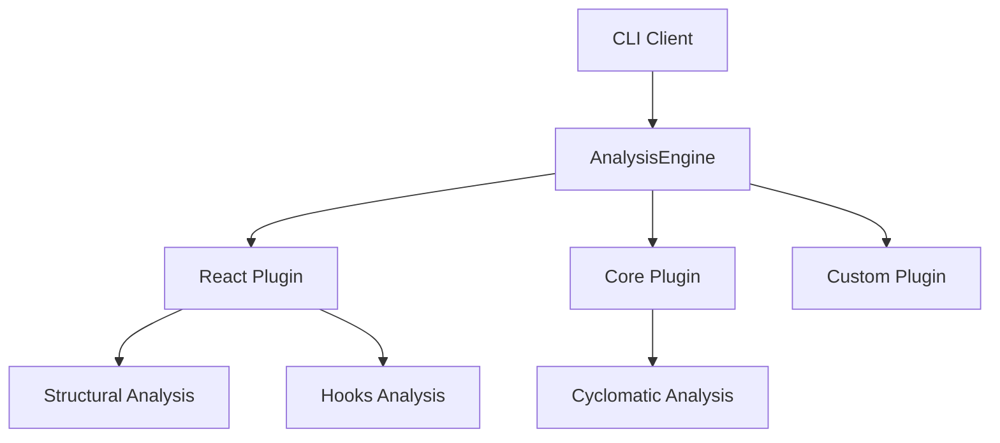
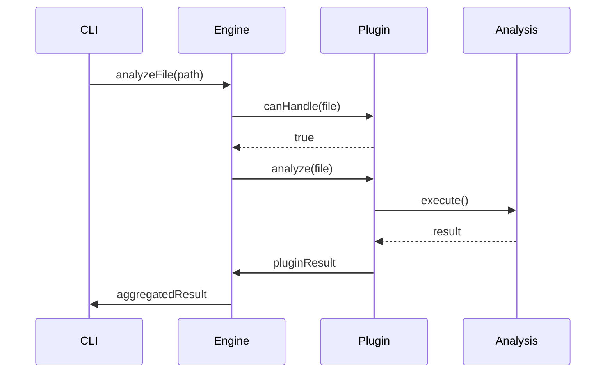

# Plugin Architecture

## Overview

Vipr v3 uses a plugin-based architecture that enables extensible, modular code analysis. This document describes the system design, component interactions, and design decisions.

## System Architecture



## Core Components

### AnalysisEngine

The `AnalysisEngine` is the central orchestrator that:

- Manages plugin registration
- Coordinates analysis execution
- Aggregates results from multiple plugins
- Handles caching and performance optimization

### ITechnologyPlugin

Technology plugins represent analyzers for specific frameworks or languages:

- React Analyzer (`@vipr/react`)
- Core Analyzer (`@vipr/core`)
- Future: Vue, Angular, etc.

### IAnalysis

Individual analysis units that perform specific checks:

- Structural Complexity
- Hook Complexity
- Temporal Complexity
- Coupling Analysis
- Identity Analysis
- Accessibility Analysis

## Data Flow



## Design Patterns

### Strategy Pattern

Formatters use the Strategy pattern to support multiple output formats:

```typescript
interface IFormatter {
  format(result: AggregatedResult): string;
}

class CliFormatter implements IFormatter { ... }
class JsonFormatter implements IFormatter { ... }
```

### Command Pattern

CLI commands use the Command pattern for extensibility:

```typescript
interface ICommand {
  execute(args: string[]): Promise<number>;
}

class AnalyzeCommand implements ICommand { ... }
```

### Plugin Pattern

The plugin system enables dynamic discovery and loading:

```typescript
interface ITechnologyPlugin {
  getAnalyses(): IAnalysis[];
  analyze(sourceFile: SourceFile): Promise<PluginResult>;
}
```

## Performance Characteristics

### Parallel Execution

The engine executes analyses in parallel when possible:

- Multiple plugins can run concurrently
- Analyses within a plugin can run in parallel
- File-level analysis is parallelized

### Caching

Two-level caching system:

- File-level cache for complete results
- Analysis-level cache for individual analysis results

### Cost-Based Scheduling

Analyses are scheduled based on execution cost:

- Low-cost analyses run first
- High-cost analyses run later
- Improves perceived performance

## Design Decisions

### Why Plugin Architecture?

- **Extensibility**: Easy to add new analyzers
- **Modularity**: Each plugin is independent
- **Testability**: Plugins can be tested in isolation
- **Performance**: Parallel execution of plugins

### Why IAnalysis Interface?

- **Granularity**: Fine-grained analysis units
- **Reusability**: Analyses can be shared across plugins
- **Testability**: Each analysis is independently testable
- **Configuration**: Individual analyses can be enabled/disabled

### Why Aggregated Results?

- **Flexibility**: Multiple plugins can analyze the same file
- **Composability**: Results from different sources are combined
- **Transparency**: Clear breakdown of results by plugin

## Future Enhancements

### Planned Features

1. **Plugin Discovery**: Automatic discovery of installed plugins
2. **Plugin Marketplace**: Share and distribute plugins
3. **Custom Rules**: User-defined analysis rules
4. **Incremental Analysis**: Only analyze changed files
5. **Language Server**: IDE integration

## Performance Benchmarks

### Analysis Speed

- Simple component: < 50ms
- Complex component: < 200ms
- Large codebase (100 files): < 5s

### Memory Usage

- Base engine: ~10MB
- Per plugin: ~2-5MB
- Per analysis: < 1MB

## Security Considerations

- Plugins run in the same process (trusted code only)
- No network access from plugins
- Input validation on all plugin interfaces
- Sandboxing for future untrusted plugins

## Contributing

See the [Plugin Development Guide](../guides/plugin-development.md) for details on creating plugins.
