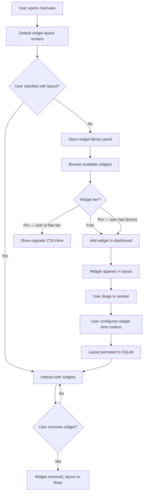
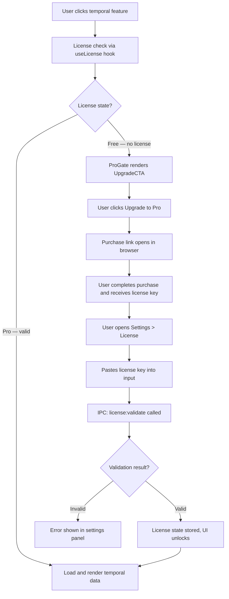
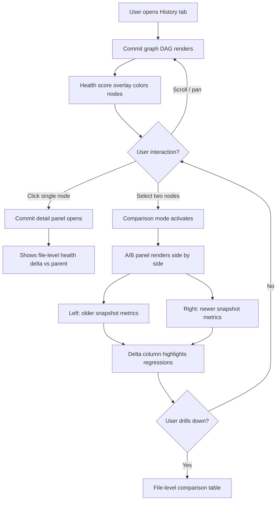
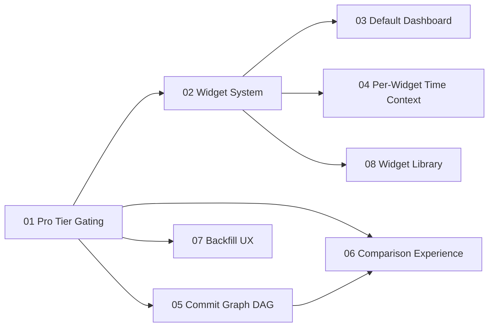

# Round Five Overview: Composable Intelligence & Pro Tier

## Executive Summary

Round Five transforms Vipr Desktop from a static, opinionated dashboard into a composable intelligence platform with a clear monetization boundary. Where Round Four established the temporal foundation—backfill, velocity, trend projections, and the commit browser—Round Five answers the question of _how should developers interact with that data, and who pays for what?_

Three pillars drive this round. The **Composable Dashboard** replaces the fixed overview page with a widget-based system: developers choose which metrics surface by default, arrange them spatially, and configure time context per widget. **Git Intelligence** surfaces the commit graph as a first-class interactive DAG with health overlays, and introduces an A/B comparison experience so developers can diff any two snapshots side by side. **Pro Tier Gating** draws the monetization boundary between spatial analysis (always free) and temporal analysis (one-time Pro purchase, Sublime Text model), wiring a cryptographic offline license validator into every gated feature path.

These pillars are deliberately sequenced: the Pro Tier infrastructure (Phase 01) is a hard prerequisite for all other phases because the widget system, Git Intelligence, and Backfill UX each carry free/pro flags that must resolve against a live license state at render time.

## Feature Pillar Table

| Pillar               | Phases     | Key Capability                                            | Agent Owner                                |
| -------------------- | ---------- | --------------------------------------------------------- | ------------------------------------------ |
| Pro Tier & UX        | 01, 07     | License gating, simplified backfill UX                    | typescript-engineer, react-engineer        |
| Composable Dashboard | 02, 03, 04 | Widget system, default dashboard, per-widget time context | react-engineer                             |
| Git Intelligence     | 05, 06     | Commit graph DAG with health overlay, A/B comparison      | react-engineer, data-visualization-analyst |

## User Story Inventory

| ID    | Title                        | Category             | Phase Doc                  | Owner                                      |
| ----- | ---------------------------- | -------------------- | -------------------------- | ------------------------------------------ |
| R5-01 | Pro Tier Feature Gating      | Infrastructure       | 01-pro-tier-gating         | typescript-engineer                        |
| R5-02 | Widget System Core           | Composable Dashboard | 02-widget-system           | react-engineer                             |
| R5-03 | Default Dashboard Layout     | Composable Dashboard | 03-default-dashboard       | react-engineer                             |
| R5-04 | Per-Widget Time Context      | Composable Dashboard | 04-per-widget-time-context | react-engineer                             |
| R5-05 | Commit Graph DAG             | Git Intelligence     | 05-commit-graph            | react-engineer, data-visualization-analyst |
| R5-06 | A/B Snapshot Comparison      | Git Intelligence     | 06-comparison-experience   | react-engineer, data-visualization-analyst |
| R5-07 | Simplified Backfill UX       | Pro Tier & UX        | 07-backfill-ux             | react-engineer                             |
| R5-08 | Widget Library & Persistence | Composable Dashboard | 08-widget-library          | react-engineer                             |

## User Flows

### Composable Dashboard Flow

### Pro Tier Flow

### Git Intelligence Flow

## Free vs Pro Feature Matrix

| Feature                                     | Free | Pro (one-time purchase) |
| ------------------------------------------- | ---- | ----------------------- |
| Live analysis (current HEAD)                | Yes  |                         |
| Overall health score                        | Yes  |                         |
| Issues & anti-patterns                      | Yes  |                         |
| File detail view                            | Yes  |                         |
| Dependencies graph                          | Yes  |                         |
| Static dashboard widgets                    | Yes  |                         |
| Historical backfill                         |      | Yes                     |
| Velocity dashboard                          |      | Yes                     |
| Trend projections (30/90-day)               |      | Yes                     |
| Commit graph with health overlay            |      | Yes                     |
| A/B snapshot comparison                     |      | Yes                     |
| Temporal dashboard widgets                  |      | Yes                     |
| Per-widget time context (backfilled ranges) |      | Yes                     |

## Critical Path Dependency Diagram

## Scope Boundaries

| In Round Five                                        | Deferred to Future                                           |
| ---------------------------------------------------- | ------------------------------------------------------------ |
| Offline cryptographic license validation             | Subscription / recurring billing model                       |
| Widget add/remove/reorder with layout persistence    | User-defined custom widget types                             |
| Per-widget time context selection                    | Cross-repository dashboard comparisons                       |
| Commit graph DAG with health score node overlay      | Full git blame attribution in graph                          |
| A/B snapshot comparison (any two commits)            | Three-way or branch-divergence comparison                    |
| Simplified backfill trigger from Pro gate CTA        | Automated regression bisection across commit range           |
| ProGate and UpgradeCTA reusable components           | In-app purchase flow (App Store / direct Stripe integration) |
| Feature flag registry with free/pro tier annotations | Dynamic feature flag updates from a remote config server     |

## Phase Verification Checklist

| Phase                      | Green-Light Criteria                                                                                                                  |
| -------------------------- | ------------------------------------------------------------------------------------------------------------------------------------- |
| 01 Pro Tier Gating         | License validator accepts valid key offline; invalid/tampered key rejected; IPC channels registered; ProGate renders CTA on free tier |
| 02 Widget System           | Widgets add/remove/reorder correctly; layout persists across app restart; pro-flagged widgets gated by license state                  |
| 03 Default Dashboard       | Default layout renders on first launch without user configuration; widgets display real data from existing analysis                   |
| 04 Per-Widget Time Context | Each widget can independently select a time range; pro widgets require license for historical ranges                                  |
| 05 Commit Graph DAG        | DAG renders for repositories with 100+ commits without frame drops; nodes colored by health score; parent edges drawn correctly       |
| 06 Comparison Experience   | Selecting two nodes opens A/B panel; delta column highlights regressions and improvements; file-level drill-down navigable            |
| 07 Backfill UX             | Simplified backfill trigger visible on Pro gate CTA; progress feedback shown; integrates with existing BackfillScheduler              |
| 08 Widget Library          | All available widgets listed with tier badge; search/filter works; adding a widget updates layout immediately                         |
