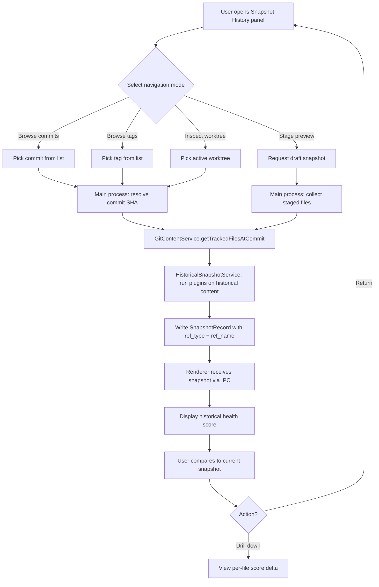
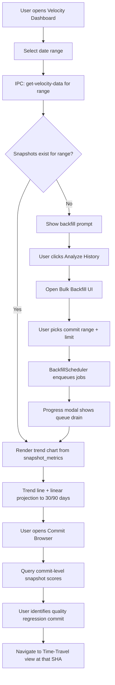
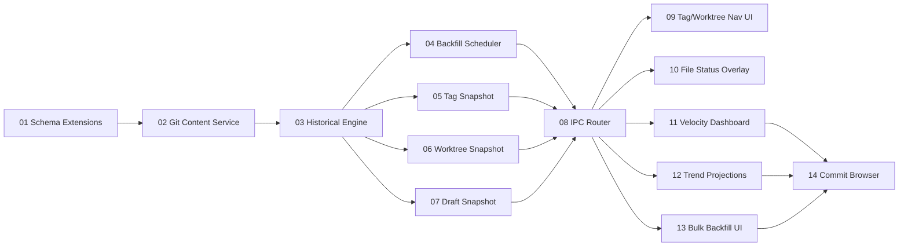

# Round Four Overview: Historical Git Analysis & Velocity Intelligence

## Executive Summary

Round Four transforms Vipr Desktop snapshots from point-in-time captures into a full temporal graph. Where previous rounds established foundational analysis (Round One), delivered multi-dimensional insights (Round Two), and added real-time monitoring with alerting (Round Three), Round Four answers the question developers most often ask: _how did we get here, and where are we headed?_ By walking backward through git history, navigating tags and worktrees, and capturing staged drafts, the engine can reconstruct the health trajectory of any file or directory across any time horizon.

The second pillar—Velocity Intelligence—surfaces actionable trends from that history. Developers can project where the codebase is headed, query a commit browser to pinpoint when quality degraded, and trigger bulk historical backfill with a single UI action. Together these pillars convert Vipr from a static health dashboard into a continuous intelligence system that is grounded in real version-control history rather than synthetic sampling.

## Feature Pillar Table

| Pillar                | Phases                     | Key Capability                                   | Agent Owner                                |
| --------------------- | -------------------------- | ------------------------------------------------ | ------------------------------------------ |
| Git Time-Travel       | 01, 02, 03, 05, 06, 07, 08 | Walk history, tag/worktree/draft snapshots       | filesystem-specialist, database-engineer   |
| Velocity Intelligence | 04, 09, 10, 11, 12, 13, 14 | Trend projections, commit browser, bulk backfill | react-engineer, data-visualization-analyst |

## User Story Inventory

| ID    | Title                                | Category        | Phase Doc                     | Owner                                      |
| ----- | ------------------------------------ | --------------- | ----------------------------- | ------------------------------------------ |
| R4-01 | Schema Extensions (Migrations 15–17) | Data Layer      | 01-schema-extensions          | database-engineer                          |
| R4-02 | Git Content Retrieval Service        | Data Layer      | 02-git-content-service        | filesystem-specialist                      |
| R4-03 | Historical Analysis Engine           | Core Engine     | 03-historical-analysis-engine | filesystem-specialist                      |
| R4-04 | Backfill Scheduler                   | Core Engine     | 04-backfill-scheduler         | filesystem-specialist                      |
| R4-05 | Tag Snapshot Analysis                | Git Time-Travel | 05-tag-snapshot-analysis      | filesystem-specialist                      |
| R4-06 | Worktree Snapshot Analysis           | Git Time-Travel | 06-worktree-snapshot-analysis | filesystem-specialist                      |
| R4-07 | Draft Snapshot (Staged Files)        | Git Time-Travel | 07-draft-snapshot-staged      | filesystem-specialist                      |
| R4-08 | Time-Travel IPC Router               | IPC / Bridge    | 08-time-travel-ipc-router     | typescript-engineer                        |
| R4-09 | Tag & Worktree Navigation UI         | Frontend        | 09-tag-worktree-nav-ui        | react-engineer                             |
| R4-10 | Historical File Status Overlay       | Frontend        | 10-historical-file-status     | react-engineer                             |
| R4-11 | Velocity Dashboard                   | Frontend        | 11-velocity-dashboard         | react-engineer, data-visualization-analyst |
| R4-12 | Trend Projections                    | Frontend        | 12-trend-projections          | data-visualization-analyst                 |
| R4-13 | Bulk Historical Backfill UI          | Frontend        | 13-bulk-backfill-ui           | react-engineer                             |
| R4-14 | Commit Browser                       | Frontend        | 14-commit-browser             | react-engineer                             |

## User Flows

### Time-Travel Flow

### Velocity Intelligence Flow

## Critical Path Dependency Diagram

## Scope Boundaries

| In Round Four                                      | Deferred to Future                       |
| -------------------------------------------------- | ---------------------------------------- |
| Commit, tag, worktree, and draft snapshot types    | Cross-repository health comparison       |
| Backfill scheduler with configurable depth         | PR-triggered analysis in CI pipelines    |
| Velocity dashboard with trend chart                | Blame-level authorship attribution       |
| Linear trend projections (30/90-day)               | Branch divergence tracking               |
| Commit browser with health score per commit        | Statistical anomaly detection (ML-based) |
| Bulk historical analysis UI with progress modal    | Automated regression bisection           |
| Historical file status overlay in file detail view | Custom projection models (non-linear)    |

## Phase Verification Checklist

Each phase is considered complete when all criteria in its column are satisfied:

| Phase                  | Green-Light Criteria                                                                                                           |
| ---------------------- | ------------------------------------------------------------------------------------------------------------------------------ |
| 01 Schema Extensions   | Migrations 15–17 run cleanly from v14; draft uniqueness test passes; worktree coexistence test passes                          |
| 02 Git Content Service | SHA validation rejects invalid inputs; tag parsing handles both lightweight and annotated; batching test verifies chunks of 10 |
| 03 Historical Engine   | Full snapshot created for HEAD−1 with correct file count; per-file plugin results stored in snapshot_files                     |
| 04 Backfill Scheduler  | Queue drains in priority order; cancellation token halts in-progress job; progress events emitted per commit                   |
| 05 Tag Snapshot        | Tag SHA resolved correctly for annotated tags; snapshot written with ref_type='tag' and ref_name                               |
| 06 Worktree Snapshot   | Snapshot written with ref_type='worktree' and worktree_path; does not overwrite main-tree snapshot at same SHA                 |
| 07 Draft Snapshot      | Staged file content retrieved via git show :path; is_draft=1 set; duplicate drafts at same SHA allowed                         |
| 08 IPC Router          | All new IPC channels registered; main-process handlers return typed responses; error cases return structured error             |
| 09 Tag/Worktree Nav UI | Tag list renders with snapshot status badge; clicking tag triggers time-travel; worktree switcher shows active worktrees       |
| 10 File Status Overlay | Historical panel shows score delta vs current; missing files shown as removed                                                  |
| 11 Velocity Dashboard  | Chart renders from real snapshot_metrics data; empty-state triggers backfill prompt                                            |
| 12 Trend Projections   | 30-day and 90-day projections render as dashed line; extrapolation respects 0–100 clamp                                        |
| 13 Bulk Backfill UI    | Job list shows pending/running/completed state; cancel button sends cancellation token                                         |
| 14 Commit Browser      | Commit list renders with health score per row; clicking commit navigates to time-travel view                                   |
