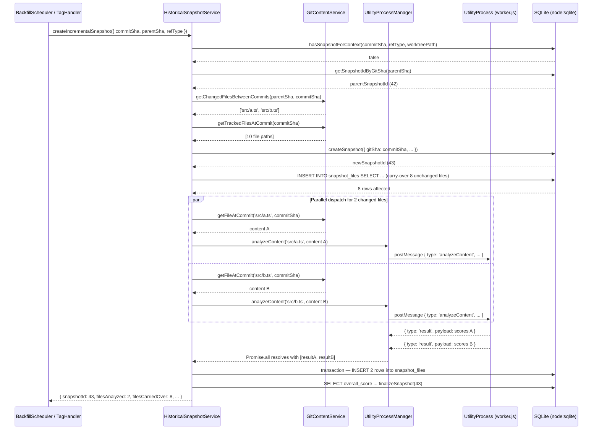

# Historical Snapshot Analysis Engine

## Problem Statement

`SnapshotService.createSnapshot()` reads only the current working tree by querying `db.getAllFiles()` — files that the current foreground analysis has already ingested. There is no mechanism to walk git history, retrieve historical file content via `git show`, and build snapshots for past commits.

The foreground analysis pipeline already has a well-designed concurrency model: `UtilityProcessManager` dispatches async requests (with UUID tracking and pending-promise maps) to a single Electron utility process that hosts all plugin logic. `HistoricalSnapshotService` reuses this same pipeline rather than constructing its own engine instance. This gives historical analysis the same execution environment as foreground analysis, for free.

A new `analyzeContent` message type must be added to `UtilityProcessMessage` (see "Protocol Extension" below) to allow passing virtual file content from `git show` into the existing utility process. The `GitContentService` (Phase 02) provides content retrieval. `HistoricalSnapshotService` orchestrates both into a complete, incremental snapshot pipeline.

Within each commit, all changed files are dispatched in parallel via `Promise.all` — the utility process serializes requests internally, so there is no overload risk, and parallelism eliminates the per-file round-trip latency that would dominate a sequential loop.

## New File

`clients/desktop/src/main/analysis/historical-snapshot-service.ts`

## Protocol Extension: `analyzeContent` Message

Before `HistoricalSnapshotService` can be implemented, the utility process message schema must be extended with a new `analyzeContent` type. This is a small, focused change to three existing files.

**`clients/desktop/src/shared/ipc/schemas.ts`** — add alongside `AnalyzeMessageSchema`:

```typescript
export const AnalyzeContentMessageSchema = z.object({
  id: z.string().uuid(),
  type: z.literal('analyzeContent'),
  payload: z.object({
    /** Repo-relative file path — used for plugin detection (file extension, directory). */
    filePath: z.string().min(1).max(4096),
    /** Full file content as a UTF-8 string from git show. */
    content: z.string(),
  }),
});
```

Add `AnalyzeContentMessageSchema` to the `UtilityProcessMessageSchema` discriminated union. The response reuses the existing `AnalyzeResponseSchema` (type `'result'`).

**`clients/desktop/src/main/analysis/utility-process-manager.ts`** — add alongside `analyzeFile`:

```typescript
/**
 * Analyze virtual file content (e.g. from git show <sha>:<path>).
 * Used by HistoricalSnapshotService for in-memory historical analysis.
 */
async analyzeContent(filePath: string, content: string): Promise<RuntimeAggregatedResult> {
  const message: Omit<Extract<UtilityProcessMessage, { type: 'analyzeContent' }>, 'id'> = {
    type: 'analyzeContent',
    payload: { filePath, content },
  };
  const serialized = await this.sendMessage<SerializedAggregatedResult>(message);
  return deserializeAggregatedResult(serialized);
}
```

**Utility process worker** (`worker.js` / `worker.ts`) — add a handler alongside the existing `'analyze'` case:

```typescript
case 'analyzeContent': {
  const { filePath, content } = message.payload;
  const result = await engine.analyzeContent(filePath, content);
  process.parentPort.postMessage({ id: message.id, type: 'result', payload: serializeAggregatedResult(result) });
  break;
}
```

## Key Types

```typescript
interface HistoricalSnapshotOptions {
  /** Full 40-character commit SHA. */
  commitSha: string;
  /** How this snapshot was triggered — stored in snapshots.ref_type. */
  refType: 'commit' | 'tag' | 'branch' | 'worktree';
  /** Human-readable ref name (tag name, branch name, worktree path). Null for raw commits. */
  refName?: string | null;
  /** Absolute path of the associated worktree. Null for main working tree. */
  worktreePath?: string | null;
  /**
   * When true, skip analysis and return immediately if a snapshot already exists
   * for this exact (commitSha, refType, worktreePath) triple.
   * Defaults to true.
   */
  skipIfExists?: boolean;
  /** Called after each file is processed. Use for progress UI. */
  onProgress?: (processed: number, total: number, currentFile: string) => void;
}

interface HistoricalSnapshotResult {
  snapshotId: number;
  commitSha: string;
  /** True if snapshot already existed and skipIfExists was true. No analysis was run. */
  wasSkipped: boolean;
  /** Number of files sent through engine.analyzeContent(). */
  filesAnalyzed: number;
  /** Number of files copied from the parent snapshot without re-analysis. */
  filesCarriedOver: number;
  durationMs: number;
}
```

## Class Interface

```typescript
// clients/desktop/src/main/analysis/historical-snapshot-service.ts

import { EventEmitter } from 'node:events';
import { DatabaseSync } from 'node:sqlite';
import type { UtilityProcessManager } from './utility-process-manager';
import type { GitContentService } from '../git/git-content-service';
import type { SnapshotRepository } from '../db/snapshot-repository';
import { createLogger } from '@vipr/logging';
import { aggregateFileScore, computeDistribution } from '../services/score-aggregation';

const logger = createLogger({ tag: 'historical-snapshot-service' });

export class HistoricalSnapshotService {
  constructor(
    /** Shared utility process — same instance used by foreground analysis. */
    private utilityManager: UtilityProcessManager,
    private gitContent: GitContentService,
    private db: DatabaseSync,
    private snapshotRepo: SnapshotRepository
  ) {}

  /**
   * Create a full snapshot for any past commit.
   *
   * Every tracked TS/JS file at commitSha is retrieved via git show and analyzed
   * in-memory. This is equivalent to running a fresh foreground analysis against
   * the working tree at that commit, without touching the working tree.
   */
  createSnapshotForCommit(options: HistoricalSnapshotOptions): Promise<HistoricalSnapshotResult>;

  /**
   * Create an incremental snapshot reusing unchanged file scores from parentSha.
   *
   * Only files that changed between parentSha and commitSha are re-analyzed.
   * Unchanged file scores are copied via a single INSERT...SELECT from the parent
   * snapshot, keeping per-commit cost O(changed files) rather than O(all files).
   */
  createIncrementalSnapshot(
    options: HistoricalSnapshotOptions & { parentSha: string }
  ): Promise<HistoricalSnapshotResult>;

  /**
   * Return true if a snapshot already exists for this exact context triple.
   *
   * Queries snapshots.git_sha, snapshots.ref_type, and snapshots.worktree_path.
   * Two snapshots at the same SHA but different ref_types are NOT duplicates
   * (e.g., a 'commit' snapshot and a 'tag' snapshot at the same SHA can coexist).
   */
  hasSnapshotForContext(
    commitSha: string,
    refType: string,
    worktreePath: string | null
  ): Promise<boolean>;
}
```

## Algorithm Detail

### Full Snapshot (`createSnapshotForCommit`)

```
1. If skipIfExists (default true):
     if hasSnapshotForContext(commitSha, refType, worktreePath):
       return { wasSkipped: true, filesAnalyzed: 0, filesCarriedOver: 0, ... }

2. trackedFiles = await gitContent.getTrackedFilesAtCommit(commitSha)
   jsFiles = trackedFiles.filter(isAnalyzableFile)   // .ts .tsx .js .jsx

3. snapshotId = snapshotRepo.createSnapshot({
     gitSha: commitSha,
     refType, refName, worktreePath,
     fileCount: jsFiles.length,
     isDraft: false,
   })

4. -- Retrieve and analyze all files in parallel:
   fileResults = await Promise.all(
     jsFiles.map(async (path, i) => {
       content = await gitContent.getFileAtCommit(path, commitSha)
       result  = await utilityManager.analyzeContent(path, content)  // dispatched concurrently
       return { path, result, overallScore: aggregateFileScore(result.pluginScores) }
     })
   )

   -- Write results in a single transaction:
   fileScores = []
   pluginSummary = {}
   db.transaction(() => {
     for ({ path, result, overallScore } of fileResults):
       fileScores.push(overallScore)
       accumulatePluginSummary(pluginSummary, result)
       db.run(INSERT INTO snapshot_files (snapshot_id, file_path, overall_score, plugin_results)
              VALUES (?, ?, ?, ?), snapshotId, path, overallScore, JSON.stringify(result))
   })()

   options.onProgress?.(jsFiles.length, jsFiles.length, jsFiles.at(-1) ?? '')

5. avgScore = mean(fileScores)
   distribution = computeDistribution(fileScores)

   snapshotRepo.finalizeSnapshot(snapshotId, { avgScore, distribution, pluginSummary })

6. return { snapshotId, commitSha, wasSkipped: false,
            filesAnalyzed: jsFiles.length, filesCarriedOver: 0, durationMs }
```

### Incremental Snapshot (`createIncrementalSnapshot`)

This is the critical optimization. Per-commit cost is O(changed files), not O(all files).

```
1. If skipIfExists (default true):
     if hasSnapshotForContext(commitSha, refType, worktreePath):
       return { wasSkipped: true, filesAnalyzed: 0, filesCarriedOver: 0, ... }

2. parentSnapshotId = snapshotRepo.getSnapshotIdByGitSha(parentSha)
   if !parentSnapshotId: fall back to createSnapshotForCommit(options)

3. changedPaths = await gitContent.getChangedFilesBetweenCommits(parentSha, commitSha)
   changedJsPaths = changedPaths.filter(isAnalyzableFile)

4. allTrackedFiles = await gitContent.getTrackedFilesAtCommit(commitSha)
   allJsFiles = allTrackedFiles.filter(isAnalyzableFile)

5. snapshotId = snapshotRepo.createSnapshot({
     gitSha: commitSha, refType, refName, worktreePath,
     fileCount: allJsFiles.length, isDraft: false,
   })

6. -- Carry over unchanged files in a single SQL statement (no N+1):
   db.run(`
     INSERT INTO snapshot_files (snapshot_id, file_path, overall_score, plugin_results)
     SELECT ?, sf.file_path, sf.overall_score, sf.plugin_results
     FROM snapshot_files sf
     WHERE sf.snapshot_id = ?
       AND sf.file_path NOT IN (${placeholders(changedJsPaths)})
   `, [snapshotId, parentSnapshotId, ...changedJsPaths])

   filesCarriedOver = db.prepare('SELECT changes()').pluck().get()

7. -- Analyze changed files in parallel (files that exist at commitSha only):
   pathsToAnalyze = changedJsPaths.filter(p => allJsFiles.includes(p))  // skip deleted

   changedResults = await Promise.all(
     pathsToAnalyze.map(async (path) => {
       content = await gitContent.getFileAtCommit(path, commitSha)
       result  = await utilityManager.analyzeContent(path, content)  // dispatched concurrently
       return { path, result, overallScore: aggregateFileScore(result.pluginScores) }
     })
   )

   -- Write in a single transaction:
   db.transaction(() => {
     for ({ path, result, overallScore } of changedResults):
       db.run(`INSERT INTO snapshot_files (snapshot_id, file_path, overall_score, plugin_results)
               VALUES (?, ?, ?, ?)`, snapshotId, path, overallScore, JSON.stringify(result))
   })()

   filesAnalyzed = changedResults.length
   options.onProgress?.(filesCarriedOver + filesAnalyzed, allJsFiles.length, pathsToAnalyze.at(-1) ?? '')

8. Recompute avgScore by querying all snapshot_files rows for snapshotId:
   allScores = db.prepare(
     'SELECT overall_score FROM snapshot_files WHERE snapshot_id = ? AND overall_score IS NOT NULL'
   ).all(snapshotId).map(r => r.overall_score)

   avgScore = mean(allScores)
   distribution = computeDistribution(allScores)
   snapshotRepo.finalizeSnapshot(snapshotId, { avgScore, distribution })

9. return { snapshotId, commitSha, wasSkipped: false,
            filesAnalyzed, filesCarriedOver, durationMs }
```

### Carry-Over SQL (Annotated)

The single SQL statement that makes incremental analysis efficient:

```sql
-- Step 6: Copy unchanged file scores from the parent snapshot.
-- changedJsPaths are bound as individual ? parameters to avoid injection.
-- snapshot_files.file_path stores the repo-relative path (e.g., 'src/index.ts').

INSERT INTO snapshot_files (snapshot_id, file_path, overall_score, plugin_results)
SELECT
  ?,                    -- new snapshotId
  sf.file_path,
  sf.overall_score,
  sf.plugin_results
FROM snapshot_files sf
WHERE sf.snapshot_id = ?             -- parentSnapshotId
  AND sf.file_path NOT IN (
    ?, ?, ...                        -- one ? per changed file path (parameterized)
  );
```

For a 500-file repo where only 3 files changed, this inserts 497 rows in a single write transaction at SQLite speed — typically under 5 ms.

### File Filter Predicate

Match the existing `SnapshotService` filtering logic exactly:

```typescript
const ANALYZABLE_EXTENSIONS = new Set(['.ts', '.tsx', '.js', '.jsx']);

function isAnalyzableFile(path: string): boolean {
  const ext = path.slice(path.lastIndexOf('.'));
  return ANALYZABLE_EXTENSIONS.has(ext);
}
```

Do not filter node_modules here — `gitContent.getTrackedFilesAtCommit()` already excludes untracked paths. Tracked node_modules are intentionally included (though rare in practice).

## Modifications to Existing File

File: `clients/desktop/src/main/analysis/snapshot-service.ts`

### Extract `buildSnapshotData` Helper

The inner loop of `createSnapshot()` (lines 77–116 in the current file) that accumulates per-file scores, plugin summaries, and issue counts should be extracted into a shared helper so `HistoricalSnapshotService` can reuse the identical aggregation logic:

```typescript
/**
 * Accumulate analysis results into aggregate structures.
 * Called once per file during both live and historical snapshot creation.
 *
 * @param analyses  - Results from db.getAnalyses(file.id) or engine.analyzeContent()
 * @param target    - Mutable accumulators modified in place
 */
export function accumulateFileAnalysis(
  analyses: Array<{ plugin_id: string; score: number | null; insights?: unknown[] }>,
  target: {
    allFileScores: number[];
    totalIssueCount: { value: number };
    criticalIssueCount: { value: number };
    pluginSummary: Record<string, { fileCount: number; avgScore: number; scores: number[] }>;
  }
): void;
```

### Extend `createSnapshot` Signature

```typescript
async createSnapshot(options?: {
  branch?: string;
  /** Snapshot type context. Defaults to 'commit'. */
  refType?: 'commit' | 'tag' | 'branch' | 'worktree';
  /** Ref name to store alongside the snapshot (tag name, branch). */
  refName?: string | null;
  /** Whether this snapshot represents staged (unpersisted) changes. */
  isDraft?: boolean;
}): Promise<SnapshotRecord>
```

The new optional fields are passed through to `snapshotRepo.createSnapshot()`. Existing call sites that pass no options continue to work unchanged — `refType` defaults to `'commit'`, `isDraft` defaults to `false`.

## IPC Integration

`HistoricalSnapshotService` does not register its own IPC handlers. It is consumed by:

- `BackfillScheduler` (Phase 04) — batch background processing
- `TagSnapshotHandler` (Phase 05) — on-demand tag analysis
- `WorktreeSnapshotHandler` (Phase 06) — on-demand worktree analysis
- `DraftSnapshotHandler` (Phase 07) — staged file analysis

All IPC wiring lives in Phase 08 (`08-time-travel-ipc-router`).

## Error Handling

| Error condition                               | Behavior                                                                   |
| --------------------------------------------- | -------------------------------------------------------------------------- |
| `commitSha` not found in repo                 | `GitContentService` throws; propagate with message including the SHA       |
| File deleted between parentSha and commitSha  | Skip silently; the path is omitted from both changedJsPaths and allJsFiles |
| `engine.analyzeContent()` throws for one file | Log warning; insert null `overall_score` for that file; continue loop      |
| Parent snapshot missing                       | Fall back to `createSnapshotForCommit(options)` — log info, not error      |
| DB write fails mid-loop                       | SQLite transaction wraps all inserts; partial state is rolled back         |

## Testing

File: `clients/desktop/src/main/analysis/historical-snapshot-service.test.ts`

```typescript
import { describe, it, expect, vi, beforeEach } from 'vitest';
import { HistoricalSnapshotService } from './historical-snapshot-service';

describe('HistoricalSnapshotService', () => {
  let utilityManager: ReturnType<typeof mockUtilityManager>;
  let gitContent: ReturnType<typeof mockGitContent>;
  let db: ReturnType<typeof mockDb>;
  let snapshotRepo: ReturnType<typeof mockSnapshotRepo>;
  let service: HistoricalSnapshotService;

  beforeEach(() => {
    utilityManager = mockUtilityManager();
    gitContent = mockGitContent();
    db = mockDb();
    snapshotRepo = mockSnapshotRepo();
    service = new HistoricalSnapshotService(utilityManager, gitContent, db, snapshotRepo);
  });

  describe('createIncrementalSnapshot', () => {
    it('only calls analyzeContent for changed files', async () => {
      // Arrange: parent snapshot has 10 files; only 2 changed between commits
      gitContent.getChangedFilesBetweenCommits.mockResolvedValue(['src/a.ts', 'src/b.ts']);
      gitContent.getTrackedFilesAtCommit.mockResolvedValue(tenFiles());
      snapshotRepo.getSnapshotIdByGitSha.mockReturnValue(42);

      // Act
      await service.createIncrementalSnapshot({
        commitSha: 'abc123',
        parentSha: 'def456',
        refType: 'commit',
      });

      // Assert: utilityManager.analyzeContent called exactly 2 times (in parallel)
      expect(utilityManager.analyzeContent).toHaveBeenCalledTimes(2);
    });

    it('carry-over produces correct row count', async () => {
      // Arrange: 10 total files, 2 changed → 8 carried over
      gitContent.getChangedFilesBetweenCommits.mockResolvedValue(['src/a.ts', 'src/b.ts']);
      gitContent.getTrackedFilesAtCommit.mockResolvedValue(tenFiles());
      snapshotRepo.getSnapshotIdByGitSha.mockReturnValue(42);
      db.prepare.mockReturnValue({ pluck: () => ({ get: () => 8 }) }); // SQLite changes()

      const result = await service.createIncrementalSnapshot({
        commitSha: 'abc123',
        parentSha: 'def456',
        refType: 'commit',
      });

      expect(result.filesCarriedOver).toBe(8);
      expect(result.filesAnalyzed).toBe(2);
    });

    it('skips when skipIfExists=true and snapshot exists', async () => {
      snapshotRepo.hasSnapshotForContext.mockResolvedValue(true);

      const result = await service.createIncrementalSnapshot({
        commitSha: 'abc123',
        parentSha: 'def456',
        refType: 'commit',
        skipIfExists: true,
      });

      expect(result.wasSkipped).toBe(true);
      expect(utilityManager.analyzeContent).not.toHaveBeenCalled();
    });

    it('falls back to full snapshot when parent snapshot is missing', async () => {
      snapshotRepo.getSnapshotIdByGitSha.mockReturnValue(null);
      gitContent.getTrackedFilesAtCommit.mockResolvedValue(tenFiles());

      const result = await service.createIncrementalSnapshot({
        commitSha: 'abc123',
        parentSha: 'missing',
        refType: 'commit',
      });

      // All 10 files are analyzed (full snapshot fallback)
      expect(utilityManager.analyzeContent).toHaveBeenCalledTimes(10);
      expect(result.filesCarriedOver).toBe(0);
    });

    it('skips deleted files that appear in changedPaths but not in trackedFiles', async () => {
      gitContent.getChangedFilesBetweenCommits.mockResolvedValue([
        'src/deleted.ts', // deleted at commitSha
        'src/modified.ts',
      ]);
      gitContent.getTrackedFilesAtCommit.mockResolvedValue(['src/modified.ts']); // deleted absent
      snapshotRepo.getSnapshotIdByGitSha.mockReturnValue(42);

      const result = await service.createIncrementalSnapshot({
        commitSha: 'abc123',
        parentSha: 'def456',
        refType: 'commit',
      });

      // Only modified.ts is analyzed; deleted.ts is skipped silently
      expect(utilityManager.analyzeContent).toHaveBeenCalledTimes(1);
      expect(utilityManager.analyzeContent).toHaveBeenCalledWith(
        'src/modified.ts',
        expect.any(String)
      );
    });
  });

  describe('createSnapshotForCommit', () => {
    it('calls analyzeContent for all tracked files', async () => {
      gitContent.getTrackedFilesAtCommit.mockResolvedValue(tenFiles());

      await service.createSnapshotForCommit({ commitSha: 'abc123', refType: 'commit' });

      expect(utilityManager.analyzeContent).toHaveBeenCalledTimes(10);
    });

    it('reports progress via onProgress callback', async () => {
      const files = ['src/a.ts', 'src/b.ts', 'src/c.ts'];
      gitContent.getTrackedFilesAtCommit.mockResolvedValue(files);

      const calls: Array<[number, number, string]> = [];
      await service.createSnapshotForCommit({
        commitSha: 'abc123',
        refType: 'commit',
        onProgress: (processed, total, current) => calls.push([processed, total, current]),
      });

      expect(calls).toEqual([
        [1, 3, 'src/a.ts'],
        [2, 3, 'src/b.ts'],
        [3, 3, 'src/c.ts'],
      ]);
    });

    it('continues when analyzeContent throws for one file', async () => {
      gitContent.getTrackedFilesAtCommit.mockResolvedValue(['src/a.ts', 'src/b.ts']);
      engine.analyzeContent
        .mockRejectedValueOnce(new Error('parse error'))
        .mockResolvedValueOnce({ pluginScores: [{ pluginId: 'core', score: 75 }] });

      const result = await service.createSnapshotForCommit({
        commitSha: 'abc123',
        refType: 'commit',
      });

      // Service logs warning and continues — both files processed
      expect(result.filesAnalyzed).toBe(2);
    });
  });

  describe('hasSnapshotForContext', () => {
    it('returns true when snapshot exists with matching gitSha + refType + worktreePath', async () => {
      snapshotRepo.hasSnapshotForContext.mockResolvedValue(true);

      const result = await service.hasSnapshotForContext('abc123', 'commit', null);

      expect(result).toBe(true);
    });

    it('returns false when worktreePath differs', async () => {
      // Snapshot exists for main worktree (null) but not for /worktrees/feature
      snapshotRepo.hasSnapshotForContext.mockImplementation((_sha, _refType, worktreePath) =>
        Promise.resolve(worktreePath === null)
      );

      const result = await service.hasSnapshotForContext(
        'abc123',
        'worktree',
        '/worktrees/feature'
      );

      expect(result).toBe(false);
    });

    it('returns false when refType differs even at same SHA', async () => {
      snapshotRepo.hasSnapshotForContext.mockImplementation((_sha, refType) =>
        Promise.resolve(refType === 'commit')
      );

      const result = await service.hasSnapshotForContext('abc123', 'tag', null);

      expect(result).toBe(false);
    });
  });
});

// -- Test helpers --

function tenFiles(): string[] {
  return Array.from({ length: 10 }, (_, i) => `src/file${i}.ts`);
}

function mockUtilityManager() {
  return {
    /** Simulates the utility process returning analysis results. */
    analyzeContent: vi.fn().mockResolvedValue({
      pluginScores: [{ pluginId: 'core', score: 80 }],
    }),
  };
}

function mockGitContent() {
  return {
    getTrackedFilesAtCommit: vi.fn(),
    getChangedFilesBetweenCommits: vi.fn(),
    getFileAtCommit: vi.fn().mockResolvedValue('// content'),
  };
}

function mockDb() {
  const runMock = vi.fn();
  const prepareMock = vi.fn().mockReturnValue({
    all: vi.fn().mockReturnValue([]),
    pluck: () => ({ get: () => 0 }),
    run: runMock,
  });
  return { run: runMock, prepare: prepareMock, transaction: vi.fn(fn => fn()) };
}

function mockSnapshotRepo() {
  return {
    createSnapshot: vi.fn().mockReturnValue(1),
    getSnapshotIdByGitSha: vi.fn().mockReturnValue(null),
    hasSnapshotForContext: vi.fn().mockResolvedValue(false),
    finalizeSnapshot: vi.fn(),
  };
}
```

## Sequence Diagram


