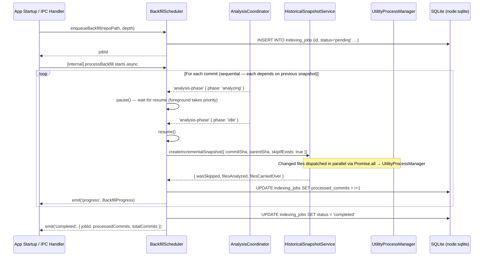

# Background Backfill Scheduler

## Problem Statement

Historical analysis of N commits must run in the background without blocking foreground analysis. The number of commits to analyze must be computed intelligently — not hardcoded — based on repository characteristics to avoid overwhelming small machines or databases. The scheduler must be resilient to app restarts: a job interrupted by a crash or quit must resume from where it stopped.

The scheduler dispatches each commit's analysis through `HistoricalSnapshotService`, which in turn uses the shared `UtilityProcessManager` — the same Electron utility process that handles foreground analysis. This means:

- File analysis within each commit runs in parallel (`Promise.all` inside `HistoricalSnapshotService`).
- No artificial inter-commit delay is needed — the utility process work provides natural backpressure.
- Commits are still processed sequentially (each incremental snapshot depends on the previous one existing first).
- The foreground coordinator's pause/resume mechanism remains the primary throttle: when `AnalysisCoordinator` is actively analyzing, `BackfillScheduler` pauses and yields the utility process entirely.

## New Files

| File                                                      | Role                                                    |
| --------------------------------------------------------- | ------------------------------------------------------- |
| `clients/desktop/src/main/git/adaptive-backfill.ts`       | Compute recommended backfill depth from repo metrics    |
| `clients/desktop/src/main/analysis/backfill-scheduler.ts` | Queue, execute, pause, resume, and cancel backfill jobs |
| `clients/desktop/src/main/ipc/handlers/backfill.ts`       | IPC handler registration (wired in Phase 08)            |
| `clients/desktop/src/shared/ipc/backfill-types.ts`        | Shared channel names and payload types                  |

---

## Part 1: Adaptive Backfill Depth Algorithm

File: `clients/desktop/src/main/git/adaptive-backfill.ts`

### Motivation

A single hardcoded depth (e.g., "always analyze last 30 commits") fails in both directions:

- For a new 7-commit repository it wastes nothing, but the UI would show an incorrectly high target.
- For a 10,000-commit monorepo with 100 commits per week it creates gigabytes of snapshot data in hours.

The algorithm below derives a recommended depth from seven cheaply measurable repo characteristics, applying a two-factor weighted pressure model to balance file volume against commit velocity.

### Inputs

| Input                 | Type     | How to measure                                        | Git command                                         |
| --------------------- | -------- | ----------------------------------------------------- | --------------------------------------------------- |
| `analyzableFiles`     | `number` | Count .ts/.tsx/.js/.jsx tracked files                 | `git ls-files \| grep -cE '\.(ts\|tsx\|js\|jsx)$'`  |
| `avgCommitsPerWeek`   | `number` | Commits in last 12 weeks / 12                         | `git log --oneline --since="12 weeks ago" \| wc -l` |
| `avgFilesPerCommit`   | `number` | Sample last 50 commits via `git diff-tree`            | per-commit `--name-only` count, averaged            |
| `mergeFrequencyRatio` | `number` | Merge commits in 12-week window / total in window     | `git log --merges --oneline --since="12 weeks ago"` |
| `branchCount`         | `number` | Remote branch count                                   | `git branch -r \| wc -l`                            |
| `repoAgeWeeks`        | `number` | `(Date.now() / 1000 - firstCommitTimestamp) / 604800` | `git log --reverse --format=%at \| head -1`         |
| `totalCommitsEver`    | `number` | Total commit count                                    | `git rev-list --count HEAD`                         |

### Formula

Two-factor weighted pressure model. Pressure represents how "expensive" each additional historical commit will be.

```
filePressure     = min(1, log1p(analyzableFiles) / log1p(500))
velocityPressure = min(1, avgCommitsPerWeek / 30)
combinedPressure = filePressure × 0.55 + velocityPressure × 0.45

rawBaseDepth     = round(100 - combinedPressure × (100 - 5))

mergeDiscount    = (mergeFrequencyRatio > 0.4)
                   ? (mergeFrequencyRatio - 0.4) / 0.6 × 0.30
                   : 0
branchDiscount   = (branchCount > 20)
                   ? min(1, (branchCount - 20) / 80) × 0.20
                   : 0

discountedDepth  = round(rawBaseDepth × (1 - mergeDiscount - branchDiscount))

newRepoCap       = (repoAgeWeeks < 8) ? totalCommitsEver : Infinity

finalDepth       = clamp(min(discountedDepth, newRepoCap), 5, 100)
```

### Empirical Basis

The `log1p(500)` reference maps the 75th–85th percentile of real-world repos (90% of repos have fewer than 300 analyzable files; median is 30–50). Pressure saturates near 500 files so that large codebases are not unfairly penalized when incremental analysis (Phase 03) keeps per-commit cost proportional to changed files only.

The 30 commits/week velocity ceiling covers 99%+ of teams. At a median of 2.8 commits per developer per workday, 30 commits/week approximates a 10-person team at full pace.

Merge commits inflate apparent velocity without producing new file analysis work — the `mergeDiscount` corrects for that. The `branchDiscount` accounts for repos with many long-lived branches that produce infrequent merges to main; their git logs tend to have more synthetic no-op commits.

The `newRepoCap` prevents Vipr from attempting to analyze commits that do not exist yet on brand-new repos — the UI would show impossible progress.

### Representative Outputs

| Profile                           | Files | Commits/wk | Merge% | Branches | Result         |
| --------------------------------- | ----- | ---------- | ------ | -------- | -------------- |
| Tiny OSS library                  | 35    | 0.5        | 5%     | 3        | ~45            |
| Medium SaaS                       | 280   | 13         | 15%    | 12       | ~27            |
| Large monorepo                    | 2,200 | 45         | 65%    | 85       | ~9             |
| Fast startup                      | 220   | 38         | 20%    | 18       | ~12            |
| Legacy codebase                   | 900   | 1.2        | 8%     | 7        | ~35            |
| Brand-new repo (3 wks, 7 commits) | 25    | 4          | 5%     | 2        | 7 (newRepoCap) |

### TypeScript Interface

```typescript
// clients/desktop/src/main/git/adaptive-backfill.ts

import { execFile } from 'node:child_process';
import { promisify } from 'node:util';
import { createLogger } from '@vipr/logging';

const execFileAsync = promisify(execFile);
const logger = createLogger({ tag: 'adaptive-backfill' });

export interface BackfillDepthInputs {
  analyzableFiles: number;
  avgCommitsPerWeek: number;
  avgFilesPerCommit: number;
  mergeFrequencyRatio: number;
  branchCount: number;
  repoAgeWeeks: number;
  totalCommitsEver: number;
}

/**
 * Compute the recommended number of historical commits to analyze.
 *
 * Pure function — no I/O. Call gatherBackfillInputs() first to collect
 * the inputs, then pass them here.
 */
export function calculateAdaptiveBackfillDepth(inputs: BackfillDepthInputs): number {
  const {
    analyzableFiles,
    avgCommitsPerWeek,
    mergeFrequencyRatio,
    branchCount,
    repoAgeWeeks,
    totalCommitsEver,
  } = inputs;

  const filePressure = Math.min(1, Math.log1p(analyzableFiles) / Math.log1p(500));
  const velocityPressure = Math.min(1, avgCommitsPerWeek / 30);
  const combinedPressure = filePressure * 0.55 + velocityPressure * 0.45;

  const rawBaseDepth = Math.round(100 - combinedPressure * 95);

  const mergeDiscount = mergeFrequencyRatio > 0.4 ? ((mergeFrequencyRatio - 0.4) / 0.6) * 0.3 : 0;
  const branchDiscount = branchCount > 20 ? Math.min(1, (branchCount - 20) / 80) * 0.2 : 0;

  const discountedDepth = Math.round(rawBaseDepth * (1 - mergeDiscount - branchDiscount));

  const newRepoCap = repoAgeWeeks < 8 ? totalCommitsEver : Infinity;

  return Math.max(5, Math.min(100, Math.min(discountedDepth, newRepoCap)));
}

/**
 * Collect all inputs by running lightweight git commands against repoPath.
 *
 * Each command completes in under 200 ms on repositories up to 50,000 commits.
 * All commands are read-only and have no side effects.
 */
export async function gatherBackfillInputs(repoPath: string): Promise<BackfillDepthInputs> {
  const exec = (args: string[]) =>
    execFileAsync('git', args, { cwd: repoPath }).then(({ stdout }) => stdout.trim());

  const [
    fileCountStr,
    recentCommitCountStr,
    mergeCommitCountStr,
    branchCountStr,
    firstTimestampStr,
    totalCommitsStr,
    diffTreeOutput,
  ] = await Promise.all([
    exec(['ls-files']).then(out =>
      String(out.split('\n').filter(f => /\.(ts|tsx|js|jsx)$/.test(f)).length)
    ),
    exec(['log', '--oneline', '--since=12 weeks ago']).then(out =>
      String(out ? out.split('\n').length : 0)
    ),
    exec(['log', '--merges', '--oneline', '--since=12 weeks ago']).then(out =>
      String(out ? out.split('\n').filter(Boolean).length : 0)
    ),
    exec(['branch', '-r']).then(out => String(out ? out.split('\n').filter(Boolean).length : 0)),
    exec(['log', '--reverse', '--format=%at']).then(out => out.split('\n')[0] ?? '0'),
    exec(['rev-list', '--count', 'HEAD']),
    exec(['log', '--format=%H', '-50']).then(async shas => {
      const shaList = shas.split('\n').filter(Boolean);
      const counts = await Promise.all(
        shaList.map(sha =>
          execFileAsync('git', ['diff-tree', '--no-commit-id', '-r', '--name-only', sha], {
            cwd: repoPath,
          })
            .then(({ stdout }) => stdout.trim().split('\n').filter(Boolean).length)
            .catch(() => 0)
        )
      );
      return counts.length > 0 ? String(counts.reduce((a, b) => a + b, 0) / counts.length) : '0';
    }),
  ]);

  const recentCommits = parseInt(recentCommitCountStr, 10) || 0;
  const mergeCommits = parseInt(mergeCommitCountStr, 10) || 0;

  const nowSeconds = Date.now() / 1000;
  const firstTimestamp = parseInt(firstTimestampStr, 10) || nowSeconds;
  const repoAgeWeeks = (nowSeconds - firstTimestamp) / 604800;

  return {
    analyzableFiles: parseInt(fileCountStr, 10) || 0,
    avgCommitsPerWeek: recentCommits / 12,
    avgFilesPerCommit: parseFloat(diffTreeOutput) || 0,
    mergeFrequencyRatio: recentCommits > 0 ? mergeCommits / recentCommits : 0,
    branchCount: parseInt(branchCountStr, 10) || 0,
    repoAgeWeeks,
    totalCommitsEver: parseInt(totalCommitsStr, 10) || 0,
  };
}
```

---

## Part 2: Backfill Scheduler

File: `clients/desktop/src/main/analysis/backfill-scheduler.ts`

### Shared Types

File: `clients/desktop/src/shared/ipc/backfill-types.ts`

```typescript
export type BackfillStatus = 'idle' | 'running' | 'paused' | 'completed' | 'failed';

export interface BackfillProgress {
  jobId: string;
  processedCommits: number;
  totalCommits: number;
  currentSha: string;
  status: BackfillStatus;
  startedAt: number;
}

export interface IndexingJobRecord {
  id: string;
  repoPath: string;
  depth: number;
  status: BackfillStatus;
  processedCommits: number;
  totalCommits: number;
  createdAt: number;
  updatedAt: number;
  cancellationToken: string | null;
}

// IPC channel names (used by both main-process handlers and renderer hooks)
export const BACKFILL_CHANNELS = {
  ENQUEUE: 'backfill:enqueue',
  CANCEL: 'backfill:cancel',
  PAUSE: 'backfill:pause',
  RESUME: 'backfill:resume',
  GET_STATUS: 'backfill:getStatus',
  GET_HISTORY: 'backfill:getHistory',
  // Push events (main → renderer)
  PROGRESS: 'backfill:progress',
  COMPLETED: 'backfill:completed',
  FAILED: 'backfill:failed',
} as const;
```

### Class Interface

```typescript
// clients/desktop/src/main/analysis/backfill-scheduler.ts

import { EventEmitter } from 'node:events';
import { randomUUID } from 'node:crypto';
import type { HistoricalSnapshotService } from './historical-snapshot-service';
import type { GitContentService } from '../git/git-content-service';
import { DatabaseSync } from 'node:sqlite';
import type { AnalysisCoordinator } from './coordinator';
import type {
  BackfillProgress,
  BackfillStatus,
  IndexingJobRecord,
} from '../../shared/ipc/backfill-types';

export class BackfillScheduler extends EventEmitter {
  private currentStatus: BackfillStatus = 'idle';
  private currentProgress: BackfillProgress | null = null;
  private pauseRequested = false;
  private pauseResolvers: Array<() => void> = [];

  constructor(
    private historicalSnapshotService: HistoricalSnapshotService,
    private gitContent: GitContentService,
    private db: DatabaseSync,
    private coordinator: AnalysisCoordinator
  ) {
    super();
    this.subscribeToCoordinatorPhase();
  }

  /**
   * Enqueue a backfill job.
   *
   * Resolves the last N commits from HEAD using GitContentService.getCommitLog(),
   * writes an indexing_jobs row, and begins processing asynchronously.
   * Returns the UUID job ID immediately.
   */
  enqueueBackfill(repoPath: string, depth: number): Promise<string>;

  /**
   * Pause after the current commit finishes.
   *
   * Sets pauseRequested=true. The processing loop checks this flag
   * after each commit and suspends before starting the next one.
   * Safe to call multiple times.
   */
  pause(): void;

  /**
   * Resume a paused job.
   *
   * Clears pauseRequested and resolves any pending pause-await.
   */
  resume(): void;

  /**
   * Cancel a job by UUID.
   *
   * Writes a new random UUID to indexing_jobs.cancellation_token.
   * The processing loop re-reads the DB every 5 commits and detects
   * the mismatch, then breaks the loop and marks the job cancelled.
   */
  cancel(jobId: string): Promise<void>;

  /**
   * Resume any jobs persisted as 'running' or 'pending' in the DB.
   *
   * Called during IPC router initialization on every app start.
   * Jobs interrupted by a crash are resumed from their last completed commit.
   */
  resumePendingJobs(repoPath: string): Promise<void>;

  getStatus(): BackfillStatus;
  getCurrentProgress(): BackfillProgress | null;

  // Events emitted:
  //   'progress'   → BackfillProgress
  //   'completed'  → { jobId: string; processedCommits: number; totalCommits: number }
  //   'failed'     → { jobId: string; error: string }
  //   'paused'     → { jobId: string }
  //   'resumed'    → { jobId: string }
}
```

### Key Design Decisions

**Cancellation via DB token**: Each job is assigned a `cancellationToken` UUID at enqueue time and stored in `indexing_jobs.cancellation_token`. The processing loop re-reads this column from the DB every 5 commits. If the live token no longer matches the in-memory token (because `cancel()` wrote a new UUID), the loop breaks. This design survives app restarts: the scheduler always reads the DB on resume and will detect a pre-restart cancellation.

**Idle-aware pause**: The scheduler subscribes to `AnalysisCoordinator`'s `'analysis-phase'` event. When the phase becomes `'analyzing'` or `'scanning'`, `pause()` is called automatically. When the phase becomes `'idle'` or `'complete'`, `resume()` is called. The utility process work within each `createIncrementalSnapshot` call provides natural event-loop yielding — no artificial inter-commit delay is needed.

**Resume on restart**: `resumePendingJobs()` queries `indexing_jobs WHERE status IN ('running', 'pending')`, reconstructs the remaining commit list starting from the last completed commit, and restarts the processing loop. The `processedCommits` count is persisted after each commit to enable this.

**No concurrent jobs**: If `enqueueBackfill()` is called while a job is already running, the new job is written to the DB with status `'pending'` and will start automatically when the current job completes. Only one job runs at a time.

### Processing Loop Pseudocode

```
async processBackfill(commitList, jobId, cancellationToken, startIndex):
  for i from startIndex to commitList.length - 1:
    const commit = commitList[i]

    // 1. Check pause
    if pauseRequested:
      currentStatus = 'paused'
      emit('paused', { jobId })
      await waitForResume()   // suspends until resume() is called
      currentStatus = 'running'
      emit('resumed', { jobId })

    // 2. Check cancellation (every 5th commit)
    if i % 5 === 0:
      const job = db.prepare('SELECT cancellation_token FROM indexing_jobs WHERE id = ?').get(jobId)
      if job.cancellation_token !== cancellationToken:
        db.prepare('UPDATE indexing_jobs SET status = ? WHERE id = ?').run('cancelled', jobId)
        currentStatus = 'idle'
        return

    // 3. Analyze commit
    try:
      await historicalSnapshotService.createIncrementalSnapshot({
        commitSha: commit.sha,
        parentSha: commit.parentShas[0] ?? commit.sha,  // genesis commit: parent = self
        refType: 'commit',
        skipIfExists: true,
      })
    catch err:
      logger.warn(`Failed to snapshot ${commit.sha}: ${err.message}`)
      // Continue to next commit — do not abort entire job

    // 4. Persist progress
    db.prepare(`
      UPDATE indexing_jobs
      SET processed_commits = ?, updated_at = ?
      WHERE id = ?
    `).run(i + 1, Date.now(), jobId)

    // 5. Emit progress event
    const progress = {
      jobId,
      processedCommits: i + 1,
      totalCommits: commitList.length,
      currentSha: commit.sha,
      status: 'running',
      startedAt: startedAt,
    }
    currentProgress = progress
    emit('progress', progress)

    // Note: no artificial delay needed — the Promise.all inside
    // createIncrementalSnapshot yields the event loop naturally while
    // the utility process analyzes each file.

  // Job complete
  db.prepare('UPDATE indexing_jobs SET status = ? WHERE id = ?').run('completed', jobId)
  currentStatus = 'idle'
  currentProgress = null
  emit('completed', { jobId, processedCommits: commitList.length, totalCommits: commitList.length })
```

### Coordinator Integration

```typescript
private subscribeToCoordinatorPhase(): void {
  this.coordinator.on('analysis-phase', ({ phase }) => {
    if (phase === 'analyzing' || phase === 'scanning') {
      if (this.currentStatus === 'running') {
        this.pause();
      }
    } else if (phase === 'idle' || phase === 'complete') {
      if (this.currentStatus === 'paused') {
        this.resume();
      }
    }
  });
}
```

### Auto-Start After First Analysis

The desktop app's main IPC router (Phase 08) subscribes to `coordinator.on('analysis-complete')` on first workspace open. When the event fires:

1. Call `gatherBackfillInputs(repoPath)`.
2. Call `calculateAdaptiveBackfillDepth(inputs)`.
3. Check user settings override — if the user has saved a custom depth, use that instead.
4. Call `backfillScheduler.enqueueBackfill(repoPath, depth)`.

This ensures the backfill starts after the foreground analysis finishes, never competing with it.

---

## Part 3: IPC Channels

File: `clients/desktop/src/main/ipc/handlers/backfill.ts`

All channels are registered in Phase 08 (`08-time-travel-ipc-router`). The handler file exposes registration functions that accept the scheduler instance.

### Request/Response Channels

```typescript
// backfill:enqueue
// Request:  { repoPath: string; depth: number }
// Response: { jobId: string }
ipcMain.handle(BACKFILL_CHANNELS.ENQUEUE, async (_event, { repoPath, depth }) => {
  const jobId = await scheduler.enqueueBackfill(repoPath, depth);
  return { jobId };
});

// backfill:cancel
// Request:  { jobId: string }
// Response: void
ipcMain.handle(BACKFILL_CHANNELS.CANCEL, async (_event, { jobId }) => {
  await scheduler.cancel(jobId);
});

// backfill:pause
// Request:  void
// Response: void
ipcMain.handle(BACKFILL_CHANNELS.PAUSE, () => {
  scheduler.pause();
});

// backfill:resume
// Request:  void
// Response: void
ipcMain.handle(BACKFILL_CHANNELS.RESUME, () => {
  scheduler.resume();
});

// backfill:getStatus
// Request:  void
// Response: BackfillProgress | null
ipcMain.handle(BACKFILL_CHANNELS.GET_STATUS, () => {
  return scheduler.getCurrentProgress();
});

// backfill:getHistory
// Request:  void
// Response: IndexingJobRecord[]
ipcMain.handle(BACKFILL_CHANNELS.GET_HISTORY, () => {
  return db
    .prepare('SELECT * FROM indexing_jobs ORDER BY created_at DESC LIMIT 50')
    .all() as IndexingJobRecord[];
});
```

### Push Events (main → renderer)

```typescript
// Wire scheduler events to renderer using the sendToRenderer helper (exported from router.ts)
scheduler.on('progress', (progress: BackfillProgress) => {
  sendToRenderer(BACKFILL_CHANNELS.PROGRESS, progress);
});

scheduler.on('completed', payload => {
  sendToRenderer(BACKFILL_CHANNELS.COMPLETED, payload);
});

scheduler.on('failed', payload => {
  sendToRenderer(BACKFILL_CHANNELS.FAILED, payload);
});
```

---

## Part 4: Settings Override

The computed `finalDepth` is surfaced as an editable number input in Settings → Historical Analysis:

```tsx
// Rendered in the Historical Analysis settings panel (Phase 08)
<SettingCard
  label="History Depth"
  description={`Commits to analyze in background. Suggested: ${suggestedDepth} (based on your repository size and velocity).`}
>
  <input
    type="number"
    min={1}
    max={500}
    value={userDepth ?? suggestedDepth}
    onChange={e => setUserDepth(Number(e.target.value))}
    className="w-20 rounded border border-border bg-background px-2 py-1 text-sm"
  />
</SettingCard>
```

The `suggestedDepth` is fetched once at panel open via an IPC call to a new `backfill:getSuggestedDepth` handler that runs `gatherBackfillInputs` + `calculateAdaptiveBackfillDepth` on demand.

---

## Testing

### File: `clients/desktop/src/main/git/adaptive-backfill.test.ts`

```typescript
import { describe, it, expect } from 'vitest';
import { calculateAdaptiveBackfillDepth } from './adaptive-backfill';
import type { BackfillDepthInputs } from './adaptive-backfill';

describe('calculateAdaptiveBackfillDepth', () => {
  const profiles: Array<{
    name: string;
    inputs: BackfillDepthInputs;
    expected: { min: number; max: number };
  }> = [
    {
      name: 'tiny OSS library',
      inputs: {
        analyzableFiles: 35,
        avgCommitsPerWeek: 0.5,
        avgFilesPerCommit: 2,
        mergeFrequencyRatio: 0.05,
        branchCount: 3,
        repoAgeWeeks: 50,
        totalCommitsEver: 200,
      },
      expected: { min: 40, max: 50 },
    },
    {
      name: 'medium SaaS',
      inputs: {
        analyzableFiles: 280,
        avgCommitsPerWeek: 13,
        avgFilesPerCommit: 8,
        mergeFrequencyRatio: 0.15,
        branchCount: 12,
        repoAgeWeeks: 100,
        totalCommitsEver: 1500,
      },
      expected: { min: 23, max: 32 },
    },
    {
      name: 'large monorepo',
      inputs: {
        analyzableFiles: 2200,
        avgCommitsPerWeek: 45,
        avgFilesPerCommit: 25,
        mergeFrequencyRatio: 0.65,
        branchCount: 85,
        repoAgeWeeks: 200,
        totalCommitsEver: 5000,
      },
      expected: { min: 5, max: 14 },
    },
    {
      name: 'fast startup',
      inputs: {
        analyzableFiles: 220,
        avgCommitsPerWeek: 38,
        avgFilesPerCommit: 12,
        mergeFrequencyRatio: 0.2,
        branchCount: 18,
        repoAgeWeeks: 30,
        totalCommitsEver: 400,
      },
      expected: { min: 8, max: 18 },
    },
    {
      name: 'legacy codebase',
      inputs: {
        analyzableFiles: 900,
        avgCommitsPerWeek: 1.2,
        avgFilesPerCommit: 4,
        mergeFrequencyRatio: 0.08,
        branchCount: 7,
        repoAgeWeeks: 500,
        totalCommitsEver: 8000,
      },
      expected: { min: 28, max: 42 },
    },
    {
      name: 'brand-new repo (3 weeks, 7 commits)',
      inputs: {
        analyzableFiles: 25,
        avgCommitsPerWeek: 4,
        avgFilesPerCommit: 5,
        mergeFrequencyRatio: 0.05,
        branchCount: 2,
        repoAgeWeeks: 3,
        totalCommitsEver: 7,
      },
      expected: { min: 5, max: 10 },
    },
  ];

  profiles.forEach(({ name, inputs, expected }) => {
    it(`${name}: result within expected range [${expected.min}, ${expected.max}]`, () => {
      const result = calculateAdaptiveBackfillDepth(inputs);
      expect(result).toBeGreaterThanOrEqual(expected.min);
      expect(result).toBeLessThanOrEqual(expected.max);
    });
  });

  it('result always within absolute bounds [5, 100]', () => {
    // Extreme inputs should never produce out-of-bounds values
    const extremeHigh: BackfillDepthInputs = {
      analyzableFiles: 0,
      avgCommitsPerWeek: 0,
      avgFilesPerCommit: 0,
      mergeFrequencyRatio: 0,
      branchCount: 0,
      repoAgeWeeks: 1000,
      totalCommitsEver: 100000,
    };
    const extremeLow: BackfillDepthInputs = {
      analyzableFiles: 100000,
      avgCommitsPerWeek: 1000,
      avgFilesPerCommit: 500,
      mergeFrequencyRatio: 1,
      branchCount: 500,
      repoAgeWeeks: 1000,
      totalCommitsEver: 100000,
    };

    expect(calculateAdaptiveBackfillDepth(extremeHigh)).toBeGreaterThanOrEqual(5);
    expect(calculateAdaptiveBackfillDepth(extremeHigh)).toBeLessThanOrEqual(100);
    expect(calculateAdaptiveBackfillDepth(extremeLow)).toBeGreaterThanOrEqual(5);
    expect(calculateAdaptiveBackfillDepth(extremeLow)).toBeLessThanOrEqual(100);
  });

  it('monotonicity: more files → lower or equal depth (velocity constant)', () => {
    const base: BackfillDepthInputs = {
      avgCommitsPerWeek: 10,
      avgFilesPerCommit: 5,
      mergeFrequencyRatio: 0.1,
      branchCount: 10,
      repoAgeWeeks: 50,
      totalCommitsEver: 500,
    } as BackfillDepthInputs;

    const small = calculateAdaptiveBackfillDepth({ ...base, analyzableFiles: 50 });
    const medium = calculateAdaptiveBackfillDepth({ ...base, analyzableFiles: 300 });
    const large = calculateAdaptiveBackfillDepth({ ...base, analyzableFiles: 2000 });

    expect(small).toBeGreaterThanOrEqual(medium);
    expect(medium).toBeGreaterThanOrEqual(large);
  });

  it('monotonicity: higher velocity → lower or equal depth (files constant)', () => {
    const base: BackfillDepthInputs = {
      analyzableFiles: 200,
      avgFilesPerCommit: 5,
      mergeFrequencyRatio: 0.1,
      branchCount: 10,
      repoAgeWeeks: 50,
      totalCommitsEver: 500,
    } as BackfillDepthInputs;

    const slow = calculateAdaptiveBackfillDepth({ ...base, avgCommitsPerWeek: 1 });
    const medium = calculateAdaptiveBackfillDepth({ ...base, avgCommitsPerWeek: 15 });
    const fast = calculateAdaptiveBackfillDepth({ ...base, avgCommitsPerWeek: 50 });

    expect(slow).toBeGreaterThanOrEqual(medium);
    expect(medium).toBeGreaterThanOrEqual(fast);
  });

  it('newRepoCap limits depth when repo is younger than 8 weeks', () => {
    const inputs: BackfillDepthInputs = {
      analyzableFiles: 25,
      avgCommitsPerWeek: 4,
      avgFilesPerCommit: 3,
      mergeFrequencyRatio: 0.05,
      branchCount: 2,
      repoAgeWeeks: 2,
      totalCommitsEver: 7,
    };

    const result = calculateAdaptiveBackfillDepth(inputs);

    // Cannot exceed totalCommitsEver when repoAgeWeeks < 8
    expect(result).toBeLessThanOrEqual(inputs.totalCommitsEver);
  });

  it('high merge ratio applies discount correctly', () => {
    const base: BackfillDepthInputs = {
      analyzableFiles: 100,
      avgCommitsPerWeek: 5,
      avgFilesPerCommit: 4,
      branchCount: 10,
      repoAgeWeeks: 50,
      totalCommitsEver: 300,
    } as BackfillDepthInputs;

    const lowMerge = calculateAdaptiveBackfillDepth({ ...base, mergeFrequencyRatio: 0.05 });
    const highMerge = calculateAdaptiveBackfillDepth({ ...base, mergeFrequencyRatio: 0.8 });

    // High merge ratio should yield a lower depth (merge discount applied)
    expect(lowMerge).toBeGreaterThan(highMerge);
  });
});
```

### File: `clients/desktop/src/main/analysis/backfill-scheduler.test.ts`

```typescript
import { describe, it, expect, vi, beforeEach } from 'vitest';
import { BackfillScheduler } from './backfill-scheduler';

describe('BackfillScheduler', () => {
  let scheduler: BackfillScheduler;
  let historicalService: ReturnType<typeof mockHistoricalService>;
  let gitContent: ReturnType<typeof mockGitContent>;
  let db: ReturnType<typeof mockDb>;
  let coordinator: ReturnType<typeof mockCoordinator>;

  beforeEach(() => {
    historicalService = mockHistoricalService();
    gitContent = mockGitContent();
    db = mockDb();
    coordinator = mockCoordinator();
    scheduler = new BackfillScheduler(historicalService, gitContent, db, coordinator);
  });

  it('processes commits in order from newest to oldest', async () => {
    const commits = [
      { sha: 'aaa', parentShas: ['bbb'] },
      { sha: 'bbb', parentShas: ['ccc'] },
      { sha: 'ccc', parentShas: [] },
    ];
    gitContent.getCommitLog.mockResolvedValue(commits);

    await scheduler.enqueueBackfill('/repo', 3);
    await vi.runAllTimersAsync();

    const calls = historicalService.createIncrementalSnapshot.mock.calls;
    expect(calls[0][0].commitSha).toBe('aaa');
    expect(calls[1][0].commitSha).toBe('bbb');
    expect(calls[2][0].commitSha).toBe('ccc');
  });

  it('skips commits that already have snapshots (skipIfExists=true)', async () => {
    historicalService.createIncrementalSnapshot.mockResolvedValueOnce({ wasSkipped: true });

    const commits = [
      { sha: 'aaa', parentShas: ['bbb'] },
      { sha: 'bbb', parentShas: [] },
    ];
    gitContent.getCommitLog.mockResolvedValue(commits);

    await scheduler.enqueueBackfill('/repo', 2);
    await vi.runAllTimersAsync();

    expect(historicalService.createIncrementalSnapshot).toHaveBeenCalledWith(
      expect.objectContaining({ skipIfExists: true })
    );
  });

  it('pauses after current commit completes', async () => {
    const commits = Array.from({ length: 5 }, (_, i) => ({
      sha: `sha${i}`,
      parentShas: i > 0 ? [`sha${i - 1}`] : [],
    }));
    gitContent.getCommitLog.mockResolvedValue(commits);

    let resolveFirst!: () => void;
    historicalService.createIncrementalSnapshot
      .mockImplementationOnce(
        () =>
          new Promise<void>(resolve => {
            resolveFirst = resolve;
          })
      )
      .mockResolvedValue({ wasSkipped: false });

    const jobPromise = scheduler.enqueueBackfill('/repo', 5);
    scheduler.pause();
    resolveFirst();

    // After first commit resolves, scheduler should pause
    await vi.advanceTimersByTimeAsync(300);
    expect(scheduler.getStatus()).toBe('paused');

    scheduler.resume();
    await jobPromise;
    expect(scheduler.getStatus()).toBe('idle');
  });

  it('resumes after pause and continues from next commit', async () => {
    const processedOrder: string[] = [];
    const commits = [
      { sha: 'a', parentShas: ['b'] },
      { sha: 'b', parentShas: ['c'] },
      { sha: 'c', parentShas: [] },
    ];
    gitContent.getCommitLog.mockResolvedValue(commits);
    historicalService.createIncrementalSnapshot.mockImplementation(({ commitSha }) => {
      processedOrder.push(commitSha);
      return Promise.resolve({ wasSkipped: false });
    });

    scheduler.pause(); // pause immediately
    const jobPromise = scheduler.enqueueBackfill('/repo', 3);
    await vi.advanceTimersByTimeAsync(50);
    scheduler.resume();
    await jobPromise;

    expect(processedOrder).toEqual(['a', 'b', 'c']);
  });

  it('cancels when DB cancellation token does not match', async () => {
    const commits = Array.from({ length: 10 }, (_, i) => ({
      sha: `sha${i}`,
      parentShas: [`sha${i + 1}`],
    }));
    gitContent.getCommitLog.mockResolvedValue(commits);

    // Simulate cancel() writing a different token to the DB after 4 commits
    let callCount = 0;
    historicalService.createIncrementalSnapshot.mockImplementation(() => {
      callCount++;
      return Promise.resolve({ wasSkipped: false });
    });
    db.prepare.mockImplementation((sql: string) => {
      if (sql.includes('cancellation_token')) {
        return {
          get: () => ({
            cancellation_token: callCount >= 5 ? 'different-token' : 'original-token',
          }),
        };
      }
      return { run: vi.fn(), all: vi.fn().mockReturnValue([]) };
    });

    const jobId = await scheduler.enqueueBackfill('/repo', 10);
    await vi.runAllTimersAsync();

    // Should stop at or before commit 10 due to token mismatch
    expect(callCount).toBeLessThan(10);
    expect(scheduler.getStatus()).toBe('idle');
  });

  it('pauses automatically when AnalysisCoordinator emits analyzing phase', async () => {
    const commits = Array.from({ length: 5 }, (_, i) => ({
      sha: `sha${i}`,
      parentShas: [`sha${i + 1}`],
    }));
    gitContent.getCommitLog.mockResolvedValue(commits);
    historicalService.createIncrementalSnapshot.mockResolvedValue({ wasSkipped: false });

    await scheduler.enqueueBackfill('/repo', 5);
    coordinator.emit('analysis-phase', { phase: 'analyzing', totalFiles: 10 });

    await vi.advanceTimersByTimeAsync(300);
    expect(scheduler.getStatus()).toBe('paused');
  });

  it('resumes automatically when AnalysisCoordinator emits idle phase', async () => {
    const commits = Array.from({ length: 3 }, (_, i) => ({
      sha: `sha${i}`,
      parentShas: [`sha${i + 1}`],
    }));
    gitContent.getCommitLog.mockResolvedValue(commits);
    historicalService.createIncrementalSnapshot.mockResolvedValue({ wasSkipped: false });

    await scheduler.enqueueBackfill('/repo', 3);
    coordinator.emit('analysis-phase', { phase: 'analyzing', totalFiles: 10 });
    await vi.advanceTimersByTimeAsync(50);
    expect(scheduler.getStatus()).toBe('paused');

    coordinator.emit('analysis-phase', { phase: 'idle', totalFiles: 0 });
    await vi.runAllTimersAsync();
    expect(scheduler.getStatus()).toBe('idle'); // completed after resume
  });

  it('emits progress event after each commit', async () => {
    const commits = [
      { sha: 'a', parentShas: ['b'] },
      { sha: 'b', parentShas: [] },
    ];
    gitContent.getCommitLog.mockResolvedValue(commits);
    historicalService.createIncrementalSnapshot.mockResolvedValue({ wasSkipped: false });

    const progressEvents: unknown[] = [];
    scheduler.on('progress', p => progressEvents.push(p));

    await scheduler.enqueueBackfill('/repo', 2);
    await vi.runAllTimersAsync();

    expect(progressEvents).toHaveLength(2);
    expect(progressEvents[0]).toMatchObject({ processedCommits: 1, totalCommits: 2 });
    expect(progressEvents[1]).toMatchObject({ processedCommits: 2, totalCommits: 2 });
  });

  it('emits completed event when all commits processed', async () => {
    gitContent.getCommitLog.mockResolvedValue([{ sha: 'a', parentShas: [] }]);
    historicalService.createIncrementalSnapshot.mockResolvedValue({ wasSkipped: false });

    const completed: unknown[] = [];
    scheduler.on('completed', p => completed.push(p));

    await scheduler.enqueueBackfill('/repo', 1);
    await vi.runAllTimersAsync();

    expect(completed).toHaveLength(1);
    expect(completed[0]).toMatchObject({ processedCommits: 1, totalCommits: 1 });
  });
});

// -- Test helpers --

function mockHistoricalService() {
  return {
    createIncrementalSnapshot: vi.fn().mockResolvedValue({ wasSkipped: false }),
    createSnapshotForCommit: vi.fn().mockResolvedValue({ wasSkipped: false }),
  };
}

function mockGitContent() {
  return {
    getCommitLog: vi.fn().mockResolvedValue([]),
  };
}

function mockDb() {
  return {
    prepare: vi.fn().mockReturnValue({
      get: vi.fn().mockReturnValue({ cancellation_token: 'original-token' }),
      run: vi.fn(),
      all: vi.fn().mockReturnValue([]),
    }),
    transaction: vi.fn((fn: () => void) => fn()),
  };
}

function mockCoordinator() {
  const { EventEmitter } = require('node:events');
  return Object.assign(new EventEmitter(), {
    on: vi.fn().mockImplementation(function (this: typeof EventEmitter, ...args: unknown[]) {
      return EventEmitter.prototype.on.apply(
        this,
        args as Parameters<typeof EventEmitter.prototype.on>
      );
    }),
  });
}
```

## Sequence Diagram


