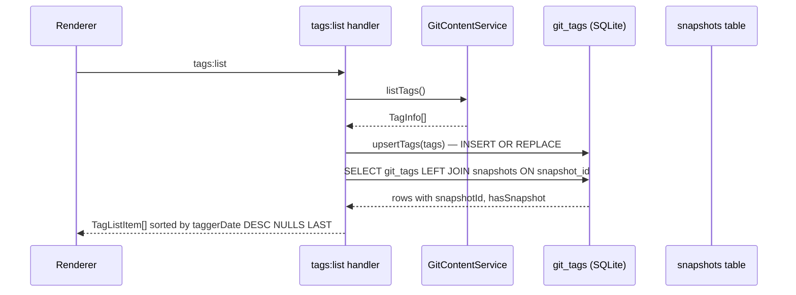
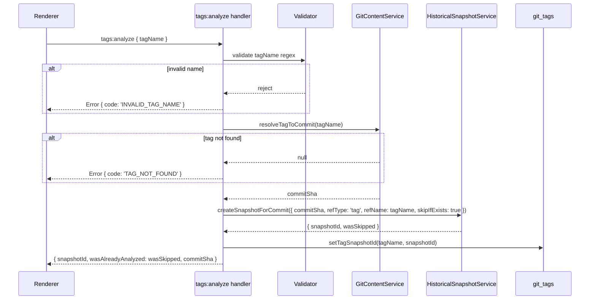

# Git Tag Support

## Problem Statement

Tags are invisible to the application. No IPC channels exist for listing tags, no tag metadata is surfaced to the renderer, and there is no mechanism to trigger a snapshot keyed to a tag. Annotated and lightweight tags have different git object models: annotated tags have their own SHA (the tag object) that must be dereferenced to reach the underlying commit SHA. Any snapshot lookup that uses `object_sha` instead of `commit_sha` will silently produce wrong results.

This phase adds:

- A `git_tags` IPC surface (list, analyze, getSnapshot, refresh).
- A `TagQueries` class that owns all `git_tags` table access.
- Validation ensuring annotated-tag dereferencing is always applied before snapshot creation.

## New Files

| File                                                 | Role                                            |
| ---------------------------------------------------- | ----------------------------------------------- |
| `clients/desktop/src/shared/ipc/tag-types.ts`        | Shared types consumed by both main and renderer |
| `clients/desktop/src/main/ipc/handlers/tags.ts`      | IPC handler implementations                     |
| `clients/desktop/src/main/db/tag-queries.ts`         | SQL queries for `git_tags` table                |
| `clients/desktop/src/main/ipc/handlers/tags.test.ts` | Unit tests                                      |

## Shared Types (`tag-types.ts`)

```typescript
// clients/desktop/src/shared/ipc/tag-types.ts

export interface TagListItem {
  name: string;
  objectSha: string;
  commitSha: string;
  tagType: 'lightweight' | 'annotated';
  subject: string | null;
  taggerDate: number | null;
  snapshotId: number | null; // null if not yet analyzed
  hasSnapshot: boolean;
}

export interface TagAnalyzeRequest {
  tagName: string;
}

export interface TagAnalyzeResult {
  snapshotId: number;
  wasAlreadyAnalyzed: boolean;
  commitSha: string;
}
```

## IPC Channel Specifications

### `tags:list`

Always re-reads from git (never DB-only), upserts the result into `git_tags`, then returns the merged view including snapshot status.

**Request:** `void` — the handler reads `repoPath` from the workspace context (same pattern used by all workspace-scoped IPC handlers).

**Response:**

```typescript
TagListItem[]  // sorted by taggerDate DESC NULLS LAST
```

**Flow:**



**Implementation sketch:**

```typescript
// Module-local service refs and requireService() guard (same pattern as scheduler.ts)
let gitContentRef: GitContentService | null = null;
let tagQueriesRef: TagQueries | null = null;
let historicalSnapshotRef: HistoricalSnapshotService | null = null;
let snapshotRepoRef: SnapshotRepository | null = null;

export function setTagServices(
  gitContent: GitContentService | null,
  tagQueries: TagQueries | null,
  historicalSnapshot: HistoricalSnapshotService | null,
  snapshotRepo: SnapshotRepository | null
): void {
  gitContentRef = gitContent;
  tagQueriesRef = tagQueries;
  historicalSnapshotRef = historicalSnapshot;
  snapshotRepoRef = snapshotRepo;
}

function requireGitContent(): GitContentService {
  if (!gitContentRef) throw new Error('Tag services not initialized. Open a workspace first.');
  return gitContentRef;
}
function requireTagQueries(): TagQueries {
  if (!tagQueriesRef) throw new Error('Tag services not initialized. Open a workspace first.');
  return tagQueriesRef;
}

ipcMain.handle('tags:list', async (): Promise<TagListItem[]> => {
  const rawTags = await requireGitContent().listTags();
  requireTagQueries().upsertTags(rawTags);
  return requireTagQueries().getAllTagsWithSnapshots();
});
```

---

### `tags:analyze`

Trigger analysis of a single tag. Resolves the tag to its underlying commit SHA, then delegates to `HistoricalSnapshotService`.

**Request:**

```typescript
TagAnalyzeRequest; // { tagName: string }
```

**Response:**

```typescript
TagAnalyzeResult; // { snapshotId, wasAlreadyAnalyzed, commitSha }
```

**Flow:**



**Implementation sketch:**

```typescript
const TAG_NAME_PATTERN = /^[a-zA-Z0-9._\-\/]+$/;

ipcMain.handle(
  'tags:analyze',
  async (_event, { tagName }: TagAnalyzeRequest): Promise<TagAnalyzeResult> => {
    if (!TAG_NAME_PATTERN.test(tagName)) {
      throw Object.assign(new Error('Invalid tag name'), { code: 'INVALID_TAG_NAME' });
    }

    const commitSha = await gitContent.resolveTagToCommit(tagName);
    if (!commitSha) {
      throw Object.assign(new Error(`Tag not found: ${tagName}`), { code: 'TAG_NOT_FOUND' });
    }

    const result = await historicalSnapshotService.createSnapshotForCommit({
      commitSha,
      refType: 'tag',
      refName: tagName,
      skipIfExists: true,
    });

    tagQueries.setTagSnapshotId(tagName, result.snapshotId);

    return {
      snapshotId: result.snapshotId,
      wasAlreadyAnalyzed: result.wasSkipped,
      commitSha,
    };
  }
);
```

---

### `tags:getSnapshot`

Return the snapshot record for a tag that has already been analyzed.

**Request:**

```typescript
{
  tagName: string;
}
```

**Response:**

```typescript
SnapshotRecord | null;
```

**Flow:** Look up `git_tags.snapshot_id` by name; if present, call `snapshotRepo.getSnapshot(snapshotId)`.

---

### `tags:refresh`

Force re-sync of the `git_tags` cache. Useful after `git fetch` brings in new remote tags.

**Request:** `void` — `repoPath` comes from workspace context via `GitContentService` constructor.

**Response:**

```typescript
{
  count: number;
} // number of tags now in the cache
```

**Flow:** Call `requireGitContent().listTags()`, run `requireTagQueries().upsertTags(tags)`, return `{ count: tags.length }`.

## Tag Queries (`tag-queries.ts`)

```typescript
// clients/desktop/src/main/db/tag-queries.ts

import type { DatabaseSync } from 'node:sqlite';
import type { GitTagRecord, TagInfo } from './types';

export class TagQueries {
  constructor(private db: DatabaseSync) {}

  upsertTag(tag: TagInfo): void {
    this.db
      .prepare(
        `INSERT OR REPLACE INTO git_tags
           (name, object_sha, commit_sha, subject, tagger_date, tag_type)
         VALUES (?, ?, ?, ?, ?, ?)`
      )
      .run(
        tag.name,
        tag.objectSha,
        tag.commitSha,
        tag.subject ?? null,
        tag.taggerDate ?? null,
        tag.tagType
      );
  }

  upsertTags(tags: TagInfo[]): void {
    const stmt = this.db.prepare(
      `INSERT OR REPLACE INTO git_tags
         (name, object_sha, commit_sha, subject, tagger_date, tag_type)
       VALUES (?, ?, ?, ?, ?, ?)`
    );
    for (const tag of tags) {
      stmt.run(
        tag.name,
        tag.objectSha,
        tag.commitSha,
        tag.subject ?? null,
        tag.taggerDate ?? null,
        tag.tagType
      );
    }
  }

  setTagSnapshotId(tagName: string, snapshotId: number): void {
    this.db.prepare(`UPDATE git_tags SET snapshot_id = ? WHERE name = ?`).run(snapshotId, tagName);
  }

  getTagByName(tagName: string): GitTagRecord | null {
    return (
      (this.db.prepare(`SELECT * FROM git_tags WHERE name = ?`).get(tagName) as
        | GitTagRecord
        | undefined) ?? null
    );
  }

  getAllTagsWithSnapshots(): (GitTagRecord & { hasSnapshot: boolean })[] {
    return this.db
      .prepare(
        `SELECT gt.*,
                CASE WHEN gt.snapshot_id IS NOT NULL THEN 1 ELSE 0 END AS hasSnapshot
         FROM git_tags gt
         ORDER BY gt.tagger_date DESC NULLS LAST`
      )
      .all() as (GitTagRecord & { hasSnapshot: boolean })[];
  }
}
```

## Key Invariant: Always Use `commit_sha`

Annotated tags contain two SHAs:

| SHA          | Meaning                                        |
| ------------ | ---------------------------------------------- |
| `object_sha` | Points to the tag object itself (not a commit) |
| `commit_sha` | The dereferenced commit that the tag targets   |

Snapshot lookup and creation must always use `commit_sha`. Using `object_sha` will produce a snapshot keyed to a non-commit object, which will silently mismatch every query that joins on `git_sha`.

`GitContentService.resolveTagToCommit(tagName)` handles this dereferencing. Do not bypass it.

## Files to Modify

### `clients/desktop/src/main/ipc/index.ts`

Register the four new handlers: `tags:list`, `tags:analyze`, `tags:getSnapshot`, `tags:refresh`.

### `clients/desktop/src/shared/ipc/channels.ts`

Add channel name constants:

```typescript
export const TAGS_LIST = 'tags:list';
export const TAGS_ANALYZE = 'tags:analyze';
export const TAGS_GET_SNAPSHOT = 'tags:getSnapshot';
export const TAGS_REFRESH = 'tags:refresh';
```

## Testing

File: `clients/desktop/src/main/ipc/handlers/tags.test.ts`

```typescript
import { describe, it, expect, vi, beforeEach } from 'vitest';
// Use vi.mock for GitContentService, HistoricalSnapshotService, TagQueries, SnapshotRepository.

describe('tags IPC handlers', () => {
  describe('tags:list', () => {
    it('always re-reads from git (not just DB cache)', async () => {
      // Arrange: mock gitContent.listTags to return two tags.
      // Act: invoke the tags:list handler.
      // Assert: gitContent.listTags was called once.
    });

    it('upserts new tags into git_tags table', async () => {
      // Arrange: mock gitContent.listTags returning one tag; spy tagQueries.upsertTags.
      // Act: invoke handler.
      // Assert: tagQueries.upsertTags called with the tag array.
    });

    it('marks tags with existing snapshots as hasSnapshot=true', async () => {
      // Arrange: tagQueries.getAllTagsWithSnapshots returns a row with snapshotId=5.
      // Act: invoke handler.
      // Assert: result[0].hasSnapshot === true.
    });

    it('returns tags sorted by taggerDate DESC', async () => {
      // Arrange: return three tags with taggerDates 100, 300, 200.
      // Assert: returned order is 300, 200, 100.
    });
  });

  describe('tags:analyze', () => {
    it('rejects tag names with shell metacharacters', async () => {
      // tagName = 'v1.0;rm -rf /'
      // Assert: throws with code 'INVALID_TAG_NAME'.
    });

    it('rejects empty tag name', async () => {
      // tagName = ''
      // Assert: throws with code 'INVALID_TAG_NAME'.
    });

    it('throws TAG_NOT_FOUND when resolveTagToCommit returns null', async () => {
      // Arrange: gitContent.resolveTagToCommit returns null.
      // Assert: throws with code 'TAG_NOT_FOUND'.
    });

    it('uses commit_sha not object_sha for snapshot creation', async () => {
      // Arrange: resolveTagToCommit returns 'commit-abc'; spy on createSnapshotForCommit.
      // Assert: createSnapshotForCommit called with commitSha='commit-abc'.
    });

    it('sets skipIfExists=true so re-triggering is a no-op', async () => {
      // Assert: createSnapshotForCommit called with skipIfExists=true.
    });

    it('updates git_tags.snapshot_id after successful analysis', async () => {
      // Arrange: createSnapshotForCommit returns snapshotId=99; spy tagQueries.setTagSnapshotId.
      // Assert: setTagSnapshotId('v1.0', 99) called.
    });

    it('returns wasAlreadyAnalyzed=true when snapshot was skipped', async () => {
      // Arrange: createSnapshotForCommit returns wasSkipped=true.
      // Assert: result.wasAlreadyAnalyzed === true.
    });
  });

  describe('tags:getSnapshot', () => {
    it('returns null when tag has no snapshot', async () => {
      // Arrange: tagQueries.getTagByName returns row with snapshot_id=null.
      // Assert: result === null.
    });

    it('returns SnapshotRecord when snapshot exists', async () => {
      // Arrange: getTagByName returns snapshot_id=5; snapshotRepo.getById(5) returns record.
      // Assert: result matches the record.
    });
  });

  describe('tags:refresh', () => {
    it('returns count of tags upserted', async () => {
      // Arrange: listTags returns 7 tags.
      // Assert: response is { count: 7 }.
    });
  });
});
```

## Phase Verification Checklist

| Criterion                                                         | How to Verify                                            |
| ----------------------------------------------------------------- | -------------------------------------------------------- |
| Annotated tag SHA resolved to commit SHA before snapshot creation | Unit test: `uses commit_sha not object_sha`              |
| Tag names with shell metacharacters rejected                      | Unit test: `rejects tag names with shell metacharacters` |
| `tags:list` always calls git (not cache-only)                     | Unit test: `always re-reads from git`                    |
| `snapshot_id` written to `git_tags` after analysis                | Unit test: `updates git_tags.snapshot_id`                |
| Re-triggering analysis on same tag is a no-op                     | Unit test: `sets skipIfExists=true`                      |
| Tags sorted by `taggerDate DESC NULLS LAST`                       | Unit test: `returns tags sorted by taggerDate DESC`      |
