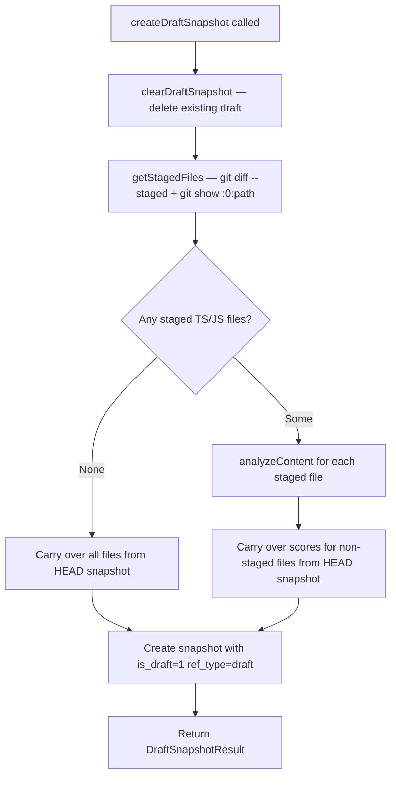

# Draft Snapshots for Staged Files

## Problem Statement

There is no way to analyze staged (pre-commit) file content without committing first. Staged content can differ significantly from both the working tree and the committed HEAD — it represents exactly what will be committed. A developer wants to know the health impact of their staged changes before the commit is recorded in history.

This phase adds a `DraftSnapshotService` that retrieves staged file content via `git show :0:<path>`, analyzes only those files, carries over scores for unstaged files from the HEAD snapshot, and stores the result as a single replaceable draft (one per repository).

## New File

`clients/desktop/src/main/analysis/draft-snapshot-service.ts`

## Key Concept: Staged Content Retrieval

Git provides access to the staging area (index) via the `:0:` prefix:

```bash
git show :0:src/utils/parser.ts
```

The `:0:` notation means "stage 0 of this path" — the version in the merged index, as distinct from unmerged conflict stages (`:1:`, `:2:`, `:3:`). This is different from:

| Command                | Returns                                  |
| ---------------------- | ---------------------------------------- |
| `git show HEAD:<path>` | Last committed version                   |
| `git show :0:<path>`   | Staged (index) version                   |
| Reading from disk      | Working tree (may have unstaged changes) |

Only the staged version is relevant for draft snapshots.

## Key Types

```typescript
// clients/desktop/src/main/analysis/draft-snapshot-service.ts

export interface DraftSnapshotResult {
  snapshotId: number;
  stagedFilesAnalyzed: number;
  committedFilesCarriedOver: number;
  draftSha: string;
}

export interface StagedFileInfo {
  path: string; // repo-relative path
  stagedContent: string; // full file content from git show :0:<path>
  status: 'added' | 'modified' | 'renamed';
}
```

## Class Interface

```typescript
// clients/desktop/src/main/analysis/draft-snapshot-service.ts

import { createHash } from 'node:crypto';
import type { UtilityProcessManager } from '../analysis/utility-process-manager';
import type { DatabaseSync } from 'node:sqlite';
import type { SnapshotRepository } from '../db/interfaces';
import type { GitStatusService } from '../git/git-status-service';

export class DraftSnapshotService {
  constructor(
    private utilityManager: UtilityProcessManager,
    private db: DatabaseSync,
    private snapshotRepo: SnapshotRepository,
    private repoPath: string,
    private gitStatusService: GitStatusService
  ) {
    // Auto-invalidate on branch switch or new commit — clearDraftSnapshot is synchronous
    this.gitStatusService.on('branch-switched', () => this.clearDraftSnapshot());
    this.gitStatusService.on('new-commit', () => this.clearDraftSnapshot());
  }

  /** Create a draft snapshot from currently staged files. Clears any existing draft first. */
  createDraftSnapshot(): Promise<DraftSnapshotResult>;

  /** Get the current draft snapshot if one exists for this repo. */
  getDraftSnapshot(): SnapshotRecord | null;

  /**
   * Delete the draft snapshot and its snapshot_files rows.
   * Synchronous — DatabaseSync.prepare().run() is synchronous.
   * Called from event handlers (branch-switched, new-commit) without await.
   */
  clearDraftSnapshot(): void;

  /** Retrieve all staged file paths and their content from the git index. */
  private getStagedFiles(): Promise<StagedFileInfo[]>;

  /** Produce a deterministic, per-repo SHA for the draft snapshot record. */
  private getDraftSha(): string;
}
```

## Deterministic Draft SHA

```typescript
private getDraftSha(): string {
  return createHash('sha256')
    .update(this.repoPath + ':draft')
    .digest('hex')
    .slice(0, 40);
}
```

This ensures only one draft SHA exists per repository. Because `is_draft = 1` rows are excluded from the composite unique index (migration 15), the same SHA can appear in multiple rows without violating the constraint — but `createDraftSnapshot` always calls `clearDraftSnapshot()` first, so there is never more than one draft row per repo in practice.

## `createDraftSnapshot` Flow



**Implementation sketch:**

```typescript
async createDraftSnapshot(): Promise<DraftSnapshotResult> {
  // clearDraftSnapshot is synchronous — no await
  this.clearDraftSnapshot();

  const draftSha = this.getDraftSha();
  const stagedFiles = await this.getStagedFiles();

  // createSnapshot is synchronous (DatabaseSync) and returns the new snapshot ID
  const snapshotId = this.snapshotRepo.createSnapshot({
    gitSha: draftSha,
    // Note: refType and isDraft are Phase 01 schema additions — extend createSnapshot
    // to accept these optional fields once migration 15 is applied.
  });

  if (stagedFiles.length === 0) {
    // No staged files — carry over everything from the most recent non-draft snapshot.
    // getAllSnapshots() returns all snapshots ordered by date; filter to find HEAD snapshot.
    const allSnapshots = this.snapshotRepo.getAllSnapshots();
    const headSnapshot = allSnapshots.find(s => !s.is_draft) ?? null;
    const carriedOver = headSnapshot ? this.carryOverFromSnapshot(headSnapshot.id, snapshotId, []) : 0;
    return { snapshotId, stagedFilesAnalyzed: 0, committedFilesCarriedOver: carriedOver, draftSha };
  }

  // Dispatch file analyses to the utility process in parallel (same pattern as
  // HistoricalSnapshotService.createSnapshotForCommit)
  let stagedFilesAnalyzed = 0;
  await Promise.allSettled(
    stagedFiles.map(async file => {
      try {
        const result = await this.utilityManager.analyzeContent(file.stagedContent, file.path);
        // Store result: ensure the file record exists then link to snapshot
        // utilityManager.analyzeContent returns an AnalysisResult with pluginResults
        const fileId = this.db.prepare(`INSERT OR IGNORE INTO files (path) VALUES (?); SELECT id FROM files WHERE path = ?`);
        // In practice, use the DatabaseService's ensureFile() method to get/create the file record
        // then call snapshotRepo.linkFileToSnapshot(snapshotId, fileId, overallScore, pluginResults)
        stagedFilesAnalyzed++;
      } catch {
        // Skip binary files or files that fail analysis — continue.
      }
    })
  );

  const stagedPaths = stagedFiles.map(f => f.path);
  const allSnapshots = this.snapshotRepo.getAllSnapshots();
  const headSnapshot = allSnapshots.find(s => !s.is_draft) ?? null;
  const carriedOver = headSnapshot
    ? this.carryOverFromSnapshot(headSnapshot.id, snapshotId, stagedPaths)
    : 0;

  return { snapshotId, stagedFilesAnalyzed, committedFilesCarriedOver: carriedOver, draftSha };
}

/**
 * Store file analysis results and link to the snapshot.
 * Uses the existing SnapshotRepository.linkFileToSnapshot pattern established in SnapshotService.
 * Requires the file to be registered in the `files` table first (use DatabaseService.ensureFile).
 */
private storeFileResult(snapshotId: number, fileId: number, analysisResult: unknown): void {
  const overallScore = /* extract from analysisResult */ null;
  const pluginResults = /* extract from analysisResult */ {};
  this.snapshotRepo.linkFileToSnapshot(snapshotId, fileId, overallScore, pluginResults);
}
```

## `getStagedFiles` Implementation

```typescript
private async getStagedFiles(): Promise<StagedFileInfo[]> {
  // Step 1: Get the list of staged paths with their status.
  // Command: git diff --staged --name-status --diff-filter=ACM
  // Output format (tab-separated):
  //   M\tsrc/utils/parser.ts
  //   A\tsrc/new-file.ts
  //   R100\tsrc/old-name.ts\tsrc/new-name.ts

  // Step 2: For each path, retrieve staged content.
  // Command: git show :0:<path>
  // This returns the staged (index) content, not the working tree content.

  // Step 3: Filter to TypeScript/JavaScript files only.
  // Allowed extensions: .ts, .tsx, .js, .jsx
  const ALLOWED_EXTENSIONS = new Set(['.ts', '.tsx', '.js', '.jsx']);
}
```

Only TypeScript and JavaScript files are analyzed. Other file types (CSS, JSON, images, etc.) are skipped — there are no plugins for them in the current analyzer set.

## Carry-Over SQL

For files not staged, carry over scores from the HEAD commit's snapshot. This produces a complete "if I commit right now" health picture:

```sql
INSERT INTO snapshot_files (snapshot_id, file_path, score, plugin_id, report_type, raw_metrics)
SELECT :newSnapshotId, sf.file_path, sf.score, sf.plugin_id, sf.report_type, sf.raw_metrics
FROM snapshot_files sf
WHERE sf.snapshot_id = :headSnapshotId
  AND sf.file_path NOT IN (SELECT value FROM json_each(:stagedPaths));
```

This is the same pattern established in phase 03 and reused in phase 06.

## Auto-Invalidation

Draft snapshots are meaningless after a branch switch or a new commit because the HEAD snapshot they carry over from no longer reflects the current state. The service subscribes to `GitStatusService` events in the constructor:

```typescript
// In DraftSnapshotService constructor:
this.gitStatusService.on('branch-switched', () => this.clearDraftSnapshot());
this.gitStatusService.on('new-commit', () => this.clearDraftSnapshot());
```

`clearDraftSnapshot` is synchronous and is a no-op when no draft exists.

## `clearDraftSnapshot` Implementation

```typescript
clearDraftSnapshot(): void {
  const draftSha = this.getDraftSha();
  // snapshot_files rows are deleted by ON DELETE CASCADE (established in Phase 01).
  // DatabaseSync.prepare().run() is synchronous — no await needed.
  this.db
    .prepare(`DELETE FROM snapshots WHERE git_sha = ? AND is_draft = 1`)
    .run(draftSha);
}
```

The `snapshot_files` and `snapshot_metrics` tables have `ON DELETE CASCADE` on the `snapshots(id)` foreign key (established in phase 01), so child rows are removed automatically.

## Extended IPC Channels

Extend `clients/desktop/src/main/ipc/handlers/snapshots.ts` with the following three handlers.

### `snapshots:createDraft`

Analyze staged files and create or replace the draft snapshot.

**Request:** `void`

**Response:** `DraftSnapshotResult`

**Error cases:**

| Condition                                | Behavior                                                                          |
| ---------------------------------------- | --------------------------------------------------------------------------------- |
| No staged files                          | Returns `{ stagedFilesAnalyzed: 0, committedFilesCarriedOver: N }` — not an error |
| No HEAD snapshot exists                  | Returns `{ committedFilesCarriedOver: 0 }` — staged files analyzed only           |
| `git show :0:<path>` fails (binary file) | Skips that file; continues with remaining                                         |

### `snapshots:getDraft`

Return the current draft snapshot record if one exists.

**Request:** `void`

**Response:** `SnapshotRecord | null`

**Flow:** `snapshotRepo.getDraftSnapshot(repoPath)` — queries by `is_draft = 1` and `git_sha = getDraftSha()`.

### `snapshots:clearDraft`

Delete the draft snapshot explicitly (e.g., user discards staged changes).

**Request:** `void`

**Response:** `void`

## Error Cases Summary

| Scenario                         | Behavior                                                          |
| -------------------------------- | ----------------------------------------------------------------- |
| No staged files                  | Not an error; carries over all files from HEAD snapshot           |
| No HEAD snapshot                 | Analyzes staged files only; `committedFilesCarriedOver = 0`       |
| `git show :0:<path>` fails       | Skip the file, continue processing remaining staged files         |
| Branch switch while draft exists | `clearDraftSnapshot()` fires automatically via event subscription |
| New commit while draft exists    | `clearDraftSnapshot()` fires automatically via event subscription |

## Testing

File: `clients/desktop/src/main/analysis/draft-snapshot-service.test.ts`

```typescript
import { describe, it, expect, vi, beforeEach } from 'vitest';
import { DraftSnapshotService } from './draft-snapshot-service';
// Mock: UtilityProcessManager, DatabaseSync, SnapshotRepository, GitStatusService.

describe('DraftSnapshotService', () => {
  describe('createDraftSnapshot', () => {
    it('clears existing draft before creating new one', async () => {
      // Arrange: spy on clearDraftSnapshot; a draft record exists.
      // Act: createDraftSnapshot().
      // Assert: clearDraftSnapshot called before createSnapshot.
    });

    it('uses staged content from git show :0:<path>', async () => {
      // Arrange: mock getStagedFiles returning [{ path: 'src/a.ts', stagedContent: '...' }].
      // Assert: utilityManager.analyzeContent called with the staged content, not disk content.
    });

    it('carries over HEAD snapshot scores for non-staged files', async () => {
      // Arrange: HEAD snapshot has two files; one is staged, one is not.
      // Assert: carryOverFromSnapshot called with the non-staged path excluded.
    });

    it('stores snapshot with is_draft=1 and ref_type=draft', async () => {
      // Arrange: spy snapshotRepo.createSnapshot.
      // Assert: createSnapshot called with { refType: 'draft', isDraft: true }.
    });

    it('uses deterministic SHA based on repoPath', async () => {
      // Arrange: two DraftSnapshotService instances with same repoPath.
      // Assert: getDraftSha() returns the same value for both.
    });

    it('returns stagedFilesAnalyzed=0 and carries over all files when no staged files', async () => {
      // Arrange: getStagedFiles returns []; HEAD snapshot has 5 files.
      // Assert: result.stagedFilesAnalyzed===0, result.committedFilesCarriedOver===5.
    });

    it('skips binary files that cause git show to fail', async () => {
      // Arrange: getStagedFiles returns two files; engine.analyzeContent throws for one.
      // Assert: result.stagedFilesAnalyzed===1 (only the successful one).
    });

    it('returns committedFilesCarriedOver=0 when no HEAD snapshot exists', async () => {
      // Arrange: snapshotRepo.getAllSnapshots returns [] (no non-draft snapshots).
      // Assert: result.committedFilesCarriedOver===0.
    });
  });

  describe('clearDraftSnapshot', () => {
    it('deletes draft snapshot row (cascade removes snapshot_files)', async () => {
      // Arrange: a draft row exists with the deterministic SHA.
      // Act: clearDraftSnapshot().
      // Assert: DELETE FROM snapshots WHERE git_sha=? AND is_draft=1 executed.
    });

    it('is a no-op when no draft exists', async () => {
      // Arrange: no draft row in DB.
      // Act: clearDraftSnapshot().
      // Assert: no error thrown; no DB rows affected.
    });
  });

  describe('auto-invalidation', () => {
    it('clears draft when branch-switched event fires', async () => {
      // Arrange: spy clearDraftSnapshot; construct service with mock gitStatusService.
      // Act: emit 'branch-switched' on gitStatusService.
      // Assert: clearDraftSnapshot called.
    });

    it('clears draft when new-commit event fires', async () => {
      // Arrange: spy clearDraftSnapshot.
      // Act: emit 'new-commit' on gitStatusService.
      // Assert: clearDraftSnapshot called.
    });
  });

  describe('getDraftSha', () => {
    it('produces a 40-character hex string', () => {
      // Assert: getDraftSha().length === 40 and /^[0-9a-f]+$/.test(sha).
    });

    it('is stable across multiple calls for the same repoPath', () => {
      // Assert: two calls to getDraftSha() return identical strings.
    });
  });
});
```

## Phase Verification Checklist

| Criterion                                                         | How to Verify                                                   |
| ----------------------------------------------------------------- | --------------------------------------------------------------- |
| Staged content retrieved via `git show :0:<path>` (not from disk) | Unit test: `uses staged content from git show :0:<path>`        |
| `is_draft = 1` and `ref_type = 'draft'` stored in snapshot        | Unit test: `stores snapshot with is_draft=1 and ref_type=draft` |
| Deterministic SHA produces at most one draft per repo             | Unit test: `uses deterministic SHA based on repoPath`           |
| Existing draft replaced on each call                              | Unit test: `clears existing draft before creating new one`      |
| Binary/failing files skipped without aborting                     | Unit test: `skips binary files that cause git show to fail`     |
| Draft cleared on branch switch                                    | Unit test: `clears draft when branch-switched event fires`      |
| Draft cleared on new commit                                       | Unit test: `clears draft when new-commit event fires`           |
| `clearDraftSnapshot` is a no-op when no draft exists              | Unit test: `is a no-op when no draft exists`                    |
