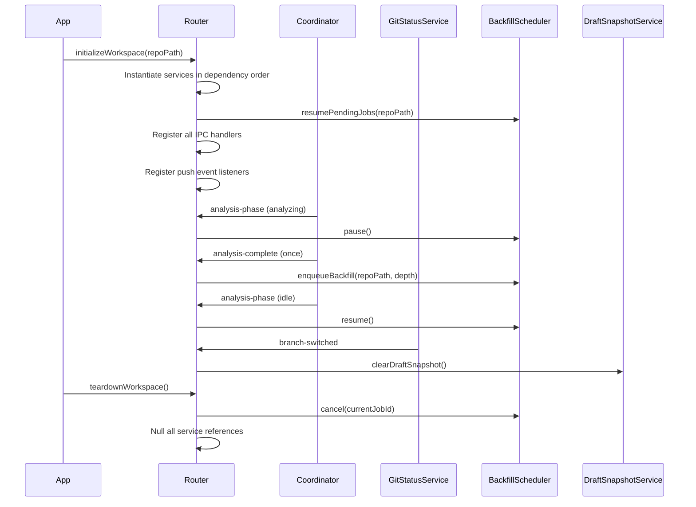

# IPC Router Integration

## Problem Statement

All new Phase 2–7 services need instantiation and wiring in the IPC router. The current router does not instantiate `GitContentService`, `HistoricalSnapshotService`, `BackfillScheduler`, `DraftSnapshotService`, or `WorktreeAnalysisService`. Workspace switches leave stale service references. Coordinator pause/resume integration and git-status-driven draft invalidation are unwired. Push events for backfill progress are unregistered.

## File to Modify

```
clients/desktop/src/main/ipc/router.ts
```

## Service Instantiation Order

New services must be created in dependency order inside the `initializeWorkspace(repoPath)` function (or its equivalent):

```typescript
// 1. No external deps — create first
const gitContentService = new GitContentService(repoPath);
const tagQueries = new TagQueries(db);

// 2. Depends on utilityManager + gitContentService + db
const historicalSnapshotService = new HistoricalSnapshotService(
  utilityManager, // UtilityProcessManager, not AnalysisEngine
  gitContentService,
  db,
  snapshotRepository
);

// 3. Depends on historicalSnapshotService + gitContentService + db
const backfillScheduler = new BackfillScheduler(historicalSnapshotService, gitContentService, db);

// 4. Depends on utilityManager + db + gitStatusService (gitStatusService auto-wires invalidation)
const draftSnapshotService = new DraftSnapshotService(
  utilityManager,
  db,
  snapshotRepository,
  repoPath,
  gitStatusService // required — DraftSnapshotService subscribes to branch-switched / new-commit
);

// 5. Depends on worktreeDetectionService + gitContentService + utilityManager + snapshotRepository + db
const worktreeAnalysisService = new WorktreeAnalysisService(
  worktreeDetectionService, // WorktreeDetectionService, not WorktreeService
  gitContentService,
  utilityManager,
  snapshotRepository,
  db
);
```

All five variables are declared in the enclosing scope (alongside the existing `engine`, `db`, etc.) so `teardownWorkspace()` can null them out.

## Coordinator Pause/Resume Wiring

The `BackfillScheduler` must not compete with live analysis for system resources. Wire the existing coordinator's `analysis-phase` event immediately after services are instantiated:

```typescript
coordinator.on(
  'analysis-phase',
  ({ phase, totalFiles }: { phase: AnalysisPhase; totalFiles: number }) => {
    if (phase === 'analyzing' || phase === 'scanning') {
      backfillScheduler?.pause();
    } else if (phase === 'idle' || phase === 'complete') {
      backfillScheduler?.resume();
    }
  }
);
```

`AnalysisPhase` is imported from `coordinator.ts` — do not use a loose `string` type here.

## Git Status → Draft Invalidation

**Note:** `DraftSnapshotService` subscribes to `GitStatusService` events internally in its constructor (see Phase 07). The router does NOT re-wire these events — doing so would cause double-clearing. The `gitStatusService` argument is passed to `DraftSnapshotService` at construction time and the service self-registers. No additional wiring is required in the router.

## Auto-Start Backfill

After the first analysis completes for a newly opened workspace, kick off historical backfill automatically. Use `once` so subsequent re-analyses (file saves, etc.) do not re-enqueue:

```typescript
coordinator.once('analysis-complete', async () => {
  const inputs = await gatherBackfillInputs(repoPath);
  const depth = calculateAdaptiveBackfillDepth(inputs);
  await backfillScheduler.enqueueBackfill(repoPath, depth);
});
```

`gatherBackfillInputs` and `calculateAdaptiveBackfillDepth` are defined in the backfill module (Phase 04). They return the repo age estimate and an appropriate commit depth ceiling.

## Resume Pending Jobs on Startup

Before any handlers are registered, resume any backfill jobs that were interrupted by a previous app shutdown:

```typescript
// At top of initializeWorkspace(), before handler registration:
await backfillScheduler?.resumePendingJobs(repoPath);
```

## Handler Registration

Register all new handlers using the **module-local `requireService()` guard pattern** established in `scheduler.ts` and `monitoring.ts`. Each handler file declares a module-level `null` ref, a setter, and a zero-argument guard function that throws when the service is not initialized. The router calls the setter when a workspace is opened/closed.

**Pattern (from `scheduler.ts`):**

```typescript
// Module-level ref
let schedulerRef: BackfillScheduler | null = null;

export function setBackfillScheduler(service: BackfillScheduler | null): void {
  schedulerRef = service;
}

function requireScheduler(): BackfillScheduler {
  if (!schedulerRef) throw new Error('Backfill scheduler not initialized. Open a workspace first.');
  return schedulerRef;
}
```

This pattern is **not** a higher-order wrapper that takes service references as arguments. See `scheduler.ts` for the complete reference implementation.

### Tag Channels

The `tags.ts` handler file owns the module-level refs for `gitContentService`, `tagQueries`, `historicalSnapshotService`, and `snapshotRepository`. The router calls `setTagServices(...)` on workspace open.

```typescript
ipcMain.handle('tags:list', async () => tagsHandler.list());

ipcMain.handle('tags:analyze', async (_event, req: TagAnalyzeRequest) => tagsHandler.analyze(req));

ipcMain.handle('tags:getSnapshot', async (_event, req: { tagName: string }) =>
  tagsHandler.getSnapshot(req)
);

ipcMain.handle('tags:refresh', async () => tagsHandler.refresh());
```

### Backfill Channels

```typescript
ipcMain.handle('backfill:enqueue', async (_event, req: BulkAnalysisRequest) =>
  requireScheduler().enqueueBackfill(req.repoPath, req.depth)
);

ipcMain.handle('backfill:cancel', async (_event, req: { jobId: string }) =>
  requireScheduler().cancel(req.jobId)
);

ipcMain.handle('backfill:pause', async () => requireScheduler().pause());

ipcMain.handle('backfill:resume', async () => requireScheduler().resume());

ipcMain.handle('backfill:getStatus', async () => requireScheduler().getCurrentProgress());

ipcMain.handle('backfill:getSuggestedDepth', async () => {
  const inputs = await gatherBackfillInputs(repoPath);
  return calculateAdaptiveBackfillDepth(inputs);
});
```

### Snapshot Channels (draft — additions to existing `snapshots:*` group)

```typescript
ipcMain.handle('snapshots:createDraft', async () =>
  requireDraftSnapshotService().createDraftSnapshot()
);

ipcMain.handle('snapshots:getDraft', async () => requireDraftSnapshotService().getDraftSnapshot());

ipcMain.handle('snapshots:clearDraft', async () =>
  requireDraftSnapshotService().clearDraftSnapshot()
);
```

### Worktree Channels (extensions to existing `worktrees:*` group)

```typescript
ipcMain.handle('worktrees:analyze', async (_event, req) =>
  requireWorktreeAnalysisService().analyzeWorktree(req)
);

ipcMain.handle('worktrees:getSnapshot', async (_event, req: { worktreePath: string }) =>
  requireWorktreeAnalysisService()
    .listWorktreesWithStatus(req.worktreePath)
    .then(wts =>
      wts[0] ? (requireSnapshotRepo().getSnapshotsByWorktree(req.worktreePath)[0] ?? null) : null
    )
);

ipcMain.handle('worktrees:compare', async (_event, req) =>
  requireWorktreeAnalysisService().compareToMain(req.worktreePath, req.mainRepoPath)
);

ipcMain.handle('worktrees:listWithStatus', async (_event, req) =>
  requireWorktreeAnalysisService().listWorktreesWithStatus(req.mainRepoPath)
);
```

## Push Events Registration

Register push events immediately after the services are instantiated and before the app window is shown. `mainWindow` must already exist at this point.

```typescript
// Use the sendToRenderer() helper exported from router.ts — do not call
// mainWindow?.webContents.send() directly. sendToRenderer() handles null-checking
// and is the established pattern in the codebase.
backfillScheduler?.on('progress', (progress: BackfillProgress) => {
  sendToRenderer('backfill:progress', progress);
});

backfillScheduler?.on('completed', result => {
  sendToRenderer('backfill:completed', result);
});

backfillScheduler?.on('failed', error => {
  sendToRenderer('backfill:failed', error);
});
```

## Workspace Switch Cleanup

When the user switches workspace, tear down all services cleanly before `initializeWorkspace` is called with the new path. Cancel in-flight jobs before nulling references so the scheduler does not emit into a dead closure:

```typescript
function teardownWorkspace(): void {
  if (currentJobId) {
    backfillScheduler?.cancel(currentJobId);
  }
  draftSnapshotService?.clearDraftSnapshot();

  gitContentService = null;
  historicalSnapshotService = null;
  backfillScheduler = null;
  draftSnapshotService = null;
  worktreeAnalysisService = null;
  tagQueries = null;
}
```

Call `teardownWorkspace()` before calling `initializeWorkspace(newRepoPath)` in the existing workspace-switch flow.

## Channel Inventory

| Channel                      | Service                                          | Direction |
| ---------------------------- | ------------------------------------------------ | --------- |
| `tags:list`                  | `GitContentService` + `TagQueries`               | invoke    |
| `tags:analyze`               | `HistoricalSnapshotService` + `TagQueries`       | invoke    |
| `tags:getSnapshot`           | `SnapshotRepository`                             | invoke    |
| `tags:refresh`               | `GitContentService` + `TagQueries`               | invoke    |
| `backfill:enqueue`           | `BackfillScheduler`                              | invoke    |
| `backfill:cancel`            | `BackfillScheduler`                              | invoke    |
| `backfill:pause`             | `BackfillScheduler`                              | invoke    |
| `backfill:resume`            | `BackfillScheduler`                              | invoke    |
| `backfill:getStatus`         | `BackfillScheduler`                              | invoke    |
| `backfill:getSuggestedDepth` | `BackfillScheduler` (read-only)                  | invoke    |
| `backfill:progress`          | `BackfillScheduler`                              | push      |
| `backfill:completed`         | `BackfillScheduler`                              | push      |
| `backfill:failed`            | `BackfillScheduler`                              | push      |
| `snapshots:createDraft`      | `DraftSnapshotService`                           | invoke    |
| `snapshots:getDraft`         | `DraftSnapshotService`                           | invoke    |
| `snapshots:clearDraft`       | `DraftSnapshotService`                           | invoke    |
| `worktrees:analyze`          | `WorktreeAnalysisService`                        | invoke    |
| `worktrees:getSnapshot`      | `WorktreeAnalysisService` + `SnapshotRepository` | invoke    |
| `worktrees:compare`          | `WorktreeAnalysisService`                        | invoke    |
| `worktrees:listWithStatus`   | `WorktreeAnalysisService`                        | invoke    |
| `history:getCommitSummaries` | `GitContentService`                              | invoke    |
| `history:analyzeCommit`      | `HistoricalSnapshotService`                      | invoke    |
| `snapshots:hasForCommit`     | `SnapshotRepository`                             | invoke    |

## Wiring Sequence



## Testing

```typescript
describe('IPC Router wiring', () => {
  it('instantiates GitContentService before HistoricalSnapshotService', () => {
    // Verify constructor call order using sinon or jest.fn() order tracking
  });

  it('pauses backfill when coordinator emits analyzing phase', async () => {
    coordinator.emit('analysis-phase', { phase: 'analyzing' });
    expect(mockBackfillScheduler.pause).toHaveBeenCalledTimes(1);
  });

  it('resumes backfill when coordinator emits idle phase', async () => {
    coordinator.emit('analysis-phase', { phase: 'idle' });
    expect(mockBackfillScheduler.resume).toHaveBeenCalledTimes(1);
  });

  it('clears draft snapshot on branch-switched event', async () => {
    gitStatusService.emit('branch-switched');
    expect(mockDraftSnapshotService.clearDraftSnapshot).toHaveBeenCalledTimes(1);
  });

  it('clears draft snapshot on new-commit event', async () => {
    gitStatusService.emit('new-commit');
    expect(mockDraftSnapshotService.clearDraftSnapshot).toHaveBeenCalledTimes(1);
  });

  it('auto-starts backfill after first analysis-complete', async () => {
    coordinator.emit('analysis-complete');
    await vi.runAllTimersAsync();
    expect(mockBackfillScheduler.enqueueBackfill).toHaveBeenCalledTimes(1);
    // Second emit must not enqueue again
    coordinator.emit('analysis-complete');
    expect(mockBackfillScheduler.enqueueBackfill).toHaveBeenCalledTimes(1);
  });

  it('tears down all services on workspace switch', async () => {
    teardownWorkspace();
    expect(mockBackfillScheduler.cancel).toHaveBeenCalledWith(currentJobId);
    expect(mockDraftSnapshotService.clearDraftSnapshot).toHaveBeenCalled();
    expect(router.gitContentService).toBeNull();
    expect(router.backfillScheduler).toBeNull();
  });

  it('returns descriptive error when handler called with no repo open', async () => {
    teardownWorkspace(); // null all services
    await expect(ipcMain.emit('backfill:getStatus')).rejects.toThrow(
      /backfill:getStatus.*no repo/i
    );
  });
});
```
