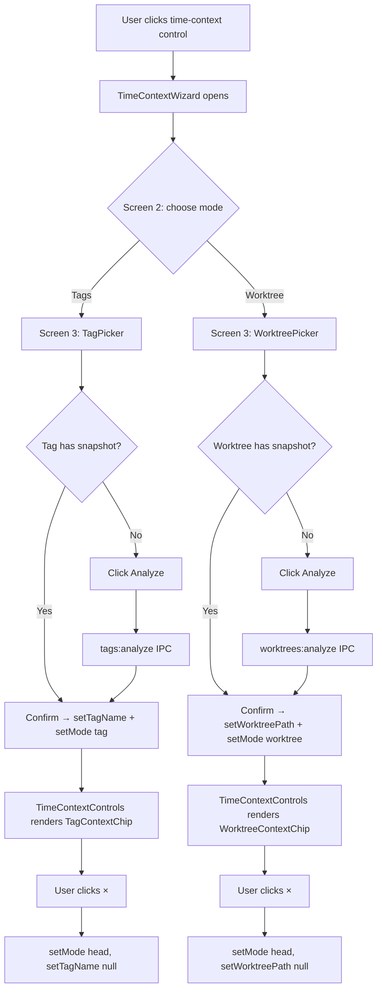

# Tag & Worktree Time-Context Navigation

## Problem Statement

`time-context.ts` declares a `worktree` mode and a `worktreePath` field, but no UI exposes them. `branch-or-tag` mode exists in the store yet only branches appear in the picker — tags are silently omitted. Users have no path to navigate to a tagged release or to view analysis scoped to a specific worktree. This phase wires both surfaces end-to-end: new hooks, new picker components, store additions, and wizard screen additions.

## New Files

| File                                                                | Role                                                     |
| ------------------------------------------------------------------- | -------------------------------------------------------- |
| `clients/desktop/src/renderer/hooks/useTagList.ts`                  | Fetches and caches the tag list per repo path            |
| `clients/desktop/src/renderer/hooks/useWorktreeList.ts`             | Fetches live worktree-with-status list                   |
| `clients/desktop/src/renderer/components/header/TagPicker.tsx`      | Dropdown for selecting and triggering tag analysis       |
| `clients/desktop/src/renderer/components/header/WorktreePicker.tsx` | Card list for selecting and triggering worktree analysis |

## Hook: `useTagList`

```typescript
// clients/desktop/src/renderer/hooks/useTagList.ts

import { TagListItem } from '@shared/ipc/tag-types';

interface UseTagListReturn {
  tags: TagListItem[];
  isLoading: boolean;
  error: string | null;
  refresh: () => Promise<void>;
}

export function useTagList(): UseTagListReturn;
```

### Implementation Notes

- Call `window.api.tags.list({ repoPath })` on mount.
- Cache results in a module-level `Map<string, TagListItem[]>` keyed by `repoPath`. This prevents redundant fetches when the component re-mounts within the same session (e.g., wizard open/close cycles).
- `refresh()` deletes the cache entry for the current `repoPath` and re-fetches.
- After `window.api.tags.analyze()` resolves successfully, update the cached entry's `hasSnapshot` field for the analyzed tag name — do not invalidate the whole cache.
- `repoPath` is read from the workspace store (same source used by all main-process calls).

## Hook: `useWorktreeList`

```typescript
// clients/desktop/src/renderer/hooks/useWorktreeList.ts

import { WorktreeWithStatus } from '@shared/ipc/worktree-types';

interface UseWorktreeListReturn {
  worktrees: WorktreeWithStatus[];
  isLoading: boolean;
  error: string | null;
}

export function useWorktreeList(): UseWorktreeListReturn;
```

### Implementation Notes

- Call `window.api.worktrees.listWithStatus({ mainRepoPath })` on mount.
- Do not cache — worktrees can be created or deleted between wizard opens, and the list is short (typically fewer than five items).
- `WorktreeWithStatus` is defined in Phase 06 (`worktree-analysis-service.ts`). It extends `WorktreeInfo` from `worktree-types.ts` with snapshot status fields. Use the exact field names from `WorktreeInfo`: `head` (not `headSha`), `locked` (not `isLocked`), `bare` (not `isBare`). The `isMain` field does not exist on `WorktreeInfo` — derive "main" status as `wt.path === mainRepoPath` when needed.

## Component: `TagPicker`

```typescript
// clients/desktop/src/renderer/components/header/TagPicker.tsx

import { TagListItem } from '@shared/ipc/tag-types';

interface TagPickerProps {
  selectedTag: string | null;
  onSelect: (tagName: string) => void;
  onAnalyze: (tagName: string) => void;
  className?: string;
}

export function TagPicker({
  selectedTag,
  onSelect,
  onAnalyze,
  className,
}: TagPickerProps): JSX.Element;
```

### Rendering Specification

- Wrap in a `Dropdown` (select variant from `@vipr/ui`) populated from `useTagList()`.
- Each option label: tag name + a `Badge` to the right:
  - `hasSnapshot === true`: `Badge` text "analyzed", `bg-green-500/20 text-green-700 dark:bg-green-500/10 dark:text-green-400`
  - `hasSnapshot === false`: `Badge` text "not analyzed", `bg-gray-500/20 text-gray-600 dark:text-gray-400`
- When the user selects an unanalyzed tag, render an "Analyze this tag" `Button` (primary, small) inline below the dropdown. Clicking it calls `onAnalyze(tagName)`.
- While `isLoading` is true, render a skeleton placeholder sized to match the dropdown.
- Empty state (no tags): render a centered message "No tags found" with a "Refresh" `Button` that calls `refresh()`.
- `onSelect` is called immediately when the user changes the dropdown value, regardless of whether the tag has a snapshot.

## Component: `WorktreePicker`

```typescript
// clients/desktop/src/renderer/components/header/WorktreePicker.tsx

import { WorktreeWithStatus } from '@shared/ipc/worktree-types';

interface WorktreePickerProps {
  selectedWorktreePath: string | null;
  onSelect: (worktreePath: string) => void;
  onAnalyze: (worktreePath: string) => void;
  className?: string;
}

export function WorktreePicker({
  selectedWorktreePath,
  onSelect,
  onAnalyze,
  className,
}: WorktreePickerProps): JSX.Element;
```

### Rendering Specification

Render worktrees as a stacked card list rather than a dropdown — the list is short and users benefit from seeing all worktrees at once.

Each card contains:

| Element       | Content                                                      |
| ------------- | ------------------------------------------------------------ |
| Branch name   | Bold, full branch name                                       |
| HEAD SHA      | `wt.head.slice(0, 7)`, monospace (`WorktreeInfo.head` field) |
| Path          | Filesystem path, truncated to 40 chars with ellipsis         |
| Status badges | See badge spec below                                         |
| Action button | "Analyze" (shown only when `hasSnapshot === false`)          |

Badge color tokens:

- Analyzed: `bg-green-500/20 text-green-700 dark:bg-green-500/10 dark:text-green-400` — label "analyzed"
- Not analyzed: `bg-gray-500/20 text-gray-600 dark:text-gray-400` — label "not analyzed"
- Locked: `bg-yellow-500/20 text-yellow-700 dark:bg-yellow-500/10 dark:text-yellow-400` — label "locked"
- Bare: `bg-gray-500/20 text-gray-600 dark:text-gray-400` — label "bare"

Selected state: outline the active card with `ring-2 ring-blue-500`.

Empty state: render "No related worktrees found" centered in the list area.

`onSelect` is called when the user clicks anywhere on the card body (excluding the Analyze button). `onAnalyze` is called only when the Analyze button is clicked.

## Store Modifications

File: `clients/desktop/src/renderer/stores/time-context.ts`

### State Additions

```typescript
// Add to TimeContextState:
tagName: string | null;

// Add to TimeContextActions:
setTagName: (tagName: string | null) => void;
```

### Mode Reset State

Extend `MODE_RESET_STATE` so switching away from `tag` mode clears `tagName`:

```typescript
const MODE_RESET_STATE: Record<TimeContextMode, Partial<TimeContextState>> = {
  // ...existing entries...
  tag: { tagName: null },
  worktree: { worktreePath: null },
};
```

### `setTagName` Implementation

```typescript
setTagName: (tagName) =>
  set((state) => ({
    tagName,
    // switching to tag mode implicitly when a tag is named
    mode: tagName !== null ? 'tag' : state.mode,
  })),
```

## TimeContextWizard Modifications

File: `clients/desktop/src/renderer/components/header/TimeContextWizard.tsx`

### Screen 2 — Mode Selection

Add two new mode cards to the existing grid alongside the current options:

```
┌─────────────────────┐  ┌─────────────────────┐
│  Tags               │  │  Worktree           │
│  git tag icon       │  │  branch icon        │
│  "Analyze a tagged  │  │  "Compare a         │
│   release"          │  │   worktree"         │
└─────────────────────┘  └─────────────────────┘
```

Clicking "Tags" advances to a new Screen 3 variant (tag configure step). Clicking "Worktree" advances to a new Screen 3 variant (worktree configure step).

### Screen 3 — Tag Configure

Render `<TagPicker>` with:

```typescript
<TagPicker
  selectedTag={localTagName}
  onSelect={(name) => setLocalTagName(name)}
  onAnalyze={async (name) => {
    await window.api.tags.analyze({ tagName: name });
    setLocalTagName(name);
  }}
/>
```

Below the picker, a "Confirm" `Button` (primary) calls:

```typescript
timeContextStore.setTagName(localTagName);
timeContextStore.setMode('tag');
closeWizard();
```

Confirm is disabled when `localTagName` is null.

### Screen 3 — Worktree Configure

Render `<WorktreePicker>` with:

```typescript
<WorktreePicker
  selectedWorktreePath={localWorktreePath}
  onSelect={(path) => setLocalWorktreePath(path)}
  onAnalyze={async (path) => {
    // mainRepoPath is required by worktrees:analyze for path validation security check
    await window.api.worktrees.analyze({ worktreePath: path, mainRepoPath });
    setLocalWorktreePath(path);
  }}
/>
```

Below the picker, a "Confirm" `Button` (primary) calls:

```typescript
timeContextStore.setWorktreePath(localWorktreePath);
timeContextStore.setMode('worktree');
closeWizard();
```

Confirm is disabled when `localWorktreePath` is null.

## TimeContextControls Modifications

File: `clients/desktop/src/renderer/components/layout/TimeContextControls.tsx`

Add two new branches to the compact controls bar's mode switch:

```typescript
case 'tag':
  return <TagContextChip tagName={timeContext.tagName} onClick={openWizard} />;

case 'worktree':
  return <WorktreeContextChip worktreePath={timeContext.worktreePath} onClick={openWizard} />;
```

### `TagContextChip`

Inline component (can live in `TimeContextControls.tsx`):

```typescript
interface TagContextChipProps {
  tagName: string | null;
  onClick: () => void;
}
```

Renders: a pill showing "Tag: {tagName}" with an "×" icon button that calls `timeContextStore.setTagName(null)` and `timeContextStore.setMode('head')`.

### `WorktreeContextChip`

```typescript
interface WorktreeContextChipProps {
  worktreePath: string | null;
  onClick: () => void;
}
```

Renders: a pill showing the last path segment of `worktreePath` with an "×" icon button that calls `timeContextStore.setWorktreePath(null)` and `timeContextStore.setMode('head')`.

## Navigation Flow



## Testing

```typescript
describe('useTagList', () => {
  it('fetches tags on mount', async () => {
    const { result } = renderHook(() => useTagList());
    await waitFor(() => expect(result.current.isLoading).toBe(false));
    expect(window.api.tags.list).toHaveBeenCalledTimes(1);
    expect(result.current.tags).toHaveLength(mockTags.length);
  });

  it('caches tags per repoPath — second mount skips fetch', async () => {
    renderHook(() => useTagList());
    renderHook(() => useTagList());
    await waitFor(() => {});
    expect(window.api.tags.list).toHaveBeenCalledTimes(1);
  });

  it('refresh() busts cache and re-fetches', async () => {
    const { result } = renderHook(() => useTagList());
    await waitFor(() => expect(result.current.isLoading).toBe(false));
    await act(() => result.current.refresh());
    expect(window.api.tags.list).toHaveBeenCalledTimes(2);
  });
});

describe('TagPicker', () => {
  it('renders Dropdown with tags from useTagList', () => {
    render(<TagPicker selectedTag={null} onSelect={vi.fn()} onAnalyze={vi.fn()} />);
    expect(screen.getByRole('combobox')).toBeInTheDocument();
    expect(screen.getAllByRole('option')).toHaveLength(mockTags.length);
  });

  it('shows green Badge for analyzed tags', () => {
    render(<TagPicker selectedTag={null} onSelect={vi.fn()} onAnalyze={vi.fn()} />);
    const analyzedBadge = screen.getByText('analyzed');
    expect(analyzedBadge).toHaveClass('text-green-700');
  });

  it('shows EmptyState when tag list is empty', () => {
    mockUseTagList.mockReturnValue({ tags: [], isLoading: false, error: null, refresh: vi.fn() });
    render(<TagPicker selectedTag={null} onSelect={vi.fn()} onAnalyze={vi.fn()} />);
    expect(screen.getByText('No tags found')).toBeInTheDocument();
  });

  it('calls onAnalyze when Analyze button clicked for unanalyzed tag', async () => {
    const onAnalyze = vi.fn();
    render(<TagPicker selectedTag="v1.0.0" onSelect={vi.fn()} onAnalyze={onAnalyze} />);
    await userEvent.click(screen.getByRole('button', { name: /analyze this tag/i }));
    expect(onAnalyze).toHaveBeenCalledWith('v1.0.0');
  });
});

describe('WorktreePicker', () => {
  it('renders a card for each worktree from useWorktreeList', () => {
    render(
      <WorktreePicker selectedWorktreePath={null} onSelect={vi.fn()} onAnalyze={vi.fn()} />,
    );
    expect(screen.getAllByRole('article')).toHaveLength(mockWorktrees.length);
  });

  it('shows locked badge for worktrees with locked=true', () => {
    // WorktreeInfo uses 'locked: boolean' (not 'isLocked')
    render(
      <WorktreePicker selectedWorktreePath={null} onSelect={vi.fn()} onAnalyze={vi.fn()} />,
    );
    expect(screen.getByText('locked')).toHaveClass('text-yellow-700');
  });

  it('calls onSelect when worktree card clicked', async () => {
    const onSelect = vi.fn();
    render(
      <WorktreePicker selectedWorktreePath={null} onSelect={onSelect} onAnalyze={vi.fn()} />,
    );
    await userEvent.click(screen.getAllByRole('article')[0]);
    expect(onSelect).toHaveBeenCalledWith(mockWorktrees[0].path);
  });
});
```
