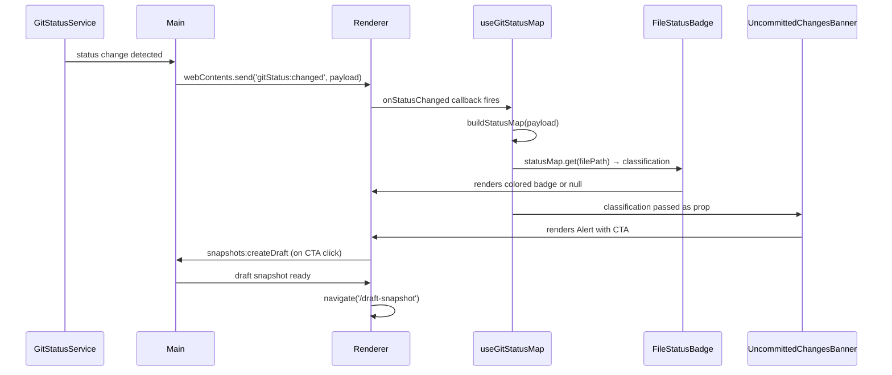

# File Status Badges (Staged/Unstaged)

## Problem Statement

File lists show no indication of dirty files. Quality scores displayed in `FileDetailLivePanel` and file tables may be stale relative to staged working-tree content. Users have no way to see which files have pending changes or to request an analysis of the staged version of a file. This phase introduces a real-time git status subscription hook, a reusable `FileStatusBadge`, a per-file `UncommittedChangesBanner`, and integrates both into the three locations where files are listed.

## New Files

| File                                                                               | Role                                                           |
| ---------------------------------------------------------------------------------- | -------------------------------------------------------------- |
| `clients/desktop/src/renderer/hooks/useGitStatusMap.ts`                            | Subscribes to git status push events and exposes a lookup map  |
| `clients/desktop/src/renderer/components/common/FileStatusBadge.tsx`               | Small inline badge showing staged/modified/conflict state      |
| `clients/desktop/src/renderer/components/file-detail/UncommittedChangesBanner.tsx` | Full-width warning banner shown at the top of file detail view |

## Hook: `useGitStatusMap`

```typescript
// clients/desktop/src/renderer/hooks/useGitStatusMap.ts
// Import the existing type from git-types.ts — do not redefine it here.
import type { GitFileClassification } from '@shared/ipc/git-types';

interface UseGitStatusMapReturn {
  statusMap: Map<string, GitFileClassification>;
  isLoading: boolean;
}

export function useGitStatusMap(): UseGitStatusMapReturn;
```

### Implementation Notes

Subscribe to `window.api.gitStatus.onStatusChanged` on mount and unsubscribe on unmount:

```typescript
useEffect(() => {
  setIsLoading(true);
  const unsubscribe = window.api.gitStatus.onStatusChanged(status => {
    setStatusMap(buildStatusMap(status));
    setIsLoading(false);
  });
  return () => unsubscribe();
}, []);
```

`buildStatusMap` constructs the `Map<filePath, GitFileClassification>` from the raw git status payload:

| Condition                                                | Classification                       |
| -------------------------------------------------------- | ------------------------------------ |
| File has index (staged) changes and working-tree changes | `'staged'` (staged takes precedence) |
| File has index changes only                              | `'staged'`                           |
| File has working-tree changes only                       | `'unstaged'`                         |
| File is in merge conflict                                | `'conflicted'`                       |
| File is untracked                                        | `'untracked'`                        |

The map enables O(1) per-row lookups in file tables — do not iterate the raw status array inside render.

`isLoading` is `true` from mount until the first push event arrives. Callers may use this to suppress badge rendering on initial paint.

## Component: `FileStatusBadge`

```typescript
// clients/desktop/src/renderer/components/common/FileStatusBadge.tsx
import type { GitFileClassification } from '@shared/ipc/git-types';

interface FileStatusBadgeProps {
  status: GitFileClassification | undefined;
  size?: 'xs' | 'sm';
  className?: string;
}

export function FileStatusBadge({
  status,
  size = 'xs',
  className,
}: FileStatusBadgeProps): JSX.Element | null;
```

### Rendering Specification

Return `null` when `status` is `undefined` (clean file, no badge rendered).

For all other states, render a small pill: a filled dot (4 px, `rounded-full`) followed by a label string. Use `size` to scale padding and font:

- `'xs'`: `px-1.5 py-0.5 text-xs`
- `'sm'`: `px-2 py-1 text-sm`

Color tokens per classification:

| Classification | Tailwind classes                                                              | Label       |
| -------------- | ----------------------------------------------------------------------------- | ----------- |
| `'staged'`     | `bg-yellow-500/20 text-yellow-700 dark:bg-yellow-500/10 dark:text-yellow-400` | "staged"    |
| `'unstaged'`   | `bg-orange-500/20 text-orange-700 dark:bg-orange-500/10 dark:text-orange-400` | "modified"  |
| `'conflicted'` | `bg-red-500/20 text-red-700 dark:bg-red-500/10 dark:text-red-400`             | "conflict"  |
| `'untracked'`  | `bg-gray-500/20 text-gray-600 dark:text-gray-400`                             | "untracked" |

Do not render a badge for `'untracked'` in list views — the caller can filter before passing `status`. The component still handles it for completeness.

## Component: `UncommittedChangesBanner`

```typescript
// clients/desktop/src/renderer/components/file-detail/UncommittedChangesBanner.tsx

interface UncommittedChangesBannerProps {
  filePath: string;
  classification: GitFileClassification;
  onAnalyzeStagedVersion: () => void;
}

export function UncommittedChangesBanner({
  filePath,
  classification,
  onAnalyzeStagedVersion,
}: UncommittedChangesBannerProps): JSX.Element;
```

### Rendering Specification

Render an `Alert` (from `@vipr/ui`) with `variant="banner"` and `type="warning"`.

Message text varies by classification:

| Classification | Message                                                                            |
| -------------- | ---------------------------------------------------------------------------------- |
| `'staged'`     | "This file has staged changes. Scores reflect the last committed version."         |
| `'unstaged'`   | "This file has unstaged modifications. Scores reflect the last committed version." |
| `'conflicted'` | "This file has merge conflicts. Scores reflect the last committed version."        |

Alongside the message, render a single CTA `Button` (size small, variant secondary):

- Label: "Analyze staged version"
- `onClick`: calls `onAnalyzeStagedVersion`

`onAnalyzeStagedVersion` is wired in `FileDetailLivePanel` to call `window.api.snapshots.createDraft()` then navigate to the draft snapshot view (see Files to Modify below).

## Files to Modify

### `clients/desktop/src/renderer/pages/FileDetailLivePanel.tsx`

Add at the top of the component:

```typescript
const { statusMap } = useGitStatusMap();
const classification = statusMap.get(filePath);
```

Render `UncommittedChangesBanner` above the metric cards, only when `classification` is defined:

```typescript
{classification !== undefined && (
  <UncommittedChangesBanner
    filePath={filePath}
    classification={classification}
    onAnalyzeStagedVersion={async () => {
      await window.api.snapshots.createDraft();
      navigate('/draft-snapshot');
    }}
  />
)}
```

Place this block immediately below the file header and above the first `StatCard` row.

### `clients/desktop/src/renderer/pages/Files.tsx`

Add at the top of the component:

```typescript
const { statusMap } = useGitStatusMap();
```

In the file list row, render `FileStatusBadge` inline after the file name:

```typescript
<span className="flex items-center gap-2">
  {file.name}
  <FileStatusBadge status={statusMap.get(file.path)} />
</span>
```

Do not show `'untracked'` badges in this view — filter with:

```typescript
const status = statusMap.get(file.path);
const displayStatus = status !== 'untracked' ? status : undefined;
<FileStatusBadge status={displayStatus} />
```

### `clients/desktop/src/renderer/pages/Overview/components/AtRiskFilesTable.tsx`

Add at the top of the component:

```typescript
const { statusMap } = useGitStatusMap();
```

In the file name table cell:

```typescript
<td className="flex items-center gap-2">
  <span>{file.path}</span>
  <FileStatusBadge status={statusMap.get(file.path)} size="xs" />
</td>
```

Same `'untracked'` suppression as `Files.tsx`.

## Data Flow



## Badge Placement Reference

```
┌─────────────────────────────────────────────────┐
│  Files page — file list row                     │
│  ┌──────────────────────────────────────────┐   │
│  │ src/components/Button.tsx  [staged]      │   │
│  │ src/utils/format.ts        [modified]    │   │
│  │ src/index.ts               (clean)       │   │
│  └──────────────────────────────────────────┘   │
└─────────────────────────────────────────────────┘

┌─────────────────────────────────────────────────┐
│  FileDetailLivePanel — single file view         │
│  ┌──────────────────────────────────────────┐   │
│  │ ⚠ This file has staged changes.          │   │
│  │   Scores reflect the last committed      │   │
│  │   version.         [Analyze staged vers] │   │
│  └──────────────────────────────────────────┘   │
│  [StatCard] [StatCard] [StatCard]               │
└─────────────────────────────────────────────────┘
```

## Testing

```typescript
describe('useGitStatusMap', () => {
  it('subscribes to gitStatus.onStatusChanged on mount', () => {
    renderHook(() => useGitStatusMap());
    expect(window.api.gitStatus.onStatusChanged).toHaveBeenCalledTimes(1);
  });

  it('unsubscribes on unmount', () => {
    const mockUnsubscribe = vi.fn();
    window.api.gitStatus.onStatusChanged.mockReturnValue(mockUnsubscribe);
    const { unmount } = renderHook(() => useGitStatusMap());
    unmount();
    expect(mockUnsubscribe).toHaveBeenCalledTimes(1);
  });

  it('classifies staged files correctly', () => {
    const { result } = renderHook(() => useGitStatusMap());
    act(() => {
      capturedCallback({ staged: ['src/foo.ts'], unstaged: [], conflicted: [] });
    });
    expect(result.current.statusMap.get('src/foo.ts')).toBe('staged');
  });

  it('prefers staged over unstaged when file has both', () => {
    const { result } = renderHook(() => useGitStatusMap());
    act(() => {
      capturedCallback({ staged: ['src/foo.ts'], unstaged: ['src/foo.ts'], conflicted: [] });
    });
    expect(result.current.statusMap.get('src/foo.ts')).toBe('staged');
  });

  it('classifies conflicted files correctly', () => {
    const { result } = renderHook(() => useGitStatusMap());
    act(() => {
      capturedCallback({ staged: [], unstaged: [], conflicted: ['src/conflict.ts'] });
    });
    expect(result.current.statusMap.get('src/conflict.ts')).toBe('conflicted');
  });
});

describe('FileStatusBadge', () => {
  it('returns null for undefined status (clean file)', () => {
    const { container } = render(<FileStatusBadge status={undefined} />);
    expect(container.firstChild).toBeNull();
  });

  it('renders with yellow colors for staged', () => {
    render(<FileStatusBadge status="staged" />);
    const badge = screen.getByText('staged').parentElement;
    expect(badge).toHaveClass('text-yellow-700');
  });

  it('renders with orange colors for unstaged', () => {
    render(<FileStatusBadge status="unstaged" />);
    const badge = screen.getByText('modified').parentElement;
    expect(badge).toHaveClass('text-orange-700');
  });

  it('renders with red colors for conflicted', () => {
    render(<FileStatusBadge status="conflicted" />);
    const badge = screen.getByText('conflict').parentElement;
    expect(badge).toHaveClass('text-red-700');
  });
});

describe('UncommittedChangesBanner', () => {
  it('renders Alert with banner variant', () => {
    render(
      <UncommittedChangesBanner
        filePath="src/foo.ts"
        classification="staged"
        onAnalyzeStagedVersion={vi.fn()}
      />,
    );
    // Alert with variant="banner" renders a role="alert" landmark
    expect(screen.getByRole('alert')).toBeInTheDocument();
  });

  it('calls onAnalyzeStagedVersion when CTA clicked', async () => {
    const onAnalyze = vi.fn();
    render(
      <UncommittedChangesBanner
        filePath="src/foo.ts"
        classification="staged"
        onAnalyzeStagedVersion={onAnalyze}
      />,
    );
    await userEvent.click(screen.getByRole('button', { name: /analyze staged version/i }));
    expect(onAnalyze).toHaveBeenCalledTimes(1);
  });

  it('shows correct message for staged classification', () => {
    render(
      <UncommittedChangesBanner
        filePath="src/foo.ts"
        classification="staged"
        onAnalyzeStagedVersion={vi.fn()}
      />,
    );
    expect(screen.getByText(/staged changes/i)).toBeInTheDocument();
  });

  it('shows correct message for unstaged classification', () => {
    render(
      <UncommittedChangesBanner
        filePath="src/foo.ts"
        classification="unstaged"
        onAnalyzeStagedVersion={vi.fn()}
      />,
    );
    expect(screen.getByText(/unstaged modifications/i)).toBeInTheDocument();
  });
});
```
