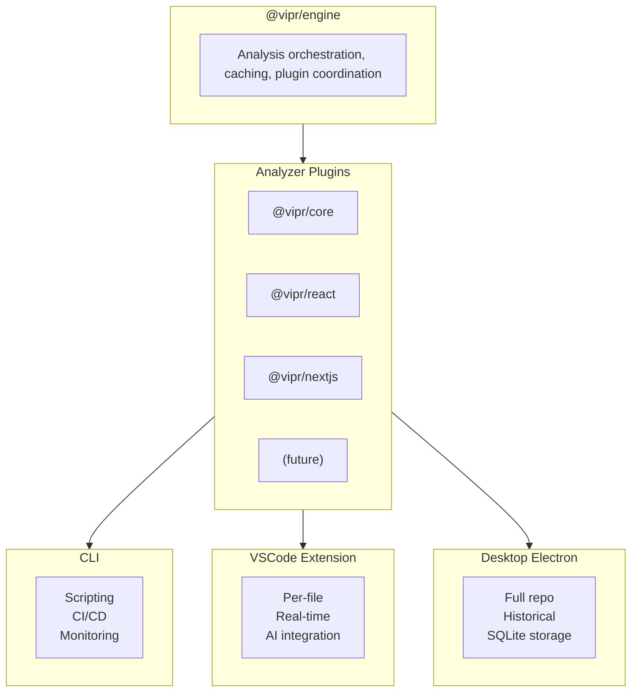

# Desktop Electron Application - User Stories and Technical Specification

This document defines the features, user stories, and technical context for the Vipr Desktop Electron application. It is structured for efficient LLM consumption with explicit references to monorepo resources.

## Quick Reference

| Resource         | Path                                                       | Purpose                     |
| ---------------- | ---------------------------------------------------------- | --------------------------- |
| Desktop client   | `clients/desktop/`                                         | Electron application source |
| Style guide      | `packages/ui/`                                             | UI components and patterns  |
| Analysis engine  | `packages/engine/`                                         | Core analysis orchestration |
| Common types     | `packages/common/`                                         | Shared types and utilities  |
| Analyzers        | `analyzers/core/`, `analyzers/react/`, `analyzers/nextjs/` | Plugin analyzers            |
| VSCode extension | `clients/vscode-extension/`                                | Reference implementation    |

## Context for LLM Agents

Before implementing features, agents should:

1. Read `CLAUDE.md` at the monorepo root for architecture rules
2. Reference `clients/vscode-extension/` for patterns on using the analysis engine
3. Follow the plugin architecture - never import analyzers directly

Token-efficient workflow:

- Use style guide catalog and packages in `packages/ui/` (e.g. `packages/ui/data/component-catalog.json`) instead of reading arbitrary styleguide source
- Reference types from `@vipr/common` rather than redefining
- Check `packages/engine/src/analysis-engine.ts` for caching patterns

---

## Target Audiences

| Audience                        | Needs                                     | Key Features                               |
| ------------------------------- | ----------------------------------------- | ------------------------------------------ |
| Sole proprietor developers      | Quick insights, actionable guidance       | Dashboard, AI prompts, IDE integration     |
| Vibe-coding PMs/designers       | Visual reports, stakeholder communication | PDF exports, cost estimation               |
| Technical debt consultants      | Client presentations, metrics tracking    | Historical snapshots, regression detection |
| Seed/Series A startups          | Refactoring prioritization                | Churn analysis, complexity hotspots        |
| Engineers justifying migrations | Data-driven arguments                     | Velocity impact, cost projections          |

---

## Product Platform Overview

The Vipr platform consists of three tools sharing a common analysis engine:



### Existing Plugins

| Plugin  | Package        | Capabilities                                                   |
| ------- | -------------- | -------------------------------------------------------------- |
| Core    | `@vipr/core`   | Cyclomatic complexity, Halstead metrics, maintainability index |
| React   | `@vipr/react`  | Component analysis, hooks patterns, prop drilling detection    |
| Next.js | `@vipr/nextjs` | App/Pages Router analysis, RSC patterns, route optimization    |

### Future Plugins (beyond this scope)

- TypeScript: Type hygiene, performance, strictness analysis
- Node packages: Dependency graphs, vulnerability patterns
- Vue.js, Angular, Svelte: Framework-specific patterns
- Node.js: Backend patterns, async flow analysis

---

## User Stories

### US-01: Repository Opening and Analysis

**As a user**, I want to open a repository folder for full codebase analysis.

**Acceptance criteria:**

- File picker or drag-and-drop to select repository root
- Validate repository structure (detect `package.json`, `.git`, etc.)
- Display repository metadata (name, size, file count by type)
- Begin background indexing immediately upon selection

**Technical notes:**

- Use Electron's `dialog.showOpenDialog()` with `properties: ['openDirectory']`
- Leverage `@vipr/engine` `AnalysisEngine` class for orchestration
- Reference `clients/vscode-extension/src/core/analysis-manager.ts` for patterns

### US-02: SQLite Persistence

**As a user**, I want analysis results stored in SQLite so recomputation is avoided.

**Acceptance criteria:**

- Create SQLite database per repository (stored in app data directory)
- Store file analysis with SHA hash for cache invalidation
- Support incremental updates without full recomputation
- Expose database location in settings for backup/portability

**Technical notes:**

- Use `better-sqlite3` for SQLite database
- `database-engineer` subagent can assist with setup and configuration
- `clients/vscode-extension` uses SQLite for configuration reference
- Review `clients/vscode-extension` schema for opportunities for parity across systems. It may be possible in the future for these systems to share a database (or use something more powerful like PostgreSQL), so keep that in mind, as the user will have two SQLite databases on their machine if they use both the desktop and vscode-extension clients.
- Store: file path, SHA, analysis timestamp, plugin results (JSON), git metadata

**Schema suggestion:**

```sql
CREATE TABLE files (
  id INTEGER PRIMARY KEY,
  path TEXT UNIQUE NOT NULL,
  sha TEXT NOT NULL,
  analyzed_at INTEGER NOT NULL,
  git_sha TEXT,
  git_author TEXT,
  git_date INTEGER
);

CREATE TABLE analyses (
  id INTEGER PRIMARY KEY,
  file_id INTEGER REFERENCES files(id),
  plugin_id TEXT NOT NULL,
  result JSON NOT NULL,
  created_at INTEGER NOT NULL
);

CREATE TABLE snapshots (
  id INTEGER PRIMARY KEY,
  file_id INTEGER REFERENCES files(id),
  git_sha TEXT NOT NULL,
  analyses JSON NOT NULL,
  created_at INTEGER NOT NULL
);
```

### US-03: File System Watching

**As a user**, I want the application to detect file changes and re-analyze incrementally.

**Acceptance criteria:**

- Monitor repository for file changes while app is running
- Re-analyze only changed files (SHA comparison)
- Show subtle notification during re-indexing
- Queue changes to avoid overwhelming the analysis engine

**Technical notes:**

- Use `chokidar` for cross-platform file watching
- Debounce rapid changes (300-500ms)
- Reference `clients/vscode-extension/src/core/recent-files-tracker.ts` for patterns

### US-04: Historical Snapshots

**As a user**, I want each analysis stored as a snapshot with git context for regression tracking.

**Acceptance criteria:**

- Store snapshot on each analysis with git SHA, author, date
- Enable comparison between snapshots (diff view)
- Support BISECT-style regression detection
- Track all plugin metrics over time

**Technical notes:**

- Reference `clients/vscode-extension/src/services/git-history-service.ts`
- Reference `clients/vscode-extension/src/services/regression-detector.ts`
- Store snapshot as JSON blob with full analysis results per plugin

### US-05: Dashboard Overview

**As a user**, I want a 30,000-foot view dashboard showing application health.

**Acceptance criteria:**

- Summary cards: total files, average complexity, health score
- Trend charts: metrics over time (last 30 days, all time)
- Top issues list: worst files by each metric
- Drill-down capability to sections and files
- Filter by: file type, directory, plugin, severity

**Technical notes:**

- Confer with `data-visualization-analyst` and other data viz subagents on what UX is best to show and convey to users
- Use MCP tool `suggest_components` with `viewType: "dashboard"`
- Reference `packages/ui/src/pages/` for dashboard layout patterns
- Charts: Use Chart.js, D3.js, or Nivo (already in styleguide)

### US-06: Multi-Abstraction Analysis

**As a user**, I want to analyze individual abstractions (components, functions) within files.

**Acceptance criteria:**

- Parse files to identify abstractions (React components, functions, classes)
- Display per-abstraction metrics in file detail view
- Support search/filter by abstraction name
- Navigate directly to abstraction in IDE

**Technical notes:**

- Analyzers already return per-construct data in `PluginResult`
- Reference `analyzers/react/src/analyses/` for component extraction patterns
- Reference `packages/common/src/types/` for `FileType` and abstraction types

### US-07: PDF Report Generation

**As a user**, I want to generate stakeholder-ready PDF reports.

**Acceptance criteria:**

- Use application's UI components for report rendering
- Include charts, metrics, recommendations
- Tailor language for non-technical stakeholders
- Include cost/velocity impact estimates
- Support custom branding (logo, colors)

**Technical notes:**

- Reference `clients/vscode-extension/src/services/pdf-export-service.ts`
- Consider `puppeteer` or `electron-pdf` for HTML-to-PDF, but provide a comparison analysis
- Render reports using same React components as app UI

### US-08: Cost and Velocity Estimation

**As a user**, I want to see estimated costs and velocity impacts of technical debt.

**Acceptance criteria:**

- Calculate estimated hours to address issues
- Project velocity improvement percentages
- Show ROI for debt reduction initiatives
- Configurable hourly rates and team size

**Technical notes:**

- Lean upon the `code-complexity-analyzer` subagent for establishing algorithms that are meaningful for this
- Create estimation models based on complexity metrics
- Reference industry data for complexity-to-effort correlations
- Store configuration in user preferences (SQLite or JSON)

### US-09: AI Prompt Integration

**As a user**, I want intelligent AI prompts to copy into my AI tools.

**Acceptance criteria:**

- Generate context-aware prompts for each file/issue
- Include relevant code snippets and metrics
- Copy-to-clipboard with one click
- Support multiple prompt formats (Claude, GPT, Copilot)

**Technical notes:**

- Reference `analyzers/*/docs/` for existing prompt templates
- Reference `PROMPTS.md` at monorepo root for prompt patterns
- Reference `clients/vscode-extension/src/ai/` for AI integration patterns

### US-10: MCP Server Integration

**As a user**, I want to enable a built-in MCP server for IDE integration.

**Acceptance criteria:**

- Optional MCP server running alongside desktop app
- Expose analysis data to Claude Code, Cursor, etc.
- Support queries about technical debt, file issues, recommendations
- Leverage existing SQLite database for responses

**Technical notes:**

- Use `@modelcontextprotocol/sdk` for MCP protocol
- Reference `servers/analyzer/` for MCP server implementation patterns
- Expose tools: `get_file_analysis`, `search_issues`, `get_recommendations`

### US-11: Graceful Re-indexing

**As a user**, I want smooth re-indexing when reopening a stale repository.

**Acceptance criteria:**

- Detect staleness via git SHA comparison
- Show toast notification with progress bar
- Background indexing without blocking UI
- Prioritize currently viewed files

**Technical notes:**

- Compare stored git HEAD SHA with current
- Use Web Workers or Electron's `utilityProcess` for background work
- Reference `clients/vscode-extension/src/workers/` for worker patterns

### US-12: Adaptive Visualizations

**As a user**, I want visualizations that scale to large codebases.

**Acceptance criteria:**

- Heat maps for large file sets (100+ files)
- Treemaps for directory structure
- Zoomable/pannable for large datasets
- Performance optimization (virtualization, canvas rendering)

**Technical notes:**

- Use design tokens and component catalog in `packages/ui/data/` for chart guidance
- Consider D3.js for custom visualizations
- Reference `packages/ui/src/charts/` for existing chart components

### US-13: IDE Integration

**As a user**, I want to open files directly in my IDE.

**Acceptance criteria:**

- Support VSCode, Cursor, other common IDEs
- Open to specific line number when available
- Configurable IDE preference in settings
- Handle IDE not installed gracefully

**Technical notes:**

- Use `shell.openExternal()` with `vscode://file/` URI scheme
- Support: `vscode://`, `cursor://`, `idea://`, `atom://`
- Store preference in user settings

### US-14: Annotations and Notes

**As a user**, I want to add notes to files and issues.

**Acceptance criteria:**

- Add/edit/delete notes on any file or issue
- Notes stored locally in SQLite
- Display notes inline in reports and views
- Future: Cloud sync for team collaboration

**Technical notes:**

```sql
CREATE TABLE notes (
  id INTEGER PRIMARY KEY,
  target_type TEXT NOT NULL, -- 'file' | 'issue' | 'abstraction'
  target_id TEXT NOT NULL,
  content TEXT NOT NULL,
  created_at INTEGER NOT NULL,
  updated_at INTEGER NOT NULL
);
```

### US-15: Issue Exclusions

**As a user**, I want to exclude issues from reports.

**Acceptance criteria:**

- Mark any issue as excluded
- Access excluded issues in Settings
- Toggle visibility: hidden vs grayed-out
- Persist exclusions in SQLite

**Technical notes:**

```sql
CREATE TABLE exclusions (
  id INTEGER PRIMARY KEY,
  issue_type TEXT NOT NULL,
  file_path TEXT,
  reason TEXT,
  created_at INTEGER NOT NULL
);
```

### US-16: Advanced Filtering and Search

**As a user**, I want powerful filtering, faceting, search, and pagination.

**Acceptance criteria:**

- Full-text search across file names, content, issues
- Facet by: plugin, severity, file type, directory
- Multi-select filters with AND/OR logic
- Paginated tables with configurable page size
- Sortable columns with multi-column sort

**Technical notes:**

- Use SQLite FTS5 for full-text search where full-text search is needed
- Reference `packages/ui/` for table and filter components
- Use `packages/ui/data/component-catalog.json` and packages in `packages/ui/` for component discovery

---

## UI Implementation Guidelines

### Critical Rule

Use the existing style guide religiously. Do not create custom variants or deviate from established patterns.

### Style Guide Resources

| Resource          | Path                                      | Content                      |
| ----------------- | ----------------------------------------- | ---------------------------- |
| Component catalog | `packages/ui/data/component-catalog.json` | All components with metadata |
| Design tokens     | `packages/ui/data/design-tokens.json`     | Colors, spacing, typography  |
| JSX examples      | `packages/ui/src/`                        | Reference implementations    |
| Patterns          | `packages/ui/data/` and styleguide        | Common UI patterns           |

### Implementation Approach

1. **Use the catalog first**: Before implementing UI, use `packages/ui/data/component-catalog.json` and design tokens for component and token discovery
2. **Use TypeScript**: Convert JSX examples to typed TSX with proper interfaces
3. **Maintain visual fidelity**: Appearance must match styleguide exactly
4. **Apply best practices**: Composition over inheritance, proper state management

---

## Subagent Reference

### Documentation and Planning

| Agent                | Use Case                                          |
| -------------------- | ------------------------------------------------- |
| `technical-writer`   | Writing documentation in `documentation/docs/`    |
| `diagram-specialist` | Generating mermaid diagrams for architecture docs |

### Design and UX

| Agent                  | Use Case                                       |
| ---------------------- | ---------------------------------------------- |
| `tailwind-ux-engineer` | Tailwind UI implementation with react-engineer |
| `ux-design-specialist` | User experience consulting and best practices  |
| `storybook-architect`  | Building Storybook views and configuration     |

### Coding

| Agent                 | Use Case                       |
| --------------------- | ------------------------------ |
| `react-engineer`      | React component implementation |
| `tao-of-react`        | React idioms and patterns      |
| `typescript-engineer` | TypeScript best practices      |

### Data, Visualization, and Algorithms

| Agent                        | Use Case                           |
| ---------------------------- | ---------------------------------- |
| `data-visualization-analyst` | Choosing right visualizations      |
| `custom-chart-builder`       | Creating custom D3/Chart.js charts |
| `code-complexity-analyzer`   | Implementing complexity algorithms |
| `database-engineer`          | SQLite schema and queries          |

### Review, Architecture, and Refactoring

| Agent                        | Use Case                        |
| ---------------------------- | ------------------------------- |
| `turborepo-architect`        | Monorepo configuration          |
| `implementation-analyst`     | Identifying implementation gaps |
| `refactoring-engineer`       | Code refactoring                |
| `architecture-reviewer`      | Architecture recommendations    |
| `typescript-refactor-expert` | TypeScript refactoring          |
| `frontend-security-auditor`  | Security review                 |

### Testing

| Agent                 | Use Case                   |
| --------------------- | -------------------------- |
| `vitest-engineer`     | Unit and integration tests |
| `playwright-engineer` | E2E tests                  |

### Infrastructure

| Agent                   | Use Case                         |
| ----------------------- | -------------------------------- |
| `filesystem-specialist` | File system operations           |
| `node-package-engineer` | Package management, dependencies |

### Project-Specific

| Agent                       | Use Case                         |
| --------------------------- | -------------------------------- |
| `mcp-server-architect`      | Building MCP servers             |
| `electron-desktop-engineer` | Electron application development |

---

## Development Commands

```bash
# Desktop application
pnpm desktop:dev          # Start dev server
pnpm desktop:build        # Package application
pnpm desktop:make         # Create distributable
pnpm desktop:typecheck    # Type check
pnpm desktop:lint         # Lint

# Style guide (reference)
pnpm styleguide:dev       # Start style guide dev server

# Full monorepo
pnpm build                # Build all packages
pnpm test                 # Run all tests
pnpm typecheck            # Type check all packages
```

---

## File Structure Reference

```
clients/desktop/
├── src/
│   ├── main/                 # Electron main process
│   │   ├── index.ts          # Entry point
│   │   ├── ipc/              # IPC handlers
│   │   ├── db/               # SQLite integration
│   │   └── analysis/         # Analysis engine integration
│   ├── renderer/             # React renderer process
│   │   ├── App.tsx           # Root component
│   │   ├── pages/            # Route pages
│   │   ├── components/       # Shared components
│   │   ├── hooks/            # Custom hooks
│   │   └── stores/           # State management
│   └── preload/              # Preload scripts
├── forge.config.ts           # Electron Forge config
├── vite.main.config.ts       # Vite config for main
├── vite.renderer.config.ts   # Vite config for renderer
└── package.json
```

---

## Dependencies to Use

From existing monorepo packages:

```json
{
  "dependencies": {
    "@vipr/common": "workspace:*",
    "@vipr/core": "workspace:*",
    "@vipr/react": "workspace:*",
    "@vipr/nextjs": "workspace:*",
    "@vipr/engine": "workspace:*",
    "@vipr/logging": "workspace:*"
  }
}
```

Additional dependencies to add:

```json
{
  "dependencies": {
    "better-sqlite3": "^11.0.0",
    "chokidar": "^3.6.0",
    "@modelcontextprotocol/sdk": "^1.0.0"
  },
  "devDependencies": {
    "@types/better-sqlite3": "^7.6.0"
  }
}
```

---

## Cross-References

| Topic               | Document                                 |
| ------------------- | ---------------------------------------- |
| Plugin architecture | `CLAUDE.md` (monorepo root)              |
| Analysis engine     | `packages/engine/src/analysis-engine.ts` |
| Common types        | `packages/common/src/types/`             |
| VSCode patterns     | `clients/vscode-extension/src/`          |
| Prompts reference   | `PROMPTS.md` (monorepo root)             |
