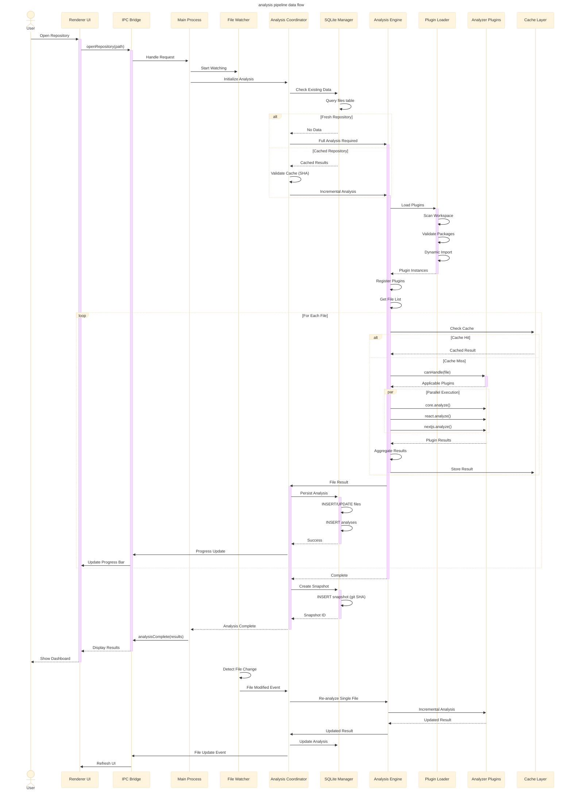
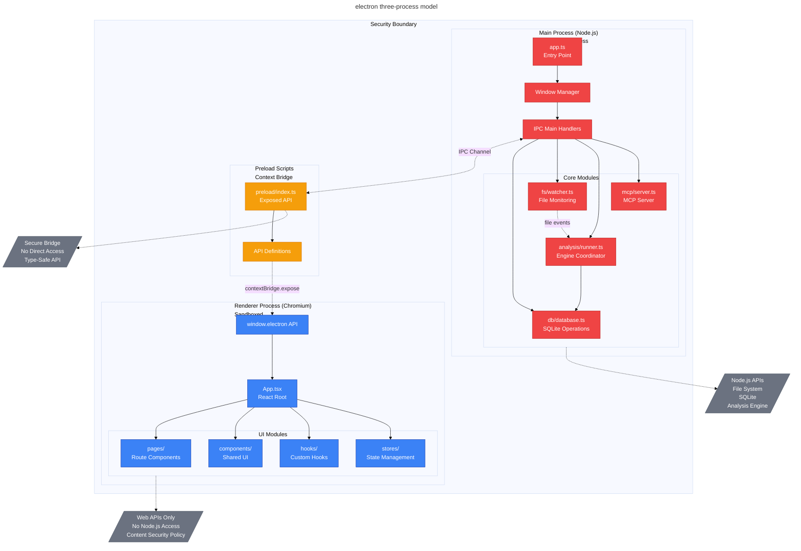
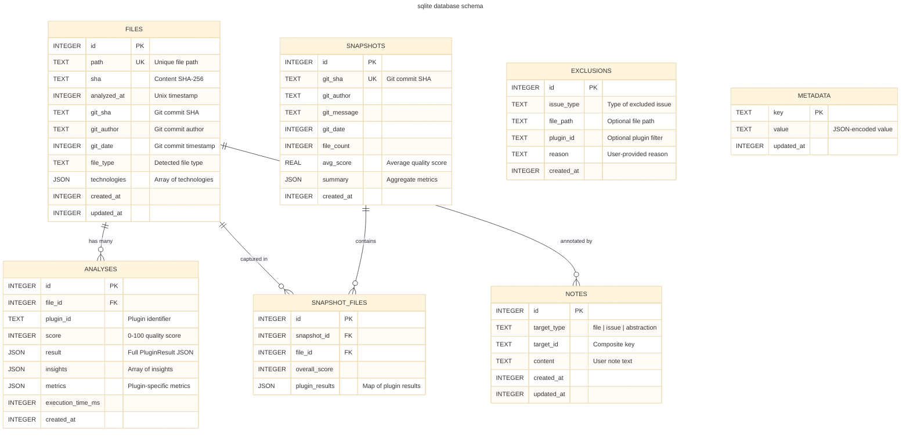
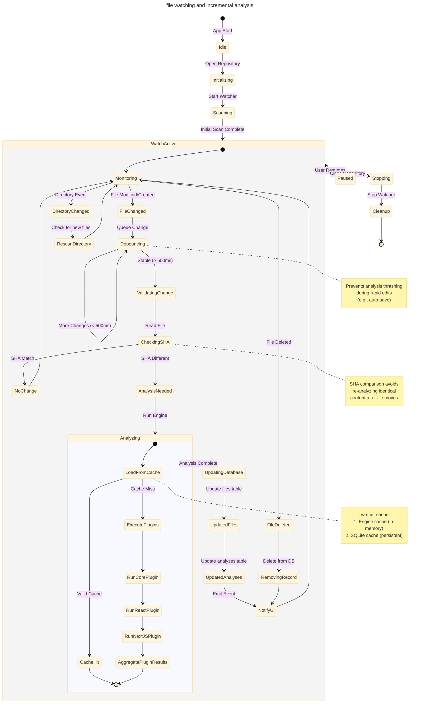
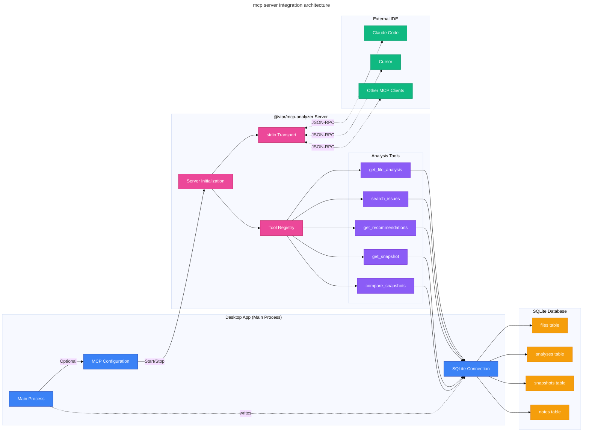
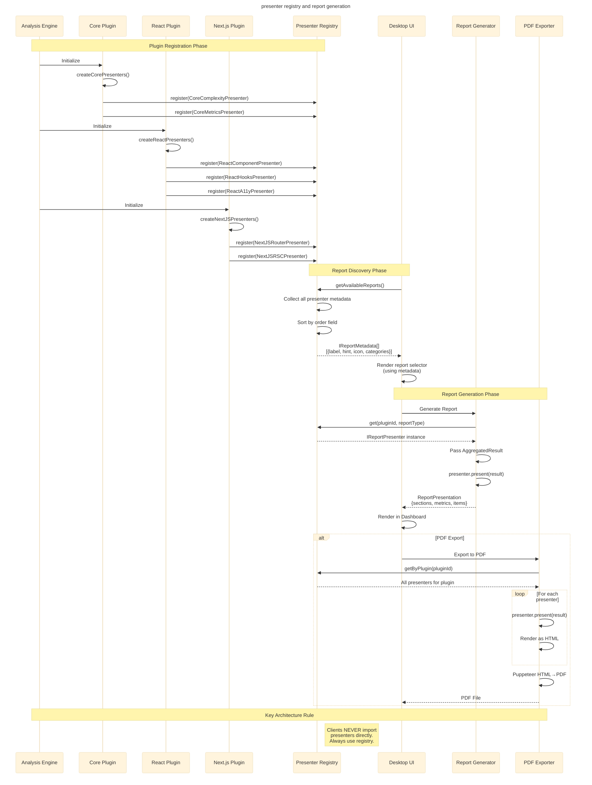
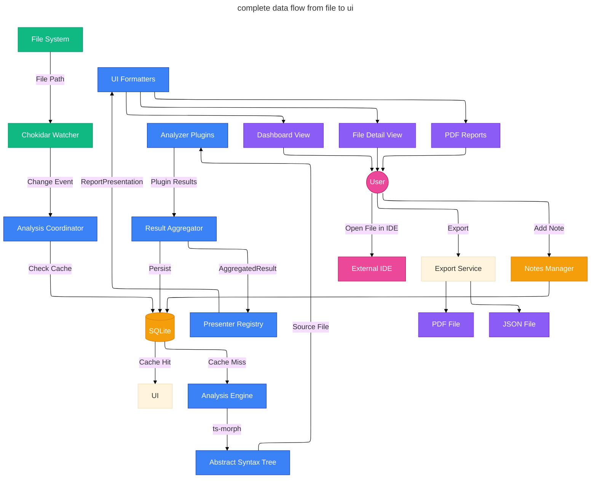

# system diagrams

comprehensive mermaid diagrams for electron desktop application architecture

---

## overview architecture

```mermaid
---
title: vipr desktop application - component architecture
config:
  theme: base
  layout: elk
---
graph TB
    accTitle: Vipr Desktop Application Component Architecture
    accDescr: Shows the complete architecture of the Vipr Electron desktop app including main process, renderer process, analysis engine, plugins, and data persistence

    subgraph electron["Electron Desktop App"]
        subgraph main["Main Process (Node.js)"]
            mainEntry[Main Entry Point]
            ipcHandlers[IPC Handlers]
            dbManager[SQLite Manager]
            fsWatcher[File Watcher<br/>chokidar]
            analysisCoord[Analysis Coordinator]
        end

        subgraph preload["Preload Scripts"]
            contextBridge[Context Bridge API]
        end

        subgraph renderer["Renderer Process (React)"]
            reactApp[React Application]
            dashboard[Dashboard Views]
            fileDetail[File Detail Views]
            settings[Settings UI]
            reports[Report Generator]
        end
    end

    subgraph engine["@vipr/engine"]
        analysisEngine[Analysis Engine]
        engineCache[Engine Cache]
        pluginOrch[Plugin Orchestrator]
    end

    subgraph plugins["Analyzer Plugins"]
        corePlugin["@vipr/core<br/>Cyclomatic/Halstead/MI"]
        reactPlugin["@vipr/react<br/>Component/Hooks/A11y"]
        nextjsPlugin["@vipr/nextjs<br/>App Router/RSC"]
    end

    subgraph common["@vipr/common"]
        types[Shared Types]
        presenterReg[Presenter Registry]
        utils[Utilities]
    end

    subgraph loader["@vipr/plugin-loader"]
        workspaceScanner[Workspace Scanner]
        dynamicLoader[Dynamic Loader]
        pluginRegistry[Plugin Registry]
    end

    subgraph persistence["Data Layer"]
        sqlite[(SQLite DB<br/>better-sqlite3)]
        fileSchema[files table]
        analysisSchema[analyses table]
        snapshotSchema[snapshots table]
        notesSchema[notes table]
    end

    subgraph mcp["MCP Server (Optional)"]
        mcpServer[@vipr/mcp-analyzer]
        mcpTools[Analysis Tools]
    end

    %% Main connections
    mainEntry --> ipcHandlers
    mainEntry --> dbManager
    mainEntry --> fsWatcher
    mainEntry --> analysisCoord

    ipcHandlers <-.IPC.-> contextBridge
    contextBridge <-.Secure API.-> reactApp

    reactApp --> dashboard
    reactApp --> fileDetail
    reactApp --> settings
    reactApp --> reports

    analysisCoord --> analysisEngine
    analysisCoord --> dbManager

    analysisEngine --> pluginOrch
    analysisEngine --> engineCache

    pluginOrch --> corePlugin
    pluginOrch --> reactPlugin
    pluginOrch --> nextjsPlugin

    corePlugin -.uses.-> common
    reactPlugin -.uses.-> common
    nextjsPlugin -.uses.-> common

    analysisEngine -.loads via.-> loader

    dbManager --> sqlite
    sqlite --> fileSchema
    sqlite --> analysisSchema
    sqlite --> snapshotSchema
    sqlite --> notesSchema

    fsWatcher -.file changes.-> analysisCoord

    mainEntry -.optional.-> mcpServer
    mcpServer --> mcpTools
    mcpTools --> sqlite

    classDef processNode fill:#3b82f6,stroke:#1e40af,color:#fff
    classDef engineNode fill:#8b5cf6,stroke:#6d28d9,color:#fff
    classDef pluginNode fill:#10b981,stroke:#059669,color:#fff
    classDef dataNode fill:#f59e0b,stroke:#d97706,color:#fff
    classDef mcpNode fill:#ec4899,stroke:#be185d,color:#fff

    class mainEntry,ipcHandlers,dbManager,fsWatcher,analysisCoord,contextBridge,reactApp processNode
    class analysisEngine,engineCache,pluginOrch engineNode
    class corePlugin,reactPlugin,nextjsPlugin pluginNode
    class sqlite,fileSchema,analysisSchema,snapshotSchema,notesSchema dataNode
    class mcpServer,mcpTools mcpNode
```

---

## analysis pipeline flow



---

## electron process architecture



---

## sqlite persistence schema



---

## plugin loading and coordination

```mermaid
---
title: plugin loading and coordination flow
config:
  theme: base
---
flowchart TD
    accTitle: Plugin Loading and Coordination Flow
    accDescr: Shows how plugins are discovered, loaded, validated, and coordinated during analysis

    Start([Application Start]) --> InitEngine[Initialize Analysis Engine]
    InitEngine --> CreateLoader[Create Plugin Loader]

    CreateLoader --> ScanWS[Workspace Scanner:<br/>Find analyzer packages]
    ScanWS --> FoundPkgs{Packages Found?}

    FoundPkgs -->|No| Error1[Error: No Analyzers]
    FoundPkgs -->|Yes| ValidatePkgs[Plugin Validator:<br/>Check package.json]

    ValidatePkgs --> ValidPkgs{Valid?}
    ValidPkgs -->|No| Error2[Error: Invalid Package]
    ValidPkgs -->|Yes| DynamicLoad[Dynamic Loader:<br/>Import ES modules]

    DynamicLoad --> Instantiate[Plugin Instantiator:<br/>Create instances]
    Instantiate --> Register[Register with Engine]

    Register --> RegPresenters[Register Presenters<br/>with Presenter Registry]

    %% File analysis flow
    RegPresenters --> AnalyzeFile[Analyze File Request]
    AnalyzeFile --> GetSource[Get SourceFile from ts-morph]

    GetSource --> FindPlugins[Find Applicable Plugins]
    FindPlugins --> CheckCore{Core Plugin<br/>canHandle?}

    CheckCore -->|Yes| CoreRun[Core: Always runs<br/>for .ts/.tsx/.js/.jsx]
    CheckCore -->|No| SkipCore[Skip Core]

    CoreRun --> CheckReact{React Plugin<br/>canHandle?}
    SkipCore --> CheckReact

    CheckReact -->|Has React imports| CheckNextJS{Next.js Indicators?}
    CheckReact -->|No React| SkipReact[Skip React]

    CheckNextJS -->|Yes: app/, pages/,<br/>Next.js imports| NextJSRun[Next.js: Runs<br/>React defers]
    CheckNextJS -->|No: Pure React| ReactRun[React: Runs]

    NextJSRun --> ParallelExec[Parallel Execution]
    ReactRun --> ParallelExec
    SkipReact --> ParallelExec

    ParallelExec --> RunCore[Core.getAnalyses]
    ParallelExec --> RunReact[React.getAnalyses]
    ParallelExec --> RunNextJS[NextJS.getAnalyses]

    RunCore --> CoreAnalyses[Cyclomatic<br/>Halstead<br/>Maintainability]
    RunReact --> ReactAnalyses[Structural<br/>Hooks<br/>Performance<br/>A11y<br/>Security]
    RunNextJS --> NextJSAnalyses[App Router<br/>Server Components<br/>Data Fetching]

    CoreAnalyses --> Aggregate[Aggregate Results]
    ReactAnalyses --> Aggregate
    NextJSAnalyses --> Aggregate

    Aggregate --> CalcScore[Calculate Composite Score]
    CalcScore --> MergeInsights[Merge Insights]
    MergeInsights --> DetectFileType[Detect File Type<br/>from Plugin Results]

    DetectFileType --> Result([Aggregated Result])

    classDef startEnd fill:#10b981,stroke:#059669,color:#fff
    classDef process fill:#3b82f6,stroke:#1e40af,color:#fff
    classDef decision fill:#f59e0b,stroke:#d97706,color:#fff
    classDef error fill:#ef4444,stroke:#b91c1c,color:#fff
    classDef plugin fill:#8b5cf6,stroke:#6d28d9,color:#fff

    class Start,Result startEnd
    class InitEngine,CreateLoader,ScanWS,ValidatePkgs,DynamicLoad,Instantiate,Register,RegPresenters,AnalyzeFile,GetSource,FindPlugins,ParallelExec,Aggregate,CalcScore,MergeInsights,DetectFileType process
    class FoundPkgs,ValidPkgs,CheckCore,CheckReact,CheckNextJS decision
    class Error1,Error2 error
    class CoreRun,ReactRun,NextJSRun,RunCore,RunReact,RunNextJS,CoreAnalyses,ReactAnalyses,NextJSAnalyses plugin
```



---

## file watching and incremental analysis



---

## mcp server integration



---

## presenter and report generation



---

## data flow summary



---

## key architecture principles

### plugin isolation

- **No direct imports**: Desktop app NEVER imports analyzer code directly
- **Dynamic loading**: Plugins loaded at runtime via `@vipr/plugin-loader`
- **Registry pattern**: All access mediated through `PresenterRegistry`

### data persistence strategy

- **Content-addressed caching**: SHA-256 hashing for cache invalidation
- **Snapshot history**: Git-aware versioning for regression tracking
- **Incremental updates**: Only re-analyze modified files

### security boundaries

- **Main process**: Full Node.js access, runs analysis engine, manages SQLite
- **Preload scripts**: Context bridge, type-safe API exposure
- **Renderer process**: Sandboxed Chromium, React UI, no direct file access

### performance optimization

- **Two-tier caching**: In-memory engine cache + persistent SQLite cache
- **Parallel execution**: Plugins run concurrently, analyses run concurrently
- **Debounced file watching**: Prevents analysis thrashing during rapid edits

### extensibility

- **Plugin architecture**: New analyzers extend via `ITechnologyPlugin`
- **Presenter pattern**: Custom reports via `IReportPresenter`
- **MCP integration**: Optional server for IDE integration

---

## technology stack

| Layer                 | Technology                | Purpose                      |
| --------------------- | ------------------------- | ---------------------------- |
| **Desktop Framework** | Electron + Electron Forge | Cross-platform desktop app   |
| **UI Framework**      | React + TypeScript        | Renderer process UI          |
| **Build System**      | Vite                      | Fast dev server and bundling |
| **Analysis Engine**   | ts-morph + custom plugins | AST parsing and analysis     |
| **Plugin System**     | Dynamic ES module loading | Runtime plugin discovery     |
| **Persistence**       | better-sqlite3            | Embedded database            |
| **File Watching**     | chokidar                  | Cross-platform FS events     |
| **MCP Protocol**      | @modelcontextprotocol/sdk | IDE integration              |
| **State Management**  | React Context + Hooks     | UI state coordination        |
| **PDF Generation**    | Puppeteer / electron-pdf  | Report exports               |

---

## critical file paths

```
clients/desktop/
├── src/
│   ├── main/                    # Main process (Node.js)
│   │   ├── index.ts             # Electron app entry point
│   │   ├── ipc/
│   │   │   ├── handlers.ts      # IPC request handlers
│   │   │   └── channels.ts      # Channel definitions
│   │   ├── db/
│   │   │   ├── database.ts      # SQLite connection manager
│   │   │   ├── schema.ts        # Table schemas and migrations
│   │   │   └── queries.ts       # Prepared statements
│   │   ├── analysis/
│   │   │   ├── coordinator.ts   # Analysis orchestration
│   │   │   └── engine-wrapper.ts # Engine lifecycle management
│   │   ├── fs/
│   │   │   └── watcher.ts       # File watching with chokidar
│   │   └── mcp/
│   │       └── server.ts        # Optional MCP server
│   │
│   ├── preload/
│   │   └── index.ts             # Context bridge API
│   │
│   └── renderer/                # Renderer process (React)
│       ├── App.tsx              # React root component
│       ├── pages/               # Route pages
│       │   ├── Dashboard.tsx
│       │   ├── FileDetail.tsx
│       │   └── Settings.tsx
│       ├── components/          # Shared components
│       ├── hooks/               # Custom React hooks
│       ├── stores/              # State management
│       └── services/            # API clients
│
├── forge.config.ts              # Electron Forge configuration
├── vite.main.config.ts          # Vite config for main process
└── vite.renderer.config.ts      # Vite config for renderer
```

---

## implementation checklist

### phase 1: foundation

- [ ] Set up Electron Forge with TypeScript + Vite
- [ ] Configure three-process architecture (main/preload/renderer)
- [ ] Implement secure IPC communication layer
- [ ] Initialize SQLite with schema migrations
- [ ] Integrate `@vipr/engine` in main process

### phase 2: core analysis

- [ ] Implement plugin loader integration
- [ ] Build analysis coordinator with caching
- [ ] Set up file watcher with debouncing
- [ ] Create database persistence layer
- [ ] Implement snapshot management

### phase 3: ui development

- [ ] Build React application shell
- [ ] Create dashboard with summary cards
- [ ] Implement file detail views
- [ ] Add settings interface
- [ ] Integrate presenter registry for reports

### phase 4: advanced features

- [ ] PDF export service
- [ ] Historical snapshots and regression detection
- [ ] Notes and annotations system
- [ ] Issue exclusions management
- [ ] MCP server integration

### phase 5: polish

- [ ] Error handling and recovery
- [ ] Progress indicators and notifications
- [ ] IDE integration (open files)
- [ ] User preferences persistence
- [ ] Performance optimization
