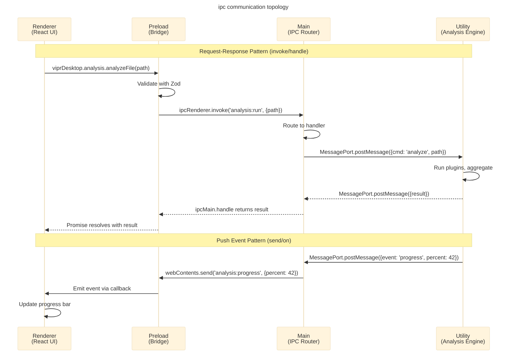
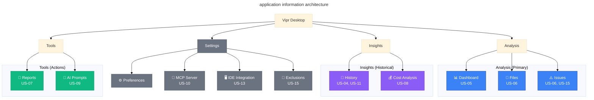
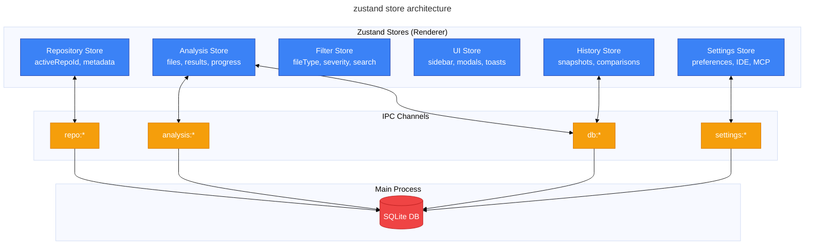
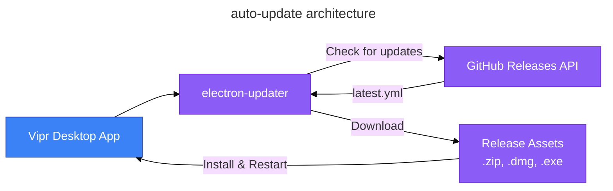
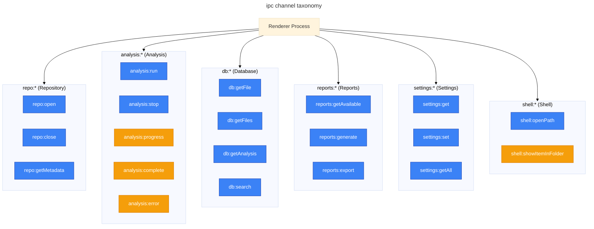
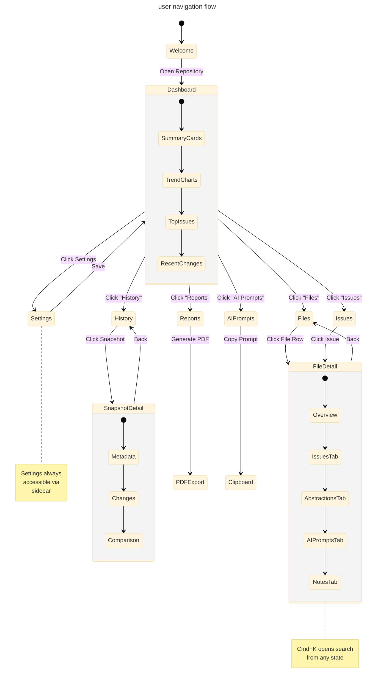

# vipr desktop - architecture proposal

comprehensive architectural design for the vipr electron desktop application.

---

## 1. executive summary

### what is vipr desktop?

Vipr Desktop is a cross-platform Electron application that provides comprehensive static analysis of entire codebases with historical tracking, visualization, and stakeholder reporting capabilities. It serves as the premium tier of the Vipr analysis platform, complementing the CLI (scripting/CI/CD) and VSCode extension (per-file, real-time).

### who does it serve?

| Audience                        | Primary Need                              | Desktop Advantage                          |
| ------------------------------- | ----------------------------------------- | ------------------------------------------ |
| Sole proprietor developers      | Quick insights, actionable guidance       | Full-repo dashboard with AI prompts        |
| Vibe-coding PMs/designers       | Visual reports, stakeholder communication | PDF exports, cost estimation               |
| Technical debt consultants      | Client presentations, metrics tracking    | Historical snapshots, regression detection |
| Seed/Series A startups          | Refactoring prioritization                | Churn analysis, complexity hotspots        |
| Engineers justifying migrations | Data-driven arguments                     | Velocity impact, cost projections          |

### architectural vision

Vipr Desktop follows a **four-process architecture** that maximizes security, performance, and maintainability:

1. **Main Process**: Coordination, SQLite persistence, IPC routing
2. **Renderer Process**: React UI with Tailwind v4 styling
3. **Preload Script**: Type-safe IPC bridge (contextBridge)
4. **Utility Process**: Analysis engine with ts-morph, plugin execution, presenter registry

This architecture enforces strict boundaries: the renderer never accesses Node.js APIs, the main process never executes CPU-intensive analysis, and all plugin interaction happens through the registry pattern mandated by CLAUDE.md.

### key technology choices

| Layer             | Technology                   | Rationale                                       |
| ----------------- | ---------------------------- | ----------------------------------------------- |
| Desktop Framework | Electron 40 + Electron Forge | Latest LTS, hardened security fuses             |
| UI Framework      | React 19 + TypeScript 5.3+   | Modern concurrent features, type safety         |
| Styling           | Tailwind CSS v4              | Design system consistency with styleguide       |
| State Management  | Zustand (6 stores)           | Lightweight, excellent TS support, IPC-friendly |
| Database          | better-sqlite3 (WAL mode)    | Native performance, concurrent access           |
| Visualization     | Chart.js + custom canvas     | Token-efficient, performant for large datasets  |
| File Watching     | chokidar                     | Cross-platform, battle-tested                   |
| Build System      | Vite 5                       | Fast HMR, optimized production builds           |

---

## 2. process architecture

### four-process model

```mermaid
---
title: vipr desktop four-process architecture
config:
  theme: base
---
graph TB
    accTitle: Four-Process Architecture
    accDescr: Shows Main, Renderer, Preload, and Utility processes with communication topology

    subgraph security["Security Boundary"]
        subgraph renderer["Renderer Process (Chromium Sandbox)"]
            reactApp[React 19 Application]
            zustand[Zustand Stores]
            ui[UI Components<br/>Tailwind v4]
        end

        subgraph preload["Preload Script (Context Bridge)"]
            bridge[Type-Safe IPC Bridge<br/>window.viprDesktop]
            validation[Zod Validation]
        end

        subgraph main["Main Process (Node.js)"]
            ipcRouter[IPC Router]
            sqlite[(SQLite DB<br/>better-sqlite3)]
            fsWatcher[File Watcher<br/>chokidar]
            utilityMgr[Utility Process Manager]
        end

        subgraph utility["Utility Process (Isolated)"]
            engine[@vipr/engine]
            tsmorph[ts-morph AST]
            plugins[Plugin Loader]
            registry[Presenter Registry]
        end
    end

    reactApp <--> zustand
    zustand <-.IPC invoke/on.-> bridge
    bridge <-.contextBridge.-> ipcRouter

    ipcRouter <--> sqlite
    ipcRouter <--> fsWatcher
    ipcRouter <-.MessagePort.-> utilityMgr

    utilityMgr <-.MessagePort.-> engine
    engine --> tsmorph
    engine --> plugins
    plugins --> registry

    fsWatcher -.file events.-> ipcRouter

    classDef rendererClass fill:#3b82f6,stroke:#1e40af,color:#fff
    classDef preloadClass fill:#f59e0b,stroke:#d97706,color:#fff
    classDef mainClass fill:#ef4444,stroke:#b91c1c,color:#fff
    classDef utilityClass fill:#8b5cf6,stroke:#6d28d9,color:#fff

    class reactApp,zustand,ui rendererClass
    class bridge,validation preloadClass
    class ipcRouter,sqlite,fsWatcher,utilityMgr mainClass
    class engine,tsmorph,plugins,registry utilityClass
```

### why utilityProcess over worker_threads?

| Aspect             | utilityProcess                 | worker_threads                          |
| ------------------ | ------------------------------ | --------------------------------------- |
| Process isolation  | Full OS-level isolation        | Shares memory space with main           |
| Memory management  | Reclaimed on exit              | Potential leaks in long-running threads |
| Crash safety       | Crash isolated, main continues | Can destabilize main process            |
| Heavy dependencies | ts-morph isolated from main    | Bloats main process memory              |
| IPC mechanism      | MessagePort (standard)         | Custom message passing                  |

The utility process pattern ensures that if analysis crashes (e.g., malformed AST, OOM on huge file), the main process and UI remain stable. Memory is fully reclaimed when the utility process exits.

### communication topology



**Key principles:**

- **invoke/handle**: Request-response with backpressure (waits for response, prevents queue overflow)
- **send/on**: One-way push events (progress updates, file change notifications)
- **MessagePort**: For main ↔ utility communication (standard, cross-platform)
- **Zod validation**: Every IPC boundary validates payloads (prevents malformed data)

### presenter registry in utility process

Per CLAUDE.md: **clients never import presenters directly**. The PresenterRegistry lives in the utility process because:

1. **Plugin initialization happens in utility process** - plugins register presenters during initialization
2. **No renderer dependencies** - presenters use pure data transformation, no React/UI code
3. **Type-safe IPC queries** - renderer queries registry via `analysis:getReports` IPC channel
4. **Dynamic discovery** - adding new plugins requires zero renderer code changes

**Flow:**

```
Utility Process Startup
  → Load plugins via @vipr/plugin-loader
  → Each plugin calls registry.register(presenter)
  → Registry builds metadata index

Renderer Queries
  → ipcRenderer.invoke('reports:getAvailable')
  → Main → Utility: registry.getAvailableReports()
  → Returns IReportMetadata[] to renderer
  → Renderer renders report selector dynamically
```

---

## 3. ipc contract

### namespaced channels

All IPC channels follow `domain:action` naming convention. This prevents collisions and enables middleware-based routing.

#### complete channel taxonomy

| Domain       | Channel                  | Direction | Payload In                         | Payload Out                  | Pattern |
| ------------ | ------------------------ | --------- | ---------------------------------- | ---------------------------- | ------- |
| **repo**     | `repo:open`              | R→M       | `{path: string}`                   | `{repoId: string, metadata}` | invoke  |
|              | `repo:close`             | R→M       | `{repoId: string}`                 | `{success: boolean}`         | invoke  |
|              | `repo:getMetadata`       | R→M       | `{repoId: string}`                 | `RepoMetadata`               | invoke  |
| **analysis** | `analysis:run`           | R→M→U     | `{repoId, paths?: string[]}`       | `{jobId: string}`            | invoke  |
|              | `analysis:stop`          | R→M→U     | `{jobId: string}`                  | `{success: boolean}`         | invoke  |
|              | `analysis:progress`      | U→M→R     | `{jobId, percent, file}`           | -                            | send    |
|              | `analysis:complete`      | U→M→R     | `{jobId, results}`                 | -                            | send    |
|              | `analysis:error`         | U→M→R     | `{jobId, error}`                   | -                            | send    |
| **db**       | `db:getFile`             | R→M       | `{repoId, filePath}`               | `FileRecord \| null`         | invoke  |
|              | `db:getFiles`            | R→M       | `{repoId, filters}`                | `FileRecord[]`               | invoke  |
|              | `db:getAnalysis`         | R→M       | `{fileId, pluginId?}`              | `AnalysisRecord[]`           | invoke  |
|              | `db:search`              | R→M       | `{repoId, query, facets}`          | `SearchResults`              | invoke  |
| **reports**  | `reports:getAvailable`   | R→M→U     | `{repoId?}`                        | `IReportMetadata[]`          | invoke  |
|              | `reports:generate`       | R→M→U     | `{reportType, pluginId, filters}`  | `ReportPresentation`         | invoke  |
|              | `reports:export`         | R→M       | `{reportData, format}`             | `{filePath: string}`         | invoke  |
| **window**   | `window:minimize`        | R→M       | -                                  | -                            | send    |
|              | `window:maximize`        | R→M       | -                                  | -                            | send    |
|              | `window:close`           | R→M       | -                                  | -                            | send    |
| **settings** | `settings:get`           | R→M       | `{key: string}`                    | `any`                        | invoke  |
|              | `settings:set`           | R→M       | `{key, value}`                     | `{success: boolean}`         | invoke  |
|              | `settings:getAll`        | R→M       | -                                  | `Settings`                   | invoke  |
| **shell**    | `shell:openPath`         | R→M       | `{path: string, line?}`            | `{success: boolean}`         | invoke  |
|              | `shell:showItemInFolder` | R→M       | `{path: string}`                   | -                            | send    |
| **dialog**   | `dialog:openDirectory`   | R→M       | `{title?, defaultPath?}`           | `{path: string \| null}`     | invoke  |
|              | `dialog:saveFile`        | R→M       | `{title?, defaultPath?, filters?}` | `{path: string \| null}`     | invoke  |

### shared IPC types

All IPC payloads are defined in `shared/ipc-types.ts` and validated with Zod at every boundary:

```typescript
// shared/ipc-types.ts
import { z } from 'zod';

export const AnalyzeFilePayloadSchema = z.object({
  repoId: z.string(),
  paths: z.array(z.string()).optional(),
});

export type AnalyzeFilePayload = z.infer<typeof AnalyzeFilePayloadSchema>;

// preload/index.ts
export const api = {
  analysis: {
    async analyzeFile(payload: AnalyzeFilePayload) {
      const validated = AnalyzeFilePayloadSchema.parse(payload);
      return ipcRenderer.invoke('analysis:run', validated);
    },
  },
};
```

**No raw ipcRenderer exposed to renderer.** All IPC access goes through the typed `window.viprDesktop` API.

---

## 4. data architecture

### analysis pipeline

```mermaid
---
title: data flow pipeline
config:
  theme: base
---
graph LR
    accTitle: Data Flow Pipeline
    accDescr: From file system through analysis to persistence and presentation

    FS[File System] --> Watcher[chokidar]
    Watcher -->|change event| SHA[SHA-256 Check]
    SHA -->|different| Engine[@vipr/engine]
    SHA -->|same| Skip[Skip Analysis]

    Engine --> Plugins[Core/React/Next.js]
    Plugins --> Aggregator[Result Aggregator]
    Aggregator --> SQLite[(SQLite DB)]
    Aggregator --> Registry[Presenter Registry]

    SQLite --> IPC[IPC Channel]
    Registry --> IPC

    IPC --> Renderer[React UI]

    classDef inputClass fill:#10b981,stroke:#059669,color:#fff
    classDef processClass fill:#3b82f6,stroke:#1e40af,color:#fff
    classDef dataClass fill:#f59e0b,stroke:#d97706,color:#fff
    classDef outputClass fill:#8b5cf6,stroke:#6d28d9,color:#fff

    class FS,Watcher inputClass
    class SHA,Engine,Plugins,Aggregator,Registry processClass
    class SQLite,IPC dataClass
    class Renderer outputClass
```

**Pipeline stages:**

1. **File System Event** - chokidar emits `change`, `add`, `unlink`
2. **SHA-256 Check** - compare content hash with `files.sha` column
3. **Cache Lookup** - check engine in-memory cache, then SQLite cache
4. **Plugin Execution** - run applicable plugins in utility process (parallel)
5. **Result Aggregation** - merge plugin results, calculate composite score
6. **Persistence** - transactional INSERT/UPDATE to SQLite (WAL mode)
7. **Registry Query** - retrieve presenters for active plugins
8. **IPC Transfer** - send results to renderer via `analysis:complete` event
9. **UI Update** - Zustand store updates, React re-renders

### sqlite schema

```mermaid
---
title: sqlite database schema
config:
  theme: base
---
erDiagram
    FILES {
        INTEGER id PK
        TEXT path UK "Unique file path"
        TEXT sha "Content SHA-256"
        INTEGER analyzed_at "Unix timestamp"
        TEXT git_sha "Git commit SHA"
        TEXT git_author "Git commit author"
        INTEGER git_date "Git commit timestamp"
        TEXT file_type "CoreFileType | ReactFileType | NextJSFileType"
        JSON technologies "FileTechnology[]"
        INTEGER created_at
        INTEGER updated_at
    }

    ANALYSES {
        INTEGER id PK
        INTEGER file_id FK
        TEXT plugin_id "core | react | nextjs"
        INTEGER score "0-100 quality score"
        JSON result "Full PluginResult JSON"
        JSON insights "PluginInsight[]"
        JSON metrics "Plugin-specific metrics"
        INTEGER execution_time_ms
        INTEGER created_at
    }

    SNAPSHOTS {
        INTEGER id PK
        TEXT git_sha UK "Git commit SHA"
        TEXT git_author
        TEXT git_message
        INTEGER git_date
        INTEGER file_count
        REAL avg_score "Average quality score"
        JSON summary "Aggregate metrics by plugin"
        INTEGER created_at
    }

    SNAPSHOT_FILES {
        INTEGER id PK
        INTEGER snapshot_id FK
        INTEGER file_id FK
        INTEGER overall_score
        JSON plugin_results "Map<pluginId, PluginResult>"
    }

    NOTES {
        INTEGER id PK
        TEXT target_type "file | issue | abstraction"
        TEXT target_id "Composite key: fileId:pluginId:issueKey"
        TEXT content "User note markdown"
        INTEGER created_at
        INTEGER updated_at
    }

    EXCLUSIONS {
        INTEGER id PK
        TEXT issue_type "Insight ruleId"
        TEXT file_path "Optional file-specific exclusion"
        TEXT plugin_id "Optional plugin filter"
        TEXT reason "User-provided justification"
        INTEGER created_at
    }

    METADATA {
        TEXT key PK "version | lastAnalyzedSha | repoName"
        TEXT value "JSON-encoded value"
        INTEGER updated_at
    }

    PREFERENCES {
        TEXT key PK "theme | idePreference | costPerHour"
        TEXT value "JSON-encoded value"
        INTEGER updated_at
    }

    ANALYSIS_QUEUE {
        INTEGER id PK
        TEXT file_path UK
        INTEGER priority "0-100, higher = sooner"
        TEXT reason "user | fileChange | initial"
        INTEGER queued_at
    }

    SEARCH_INDEX {
        TEXT file_path PK
        TEXT content "FTS5 indexed content"
    }

    FILES ||--o{ ANALYSES : "has many"
    FILES ||--o{ SNAPSHOT_FILES : "captured in"
    SNAPSHOTS ||--o{ SNAPSHOT_FILES : "contains"
```



**Key schema features:**

- **WAL mode mandatory** - enables concurrent reads (MCP server) + writes (main process)
- **JSON columns** - flexible storage for plugin-specific data without schema migrations
- **FTS5 full-text search** - high-performance search across file paths and content
- **Composite indices** - `files(path, sha)`, `analyses(file_id, plugin_id)` for fast lookups
- **Metadata table** - stores schema version, enables sequential migrations
- **Analysis queue** - priority-based queue for incremental analysis (active files first)

### schema versioning and migrations

The `METADATA` table tracks schema version. On application startup:

1. Read `METADATA.key = 'schema_version'`
2. Compare against `CURRENT_SCHEMA_VERSION` constant
3. Run sequential migrations if outdated (e.g., `v1_to_v2.sql`, `v2_to_v3.sql`)
4. Update `METADATA.value` to new version
5. Fail startup if migration fails (prevents data corruption)

**Migration example:**

```typescript
// src/main/db/migrations/v1_to_v2.ts
export function migrateV1toV2(db: Database) {
  db.transaction(() => {
    db.exec(`ALTER TABLE files ADD COLUMN technologies JSON`);
    db.exec(`UPDATE metadata SET value = '2' WHERE key = 'schema_version'`);
  })();
}
```

---

## 5. plugin integration

### no custom loader abstraction

The desktop app uses `@vipr/plugin-loader` directly, following the same pattern as CLI and VSCode extension:

**Development mode:**

```typescript
// src/main/analysis/engine-wrapper.ts
import { WorkspaceScanner, PluginRegistry } from '@vipr/plugin-loader';

const scanner = new WorkspaceScanner();
const packages = await scanner.scanWorkspace();
const loader = new DynamicLoader();
const plugins = await loader.loadPlugins(packages);
const registry = new PluginRegistry();
plugins.forEach(p => registry.register(p));
```

**Production mode (bundled):**

```typescript
// src/main/analysis/engine-wrapper.ts
import CorePlugin from '@vipr/core';
import ReactPlugin from '@vipr/react';
import NextJSPlugin from '@vipr/nextjs';

const registry = new PluginRegistry();
registry.register(new CorePlugin());
registry.register(new ReactPlugin());
registry.register(new NextJSPlugin());
```

**No DesktopPluginLoader class.** The pattern is identical to existing clients - thin wrapper that conditionally uses dynamic loading (dev) or static imports (prod).

### presenter discovery

The renderer discovers available reports dynamically via IPC:

```typescript
// Renderer component
const reports = await window.viprDesktop.reports.getAvailable();
// Returns: IReportMetadata[]

reports.forEach(report => {
  console.log(report.label); // "Complexity Analysis"
  console.log(report.icon); // "📊"
  console.log(report.hint); // "Cyclomatic and cognitive complexity"
  console.log(report.categories); // ["technical-debt", "maintainability"]
});
```

This enables **zero desktop code changes** when adding new plugins. Simply add workspace dependency + bundled import, and the new plugin's reports appear in the UI automatically.

---

## 6. ux architecture

### information architecture



**Navigation principles:**

- **3 primary groups** - Analysis, Insights, Tools
- **Pinned Settings** - always accessible at bottom
- **Badge counts** - Files (total), Issues (count by severity)
- **Keyboard shortcuts** - Cmd+1..8 for primary views, Cmd+K for search

### first-run experience

When no repository is open, display full-bleed welcome screen:

```
┌─────────────────────────────────────────────────────┐
│                                                     │
│              Vipr Desktop                          │
│              ─────────────                         │
│                                                     │
│       Open a repository to begin analysis          │
│                                                     │
│   ┌─────────────────────────────────────────────┐ │
│   │                                             │ │
│   │     Drag & Drop Repository Folder          │ │
│   │                  or                        │ │
│   │          [ Choose Folder... ]              │ │
│   │                                             │ │
│   └─────────────────────────────────────────────┘ │
│                                                     │
│   Recent Repositories:                             │
│   • ~/Projects/my-app (analyzed 2 days ago)       │
│   • ~/Work/client-site (analyzed 1 week ago)      │
│                                                     │
└─────────────────────────────────────────────────────┘
```

After folder selection (US-01):

1. Validate repository structure (package.json, .git, tsconfig.json)
2. Create SQLite database in app data directory
3. Show indexing toast with progress bar
4. Navigate to Dashboard when indexing completes

### dashboard view (US-05)

12-column CSS grid layout with responsive breakpoints:

**Top row (summary cards):**

- **Health Score** - Composite 0-100 score with trend arrow
- **File Count** - Total files by type (pie chart)
- **Critical Issues** - Count with severity badges
- **Avg Complexity** - Cyclomatic complexity average

**Second row (trend charts):**

- **Health Over Time** - Line chart (30 days, Chart.js)
- **Complexity Distribution** - Doughnut chart by file type

**Third row (lists):**

- **Top Issues** - Table with file, severity, plugin, insight
- **Recent Changes** - Timeline of re-analyzed files

**Filters (sidebar):**

- File type (multi-select)
- Directory (tree select)
- Plugin (checkboxes)
- Severity (slider)

**Search:**

- Cmd+K global search (ModalSearch component from styleguide)
- Searches file names, content (FTS5), insight descriptions

### file detail view (US-06)

Tabbed interface:

1. **Overview** - File metadata, score, technologies badge
2. **Issues** - List of insights grouped by plugin
3. **Abstractions** - Per-component/function metrics
4. **AI Prompts** - Context-aware prompts with copy button (US-09)
5. **Notes** - User annotations (US-14)

Each issue card includes:

- Severity badge
- Insight title + description
- Code location (line:column)
- "Open in IDE" button (US-13)
- "Exclude" button (US-15)

### history view (US-04)

Vertical timeline showing snapshots:

```
┌─ Snapshot: abc123f (2 days ago) ─────────────┐
│  Lee Baker - "Refactor authentication"       │
│  Files changed: 12  Avg score: 78 (-2)      │
│  [Compare with previous] [View details]      │
└───────────────────────────────────────────────┘
        │
┌─ Snapshot: def456a (5 days ago) ─────────────┐
│  Lee Baker - "Add user dashboard"            │
│  Files changed: 24  Avg score: 80 (+5)      │
│  [Compare with previous] [View details]      │
└───────────────────────────────────────────────┘
```

**Snapshot comparison (side-by-side diff):**

- File-by-file score changes
- New/resolved issues
- Metric deltas (complexity, maintainability)
- Regression indicators (red flags for score drops)

### routing and navigation

**MemoryRouter required** - Electron uses `file://` protocol, incompatible with BrowserRouter.

```typescript
// src/renderer/App.tsx
import { MemoryRouter, Routes, Route } from 'react-router-dom';

<MemoryRouter>
  <Routes>
    <Route path="/" element={<Dashboard />} />
    <Route path="/files" element={<Files />} />
    <Route path="/files/:fileId" element={<FileDetail />} />
    <Route path="/history" element={<History />} />
    <Route path="/history/:snapshotId" element={<SnapshotDetail />} />
    <Route path="/settings" element={<Settings />} />
  </Routes>
</MemoryRouter>
```

**Breadcrumbs for orientation:**

```
Dashboard > Files > src/components/Button.tsx
```

---

## 7. custom titlebar

### platform-specific approach

| Platform | Strategy                       | Native Controls      |
| -------- | ------------------------------ | -------------------- |
| macOS    | `titleBarStyle: 'hiddenInset'` | Yes (traffic lights) |
| Windows  | `frame: false`                 | No (custom React)    |
| Linux    | `frame: false`                 | No (custom React)    |

### macOS implementation

```typescript
// src/main/index.ts
const mainWindow = new BrowserWindow({
  width: 1200,
  height: 800,
  titleBarStyle: 'hiddenInset', // Hides title, keeps traffic lights
  trafficLightPosition: { x: 16, y: 16 },
  // ...
});
```

The React titlebar includes a spacer for traffic lights:

```tsx
// src/renderer/components/Titlebar.tsx
<div className="titlebar">
  {isMacOS && <div className="drag-spacer w-[80px]" />}
  <nav className="drag-region">{/* navigation */}</nav>
  <div className="no-drag">{/* search, window controls */}</div>
</div>
```

### windows/linux implementation

```typescript
// src/main/index.ts
const mainWindow = new BrowserWindow({
  width: 1200,
  height: 800,
  frame: false, // No native chrome
  // ...
});
```

Custom window controls:

```tsx
// src/renderer/components/Titlebar.tsx
<div className="titlebar">
  <div className="drag-region">{/* app content */}</div>
  <div className="window-controls no-drag">
    <button onClick={() => window.viprDesktop.window.minimize()}>−</button>
    <button onClick={() => window.viprDesktop.window.maximize()}>□</button>
    <button onClick={() => window.viprDesktop.window.close()}>×</button>
  </div>
</div>
```

**CSS for drag regions:**

```css
.drag-region {
  -webkit-app-region: drag;
}

.no-drag {
  -webkit-app-region: no-drag;
}
```

**Titlebar contents:**

1. Traffic light spacer (macOS) or app icon (Windows/Linux)
2. Back/forward navigation buttons
3. Breadcrumb trail
4. Global search toggle (Cmd+K)
5. Window controls (Windows/Linux)

---

## 8. performance architecture

### staged analysis (US-01, US-11)

When opening a repository:

1. **Stage 1: Index file tree** (fast, &lt;1s)
   - Scan directories, count files by type
   - Show dashboard with file count (no analysis yet)
2. **Stage 2: Prioritize visible files** (interactive, ~5s)
   - Analyze files visible in current view first
   - Update UI incrementally as results arrive
3. **Stage 3: Background analysis** (non-blocking, minutes)
   - Enqueue remaining files in priority order
   - Emit `analysis:progress` events for progress bar

**Priority queue:**

```typescript
interface QueuedFile {
  path: string;
  priority: number; // 0-100
  reason: 'user' | 'fileChange' | 'initial';
}
```

**Priority calculation:**

- **100**: Files open in Dashboard/Files view
- **75**: Recently modified files (git log --since="1 week ago")
- **50**: Files with existing analysis (re-analyze for staleness)
- **25**: New files never analyzed
- **10**: Test files, fixtures, mocks
- **5**: node_modules, build artifacts (excluded by default)

### two-tier cache

**Tier 1: In-memory (engine cache)**

- LRU cache in utility process (max 500 files)
- Keyed by `${filePath}:${contentSHA}`
- Survives until utility process exits
- Fastest (no IPC, no SQL)

**Tier 2: Persistent (SQLite cache)**

- `files` and `analyses` tables
- Survives app restarts
- Keyed by `files.sha` column
- Falls back if in-memory miss

**Cache lookup flow:**

```typescript
async function analyzeFile(filePath: string): Promise<AggregatedResult> {
  const content = await fs.readFile(filePath, 'utf-8');
  const sha = crypto.createHash('sha256').update(content).digest('hex');

  // Tier 1: Check in-memory
  const memCached = engineCache.get(`${filePath}:${sha}`);
  if (memCached) return memCached;

  // Tier 2: Check SQLite
  const dbCached = db.prepare('SELECT * FROM files WHERE path = ? AND sha = ?').get(filePath, sha);
  if (dbCached) {
    const analyses = db.prepare('SELECT * FROM analyses WHERE file_id = ?').all(dbCached.id);
    const result = reconstructAggregatedResult(dbCached, analyses);
    engineCache.set(`${filePath}:${sha}`, result); // Promote to tier 1
    return result;
  }

  // Cache miss: Run analysis
  const result = await engine.analyze(filePath);
  persistToDatabase(filePath, sha, result);
  engineCache.set(`${filePath}:${sha}`, result);
  return result;
}
```

### renderer virtualization (US-12)

For views with 1000+ items (Files list, Issues list):

```tsx
import { useVirtualizer } from '@tanstack/react-virtual';

function FileList({ files }: { files: FileRecord[] }) {
  const parentRef = useRef<HTMLDivElement>(null);

  const virtualizer = useVirtualizer({
    count: files.length,
    getScrollElement: () => parentRef.current,
    estimateSize: () => 48, // Row height in pixels
    overscan: 10, // Render 10 extra rows for smooth scrolling
  });

  return (
    <div ref={parentRef} className="h-screen overflow-auto">
      <div style={{ height: virtualizer.getTotalSize() }}>
        {virtualizer.getVirtualItems().map(virtualRow => {
          const file = files[virtualRow.index];
          return (
            <div
              key={file.id}
              style={{ height: virtualRow.size, transform: `translateY(${virtualRow.start}px)` }}
            >
              <FileRow file={file} />
            </div>
          );
        })}
      </div>
    </div>
  );
}
```

**Virtualization thresholds:**

- Files view: Always virtualize
- Issues view: Virtualize if >100 issues
- History view: Virtualize if >50 snapshots

### per-file debouncing (US-03)

**Not global debounce** - per-file debounce with priority queue:

```typescript
class FileWatcher {
  private debouncers = new Map<string, NodeJS.Timeout>();
  private queue: QueuedFile[] = [];

  handleFileChange(filePath: string) {
    // Clear existing debounce timer for this file
    const existing = this.debouncers.get(filePath);
    if (existing) clearTimeout(existing);

    // Start new debounce timer (500ms)
    const timer = setTimeout(() => {
      this.debouncers.delete(filePath);
      this.enqueueAnalysis(filePath, 'fileChange', 75); // High priority
    }, 500);

    this.debouncers.set(filePath, timer);
  }

  enqueueAnalysis(filePath: string, reason: string, priority: number) {
    // Insert into priority queue (higher priority = sooner)
    const index = this.queue.findIndex(q => q.priority < priority);
    this.queue.splice(index === -1 ? this.queue.length : index, 0, {
      path: filePath,
      priority,
      reason,
    });

    this.processQueue();
  }
}
```

**Benefit:** Editing File A doesn't delay analysis of File B. Each file has independent debounce timer.

### incremental analysis via SHA comparison

**SHA-256 content hashing** prevents re-analysis of unchanged files:

```typescript
async function analyzeIfNeeded(filePath: string): Promise<boolean> {
  const content = await fs.readFile(filePath, 'utf-8');
  const currentSHA = crypto.createHash('sha256').update(content).digest('hex');

  const existing = db.prepare('SELECT sha FROM files WHERE path = ?').get(filePath);

  if (existing && existing.sha === currentSHA) {
    console.log(`Skipping ${filePath} (unchanged SHA)`);
    return false; // No analysis needed
  }

  await analyzeFile(filePath, content, currentSHA);
  return true; // Analyzed
}
```

**Use case:** Git branch switch, file move/rename, copy/paste. Content hash detects true changes vs. metadata changes.

---

## 9. state management

### six zustand stores



**Store responsibilities:**

| Store          | State                                                                | Actions                                  | Persisted                            |
| -------------- | -------------------------------------------------------------------- | ---------------------------------------- | ------------------------------------ | ------------------- |
| **Repository** | `activeRepoId`, `metadata`, `isOpen`                                 | `openRepo`, `closeRepo`, `getMetadata`   | No (transient)                       |
| **Analysis**   | `files: Map<string, FileRecord>`, `progress`, `isAnalyzing`          | `analyzeFiles`, `getFile`, `subscribe`   | Indirectly (SQLite)                  |
| **Filter**     | `fileTypes: Set<FileType>`, `severities`, `searchQuery`, `directory` | `setFileTypes`, `setSearch`, `reset`     | Yes (localStorage)                   |
| **UI**         | `sidebarOpen`, `activeModal`, `toasts`, `breadcrumbs`                | `openModal`, `showToast`, `closeSidebar` | Partially (sidebar)                  |
| **Settings**   | `theme`, `idePreference`, `mcpEnabled`, `costPerHour`                | `setSetting`, `getAll`                   | Yes (SQLite)                         |
| **History**    | `snapshots: Snapshot[]`, `comparison: SnapshotComparison             | null`                                    | `fetchSnapshots`, `compareSnapshots` | Indirectly (SQLite) |

**Example store:**

```typescript
// src/renderer/stores/analysis.ts
import { create } from 'zustand';
import type { AggregatedResult } from '@vipr/common';

interface AnalysisStore {
  files: Map<string, FileRecord>;
  progress: number;
  isAnalyzing: boolean;

  analyzeFiles: (paths?: string[]) => Promise<void>;
  getFile: (filePath: string) => FileRecord | undefined;
  subscribe: (callback: (state: AnalysisStore) => void) => () => void;
}

export const useAnalysisStore = create<AnalysisStore>((set, get) => ({
  files: new Map(),
  progress: 0,
  isAnalyzing: false,

  analyzeFiles: async paths => {
    set({ isAnalyzing: true, progress: 0 });

    // Listen for progress events
    const unsub = window.viprDesktop.analysis.onProgress(percent => {
      set({ progress: percent });
    });

    try {
      await window.viprDesktop.analysis.run({ paths });
    } finally {
      unsub();
      set({ isAnalyzing: false });
    }
  },

  getFile: filePath => get().files.get(filePath),

  subscribe: callback => {
    const unsubscribe = useAnalysisStore.subscribe(state => callback(state));
    return unsubscribe;
  },
}));
```

### state hydration on launch

```typescript
// src/renderer/App.tsx
useEffect(() => {
  async function hydrate() {
    const lastRepo = await window.viprDesktop.repo.getLastOpened();
    if (lastRepo) {
      await repositoryStore.openRepo(lastRepo.path);
      const files = await window.viprDesktop.db.getFiles({ repoId: lastRepo.id });
      analysisStore.hydrate(files);
    }
  }

  hydrate();
}, []);
```

**Principle:** All state flows through IPC. Renderer never accesses SQLite or filesystem directly.

---

## 10. security model

### electron security hardening

```typescript
// src/main/index.ts
const mainWindow = new BrowserWindow({
  width: 1200,
  height: 800,
  webPreferences: {
    sandbox: true, // Renderer in OS sandbox
    contextIsolation: true, // Separate JS contexts
    nodeIntegration: false, // No Node.js in renderer
    preload: path.join(__dirname, 'preload.js'),
  },
});

// CSP headers
mainWindow.webContents.session.webRequest.onHeadersReceived((details, callback) => {
  callback({
    responseHeaders: {
      ...details.responseHeaders,
      'Content-Security-Policy': [
        "default-src 'self';",
        "script-src 'self';",
        "style-src 'self' 'unsafe-inline';", // Tailwind requires unsafe-inline
        "img-src 'self' data:;",
        "font-src 'self';",
      ].join(' '),
    },
  });
});
```

### fuses configuration

Already hardened in `forge.config.ts`:

```typescript
new FusesPlugin({
  version: FuseVersion.V1,
  [FuseV1Options.RunAsNode]: false,                          // Prevent --node-integration
  [FuseV1Options.EnableCookieEncryption]: true,              // Encrypt cookies
  [FuseV1Options.EnableNodeOptionsEnvironmentVariable]: false, // No NODE_OPTIONS
  [FuseV1Options.EnableNodeCliInspectArguments]: false,      // No --inspect
  [FuseV1Options.EnableEmbeddedAsarIntegrityValidation]: true, // ASAR integrity
  [FuseV1Options.OnlyLoadAppFromAsar]: true,                 // No external code
}),
```

### typed preload bridge

**No raw ipcRenderer exposed:**

```typescript
// src/preload/index.ts
import { contextBridge, ipcRenderer } from 'electron';
import { z } from 'zod';
import type { ViprDesktopAPI } from '../shared/ipc-types';

const api: ViprDesktopAPI = {
  analysis: {
    async run(payload) {
      const validated = AnalyzePayloadSchema.parse(payload);
      return ipcRenderer.invoke('analysis:run', validated);
    },
    onProgress(callback) {
      const listener = (_event: any, data: any) => callback(data.percent);
      ipcRenderer.on('analysis:progress', listener);
      return () => ipcRenderer.removeListener('analysis:progress', listener);
    },
  },
  // ... other domains
};

contextBridge.exposeInMainWorld('viprDesktop', api);
```

**Renderer accesses via window.viprDesktop:**

```typescript
// src/renderer/hooks/useAnalysis.ts
await window.viprDesktop.analysis.run({ paths: ['/src/App.tsx'] });
```

**Type definitions:**

```typescript
// src/shared/ipc-types.ts
export interface ViprDesktopAPI {
  analysis: {
    run(payload: AnalyzePayload): Promise<AnalyzeResult>;
    onProgress(callback: (percent: number) => void): () => void;
  };
  // ...
}

declare global {
  interface Window {
    viprDesktop: ViprDesktopAPI;
  }
}
```

---

## 11. shared code strategy

### extract to @vipr/common (before desktop work)

These utilities are duplicated in VSCode extension and should be extracted:

| Module                       | Current Location                                               | New Location                                        | Reason                       |
| ---------------------------- | -------------------------------------------------------------- | --------------------------------------------------- | ---------------------------- |
| RegressionDetector algorithm | `clients/vscode-extension/src/services/regression-detector.ts` | `packages/common/src/utils/regression-detection.ts` | Desktop needs same algorithm |
| GitHistoryService core       | `clients/vscode-extension/src/services/git-history-service.ts` | `packages/common/src/utils/git-history.ts`          | Both need git log parsing    |
| SHA hashing utility          | (inline in VSCode)                                             | `packages/common/src/utils/hashing.ts`              | Standardize hash function    |

**Do not extract:**

- StorageService (VSCode uses VSCode API, Desktop uses SQLite)
- AnalysisManager (Desktop has different caching strategy)
- ConfigManager (Desktop uses different config storage)
- HomeDataService (VSCode-specific)

### reimplement for platform differences

These modules differ too much to share:

| Module               | VSCode Implementation                 | Desktop Implementation           |
| -------------------- | ------------------------------------- | -------------------------------- |
| **Storage**          | VSCode ExtensionContext + Memento API | SQLite with better-sqlite3       |
| **File Watching**    | VSCode FileSystemWatcher              | chokidar                         |
| **Config**           | VSCode workspace config API           | SQLite preferences table         |
| **Analysis Manager** | In-memory only (per-file)             | Two-tier cache (memory + SQLite) |

### use directly from workspace

These packages work identically across all clients:

- `@vipr/engine` - Core analysis orchestration
- `@vipr/common` - Shared types, utilities
- `@vipr/plugin-loader` - Dynamic plugin loading
- `@vipr/logging` - Winston logger
- `@vipr/core`, `@vipr/react`, `@vipr/nextjs` - Analyzer plugins

**No changes needed.** Import and use as-is.

---

## 12. extensibility

### adding new plugins

**Zero desktop code changes required:**

1. Create new analyzer package (e.g., `analyzers/vue/`)
2. Add workspace dependency to `clients/desktop/package.json`
3. Add bundled import to `src/main/analysis/engine-wrapper.ts`:

```typescript
import VuePlugin from '@vipr/vue';

registry.register(new VuePlugin());
```

4. Restart app

**Automatic integration:**

- Plugin registers presenters during initialization
- PresenterRegistry adds metadata to index
- Renderer queries `reports:getAvailable` → sees new reports
- Dashboard shows new reports in selector
- No hardcoded arrays, no manual registration

### adding new visualizations

**Steps:**

1. Create Chart.js component in `src/renderer/components/charts/` (e.g., `RadialGaugeChart.tsx`)
2. Add data fetching to relevant Zustand store
3. Wire component to store in Dashboard/view

**Example:**

```tsx
// src/renderer/components/charts/RadialGaugeChart.tsx
import { Doughnut } from 'react-chartjs-2';

export function RadialGaugeChart({ score }: { score: number }) {
  const data = {
    datasets: [
      {
        data: [score, 100 - score],
        backgroundColor: ['#3b82f6', '#e5e7eb'],
        borderWidth: 0,
      },
    ],
  };

  return <Doughnut data={data} options={{ cutout: '80%' }} />;
}
```

### mcp server integration (US-10)

**Architecture:**

- MCP server spawned as child process by main process
- Shares SQLite database via WAL mode (read-only access)
- Exposes tools: `get_file_analysis`, `search_issues`, `get_recommendations`, `get_snapshot`, `compare_snapshots`
- stdio transport for JSON-RPC communication

**Enabling in Settings:**

```typescript
// src/renderer/pages/Settings.tsx
const [mcpEnabled, setMcpEnabled] = useState(false);

async function toggleMCP(enabled: boolean) {
  await window.viprDesktop.mcp.setEnabled(enabled);
  setMcpEnabled(enabled);
}
```

**Main process spawns child:**

```typescript
// src/main/mcp/server.ts
import { spawn } from 'child_process';

let mcpProcess: ChildProcess | null = null;

export function startMCPServer(dbPath: string) {
  mcpProcess = spawn('node', ['dist/mcp-server.js', dbPath], {
    stdio: ['pipe', 'pipe', 'pipe'],
  });

  mcpProcess.on('exit', code => {
    console.log(`MCP server exited with code ${code}`);
  });
}

export function stopMCPServer() {
  mcpProcess?.kill();
  mcpProcess = null;
}
```

**MCP tools read from SQLite:**

```typescript
// src/main/mcp/tools.ts
server.setRequestHandler(CallToolRequestSchema, async request => {
  if (request.params.name === 'get_file_analysis') {
    const { filePath } = request.params.arguments;
    const db = new Database(dbPath, { readonly: true });
    const file = db.prepare('SELECT * FROM files WHERE path = ?').get(filePath);
    const analyses = db.prepare('SELECT * FROM analyses WHERE file_id = ?').all(file.id);
    return { content: [{ type: 'text', text: JSON.stringify({ file, analyses }) }] };
  }
});
```

---

## 13. distribution (architected, deferred)

**Note:** Distribution strategy is fully architected but deferred to post-MVP. This section documents the plan for future implementation.

### auto-update architecture



**Implementation:**

```typescript
// src/main/updater.ts
import { autoUpdater } from 'electron-updater';

autoUpdater.setFeedURL({
  provider: 'github',
  owner: 'vipr',
  repo: 'vipr-desktop',
});

autoUpdater.checkForUpdatesAndNotify();
```

### release channels

| Channel    | Branch | Audience         | Update frequency     |
| ---------- | ------ | ---------------- | -------------------- |
| **stable** | `main` | Production users | Major/minor releases |
| **beta**   | `beta` | Early adopters   | Weekly               |

**Channel selection in Settings:**

```tsx
<select value={channel} onChange={e => setChannel(e.target.value)}>
  <option value="stable">Stable (recommended)</option>
  <option value="beta">Beta (early access)</option>
</select>
```

### crash-on-launch detection

If app crashes during startup, disable utility process on next launch:

```typescript
// src/main/index.ts
const crashFile = path.join(app.getPath('userData'), 'crash.flag');

if (fs.existsSync(crashFile)) {
  // Previous launch crashed - disable utility process
  process.env.DISABLE_UTILITY_PROCESS = 'true';
  fs.unlinkSync(crashFile);
}

// Create crash flag (removed on successful startup)
fs.writeFileSync(crashFile, Date.now().toString());

app.on('ready', () => {
  // Startup successful - remove flag
  fs.unlinkSync(crashFile);
});
```

### platform-specific ci builds

**GitHub Actions workflow:**

```yaml
name: Build and Release

on:
  push:
    tags:
      - 'v*'

jobs:
  build:
    strategy:
      matrix:
        os: [macos-latest, windows-latest, ubuntu-latest]

    runs-on: ${{ matrix.os }}

    steps:
      - uses: actions/checkout@v3
      - uses: pnpm/action-setup@v2
      - uses: actions/setup-node@v3
        with:
          node-version: '22.22.0'
          cache: 'pnpm'

      - run: pnpm install
      - run: pnpm build
      - run: pnpm desktop:make

      - uses: actions/upload-artifact@v3
        with:
          name: ${{ matrix.os }}-build
          path: clients/desktop/out/make/**/*
```

**Native module compilation:**

- better-sqlite3 requires native compilation per OS
- Electron Forge handles native module rebuild automatically
- CI matrix builds ensure binaries work on all platforms

### app store distribution (deferred)

**Not in initial release:**

- Mac App Store (requires sandboxing adjustments)
- Microsoft Store (requires MSIX packaging)
- Snap Store (Linux)

**Initial distribution:**

- Direct download from website (GitHub Releases)
- Homebrew cask (macOS): `brew install vipr-desktop`
- Chocolatey (Windows): `choco install vipr-desktop`

---

## 14. module boundary map

### directory structure

```
clients/desktop/
├── src/
│   ├── main/                    # Main process (Node.js)
│   │   ├── index.ts             # Electron app entry point
│   │   ├── window-manager.ts    # BrowserWindow lifecycle
│   │   ├── ipc/
│   │   │   ├── router.ts        # IPC channel router
│   │   │   ├── handlers/
│   │   │   │   ├── repo.ts      # repo:* handlers
│   │   │   │   ├── analysis.ts  # analysis:* handlers
│   │   │   │   ├── db.ts        # db:* handlers
│   │   │   │   ├── reports.ts   # reports:* handlers
│   │   │   │   ├── settings.ts  # settings:* handlers
│   │   │   │   └── shell.ts     # shell:* handlers
│   │   │   └── channels.ts      # Channel definitions
│   │   ├── db/
│   │   │   ├── database.ts      # SQLite connection manager
│   │   │   ├── schema.ts        # Table schemas
│   │   │   ├── migrations/      # Schema migrations
│   │   │   │   ├── v1_to_v2.ts
│   │   │   │   └── v2_to_v3.ts
│   │   │   └── queries.ts       # Prepared statements
│   │   ├── analysis/
│   │   │   ├── engine-wrapper.ts # Engine lifecycle, plugin loading
│   │   │   ├── coordinator.ts    # Analysis queue, priority
│   │   │   └── utility-process.ts # Utility process spawning
│   │   ├── fs/
│   │   │   └── watcher.ts        # chokidar file watching
│   │   └── mcp/
│   │       └── server.ts         # Optional MCP server
│   │
│   ├── preload/
│   │   └── index.ts              # Context bridge API
│   │
│   ├── renderer/                 # Renderer process (React)
│   │   ├── index.html            # HTML entry point
│   │   ├── index.tsx             # React entry point
│   │   ├── App.tsx               # Root component
│   │   ├── pages/                # Route pages
│   │   │   ├── Dashboard.tsx
│   │   │   ├── Files.tsx
│   │   │   ├── FileDetail.tsx
│   │   │   ├── Issues.tsx
│   │   │   ├── History.tsx
│   │   │   ├── SnapshotDetail.tsx
│   │   │   ├── CostAnalysis.tsx
│   │   │   ├── Reports.tsx
│   │   │   ├── AIPrompts.tsx
│   │   │   └── Settings.tsx
│   │   ├── components/           # Shared components
│   │   │   ├── Titlebar.tsx
│   │   │   ├── Sidebar.tsx
│   │   │   ├── Breadcrumbs.tsx
│   │   │   ├── SearchModal.tsx
│   │   │   ├── FileRow.tsx
│   │   │   ├── IssueCard.tsx
│   │   │   ├── SnapshotTimeline.tsx
│   │   │   └── charts/
│   │   │       ├── LineChart.tsx
│   │   │       ├── DoughnutChart.tsx
│   │   │       ├── BarChart.tsx
│   │   │       └── RadialGauge.tsx
│   │   ├── hooks/                # Custom hooks
│   │   │   ├── useAnalysis.ts
│   │   │   ├── useRepository.ts
│   │   │   ├── useSettings.ts
│   │   │   ├── useHistory.ts
│   │   │   └── useIPC.ts
│   │   └── stores/               # Zustand stores
│   │       ├── repository.ts
│   │       ├── analysis.ts
│   │       ├── filter.ts
│   │       ├── ui.ts
│   │       ├── settings.ts
│   │       └── history.ts
│   │
│   ├── shared/                   # Shared between main/renderer
│   │   ├── ipc-types.ts          # IPC payload schemas
│   │   └── constants.ts          # App constants
│   │
│   └── utility/                  # Utility process (isolated)
│       └── worker.ts             # Analysis worker entry point
│
├── forge.config.ts               # Electron Forge config
├── vite.main.config.ts           # Vite config for main
├── vite.preload.config.ts        # Vite config for preload
├── vite.renderer.config.ts       # Vite config for renderer
└── package.json
```

### module responsibilities

| Module                              | Responsibility                          | Never Contains                         |
| ----------------------------------- | --------------------------------------- | -------------------------------------- |
| **main/index.ts**                   | App lifecycle, window creation, menu    | Analysis logic, SQL queries            |
| **main/ipc/router.ts**              | Route IPC channels to handlers          | Business logic                         |
| **main/ipc/handlers/**              | Handle specific IPC requests            | Direct SQL (use db/queries.ts)         |
| **main/db/database.ts**             | SQLite connection, transactions         | Schema definitions                     |
| **main/db/schema.ts**               | Table definitions, indices              | Data access                            |
| **main/db/queries.ts**              | Prepared statements, CRUD               | Business logic                         |
| **main/analysis/engine-wrapper.ts** | Plugin loading, engine lifecycle        | Analysis implementation                |
| **main/analysis/coordinator.ts**    | Queue management, prioritization        | Plugin code                            |
| **main/fs/watcher.ts**              | File watching, debouncing               | Analysis triggering (emit events only) |
| **preload/index.ts**                | Context bridge, IPC validation          | Business logic                         |
| **renderer/pages/**                 | Page-level layouts, data fetching       | Direct IPC calls (use hooks)           |
| **renderer/components/**            | Reusable UI components                  | IPC, state (receive as props)          |
| **renderer/hooks/**                 | IPC abstraction, state access           | UI rendering                           |
| **renderer/stores/**                | State management, IPC orchestration     | UI components                          |
| **utility/worker.ts**               | Analysis execution, plugin coordination | UI, SQLite                             |

### what does NOT exist

**No renderer/services/** - All services are IPC calls via hooks.

**No ORM** - Direct SQL with better-sqlite3 (fastest, simplest).

**No barrel exports** - Explicit imports for tree-shaking.

**No global state** - All state in Zustand stores or React context.

**No Redux** - Zustand is lighter and more TypeScript-friendly.

---

## 15. styleguide component mapping

### complete ui component inventory

| UI Need              | Styleguide Component | Source Path                                       | Notes                   |
| -------------------- | -------------------- | ------------------------------------------------- | ----------------------- |
| **Layout**           |                      |                                                   |                         |
| App shell            | `ApplicationShell01` | `packages/ui/src/blocks/application-shell-01.tsx` | Sidebar + main content  |
| Sidebar nav          | `Sidebar01`          | `packages/ui/src/blocks/sidebar-01.tsx`           | Collapsible with groups |
| Breadcrumbs          | `Breadcrumbs01`      | `packages/ui/src/blocks/breadcrumb-01.tsx`        | Navigation trail        |
| **Cards & Metrics**  |                      |                                                   |                         |
| Summary card         | `MetricCard01`       | `packages/ui/src/blocks/metric-card-01.tsx`       | Dashboard metrics       |
| Statistic card       | `StatCard01`         | `packages/ui/src/blocks/stat-card-01.tsx`         | Score with trend        |
| **Tables**           |                      |                                                   |                         |
| File list            | `Table01`            | `packages/ui/src/blocks/table-01.tsx`             | Sortable, paginated     |
| Issue list           | `Table01`            | `packages/ui/src/blocks/table-01.tsx`             | Same, different columns |
| **Forms & Inputs**   |                      |                                                   |                         |
| Search               | `ModalSearch`        | `packages/ui/src/blocks/modal-search.tsx`         | Cmd+K modal search      |
| Select               | `Select01`           | `packages/ui/src/blocks/select-01.tsx`            | Dropdown select         |
| Multi-select         | `MultiSelect01`      | `packages/ui/src/blocks/multi-select-01.tsx`      | Checkbox multi-select   |
| Toggle               | `Switch01`           | `packages/ui/src/blocks/switch-01.tsx`            | Boolean settings        |
| Slider               | `Slider01`           | `packages/ui/src/blocks/slider-01.tsx`            | Severity filter         |
| **Modals & Dialogs** |                      |                                                   |                         |
| Modal                | `Modal01`            | `packages/ui/src/blocks/modal-01.tsx`             | Generic modal           |
| Alert dialog         | `AlertDialog01`      | `packages/ui/src/blocks/alert-dialog-01.tsx`      | Confirmation            |
| **Notifications**    |                      |                                                   |                         |
| Toast                | `Toast01`            | `packages/ui/src/blocks/toast-01.tsx`             | Transient notifications |
| Banner               | `Banner01`           | `packages/ui/src/blocks/banner-01.tsx`            | Persistent alerts       |
| **Navigation**       |                      |                                                   |                         |
| Tabs                 | `Tabs01`             | `packages/ui/src/blocks/tabs-01.tsx`              | File detail tabs        |
| Pagination           | `Pagination01`       | `packages/ui/src/blocks/pagination-01.tsx`        | Table pagination        |
| **Data Display**     |                      |                                                   |                         |
| Badge                | `Badge01`            | `packages/ui/src/blocks/badge-01.tsx`             | Severity, file type     |
| Timeline             | `Timeline01`         | `packages/ui/src/blocks/timeline-01.tsx`          | Snapshot history        |
| Progress bar         | `Progress01`         | `packages/ui/src/blocks/progress-01.tsx`          | Analysis progress       |
| Skeleton             | `Skeleton01`         | `packages/ui/src/blocks/skeleton-01.tsx`          | Loading states          |
| **Buttons**          |                      |                                                   |                         |
| Primary button       | `Button01`           | `packages/ui/src/blocks/button-01.tsx`            | Actions                 |
| Icon button          | `IconButton01`       | `packages/ui/src/blocks/icon-button-01.tsx`       | Toolbar                 |
| Button group         | `ButtonGroup01`      | `packages/ui/src/blocks/button-group-01.tsx`      | View switcher           |

### custom visualizations needed (US-12)

These are NOT in the styleguide and require custom Chart.js implementation:

| Visualization    | Library           | Use Case                                         | Priority |
| ---------------- | ----------------- | ------------------------------------------------ | -------- |
| **Treemap**      | D3.js treemap     | Directory structure with complexity color-coding | High     |
| **Heat map**     | Custom canvas     | File churn vs complexity matrix                  | High     |
| **Radial gauge** | Chart.js doughnut | Health score (0-100)                             | Medium   |
| **Area chart**   | Chart.js line     | Complexity over time (filled)                    | Low      |

**Implementation strategy:**

1. Create `src/renderer/components/charts/` directory
2. Use Chart.js for standard charts (line, bar, doughnut, pie)
3. Use D3.js for treemap (no Chart.js treemap)
4. Use custom canvas for heat map (performance with 1000+ cells)

---

## 16. mermaid diagrams

### process architecture

Already shown in section 2.

### data flow pipeline

Already shown in section 4.

### ipc channel map



### sqlite er diagram

Already shown in section 4 (updated from 01-system-diagrams.md with `PREFERENCES`, `ANALYSIS_QUEUE`, `SEARCH_INDEX` tables).

### ux navigation flow



---

## 17. key architectural decisions summary

| Decision                   | Choice                                                     | Rationale                                                      |
| -------------------------- | ---------------------------------------------------------- | -------------------------------------------------------------- |
| **Analysis execution**     | `utilityProcess`                                           | Process/memory isolation, crash safety, memory reclaim on exit |
| **IPC pattern**            | invoke/handle + send/on                                    | Backpressure for requests, push for events                     |
| **SQLite library**         | better-sqlite3                                             | Native performance, synchronous API, WAL mode for concurrency  |
| **SQLite mode**            | WAL + FTS5                                                 | Concurrent reads (MCP) + writes (main), full-text search       |
| **State management**       | Zustand (6 stores)                                         | Lightweight, excellent TS support, IPC-friendly serialization  |
| **Window chrome**          | Custom frameless titlebar                                  | Polished app feel (VS Code/Figma pattern)                      |
| **macOS titlebar**         | `titleBarStyle: 'hiddenInset'`                             | Native traffic lights, custom content                          |
| **Windows/Linux titlebar** | `frame: false` + React controls                            | Consistent cross-platform UX                                   |
| **Routing**                | MemoryRouter                                               | Required for Electron `file://` protocol                       |
| **File watching**          | chokidar + per-file debounce                               | Independent file processing, priority queue                    |
| **Cache strategy**         | Two-tier (memory + SQLite)                                 | Fast in-memory, persistent cross-sessions                      |
| **Virtualization**         | @tanstack/react-virtual                                    | Efficient rendering of 1000+ item lists                        |
| **Plugin loading**         | @vipr/plugin-loader (dev) + bundled (prod)                 | Follows CLI/VSCode pattern, no custom abstraction              |
| **Presenter access**       | Via utility process IPC                                    | CLAUDE.md rule: never import presenters in client              |
| **Security**               | sandbox + contextIsolation + typed bridge                  | Defense in depth, no raw ipcRenderer                           |
| **CSP**                    | Strict CSP except `unsafe-inline` for styles               | Tailwind requires inline styles                                |
| **Fuses**                  | All hardened (RunAsNode=false, etc.)                       | Prevent runtime security bypasses                              |
| **Visualizations**         | Chart.js + custom D3/canvas                                | Token-efficient, performant at scale                           |
| **Charts**                 | LineChart, DoughnutChart, BarChart, custom treemap/heatmap | Dashboard needs + advanced viz                                 |

---

## files modified

- **Create**: `documentation/docs/feature-development/electron-app/02-architecture-proposal.md` (this file)

---

## verification checklist

- [ ] Document renders correctly in Docusaurus (check frontmatter id)
- [ ] All mermaid diagrams are valid syntax
- [ ] Cross-references to existing codebase files are accurate
- [ ] Architecture aligns with CLAUDE.md rules (plugin isolation, presenter registry, no hardcoded reports)
- [ ] Document covers all 16 user stories from 00-user-stories.md
- [ ] IPC contract is complete with all channels documented
- [ ] SQLite schema includes all tables from US-02, US-04, US-14, US-15, US-16
- [ ] Process architecture clearly explains why utilityProcess over worker_threads
- [ ] Security model documents all hardening measures
- [ ] Module boundary map matches forge.config.ts structure
- [ ] Styleguide component mapping is exhaustive
- [ ] Custom visualizations are identified (US-12)
- [ ] Shared code strategy distinguishes extract vs. reimplement vs. use-directly
- [ ] Extensibility section demonstrates zero-code-change plugin addition
- [ ] Distribution section is marked as deferred with complete plan
- [ ] All architectural decisions are justified in summary table

---

## next steps

After approval of this architecture proposal:

### Phase 1: Foundation (US-01, US-02, US-03)

**Deliverables:**

- Set up Electron Forge with TypeScript + Vite
- Configure four-process architecture (main/preload/renderer/utility)
- Implement secure IPC communication layer
- Initialize SQLite with schema migrations
- Integrate `@vipr/engine` in utility process

**Subagents:**

- `typescript-engineer` - TypeScript configuration, build setup, type definitions
- `database-engineer` - SQLite schema design, migrations, WAL configuration
- `node-package-engineer` - Package.json setup, dependency management
- `filesystem-specialist` - File structure setup, path resolution
- `architecture-reviewer` - Review four-process architecture implementation

### Phase 2: Core Analysis (US-04, US-06, US-11)

**Deliverables:**

- Implement plugin loader integration
- Build analysis coordinator with priority queue
- Set up file watcher with per-file debouncing
- Create database persistence layer
- Implement snapshot management

**Subagents:**

- `implementation-analyst` - Analyze VSCode patterns for reuse (git-history, regression-detector)
- `database-engineer` - Query optimization, transaction management, indexing strategy
- `typescript-engineer` - Type-safe plugin integration, IPC type definitions
- `refactoring-engineer` - Extract shared code from VSCode extension to `@vipr/common`

### Phase 3: UI Development (US-05, US-16)

**Deliverables:**

- Build React application shell with Titlebar
- Create Dashboard with summary cards and charts
- Implement Files and Issues views with virtualization
- Add Settings interface
- Integrate presenter registry for report discovery

**Subagents:**

- `react-engineer` - React component architecture, hooks, state management
- `tailwind-ux-engineer` - Tailwind v4 implementation, responsive layouts, custom titlebar
- `ux-design-specialist` - Dashboard UX, information architecture, navigation patterns
- `data-visualization-analyst` - Chart selection, dashboard metrics strategy
- `custom-chart-builder` - Initial Chart.js integration for basic charts
- `frontend-security-auditor` - CSP configuration, IPC security audit

### Phase 4: Advanced Features (US-07, US-08, US-09, US-10, US-13, US-14, US-15)

**Deliverables:**

- PDF export service
- Cost and velocity estimation
- AI prompt generation
- MCP server integration
- IDE integration (open files)
- Notes and annotations
- Issue exclusions

**Subagents:**

- `code-complexity-analyzer` - Velocity estimation algorithms, cost calculation formulas
- `technical-writer` - AI prompt templates, documentation for MCP tools
- `typescript-engineer` - MCP server tool implementation, type-safe IPC for new features
- `database-engineer` - Notes schema, exclusions logic, query performance
- `react-engineer` - Settings UI, notes editor, exclusion management components

### Phase 5: Polish (US-12)

**Deliverables:**

- Adaptive visualizations (treemap, heatmap)
- Error handling and recovery
- Progress indicators and notifications
- Performance optimization
- User testing and refinement

**Subagents:**

- `custom-chart-builder` - Advanced D3.js visualizations (treemap, heatmap)
- `data-visualization-analyst` - Adaptive viz strategy, interaction design
- `tailwind-ux-engineer` - Loading states, error boundaries, toast notifications
- `react-engineer` - Performance optimization, virtualization tuning
- `vitest-engineer` - Comprehensive test coverage for all features
- `architecture-reviewer` - Final architecture review, identify technical debt
