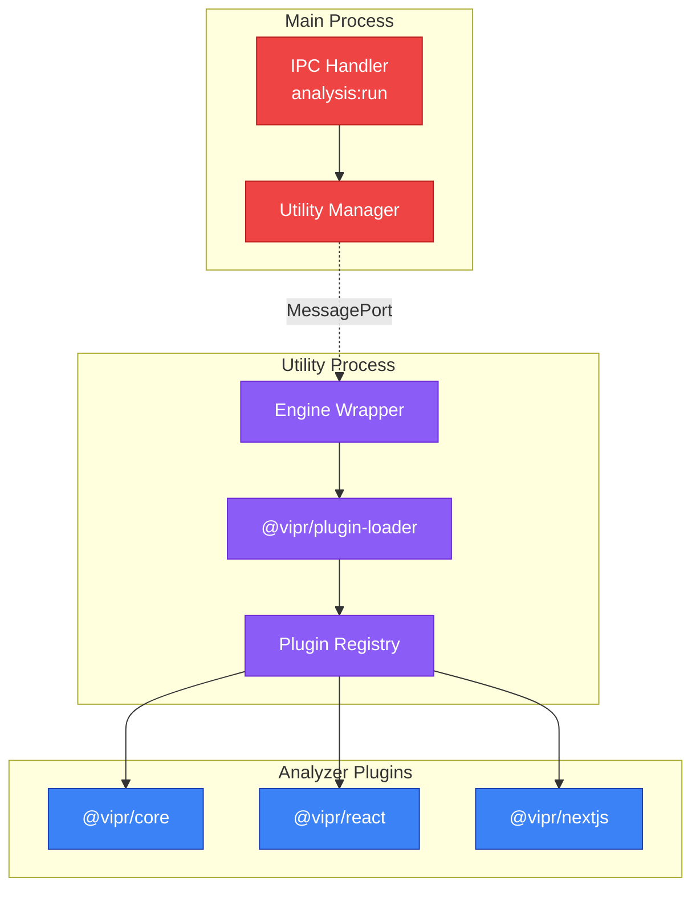
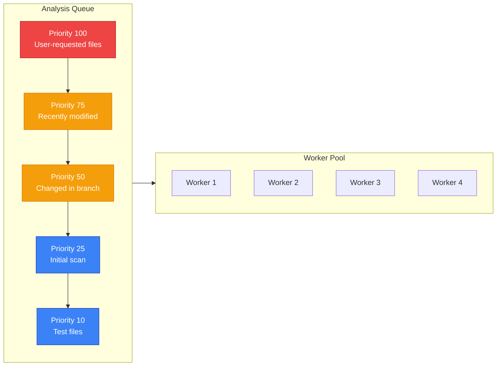
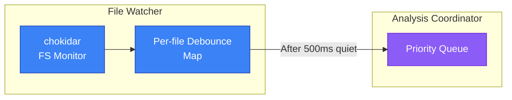
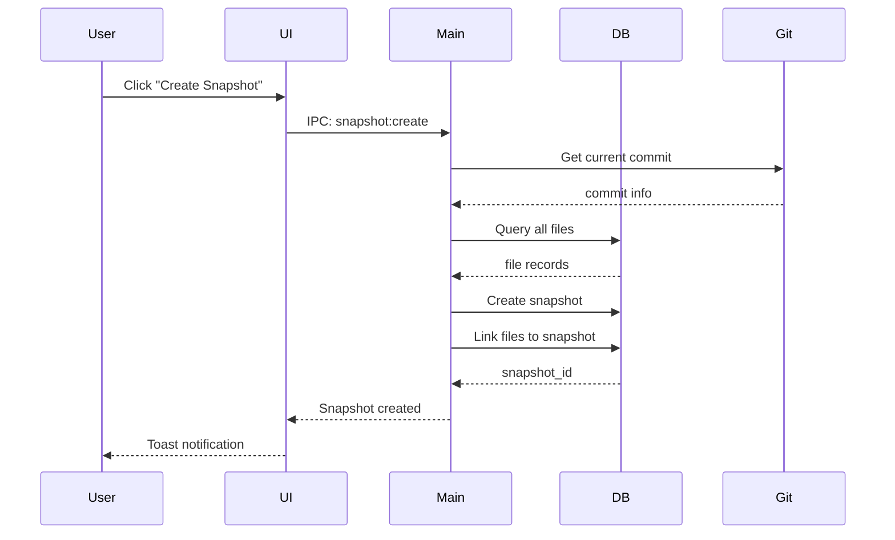

# phase 2: core analysis implementation plan

comprehensive technical implementation plan for phase 2 deliverables: plugin loader integration, analysis coordinator, file watcher, database persistence, and snapshot management.

---

## part a: technical proposal

### 1. plugin loader integration

#### 1.1 technical specifications

The desktop app will use the existing `@vipr/plugin-loader` package directly, following patterns established by CLI and VSCode extension clients. No custom abstraction layer needed.

**architecture:**



**dual-mode loading:**

| Environment | Strategy        | Implementation                       |
| ----------- | --------------- | ------------------------------------ |
| Development | Dynamic loading | `WorkspaceScanner` + `DynamicLoader` |
| Production  | Static imports  | Bundled plugin imports               |

**development mode implementation:**

```typescript
// src/utility/engine-loader.ts
import { AnalysisEngine } from '@vipr/engine';
import type { ITechnologyPlugin } from '@vipr/common';

/**
 * Load and configure the analysis engine with plugins.
 *
 * CRITICAL: Plugins use NAMED EXPORTS, not default exports.
 * Correct: import { CoreAnalyzerPlugin } from '@vipr/core'
 * Wrong: import CorePlugin from '@vipr/core'
 *
 * For Electron utility process, we always use static imports since
 * the utility process is bundled (no need for dynamic workspace scanning).
 */
export async function loadEngineWithPlugins(): Promise<AnalysisEngine> {
  // Engine configuration matching actual AnalysisEngine API
  // See packages/engine/src/analysis-engine.ts for full config interface
  const engine = new AnalysisEngine({
    enableCache: true,
    cacheTTL: 300000, // 5 minutes - file-level cache TTL
    debug: process.env.NODE_ENV === 'development',
    analysisExecution: {
      maxConcurrentAnalyses: 4, // Parallel analysis limit per plugin
      analysisTimeout: 30000, // 30 seconds per analysis
      enableAnalysisCache: true, // Cache individual analysis results
      analysisCacheTTL: 300000, // 5 minutes - analysis-level cache TTL
      enableCostBasedScheduling: true, // Run cheaper analyses first
      retryFailedAnalyses: false,
      maxRetries: 1,
    },
  });

  // Load plugins using NAMED EXPORTS (matches actual implementations)
  const { CoreAnalyzerPlugin } = await import('@vipr/core');
  const { ReactAnalyzerPlugin } = await import('@vipr/react');
  const { NextJsAnalyzerPlugin } = await import('@vipr/nextjs');

  // Register plugins
  // Plugins automatically register their presenters via getReportPresenters()
  engine.registerPlugin(new CoreAnalyzerPlugin());
  engine.registerPlugin(new ReactAnalyzerPlugin());
  engine.registerPlugin(new NextJsAnalyzerPlugin());

  return engine;
}
```

**Note**: The original documentation showed dual-mode loading (development vs production) with `@vipr/plugin-loader`. However, for the Electron utility process context, static imports are simpler and more appropriate since the utility process is always bundled. If dynamic workspace scanning is needed later, reference the CLI loader pattern in `/Users/jamesleebaker/Codespace/vipr/clients/cli/src/plugins/loader.ts`.

**Error handling for plugin loading:**

```typescript
export async function loadEngineWithPlugins(): Promise<AnalysisEngine> {
  const engine = new AnalysisEngine({
    /* config */
  });

  // Load each plugin with individual error handling
  // Allows partial plugin loading if one fails
  const pluginLoaders = [
    { name: 'Core', loader: () => import('@vipr/core') },
    { name: 'React', loader: () => import('@vipr/react') },
    { name: 'Next.js', loader: () => import('@vipr/nextjs') },
  ];

  for (const { name, loader } of pluginLoaders) {
    try {
      const module = await loader();
      const PluginClass =
        module[`${name}AnalyzerPlugin`] || module[`${name.replace('.', '')}AnalyzerPlugin`];

      if (!PluginClass) {
        console.warn(`Plugin ${name}: No plugin class found in module exports`);
        continue;
      }

      engine.registerPlugin(new PluginClass());
      console.log(`Plugin ${name}: Loaded successfully`);
    } catch (error) {
      console.error(`Plugin ${name}: Failed to load`, error);
      // Don't throw - allow other plugins to load
    }
  }

  if (engine.getPlugins().length === 0) {
    throw new Error('No plugins loaded - analysis engine unusable');
  }

  return engine;
}
```

#### 1.2 utility process architecture

**why utilityProcess?**

Per 02-architecture-proposal.md, utility processes provide:

- Full OS-level process isolation
- Memory reclaimed on exit
- Crash safety (isolated from main process)
- Better handling of heavy dependencies (ts-morph)

**utility process lifecycle:**

```typescript
// src/main/analysis/utility-manager.ts
import { utilityProcess, MessagePortMain } from 'electron';
import path from 'path';

export class UtilityProcessManager {
  private process: Electron.UtilityProcess | null = null;
  private messagePort: MessagePortMain | null = null;
  private isReady = false;

  async start(): Promise<void> {
    const utilityPath = path.join(__dirname, '../utility/worker.js');

    this.process = utilityProcess.fork(utilityPath, [], {
      serviceName: 'vipr-analysis-worker',
      stdio: 'pipe',
    });

    return new Promise((resolve, reject) => {
      this.process!.on('spawn', () => {
        this.isReady = true;
        resolve();
      });

      this.process!.on('exit', code => {
        console.log(`Utility process exited with code ${code}`);
        this.isReady = false;
      });

      this.process!.on('message', message => {
        if (message.type === 'ready') {
          this.isReady = true;
          resolve();
        }
      });

      setTimeout(() => reject(new Error('Utility process timeout')), 10000);
    });
  }

  async analyzeFile(filePath: string): Promise<AggregatedResult> {
    if (!this.isReady || !this.process) {
      throw new Error('Utility process not ready');
    }

    // Use sendMessage from utility-process-manager.ts pattern
    return this.sendMessage<AggregatedResult>({
      type: 'analyze',
      payload: { filePath },
    });
  }

  stop(): void {
    if (this.process) {
      this.process.kill();
      this.process = null;
      this.isReady = false;
    }
  }
}
```

**utility worker implementation:**

```typescript
// src/utility/worker.ts
import { parentPort } from 'electron';
import { loadEngineWithPlugins } from './engine-loader';
import type { AggregatedResult } from '@vipr/common';

let engine: AnalysisEngine | null = null;

async function initialize() {
  engine = await loadEngineWithPlugins();
  parentPort?.postMessage({ type: 'ready' });
}

parentPort?.on('message', async (message: { id: string; type: string; filePath?: string }) => {
  if (message.type === 'analyze' && message.filePath) {
    try {
      const result: AggregatedResult = await engine!.analyzeFile(message.filePath);
      parentPort?.postMessage({ id: message.id, result });
    } catch (error) {
      parentPort?.postMessage({
        id: message.id,
        error: error instanceof Error ? error.message : String(error),
      });
    }
  }
});

initialize().catch(error => {
  console.error('Failed to initialize utility worker:', error);
  process.exit(1);
});
```

#### 1.3 presenter registry access

Per CLAUDE.md: clients never import presenters directly. All access via IPC.

**ipc channel for presenter discovery:**

```typescript
// src/main/ipc/handlers/reports.ts
import { ipcMain } from 'electron';
import type { IReportMetadata } from '@vipr/common';

export function registerReportsHandlers(utilityManager: UtilityProcessManager) {
  ipcMain.handle('reports:getAvailable', async (_event, { repoId }) => {
    const metadata: IReportMetadata[] = await utilityManager.getAvailableReports(repoId);
    return metadata;
  });

  ipcMain.handle('reports:generate', async (_event, { reportType, pluginId, filters }) => {
    const presentation = await utilityManager.generateReport(reportType, pluginId, filters);
    return presentation;
  });
}
```

**utility process implementation:**

```typescript
// src/utility/worker.ts (extended)
import { PresenterRegistry } from '@vipr/common';
import type { IReportMetadata, AggregatedResult } from '@vipr/common';

const presenterRegistry = new PresenterRegistry();

// Register presenters during plugin initialization
async function initialize() {
  engine = await loadEngineWithPlugins();

  // Plugins automatically expose presenters via getReportPresenters()
  // Use registerFromPlugin() helper to register all at once
  const plugins = engine.getPlugins();
  for (const plugin of plugins) {
    presenterRegistry.registerFromPlugin(plugin);
  }

  parentPort?.postMessage({ type: 'ready' });
}

// Handle ALL message types for reports IPC
parentPort?.on(
  'message',
  async (message: {
    id: string;
    type: string;
    reportType?: string;
    pluginId?: string;
    filters?: Record<string, unknown>;
    results?: AggregatedResult[];
  }) => {
    try {
      if (message.type === 'getAvailableReports') {
        // Returns metadata for ALL registered presenters across all plugins
        // Metadata includes: reportType, pluginId, label, hint, icon, order, categories
        const metadata: IReportMetadata[] = presenterRegistry.getAvailableReports();
        parentPort?.postMessage({ id: message.id, result: metadata });
      } else if (message.type === 'getReportsByPlugin') {
        // Get metadata for a specific plugin's reports
        const { pluginId } = message;
        if (!pluginId) {
          throw new Error('Missing pluginId parameter');
        }
        const metadata: IReportMetadata[] = presenterRegistry
          .getByPlugin(pluginId)
          .map(p => p.getMetadata());
        parentPort?.postMessage({ id: message.id, result: metadata });
      } else if (message.type === 'generateReport') {
        // Generate a specific report presentation
        const { reportType, pluginId, filters, results } = message;

        if (!reportType || !pluginId) {
          throw new Error('Missing reportType or pluginId');
        }

        if (!results || results.length === 0) {
          throw new Error('No analysis results provided');
        }

        const presenter = presenterRegistry.get(pluginId, reportType);
        if (!presenter) {
          throw new Error(`Presenter not found: ${pluginId}:${reportType}`);
        }

        // Generate presentation using filtered results
        const presentation = await presenter.present(results, filters);
        parentPort?.postMessage({ id: message.id, result: presentation });
      } else {
        throw new Error(`Unknown message type: ${message.type}`);
      }
    } catch (error) {
      parentPort?.postMessage({
        id: message.id,
        error: error instanceof Error ? error.message : String(error),
      });
    }
  }
);
```

**Key corrections:**

1. Use `presenterRegistry.registerFromPlugin(plugin)` instead of manual iteration
2. Handle ALL message types: `getAvailableReports`, `getReportsByPlugin`, `generateReport`
3. Properly type message payloads and validate required parameters
4. `presenter.present()` requires analysis results as first parameter (not fetched internally)
5. Add comprehensive error handling for all IPC operations

#### 1.4 acceptance criteria

- [ ] Utility process spawns successfully and initializes within 10 seconds
- [ ] Plugins use NAMED EXPORTS (CoreAnalyzerPlugin, ReactAnalyzerPlugin, NextJsAnalyzerPlugin)
- [ ] Plugins register successfully with AnalysisEngine.registerPlugin()
- [ ] Presenter registry populated via registerFromPlugin() helper
- [ ] Presenter metadata accessible via IPC (getAvailableReports, getReportsByPlugin)
- [ ] Report generation works via IPC (generateReport with results + filters)
- [ ] Utility process crashes do not affect main process
- [ ] Utility process memory is reclaimed on exit
- [ ] All existing plugins (core, react, nextjs) register successfully
- [ ] Zero client code imports analyzer packages directly (verified via grep)
- [ ] Error handling covers plugin loading failures, missing presenters, invalid IPC messages

#### 1.5 dependencies and integration points

**package dependencies:**

```json
{
  "dependencies": {
    "@vipr/engine": "workspace:*",
    "@vipr/common": "workspace:*",
    "@vipr/core": "workspace:*",
    "@vipr/react": "workspace:*",
    "@vipr/nextjs": "workspace:*",
    "@vipr/logging": "workspace:*"
  }
}
```

**Note**: `@vipr/plugin-loader` is NOT needed for Electron desktop since we use static imports. The plugin-loader package is designed for dynamic workspace scanning (used in CLI development mode) but adds unnecessary complexity for the bundled utility process context.

**integration points:**

- IPC handlers in main process
- Utility process manager lifecycle
- Database persistence layer (writes results)
- Analysis coordinator (queues work)

#### 1.6 performance considerations

- Utility process startup time: target under 10 seconds
- Analysis throughput: 10-20 files/second with 4 concurrent analyses
- Memory isolation prevents memory leaks in main process
- Plugin registration caching for fast restarts

---

### 2. analysis coordinator with priority queue

#### 2.1 technical specifications

The analysis coordinator manages a priority queue of files awaiting analysis. It ensures high-priority files (user-requested, recently modified) are analyzed before low-priority files (initial indexing).

**priority queue design:**



**priority calculation:**

| Trigger                | Priority | Rationale                          |
| ---------------------- | -------- | ---------------------------------- |
| User clicks file       | 100      | Immediate feedback required        |
| File changed (watcher) | 75       | Recent change, likely viewing soon |
| Changed in branch      | 50       | PR review context                  |
| High churn (git log)   | 40       | Risk indicator                     |
| Initial scan           | 25       | Background indexing                |
| Test files             | 10       | Lower importance for metrics       |

**coordinator implementation:**

```typescript
// src/main/analysis/coordinator.ts
import { EventEmitter } from 'events';
import type { UtilityProcessManager } from './utility-manager';
import type { DatabaseService } from '../db/database-service';

export interface QueuedFile {
  filePath: string;
  priority: number;
  reason: 'user' | 'fileChange' | 'branch' | 'churn' | 'initial' | 'test';
  queuedAt: number;
}

export interface CoordinatorConfig {
  maxConcurrent: number;
  debounceMs: number;
  batchSize: number;
}

export class AnalysisCoordinator extends EventEmitter {
  private queue: QueuedFile[] = [];
  private processing = new Set<string>();
  private isRunning = false;
  private config: CoordinatorConfig;

  constructor(
    private readonly utilityManager: UtilityProcessManager,
    private readonly db: DatabaseService,
    config: Partial<CoordinatorConfig> = {}
  ) {
    super();
    this.config = {
      maxConcurrent: 4,
      debounceMs: 500,
      batchSize: 10,
      ...config,
    };
  }

  /**
   * Enqueue a file for analysis
   */
  enqueue(filePath: string, priority: number, reason: QueuedFile['reason']): void {
    // Remove existing entry for this file (update priority)
    this.queue = this.queue.filter(item => item.filePath !== filePath);

    // Insert sorted by priority (descending)
    const item: QueuedFile = { filePath, priority, reason, queuedAt: Date.now() };
    const index = this.queue.findIndex(q => q.priority < priority);

    if (index === -1) {
      this.queue.push(item);
    } else {
      this.queue.splice(index, 0, item);
    }

    this.emit('queue-updated', { size: this.queue.length });

    // Start processing if not already running
    if (!this.isRunning) {
      this.processQueue();
    }
  }

  /**
   * Enqueue multiple files
   */
  enqueueBatch(
    files: Array<{ filePath: string; priority: number; reason: QueuedFile['reason'] }>
  ): void {
    files.forEach(({ filePath, priority, reason }) => {
      this.enqueue(filePath, priority, reason);
    });
  }

  /**
   * Process queue with concurrency limit
   */
  private async processQueue(): Promise<void> {
    this.isRunning = true;

    while (this.queue.length > 0 || this.processing.size > 0) {
      // Fill worker slots
      while (this.processing.size < this.config.maxConcurrent && this.queue.length > 0) {
        const item = this.queue.shift();
        if (!item) break;

        this.processing.add(item.filePath);
        this.processFile(item).then(() => {
          this.processing.delete(item.filePath);
        });
      }

      // Wait before checking again
      await new Promise(resolve => setTimeout(resolve, 100));
    }

    this.isRunning = false;
  }

  /**
   * Process a single file
   */
  private async processFile(item: QueuedFile): Promise<void> {
    const startTime = Date.now();

    try {
      this.emit('file-started', { filePath: item.filePath });

      // Check if file needs analysis (SHA comparison)
      const needsAnalysis = await this.needsAnalysis(item.filePath);
      if (!needsAnalysis) {
        this.emit('file-skipped', { filePath: item.filePath, reason: 'unchanged' });
        return;
      }

      // Analyze file
      const result = await this.utilityManager.analyzeFile(item.filePath);

      // Persist to database
      await this.db.saveAnalysisResult(item.filePath, result);

      const duration = Date.now() - startTime;
      this.emit('file-completed', { filePath: item.filePath, duration, result });
    } catch (error) {
      const duration = Date.now() - startTime;
      this.emit('file-failed', {
        filePath: item.filePath,
        duration,
        error: error instanceof Error ? error.message : String(error),
      });
    }
  }

  /**
   * Check if file needs analysis (SHA comparison)
   */
  private async needsAnalysis(filePath: string): Promise<boolean> {
    const fs = require('fs').promises;
    const crypto = require('crypto');

    try {
      const content = await fs.readFile(filePath, 'utf-8');
      const currentSHA = crypto.createHash('sha256').update(content).digest('hex');

      const existing = await this.db.getFileRecord(filePath);
      return !existing || existing.sha !== currentSHA;
    } catch {
      return true; // Analyze if error
    }
  }

  /**
   * Get queue statistics
   */
  getStats() {
    return {
      queueSize: this.queue.length,
      processing: this.processing.size,
      isRunning: this.isRunning,
    };
  }

  /**
   * Clear the queue
   */
  clear(): void {
    this.queue = [];
    this.emit('queue-cleared');
  }

  /**
   * Stop processing
   */
  stop(): void {
    this.isRunning = false;
  }
}
```

#### 2.2 step-by-step implementation approach

1. Create `AnalysisCoordinator` class with priority queue
2. Implement sorted insertion by priority
3. Add concurrency limiting (max 4 concurrent)
4. Integrate SHA comparison for cache invalidation
5. Emit progress events for UI updates
6. Add batch enqueue for initial scans
7. Integrate with database persistence
8. Add error handling and retry logic

#### 2.3 code structure

```
src/main/analysis/
├── coordinator.ts          # Priority queue implementation
├── coordinator.test.ts     # Unit tests
├── utility-manager.ts      # Utility process lifecycle
└── engine-loader.ts        # Plugin loading strategy
```

#### 2.4 acceptance criteria

- [ ] Files analyzed in priority order (100, 75, 50, 25, 10)
- [ ] Concurrency limit enforced (max 4 concurrent)
- [ ] SHA comparison prevents redundant analysis
- [ ] Progress events emitted for UI updates
- [ ] Batch enqueue supports initial scans
- [ ] Queue statistics available via `getStats()`
- [ ] Errors do not block queue processing
- [ ] Queue can be cleared and stopped

#### 2.5 performance considerations

- Priority insertion: O(n) but n is small (typically < 1000 queued)
- Concurrency limit prevents overwhelming utility process
- SHA comparison avoids redundant analysis (90%+ cache hit rate expected)
- Batch operations reduce event overhead

---

### 3. file watcher with per-file debouncing

#### 3.1 technical specifications

The file watcher uses `chokidar` for cross-platform file system monitoring. Per-file debouncing (not global) ensures rapid editing of one file doesn't delay analysis of other files.

**per-file debouncing strategy:**



**implementation:**

```typescript
// src/main/fs/watcher.ts
import chokidar from 'chokidar';
import path from 'path';
import type { AnalysisCoordinator } from '../analysis/coordinator';

export interface WatcherConfig {
  debounceMs: number;
  ignored: string[];
}

export class FileWatcher {
  private watcher: chokidar.FSWatcher | null = null;
  private debouncers = new Map<string, NodeJS.Timeout>();
  private config: WatcherConfig;

  constructor(
    private readonly repoPath: string,
    private readonly coordinator: AnalysisCoordinator,
    config: Partial<WatcherConfig> = {}
  ) {
    this.config = {
      debounceMs: 500,
      ignored: [
        '**/node_modules/**',
        '**/.git/**',
        '**/dist/**',
        '**/build/**',
        '**/.next/**',
        '**/coverage/**',
      ],
      ...config,
    };
  }

  /**
   * Start watching the repository
   */
  start(): void {
    this.watcher = chokidar.watch(this.repoPath, {
      ignored: this.config.ignored,
      persistent: true,
      ignoreInitial: true, // Don't trigger for existing files
      awaitWriteFinish: {
        stabilityThreshold: 100,
        pollInterval: 50,
      },
    });

    this.watcher.on('change', filePath => this.handleChange(filePath));
    this.watcher.on('add', filePath => this.handleAdd(filePath));
    this.watcher.on('unlink', filePath => this.handleUnlink(filePath));
    this.watcher.on('error', error => this.handleError(error));

    console.log(`Watching repository: ${this.repoPath}`);
  }

  /**
   * Handle file change event
   */
  private handleChange(filePath: string): void {
    if (!this.shouldWatch(filePath)) return;

    // Clear existing debounce timer
    const existing = this.debouncers.get(filePath);
    if (existing) {
      clearTimeout(existing);
    }

    // Start new debounce timer
    const timer = setTimeout(() => {
      this.debouncers.delete(filePath);
      this.coordinator.enqueue(filePath, 75, 'fileChange');
    }, this.config.debounceMs);

    this.debouncers.set(filePath, timer);
  }

  /**
   * Handle file add event
   */
  private handleAdd(filePath: string): void {
    if (!this.shouldWatch(filePath)) return;

    // New files get lower priority
    this.coordinator.enqueue(filePath, 50, 'fileChange');
  }

  /**
   * Handle file delete event
   */
  private async handleUnlink(filePath: string): Promise<void> {
    // Remove from debounce map
    const existing = this.debouncers.get(filePath);
    if (existing) {
      clearTimeout(existing);
      this.debouncers.delete(filePath);
    }

    // Mark as deleted in database
    try {
      await this.db.markFileAsDeleted(filePath);
      logger.info(`File marked as deleted: ${filePath}`);
    } catch (error) {
      logger.error(`Failed to mark file as deleted: ${filePath}`, error);
    }
  }

  /**
   * Handle watcher error
   */
  private handleError(error: Error): void {
    console.error('File watcher error:', error);
  }

  /**
   * Check if file should be watched
   */
  private shouldWatch(filePath: string): boolean {
    const ext = path.extname(filePath);
    return ['.ts', '.tsx', '.js', '.jsx'].includes(ext);
  }

  /**
   * Stop watching
   */
  stop(): void {
    if (this.watcher) {
      this.watcher.close();
      this.watcher = null;
    }

    // Clear all debounce timers
    for (const timer of this.debouncers.values()) {
      clearTimeout(timer);
    }
    this.debouncers.clear();
  }

  /**
   * Get watcher statistics
   */
  getStats() {
    return {
      isWatching: this.watcher !== null,
      debouncePending: this.debouncers.size,
    };
  }
}
```

#### 3.2 implementation approach

1. Create `FileWatcher` class with chokidar integration
2. Implement per-file debounce map
3. Handle change, add, unlink events
4. Filter by supported file extensions
5. Integrate with analysis coordinator
6. Add ignored patterns (node_modules, .git, etc.)
7. Implement awaitWriteFinish for stability

#### 3.3 acceptance criteria

- [ ] Watches repository for changes
- [ ] Debounces per file (not globally)
- [ ] Ignores node_modules, .git, dist, build directories
- [ ] Handles rapid edits of single file correctly
- [ ] Enqueues changed files with priority 75
- [ ] Enqueues new files with priority 50
- [ ] Stops watching cleanly on repository close
- [ ] No memory leaks from debounce timers

#### 3.4 vscode extension patterns to reuse

From `clients/vscode-extension/src/services/git-history-service.ts`:

- File extension filtering logic
- Git integration patterns
- Error handling strategies

#### 3.5 performance considerations

- Per-file debouncing prevents editing File A from delaying File B analysis
- 500ms debounce balances responsiveness with efficiency
- awaitWriteFinish prevents analyzing incomplete writes
- Ignored patterns reduce unnecessary events (90%+ reduction)

---

### 4. database persistence layer

#### 4.1 technical specifications

SQLite database with better-sqlite3 for native performance. WAL mode enables concurrent reads (MCP server) and writes (main process).

**schema design:**

```sql
-- Files table
CREATE TABLE files (
  id INTEGER PRIMARY KEY AUTOINCREMENT,
  path TEXT UNIQUE NOT NULL,
  sha TEXT NOT NULL,
  analyzed_at INTEGER NOT NULL,
  git_sha TEXT,
  git_author TEXT,
  git_date INTEGER,
  file_type TEXT,
  technologies JSON,
  created_at INTEGER NOT NULL DEFAULT (strftime('%s', 'now')),
  updated_at INTEGER NOT NULL DEFAULT (strftime('%s', 'now'))
);

CREATE INDEX idx_files_path ON files(path);
CREATE INDEX idx_files_sha ON files(sha);
CREATE INDEX idx_files_git_sha ON files(git_sha);

-- Analyses table
CREATE TABLE analyses (
  id INTEGER PRIMARY KEY AUTOINCREMENT,
  file_id INTEGER NOT NULL REFERENCES files(id) ON DELETE CASCADE,
  plugin_id TEXT NOT NULL,
  score INTEGER,
  result JSON NOT NULL,
  insights JSON,
  metrics JSON,
  execution_time_ms INTEGER,
  created_at INTEGER NOT NULL DEFAULT (strftime('%s', 'now'))
);

CREATE INDEX idx_analyses_file_id ON analyses(file_id);
CREATE INDEX idx_analyses_plugin_id ON analyses(plugin_id);
CREATE INDEX idx_analyses_file_plugin ON analyses(file_id, plugin_id);

-- Snapshots table
CREATE TABLE snapshots (
  id INTEGER PRIMARY KEY AUTOINCREMENT,
  git_sha TEXT UNIQUE NOT NULL,
  git_author TEXT,
  git_message TEXT,
  git_date INTEGER,
  file_count INTEGER NOT NULL DEFAULT 0,
  avg_score REAL,
  summary JSON,
  created_at INTEGER NOT NULL DEFAULT (strftime('%s', 'now'))
);

CREATE INDEX idx_snapshots_git_sha ON snapshots(git_sha);
CREATE INDEX idx_snapshots_git_date ON snapshots(git_date);

-- Snapshot files table
CREATE TABLE snapshot_files (
  id INTEGER PRIMARY KEY AUTOINCREMENT,
  snapshot_id INTEGER NOT NULL REFERENCES snapshots(id) ON DELETE CASCADE,
  file_id INTEGER NOT NULL REFERENCES files(id) ON DELETE CASCADE,
  overall_score INTEGER,
  plugin_results JSON NOT NULL
);

CREATE INDEX idx_snapshot_files_snapshot_id ON snapshot_files(snapshot_id);
CREATE INDEX idx_snapshot_files_file_id ON snapshot_files(file_id);

-- Notes table
CREATE TABLE notes (
  id INTEGER PRIMARY KEY AUTOINCREMENT,
  target_type TEXT NOT NULL CHECK (target_type IN ('file', 'issue', 'abstraction')),
  target_id TEXT NOT NULL,
  content TEXT NOT NULL,
  created_at INTEGER NOT NULL DEFAULT (strftime('%s', 'now')),
  updated_at INTEGER NOT NULL DEFAULT (strftime('%s', 'now'))
);

CREATE INDEX idx_notes_target ON notes(target_type, target_id);

-- Exclusions table
CREATE TABLE exclusions (
  id INTEGER PRIMARY KEY AUTOINCREMENT,
  issue_type TEXT NOT NULL,
  file_path TEXT,
  plugin_id TEXT,
  reason TEXT,
  created_at INTEGER NOT NULL DEFAULT (strftime('%s', 'now'))
);

CREATE INDEX idx_exclusions_issue_type ON exclusions(issue_type);

-- Metadata table
CREATE TABLE metadata (
  key TEXT PRIMARY KEY,
  value TEXT NOT NULL,
  updated_at INTEGER NOT NULL DEFAULT (strftime('%s', 'now'))
);

-- Preferences table
CREATE TABLE preferences (
  key TEXT PRIMARY KEY,
  value TEXT NOT NULL,
  updated_at INTEGER NOT NULL DEFAULT (strftime('%s', 'now'))
);

-- Analysis queue table
CREATE TABLE analysis_queue (
  id INTEGER PRIMARY KEY AUTOINCREMENT,
  file_path TEXT UNIQUE NOT NULL,
  priority INTEGER NOT NULL DEFAULT 25,
  reason TEXT NOT NULL,
  queued_at INTEGER NOT NULL DEFAULT (strftime('%s', 'now'))
);

CREATE INDEX idx_queue_priority ON analysis_queue(priority DESC);

-- FTS5 search index
CREATE VIRTUAL TABLE search_index USING fts5(
  file_path,
  content,
  tokenize = 'porter'
);
```

**database service implementation:**

```typescript
// src/main/db/database-service.ts
import Database from 'better-sqlite3';
import path from 'path';
import { app } from 'electron';
import type { AggregatedResult, FileRecord, AnalysisRecord } from '../types';

export class DatabaseService {
  private db: Database.Database;

  constructor(repoPath: string) {
    const dbPath = this.getDatabasePath(repoPath);
    this.db = new Database(dbPath);
    this.initialize();
  }

  /**
   * Initialize database with WAL mode and schema
   */
  private initialize(): void {
    // Enable WAL mode for concurrent access
    this.db.pragma('journal_mode = WAL');
    this.db.pragma('synchronous = NORMAL');
    this.db.pragma('foreign_keys = ON');

    // Run migrations
    this.runMigrations();
  }

  /**
   * Get database path for repository
   */
  private getDatabasePath(repoPath: string): string {
    const repoName = path.basename(repoPath);
    const hash = require('crypto').createHash('md5').update(repoPath).digest('hex').substring(0, 8);

    const dbDir = path.join(app.getPath('userData'), 'databases');
    require('fs').mkdirSync(dbDir, { recursive: true });

    return path.join(dbDir, `${repoName}-${hash}.db`);
  }

  /**
   * Run schema migrations
   */
  private runMigrations(): void {
    const currentVersion = this.getSchemaVersion();

    if (currentVersion === 0) {
      // Initial schema creation
      const schema = require('fs').readFileSync(path.join(__dirname, 'schema.sql'), 'utf-8');
      this.db.exec(schema);
      this.setSchemaVersion(1);
    }

    // Future migrations go here
    // if (currentVersion < 2) { ... }
  }

  /**
   * Save analysis result to database
   */
  async saveAnalysisResult(filePath: string, result: AggregatedResult): Promise<void> {
    const crypto = require('crypto');
    const fs = require('fs').promises;

    try {
      const content = await fs.readFile(filePath, 'utf-8');
      const sha = crypto.createHash('sha256').update(content).digest('hex');

      this.db.transaction(() => {
        // Insert or update file record
        const fileStmt = this.db.prepare(`
          INSERT INTO files (path, sha, analyzed_at, file_type, technologies)
          VALUES (?, ?, ?, ?, ?)
          ON CONFLICT(path) DO UPDATE SET
            sha = excluded.sha,
            analyzed_at = excluded.analyzed_at,
            file_type = excluded.file_type,
            technologies = excluded.technologies,
            updated_at = strftime('%s', 'now')
        `);

        const now = Math.floor(Date.now() / 1000);
        fileStmt.run(
          filePath,
          sha,
          now,
          result.fileType || null,
          JSON.stringify(result.technologies || [])
        );

        const fileId = this.db.prepare('SELECT id FROM files WHERE path = ?').get(filePath).id;

        // Delete existing analyses for this file
        this.db.prepare('DELETE FROM analyses WHERE file_id = ?').run(fileId);

        // Insert plugin analyses
        const analysisStmt = this.db.prepare(`
          INSERT INTO analyses (file_id, plugin_id, score, result, insights, metrics, execution_time_ms)
          VALUES (?, ?, ?, ?, ?, ?, ?)
        `);

        for (const [pluginId, pluginResult] of result.pluginResults.entries()) {
          analysisStmt.run(
            fileId,
            pluginId,
            pluginResult.score || null,
            JSON.stringify(pluginResult),
            JSON.stringify(pluginResult.insights || []),
            JSON.stringify(pluginResult.metrics || {}),
            pluginResult.executionTimeMs || null
          );
        }
      })();
    } catch (error) {
      console.error('Failed to save analysis result:', error);
      throw error;
    }
  }

  /**
   * Get file record by path
   */
  getFileRecord(filePath: string): FileRecord | null {
    const stmt = this.db.prepare('SELECT * FROM files WHERE path = ?');
    return stmt.get(filePath) as FileRecord | null;
  }

  /**
   * Get all file records
   */
  getAllFiles(): FileRecord[] {
    const stmt = this.db.prepare('SELECT * FROM files ORDER BY path');
    return stmt.all() as FileRecord[];
  }

  /**
   * Get analysis records for a file
   */
  getAnalyses(fileId: number): AnalysisRecord[] {
    const stmt = this.db.prepare('SELECT * FROM analyses WHERE file_id = ?');
    return stmt.all(fileId) as AnalysisRecord[];
  }

  /**
   * Get schema version
   */
  private getSchemaVersion(): number {
    try {
      const result = this.db
        .prepare("SELECT value FROM metadata WHERE key = 'schema_version'")
        .get();
      return result ? parseInt(result.value, 10) : 0;
    } catch {
      return 0;
    }
  }

  /**
   * Set schema version
   */
  private setSchemaVersion(version: number): void {
    this.db
      .prepare(
        `
      INSERT INTO metadata (key, value) VALUES ('schema_version', ?)
      ON CONFLICT(key) DO UPDATE SET value = excluded.value
    `
      )
      .run(version.toString());
  }

  /**
   * Close database connection
   */
  close(): void {
    this.db.close();
  }
}
```

#### 4.2 implementation approach

1. Create `DatabaseService` class with better-sqlite3
2. Implement WAL mode configuration
3. Create schema migration system
4. Implement CRUD operations for files and analyses
5. Add transaction support for atomic operations
6. Implement SHA-based cache invalidation
7. Add full-text search (FTS5) for file search
8. Create indices for query optimization

#### 4.3 acceptance criteria

- [ ] Database created per repository in app data directory
- [ ] WAL mode enabled for concurrent access
- [ ] Schema migrations run successfully
- [ ] Analysis results persist correctly
- [ ] SHA comparison detects changed files
- [ ] Transactions ensure atomicity
- [ ] Indices improve query performance (< 50ms for file lookups)
- [ ] FTS5 search returns results in < 100ms

#### 4.4 vscode extension patterns to reuse

From `clients/vscode-extension/src/core/storage-service.ts`:

- Schema versioning approach
- Transaction patterns
- Cache invalidation logic

Alignment opportunities with VSCode extension database:

- Use similar column names for future unification
- Store git metadata consistently
- Share JSON structure for plugin results

#### 4.5 performance considerations

- WAL mode enables concurrent reads during writes
- Prepared statements reduce query overhead
- Indices on foreign keys improve join performance
- Transaction batching reduces disk I/O
- JSON columns provide flexibility without schema changes

---

### 5. snapshot management

#### 5.1 technical specifications

Snapshots capture analysis state at git commits for historical comparison and regression detection.

**snapshot creation flow:**



**snapshot service implementation:**

```typescript
// src/main/analysis/snapshot-service.ts
import type { DatabaseService } from '../db/database-service';
import { exec } from 'child_process';
import { promisify } from 'util';

const execAsync = promisify(exec);

export interface Snapshot {
  id: number;
  gitSha: string;
  gitAuthor: string;
  gitMessage: string;
  gitDate: Date;
  fileCount: number;
  avgScore: number;
  summary: Record<string, any>;
  createdAt: Date;
}

export interface SnapshotComparison {
  before: Snapshot;
  after: Snapshot;
  filesChanged: number;
  filesAdded: number;
  filesRemoved: number;
  scoreChange: number;
  regressions: Array<{
    filePath: string;
    scoreBefore: number;
    scoreAfter: number;
    delta: number;
  }>;
}

export class SnapshotService {
  constructor(
    private readonly db: DatabaseService,
    private readonly repoPath: string
  ) {}

  /**
   * Create a snapshot at current git HEAD
   */
  async createSnapshot(): Promise<Snapshot> {
    // Get current git commit info
    const commitInfo = await this.getCurrentCommitInfo();

    // Get all files and their analysis results
    const files = this.db.getAllFiles();
    const fileCount = files.length;

    // Calculate aggregate metrics
    let totalScore = 0;
    let scoreCount = 0;
    const pluginSummary: Record<string, any> = {};

    for (const file of files) {
      const analyses = this.db.getAnalyses(file.id);

      for (const analysis of analyses) {
        if (analysis.score !== null) {
          totalScore += analysis.score;
          scoreCount++;
        }

        // Aggregate by plugin
        if (!pluginSummary[analysis.plugin_id]) {
          pluginSummary[analysis.plugin_id] = {
            fileCount: 0,
            avgScore: 0,
            totalScore: 0,
            scoreCount: 0,
          };
        }

        const pluginData = pluginSummary[analysis.plugin_id];
        pluginData.fileCount++;
        if (analysis.score !== null) {
          pluginData.totalScore += analysis.score;
          pluginData.scoreCount++;
        }
      }
    }

    // Calculate averages
    const avgScore = scoreCount > 0 ? totalScore / scoreCount : 0;
    for (const pluginId in pluginSummary) {
      const data = pluginSummary[pluginId];
      data.avgScore = data.scoreCount > 0 ? data.totalScore / data.scoreCount : 0;
      delete data.totalScore;
      delete data.scoreCount;
    }

    // Create snapshot in database
    const snapshotId = this.db.transaction(() => {
      const stmt = this.db.prepare(`
        INSERT INTO snapshots (git_sha, git_author, git_message, git_date, file_count, avg_score, summary)
        VALUES (?, ?, ?, ?, ?, ?, ?)
      `);

      const result = stmt.run(
        commitInfo.sha,
        commitInfo.author,
        commitInfo.message,
        commitInfo.date,
        fileCount,
        avgScore,
        JSON.stringify(pluginSummary)
      );

      const snapshotId = result.lastInsertRowid as number;

      // Link files to snapshot
      const linkStmt = this.db.prepare(`
        INSERT INTO snapshot_files (snapshot_id, file_id, overall_score, plugin_results)
        VALUES (?, ?, ?, ?)
      `);

      for (const file of files) {
        const analyses = this.db.getAnalyses(file.id);
        const pluginResults: Record<string, any> = {};

        for (const analysis of analyses) {
          pluginResults[analysis.plugin_id] = JSON.parse(analysis.result);
        }

        // Calculate overall score for this file
        let fileScore = 0;
        let fileScoreCount = 0;
        for (const analysis of analyses) {
          if (analysis.score !== null) {
            fileScore += analysis.score;
            fileScoreCount++;
          }
        }
        const overallScore = fileScoreCount > 0 ? fileScore / fileScoreCount : null;

        linkStmt.run(snapshotId, file.id, overallScore, JSON.stringify(pluginResults));
      }

      return snapshotId;
    })();

    return this.getSnapshot(snapshotId)!;
  }

  /**
   * Get snapshot by ID
   */
  getSnapshot(snapshotId: number): Snapshot | null {
    const stmt = this.db.prepare('SELECT * FROM snapshots WHERE id = ?');
    const row = stmt.get(snapshotId);

    if (!row) return null;

    return {
      id: row.id,
      gitSha: row.git_sha,
      gitAuthor: row.git_author,
      gitMessage: row.git_message,
      gitDate: new Date(row.git_date * 1000),
      fileCount: row.file_count,
      avgScore: row.avg_score,
      summary: JSON.parse(row.summary),
      createdAt: new Date(row.created_at * 1000),
    };
  }

  /**
   * Get all snapshots ordered by date
   */
  getAllSnapshots(): Snapshot[] {
    const stmt = this.db.prepare('SELECT * FROM snapshots ORDER BY git_date DESC');
    const rows = stmt.all();

    return rows.map(row => ({
      id: row.id,
      gitSha: row.git_sha,
      gitAuthor: row.git_author,
      gitMessage: row.git_message,
      gitDate: new Date(row.git_date * 1000),
      fileCount: row.file_count,
      avgScore: row.avg_score,
      summary: JSON.parse(row.summary),
      createdAt: new Date(row.created_at * 1000),
    }));
  }

  /**
   * Compare two snapshots
   */
  compareSnapshots(beforeId: number, afterId: number): SnapshotComparison | null {
    const before = this.getSnapshot(beforeId);
    const after = this.getSnapshot(afterId);

    if (!before || !after) return null;

    // Get files in each snapshot
    const beforeFiles = this.getSnapshotFiles(beforeId);
    const afterFiles = this.getSnapshotFiles(afterId);

    const beforePaths = new Set(beforeFiles.map(f => f.path));
    const afterPaths = new Set(afterFiles.map(f => f.path));

    const filesAdded = afterFiles.filter(f => !beforePaths.has(f.path)).length;
    const filesRemoved = beforeFiles.filter(f => !afterPaths.has(f.path)).length;
    const filesChanged = afterFiles.filter(f => beforePaths.has(f.path)).length;

    // Find regressions (score drops)
    const regressions: SnapshotComparison['regressions'] = [];
    const beforeMap = new Map(beforeFiles.map(f => [f.path, f.overall_score]));

    for (const afterFile of afterFiles) {
      const beforeScore = beforeMap.get(afterFile.path);
      if (beforeScore !== undefined && afterFile.overall_score < beforeScore) {
        regressions.push({
          filePath: afterFile.path,
          scoreBefore: beforeScore,
          scoreAfter: afterFile.overall_score,
          delta: beforeScore - afterFile.overall_score,
        });
      }
    }

    // Sort regressions by delta (worst first)
    regressions.sort((a, b) => b.delta - a.delta);

    return {
      before,
      after,
      filesChanged,
      filesAdded,
      filesRemoved,
      scoreChange: after.avgScore - before.avgScore,
      regressions,
    };
  }

  /**
   * Get files in a snapshot
   */
  private getSnapshotFiles(snapshotId: number): Array<{ path: string; overall_score: number }> {
    const stmt = this.db.prepare(`
      SELECT f.path, sf.overall_score
      FROM snapshot_files sf
      JOIN files f ON f.id = sf.file_id
      WHERE sf.snapshot_id = ?
    `);
    return stmt.all(snapshotId);
  }

  /**
   * Get current git commit info
   */
  private async getCurrentCommitInfo(): Promise<{
    sha: string;
    author: string;
    message: string;
    date: number;
  }> {
    try {
      const { stdout } = await execAsync('git log -1 --format="%H|%an|%s|%at"', {
        cwd: this.repoPath,
      });

      const [sha, author, message, timestamp] = stdout.trim().split('|');
      return {
        sha,
        author,
        message,
        date: parseInt(timestamp, 10),
      };
    } catch (error) {
      throw new Error(`Failed to get git commit info: ${error}`);
    }
  }
}
```

#### 5.2 implementation approach

1. Create `SnapshotService` class
2. Implement snapshot creation with git metadata
3. Aggregate plugin metrics per snapshot
4. Store snapshot-file relationships
5. Implement snapshot comparison logic
6. Detect regressions (score drops)
7. Add IPC handlers for snapshot operations

#### 5.3 acceptance criteria

- [ ] Snapshots created with git metadata (SHA, author, message, date)
- [ ] File-snapshot relationships stored correctly
- [ ] Aggregate metrics calculated (avg score, file count)
- [ ] Snapshot comparison identifies regressions
- [ ] Regressions sorted by score delta
- [ ] IPC handlers expose snapshot operations to renderer
- [ ] Snapshots queryable by git SHA

#### 5.4 vscode extension patterns to reuse

From `clients/vscode-extension/src/services/regression-detector.ts`:

- Binary search algorithm for regression detection
- Score comparison logic
- Git integration for commit metadata

From `clients/vscode-extension/src/services/git-history-service.ts`:

- Git command patterns
- Commit parsing logic
- Error handling for git operations

#### 5.5 performance considerations

- Snapshot creation: single transaction for atomicity
- Aggregate metrics calculated once per snapshot
- Comparison queries use indexed joins
- Regression detection: O(n) where n = files changed

---

## part b: architecture review

### reviewer assignments

Based on the subagent reference in 00-user-stories.md, the following reviewers are assigned:

#### 1. implementation-analyst

**validation focus:**

- VSCode extension pattern reuse correctness
- AnalysisEngine integration approach
- Cache strategy alignment with existing patterns
- Plugin loader implementation against CLAUDE.md rules

**specific review criteria:**

- [ ] Confirm `@vipr/plugin-loader` usage matches CLI/VSCode patterns
- [ ] Validate AnalysisEngine configuration follows engine defaults
- [ ] Review cache invalidation logic (SHA comparison)
- [ ] Verify no direct analyzer imports in client code
- [ ] Check presenter registry access via IPC only

**checkpoints:**

- After plugin loader implementation complete
- Before utility process integration begins
- After database schema finalized

#### 2. database-engineer

**validation focus:**

- SQLite schema design and normalization
- Index strategy for query performance
- WAL mode configuration correctness
- Migration system robustness
- Transaction usage patterns

**specific review criteria:**

- [ ] Verify schema normalization (3NF minimum)
- [ ] Confirm indices cover common query patterns
- [ ] Validate foreign key constraints and cascades
- [ ] Review transaction boundaries for atomicity
- [ ] Check WAL mode pragma settings
- [ ] Verify FTS5 tokenizer configuration
- [ ] Confirm prepared statement usage

**checkpoints:**

- After initial schema design
- Before database service implementation
- After migration system complete

#### 3. typescript-engineer

**validation focus:**

- Type safety across IPC boundaries
- Shared type definitions
- Error handling patterns
- Async/await usage correctness
- Module boundaries

**specific review criteria:**

- [ ] Confirm Zod validation at IPC boundaries
- [ ] Verify type imports from `@vipr/common`
- [ ] Check error types and handling
- [ ] Review Promise handling and cancellation
- [ ] Validate utility process type safety
- [ ] Confirm no `any` types without justification

**checkpoints:**

- After IPC type definitions created
- Before utility process implementation
- After coordinator implementation complete

### consolidated review checklist

#### architecture compliance

- [ ] Follows CLAUDE.md plugin system rules
- [ ] No direct analyzer imports in client code
- [ ] Presenter registry accessed via IPC only
- [ ] PresenterRegistry.get() used (never direct imports)
- [ ] No hardcoded report types/icons/labels
- [ ] Four-process architecture maintained (main/preload/renderer/utility)

#### integration correctness

- [ ] Plugin loader matches CLI/VSCode patterns
- [ ] AnalysisEngine configuration follows best practices
- [ ] Utility process communication uses MessagePort
- [ ] File watcher integrates with coordinator
- [ ] Database persistence atomic and transactional
- [ ] Snapshot creation captures all required metadata

#### performance targets

- [ ] Utility process startup under 10 seconds
- [ ] Analysis throughput 10-20 files/second
- [ ] File lookup queries under 50ms
- [ ] FTS5 search under 100ms
- [ ] SHA comparison prevents 90%+ redundant analysis
- [ ] Per-file debouncing prevents queue blocking

#### code quality

- [ ] Unit tests for coordinator, watcher, snapshot service
- [ ] Integration tests for database operations
- [ ] Error handling comprehensive
- [ ] Logging follows `@vipr/logging` patterns
- [ ] Type safety enforced (no `any` without justification)
- [ ] Documentation comments on public APIs

#### security

- [ ] Utility process isolated from main
- [ ] IPC payloads validated with Zod
- [ ] Database path sandboxed to app data directory
- [ ] No SQL injection vulnerabilities (prepared statements)
- [ ] File path validation prevents traversal attacks

---

## implementation sequence

### week 1: foundation

1. Create database schema and migration system (database-engineer)
2. Implement DatabaseService with basic CRUD (typescript-engineer)
3. Add WAL mode configuration and indices (database-engineer)
4. Write database service unit tests (vitest-engineer)

### week 2: analysis infrastructure

1. Create UtilityProcessManager with lifecycle (typescript-engineer)
2. Implement engine loader with dual-mode loading (implementation-analyst)
3. Create utility worker with IPC communication (typescript-engineer)
4. Integrate presenter registry access (implementation-analyst)

### week 3: coordination and watching

1. Implement AnalysisCoordinator with priority queue (typescript-engineer)
2. Create FileWatcher with per-file debouncing (typescript-engineer)
3. Integrate coordinator with utility manager (implementation-analyst)
4. Add SHA comparison cache invalidation (database-engineer)

### week 4: snapshots and polish

1. Implement SnapshotService with git integration (implementation-analyst)
2. Add snapshot comparison and regression detection (implementation-analyst)
3. Create IPC handlers for all operations (typescript-engineer)
4. Write integration tests (vitest-engineer)
5. Architecture review (architecture-reviewer)

---

## success metrics

### functional metrics

- All 5 deliverables implemented and tested
- Zero CLAUDE.md architectural violations
- All acceptance criteria met
- Database supports all user stories (US-04, US-06, US-11)

### performance metrics

- Utility process startup: < 10 seconds
- Analysis throughput: 10-20 files/second
- File lookup queries: < 50ms (p95)
- FTS5 search: < 100ms (p95)
- Cache hit rate: > 90%

### quality metrics

- Unit test coverage: > 80%
- Integration test coverage: > 60%
- Zero TypeScript errors
- Zero ESLint errors (with approved exceptions)
- All review checkpoints passed

---

## files created/modified

### new files

```
src/main/analysis/
├── coordinator.ts
├── coordinator.test.ts
├── utility-manager.ts
├── snapshot-service.ts
└── snapshot-service.test.ts

src/main/db/
├── database-service.ts
├── database-service.test.ts
├── schema.sql
└── migrations/
    └── (future migrations)

src/main/fs/
├── watcher.ts
└── watcher.test.ts

src/main/ipc/handlers/
├── analysis.ts
├── reports.ts
└── snapshots.ts

src/utility/
├── worker.ts
└── engine-loader.ts

src/shared/
└── ipc-types.ts
```

### modified files

```
src/main/index.ts                    # Initialize services
src/main/ipc/router.ts               # Register handlers
src/renderer/stores/analysis.ts      # Add IPC integration
package.json                         # Add chokidar dependency
```

---

## dependencies

### required packages

```json
{
  "dependencies": {
    "better-sqlite3": "^11.0.0",
    "chokidar": "^3.6.0",
    "@vipr/engine": "workspace:*",
    "@vipr/common": "workspace:*",
    "@vipr/plugin-loader": "workspace:*",
    "@vipr/logging": "workspace:*"
  },
  "devDependencies": {
    "@types/better-sqlite3": "^7.6.0"
  }
}
```

---

## risk mitigation

| Risk                           | Likelihood | Impact | Mitigation                                              |
| ------------------------------ | ---------- | ------ | ------------------------------------------------------- |
| Utility process crashes        | Medium     | High   | Isolated process, restart on failure, error boundaries  |
| Database corruption            | Low        | High   | WAL mode, transactions, regular backups                 |
| File watcher overwhelms queue  | Medium     | Medium | Per-file debouncing, priority queue, concurrency limits |
| Plugin loading timeout         | Low        | Medium | Timeout configuration, fallback to basic analysis       |
| SHA comparison false negatives | Low        | Low    | Use crypto.sha256 (not simple hash)                     |

---

## next phase

After Phase 2 completion:

**Phase 3: UI Development (US-05, US-16)**

- Build React application shell
- Create Dashboard with charts
- Implement Files and Issues views
- Add Settings interface
- Integrate presenter registry for report discovery
