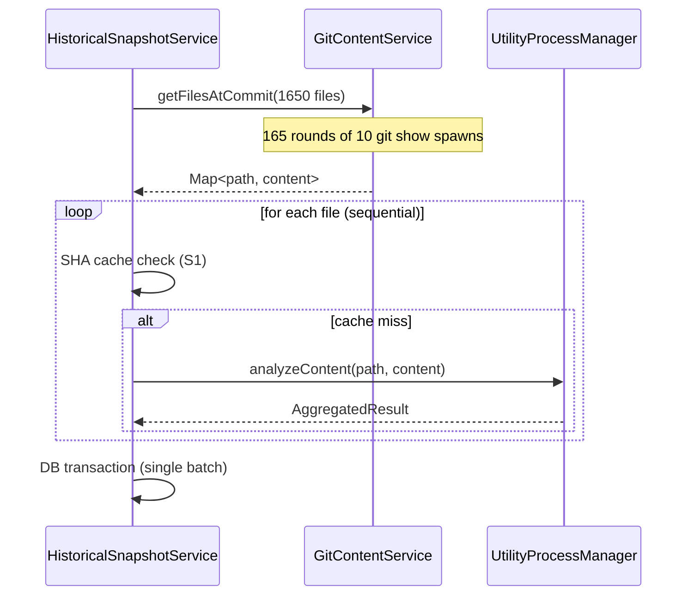
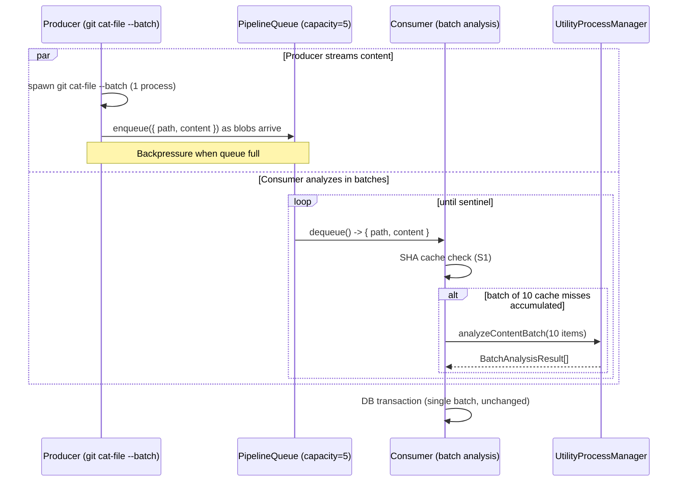
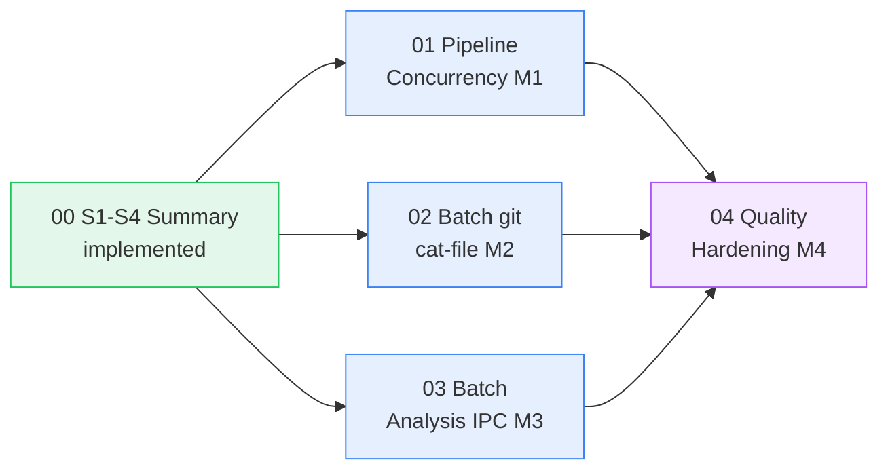

# Round Six Overview: Backfill Pipeline Performance

## Executive Summary

Round Six is a focused performance round. Where Round Four built the temporal foundation — backfill,
velocity, trend projections, and the commit browser — and Round Five layered composable intelligence
and monetization on top, Round Six answers the question of _how fast can the backfill pipeline run?_

Four targeted optimizations (S1-S4) shipped in the prior cycle and eliminated three categories of
redundant work: duplicate analysis via content-SHA deduplication, redundant `git ls-tree -r`
enumeration, and double `git diff-tree` invocations. Round Six continues that trajectory with three
infrastructure milestones that attack the remaining bottlenecks: sequential I/O-then-compute
scheduling, per-file process spawning, and per-file IPC overhead.

A fourth milestone addresses the code quality debt accumulated across S1-S4 and M1-M3: method
extraction, memory safety, test coverage gaps, and crash-window elimination.

Three pillars drive this round. **Pipeline Concurrency** (M1) overlaps git I/O with analysis via a
bounded producer-consumer queue. **Batch I/O** (M2) replaces 1,650 `git show` spawns with a single
`git cat-file --batch` process. **Batch IPC** (M3) amortizes utility-process message overhead by
sending 10-20 files per round-trip instead of one. **Quality Hardening** (M4) extracts duplicated
analysis loops, caps unbounded caches, closes test gaps, and hardens crash windows.

Collectively, M1-M3 target a 30-50% reduction in total backfill time for a first-commit snapshot of
~1,650 files. M4 reduces `createIncrementalSnapshot` cyclomatic complexity from 14 to ~8 and closes
all high-priority test gaps identified in the S1-S4 audit.

## Feature Pillar Table

| Pillar               | Milestones | Key Capability                                               | Agent Owner                                    |
| -------------------- | ---------- | ------------------------------------------------------------ | ---------------------------------------------- |
| Pipeline Concurrency | M1         | Producer-consumer queue overlapping git I/O with analysis    | typescript-engineer, electron-desktop-engineer |
| Batch I/O            | M2         | Single `git cat-file --batch` process for all file retrieval | typescript-engineer, electron-desktop-engineer |
| Batch IPC            | M3         | Multi-file analysis messages to the utility process          | typescript-engineer, electron-desktop-engineer |
| Quality Hardening    | M4         | Refactoring, memory safety, test coverage, crash safety      | refactoring-engineer, vitest-engineer          |

## Milestone Inventory

| ID    | Title                             | Category             | Phase Doc                       | Status      |
| ----- | --------------------------------- | -------------------- | ------------------------------- | ----------- |
| R6-S0 | S1-S4 Implementation Summary      | Audit                | 00-s1-s4-implementation-summary | implemented |
| R6-M1 | Pipeline Content Retrieval        | Pipeline Concurrency | 01-pipeline-content-retrieval   | planned     |
| R6-M2 | Batch git cat-file                | Batch I/O            | 02-batch-git-cat-file           | planned     |
| R6-M3 | Batch Analysis IPC                | Batch IPC            | 03-batch-analysis-ipc           | planned     |
| R6-M4 | Quality Hardening & Test Coverage | Quality Hardening    | 04-quality-hardening            | planned     |

## Performance Budget

Baseline: first-commit full snapshot of ~1,650 JS/TS files on macOS, measured end-to-end from
`createSnapshotForCommit` entry to DB transaction commit.

| Milestone | Optimization                                | Estimated Reduction | Mechanism                                       |
| --------- | ------------------------------------------- | ------------------- | ----------------------------------------------- |
| M1        | Overlap git I/O with analysis               | 15-30%              | Producer-consumer pipeline eliminates idle gaps |
| M2        | Single process spawn for all file retrieval | 8-25 sec saved      | 1 `git cat-file --batch` vs 1,650 `git show`    |
| M3        | Batch IPC messages (10 files/message)       | 5-10%               | 165 round-trips vs 1,650                        |
| Combined  | M1 + M2 + M3                                | 30-50%              | Concurrent, batched, amortized                  |

## Data Flow: Before and After

### Before (S1-S4 baseline)

### After (M1 + M2 + M3)

## Critical Path Dependency Diagram

M1, M2, and M3 are independent of each other and can be implemented in parallel. M4 depends on all
three because it refactors the code paths that M1-M3 modify.

## Scope Boundaries

| In Round Six                                                | Deferred to Future                                        |
| ----------------------------------------------------------- | --------------------------------------------------------- |
| Producer-consumer pipeline for content retrieval + analysis | Parallel analysis across multiple utility processes       |
| `git cat-file --batch` for bulk content retrieval           | Persistent `git cat-file` process pooling across commits  |
| Batch IPC messages (10-20 files per message)                | Streaming IPC (continuous file-by-file without batching)  |
| Analysis loop extraction and deduplication                  | Full decomposition of `createIncrementalSnapshot`         |
| LRU / size cap on in-memory analysis cache                  | Disk-backed analysis cache with cross-session persistence |
| Test coverage for S1 cache hits and S3 fast path            | Full mutation testing of the backfill pipeline            |
| Single-transaction file-count correction                    | WAL-mode SQLite for concurrent read/write during backfill |

## Phase Verification Checklist

| Milestone                    | Green-Light Criteria                                                                                                                                                                                                                                                     |
| ---------------------------- | ------------------------------------------------------------------------------------------------------------------------------------------------------------------------------------------------------------------------------------------------------------------------ |
| 01 Pipeline Concurrency (M1) | `PipelineQueue` blocks producer at capacity and yields null after `done()`; git I/O overlaps with analysis (verified by timestamp instrumentation); all `onProgress` callbacks fire in correct order; DB writes unchanged                                                |
| 02 Batch git cat-file (M2)   | `GitCatFileBatch.fetch` spawns exactly one process regardless of file count; result Map identical to per-file `git show` baseline; missing blobs absent from Map; no zombie processes after `destroy()`                                                                  |
| 03 Batch Analysis IPC (M3)   | Worker handles `analyzeContentBatch` and returns one result per item; per-item errors do not abort the batch; `UtilityProcessManager.analyzeContentBatch` maps results by index; existing single-file `analyzeContent` unchanged                                         |
| 04 Quality Hardening (M4)    | `createIncrementalSnapshot` cyclomatic complexity <= 8; `analysisCache` capped at configurable threshold; corrupted `plugin_results` logged before fallback; S1 cache hit and S3 `changedFiles` paths have dedicated tests; `file_count` UPDATE inside final transaction |
