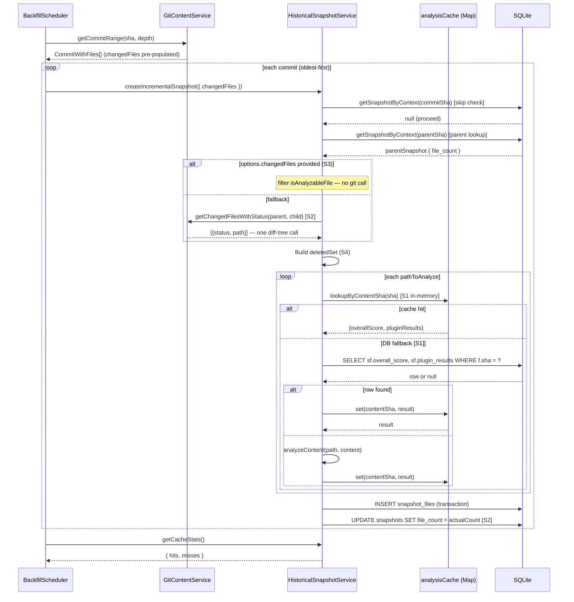

# S1-S4 Backfill Performance: Implementation Summary & Complexity Audit

## Executive Summary

Four targeted performance improvements were applied to the backfill pipeline in `HistoricalSnapshotService` and `GitContentService`. Collectively they eliminate three categories of redundant work that scaled linearly with commit count: duplicate file analysis across commits with identical content, a full repository tree enumeration (`git ls-tree -r`) on every incremental snapshot, and an extra `git diff-tree` invocation that `getCommitRange` had already performed. A fourth change converts a linear deleted-file scan to a constant-time `Set` lookup.

Estimated impact on a 500-commit backfill against a 200-file TypeScript repository:

| Metric                       | Before                                                    | After (estimated)       |
| ---------------------------- | --------------------------------------------------------- | ----------------------- |
| `analyzeContent` calls       | up to N x M                                               | M x unique-content-SHAs |
| `git ls-tree -r` invocations | 1 per incremental snapshot                                | 0 (eliminated)          |
| `git diff-tree` invocations  | 2 per commit (getCommitRange + createIncrementalSnapshot) | 1 per commit            |
| Deleted-file lookup          | O(D) per changed file                                     | O(1) per changed file   |

N = commit count, M = files per commit, D = deleted file count.

The changes touch two files with medium-to-high existing complexity. Post-implementation, `createIncrementalSnapshot` is the method most in need of attention — it has grown to approximately 190 lines with a cyclomatic complexity of 14.

---

## Architecture: New Data Flow



---

## Per-Improvement Breakdown

### S1: Content-SHA Analysis Deduplication

**Before:** Every file at every commit was sent to `analyzeContent()` regardless of whether its content had been seen in a prior commit.

**After:** A `Map<string, {overallScore, pluginResults}>` keyed on `sha256(content)` is checked before each `analyzeContent()` call. If the content SHA is absent from the in-memory map, a DB fallback query searches `files JOIN snapshot_files` for any previously stored result. Both `createSnapshotForCommit` and `createIncrementalSnapshot` participate.

**New method — `lookupByContentSha`:**

- Cyclomatic complexity: **3** (two early-return branches, one JSON parse that can throw)
- The `try/catch` around `JSON.parse` silently returns `null` on parse failure — this is intentional defensive behavior but loses information (see Edge Cases)
- Cache is never evicted; grows for the lifetime of the backfill run

**New telemetry methods (`resetCacheCounters`, `getCacheStats`):** Complexity 1 each. Pure accessors, no risk.

---

### S2: Eliminate Redundant git ls-tree

**Before:** `createIncrementalSnapshot` called `getTrackedFilesAtCommit()` (which runs `git ls-tree -r`) to obtain the full file list, then subtracted changed paths to derive carry-over candidates. On a 10,000-file repository this enumerates the entire tree on every commit.

**After:** A new method `getChangedFilesWithStatus()` replaces `getChangedFilesBetweenCommits()` for the incremental path. It uses `--name-status` instead of `--name-only`, returning `{status, path}` pairs. File count is derived from `parentSnapshot.file_count` and corrected at the end: `actualFileCount = filesCarriedOver + filesAnalyzed`.

**New method — `getChangedFilesWithStatus`:**

- Cyclomatic complexity: **4** (try/catch, empty-line filter, tab-index check returning null, `.filter` type-guard)
- The `status.charAt(0)` normalization correctly handles `R100`, `C080`, etc. (git similarity percentages)
- No additional validation of the `path` segment from the git output — paths come from a controlled git subprocess and are not user-supplied, so this is acceptable

**`createIncrementalSnapshot` changes:**

The file-count correction logic at lines 778-783 updates the `snapshots` row only when `actualFileCount !== parentFileCount`. This is correct but creates a two-phase write: a placeholder `INSERT` with `parentFileCount`, then a conditional `UPDATE`. If the process crashes between these two operations, the snapshot row persists with an incorrect `file_count`. The `span.assert('file-count-matches')` at the end provides post-hoc detection but not prevention.

---

### S3: Pass Pre-fetched Changed Files

**Before:** `BackfillScheduler.processBackfill` had `getCommitRange` populate `commit.changedFiles` but then `createIncrementalSnapshot` ignored that data and called `getChangedFilesBetweenCommits` again internally.

**After:** `HistoricalSnapshotOptions` gains `changedFiles?: string[] | undefined`. The scheduler passes `commit.changedFiles` when it is non-empty; the service branches at the top of the changed-files resolution block:

```typescript
if (options.changedFiles) {
  changedJsPaths = options.changedFiles.filter(isAnalyzableFile);
  deletedJsPaths = [];
} else {
  // fallback: getChangedFilesWithStatus(...)
}
```

**Risk:** When `changedFiles` is provided via S3, `deletedJsPaths` is hard-coded to `[]`. This means deleted files from a pre-fetched list are not excluded from the carry-over SQL query. The carry-over excludes all paths in `changedJsPaths` (which includes deleted ones from the pre-fetched list), so deleted files are correctly excluded from the new snapshot in practice. However, `deletedSet` will be an empty `Set`, and `pathsToAnalyze` will include the deleted path. When `getFilesAtCommit` is called for a deleted path, `git show commitSha:./deletedFile` returns null, so `filesSkipped` increments and no row is written. The outcome is correct but the path is analyzed unnecessarily (fetching null content from git rather than skipping immediately). See Edge Cases for the full analysis.

---

### S4: Set for O(1) Lookups

**Before:** Deleted path exclusion used `Array.includes()` — O(D) per lookup, where D is the number of deleted files.

**After:** `const deletedSet = new Set(deletedJsPaths)` is built once; `pathsToAnalyze = changedJsPaths.filter(p => !deletedSet.has(p))`.

Complexity: **1**. Straightforward and correct. Only applies to the non-S3 code path since `deletedJsPaths = []` when `changedFiles` is pre-supplied (see S3 risk above).

---

## Complexity Analysis Table

Method counts are measured from the current implementation. Cyclomatic complexity is estimated by counting decision points (if/else, ternary, &&/||, for, while, catch) plus 1.

| Method                      | File                           | Lines       | Cyclomatic (est.) | Cognitive (est.) | Notes                                       |
| --------------------------- | ------------------------------ | ----------- | ----------------- | ---------------- | ------------------------------------------- |
| `lookupByContentSha`        | historical-snapshot-service.ts | 34          | 3                 | 4                | DB fallback + JSON parse guard              |
| `resetCacheCounters`        | historical-snapshot-service.ts | 3           | 1                 | 1                | Trivial                                     |
| `getCacheStats`             | historical-snapshot-service.ts | 3           | 1                 | 1                | Trivial                                     |
| `getChangedFilesWithStatus` | git-content-service.ts         | 31          | 4                 | 5                | Pipeline transform; tab-split + null filter |
| `createSnapshotForCommit`   | historical-snapshot-service.ts | ~110 (body) | 12                | 16               | Pre-existing; S1 adds 1 branch              |
| `createIncrementalSnapshot` | historical-snapshot-service.ts | ~190 (body) | 14                | 22               | High — S2/S3 branching added                |
| `processBackfill`           | backfill-scheduler.ts          | ~135 (body) | 11                | 15               | S3 adds one ternary at call site            |

### Threshold Assessment

Industry-standard thresholds: cyclomatic > 10 warrants review; > 15 requires refactoring. Cognitive complexity > 15 is considered high.

`createIncrementalSnapshot` (cyclomatic 14, cognitive 22) crosses both the review threshold on cyclomatic and the high threshold on cognitive complexity. It is the primary refactoring candidate.

---

## Edge Cases and Risk Matrix

| #   | Scenario                                                          | Current Behavior                                                                                                                                                                                                                                                                 | Risk                                                                                                                                                                                                           | Severity |
| --- | ----------------------------------------------------------------- | -------------------------------------------------------------------------------------------------------------------------------------------------------------------------------------------------------------------------------------------------------------------------------- | -------------------------------------------------------------------------------------------------------------------------------------------------------------------------------------------------------------- | -------- |
| E1  | `parentSnapshot.file_count` is `null`                             | `parentFileCount = parentSnapshot.file_count ?? 0` → treated as 0                                                                                                                                                                                                                | If parent has no tracked files, snapshot is created with `file_count = 0` as placeholder and then corrected post-analysis. Functionally correct but the placeholder 0 persists if the process crashes mid-run. | Low      |
| E2  | All changed files are deleted                                     | `pathsToAnalyze` is empty; `filesCarriedOver` will equal `parentFileCount - deletedCount`. `actualFileCount` is computed correctly. `parentFileCount === 0 && pathsToAnalyze.length === 0` guard only skips when parent was also empty — not triggered here.                     | Correct behavior, no issue.                                                                                                                                                                                    | None     |
| E3  | In-memory `analysisCache` grows unbounded                         | `Map` grows for the full lifetime of a backfill run. At ~1KB per entry (overallScore + serialized pluginResults), 50,000 unique file versions = ~50 MB. No eviction policy.                                                                                                      | Potential memory pressure on large mono-repos with many unique file versions.                                                                                                                                  | Medium   |
| E4  | DB cache lookup returns corrupted `plugin_results` JSON           | `JSON.parse` throws → caught silently → returns `null` → `analysisCacheMisses++` → falls through to `analyzeContent()`. Functionally recovers, but the corruption is not logged.                                                                                                 | Silent data issue; hard to diagnose in production.                                                                                                                                                             | Medium   |
| E5  | S3 pre-fetched list includes deleted files                        | `deletedJsPaths = []`; deleted path appears in `pathsToAnalyze`. `getFilesAtCommit` calls `git show commitSha:./deletedPath` which returns null. `filesSkipped++`. No row written. Carry-over SQL already excludes the path via `changedJsPaths`. Final `file_count` is correct. | One extra git subprocess call per deleted file when using S3 path. Performance cost only, correctness preserved.                                                                                               | Low      |
| E6  | `createSnapshotSafe` INSERT then crash before `file_count` UPDATE | Snapshot row persists with `parentFileCount` as `file_count`. `upsertCommitMetrics` counts `snapshot_files` rows independently so metrics are correct. `span.assert('file-count-matches')` would have caught this if reached.                                                    | Stale `file_count` on snapshot record. Resuming backfill would skip this snapshot (snapshot exists, `commit_files` may be populated).                                                                          | Low      |
| E7  | `getChangedFilesWithStatus` output contains a line without a tab  | `tabIdx === -1` → returns `null` → filtered out by the type-guard. The file is silently omitted from the changed-files list and treated as unchanged (carried over from parent).                                                                                                 | Incorrect carry-over for a genuinely modified file if git output format changes.                                                                                                                               | Low      |
| E8  | Genesis commit (no parent) passed to `createIncrementalSnapshot`  | `parentSha = commit.sha` (self-reference in scheduler). `getSnapshotByContext(commit.sha, 'commit', null)` returns null (no prior snapshot). Falls through to `createSnapshotForCommit`.                                                                                         | Correct fallback, tested by existing tests.                                                                                                                                                                    | None     |

---

## Test Coverage Analysis

### `git-content-service.test.ts` — `getChangedFilesWithStatus`

Six tests covering the new method:

| Test                                              | Scenario Covered                                    |
| ------------------------------------------------- | --------------------------------------------------- |
| Returns files with status codes (M/A/D)           | Happy path with three status types                  |
| Returns empty array when no files changed         | Empty git output                                    |
| Handles rename status (R prefix)                  | `R100\tsrc/renamed.ts` → `{status: 'R', path: ...}` |
| Passes correct git arguments with `--name-status` | Command construction                                |
| Returns empty array on error                      | `execFile` rejection                                |
| Validates both SHAs                               | Input validation                                    |

**Gap:** No test for a line missing the tab separator (E7). No test for copy status (`C080`) to confirm it reduces to `C`.

### `historical-snapshot-service.test.ts`

| Test                                                                  | Scenario Covered                              |
| --------------------------------------------------------------------- | --------------------------------------------- |
| Only calls analyzeContent for changed files                           | S2/S3 integration: 2 of 10 changed            |
| Carry-over produces correct row count                                 | `filesCarriedOver = 8`                        |
| Skips when `skipIfExists=true` and snapshot exists                    | Early-return path                             |
| Falls back to full snapshot when parent missing                       | `createSnapshotForCommit` delegation          |
| Skips deleted files that appear in changedPaths                       | S2 + S4: `status: 'D'` excluded from analysis |
| `createSnapshotForCommit`: calls analyzeContent for all tracked files | Full snapshot path                            |
| Reports progress via `onProgress` callback                            | Progress reporting                            |
| Continues when `analyzeContent` throws                                | Error isolation                               |
| Filters non-analyzable files                                          | `isAnalyzableFile` predicate                  |
| Returns early when no analyzable files                                | Empty repo edge case                          |

**Gaps:**

| Gap                                               | Risk Level | Description                                                                                                                                                    |
| ------------------------------------------------- | ---------- | -------------------------------------------------------------------------------------------------------------------------------------------------------------- |
| S1 cache hit not tested                           | Medium     | No test verifies that `analyzeContent` is skipped when `lookupByContentSha` returns a hit. The in-memory cache and DB fallback both go untested.               |
| S3 `changedFiles` option not tested               | Medium     | No test passes `changedFiles` to `createIncrementalSnapshot` to exercise the S3 fast path. The scheduler-level integration is not covered by unit tests.       |
| `lookupByContentSha` DB fallback not tested       | Medium     | The DB-level fallback in `lookupByContentSha` is private and not exercised by any current test. The `try/catch` JSON parse failure path (E4) is also untested. |
| `getCacheStats` / `resetCacheCounters` not tested | Low        | Telemetry methods have no assertions.                                                                                                                          |
| Corrupted `plugin_results` JSON (E4)              | Medium     | The silent catch-and-return-null behavior in `lookupByContentSha` is not asserted.                                                                             |
| `parentSnapshot.file_count = null` (E1)           | Low        | The `?? 0` coercion is not exercised in any test.                                                                                                              |
| All-deleted-files commit                          | Low        | No test for a commit where every changed file has `status: 'D'`.                                                                                               |

---

## Recommendations for Improvement

### R1 — Extract analysis loop from `createIncrementalSnapshot` (Priority: High)

The per-file analysis loop (lines 622–680) is a near-duplicate of the equivalent loop in `createSnapshotForCommit` (lines 237–284). Both loops: fetch content, compute content SHA, check cache, call `analyzeContent`, handle errors, push results. Extract to a private `analyzeFileList(paths, commitSha, onProgress, baseCount)` method returning the same `changedResults` array. This reduces both methods' cyclomatic complexity by approximately 6 and eliminates the duplication.

### R2 — Log corrupted `plugin_results` in `lookupByContentSha` (Priority: Medium)

The current `catch` block returns `null` silently. Add a `logger.warn` call with the `contentSha` and the raw error before returning null. This makes E4 diagnosable in production without changing behavior:

```typescript
} catch (err) {
  logger.warn('Failed to parse cached plugin_results, re-analyzing', {
    contentSha,
    error: err instanceof Error ? err.message : String(err),
  });
  return null;
}
```

### R3 — Add LRU or size cap to `analysisCache` (Priority: Medium)

The `Map` is unbounded for the lifetime of the backfill run. A simple cap — clear the cache when it exceeds a configurable threshold (e.g., 10,000 entries) — prevents OOM on very large repositories. An LRU eviction policy would be more precise but adds dependency complexity.

### R4 — Propagate deleted-file awareness through S3 path (Priority: Low)

When `options.changedFiles` is provided, deleted files appear in `pathsToAnalyze` because `deletedJsPaths = []`. The scheduler could resolve this by passing a separate `options.deletedFiles` or by switching `changedFiles` from `string[]` to `Array<{status: string; path: string}>` (the same shape as `getChangedFilesWithStatus`). Alternatively, the scheduler could pre-filter deleted files before passing `changedFiles`. The current behavior is functionally correct (extra null-content lookups) but wastes one git subprocess per deleted file.

### R5 — Add tests for S1 cache hit and S3 `changedFiles` path (Priority: High)

Two unit test cases cover the highest-severity test gaps:

1. Verify `analyzeContent` is not called when `lookupByContentSha` returns a cached result. Requires either making `analysisCache` package-visible for seeding, or calling `createSnapshotForCommit` twice with the same files (second call hits cache).
2. Verify that passing `changedFiles: ['src/modified.ts']` to `createIncrementalSnapshot` causes `getChangedFilesWithStatus` to not be called and that only `src/modified.ts` is analyzed.

### R6 — Protect the two-phase `file_count` write with a single transaction (Priority: Low)

Move the `UPDATE snapshots SET file_count` (lines 779-783) inside the final `txManager.transaction` that writes metrics, eliminating the crash window between INSERT and UPDATE (E6). This makes the file count correction atomic with the distribution update.

---

## Acceptance Criteria Checklist for QA

### Functional Correctness

- [ ] A backfill run on a repository with repeated unchanged files produces identical snapshot scores to a full re-analysis baseline
- [ ] A commit that deletes all tracked TypeScript files results in `filesAnalyzed = 0`, `filesCarriedOver = 0`, and `wasSkipped = false` (not skipped — snapshot records the empty state)
- [ ] A genesis commit (no parents) falls back to `createSnapshotForCommit` and does not error
- [ ] A backfill interrupted mid-run and resumed from the DB produces the same final `commit_metrics` as a clean run

### Performance

- [ ] On a 100-commit, 50-file repository where 80% of commits touch fewer than 5 files, `analysisCacheHits` logged at job completion is greater than `analysisCacheMisses`
- [ ] The `git ls-tree -r` command does not appear in process traces during incremental snapshot creation
- [ ] `getChangedFilesWithStatus` is called at most once per commit when `changedFiles` is not pre-supplied, and zero times when it is

### Telemetry

- [ ] `getCacheStats()` at job completion returns `{ hits: N, misses: M }` where N + M equals the total number of files processed across all commits
- [ ] `resetCacheCounters()` is called at the start of each new backfill job and returns `{ hits: 0, misses: 0 }` immediately after

### Error Isolation

- [ ] A corrupted `plugin_results` value in the DB does not abort the backfill — the affected file is re-analyzed
- [ ] A file that is null (deleted or missing) at a given commit increments `filesSkipped` and does not abort the commit

### Edge Cases

- [ ] A commit where `changedFiles` is an empty array (no changes) correctly carries over all parent files
- [ ] A commit where every changed file is deleted produces `actualFileCount = parentFileCount - deletedCount`
- [ ] Two commits that modify the same file to the same content (e.g., revert) result in exactly one `analyzeContent` call for that file's content SHA
