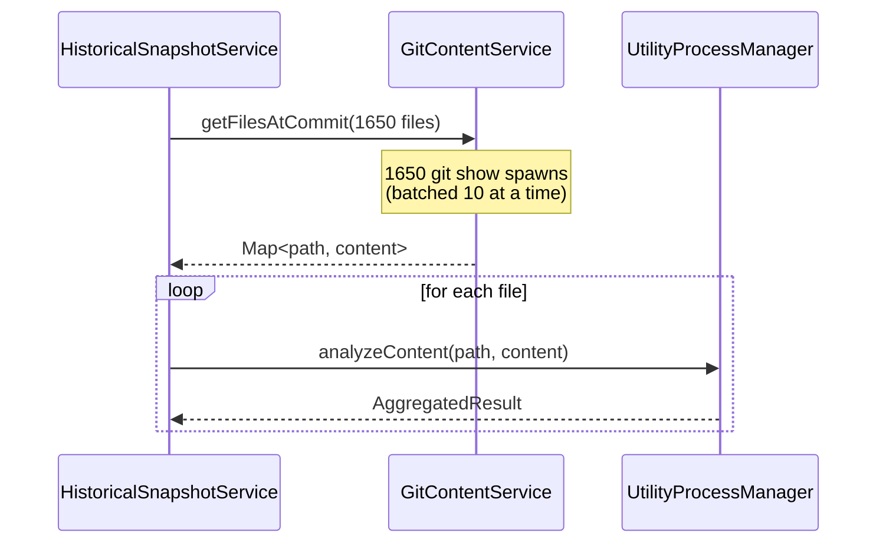
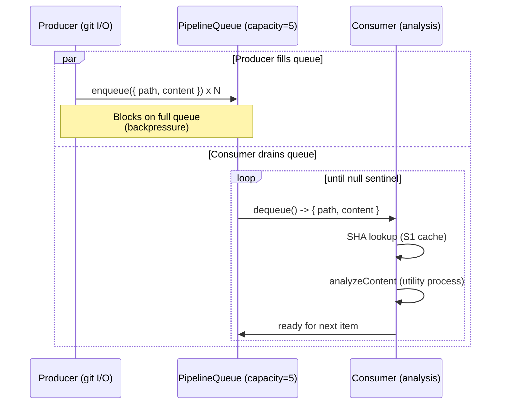

# Pipeline Content Retrieval and Analysis (M1)

## Problem Statement

In both `createSnapshotForCommit` and `createIncrementalSnapshot`, content retrieval (git I/O) and
analysis (CPU-bound) are strictly sequential. The current execution model is:

1. Fetch all file content for the commit via `getFilesAtCommit` (blocks on git I/O for all N files)
2. Analyze files one by one through `analyzeContent` (utility process, CPU-bound)

The utility process idles during step 1 while git is running. Git idles during step 2 while the
utility process is analyzing. For a first commit with ~1,650 JS/TS files, this means hundreds of
milliseconds of wasted idle time on each side of the boundary.

The fix is a producer-consumer pipeline: git content retrieval begins producing file content into a
bounded queue while the utility process concurrently consumes from that queue for analysis. The two
stages overlap, eliminating the idle gap.

Expected impact: 15-30% reduction in total backfill time. Risk: medium (concurrency inside an
otherwise sequential flow requires careful ordering for progress callbacks and DB writes).

## New Files

| File                                                  | Role                                                                                                                                              |
| ----------------------------------------------------- | ------------------------------------------------------------------------------------------------------------------------------------------------- |
| `clients/desktop/src/main/analysis/pipeline-queue.ts` | Bounded async queue used to decouple the producer (git I/O) from the consumer (analysis). Provides `enqueue`, `dequeue`, and a `done()` sentinel. |

## Modified Files

| File                                                               | Changes                                                                                                                                                                        |
| ------------------------------------------------------------------ | ------------------------------------------------------------------------------------------------------------------------------------------------------------------------------ |
| `clients/desktop/src/main/analysis/historical-snapshot-service.ts` | Replace the two-phase sequential fetch-then-analyze loop in `createSnapshotForCommit` and `createIncrementalSnapshot` with a producer-consumer pipeline using `PipelineQueue`. |

## Types and Interfaces

### `PipelineQueue<T>`

Add to `clients/desktop/src/main/analysis/pipeline-queue.ts`:

```typescript
/**
 * Bounded async FIFO queue for producer-consumer pipelines.
 *
 * The producer calls enqueue() and signals completion with done().
 * The consumer calls dequeue() in a loop until it receives null (the sentinel).
 *
 * Backpressure: enqueue() blocks when the queue is at capacity, so the producer
 * cannot run arbitrarily far ahead of the consumer.
 */
export class PipelineQueue<T> {
  private readonly buffer: Array<T | null> = [];
  private readonly capacity: number;
  private waitingProducer: (() => void) | null = null;
  private waitingConsumer: (() => void) | null = null;
  private closed = false;

  constructor(capacity: number) {
    this.capacity = capacity;
  }

  /**
   * Enqueue an item. Blocks (suspends) if the queue is full until the consumer
   * has dequeued at least one item.
   */
  async enqueue(item: T): Promise<void> { ... }

  /**
   * Signal that the producer has finished. Inserts the null sentinel, which
   * causes dequeue() to return null on the consumer side.
   */
  async done(): Promise<void> { ... }

  /**
   * Dequeue the next item. Returns null when the producer has called done()
   * and the queue is drained.
   */
  async dequeue(): Promise<T | null> { ... }
}
```

### Queue Item Type

```typescript
/** An item flowing through the analysis pipeline. */
interface PipelineItem {
  /** Repo-relative file path. */
  path: string;
  /** Raw UTF-8 content from git, or null if the file was not found at this commit. */
  content: string | null;
}
```

## Implementation Details

### Current Sequential Flow



### Proposed Pipelined Flow



### Producer Implementation

The producer replaces the `getFilesAtCommit` bulk call. It iterates over the file list, fetches
each file individually (or in small parallel groups — matching the existing chunk-of-10 pattern in
`getFilesAtCommit`), and enqueues results as they arrive:

```typescript
async function runProducer(
  paths: string[],
  commitSha: string,
  gitContent: GitContentService,
  queue: PipelineQueue<PipelineItem>
): Promise<void> {
  const chunks = chunk(paths, 10);
  for (const batch of chunks) {
    const settled = await Promise.allSettled(
      batch.map(async path => {
        const content = await gitContent.getFileAtCommit(path, commitSha);
        return { path, content };
      })
    );
    for (const outcome of settled) {
      if (outcome.status === 'fulfilled') {
        await queue.enqueue(outcome.value);
      } else {
        // Treat rejected fetches as null content — consumer skips them.
        // (This matches current behavior in getFilesAtCommit.)
        await queue.enqueue({ path: '', content: null });
      }
    }
  }
  await queue.done();
}
```

### Consumer Implementation

The consumer replaces the sequential `for` loop in each snapshot method:

```typescript
async function runConsumer(
  queue: PipelineQueue<PipelineItem>,
  jsFiles: string[],
  utilityManager: UtilityProcessManager,
  analysisCache: Map<string, CachedAnalysis>,
  onProgress?: ProgressCallback
): Promise<FileResult[]> {
  const results: FileResult[] = [];
  let processed = 0;

  while (true) {
    const item = await queue.dequeue();
    if (item === null) break; // Sentinel: producer finished

    const { path, content } = item;
    if (content === null) {
      results.push({ path, result: null, overallScore: null, contentSha: null });
      continue;
    }

    const contentSha = createHash('sha256').update(content).digest('hex');

    // S1: Check content-SHA cache before sending to utility process.
    const cached = lookupByContentSha(contentSha);
    if (cached) {
      analysisCacheHits++;
      processed++;
      onProgress?.(processed, jsFiles.length, path);
      results.push({ path, result: cached, overallScore: cached.overallScore, contentSha });
      continue;
    }

    analysisCacheMisses++;
    try {
      const result = await utilityManager.analyzeContent(path, content);
      const overallScore = aggregateFileScore(...);
      processed++;
      onProgress?.(processed, jsFiles.length, path);
      results.push({ path, result, overallScore, contentSha });
      analysisCache.set(contentSha, { overallScore, pluginResults: result.pluginResults });
    } catch (error) {
      logger.warn('Error analyzing file', { path, error: ... });
      results.push({ path, result: null, overallScore: null, contentSha: null });
    }
  }

  return results;
}
```

### Integration in `createSnapshotForCommit`

Replace lines 224-284 in `historical-snapshot-service.ts` with:

```typescript
// Start producer and consumer concurrently.
const queue = new PipelineQueue<PipelineItem>(5);

const [, fileResults] = await Promise.all([
  runProducer(jsFiles, options.commitSha, this.gitContent, queue),
  runConsumer(queue, jsFiles, this.utilityManager, this.analysisCache, options.onProgress),
]);

// DB write path is unchanged — fileResults are identical in shape to the
// array built by the sequential loop.
```

### Integration in `createIncrementalSnapshot`

The same pattern applies to `pathsToAnalyze` (lines 609-680). The carry-over INSERT runs before
the producer/consumer start, so it is unaffected.

```typescript
const queue = new PipelineQueue<PipelineItem>(5);

const [, changedResults] = await Promise.all([
  runProducer(pathsToAnalyze, options.commitSha, this.gitContent, queue),
  runConsumer(queue, pathsToAnalyze, this.utilityManager, this.analysisCache, (done, total, file) =>
    options.onProgress?.(filesCarriedOver + done, filesCarriedOver + total, file)
  ),
]);
```

## Constraints

### DB Writes Remain Sequential

The `results` / `changedResults` array is collected in full before any DB write begins. The
`txManager.transaction()` call at the end of each method is unchanged. This preserves the
single-transaction guarantee and avoids any concurrent SQLite access.

### Content-SHA Cache Checked Before Queueing Analysis

The S1 content-SHA cache lookup (`lookupByContentSha`) happens inside the consumer, not the
producer. This is correct: the SHA cannot be computed until `content` is available (which the
producer fetches). Checking it in the consumer before calling `analyzeContent` preserves the
deduplication semantics of S1.

### Progress Callbacks Fire in Consumer Order

`onProgress` is called from the consumer, not the producer. Because the consumer processes items
in dequeue order and `PipelineQueue` is a FIFO, progress callbacks fire in the same path order as
the sequential loop. There is no out-of-order progress reporting.

### Error Handling Per File is Preserved

Producer errors (git fetch failures) result in `{ content: null }` items enqueued. Consumer
errors (`analyzeContent` throws) are caught per-item and push `{ result: null }` into `results`.
Both match the existing behavior in the sequential loop.

## Edge Cases

| Scenario                                    | Handling                                                                                                                                                                                                                                |
| ------------------------------------------- | --------------------------------------------------------------------------------------------------------------------------------------------------------------------------------------------------------------------------------------- |
| Queue capacity of 5 with only 3 files total | Producer enqueues all 3 then calls `done()` immediately; consumer drains 3 items then receives null. No deadlock.                                                                                                                       |
| Consumer throws an unhandled error          | `Promise.all` rejects; the producer's `for` loop is abandoned at the next `await queue.enqueue()` call when the consumer's backpressure resolve never fires. The outer `createSnapshotForCommit` catch block handles the rejection.     |
| All files are cache hits (S1)               | Consumer path through the cache is synchronous after `dequeue()`. The utility process receives zero messages. The producer can fill the queue faster than the consumer drains it; backpressure keeps memory bounded.                    |
| Single-file commit (1 changed file)         | Queue of capacity 5 is larger than needed; no performance regression. The producer enqueues 1 item and calls `done()`. The consumer dequeues 1 item and receives null.                                                                  |
| `onProgress` total mismatch                 | In `createIncrementalSnapshot`, the total passed to `onProgress` must be `filesCarriedOver + pathsToAnalyze.length`, not just `pathsToAnalyze.length`. The consumer wrapper function captures `filesCarriedOver` correctly via closure. |

## Testing Strategy

### Unit Tests: `pipeline-queue.test.ts`

```typescript
// clients/desktop/src/main/analysis/pipeline-queue.test.ts

describe('PipelineQueue', () => {
  it('yields items in FIFO order', async () => {
    const q = new PipelineQueue<number>(3);
    await q.enqueue(1);
    await q.enqueue(2);
    await q.done();
    expect(await q.dequeue()).toBe(1);
    expect(await q.dequeue()).toBe(2);
    expect(await q.dequeue()).toBe(null);
  });

  it('blocks the producer when at capacity', async () => {
    const q = new PipelineQueue<number>(2);
    await q.enqueue(1);
    await q.enqueue(2);

    let producerCompleted = false;
    const producerPromise = q.enqueue(3).then(() => {
      producerCompleted = true;
    });

    // Producer should be blocked — capacity is 2, queue has 2 items
    await new Promise(r => setTimeout(r, 10));
    expect(producerCompleted).toBe(false);

    // Consumer dequeues one item — producer unblocks
    await q.dequeue();
    await producerPromise;
    expect(producerCompleted).toBe(true);
  });

  it('returns null sentinel after done() and drain', async () => {
    const q = new PipelineQueue<string>(3);
    await q.enqueue('a');
    await q.done();
    expect(await q.dequeue()).toBe('a');
    expect(await q.dequeue()).toBe(null);
  });
});
```

### Integration Tests: `historical-snapshot-service.test.ts`

Extend the existing test file to assert that:

- `getFileAtCommit` is called the correct number of times (once per file, not via bulk
  `getFilesAtCommit`)
- `analyzeContent` call count matches the number of cache misses
- `onProgress` fires in path order from the file list
- DB write (INSERT into `snapshot_files`) happens only after all analysis is done

## Acceptance Criteria

- [ ] `PipelineQueue` blocks producer when at capacity and unblocks when consumer dequeues
- [ ] `PipelineQueue` yields null after `done()` is called and the buffer is drained
- [ ] `createSnapshotForCommit` overlaps git I/O with analysis (verified by adding timestamps to a
      test and observing git calls beginning before the first `analyzeContent` call completes)
- [ ] `createIncrementalSnapshot` behaves identically for the changed-file analysis phase
- [ ] All `onProgress` callbacks fire with correct `(processed, total, currentFile)` values
- [ ] DB writes are unchanged: single transaction at the end of each method
- [ ] S1 content-SHA cache is checked before every `analyzeContent` call
- [ ] All existing `historical-snapshot-service` tests pass without modification
- [ ] No new `any` types introduced; all pipeline types are explicitly typed
