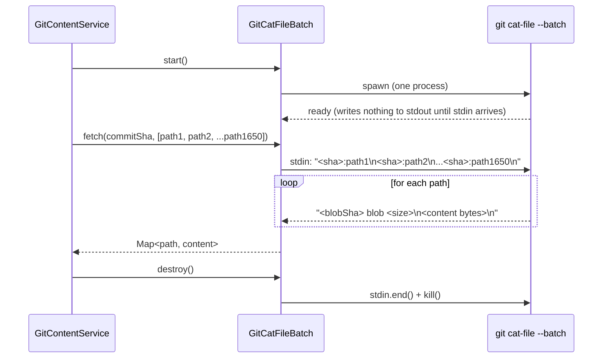

# Batch git cat-file for Content Retrieval (M2)

## Problem Statement

`GitContentService.getFilesAtCommit` retrieves file content by spawning one `git show` child
process per file, batched in groups of 10 concurrent spawns:

```typescript
// Current implementation in git-content-service.ts
async getFilesAtCommit(filePaths: string[], commitSha: string): Promise<Map<string, string>> {
  const chunks = chunk(filePaths, 10);
  for (const batch of chunks) {
    const settled = await Promise.allSettled(
      batch.map(async p => {
        const content = await this.getFileAtCommit(p, commitSha); // one git show per file
        return { path: p, content };
      })
    );
    ...
  }
}
```

For the first commit in a backfill (full snapshot), `jsFiles` contains approximately 1,650
analyzable files, resulting in 1,650 `git show` process spawns. Even in batches of 10, this is 165
serial rounds of process spawning. Process spawn overhead on macOS is ~5-15 ms each; at 1,650
spawns that is 8-25 seconds of overhead that contributes nothing to analysis.

The fix is `git cat-file --batch`: a single long-running git process that accepts blob object
references on stdin and returns binary-safe content on stdout. Writing 1,650 refs to stdin and
reading 1,650 blobs back is a streaming operation with one spawn and no per-file overhead.

Expected impact: reduces first-commit processing from ~165 serial spawn rounds to 1 spawn. Risk:
medium (binary-safe stream parsing requires careful stdout handling).

## New Files

| File                                                 | Role                                                                                                                                |
| ---------------------------------------------------- | ----------------------------------------------------------------------------------------------------------------------------------- |
| `clients/desktop/src/main/git/git-cat-file-batch.ts` | Encapsulates the `git cat-file --batch` process lifecycle: spawn, write refs to stdin, parse blob chunks from stdout, and clean up. |

## Modified Files

| File                                                  | Changes                                                                                                                                                                                                                                                                                            |
| ----------------------------------------------------- | -------------------------------------------------------------------------------------------------------------------------------------------------------------------------------------------------------------------------------------------------------------------------------------------------- |
| `clients/desktop/src/main/git/git-content-service.ts` | Add `getFilesAtCommitBatch(filePaths, commitSha)` method that delegates to `GitCatFileBatch`. Rewrite `getFilesAtCommit` as a thin wrapper that calls `getFilesAtCommitBatch` instead of the per-file `getFileAtCommit` loop. `getFileAtCommit` is unchanged (still used for single-file lookups). |

## Types and Interfaces

### `GitCatFileBatch`

```typescript
// clients/desktop/src/main/git/git-cat-file-batch.ts

/**
 * Wraps a single `git cat-file --batch` process.
 *
 * Usage:
 *   const batch = new GitCatFileBatch(repoPath);
 *   await batch.start();
 *   const results = await batch.fetch(commitSha, filePaths);
 *   batch.destroy();
 */
export class GitCatFileBatch {
  private child: ChildProcess | null = null;

  constructor(private readonly repoPath: string) {}

  /** Spawn the git cat-file --batch process. */
  async start(): Promise<void>;

  /**
   * Fetch blob content for all filePaths at commitSha.
   *
   * Writes `<commitSha>:<path>\n` for each path to stdin.
   * Parses the stdout stream: each blob is preceded by a header line
   * `<sha> blob <size>\n`, followed by exactly <size> bytes, followed by `\n`.
   * Missing objects produce a header of `<ref> missing\n` with no body.
   *
   * Returns a Map<path, content>. Missing files are absent from the map.
   */
  async fetch(commitSha: string, filePaths: string[]): Promise<Map<string, string>>;

  /**
   * Kill the child process and clean up listeners.
   * Safe to call multiple times.
   */
  destroy(): void;
}
```

### `BlobHeader`

Internal type used during stdout parsing:

```typescript
interface BlobHeader {
  ref: string;
  type: 'blob' | 'missing';
  size: number; // 0 for 'missing'
}
```

## Implementation Details

### git cat-file --batch Protocol

The `git cat-file --batch` protocol works as follows:

```
stdin:  <sha>:<path>\n
stdout: <sha> blob <size>\n
        <binary content — exactly <size> bytes>\n
        <next header...>

stdin:  <sha>:<missing-path>\n
stdout: <sha>:<missing-path> missing\n
```

The trailing `\n` after the blob content (not counted in `<size>`) acts as a record separator.

### Sequence Diagram



### Process Spawning

Use `spawn` (not `execFile`) to get access to stdin and stdout as streams:

```typescript
import { spawn } from 'node:child_process';
import type { ChildProcess } from 'node:child_process';

async start(): Promise<void> {
  this.child = spawn('git', ['cat-file', '--batch'], {
    cwd: this.repoPath,
    stdio: ['pipe', 'pipe', 'pipe'],
  });

  // Propagate stderr to logger for diagnostics
  this.child.stderr?.on('data', (chunk: Buffer) => {
    logger.warn('[git cat-file stderr]', chunk.toString());
  });

  // Reject if the process exits unexpectedly before fetch() completes
  this.child.on('exit', (code) => {
    if (code !== 0 && code !== null) {
      logger.error('git cat-file --batch exited with error', { code });
    }
  });
}
```

### Stdin Writing

```typescript
// Write all refs to stdin before reading any stdout.
// git cat-file processes them as a stream — it does not buffer all
// input before producing any output. Refs and responses interleave.
private writeRefs(commitSha: string, filePaths: string[]): void {
  const stdin = this.child!.stdin!;
  for (const filePath of filePaths) {
    validateSha(commitSha);
    validateFilePath(filePath);
    stdin.write(`${commitSha}:./${filePath}\n`);
  }
  stdin.end();
}
```

### Stdout Parsing

The stdout parser must be binary-safe because file content may contain arbitrary bytes. Parse using
a byte accumulator rather than line-splitting:

```typescript
private async parseOutput(
  filePaths: string[],
  commitSha: string
): Promise<Map<string, string>> {
  const result = new Map<string, string>();
  const stdout = this.child!.stdout!;

  // Collect all stdout into a Buffer for simpler parsing.
  // For 1,650 files averaging 5 KB each, this is ~8 MB — well within Node heap limits.
  const chunks: Buffer[] = [];
  for await (const chunk of stdout) {
    chunks.push(chunk as Buffer);
  }
  const raw = Buffer.concat(chunks);

  let offset = 0;
  for (const filePath of filePaths) {
    // Read header line: "<ref> blob <size>\n" or "<ref> missing\n"
    const newline = raw.indexOf('\n', offset);
    if (newline === -1) break;
    const header = raw.subarray(offset, newline).toString('utf8');
    offset = newline + 1;

    if (header.endsWith(' missing') || header.includes('missing')) {
      // File did not exist at this commit — skip
      continue;
    }

    // Parse: "<sha> blob <size>"
    const parts = header.split(' ');
    const size = parseInt(parts[2] ?? '0', 10);
    if (isNaN(size)) {
      logger.warn('Unexpected cat-file header', { header, filePath });
      continue;
    }

    // Read exactly <size> bytes of blob content
    const content = raw.subarray(offset, offset + size).toString('utf8');
    offset += size + 1; // +1 for the trailing \n separator

    result.set(filePath, content);
  }

  return result;
}
```

### Full `fetch()` Method

```typescript
async fetch(commitSha: string, filePaths: string[]): Promise<Map<string, string>> {
  if (!this.child) {
    throw new Error('GitCatFileBatch not started — call start() first');
  }
  if (filePaths.length === 0) {
    return new Map();
  }

  // Write all refs to stdin, then parse stdout.
  // These happen concurrently: git produces output while we are still writing.
  // However, for simplicity and correctness, we write all refs first (stdin.end())
  // then collect all stdout. For 1,650 files this is safe — git buffers output
  // per-object and does not deadlock when stdin is closed before stdout is drained.
  this.writeRefs(commitSha, filePaths);
  return this.parseOutput(filePaths, commitSha);
}
```

### Updated `getFilesAtCommit`

The existing `getFilesAtCommit` in `GitContentService` becomes a thin delegating wrapper:

```typescript
async getFilesAtCommit(filePaths: string[], commitSha: string): Promise<Map<string, string>> {
  validateSha(commitSha);
  if (filePaths.length === 0) return new Map();
  return this.getFilesAtCommitBatch(filePaths, commitSha);
}

async getFilesAtCommitBatch(filePaths: string[], commitSha: string): Promise<Map<string, string>> {
  validateSha(commitSha);
  const batch = new GitCatFileBatch(this.repoPath);
  try {
    await batch.start();
    return await batch.fetch(commitSha, filePaths);
  } finally {
    batch.destroy();
  }
}
```

The `getFileAtCommit` single-file method is unchanged. It continues to use `git show` for
individual lookups (worktree analysis, tag analysis, single-file requests).

### Validation

SHA and path validation must happen before writing to stdin, not after. The existing validation
helpers in `git-content-service.ts` (`validateSha`, `validateFilePath`) are imported and called in
`writeRefs`:

```typescript
const SHA_REGEX = /^[0-9a-f]{7,40}$/i;
const PATH_UNSAFE = /[\0|;&$`<>]/;

function validateSha(sha: string): void {
  if (!SHA_REGEX.test(sha)) {
    throw new Error(`Invalid SHA: "${sha}"`);
  }
}

function validateFilePath(filePath: string): void {
  if (filePath.includes('..') || PATH_UNSAFE.test(filePath)) {
    throw new Error(`Unsafe file path rejected: "${filePath}"`);
  }
}
```

## Edge Cases

| Scenario                                 | Handling                                                                                                                                                                                                                                                                                          |
| ---------------------------------------- | ------------------------------------------------------------------------------------------------------------------------------------------------------------------------------------------------------------------------------------------------------------------------------------------------- | -------------------------------- |
| File deleted at commit (missing blob)    | Header contains `missing`. Parser skips the path. Caller receives no entry for that path in the result Map, matching the current `null`-return behavior of `getFileAtCommit`.                                                                                                                     |
| Binary file content (images, lock files) | These are filtered out by `isAnalyzableFile` in `HistoricalSnapshotService` before `getFilesAtCommit` is called. The batch method never sees them. If they somehow arrive, the `Buffer -> string` conversion is lossy but harmless — the file will fail analysis and be counted in `filesFailed`. |
| Empty `filePaths` array                  | `fetch()` returns an empty Map immediately without writing to stdin. No deadlock.                                                                                                                                                                                                                 |
| git cat-file process exits mid-fetch     | The `parseOutput` `for await` loop throws when the stream ends prematurely. The `finally` block in `getFilesAtCommitBatch` calls `destroy()`. The error propagates to `createSnapshotForCommit`'s outer catch.                                                                                    |
| Path containing spaces                   | `git cat-file --batch` uses `\n` as the delimiter, so spaces in paths are safe. The `validateFilePath` check rejects truly unsafe characters (`\0`, `                                                                                                                                             | `, `;`, etc.) but allows spaces. |
| Very large files (> 10 MB)               | `isAnalyzableFile` includes no size gate. Files > 10 MB are rare in JS/TS repos. Collecting all stdout into a single Buffer is safe for typical repositories. A future improvement could stream-parse.                                                                                            |

## Testing Strategy

### Unit Tests: `git-cat-file-batch.test.ts`

```typescript
// clients/desktop/src/main/git/git-cat-file-batch.test.ts
// Use a real git repository fixture (temp dir initialized with git init).

describe('GitCatFileBatch', () => {
  let repoPath: string;
  let commitSha: string;

  beforeAll(async () => {
    // Create a temporary git repo with known files
    repoPath = await createTempRepo({
      files: {
        'src/index.ts': 'export const x = 1;',
        'src/utils.ts': 'export const y = 2;',
      },
    });
    commitSha = await getHeadSha(repoPath);
  });

  it('retrieves content for multiple files in a single process spawn', async () => {
    const batch = new GitCatFileBatch(repoPath);
    await batch.start();
    const result = await batch.fetch(commitSha, ['src/index.ts', 'src/utils.ts']);
    batch.destroy();

    expect(result.get('src/index.ts')).toBe('export const x = 1;');
    expect(result.get('src/utils.ts')).toBe('export const y = 2;');
  });

  it('omits missing files from the result map', async () => {
    const batch = new GitCatFileBatch(repoPath);
    await batch.start();
    const result = await batch.fetch(commitSha, ['src/index.ts', 'src/does-not-exist.ts']);
    batch.destroy();

    expect(result.has('src/index.ts')).toBe(true);
    expect(result.has('src/does-not-exist.ts')).toBe(false);
  });

  it('returns empty map for empty path list', async () => {
    const batch = new GitCatFileBatch(repoPath);
    await batch.start();
    const result = await batch.fetch(commitSha, []);
    batch.destroy();

    expect(result.size).toBe(0);
  });

  it('rejects invalid SHA before writing to stdin', async () => {
    const batch = new GitCatFileBatch(repoPath);
    await batch.start();
    await expect(batch.fetch('not-a-sha', ['src/index.ts'])).rejects.toThrow('Invalid SHA');
    batch.destroy();
  });
});
```

### Integration: `getFilesAtCommitBatch` in `git-content-service.test.ts`

The existing test file already tests `getFilesAtCommit`. Add assertions that:

- The result Map contains the same entries as the per-file `getFileAtCommit` method
- A single child process is spawned (spy on `child_process.spawn`)
- The method handles 100+ files correctly in a single batch

## Acceptance Criteria

- [ ] `GitCatFileBatch.fetch` spawns exactly one `git cat-file --batch` process regardless of file
      count
- [ ] Result Map is identical to what the previous per-file `git show` loop produced for the same
      inputs
- [ ] Missing blobs (files not present at commit) are absent from the Map — no null values, no
      thrown errors
- [ ] `destroy()` terminates the child process cleanly; no zombie processes remain after `fetch`
      completes
- [ ] `validateSha` and `validateFilePath` are called before any stdin write; invalid inputs throw
      before the child process receives any data
- [ ] `getFilesAtCommit` delegates to `getFilesAtCommitBatch` for all multi-file calls
- [ ] `getFileAtCommit` (single-file, `git show`) is unchanged and continues to pass its existing
      tests
- [ ] No regression in `createSnapshotForCommit` or `createIncrementalSnapshot` output (same DB
      rows produced)
