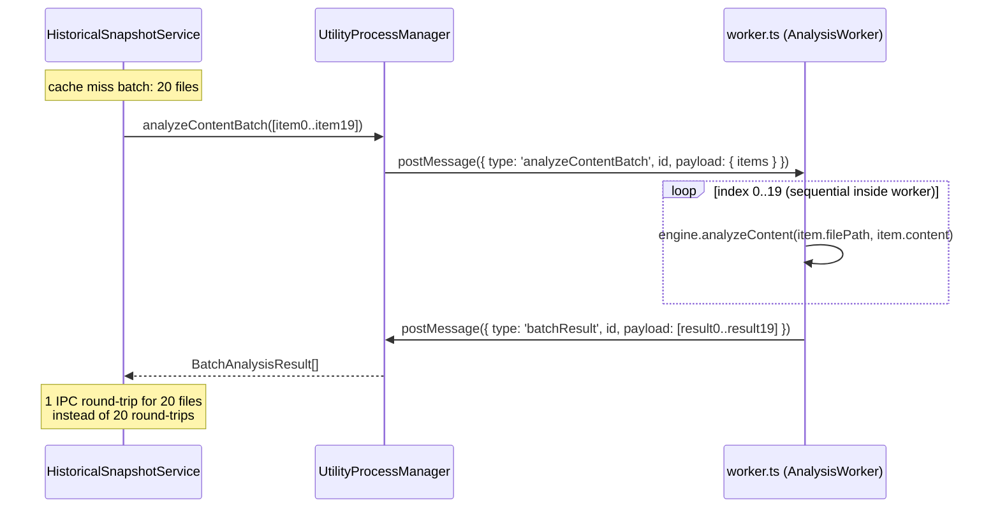

# Batch Analysis IPC (M3)

## Problem Statement

Each file analysis in `HistoricalSnapshotService` is a full IPC round-trip through the Electron
utility process:

1. Main process serializes `{ filePath, content }` to a structured-clone message
2. `UtilityProcessManager.sendMessage` posts the message and registers a pending request by UUID
3. The utility process (`worker.ts`) receives the message, runs `engine.analyzeContent`, serializes
   the result, and posts a response
4. Main process receives the response, validates it with Zod, resolves the pending promise

Each round-trip carries: one UUID generation, two `postMessage` calls, one Zod parse, and the
overhead of the structured-clone serialization of file content. For a first commit with 1,650 files
and a typical cache-miss rate of 30% (~495 files requiring actual analysis), this is 495 full
round-trips — approximately 495 × (IPC overhead ~0.5-2 ms) = 250-990 ms of pure protocol overhead.

The fix is a batch message type `analyzeContentBatch` that sends 10-20 files per IPC message. The
utility worker processes them sequentially inside a single message handler and returns all results
in a single response. The per-file protocol overhead is amortized across the batch.

Expected impact: 5-10% reduction in total backfill time. Risk: medium (partial failure handling and
result mapping must be exact).

## New Files

None. All changes are to existing files.

## Modified Files

| File                                                               | Changes                                                                                                                                                                                         |
| ------------------------------------------------------------------ | ----------------------------------------------------------------------------------------------------------------------------------------------------------------------------------------------- |
| `clients/desktop/src/shared/ipc/schemas.ts`                        | Add `AnalyzeContentBatchMessageSchema` and `AnalyzeContentBatchResponseSchema`. Add to `UtilityProcessMessageSchema` and `UtilityProcessResponseSchema` discriminated unions. Export new types. |
| `clients/desktop/src/utility/worker.ts`                            | Add `analyzeContentBatch` case to the `switch` statement in `handleMessage`. Process items sequentially, collect results, send a single `batchResult` response.                                 |
| `clients/desktop/src/main/analysis/utility-process-manager.ts`     | Add `analyzeContentBatch(items: BatchItem[]): Promise<BatchResult[]>` public method.                                                                                                            |
| `clients/desktop/src/main/analysis/historical-snapshot-service.ts` | Replace `this.utilityManager.analyzeContent(path, content)` calls with `analyzeContentBatch` calls in batches of 10-20, collecting results before processing.                                   |

## Types and Interfaces

### Batch Message Schema (add to `schemas.ts`)

```typescript
// ============================================================================
// Batch Analysis Schemas (M3)
// ============================================================================

export const AnalyzeContentBatchItemSchema = z.object({
  /** Repo-relative file path — used for plugin detection. */
  filePath: z.string().min(1).max(4096),
  /** Full file content as a UTF-8 string from git show / git cat-file. */
  content: z.string(),
});

export const AnalyzeContentBatchMessageSchema = z.object({
  id: z.string().uuid(),
  type: z.literal('analyzeContentBatch'),
  payload: z.object({
    items: z.array(AnalyzeContentBatchItemSchema).min(1).max(50),
  }),
});

export const AnalyzeContentBatchResultItemSchema = z.object({
  /** Index into the original items array — used for result mapping. */
  index: z.number().int().nonnegative(),
  /** Present when analysis succeeded. */
  result: AggregatedResultSchema.optional(),
  /** Present when analysis threw. */
  error: z
    .object({
      message: z.string(),
    })
    .optional(),
});

export const AnalyzeContentBatchResponseSchema = z.object({
  id: z.string().uuid(),
  type: z.literal('batchResult'),
  payload: z.array(AnalyzeContentBatchResultItemSchema),
});

// Add to discriminated unions:
export const UtilityProcessMessageSchema = z.discriminatedUnion('type', [
  AnalyzeMessageSchema,
  AnalyzeContentMessageSchema,
  AnalyzeContentBatchMessageSchema, // NEW
  GetAvailableReportsMessageSchema,
  GetReportsByPluginMessageSchema,
  GetReportTypesMessageSchema,
  GenerateReportMessageSchema,
  ShutdownMessageSchema,
]);

export const UtilityProcessResponseSchema = z.discriminatedUnion('type', [
  ReadyResponseSchema,
  AnalyzeResponseSchema,
  AnalyzeContentBatchResponseSchema, // NEW
  ReportsResponseSchema,
  ReportTypesResponseSchema,
  PresentationResponseSchema,
  ErrorResponseSchema,
  ShutdownAckResponseSchema,
]);

// Type exports
export type AnalyzeContentBatchItem = z.infer<typeof AnalyzeContentBatchItemSchema>;
export type AnalyzeContentBatchMessage = z.infer<typeof AnalyzeContentBatchMessageSchema>;
export type AnalyzeContentBatchResultItem = z.infer<typeof AnalyzeContentBatchResultItemSchema>;
export type AnalyzeContentBatchResponse = z.infer<typeof AnalyzeContentBatchResponseSchema>;
```

### Manager Public Type

```typescript
// In utility-process-manager.ts

export interface BatchAnalysisItem {
  filePath: string;
  content: string;
}

export interface BatchAnalysisResult {
  /** The original filePath from the input item. */
  filePath: string;
  /** The deserialized analysis result, or null if this item failed. */
  result: RuntimeAggregatedResult | null;
  /** Error message if this item failed, null otherwise. */
  error: string | null;
}
```

## Implementation Details

### Flow Overview



### Worker Handler (`worker.ts`)

Add to the `switch` block in `handleMessage`:

```typescript
case 'analyzeContentBatch': {
  const { items } = validMessage.payload;
  logger.debug('Batch analyzing content', { count: items.length });

  const batchResults: Array<{
    index: number;
    result?: SerializedAggregatedResult;
    error?: { message: string };
  }> = [];

  for (let i = 0; i < items.length; i++) {
    const item = items[i]!;
    try {
      const result: RuntimeAggregatedResult = await this.engine.analyzeContent(
        item.filePath,
        item.content
      );
      const serialized: SerializedAggregatedResult = serializeAggregatedResult(result);
      batchResults.push({ index: i, result: serialized });
    } catch (error) {
      const message = error instanceof Error ? error.message : String(error);
      logger.warn('Batch item analysis failed', { filePath: item.filePath, error: message });
      batchResults.push({ index: i, error: { message } });
    }
  }

  this.sendResponse({
    id: validMessage.id,
    type: 'batchResult',
    payload: batchResults,
  });
  break;
}
```

### Manager Method (`utility-process-manager.ts`)

```typescript
/**
 * Analyze a batch of files in a single IPC round-trip.
 * Results are returned in the same order as the input items.
 * Individual item failures do not reject the whole batch — check
 * BatchAnalysisResult.error per item.
 */
async analyzeContentBatch(items: BatchAnalysisItem[]): Promise<BatchAnalysisResult[]> {
  if (items.length === 0) return [];

  const message: Omit<Extract<UtilityProcessMessage, { type: 'analyzeContentBatch' }>, 'id'> = {
    type: 'analyzeContentBatch',
    payload: { items },
  };

  const rawResults = await this.sendMessage<
    Array<{ index: number; result?: SerializedAggregatedResult; error?: { message: string } }>
  >(message);

  // Re-order by index and deserialize
  const ordered = new Array<BatchAnalysisResult>(items.length);
  for (const raw of rawResults) {
    const item = items[raw.index];
    if (!item) continue;

    if (raw.result) {
      ordered[raw.index] = {
        filePath: item.filePath,
        result: deserializeAggregatedResult(raw.result),
        error: null,
      };
    } else {
      ordered[raw.index] = {
        filePath: item.filePath,
        result: null,
        error: raw.error?.message ?? 'Unknown error',
      };
    }
  }

  // Fill any gaps (items not returned by worker — should not happen, but guard defensively)
  for (let i = 0; i < items.length; i++) {
    if (!ordered[i]) {
      ordered[i] = {
        filePath: items[i]!.filePath,
        result: null,
        error: 'No result returned for this item',
      };
    }
  }

  return ordered;
}
```

### Integration in `HistoricalSnapshotService`

Replace the per-file `analyzeContent` call in the analysis loops with a batched call. The batch
size of 10 matches the existing git I/O chunk size, keeping the two stages in rough lockstep when
combined with M1 (pipelining):

```typescript
// In createSnapshotForCommit — replace the per-file loop body:

const BATCH_SIZE = 10;
const cacheMissBatch: Array<{ path: string; content: string }> = [];

// First pass: resolve cache hits, collect misses
for (const path of jsFiles) {
  const content = contentMap.get(path) ?? null;
  if (content === null) {
    filesSkipped++;
    fileResults.push({ path, result: null, overallScore: null, contentSha: null });
    continue;
  }
  const contentSha = createHash('sha256').update(content).digest('hex');
  const cached = this.lookupByContentSha(contentSha);
  if (cached) {
    this.analysisCacheHits++;
    analyzed++;
    options.onProgress?.(analyzed, jsFiles.length, path);
    fileResults.push({ path, result: { pluginResults: cached.pluginResults } as RuntimeAggregatedResult, overallScore: cached.overallScore, contentSha });
  } else {
    this.analysisCacheMisses++;
    cacheMissBatch.push({ path, content, contentSha });
  }
}

// Second pass: analyze cache misses in batches
for (let i = 0; i < cacheMissBatch.length; i += BATCH_SIZE) {
  const batch = cacheMissBatch.slice(i, i + BATCH_SIZE);
  const batchResults = await this.utilityManager.analyzeContentBatch(
    batch.map(b => ({ filePath: b.path, content: b.content }))
  );

  for (let j = 0; j < batch.length; j++) {
    const item = batch[j]!;
    const batchResult = batchResults[j]!;

    if (batchResult.result === null) {
      logger.warn('Error analyzing file', { path: item.path, error: batchResult.error });
      filesFailed++;
      fileResults.push({ path: item.path, result: null, overallScore: null, contentSha: null });
    } else {
      const overallScore = aggregateFileScore(...);
      analyzed++;
      options.onProgress?.(analyzed, jsFiles.length, item.path);
      fileResults.push({ path: item.path, result: batchResult.result, overallScore, contentSha: item.contentSha });
      this.analysisCache.set(item.contentSha, { overallScore, pluginResults: batchResult.result.pluginResults });
    }
  }
}
```

**Note on ordering:** The two-pass approach (cache hits first, then misses in batches) means
`onProgress` fires for cache hits before misses. This is a minor change from the previous strictly
path-ordered progress reporting. If strict path-order progress is required, the cache-miss batch
results must be merged back into the original path order before calling `onProgress`. This is
optional complexity — consider it only if the UI shows the currently-processing filename.

### Backwards Compatibility

The single-file `analyzeContent` method is unchanged. It continues to work for:

- Foreground analysis (`AnalysisCoordinator.analyzeFile`)
- Tag analysis (`createSnapshotForCommit` when called from the tag IPC handler)
- Any future callers

The new `analyzeContentBatch` method is additive. The Zod schema addition to the discriminated
union is backwards-compatible: the old worker would simply not handle the new message type, but
since the worker and main process are built together there is no version skew concern.

## Edge Cases

| Scenario                                           | Handling                                                                                                                                                                                                                                |
| -------------------------------------------------- | --------------------------------------------------------------------------------------------------------------------------------------------------------------------------------------------------------------------------------------- |
| One item in a batch of 10 throws inside the worker | The worker catches the per-item error, pushes `{ index, error }` into `batchResults`, and continues. The manager deserializes the partial failure. The caller receives `null` for that item and increments `filesFailed`.               |
| Worker returns fewer results than items sent       | Manager's gap-fill loop inserts `{ result: null, error: 'No result returned' }` for missing indices. This is a defensive guard — under normal operation the worker always returns exactly one result per item.                          |
| Batch IPC timeout (entire batch times out)         | `sendMessage` rejects with an `IPCError` timeout. The caller's `try/catch` around the `analyzeContentBatch` call catches this and marks all files in the batch as failed. This is the same behavior as the current single-file timeout. |
| Zero cache misses (all hits)                       | `cacheMissBatch` is empty; the second pass loop body never executes. No IPC message is sent.                                                                                                                                            |
| 1,650 cache misses (cold start, first commit)      | 1,650 / 10 = 165 IPC round-trips instead of 1,650. Each carries 10 file contents. Total IPC overhead reduces by ~90%.                                                                                                                   |

## Testing Strategy

### Unit Tests: `worker.ts` batch handler

Add to the worker test suite (or create `worker-batch.test.ts`):

```typescript
describe('analyzeContentBatch handler', () => {
  it('returns one result per input item', async () => {
    const items = [
      { filePath: 'src/a.ts', content: 'export const a = 1;' },
      { filePath: 'src/b.ts', content: 'export const b = 2;' },
    ];
    const response = await sendMessageToWorker({ type: 'analyzeContentBatch', payload: { items } });
    expect(response.payload).toHaveLength(2);
    expect(response.payload[0].index).toBe(0);
    expect(response.payload[1].index).toBe(1);
  });

  it('includes an error entry for items that fail without aborting the batch', async () => {
    const items = [
      { filePath: 'src/valid.ts', content: 'export const x = 1;' },
      { filePath: 'src/invalid.ts', content: 'this is not valid typescript @@@###' },
    ];
    const response = await sendMessageToWorker({ type: 'analyzeContentBatch', payload: { items } });
    expect(response.payload).toHaveLength(2);
    const validResult = response.payload.find((r: { index: number }) => r.index === 0);
    const invalidResult = response.payload.find((r: { index: number }) => r.index === 1);
    expect(validResult?.result).toBeDefined();
    // Invalid TS may succeed with warnings rather than throw; test that both return
    expect(invalidResult).toBeDefined();
  });
});
```

### Unit Tests: `UtilityProcessManager.analyzeContentBatch`

```typescript
describe('analyzeContentBatch', () => {
  it('sends a single analyzeContentBatch IPC message for multiple items', async () => {
    const spy = vi.spyOn(manager as any, 'sendMessage');
    await manager.analyzeContentBatch([
      { filePath: 'a.ts', content: 'const a = 1;' },
      { filePath: 'b.ts', content: 'const b = 2;' },
    ]);
    expect(spy).toHaveBeenCalledOnce();
    expect(spy.mock.calls[0][0].type).toBe('analyzeContentBatch');
  });

  it('maps results back to the correct filePaths', async () => {
    mockSendMessage.mockResolvedValue([
      { index: 1, result: mockSerializedResult },
      { index: 0, result: mockSerializedResult },
    ]);
    const results = await manager.analyzeContentBatch([
      { filePath: 'a.ts', content: '...' },
      { filePath: 'b.ts', content: '...' },
    ]);
    expect(results[0].filePath).toBe('a.ts');
    expect(results[1].filePath).toBe('b.ts');
  });

  it('returns null result for failed items', async () => {
    mockSendMessage.mockResolvedValue([{ index: 0, error: { message: 'Parse error' } }]);
    const results = await manager.analyzeContentBatch([{ filePath: 'bad.ts', content: '!!!' }]);
    expect(results[0].result).toBeNull();
    expect(results[0].error).toBe('Parse error');
  });

  it('returns empty array for empty input', async () => {
    const results = await manager.analyzeContentBatch([]);
    expect(results).toEqual([]);
  });
});
```

## Acceptance Criteria

- [ ] `AnalyzeContentBatchMessageSchema` and `AnalyzeContentBatchResponseSchema` are added to
      `schemas.ts` and included in the discriminated union schemas
- [ ] Worker handles `analyzeContentBatch` messages and returns one result entry per input item
- [ ] Per-item errors in the worker do not cause the batch response to be an `error` type — they
      are encoded as `{ index, error }` entries in the `batchResult` payload
- [ ] `UtilityProcessManager.analyzeContentBatch` sends one IPC message for N items and correctly
      maps results back to input file paths by index
- [ ] `analyzeContentBatch` fills gaps defensively when the worker returns fewer results than items
- [ ] The existing single-file `analyzeContent` method is unchanged and passes all its existing
      tests
- [ ] `HistoricalSnapshotService` uses `analyzeContentBatch` in batches of 10 for cache-miss items
      in both `createSnapshotForCommit` and `createIncrementalSnapshot`
- [ ] `onProgress` continues to fire for each file processed (even in batch mode)
- [ ] All existing `historical-snapshot-service` integration tests pass
