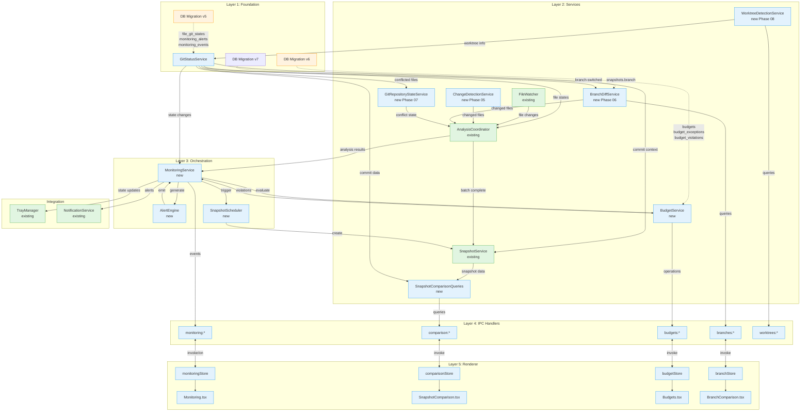
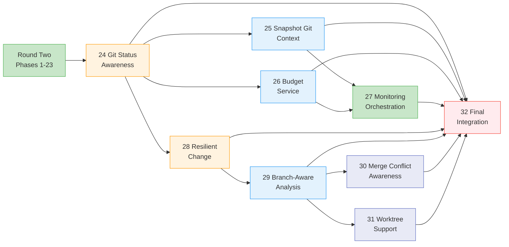
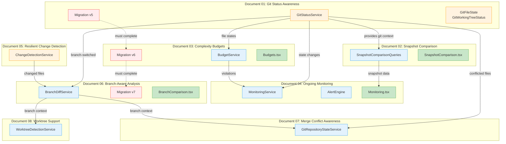
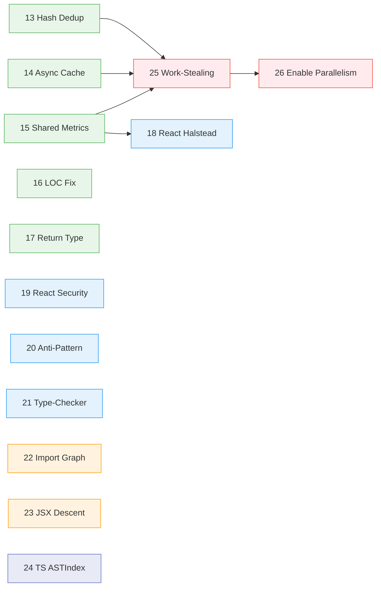

# Round Three: Git-Aware Monitoring & Advanced Analysis

## Summary

Round Three (Phases 24-32) builds on Round Two's foundation (Phases 1-23) to transform Vipr Desktop into a git-aware monitoring platform. These features add git status awareness, snapshot comparison with full git context (completing deferred work from Phase 15), advanced budget monitoring (extending Phase 16), unified monitoring orchestration (extending Phase 14), resilient change detection, branch-aware analysis, merge conflict handling, and git worktree support.

**Key Relationship to Round Two:**

- **Phase 15 (Round Two)**: Basic snapshot comparison - git context integration **deferred** to Round Three Phase 25
- **Phase 16 (Round Two)**: Basic budget UI - advanced service layer **deferred** to Round Three Phase 26
- **Phase 14 (Round Two)**: Initial monitoring - advanced orchestration **deferred** to Round Three Phase 27

Round Three does NOT duplicate Round Two work—it completes intentionally deferred advanced features.

## Scope

| Document                                | Phase | R2 Foundation | Description                                                     | Dependencies |
| --------------------------------------- | ----- | ------------- | --------------------------------------------------------------- | ------------ |
| `01-git-status-awareness.md`            | 24    | N/A           | Git status polling, file state tracking, DB migration v5        | None         |
| `02-snapshot-comparison-git-context.md` | 25    | Phase 15      | **Completes** Phase 15 with commit range, author attribution    | 24           |
| `03-complexity-budget-monitoring.md`    | 26    | Phase 16      | **Extends** Phase 16 with advanced service, violation tracking  | 24           |
| `04-ongoing-monitoring-mode.md`         | 27    | Phase 14      | **Extends** Phase 14 with orchestration, git integration        | 24, 25, 26   |
| `05-resilient-change-detection.md`      | 28    | N/A           | Hybrid git+hash change detection, workspace recovery            | 24           |
| `06-branch-aware-analysis.md`           | 29    | N/A           | Branch-tagged snapshots, branch diff, cross-branch comparison   | 24, 28       |
| `07-merge-conflict-awareness.md`        | 30    | N/A           | Conflict detection, transient git state handling, analysis skip | 24, 29       |
| `08-worktree-support.md`                | 31    | N/A           | Git worktree detection, per-worktree workspaces                 | 29           |
| `09-final-integration-polish.md`        | 32    | Phase 23      | **Extends** Phase 23 QA with git integration testing            | 24-31        |

## Architecture



## Dependency Order

**Note:** All Round Three phases depend on Round Two completion (Phases 1-23).



**Implementation sequence:**

1. **Phase 24 (Foundation)** - Git status polling, DB migration v5, file state tracking
2. **Phases 25 & 26 (Parallel)** - Snapshot git context and budget service can develop simultaneously
3. **Phase 27 (Integration)** - Monitoring orchestration requires completion of 24, 25, and 26
4. **Phase 28 (Foundation)** - Hybrid change detection, workspace recovery (requires 24)
5. **Phase 29 (Feature)** - Branch-aware snapshots, cross-branch comparison (requires 24, 28)
6. **Phases 30 & 31 (Parallel)** - Merge conflict handling and worktree support can develop simultaneously (both require 29)
7. **Phase 32 (Final)** - Integration testing, git-aware QA, release readiness (requires all prior phases)

## Shared Infrastructure

### Database Migrations

| Migration | Version | Tables/Changes      | Fields                                                                                                                   | Document |
| --------- | ------- | ------------------- | ------------------------------------------------------------------------------------------------------------------------ | -------- |
| v5        | 5       | `file_git_states`   | `file_path`, `state`, `last_commit_hash`, `last_commit_author`, `last_commit_date`, `updated_at`                         | 24       |
| v5        | 5       | `monitoring_alerts` | `id`, `type`, `severity`, `title`, `message`, `affected_files`, `metadata`, `created_at`                                 | 24       |
| v5        | 5       | `monitoring_events` | `id`, `event_type`, `description`, `metadata`, `timestamp`                                                               | 24       |
| v6        | 6       | `budgets`           | `id`, `name`, `metric`, `threshold`, `scope_type`, `scope_value`, `enabled`, `created_at`, `updated_at`                  | 26       |
| v6        | 6       | `budget_exceptions` | `id`, `budget_id`, `file_path`, `reason`, `expires_at`, `created_at`                                                     | 26       |
| v6        | 6       | `budget_violations` | `id`, `budget_id`, `file_path`, `current_value`, `threshold`, `duration_seconds`, `first_violated_at`, `last_checked_at` | 26       |
| v7        | 7       | ALTER `snapshots`   | `ADD COLUMN branch TEXT` + `CREATE INDEX idx_snapshots_branch`                                                           | 29       |

**Current schema version:** 4

**Migration pattern:** Follow existing pattern in `clients/desktop/src/main/db/migrations/index.ts`:

```typescript
export const migrations = [
  migration1,
  migration2,
  migration3,
  migration4,
  migration5, // new
  migration6, // new
];
```

Each migration function receives `Database` instance and executes DDL statements with `db.exec()`.

### Shared Types

**New file:** `clients/desktop/src/shared/monitoring-types.ts`

Contains zod schemas and TypeScript types for:

| Type                   | Purpose                            | Key Fields                                                                                  |
| ---------------------- | ---------------------------------- | ------------------------------------------------------------------------------------------- |
| `GitFileState`         | File git state classification      | `'committed' \| 'staged' \| 'unstaged' \| 'untracked'`                                      |
| `GitWorkingTreeStatus` | Aggregate repository status        | `branch`, `ahead`, `behind`, `staged`, `unstaged`, `untracked`, `conflicted`                |
| `MonitoringAlert`      | Alert notifications                | `type`, `severity`, `title`, `message`, `affectedFiles`, `metadata`                         |
| `MonitoringEvent`      | Event log entries                  | `eventType`, `description`, `metadata`, `timestamp`                                         |
| `ComplexityBudget`     | Budget definition                  | `name`, `metric`, `threshold`, `scope`, `enabled`                                           |
| `BudgetScope`          | Budget scope (discriminated union) | `type: 'global' \| 'directory' \| 'pattern' \| 'fileType' \| 'file'` + type-specific fields |
| `BudgetViolation`      | Violation record                   | `budgetId`, `filePath`, `currentValue`, `threshold`, `duration`                             |
| `BudgetException`      | Waiver with expiry                 | `budgetId`, `filePath`, `reason`, `expiresAt`                                               |
| `MonitoringDashboard`  | Dashboard data                     | `status`, `alerts`, `recentEvents`, `budgetCompliance`, `trendData`                         |
| `MonitoringConfig`     | User preferences                   | `enabled`, `alertThresholds`, `checkIntervalMs`, `snapshotSchedule`                         |
| `BranchComparison`     | Cross-branch metric comparison     | `base`, `feature`, `filesChanged`, `regressions`, `improvements`, `metricDeltas`            |
| `GitRepositoryState`   | Transient git state detection      | `normal`, `rebaseInProgress`, `mergeInProgress`, `cherryPickInProgress`, `bisectInProgress` |
| `WorktreeInfo`         | Git worktree metadata              | `path`, `head`, `branch`, `detached`, `locked`, `bare`, `prunable`                          |

### IPC Patterns

All new IPC follows existing patterns established in the codebase:

**Pattern components:**

1. **Handler registration** - `clients/desktop/src/main/ipc/handlers/{namespace}.ts`

   ```typescript
   ipcMain.handle('{namespace}:{method}', async (event, payload) => {
     // validate with zod
     // call service method
     // return result
   });
   ```

2. **Preload bridge** - `clients/desktop/src/preload/index.ts`

   ```typescript
   {namespace}: {
     method: (payload) => ipcRenderer.invoke('{namespace}:{method}', payload)
   }
   ```

3. **Type definition** - `clients/desktop/src/shared/ipc-types.ts`

   ```typescript
   export interface ViprDesktopAPI {
     {namespace}: {
       method: (payload: InputType) => Promise<OutputType>;
     };
   }
   ```

4. **Push events** - For server-initiated events

   ```typescript
   // Main process
   webContents.send('{namespace}:{event}', data);

   // Preload
   on{Event}: (callback) => ipcRenderer.on('{namespace}:{event}', (_, data) => callback(data))
   ```

**New IPC namespaces:**

| Namespace    | Methods                                                                                           | Pattern     | Document |
| ------------ | ------------------------------------------------------------------------------------------------- | ----------- | -------- |
| `monitoring` | `getStatus`, `start`, `stop`, `configure`, `getAlerts`, `dismissAlert`, `getEvents`               | invoke + on | 24, 27   |
| `comparison` | `getSnapshots`, `compare`, `getCommitRange`, `getFileAttribution`, `getChangedFiles`              | invoke      | 25       |
| `budgets`    | `list`, `get`, `create`, `update`, `delete`, `checkCompliance`, `addException`, `removeException` | invoke      | 26       |
| `branches`   | `list`, `getCurrent`, `compare`, `getDivergence`                                                  | invoke      | 29       |
| `worktrees`  | `list`, `getInfo`                                                                                 | invoke      | 31       |

**Event subscriptions:**

| Event                        | Payload            | Trigger                           | Document |
| ---------------------------- | ------------------ | --------------------------------- | -------- |
| `monitoring:alert`           | `MonitoringAlert`  | New alert generated               | 27       |
| `monitoring:stateChanged`    | `MonitoringStatus` | Monitoring started/stopped/paused | 27       |
| `monitoring:budgetViolation` | `BudgetViolation`  | Budget threshold exceeded         | 26, 27   |

### Renderer Patterns

**Page layout structure:**

All pages follow the existing two-column layout with Sidebar v2 and Titlebar:

```tsx
export function PageName(): JSX.Element {
  const [sidebarOpen, setSidebarOpen] = useState(false);

  return (
    <div className="flex h-screen overflow-hidden bg-gray-100 dark:bg-gray-900">
      <Sidebar sidebarOpen={sidebarOpen} setSidebarOpen={setSidebarOpen} variant="v2" />
      <div className="relative flex flex-col flex-1 overflow-hidden">
        <Titlebar sidebarOpen={sidebarOpen} setSidebarOpen={setSidebarOpen} />
        <main className="grow overflow-y-auto">
          <div className="px-4 sm:px-6 lg:px-8 py-8 w-full max-w-[96rem] mx-auto">
            {/* Page content */}
          </div>
        </main>
      </div>
    </div>
  );
}
```

**State management:**

Zustand stores in `clients/desktop/src/renderer/stores/{feature}-store.ts`:

```typescript
interface FeatureStore {
  // State
  data: DataType | null;
  isLoading: boolean;
  error: string | null;

  // Actions
  load: () => Promise<void>;
  update: (data: Partial<DataType>) => Promise<void>;
  reset: () => void;
}

export const useFeatureStore = create<FeatureStore>((set, get) => ({
  // Initial state
  data: null,
  isLoading: false,
  error: null,

  // Action implementations
  load: async () => {
    set({ isLoading: true, error: null });
    try {
      const data = await window.api.feature.getData();
      set({ data, isLoading: false });
    } catch (error) {
      set({ error: error.message, isLoading: false });
    }
  },

  reset: () => set({ data: null, isLoading: false, error: null }),
}));
```

**Custom hooks:**

Page-adjacent hooks files for complex data transformations:

```typescript
// clients/desktop/src/renderer/pages/use-{feature}-data.ts
export function useFeatureData() {
  const store = useFeatureStore();

  useEffect(() => {
    store.load();
  }, []);

  return {
    data: store.data,
    isLoading: store.isLoading,
    error: store.error,
    // derived data
    transformedData: useMemo(() => transform(store.data), [store.data]),
  };
}
```

## Subagent Assignment Guide

| Layer          | Agent                  | Responsibilities                                  | Example Tasks                                                      |
| -------------- | ---------------------- | ------------------------------------------------- | ------------------------------------------------------------------ |
| Database       | `typescript-engineer`  | SQL DDL, migrations, schema updates               | Write `migration5.ts`, add tables to `schema.ts`                   |
| Main services  | `typescript-engineer`  | Service classes, business logic, git integration  | Implement `GitStatusService`, `BudgetService`, `MonitoringService` |
| IPC layer      | `typescript-engineer`  | Handler registration, preload bridge, validation  | Create `monitoring.ts` handler, extend preload API                 |
| Shared types   | `typescript-engineer`  | Zod schemas, type exports, validation             | Define `monitoring-types.ts` schemas                               |
| Pages          | `react-engineer`       | Page components, hooks, composition               | Build `Monitoring.tsx`, `SnapshotComparison.tsx`                   |
| Stores         | `react-engineer`       | Zustand stores, selectors, actions                | Create `monitoring-store.ts`, `budget-store.ts`                    |
| Layout/styling | `tailwind-ux-engineer` | Responsive layout, dark mode, visual polish       | Apply grid layouts, StatCard compositions                          |
| Unit tests     | `vitest-engineer`      | Service tests, handler tests, store tests         | Write `git-status-service.test.ts`                                 |
| Integration    | `typescript-engineer`  | Tray updates, notification triggers, event wiring | Extend `TrayManager`, wire `MonitoringService` events              |

**Handoff pattern:**

1. `typescript-engineer` implements main process infrastructure (services, IPC, types)
2. `react-engineer` implements renderer (stores, pages, hooks)
3. `tailwind-ux-engineer` refines layout and visual presentation
4. `vitest-engineer` adds test coverage

## Design Source of Truth

| Feature                        | UX Spec                                           | Primary Components                                                                             | Data Display Pattern                                                     |
| ------------------------------ | ------------------------------------------------- | ---------------------------------------------------------------------------------------------- | ------------------------------------------------------------------------ |
| Git Status Awareness           | None (infrastructure)                             | N/A                                                                                            | N/A                                                                      |
| Snapshot Comparison (Phase 15) | `round-two/15-snapshot-comparison-git-context.md` | DatePicker, StatCard, StatsRow, Tabs, CardTable, StripedTable, Badge, Alert                    | CardTable for file changes, StripedTable for commit details              |
| Complexity Budgets (Phase 16)  | `round-two/16-complexity-budget-monitoring.md`    | CardTable, StatCard, LineChart, MetricBarChart, Badge, Modal, Radio, Checkbox, Input, Dropdown | CardTable for budget list, Modal for CRUD, LineChart for trends          |
| Ongoing Monitoring (Phase 14)  | `round-two/14-ongoing-monitoring-mode.md`         | StatCard, LineChart, Alert, ActivityFeed, Switch, Badge, CardTable, EmptyState                 | StatCard grid for metrics, CardTable for alerts, ActivityFeed for events |
| Resilient Change Detection     | None (infrastructure)                             | Alert (recovery banner)                                                                        | N/A                                                                      |
| Branch-Aware Analysis          | None (new)                                        | Dropdown, StatCard, CardTable, Tabs, Badge, LineChart                                          | Dropdown selectors, StatCard for deltas, CardTable for file changes      |
| Merge Conflict Awareness       | None (new)                                        | Alert (banner), Badge                                                                          | Alert banners for conflict/rebase state, Badge on file list              |
| Worktree Support               | None (new)                                        | Badge, DataList                                                                                | Badge on workspace list, DataList for sibling worktrees                  |

**Component selection rules:**

- **1-4 metrics** → StatCard with `variant="default"`
- **10-100 rows** → CardTable with pagination
- **Trends over time** → LineChart (not scatter plot)
- **Alerts/notifications** → Alert component with `variant="banner"` or `"toast"`
- **File lists with metrics** → CardTable with Badge columns
- **Settings/config** → Modal with form layout (see Phase 12 reference)
- **Empty states** → EmptyState component

## Conventions

**File naming:**

- All new files: `kebab-case.ts`
- Test files: co-located as `*.test.ts`
- Store files: `{feature}-store.ts`
- Hook files: `use-{feature}-{purpose}.ts`

**Code style:**

- No barrel exports (except deliberate design patterns)
- Don't prefix interfaces with `I` (exception: existing plugin interfaces like `ITechnologyPlugin`)
- Use existing utilities: `createLogger()`, `sanitizeFilePath()`, `TypedEventEmitter`
- Use zod for all IPC payload validation
- Use branded types for temporal values: `UnixTimestamp`, `UnixTimestampMs`

**Database:**

- Migration version increments sequentially (current: 4, next: 5, 6)
- Use `INTEGER PRIMARY KEY AUTOINCREMENT` for ID columns
- Use `TEXT NOT NULL` for file paths (always sanitized)
- Use `INTEGER NOT NULL` for unix timestamps
- Index foreign keys and frequently queried columns

**Git integration:**

- Use `execFile` pattern from `packages/engine/src/git-changed-files.ts`
- Always handle git errors gracefully (repository may not exist)
- Use `GitHistoryService` from `@vipr/history` for commit range queries
- Cache git results with TTL to avoid repeated subprocess calls

**Event-driven services:**

- Extend `TypedEventEmitter` from `clients/desktop/src/shared/typed-event-emitter.ts`
- Emit events for state changes that affect UI
- Use typed event maps for compile-time safety
- Document all emitted events in service interface

**Logging:**

- Use `createLogger(serviceName)` for all services
- Log at appropriate levels: `debug`, `info`, `warn`, `error`
- Include context: `logger.info('Checking budgets', { count, threshold })`
- Never log sensitive data (full file contents, user credentials)

## Key Reference Files

| File                                                         | Purpose                         | Key Patterns                                        |
| ------------------------------------------------------------ | ------------------------------- | --------------------------------------------------- |
| `clients/desktop/src/main/db/schema.ts`                      | Database schema, SCHEMA_VERSION | Table definitions, indexes                          |
| `clients/desktop/src/main/db/migrations/index.ts`            | Migration sequencing            | `export const migrations = [...]`                   |
| `clients/desktop/src/main/fs/watcher.ts`                     | Event-driven file watching      | `TypedEventEmitter`, `on('change')`                 |
| `clients/desktop/src/main/analysis/coordinator.ts`           | Analysis orchestration          | `QueuedFile`, event emission, batch tracking        |
| `clients/desktop/src/main/analysis/snapshot-service.ts`      | Snapshot CRUD                   | `createSnapshot()`, `compareSnapshots()`            |
| `clients/desktop/src/main/tray/tray-manager.ts`              | Tray state management           | `TrayState`, `ICON_COLORS`, `updateState()`         |
| `clients/desktop/src/main/tray/notification-service.ts`      | System notifications            | Rate limiting, notification queueing                |
| `clients/desktop/src/preload/index.ts`                       | Preload bridge                  | Zod validation, `contextBridge.exposeInMainWorld()` |
| `clients/desktop/src/shared/ipc-types.ts`                    | IPC type definitions            | `ViprDesktopAPI`, `Settings`                        |
| `clients/desktop/src/shared/typed-event-emitter.ts`          | Event emitter base              | `TypedEventEmitter<EventMap>`                       |
| `packages/engine/src/git-changed-files.ts`                   | Git subprocess pattern          | `execFile('git', args)`, stderr handling            |
| `packages/history/src/git-history-service.ts`                | Git history queries             | `getCommits()`, date range filters                  |
| `clients/desktop/src/renderer/components/layout/Sidebar.tsx` | Navigation structure            | Nav sections, active states                         |
| `clients/desktop/src/renderer/pages/Budgets.tsx`             | Existing budget page stub       | Layout pattern, grid structure                      |
| `packages/ui/catalogs/component-catalog.json`                | Component inventory             | All available @vipr/ui components                   |
| `packages/ui/catalogs/component-recipes.json`                | Tailwind patterns               | Dark mode pairings, grid layouts                    |

**Reference for new patterns:**

| Pattern                     | Reference File                                             | What to Copy                              |
| --------------------------- | ---------------------------------------------------------- | ----------------------------------------- |
| Service with events         | `clients/desktop/src/main/fs/watcher.ts`                   | TypedEventEmitter extension, event typing |
| IPC handler with validation | `clients/desktop/src/main/ipc/handlers/settings.ts`        | Zod schema validation, error handling     |
| Zustand store               | `clients/desktop/src/renderer/stores/analysis-store.ts`    | Store structure, async actions            |
| Page layout                 | `clients/desktop/src/renderer/pages/Workspace.tsx`         | Sidebar + Titlebar pattern                |
| Database query service      | `clients/desktop/src/main/db/queries/workspace-queries.ts` | Prepared statements, error handling       |

## Cross-Document Dependencies



**Critical paths:**

1. **DB migrations must be sequential** - v6 cannot run until v5 is applied
2. **GitStatusService is foundational** - Documents 02, 03, 04 all depend on it
3. **MonitoringService requires all services** - Cannot implement until BudgetService and SnapshotComparisonQueries are complete
4. **Pages depend on stores, stores depend on IPC, IPC depends on services** - Implementation flows main → preload → renderer

## Success Criteria

Each document includes specific success criteria. Overall round-three completion requires:

**Functional:**

- [ ] Git status polling active for open workspaces
- [ ] File git states tracked in database
- [ ] Snapshot comparison includes commit range and author attribution
- [ ] Budget CRUD operations functional via UI
- [ ] Budget violations detected and persisted
- [ ] Monitoring service orchestrates all checks
- [ ] Alerts generated for violations and anomalies
- [ ] Tray icon reflects monitoring state
- [ ] Notifications sent for critical alerts
- [ ] Hybrid change detection reduces repo-open time for returning workspaces
- [ ] Workspace recovery detects and handles DB deletion/corruption
- [ ] Branch-tagged snapshots created on branch switches
- [ ] Cross-branch comparison shows per-file metric deltas
- [ ] Merge conflicts detected and conflicted files skipped during analysis
- [ ] Transient git states (rebase, bisect, cherry-pick) detected and surfaced
- [ ] Git worktrees detected and get independent workspaces

**Data integrity:**

- [ ] Database migrations v5 and v6 applied successfully
- [ ] No orphaned records (foreign keys enforced)
- [ ] Git state cache invalidates appropriately
- [ ] Budget exceptions respect expiry dates

**User experience:**

- [ ] All pages follow existing layout patterns
- [ ] Dark mode fully supported
- [ ] Loading states show appropriate feedback
- [ ] Error states provide actionable guidance
- [ ] Empty states guide user to next action

**Performance:**

- [ ] Git status polling respects configured interval
- [ ] Budget checks complete within 1 second for <1000 files
- [ ] Snapshot comparison queries complete within 2 seconds
- [ ] UI remains responsive during background checks

**Code quality:**

- [ ] All new code has unit tests (>80% coverage)
- [ ] No linting errors
- [ ] No TypeScript errors (strict mode)
- [ ] Follows existing conventions (file naming, structure, patterns)

---

## Analysis Pipeline Performance Optimization (Phases 13-26)

Phases 13-26 address performance bottlenecks identified through deep analysis of the engine and all four analyzer plugins (core, react, nextjs, typescript). The primary finding: the pipeline performs 7+ redundant AST traversals per file in the core plugin alone, and 34+ unconditional traversals in the TypeScript plugin with zero ASTIndex integration. These phases systematically eliminate redundancy without changing analysis semantics.

### Phase Inventory

| Phase | Scope      | Description                                               | Depends On | Risk     |
| ----- | ---------- | --------------------------------------------------------- | ---------- | -------- |
| 13    | Engine     | Deduplicate `computeContentHash` (8-11x per file to 1x)   | None       | Low      |
| 14    | Engine     | Fire-and-forget persistent cache writes                   | None       | Low      |
| 15    | Core       | Shared `calculateTraditionalMetrics` cache via WeakMap    | None       | Low      |
| 16    | Core       | Fix `calculateExecutableLOC` O(n\*depth) ancestor walks   | None       | Low-Med  |
| 17    | Core       | Syntax-only return type check in FunctionAnalysis         | None       | Low      |
| 18    | React      | Eliminate TechnicalDebtAnalysis private Halstead reimpl   | 15         | Medium   |
| 19    | React      | Wire SecurityAnalysis to ASTIndex                         | None       | Low-Med  |
| 20    | React      | Remove inner `forEachDescendant` in anti-pattern analysis | None       | Low      |
| 21    | React      | Remove type-checker calls in react-helpers.ts             | None       | Medium   |
| 22    | Next.js    | Cache ImportGraphBuilder at plugin level                  | None       | Low-Med  |
| 23    | Next.js    | Consolidate JSX element descent in helpers                | None       | Low      |
| 24    | TypeScript | Wire ASTIndex across all 9 analyses                       | None       | Medium   |
| 25    | Engine     | Work-stealing worker pool scheduling                      | 13, 14, 15 | Med-High |
| 26    | Engine     | Enable worker parallelism by default                      | 25         | Medium   |

### Dependency Graph



Phases 13-17, 19-24 are all independent and can execute in any order. Phase 18 depends on 15. Phases 25-26 are the capstone and should land last.

### Key Architectural Insight

The engine already builds an `ASTIndex` (single `forEachDescendant` pass, O(1) lookups by `SyntaxKind`) for every file and passes it to analyses via `ExtendedAnalyzerConfig`. However:

- **Core**: All 5 analyses ignore the index
- **React**: Partial adoption (some analyses fall through to traversal)
- **Next.js**: Partial adoption (SecurityAnalysis ignores it entirely)
- **TypeScript**: Zero adoption across all 9 analyses

Wiring the existing ASTIndex through to all analyses is the single highest-leverage change across the system.
