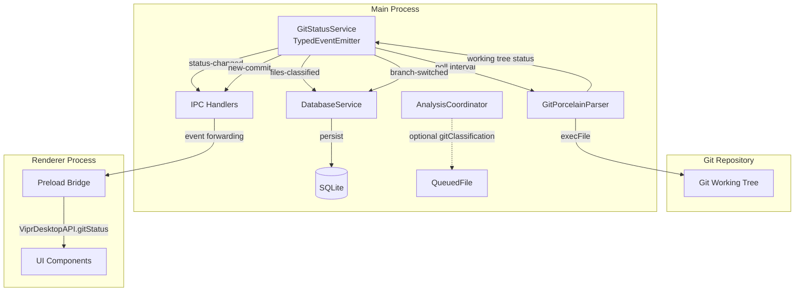
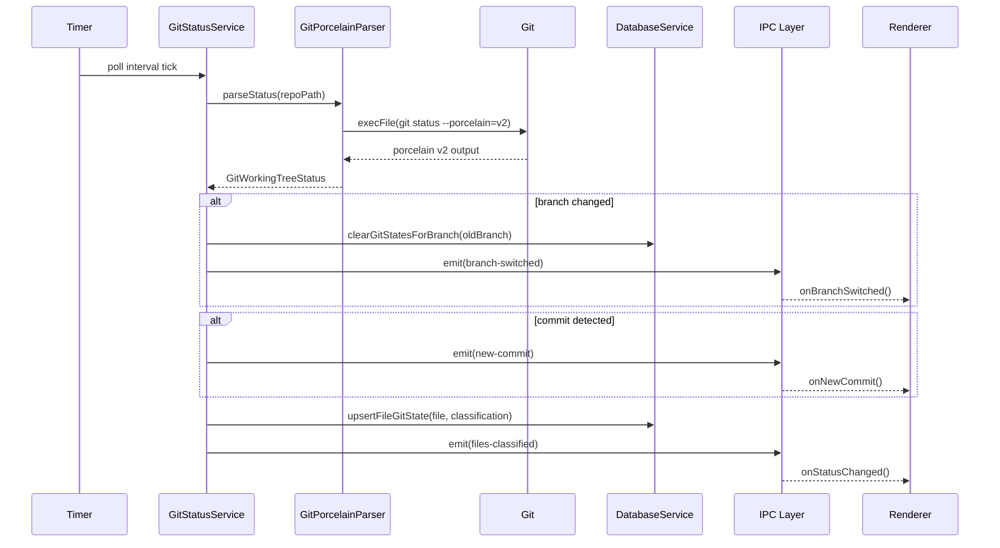

# Git Status Awareness

## Summary

Foundation layer for all monitoring features in Round Three. Implements `GitStatusService` that polls `git status --porcelain=v2`, classifies files as committed/staged/unstaged/untracked/conflicted, detects branch switches and new commits. Adds database migration v5 with `file_git_states`, `monitoring_alerts`, `monitoring_events` tables. Creates shared monitoring types for use across all monitoring features.

This phase establishes the infrastructure that Phases 02-08 depend on for detecting code quality degradation, monitoring analysis trends, and providing proactive alerts.

## Architecture

### System Overview



### Data Flow



### File Classification Logic

```mermaid
flowchart TD
    START[Porcelain v2 Entry] --> CHECK_TYPE{Entry Type}

    CHECK_TYPE -->|1 or 2| TRACKED[Tracked File]
    CHECK_TYPE -->|u| UNMERGED[Unmerged File]
    CHECK_TYPE -->|?| UNTRACKED[Untracked File]

    TRACKED --> CHECK_INDEX{Index Status}

    CHECK_INDEX -->|. (unmodified)| CHECK_WORKTREE{Worktree Status}
    CHECK_INDEX -->|M/A/D/R/C| STAGED[Classification:<br/>staged]

    CHECK_WORKTREE -->|. (unmodified)| COMMITTED[Classification:<br/>committed]
    CHECK_WORKTREE -->|M (modified)| UNSTAGED[Classification:<br/>unstaged]

    UNMERGED --> CONFLICTED[Classification:<br/>conflicted]
    UNTRACKED --> UNTRACKED_CLASS[Classification:<br/>untracked]
```

## Existing Infrastructure

| File                                                | What to Reuse                                   | Why                                                            |
| --------------------------------------------------- | ----------------------------------------------- | -------------------------------------------------------------- |
| `packages/engine/src/git-changed-files.ts`          | `execFile` pattern for git commands             | Security: prevents shell injection attacks, validated approach |
| `clients/desktop/src/main/fs/watcher.ts`            | TypedEventEmitter pattern, event map interface  | Proven event emission with type safety                         |
| `clients/desktop/src/main/analysis/coordinator.ts`  | QueuedFile interface, event emission patterns   | Established queue architecture, backward compatible extension  |
| `clients/desktop/src/main/db/schema.ts`             | Schema definition, SCHEMA_VERSION (currently 4) | Consistent schema evolution                                    |
| `clients/desktop/src/main/db/migrations/index.ts`   | Migration versioning pattern                    | Safe, tested migration approach                                |
| `clients/desktop/src/shared/typed-event-emitter.ts` | Base event emitter class                        | Type-safe event handling                                       |
| `clients/desktop/src/shared/ipc-types.ts`           | ViprDesktopAPI to extend                        | Renderer-main communication contract                           |
| `clients/desktop/src/preload/index.ts`              | Preload bridge pattern                          | Secure IPC exposure to renderer                                |

## Data Schema

### file_git_states Table

| Column         | Type    | Constraints               | Description                                        |
| -------------- | ------- | ------------------------- | -------------------------------------------------- |
| id             | INTEGER | PRIMARY KEY AUTOINCREMENT | Unique identifier                                  |
| file_path      | TEXT    | NOT NULL UNIQUE           | Relative path from repo root                       |
| classification | TEXT    | NOT NULL CHECK(IN(...))   | committed, staged, unstaged, untracked, conflicted |
| git_sha        | TEXT    | NULL                      | HEAD SHA when state captured                       |
| branch         | TEXT    | NOT NULL                  | Branch name when state captured                    |
| updated_at     | INTEGER | NOT NULL                  | Unix timestamp                                     |

**Indexes**: `idx_file_git_states_classification`, `idx_file_git_states_branch`

### monitoring_alerts Table

| Column          | Type    | Constraints             | Description                                              |
| --------------- | ------- | ----------------------- | -------------------------------------------------------- |
| id              | TEXT    | PRIMARY KEY             | UUID v4                                                  |
| type            | TEXT    | NOT NULL                | quality-degradation, trend-alert, threshold-breach, etc. |
| severity        | TEXT    | NOT NULL CHECK(IN(...)) | critical, warning, info                                  |
| title           | TEXT    | NOT NULL                | Human-readable alert title                               |
| message         | TEXT    | NOT NULL                | Detailed alert message                                   |
| affected_files  | TEXT    | NULL                    | JSON array of file paths                                 |
| metadata        | TEXT    | NULL                    | JSON object with alert-specific data                     |
| created_at      | INTEGER | NOT NULL                | Unix timestamp                                           |
| acknowledged_at | INTEGER | NULL                    | Unix timestamp when user acknowledged                    |
| dismissed_at    | INTEGER | NULL                    | Unix timestamp when user dismissed                       |
| snoozed_until   | INTEGER | NULL                    | Unix timestamp until snoozed                             |

**Indexes**: `idx_monitoring_alerts_type`, `idx_monitoring_alerts_severity`, `idx_monitoring_alerts_created_at`

### monitoring_events Table

| Column      | Type    | Constraints               | Description                                              |
| ----------- | ------- | ------------------------- | -------------------------------------------------------- |
| id          | INTEGER | PRIMARY KEY AUTOINCREMENT | Unique identifier                                        |
| type        | TEXT    | NOT NULL                  | branch-switch, commit-detected, analysis-completed, etc. |
| description | TEXT    | NOT NULL                  | Human-readable event description                         |
| metadata    | TEXT    | NULL                      | JSON object with event-specific data                     |
| timestamp   | INTEGER | NOT NULL                  | Unix timestamp                                           |

**Indexes**: `idx_monitoring_events_type`, `idx_monitoring_events_timestamp`

## Type Definitions

### Core Types

```typescript
// Git file classification (Zod schema + inferred type)
type GitFileClassification = 'committed' | 'staged' | 'unstaged' | 'untracked' | 'conflicted';

// File state in git
interface GitFileState {
  filePath: string;
  classification: GitFileClassification;
  gitSha: string | null;
  branch: string;
  updatedAt: number;
}

// Working tree status
interface GitWorkingTreeStatus {
  branch: string;
  headSha: string;
  upstream: string | null;
  ahead: number;
  behind: number;
  files: Map<string, GitFileClassification>;
}

// Monitoring alert
interface MonitoringAlert {
  id: string;
  type: string;
  severity: 'critical' | 'warning' | 'info';
  title: string;
  message: string;
  affectedFiles: string[] | null;
  metadata: Record<string, unknown> | null;
  createdAt: number;
  acknowledgedAt: number | null;
  dismissedAt: number | null;
  snoozedUntil: number | null;
}

// Monitoring event
interface MonitoringEvent {
  id: number;
  type: string;
  description: string;
  metadata: Record<string, unknown> | null;
  timestamp: number;
}
```

## Implementation Tasks

### Task 01: Create Shared Monitoring Types

**Agent**: `typescript-engineer`

**Files**:

- Create: `clients/desktop/src/shared/monitoring-types.ts`

**Patterns**:

- Zod schema definition from `clients/desktop/src/shared/ipc-types.ts`
- Type inference with `z.infer<typeof Schema>`

**Dependencies**: None

**Description**:

Define Zod schemas and export both schemas and inferred TypeScript types for:

1. `gitFileClassificationSchema` - enum of 5 classifications (committed, staged, unstaged, untracked, conflicted)
2. `gitFileStateSchema` - file path, classification, sha, branch, timestamp
3. `gitWorkingTreeStatusSchema` - branch, head SHA, upstream, ahead/behind counts, files map
4. `monitoringAlertSchema` - alert with severity, affected files, metadata
5. `monitoringEventSchema` - event log entry with metadata

Export schemas for runtime validation and inferred types for compile-time safety.

**Verification**:

```bash
pnpm --filter @vipr/desktop typecheck
```

### Task 02: Database Migration v5

**Agent**: `typescript-engineer`

**Files**:

- Modify: `clients/desktop/src/main/db/schema.ts` (bump SCHEMA_VERSION to 5)
- Modify: `clients/desktop/src/main/db/migrations/index.ts` (add migration_5)

**Patterns**:

- Migration versioning from existing migrations (001-004)
- Schema evolution with CREATE TABLE, CREATE INDEX
- CHECK constraints for enum validation

**Dependencies**: Task 01 (types needed for documentation)

**Description**:

Create migration_5 that:

1. Creates `file_git_states` table with UNIQUE constraint on file_path
2. Creates `monitoring_alerts` table with TEXT id (UUID), CHECK constraints on severity
3. Creates `monitoring_events` table with AUTOINCREMENT id
4. Creates indexes on classification, branch, type, severity, timestamp columns
5. Bumps SCHEMA_VERSION from 4 to 5

Follow the pattern from existing migrations: check schema version, run DDL statements, update schema_version table.

**Verification**:

```bash
pnpm --filter @vipr/desktop build
# Manually verify schema with:
# sqlite3 <test.db> ".schema file_git_states"
```

### Task 03: Git Porcelain v2 Parser

**Agent**: `typescript-engineer`

**Files**:

- Create: `clients/desktop/src/main/git/git-porcelain-parser.ts`

**Patterns**:

- `execFile` usage from `packages/engine/src/git-changed-files.ts` (security best practice)
- Error handling with try/catch, reject on non-zero exit
- Line-by-line parsing with switch/case on first character

**Dependencies**: Task 01 (GitWorkingTreeStatus type)

**Description**:

Implement `parseGitStatus(repoPath: string): Promise<GitWorkingTreeStatus>`:

1. Execute `git status --porcelain=v2 --branch` via `execFile` (NOT `exec`)
2. Parse header lines starting with `#`:
   - `# branch.oid <sha>` → headSha
   - `# branch.head <name>` → branch
   - `# branch.upstream <name>` → upstream
   - `# branch.ab +<ahead> -<behind>` → ahead/behind counts
3. Parse file entries (lines starting with `1`, `2`, `u`, `?`):
   - `1 <XY> ...` → tracked file (X = index status, Y = worktree status)
   - `2 <XY> ...` → renamed/copied file
   - `u <XY> <sub> <m1> <m2> <m3> <mW> <h1> <h2> <h3> <path>` → unmerged (conflicted) file
   - `? <path>` → untracked file
4. Classify each file:
   - Unmerged (`u` line) → `conflicted` (XY types: UU both modified, AA both added, DD both deleted, AU/UA/DU/UD)
   - Index modified (X in M/A/D/R/C) → `staged`
   - Worktree modified (Y = M) and index unmodified (X = .) → `unstaged`
   - Both unmodified (X = ., Y = .) → `committed`
   - Untracked (? line) → `untracked`
5. Return GitWorkingTreeStatus with files as Map<string, GitFileClassification>

Handle edge cases: detached HEAD, no upstream, empty repository.

**Verification**:

```bash
pnpm --filter @vipr/desktop typecheck
```

### Task 04: Unit Tests for Porcelain Parser

**Agent**: `vitest-engineer`

**Files**:

- Create: `clients/desktop/src/main/git/git-porcelain-parser.test.ts`

**Patterns**:

- Vitest test organization from existing desktop tests
- Mock `execFile` with `vi.mock('node:child_process')`
- Test fixtures with sample porcelain output

**Dependencies**: Task 03 (parser implementation)

**Description**:

Write comprehensive tests covering:

1. **Header parsing**:
   - Extract branch name, HEAD SHA, upstream, ahead/behind
   - Handle detached HEAD state
   - Handle no upstream branch
2. **File classification**:
   - Committed file (1 .. path)
   - Staged file (1 M. path, 1 A. path, 1 D. path)
   - Unstaged file (1 .M path)
   - Untracked file (? path)
   - Conflicted file (u UU path, u AA path, u DD path, u AU path)
   - Renamed file (2 R. path oldpath)
   - Copied file (2 C. path)
3. **Edge cases**:
   - Empty output (clean working tree)
   - Mixed states (staged + unstaged in same file)
   - Merge conflict with different XY types (UU, AA, DD, AU, UA, DU, UD)
   - Error handling (non-zero exit code, invalid output)

Use test fixtures with real porcelain v2 output samples.

**Verification**:

```bash
pnpm --filter @vipr/desktop test git-porcelain-parser
```

### Task 05: GitStatusService

**Agent**: `typescript-engineer`

**Files**:

- Create: `clients/desktop/src/main/git/git-status-service.ts`

**Patterns**:

- TypedEventEmitter from `clients/desktop/src/main/fs/watcher.ts`
- Event map interface pattern
- Service lifecycle (start/stop) pattern

**Dependencies**: Task 03 (parser for git operations)

**Description**:

Implement `GitStatusService extends TypedEventEmitter`:

**Event Map**:

```typescript
interface GitStatusServiceEvents {
  'status-changed': (status: GitWorkingTreeStatus) => void;
  'branch-switched': (oldBranch: string, newBranch: string, newSha: string) => void;
  'new-commit': (branch: string, oldSha: string, newSha: string) => void;
  'files-classified': (files: Map<string, GitFileClassification>) => void;
  error: (error: Error) => void;
}
```

**Constructor**: Accept repoPath, pollIntervalMs (default 5000)

**Methods**:

- `start()`: Begin polling, store timer handle
- `stop()`: Clear timer, reset state
- `poll()`: Execute parser, compare with lastStatus, emit events
- `getLastStatus()`: Return cached status

**Event Logic**:

- Emit `status-changed` on every successful poll
- Emit `branch-switched` when branch name changes (clear old states)
- Emit `new-commit` when HEAD SHA changes on same branch
- Emit `files-classified` with current file classifications
- Emit `error` on parser failure (don't crash, log and continue)

**State Management**:

- Track lastStatus: GitWorkingTreeStatus | null
- Compare branch/SHA between polls to detect switches/commits

**Verification**:

```bash
pnpm --filter @vipr/desktop typecheck
```

### Task 06: Unit Tests for GitStatusService

**Agent**: `vitest-engineer`

**Files**:

- Create: `clients/desktop/src/main/git/git-status-service.test.ts`

**Patterns**:

- Mock timer functions with `vi.useFakeTimers()`
- Mock parser module
- Event listener testing

**Dependencies**: Task 05 (service implementation)

**Description**:

Test coverage:

1. **Lifecycle**:
   - start() begins polling at interval
   - stop() clears timer
   - Multiple start/stop cycles work correctly
2. **Event emission**:
   - status-changed emitted on every poll
   - branch-switched emitted when branch name changes
   - new-commit emitted when SHA changes on same branch
   - files-classified emitted with current file map
   - error emitted on parser failure
3. **State tracking**:
   - getLastStatus() returns null initially
   - getLastStatus() returns cached status after first poll
   - Branch/commit detection works across multiple polls
4. **Error handling**:
   - Service continues polling after parser error
   - Error event includes original error object

Use fake timers to control poll timing.

**Verification**:

```bash
pnpm --filter @vipr/desktop test git-status-service
```

### Task 07: Database Methods for Git State

**Agent**: `typescript-engineer`

**Files**:

- Modify: `clients/desktop/src/main/db/database-service.ts`

**Patterns**:

- Existing database method patterns (upsert, query, delete)
- Transaction usage for multi-row operations
- JSON serialization for metadata columns

**Dependencies**: Task 02 (schema), Task 01 (types)

**Description**:

Add methods to DatabaseService:

**Git State Methods**:

- `upsertFileGitState(state: GitFileState): Promise<void>` - INSERT OR REPLACE
- `getFileGitState(filePath: string): Promise<GitFileState | null>` - SELECT by file_path
- `getFilesByClassification(classification: GitFileClassification): Promise<GitFileState[]>` - SELECT WHERE
- `clearGitStatesForBranch(branch: string): Promise<void>` - DELETE WHERE branch

**Alert Methods**:

- `saveAlert(alert: Omit<MonitoringAlert, 'id'>): Promise<string>` - Generate UUID, INSERT
- `getActiveAlerts(): Promise<MonitoringAlert[]>` - SELECT WHERE dismissed_at IS NULL AND (snoozed_until IS NULL OR < NOW)
- `acknowledgeAlert(id: string): Promise<void>` - UPDATE acknowledged_at
- `dismissAlert(id: string): Promise<void>` - UPDATE dismissed_at
- `snoozeAlert(id: string, until: number): Promise<void>` - UPDATE snoozed_until

**Event Methods**:

- `logMonitoringEvent(event: Omit<MonitoringEvent, 'id'>): Promise<number>` - INSERT, return id
- `getRecentEvents(limit: number): Promise<MonitoringEvent[]>` - SELECT ORDER BY timestamp DESC

Use prepared statements, parameterized queries. Serialize JSON for affected_files and metadata columns.

**Verification**:

```bash
pnpm --filter @vipr/desktop typecheck
pnpm --filter @vipr/desktop test database-service
```

### Task 08: Integrate GitStatusService with Coordinator

**Agent**: `typescript-engineer`

**Files**:

- Modify: `clients/desktop/src/main/analysis/coordinator.ts`

**Patterns**:

- Extend existing interfaces without breaking changes
- Optional properties for backward compatibility
- Event payload enhancement

**Dependencies**: Task 01 (GitFileClassification type)

**Description**:

Minimal, backward-compatible changes:

1. Extend `QueuedFile` interface:

```typescript
interface QueuedFile {
  // ... existing properties
  gitClassification?: GitFileClassification; // NEW: optional
}
```

2. Extend `file-completed` event payload to include gitClassification

3. No changes to coordinator logic - gitClassification is purely informational

This allows future phases to access git state from analysis events without requiring coordinator to manage git operations.

**Verification**:

```bash
pnpm --filter @vipr/desktop typecheck
pnpm --filter @vipr/desktop test coordinator
```

### Task 09: Wire GitStatusService into App Lifecycle

**Agent**: `typescript-engineer`

**Files**:

- Modify: `clients/desktop/src/main/window-manager.ts` (or equivalent app initialization)

**Patterns**:

- Service instantiation and lifecycle management
- Event listener registration
- Cleanup on shutdown

**Dependencies**: Task 05 (service), Task 07 (database methods)

**Description**:

Integrate GitStatusService into app lifecycle:

1. **On repository open**:
   - Instantiate GitStatusService(repoPath, pollIntervalMs)
   - Start service
   - Listen for `files-classified` → upsert to database via DatabaseService
   - Listen for `branch-switched` → clear old branch states, log monitoring event
   - Listen for `new-commit` → log monitoring event
   - Listen for `error` → log to console/file

2. **On repository close**:
   - Stop service
   - Remove event listeners
   - Clean up resources

Store service instance in application state for access by IPC handlers.

**Verification**:

```bash
pnpm --filter @vipr/desktop build
# Manually test: open repository, verify polling starts, check database
```

### Task 10: Add Git Status IPC Handler

**Agent**: `typescript-engineer`

**Files**:

- Create: `clients/desktop/src/main/ipc/handlers/git-status.ts`
- Modify: `clients/desktop/src/main/ipc/index.ts` (register handlers)

**Patterns**:

- IPC handler registration from existing handlers
- Event forwarding with cleanup
- Error handling with Result type

**Dependencies**: Task 05 (service), Task 07 (database)

**Description**:

Implement IPC handlers for `git-status` namespace:

**Methods**:

- `getCurrent(): Promise<GitWorkingTreeStatus | null>` - Return service.getLastStatus()
- `poll(): Promise<GitWorkingTreeStatus>` - Trigger immediate poll, return result
- `getFileState(filePath: string): Promise<GitFileState | null>` - Query database
- `getFilesByClassification(classification: GitFileClassification): Promise<GitFileState[]>` - Query database

**Event Forwarding**:

- `status-changed` → forward to renderer
- `branch-switched` → forward to renderer
- `new-commit` → forward to renderer

Follow existing IPC handler patterns for error handling and type safety.

**Verification**:

```bash
pnpm --filter @vipr/desktop typecheck
```

### Task 11: Extend Preload Bridge and Types

**Agent**: `typescript-engineer`

**Files**:

- Modify: `clients/desktop/src/shared/ipc-types.ts` (add git-status to ViprDesktopAPI)
- Modify: `clients/desktop/src/preload/index.ts` (implement bridge)

**Patterns**:

- ViprDesktopAPI namespace extension
- Event subscription with cleanup functions
- Type-safe IPC communication

**Dependencies**: Task 10 (IPC handlers), Task 01 (types)

**Description**:

Extend ViprDesktopAPI with `gitStatus` namespace:

```typescript
interface ViprDesktopAPI {
  // ... existing namespaces
  gitStatus: {
    // Methods
    getCurrent(): Promise<GitWorkingTreeStatus | null>;
    poll(): Promise<GitWorkingTreeStatus>;
    getFileState(filePath: string): Promise<GitFileState | null>;
    getFilesByClassification(classification: GitFileClassification): Promise<GitFileState[]>;

    // Event subscriptions (return cleanup function)
    onStatusChanged(callback: (status: GitWorkingTreeStatus) => void): () => void;
    onBranchSwitched(
      callback: (oldBranch: string, newBranch: string, newSha: string) => void
    ): () => void;
    onNewCommit(callback: (branch: string, oldSha: string, newSha: string) => void): () => void;
  };
}
```

Implement in preload/index.ts:

- Methods: Forward to ipcRenderer.invoke
- Event subscriptions: Use ipcRenderer.on with cleanup via removeListener

**Verification**:

```bash
pnpm --filter @vipr/desktop typecheck
pnpm --filter @vipr/desktop build
```

## Verification Plan

### Build & Type Safety

```bash
# Typecheck all affected packages
pnpm --filter @vipr/desktop typecheck

# Build desktop app
pnpm --filter @vipr/desktop build

# Run all tests
pnpm --filter @vipr/desktop test
```

### Unit Test Coverage

| Component        | Test File                      | Coverage Goals                                            |
| ---------------- | ------------------------------ | --------------------------------------------------------- |
| Porcelain Parser | `git-porcelain-parser.test.ts` | Header parsing, all status codes, edge cases              |
| GitStatusService | `git-status-service.test.ts`   | Lifecycle, event emission, state tracking, error handling |
| Database Methods | `database-service.test.ts`     | CRUD operations, transactions, JSON serialization         |

### Functional Testing

1. **Service Lifecycle**:
   - Open repository → verify GitStatusService starts
   - Close repository → verify service stops
   - Check no memory leaks from event listeners

2. **File Classification**:
   - Stage file → verify classification changes to `staged`
   - Commit file → verify classification changes to `committed`
   - Modify file → verify classification changes to `unstaged`
   - Add new file → verify classification is `untracked`

3. **Branch Detection**:
   - Switch branches → verify `branch-switched` event, old states cleared
   - Make commit → verify `new-commit` event with correct SHAs
   - Check database stores current branch name

4. **Event Forwarding**:
   - Listen to events in renderer
   - Trigger git operations
   - Verify renderer receives events

### Database Schema Verification

```sql
-- Verify file_git_states schema
.schema file_git_states

-- Verify indexes exist
SELECT name FROM sqlite_master WHERE type='index' AND tbl_name='file_git_states';

-- Verify monitoring_alerts schema
.schema monitoring_alerts

-- Verify monitoring_events schema
.schema monitoring_events

-- Check schema version
SELECT version FROM schema_version;
-- Should return: 5
```

### Backward Compatibility

| Component           | Compatibility Check                                               |
| ------------------- | ----------------------------------------------------------------- |
| QueuedFile          | Verify optional gitClassification doesn't break existing code     |
| AnalysisCoordinator | Verify file-completed events still work without gitClassification |
| Database            | Verify migration from v4 to v5 preserves existing data            |
| IPC Types           | Verify new namespace doesn't conflict with existing API           |

### Integration Points for Future Phases

| Phase                    | Integration Point           | What It Uses                                |
| ------------------------ | --------------------------- | ------------------------------------------- |
| 02 - Quality Degradation | file_git_states table       | Query unstaged files for real-time analysis |
| 03 - Analysis Trends     | monitoring_events table     | Log analysis completion events              |
| 04 - Proactive Insights  | monitoring_alerts table     | Create/manage alerts                        |
| 05 - File Monitoring     | GitStatusService events     | React to git state changes                  |
| 06 - Scheduled Analysis  | branch-switched, new-commit | Trigger analysis on git events              |

## Security Considerations

1. **Command Injection Prevention**:
   - ALWAYS use `execFile` (not `exec`) for git commands
   - Never interpolate user input into git command strings
   - Validate repoPath before passing to git

2. **Path Traversal**:
   - Normalize file paths before database insertion
   - Ensure all paths are relative to repository root
   - Validate branch names (reject if contain `..` or absolute paths)

3. **Database Injection**:
   - Use parameterized queries exclusively
   - Never concatenate user input into SQL
   - Validate enum values against schema CHECK constraints

4. **Event Listener Leaks**:
   - Return cleanup functions from all event subscriptions
   - Remove listeners on service stop
   - Test for memory leaks in long-running scenarios

## Performance Considerations

1. **Polling Interval**:
   - Default 5000ms (5 seconds) balances responsiveness and CPU usage
   - Make configurable via settings for user preference
   - Consider adaptive polling (faster when active, slower when idle)

2. **Database Writes**:
   - Batch file_git_states upserts in single transaction
   - Use UPSERT (INSERT OR REPLACE) for efficiency
   - Index on classification and branch for fast queries

3. **Event Emission**:
   - Emit files-classified only when file set changes
   - Don't emit status-changed if status identical to last poll
   - Debounce rapid events to prevent renderer flooding

4. **Memory Management**:
   - Limit monitoring_events table size (delete old events)
   - Don't cache large file lists in memory
   - Use Map for file classifications (O(1) lookup)

## Error Handling

### Git Command Failures

| Scenario             | Handling Strategy                               |
| -------------------- | ----------------------------------------------- |
| Repository not found | Stop service, emit error, notify user           |
| Git not installed    | Emit error, disable git features gracefully     |
| Detached HEAD state  | Parse as special branch name, don't crash       |
| Permission denied    | Emit error, continue polling (may be temporary) |

### Database Failures

| Scenario          | Handling Strategy                             |
| ----------------- | --------------------------------------------- |
| Migration failure | Roll back transaction, log error, alert user  |
| Write failure     | Log error, continue service (retry next poll) |
| Disk full         | Emit error, pause writes until resolved       |

### Parser Failures

| Scenario               | Handling Strategy                   |
| ---------------------- | ----------------------------------- |
| Unexpected format      | Log warning, return partial results |
| Invalid UTF-8 in paths | Skip file, log warning, continue    |
| Empty output           | Return empty file map (valid state) |

## Future Enhancements

### Short Term (v0.26.x)

- Configurable poll interval via settings UI
- Manual refresh button in UI
- Git state indicator in file list/tree views
- Filter files by git classification

### Medium Term (v0.27.x)

- Adaptive polling (faster when editing, slower when idle)
- Git hook integration (instant updates on commit/checkout)
- Submodule support (track git state per submodule)
- Performance history for git operations

### Long Term (v0.28.x+)

- Multi-repository support (monorepo awareness)
- Git worktree support (multiple working trees)
- Integration with git-lfs (large file tracking)
- Delta analysis (compare metrics across commits)

## References

### External Documentation

- [Git Porcelain v2 Format](https://git-scm.com/docs/git-status#_porcelain_format_version_2)
- [Node.js child_process.execFile](https://nodejs.org/api/child_process.html#child_processexecfilefile-args-options-callback)
- [SQLite UPSERT](https://www.sqlite.org/lang_upsert.html)
- [Electron IPC Security](https://www.electronjs.org/docs/latest/tutorial/security#17-validate-the-sender-of-all-ipc-messages)

### Internal Documentation

- `documentation/docs/feature-development/electron-app/round-two/12-embedded-mcp-server.md` - Settings panel patterns
- `documentation/docs/architecture/plugin-architecture.md` - Plugin coordination patterns
- `packages/engine/src/git-changed-files.ts` - Git command execution reference
- `clients/desktop/src/main/fs/watcher.ts` - TypedEventEmitter reference implementation

## Appendix: Porcelain v2 Format Examples

### Clean Working Tree

```
# branch.oid f36c8d8a1234567890abcdef1234567890abcdef
# branch.head main
# branch.upstream origin/main
# branch.ab +0 -0
```

### Modified Files

```
# branch.oid f36c8d8a1234567890abcdef1234567890abcdef
# branch.head feature-branch
1 .M N... 100644 100644 100644 abc123... def456... src/file.ts
1 M. N... 100644 100644 100644 ghi789... jkl012... src/other.ts
? src/new-file.ts
```

### Renamed File

```
2 R. N... 100644 100644 100644 abc123... abc123... R100 src/new-name.ts	src/old-name.ts
```

### Unmerged (Conflicted) Files

```
# branch.oid f36c8d8a1234567890abcdef1234567890abcdef
# branch.head feature-branch
u UU N... 100644 100644 100644 100644 abc123... def456... ghi789... src/conflicted.ts
u AA N... 000000 100644 100644 100644 000000... abc123... def456... src/both-added.ts
```

### Detached HEAD

```
# branch.oid f36c8d8a1234567890abcdef1234567890abcdef
# branch.head (detached)
```
