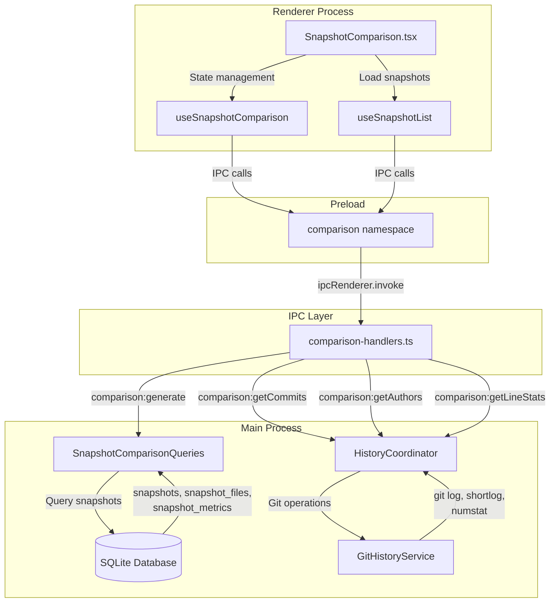
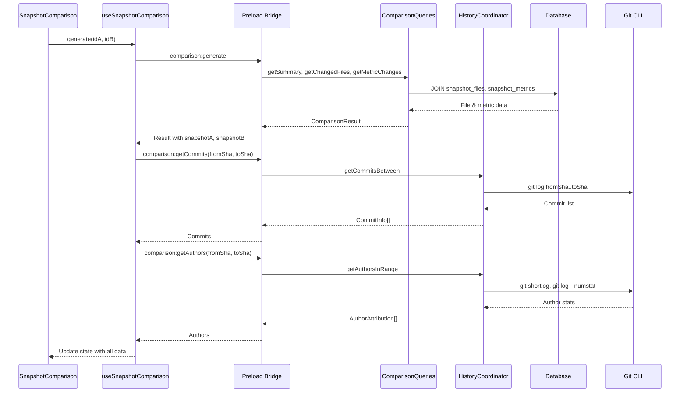

# Snapshot Comparison with Git Context

## Summary

This phase implements cross-snapshot comparison with full git context, enabling users to understand exactly what changes caused metric shifts between any two snapshots. It extends the existing SnapshotService with commit range queries and builds a new comparison page with DatePicker-based snapshot selection, side-by-side score comparison, tabbed views for File Changes / Git Context / Recommendations, and drill-down to commit-level attribution.

The UX spec is in `round-two/15-snapshot-comparison-git-context.md` and defines the exact component composition, layout, and interaction patterns.

## Prerequisites

- Phase 24 (Git Status Awareness) complete: GitStatusService, DB migration v5, shared types
- Existing SnapshotService with `createSnapshot()` and basic `compareSnapshots()`
- Existing history coordinator and git-history-service
- DatePicker component available in `@vipr/ui`

## Architecture



### Data Flow



## Existing Infrastructure

| File                                                         | What to Reuse                                                                 |
| ------------------------------------------------------------ | ----------------------------------------------------------------------------- |
| `clients/desktop/src/main/analysis/snapshot-service.ts`      | `SnapshotService.compareSnapshots()` - extend with richer data, don't replace |
| `clients/desktop/src/main/history/history-coordinator.ts`    | History operations. Extend with `getCommitsBetween()`                         |
| `packages/history/src/git-history-service.ts`                | `getCommits()` with date range filters, `CommitInfo` type                     |
| `clients/desktop/src/main/ipc/handlers/snapshots.ts`         | Existing snapshot IPC pattern                                                 |
| `clients/desktop/src/main/ipc/handlers/history.ts`           | History IPC pattern                                                           |
| `clients/desktop/src/preload/index.ts`                       | Preload pattern with zod validation                                           |
| `clients/desktop/src/shared/ipc-types.ts`                    | `ViprDesktopAPI` interface to extend                                          |
| `clients/desktop/src/main/db/database-service.ts`            | Database query patterns                                                       |
| `clients/desktop/src/renderer/components/layout/Sidebar.tsx` | NavItem pattern for adding route                                              |
| `clients/desktop/src/renderer/pages/Budgets.tsx`             | Page layout pattern (Sidebar + Titlebar + main)                               |

## Database Schema Reference

Existing schema from migration v5:

```sql
-- snapshots table
CREATE TABLE snapshots (
  id INTEGER PRIMARY KEY AUTOINCREMENT,
  created_at TEXT NOT NULL,
  git_sha TEXT,
  git_branch TEXT,
  git_is_dirty BOOLEAN,
  git_uncommitted_count INTEGER,
  health_score REAL NOT NULL,
  total_files INTEGER NOT NULL,
  workspace_id INTEGER REFERENCES workspaces(id) ON DELETE CASCADE
);

-- snapshot_files table (optimized for comparison queries)
CREATE TABLE snapshot_files (
  snapshot_id INTEGER NOT NULL REFERENCES snapshots(id) ON DELETE CASCADE,
  file_id INTEGER NOT NULL REFERENCES files(id) ON DELETE CASCADE,
  health_score REAL NOT NULL,
  PRIMARY KEY (snapshot_id, file_id)
);

-- Covering index for efficient comparison joins
CREATE INDEX idx_snapshot_files_covering
  ON snapshot_files(snapshot_id, file_id, health_score);

-- snapshot_metrics table
CREATE TABLE snapshot_metrics (
  snapshot_id INTEGER NOT NULL REFERENCES snapshots(id) ON DELETE CASCADE,
  plugin_id TEXT NOT NULL,
  avg_score REAL NOT NULL,
  file_count INTEGER NOT NULL,
  PRIMARY KEY (snapshot_id, plugin_id)
);
```

## Type Definitions

### Shared Types (ipc-types.ts)

```typescript
// Comparison result structure
export interface ComparisonResult {
  summary: ComparisonSummary;
  changedFiles: ComparisonFile[];
  metricChanges: MetricChange[];
  snapshotA: Snapshot;
  snapshotB: Snapshot;
}

export interface ComparisonSummary {
  filesChanged: number;
  filesAdded: number;
  filesRemoved: number;
  filesImproved: number;
  filesDegraded: number;
  scoreChange: number;
  healthBefore: number;
  healthAfter: number;
}

export interface ComparisonFile {
  filePath: string;
  fileId: number;
  scoreBefore: number | null;
  scoreAfter: number | null;
  delta: number;
  status: 'improved' | 'degraded' | 'unchanged' | 'added' | 'removed';
}

export interface MetricChange {
  pluginId: string;
  avgScoreBefore: number | null;
  avgScoreAfter: number | null;
  fileCountBefore: number;
  fileCountAfter: number;
  delta: number;
}

export interface AuthorAttribution {
  name: string;
  email: string;
  commitCount: number;
  linesAdded: number;
  linesRemoved: number;
  filesChanged: number;
}

export interface LineStats {
  totalAdded: number;
  totalRemoved: number;
  netChange: number;
}

export interface Snapshot {
  id: number;
  created_at: string;
  git_sha: string | null;
  git_branch: string | null;
  git_is_dirty: boolean;
  git_uncommitted_count: number;
  health_score: number;
  total_files: number;
  workspace_id: number;
}
```

### API Extension

```typescript
// Add to ViprDesktopAPI in ipc-types.ts
export interface ViprDesktopAPI {
  // ... existing namespaces
  comparison: {
    generate(payload: { snapshotIdA: number; snapshotIdB: number }): Promise<ComparisonResult>;

    getCommits(payload: { fromSha: string; toSha: string }): Promise<CommitInfo[]>;

    getAuthors(payload: { fromSha: string; toSha: string }): Promise<AuthorAttribution[]>;

    getLineStats(payload: { fromSha: string; toSha: string }): Promise<LineStats>;
  };
}
```

## Implementation Tasks

### Task 01: Snapshot Comparison Query Service

**Agent**: typescript-engineer
**File**: Create `clients/desktop/src/main/analysis/snapshot-comparison-queries.ts`
**Pattern**: Follow query patterns in `database-service.ts`
**Dependencies**: None (uses existing DB schema)

Create efficient SQL queries for cross-snapshot comparison:

```typescript
import { Database } from 'better-sqlite3';
import type { DatabaseService } from '../db/database-service';
import type { ComparisonSummary, ComparisonFile, MetricChange } from '../../shared/ipc-types';

export class SnapshotComparisonQueries {
  constructor(private readonly db: DatabaseService) {}

  /**
   * Get files that changed between two snapshots with score deltas.
   * Uses covering index idx_snapshot_files_covering for optimal performance.
   */
  getChangedFiles(snapshotIdA: number, snapshotIdB: number): ComparisonFile[] {
    const query = `
      SELECT
        COALESCE(a.file_id, b.file_id) as fileId,
        f.path as filePath,
        a.health_score as scoreBefore,
        b.health_score as scoreAfter,
        CASE
          WHEN a.health_score IS NULL THEN b.health_score
          WHEN b.health_score IS NULL THEN -a.health_score
          ELSE b.health_score - a.health_score
        END as delta,
        CASE
          WHEN a.health_score IS NULL THEN 'added'
          WHEN b.health_score IS NULL THEN 'removed'
          WHEN b.health_score > a.health_score THEN 'improved'
          WHEN b.health_score < a.health_score THEN 'degraded'
          ELSE 'unchanged'
        END as status
      FROM snapshot_files a
      FULL OUTER JOIN snapshot_files b
        ON a.file_id = b.file_id
        AND b.snapshot_id = ?
      JOIN files f ON f.id = COALESCE(a.file_id, b.file_id)
      WHERE a.snapshot_id = ? OR b.snapshot_id = ?
      ORDER BY ABS(delta) DESC, filePath ASC
    `;

    const rows = this.db.getDatabase().prepare(query).all(snapshotIdB, snapshotIdA, snapshotIdB);

    return rows.map((row: any) => ({
      fileId: row.fileId,
      filePath: row.filePath,
      scoreBefore: row.scoreBefore,
      scoreAfter: row.scoreAfter,
      delta: row.delta,
      status: row.status,
    }));
  }

  /**
   * Get per-plugin metric changes between snapshots.
   */
  getMetricChanges(snapshotIdA: number, snapshotIdB: number): MetricChange[] {
    const query = `
      SELECT
        COALESCE(a.plugin_id, b.plugin_id) as pluginId,
        a.avg_score as avgScoreBefore,
        b.avg_score as avgScoreAfter,
        COALESCE(a.file_count, 0) as fileCountBefore,
        COALESCE(b.file_count, 0) as fileCountAfter,
        CASE
          WHEN a.avg_score IS NULL THEN b.avg_score
          WHEN b.avg_score IS NULL THEN -a.avg_score
          ELSE b.avg_score - a.avg_score
        END as delta
      FROM snapshot_metrics a
      FULL OUTER JOIN snapshot_metrics b
        ON a.plugin_id = b.plugin_id
        AND b.snapshot_id = ?
      WHERE a.snapshot_id = ? OR b.snapshot_id = ?
      ORDER BY ABS(delta) DESC, pluginId ASC
    `;

    const rows = this.db.getDatabase().prepare(query).all(snapshotIdB, snapshotIdA, snapshotIdB);

    return rows.map((row: any) => ({
      pluginId: row.pluginId,
      avgScoreBefore: row.avgScoreBefore,
      avgScoreAfter: row.avgScoreAfter,
      fileCountBefore: row.fileCountBefore,
      fileCountAfter: row.fileCountAfter,
      delta: row.delta,
    }));
  }

  /**
   * Get aggregate summary of changes between snapshots.
   */
  getSummary(snapshotIdA: number, snapshotIdB: number): ComparisonSummary {
    const changedFiles = this.getChangedFiles(snapshotIdA, snapshotIdB);

    const filesChanged = changedFiles.filter(
      f => f.status === 'improved' || f.status === 'degraded' || f.status === 'unchanged'
    ).length;

    const filesAdded = changedFiles.filter(f => f.status === 'added').length;
    const filesRemoved = changedFiles.filter(f => f.status === 'removed').length;
    const filesImproved = changedFiles.filter(f => f.status === 'improved').length;
    const filesDegraded = changedFiles.filter(f => f.status === 'degraded').length;

    // Get snapshot health scores
    const snapshotQuery = `
      SELECT id, health_score
      FROM snapshots
      WHERE id IN (?, ?)
      ORDER BY id
    `;
    const snapshots = this.db
      .getDatabase()
      .prepare(snapshotQuery)
      .all(snapshotIdA, snapshotIdB) as Array<{ id: number; health_score: number }>;

    const healthBefore = snapshots.find(s => s.id === snapshotIdA)?.health_score ?? 0;
    const healthAfter = snapshots.find(s => s.id === snapshotIdB)?.health_score ?? 0;
    const scoreChange = healthAfter - healthBefore;

    return {
      filesChanged,
      filesAdded,
      filesRemoved,
      filesImproved,
      filesDegraded,
      scoreChange,
      healthBefore,
      healthAfter,
    };
  }
}
```

**SQL Optimization Notes**:

- Use `FULL OUTER JOIN` to detect added/removed files in a single query
- `idx_snapshot_files_covering` index covers `(snapshot_id, file_id, health_score)` for efficient lookups
- Delta calculation handles NULL values for added/removed files
- Status classification uses CASE expression to avoid multiple queries

**Verification**:

```typescript
// Test with known snapshot IDs
const queries = new SnapshotComparisonQueries(db);
const summary = queries.getSummary(1, 2);
console.assert(summary.filesChanged >= 0);
console.assert(summary.healthBefore <= 100 && summary.healthAfter <= 100);
```

### Task 02: Extend HistoryCoordinator with Commit Range Queries

**Agent**: typescript-engineer
**File**: Modify `clients/desktop/src/main/history/history-coordinator.ts`
**Pattern**: Follow existing `getCommits()` method
**Dependencies**: None

Add methods to query git history between two commits:

```typescript
import type { CommitInfo } from '@vipr/history';
import type { AuthorAttribution, LineStats } from '../../shared/ipc-types';

export class HistoryCoordinator {
  // ... existing methods

  /**
   * Get commits between two SHAs (exclusive of fromSha, inclusive of toSha).
   * Uses git log with range syntax: fromSha..toSha
   */
  async getCommitsBetween(fromSha: string, toSha: string): Promise<CommitInfo[]> {
    const range = `${fromSha}..${toSha}`;

    // Use existing git history service with custom args
    const result = await this.gitHistoryService.exec([
      'log',
      range,
      '--format=%H%n%an%n%ae%n%at%n%s',
      '--no-merges', // Exclude merge commits for cleaner view
    ]);

    if (!result.success || !result.stdout) {
      return [];
    }

    return this.parseCommitLog(result.stdout);
  }

  /**
   * Get author attribution for a SHA range.
   * Aggregates commit counts and line change statistics per author.
   */
  async getAuthorsInRange(fromSha: string, toSha: string): Promise<AuthorAttribution[]> {
    const range = `${fromSha}..${toSha}`;

    // Get commit counts per author
    const shortlogResult = await this.gitHistoryService.exec([
      'shortlog',
      '-sne', // summary, numbered, email
      range,
      '--no-merges',
    ]);

    if (!shortlogResult.success || !shortlogResult.stdout) {
      return [];
    }

    // Parse: "    5  Author Name <email@example.com>"
    const commitCounts = new Map<string, { name: string; email: string; count: number }>();
    const lines = shortlogResult.stdout.trim().split('\n');

    for (const line of lines) {
      const match = line.match(/^\s*(\d+)\s+(.+?)\s+<(.+?)>$/);
      if (match) {
        const [, count, name, email] = match;
        commitCounts.set(email, { name, email, count: parseInt(count, 10) });
      }
    }

    // Get line change statistics per author
    const numstatResult = await this.gitHistoryService.exec([
      'log',
      range,
      '--numstat',
      '--format=%ae', // Author email as delimiter
      '--no-merges',
    ]);

    const lineStats = new Map<string, { added: number; removed: number; files: Set<string> }>();

    if (numstatResult.success && numstatResult.stdout) {
      let currentEmail = '';
      const statLines = numstatResult.stdout.trim().split('\n');

      for (const line of statLines) {
        // Author email line
        if (line.match(/^[^\s]+@[^\s]+$/)) {
          currentEmail = line;
          if (!lineStats.has(currentEmail)) {
            lineStats.set(currentEmail, { added: 0, removed: 0, files: new Set() });
          }
        }
        // Numstat line: "added removed filename"
        else if (currentEmail && line.match(/^\d+\s+\d+\s+/)) {
          const [added, removed, filename] = line.split(/\s+/);
          const stats = lineStats.get(currentEmail)!;
          stats.added += parseInt(added, 10) || 0;
          stats.removed += parseInt(removed, 10) || 0;
          stats.files.add(filename);
        }
      }
    }

    // Combine commit counts with line stats
    const authors: AuthorAttribution[] = [];

    for (const [email, { name, count }] of commitCounts.entries()) {
      const stats = lineStats.get(email) ?? { added: 0, removed: 0, files: new Set() };

      authors.push({
        name,
        email,
        commitCount: count,
        linesAdded: stats.added,
        linesRemoved: stats.removed,
        filesChanged: stats.files.size,
      });
    }

    // Sort by impact (commit count + line changes)
    return authors.sort((a, b) => {
      const impactA = a.commitCount + (a.linesAdded + a.linesRemoved) / 100;
      const impactB = b.commitCount + (b.linesAdded + b.linesRemoved) / 100;
      return impactB - impactA;
    });
  }

  /**
   * Get aggregate line count statistics for a SHA range.
   */
  async getLineStats(fromSha: string, toSha: string): Promise<LineStats> {
    const range = `${fromSha}..${toSha}`;

    const result = await this.gitHistoryService.exec([
      'log',
      range,
      '--numstat',
      '--format=', // Empty format to only get numstat output
      '--no-merges',
    ]);

    if (!result.success || !result.stdout) {
      return { totalAdded: 0, totalRemoved: 0, netChange: 0 };
    }

    let totalAdded = 0;
    let totalRemoved = 0;

    const lines = result.stdout.trim().split('\n');
    for (const line of lines) {
      const match = line.match(/^(\d+)\s+(\d+)/);
      if (match) {
        totalAdded += parseInt(match[1], 10);
        totalRemoved += parseInt(match[2], 10);
      }
    }

    return {
      totalAdded,
      totalRemoved,
      netChange: totalAdded - totalRemoved,
    };
  }

  /**
   * Helper to parse git log output into CommitInfo objects.
   * Format: hash\nauthor\nemail\ntimestamp\nsubject
   */
  private parseCommitLog(output: string): CommitInfo[] {
    const commits: CommitInfo[] = [];
    const lines = output.trim().split('\n');

    for (let i = 0; i < lines.length; i += 5) {
      if (i + 4 >= lines.length) break;

      commits.push({
        hash: lines[i],
        author: lines[i + 1],
        email: lines[i + 2],
        date: new Date(parseInt(lines[i + 3], 10) * 1000).toISOString(),
        message: lines[i + 4],
      });
    }

    return commits;
  }
}
```

**Git Command Reference**:

- `fromSha..toSha` - Range syntax gets commits reachable from toSha but not from fromSha
- `--no-merges` - Exclude merge commits for cleaner attribution
- `shortlog -sne` - Summary with commit counts, numbered, with email
- `--numstat` - Show added/removed line counts per file
- `--format=%ae` - Use author email as delimiter in log output

**Verification**:

```bash
# Test git commands manually
git log HEAD~10..HEAD --format="%H %an %s" --no-merges
git shortlog -sne HEAD~10..HEAD
git log HEAD~10..HEAD --numstat --format=%ae
```

### Task 03: Comparison IPC Handlers

**Agent**: typescript-engineer
**File**: Create `clients/desktop/src/main/ipc/handlers/comparison.ts`
**Pattern**: Follow `clients/desktop/src/main/ipc/handlers/snapshots.ts`
**Dependencies**: Task 01, Task 02

Register IPC handlers for comparison operations:

```typescript
import { ipcMain } from 'electron';
import { z } from 'zod';
import type { DatabaseService } from '../../db/database-service';
import type { HistoryCoordinator } from '../../history/history-coordinator';
import { SnapshotComparisonQueries } from '../../analysis/snapshot-comparison-queries';
import type { ComparisonResult } from '../../../shared/ipc-types';

export function registerComparisonHandlers(
  db: DatabaseService,
  historyCoordinator: HistoryCoordinator
) {
  const queries = new SnapshotComparisonQueries(db);

  /**
   * Generate full comparison between two snapshots.
   */
  ipcMain.handle('comparison:generate', async (_event, payload) => {
    const { snapshotIdA, snapshotIdB } = z
      .object({
        snapshotIdA: z.number().int().positive(),
        snapshotIdB: z.number().int().positive(),
      })
      .parse(payload);

    // Get comparison data
    const summary = queries.getSummary(snapshotIdA, snapshotIdB);
    const changedFiles = queries.getChangedFiles(snapshotIdA, snapshotIdB);
    const metricChanges = queries.getMetricChanges(snapshotIdA, snapshotIdB);

    // Get snapshot records for git context
    const snapshotQuery = db.getDatabase().prepare(`
      SELECT * FROM snapshots WHERE id IN (?, ?)
    `);
    const snapshots = snapshotQuery.all(snapshotIdA, snapshotIdB) as any[];

    const snapshotA = snapshots.find(s => s.id === snapshotIdA);
    const snapshotB = snapshots.find(s => s.id === snapshotIdB);

    if (!snapshotA || !snapshotB) {
      throw new Error('One or both snapshots not found');
    }

    const result: ComparisonResult = {
      summary,
      changedFiles,
      metricChanges,
      snapshotA,
      snapshotB,
    };

    return result;
  });

  /**
   * Get commits between two git SHAs.
   */
  ipcMain.handle('comparison:getCommits', async (_event, payload) => {
    const { fromSha, toSha } = z
      .object({
        fromSha: z.string().min(7),
        toSha: z.string().min(7),
      })
      .parse(payload);

    return historyCoordinator.getCommitsBetween(fromSha, toSha);
  });

  /**
   * Get author attribution for a SHA range.
   */
  ipcMain.handle('comparison:getAuthors', async (_event, payload) => {
    const { fromSha, toSha } = z
      .object({
        fromSha: z.string().min(7),
        toSha: z.string().min(7),
      })
      .parse(payload);

    return historyCoordinator.getAuthorsInRange(fromSha, toSha);
  });

  /**
   * Get line change statistics for a SHA range.
   */
  ipcMain.handle('comparison:getLineStats', async (_event, payload) => {
    const { fromSha, toSha } = z
      .object({
        fromSha: z.string().min(7),
        toSha: z.string().min(7),
      })
      .parse(payload);

    return historyCoordinator.getLineStats(fromSha, toSha);
  });
}
```

**Registration**:
Call `registerComparisonHandlers(db, historyCoordinator)` in main process initialization, after database and history coordinator are set up.

**Error Handling**:

- Zod validation throws on invalid payload
- Missing snapshots throw descriptive error
- Git operation failures return empty arrays (graceful degradation)

**Verification**:

```typescript
// In main process init
registerComparisonHandlers(db, historyCoordinator);

// Test from renderer
const result = await window.vipr.comparison.generate({ snapshotIdA: 1, snapshotIdB: 2 });
console.assert(result.summary);
console.assert(Array.isArray(result.changedFiles));
```

### Task 04: Extend Preload and Types for Comparison Namespace

**Agent**: typescript-engineer
**Files**: Modify `clients/desktop/src/preload/index.ts`, modify `clients/desktop/src/shared/ipc-types.ts`
**Pattern**: Follow existing `snapshots` namespace pattern
**Dependencies**: Task 03

1. **Add types to `ipc-types.ts`**:

```typescript
// Add to existing type definitions
export interface ComparisonResult {
  summary: ComparisonSummary;
  changedFiles: ComparisonFile[];
  metricChanges: MetricChange[];
  snapshotA: Snapshot;
  snapshotB: Snapshot;
}

export interface ComparisonSummary {
  filesChanged: number;
  filesAdded: number;
  filesRemoved: number;
  filesImproved: number;
  filesDegraded: number;
  scoreChange: number;
  healthBefore: number;
  healthAfter: number;
}

export interface ComparisonFile {
  filePath: string;
  fileId: number;
  scoreBefore: number | null;
  scoreAfter: number | null;
  delta: number;
  status: 'improved' | 'degraded' | 'unchanged' | 'added' | 'removed';
}

export interface MetricChange {
  pluginId: string;
  avgScoreBefore: number | null;
  avgScoreAfter: number | null;
  fileCountBefore: number;
  fileCountAfter: number;
  delta: number;
}

export interface AuthorAttribution {
  name: string;
  email: string;
  commitCount: number;
  linesAdded: number;
  linesRemoved: number;
  filesChanged: number;
}

export interface LineStats {
  totalAdded: number;
  totalRemoved: number;
  netChange: number;
}

// Extend ViprDesktopAPI interface
export interface ViprDesktopAPI {
  // ... existing namespaces (workspaces, analysis, snapshots, etc.)

  comparison: {
    generate(payload: { snapshotIdA: number; snapshotIdB: number }): Promise<ComparisonResult>;

    getCommits(payload: { fromSha: string; toSha: string }): Promise<CommitInfo[]>;

    getAuthors(payload: { fromSha: string; toSha: string }): Promise<AuthorAttribution[]>;

    getLineStats(payload: { fromSha: string; toSha: string }): Promise<LineStats>;
  };
}
```

2. **Implement preload bridge in `preload/index.ts`**:

```typescript
import { contextBridge, ipcRenderer } from 'electron';
import type { ViprDesktopAPI } from '../shared/ipc-types';

const api: ViprDesktopAPI = {
  // ... existing namespaces

  comparison: {
    generate: payload => ipcRenderer.invoke('comparison:generate', payload),

    getCommits: payload => ipcRenderer.invoke('comparison:getCommits', payload),

    getAuthors: payload => ipcRenderer.invoke('comparison:getAuthors', payload),

    getLineStats: payload => ipcRenderer.invoke('comparison:getLineStats', payload),
  },
};

contextBridge.exposeInMainWorld('vipr', api);
```

**Type Safety**:

- Zod validates payload structure in main process
- TypeScript enforces return types match API interface
- Runtime errors throw with descriptive messages

**Verification**:

```typescript
// TypeScript compilation check
const result: ComparisonResult = await window.vipr.comparison.generate({
  snapshotIdA: 1,
  snapshotIdB: 2,
});

// Type error if wrong payload:
// @ts-expect-error - missing required fields
await window.vipr.comparison.generate({ snapshotIdA: 1 });
```

### Task 05: useSnapshotComparison Hook

**Agent**: react-engineer
**File**: Create `clients/desktop/src/renderer/hooks/useSnapshotComparison.ts`
**Pattern**: Follow existing hook patterns in renderer
**Dependencies**: Task 04

```typescript
import { useState, useCallback } from 'react';
import type {
  ComparisonResult,
  CommitInfo,
  AuthorAttribution,
  LineStats,
  Snapshot,
} from '../../shared/ipc-types';

export interface UseSnapshotComparisonReturn {
  snapshotA: Snapshot | null;
  snapshotB: Snapshot | null;
  comparison: ComparisonResult | null;
  commits: CommitInfo[];
  authors: AuthorAttribution[];
  lineStats: LineStats | null;
  isLoading: boolean;
  error: string | null;
  generate: (idA: number, idB: number) => Promise<void>;
  swap: () => void;
  reset: () => void;
}

export function useSnapshotComparison(): UseSnapshotComparisonReturn {
  const [snapshotA, setSnapshotA] = useState<Snapshot | null>(null);
  const [snapshotB, setSnapshotB] = useState<Snapshot | null>(null);
  const [comparison, setComparison] = useState<ComparisonResult | null>(null);
  const [commits, setCommits] = useState<CommitInfo[]>([]);
  const [authors, setAuthors] = useState<AuthorAttribution[]>([]);
  const [lineStats, setLineStats] = useState<LineStats | null>(null);
  const [isLoading, setIsLoading] = useState(false);
  const [error, setError] = useState<string | null>(null);

  const generate = useCallback(async (idA: number, idB: number) => {
    setIsLoading(true);
    setError(null);

    try {
      // Generate comparison data
      const result = await window.vipr.comparison.generate({
        snapshotIdA: idA,
        snapshotIdB: idB,
      });

      setComparison(result);
      setSnapshotA(result.snapshotA);
      setSnapshotB(result.snapshotB);

      // Load git context if both snapshots have SHAs
      if (result.snapshotA.git_sha && result.snapshotB.git_sha) {
        const [commitData, authorData, statsData] = await Promise.all([
          window.vipr.comparison.getCommits({
            fromSha: result.snapshotA.git_sha,
            toSha: result.snapshotB.git_sha,
          }),
          window.vipr.comparison.getAuthors({
            fromSha: result.snapshotA.git_sha,
            toSha: result.snapshotB.git_sha,
          }),
          window.vipr.comparison.getLineStats({
            fromSha: result.snapshotA.git_sha,
            toSha: result.snapshotB.git_sha,
          }),
        ]);

        setCommits(commitData);
        setAuthors(authorData);
        setLineStats(statsData);
      } else {
        // Clear git context if SHAs unavailable
        setCommits([]);
        setAuthors([]);
        setLineStats(null);
      }
    } catch (err) {
      const errorMessage = err instanceof Error ? err.message : String(err);
      setError(errorMessage);

      // Clear all state on error
      setComparison(null);
      setSnapshotA(null);
      setSnapshotB(null);
      setCommits([]);
      setAuthors([]);
      setLineStats(null);
    } finally {
      setIsLoading(false);
    }
  }, []);

  const swap = useCallback(() => {
    if (snapshotA && snapshotB) {
      generate(snapshotB.id, snapshotA.id);
    }
  }, [snapshotA, snapshotB, generate]);

  const reset = useCallback(() => {
    setSnapshotA(null);
    setSnapshotB(null);
    setComparison(null);
    setCommits([]);
    setAuthors([]);
    setLineStats(null);
    setError(null);
  }, []);

  return {
    snapshotA,
    snapshotB,
    comparison,
    commits,
    authors,
    lineStats,
    isLoading,
    error,
    generate,
    swap,
    reset,
  };
}
```

**Hook Responsibilities**:

- State management for comparison data and git context
- Parallel loading of commits, authors, and line stats
- Error handling with fallback to empty state
- Swap functionality to reverse comparison direction
- Reset for clearing all state

**Loading Strategy**:

- Initial comparison load with `comparison:generate`
- Parallel git context load only if both snapshots have SHAs
- Loading state covers entire operation
- Error clears all data to prevent inconsistent state

**Verification**:

```typescript
// In component
const { generate, comparison, isLoading, error } = useSnapshotComparison();

useEffect(() => {
  generate(1, 2);
}, []);

if (isLoading) return <div>Loading...</div>;
if (error) return <div>Error: {error}</div>;
if (!comparison) return <div>No comparison</div>;
```

### Task 06: useSnapshotList Hook

**Agent**: react-engineer
**File**: Create `clients/desktop/src/renderer/hooks/useSnapshotList.ts`
**Pattern**: Simple data-fetching hook
**Dependencies**: None (uses existing snapshots API)

```typescript
import { useState, useEffect } from 'react';
import type { Snapshot } from '../../shared/ipc-types';

export interface UseSnapshotListReturn {
  snapshots: Snapshot[];
  isLoading: boolean;
  error: string | null;
  refresh: () => Promise<void>;
}

export function useSnapshotList(): UseSnapshotListReturn {
  const [snapshots, setSnapshots] = useState<Snapshot[]>([]);
  const [isLoading, setIsLoading] = useState(true);
  const [error, setError] = useState<string | null>(null);

  const loadSnapshots = async () => {
    setIsLoading(true);
    setError(null);

    try {
      const data = await window.vipr.snapshots.list();
      setSnapshots(data);
    } catch (err) {
      const errorMessage = err instanceof Error ? err.message : String(err);
      setError(errorMessage);
      setSnapshots([]);
    } finally {
      setIsLoading(false);
    }
  };

  useEffect(() => {
    loadSnapshots();
  }, []);

  return {
    snapshots,
    isLoading,
    error,
    refresh: loadSnapshots,
  };
}
```

**Usage**:
Provides the list of available snapshots for DatePicker selection. Snapshots sorted by date (most recent first).

**Verification**:

```typescript
const { snapshots, isLoading } = useSnapshotList();

// Snapshots available for date picker
const dates = snapshots.map(s => new Date(s.created_at));
```

### Task 07: SnapshotComparison Page Component

**Agent**: react-engineer
**File**: Create `clients/desktop/src/renderer/pages/SnapshotComparison.tsx`
**Pattern**: Follow page layout from `Budgets.tsx` (Sidebar + Titlebar + main)
**Dependencies**: Task 05, Task 06

Build the full comparison page following the UX spec in `round-two/15-snapshot-comparison-git-context.md`:

```typescript
import { useState, useMemo } from 'react';
import { ArrowRightIcon, SwapHorizontalIcon, ExportIcon } from '@vipr/ui/icons';
import { DatePicker } from '@vipr/ui/datepicker';
import { StatCard } from '@vipr/ui/stat-card';
import { StatsRow } from '@vipr/ui/stats-row';
import { Tabs } from '@vipr/ui/tabs';
import { CardTable } from '@vipr/ui/card-table';
import { StripedTable } from '@vipr/ui/striped-table';
import { Badge } from '@vipr/ui/badge';
import { Button } from '@vipr/ui/button';
import { Alert } from '@vipr/ui/alert';
import { Dropdown } from '@vipr/ui/dropdown';
import { ErrorDisplay } from '@vipr/ui/error-display';
import { useSnapshotComparison } from '../hooks/useSnapshotComparison';
import { useSnapshotList } from '../hooks/useSnapshotList';
import type { ComparisonFile, CommitInfo, AuthorAttribution } from '../../shared/ipc-types';

type FileStatus = 'all' | 'improved' | 'degraded' | 'added' | 'removed' | 'unchanged';

export function SnapshotComparison() {
  const {
    snapshotA,
    snapshotB,
    comparison,
    commits,
    authors,
    lineStats,
    isLoading,
    error,
    generate,
    swap,
  } = useSnapshotComparison();

  const { snapshots } = useSnapshotList();

  const [selectedDateA, setSelectedDateA] = useState<Date | null>(null);
  const [selectedDateB, setSelectedDateB] = useState<Date | null>(null);
  const [fileFilter, setFileFilter] = useState<FileStatus>('all');
  const [activeTab, setActiveTab] = useState<'files' | 'git' | 'recommendations'>('files');

  // Find nearest snapshot to selected date
  const findNearestSnapshot = (date: Date | null) => {
    if (!date || snapshots.length === 0) return null;

    const timestamp = date.getTime();
    let nearest = snapshots[0];
    let minDiff = Math.abs(new Date(nearest.created_at).getTime() - timestamp);

    for (const snapshot of snapshots) {
      const diff = Math.abs(new Date(snapshot.created_at).getTime() - timestamp);
      if (diff < minDiff) {
        minDiff = diff;
        nearest = snapshot;
      }
    }

    return nearest;
  };

  // Trigger comparison when both dates selected
  const handleDateSelection = (type: 'A' | 'B', date: Date | null) => {
    if (type === 'A') {
      setSelectedDateA(date);
      if (date && selectedDateB) {
        const snapshotA = findNearestSnapshot(date);
        const snapshotB = findNearestSnapshot(selectedDateB);
        if (snapshotA && snapshotB) {
          generate(snapshotA.id, snapshotB.id);
        }
      }
    } else {
      setSelectedDateB(date);
      if (date && selectedDateA) {
        const snapshotA = findNearestSnapshot(selectedDateA);
        const snapshotB = findNearestSnapshot(date);
        if (snapshotA && snapshotB) {
          generate(snapshotA.id, snapshotB.id);
        }
      }
    }
  };

  const handleSwap = () => {
    // Swap dates and trigger new comparison
    const tempDate = selectedDateA;
    setSelectedDateA(selectedDateB);
    setSelectedDateB(tempDate);
    swap();
  };

  const handleExport = () => {
    if (!comparison) return;

    const exportData = {
      summary: comparison.summary,
      changedFiles: comparison.changedFiles,
      metricChanges: comparison.metricChanges,
      commits,
      authors,
      lineStats,
    };

    const blob = new Blob([JSON.stringify(exportData, null, 2)], {
      type: 'application/json',
    });
    const url = URL.createObjectURL(blob);
    const a = document.createElement('a');
    a.href = url;
    a.download = `snapshot-comparison-${snapshotA?.id}-${snapshotB?.id}.json`;
    a.click();
    URL.revokeObjectURL(url);
  };

  // Filter files by status
  const filteredFiles = useMemo(() => {
    if (!comparison) return [];
    if (fileFilter === 'all') return comparison.changedFiles;
    return comparison.changedFiles.filter(f => f.status === fileFilter);
  }, [comparison, fileFilter]);

  // Format delta for display
  const formatDelta = (delta: number): string => {
    const sign = delta > 0 ? '+' : '';
    return `${sign}${delta.toFixed(1)}`;
  };

  // Get badge variant for status
  const getStatusBadge = (status: ComparisonFile['status']) => {
    const variants: Record<ComparisonFile['status'], { label: string; variant: string }> = {
      improved: { label: 'Improved', variant: 'success' },
      degraded: { label: 'Degraded', variant: 'danger' },
      unchanged: { label: 'Unchanged', variant: 'secondary' },
      added: { label: 'Added', variant: 'info' },
      removed: { label: 'Removed', variant: 'warning' },
    };

    return variants[status];
  };

  if (error) {
    return (
      <div className="flex h-screen">
        <div className="flex-1 flex flex-col">
          <div className="flex-1 p-6">
            <ErrorDisplay
              variant="centered"
              title="Comparison Error"
              message={error}
            />
          </div>
        </div>
      </div>
    );
  }

  return (
    <div className="flex h-screen">
      <div className="flex-1 flex flex-col overflow-hidden">
        {/* Page header */}
        <div className="flex-none border-b border-gray-200 dark:border-gray-700 bg-white dark:bg-gray-800 px-6 py-4">
          <h1 className="text-2xl font-semibold text-gray-900 dark:text-white">
            Snapshot Comparison
          </h1>
          <p className="mt-1 text-sm text-gray-500 dark:text-gray-400">
            Compare metrics and changes between any two snapshots
          </p>
        </div>

        {/* Scrollable content */}
        <div className="flex-1 overflow-y-auto">
          <div className="p-6 space-y-6">
            {/* Snapshot selectors */}
            <div className="grid grid-cols-12 gap-4 items-center">
              <div className="col-span-5">
                <label className="block text-sm font-medium text-gray-700 dark:text-gray-300 mb-2">
                  Before
                </label>
                <DatePicker
                  selected={selectedDateA}
                  onChange={(date) => handleDateSelection('A', date)}
                  placeholderText="Select snapshot date"
                  className="w-full"
                />
                {snapshotA && (
                  <p className="mt-1 text-xs text-gray-500 dark:text-gray-400">
                    {snapshotA.git_branch} • {snapshotA.git_sha?.slice(0, 7)}
                  </p>
                )}
              </div>

              <div className="col-span-2 flex justify-center">
                <Button
                  variant="ghost"
                  size="sm"
                  onClick={handleSwap}
                  disabled={!snapshotA || !snapshotB}
                  icon={SwapHorizontalIcon}
                >
                  Swap
                </Button>
              </div>

              <div className="col-span-5">
                <label className="block text-sm font-medium text-gray-700 dark:text-gray-300 mb-2">
                  After
                </label>
                <DatePicker
                  selected={selectedDateB}
                  onChange={(date) => handleDateSelection('B', date)}
                  placeholderText="Select snapshot date"
                  className="w-full"
                />
                {snapshotB && (
                  <p className="mt-1 text-xs text-gray-500 dark:text-gray-400">
                    {snapshotB.git_branch} • {snapshotB.git_sha?.slice(0, 7)}
                  </p>
                )}
              </div>
            </div>

            {/* Loading state */}
            {isLoading && (
              <Alert variant="banner" type="info">
                Generating comparison...
              </Alert>
            )}

            {/* Comparison results */}
            {comparison && (
              <>
                {/* Side-by-side score display */}
                <div className="grid grid-cols-12 gap-4 items-center">
                  <div className="col-span-5">
                    <StatCard
                      variant="compact"
                      label="Before"
                      value={comparison.summary.healthBefore.toFixed(1)}
                      unit="health"
                    />
                  </div>

                  <div className="col-span-2 flex justify-center">
                    <div className="flex flex-col items-center">
                      <ArrowRightIcon className="w-6 h-6 text-gray-400" />
                      <Badge
                        variant={comparison.summary.scoreChange >= 0 ? 'success' : 'danger'}
                        className="mt-2"
                      >
                        {formatDelta(comparison.summary.scoreChange)}
                      </Badge>
                    </div>
                  </div>

                  <div className="col-span-5">
                    <StatCard
                      variant="compact"
                      label="After"
                      value={comparison.summary.healthAfter.toFixed(1)}
                      unit="health"
                    />
                  </div>
                </div>

                {/* Summary stats */}
                <StatsRow
                  stats={[
                    {
                      label: 'Files Changed',
                      value: comparison.summary.filesChanged.toString(),
                    },
                    {
                      label: 'Added',
                      value: comparison.summary.filesAdded.toString(),
                      variant: 'success',
                    },
                    {
                      label: 'Removed',
                      value: comparison.summary.filesRemoved.toString(),
                      variant: 'warning',
                    },
                    {
                      label: 'Improved',
                      value: comparison.summary.filesImproved.toString(),
                      variant: 'success',
                    },
                    {
                      label: 'Degraded',
                      value: comparison.summary.filesDegraded.toString(),
                      variant: 'danger',
                    },
                    ...(lineStats ? [{
                      label: 'Net Lines',
                      value: lineStats.netChange.toString(),
                      variant: lineStats.netChange >= 0 ? 'info' : 'warning' as const,
                    }] : []),
                    ...(commits.length > 0 ? [{
                      label: 'Commits',
                      value: commits.length.toString(),
                    }] : []),
                    ...(authors.length > 0 ? [{
                      label: 'Authors',
                      value: authors.length.toString(),
                    }] : []),
                  ]}
                />

                {/* Tabbed content */}
                <Tabs
                  value={activeTab}
                  onChange={setActiveTab}
                  variant="underline"
                  tabs={[
                    { value: 'files', label: 'File Changes', count: filteredFiles.length },
                    { value: 'git', label: 'Git Context', count: commits.length },
                    { value: 'recommendations', label: 'Recommendations' },
                  ]}
                />

                {/* File Changes tab */}
                {activeTab === 'files' && (
                  <div className="space-y-4">
                    <div className="flex justify-between items-center">
                      <Dropdown
                        mode="filter"
                        label="Status"
                        value={fileFilter}
                        onChange={(value) => setFileFilter(value as FileStatus)}
                        options={[
                          { value: 'all', label: 'All Files' },
                          { value: 'improved', label: 'Improved' },
                          { value: 'degraded', label: 'Degraded' },
                          { value: 'added', label: 'Added' },
                          { value: 'removed', label: 'Removed' },
                          { value: 'unchanged', label: 'Unchanged' },
                        ]}
                      />

                      <Button
                        variant="secondary"
                        size="sm"
                        onClick={handleExport}
                        icon={ExportIcon}
                      >
                        Export
                      </Button>
                    </div>

                    <CardTable
                      columns={[
                        {
                          key: 'filePath',
                          label: 'File',
                          sortable: true,
                          render: (file: ComparisonFile) => (
                            <span className="font-mono text-sm">{file.filePath}</span>
                          ),
                        },
                        {
                          key: 'scoreBefore',
                          label: 'Before',
                          sortable: true,
                          render: (file: ComparisonFile) => (
                            <span>{file.scoreBefore?.toFixed(1) ?? '-'}</span>
                          ),
                        },
                        {
                          key: 'scoreAfter',
                          label: 'After',
                          sortable: true,
                          render: (file: ComparisonFile) => (
                            <span>{file.scoreAfter?.toFixed(1) ?? '-'}</span>
                          ),
                        },
                        {
                          key: 'delta',
                          label: 'Delta',
                          sortable: true,
                          render: (file: ComparisonFile) => {
                            const badge = getStatusBadge(file.status);
                            return (
                              <Badge variant={badge.variant as any}>
                                {formatDelta(file.delta)}
                              </Badge>
                            );
                          },
                        },
                        {
                          key: 'status',
                          label: 'Status',
                          sortable: true,
                          render: (file: ComparisonFile) => {
                            const badge = getStatusBadge(file.status);
                            return <Badge variant={badge.variant as any}>{badge.label}</Badge>;
                          },
                        },
                      ]}
                      data={filteredFiles}
                      emptyMessage="No files match the selected filter"
                    />
                  </div>
                )}

                {/* Git Context tab */}
                {activeTab === 'git' && (
                  <div className="space-y-6">
                    {commits.length > 0 ? (
                      <>
                        <div>
                          <h3 className="text-lg font-medium text-gray-900 dark:text-white mb-3">
                            Commits
                          </h3>
                          <StripedTable
                            columns={[
                              {
                                key: 'date',
                                label: 'Date',
                                render: (commit: CommitInfo) => (
                                  <span className="text-sm">
                                    {new Date(commit.date).toLocaleDateString()}
                                  </span>
                                ),
                              },
                              {
                                key: 'sha',
                                label: 'SHA',
                                render: (commit: CommitInfo) => (
                                  <code className="text-xs">{commit.hash.slice(0, 7)}</code>
                                ),
                              },
                              {
                                key: 'author',
                                label: 'Author',
                                render: (commit: CommitInfo) => (
                                  <span className="text-sm">{commit.author}</span>
                                ),
                              },
                              {
                                key: 'message',
                                label: 'Message',
                                render: (commit: CommitInfo) => (
                                  <span className="text-sm">{commit.message}</span>
                                ),
                              },
                            ]}
                            data={commits}
                          />
                        </div>

                        {authors.length > 0 && (
                          <div>
                            <h3 className="text-lg font-medium text-gray-900 dark:text-white mb-3">
                              Author Impact
                            </h3>
                            <CardTable
                              columns={[
                                {
                                  key: 'name',
                                  label: 'Author',
                                  sortable: true,
                                  render: (author: AuthorAttribution) => (
                                    <div>
                                      <div className="font-medium">{author.name}</div>
                                      <div className="text-xs text-gray-500">{author.email}</div>
                                    </div>
                                  ),
                                },
                                {
                                  key: 'commitCount',
                                  label: 'Commits',
                                  sortable: true,
                                },
                                {
                                  key: 'linesAdded',
                                  label: 'Lines +',
                                  sortable: true,
                                  render: (author: AuthorAttribution) => (
                                    <Badge variant="success">+{author.linesAdded}</Badge>
                                  ),
                                },
                                {
                                  key: 'linesRemoved',
                                  label: 'Lines -',
                                  sortable: true,
                                  render: (author: AuthorAttribution) => (
                                    <Badge variant="danger">-{author.linesRemoved}</Badge>
                                  ),
                                },
                                {
                                  key: 'filesChanged',
                                  label: 'Files',
                                  sortable: true,
                                },
                              ]}
                              data={authors}
                            />
                          </div>
                        )}
                      </>
                    ) : (
                      <Alert variant="card" type="info">
                        No git context available. Both snapshots must have git SHAs to show commit history.
                      </Alert>
                    )}
                  </div>
                )}

                {/* Recommendations tab */}
                {activeTab === 'recommendations' && (
                  <div className="space-y-4">
                    {comparison.summary.scoreChange < 0 && (
                      <Alert variant="card" type="warning">
                        <strong>Health Score Decreased</strong>
                        <p className="mt-1">
                          The overall health score dropped by {Math.abs(comparison.summary.scoreChange).toFixed(1)} points.
                          Focus on the {comparison.summary.filesDegraded} degraded files to improve quality.
                        </p>
                      </Alert>
                    )}

                    {comparison.summary.scoreChange > 0 && (
                      <Alert variant="card" type="success">
                        <strong>Health Score Improved</strong>
                        <p className="mt-1">
                          Great work! The overall health score improved by {comparison.summary.scoreChange.toFixed(1)} points.
                          {comparison.summary.filesDegraded > 0 && ` However, ${comparison.summary.filesDegraded} files still need attention.`}
                        </p>
                      </Alert>
                    )}

                    {comparison.metricChanges.filter(m => m.delta < -5).length > 0 && (
                      <Alert variant="card" type="danger">
                        <strong>Significant Metric Degradation</strong>
                        <p className="mt-1">
                          The following plugins show significant quality drops:
                        </p>
                        <ul className="mt-2 list-disc list-inside">
                          {comparison.metricChanges
                            .filter(m => m.delta < -5)
                            .map(m => (
                              <li key={m.pluginId}>
                                {m.pluginId}: {formatDelta(m.delta)} points
                              </li>
                            ))}
                        </ul>
                      </Alert>
                    )}

                    {comparison.summary.filesAdded > comparison.summary.filesRemoved && (
                      <Alert variant="card" type="info">
                        <strong>Codebase Growth</strong>
                        <p className="mt-1">
                          Added {comparison.summary.filesAdded} new files. Ensure new code follows quality standards.
                        </p>
                      </Alert>
                    )}

                    {lineStats && Math.abs(lineStats.netChange) > 1000 && (
                      <Alert variant="card" type="warning">
                        <strong>Large Change Volume</strong>
                        <p className="mt-1">
                          This comparison spans {Math.abs(lineStats.netChange).toLocaleString()} net lines of change.
                          Consider breaking down large changes for better quality tracking.
                        </p>
                      </Alert>
                    )}
                  </div>
                )}
              </>
            )}

            {/* Empty state */}
            {!comparison && !isLoading && (
              <Alert variant="card" type="info">
                Select two snapshot dates to generate a comparison
              </Alert>
            )}
          </div>
        </div>
      </div>
    </div>
  );
}
```

**Component Responsibilities**:

- Snapshot selection via DatePicker (finds nearest snapshot)
- Side-by-side score comparison with delta indicator
- Summary statistics row with key metrics
- Tabbed views for File Changes, Git Context, Recommendations
- File filtering and export functionality
- Responsive layout following desktop app patterns

**Color Tokens**:

- Success: `bg-green-500/20 text-green-700 dark:bg-green-500/10 dark:text-green-400`
- Danger: `bg-red-500/20 text-red-700 dark:bg-red-500/10 dark:text-red-400`
- Warning: `bg-yellow-500/20 text-yellow-700 dark:bg-yellow-500/10 dark:text-yellow-400`
- Info: `bg-blue-500/20 text-blue-700 dark:bg-blue-500/10 dark:text-blue-400`

**Verification**:

```typescript
// Navigate to page
router.push('/snapshot-comparison');

// Select dates
// Verify comparison generates
// Verify tabs switch correctly
// Verify file filtering works
// Verify export button downloads JSON
```

### Task 08: Add Route and Sidebar Navigation

**Agent**: react-engineer
**Files**: Modify `clients/desktop/src/renderer/App.tsx`, modify `clients/desktop/src/renderer/components/layout/Sidebar.tsx`
**Pattern**: Follow existing route + NavItem pattern
**Dependencies**: Task 07

1. **Add route in `App.tsx`** (or router config):

```typescript
import { SnapshotComparison } from './pages/SnapshotComparison';

// In router configuration
<Route path="/snapshot-comparison" element={<SnapshotComparison />} />
```

2. **Add NavItem to `Sidebar.tsx`**:

```typescript
import { TimelineVerticalAltIcon } from '@vipr/ui/icons';

// In the Insights section, after Snapshots NavItem
<NavItem
  to="/snapshot-comparison"
  label="Compare"
  icon={TimelineVerticalAltIcon}
  pathname={pathname}
/>
```

**Icon Selection**:
The `TimelineVerticalAltIcon` is already imported in Sidebar.tsx and represents comparison/timeline concepts. If a more appropriate diff/comparison icon exists in the icon set, use that instead.

**Sidebar Organization**:
Place in the Insights section alongside:

- Dashboard
- Files
- Snapshots
- **Compare** (new)
- Trends (if implemented)

**Verification**:

```typescript
// Click "Compare" in sidebar
// Verify navigation to /snapshot-comparison
// Verify active state highlights correctly
// Verify breadcrumb shows "Compare"
```

### Task 09: Snapshot Comparison Unit Tests

**Agent**: vitest-engineer
**File**: Create `clients/desktop/src/main/analysis/snapshot-comparison-queries.test.ts`
**Pattern**: Co-located test file
**Dependencies**: Task 01

```typescript
import { describe, it, expect, beforeEach } from 'vitest';
import Database from 'better-sqlite3';
import { DatabaseService } from '../../db/database-service';
import { SnapshotComparisonQueries } from './snapshot-comparison-queries';

describe('SnapshotComparisonQueries', () => {
  let db: DatabaseService;
  let queries: SnapshotComparisonQueries;
  let snapshotIdA: number;
  let snapshotIdB: number;

  beforeEach(() => {
    // Create in-memory database
    const sqlite = new Database(':memory:');
    db = new DatabaseService(sqlite);
    queries = new SnapshotComparisonQueries(db);

    // Set up test schema
    db.getDatabase().exec(`
      CREATE TABLE files (
        id INTEGER PRIMARY KEY,
        path TEXT NOT NULL
      );

      CREATE TABLE snapshots (
        id INTEGER PRIMARY KEY,
        created_at TEXT NOT NULL,
        health_score REAL NOT NULL,
        total_files INTEGER NOT NULL
      );

      CREATE TABLE snapshot_files (
        snapshot_id INTEGER NOT NULL,
        file_id INTEGER NOT NULL,
        health_score REAL NOT NULL,
        PRIMARY KEY (snapshot_id, file_id)
      );

      CREATE TABLE snapshot_metrics (
        snapshot_id INTEGER NOT NULL,
        plugin_id TEXT NOT NULL,
        avg_score REAL NOT NULL,
        file_count INTEGER NOT NULL,
        PRIMARY KEY (snapshot_id, plugin_id)
      );
    `);

    // Insert test data
    db.getDatabase().exec(`
      INSERT INTO files (id, path) VALUES
        (1, 'src/app.ts'),
        (2, 'src/utils.ts'),
        (3, 'src/config.ts'),
        (4, 'src/new-file.ts');

      INSERT INTO snapshots (id, created_at, health_score, total_files) VALUES
        (1, '2024-01-01T00:00:00Z', 75.5, 3),
        (2, '2024-01-02T00:00:00Z', 82.3, 4);

      INSERT INTO snapshot_files (snapshot_id, file_id, health_score) VALUES
        (1, 1, 80.0),
        (1, 2, 70.0),
        (1, 3, 76.5),
        (2, 1, 85.0),
        (2, 2, 75.0),
        (2, 3, 76.5),
        (2, 4, 90.0);

      INSERT INTO snapshot_metrics (snapshot_id, plugin_id, avg_score, file_count) VALUES
        (1, 'core-cyclomatic', 72.0, 3),
        (1, 'react', 78.0, 2),
        (2, 'core-cyclomatic', 77.0, 4),
        (2, 'react', 85.0, 3);
    `);

    snapshotIdA = 1;
    snapshotIdB = 2;
  });

  describe('getChangedFiles', () => {
    it('returns files with correct deltas', () => {
      const result = queries.getChangedFiles(snapshotIdA, snapshotIdB);

      expect(result).toHaveLength(4);

      const app = result.find(f => f.filePath === 'src/app.ts');
      expect(app).toBeDefined();
      expect(app?.scoreBefore).toBe(80.0);
      expect(app?.scoreAfter).toBe(85.0);
      expect(app?.delta).toBe(5.0);
    });

    it('identifies added files', () => {
      const result = queries.getChangedFiles(snapshotIdA, snapshotIdB);

      const newFile = result.find(f => f.filePath === 'src/new-file.ts');
      expect(newFile).toBeDefined();
      expect(newFile?.status).toBe('added');
      expect(newFile?.scoreBefore).toBeNull();
      expect(newFile?.scoreAfter).toBe(90.0);
    });

    it('identifies removed files', () => {
      // Test reverse comparison to find removed files
      const result = queries.getChangedFiles(snapshotIdB, snapshotIdA);

      const removedFile = result.find(f => f.filePath === 'src/new-file.ts');
      expect(removedFile?.status).toBe('removed');
    });

    it('correctly classifies improved/degraded/unchanged', () => {
      const result = queries.getChangedFiles(snapshotIdA, snapshotIdB);

      const improved = result.find(f => f.filePath === 'src/app.ts');
      expect(improved?.status).toBe('improved');

      const degraded = result.find(f => f.filePath === 'src/utils.ts');
      expect(degraded?.status).toBe('degraded');

      const unchanged = result.find(f => f.filePath === 'src/config.ts');
      expect(unchanged?.status).toBe('unchanged');
    });
  });

  describe('getMetricChanges', () => {
    it('returns per-plugin deltas', () => {
      const result = queries.getMetricChanges(snapshotIdA, snapshotIdB);

      expect(result).toHaveLength(2);

      const cyclomatic = result.find(m => m.pluginId === 'core-cyclomatic');
      expect(cyclomatic).toBeDefined();
      expect(cyclomatic?.avgScoreBefore).toBe(72.0);
      expect(cyclomatic?.avgScoreAfter).toBe(77.0);
      expect(cyclomatic?.delta).toBe(5.0);
    });

    it('includes file count changes', () => {
      const result = queries.getMetricChanges(snapshotIdA, snapshotIdB);

      const react = result.find(m => m.pluginId === 'react');
      expect(react?.fileCountBefore).toBe(2);
      expect(react?.fileCountAfter).toBe(3);
    });
  });

  describe('getSummary', () => {
    it('returns correct aggregate counts', () => {
      const result = queries.getSummary(snapshotIdA, snapshotIdB);

      expect(result.filesChanged).toBe(3); // app, utils, config
      expect(result.filesAdded).toBe(1); // new-file
      expect(result.filesRemoved).toBe(0);
      expect(result.filesImproved).toBe(1); // app
      expect(result.filesDegraded).toBe(1); // utils
      expect(result.healthBefore).toBe(75.5);
      expect(result.healthAfter).toBe(82.3);
      expect(result.scoreChange).toBeCloseTo(6.8, 1);
    });
  });

  describe('edge cases', () => {
    it('handles identical snapshots', () => {
      const result = queries.getSummary(snapshotIdA, snapshotIdA);

      expect(result.filesChanged).toBe(0);
      expect(result.filesAdded).toBe(0);
      expect(result.filesRemoved).toBe(0);
      expect(result.scoreChange).toBe(0);
    });

    it('handles snapshot with no files', () => {
      // Create empty snapshot
      db.getDatabase().exec(`
        INSERT INTO snapshots (id, created_at, health_score, total_files)
        VALUES (3, '2024-01-03T00:00:00Z', 0, 0);
      `);

      const result = queries.getSummary(3, snapshotIdA);

      expect(result.filesRemoved).toBe(3);
      expect(result.filesAdded).toBe(0);
    });
  });
});
```

**Test Coverage**:

- File change detection with deltas
- Added/removed file identification
- Status classification (improved/degraded/unchanged)
- Metric changes per plugin
- Summary aggregates
- Edge cases (identical snapshots, empty snapshots)

**Verification**:

```bash
pnpm --filter @vipr/desktop test snapshot-comparison-queries.test.ts
```

### Task 10: Hook Tests

**Agent**: vitest-engineer
**File**: Create `clients/desktop/src/renderer/hooks/useSnapshotComparison.test.ts`
**Pattern**: React hook testing with renderHook
**Dependencies**: Task 05

```typescript
import { describe, it, expect, vi, beforeEach } from 'vitest';
import { renderHook, waitFor } from '@testing-library/react';
import { useSnapshotComparison } from './useSnapshotComparison';
import type {
  ComparisonResult,
  CommitInfo,
  AuthorAttribution,
  LineStats,
} from '../../shared/ipc-types';

// Mock window.vipr API
const mockComparison = {
  generate: vi.fn(),
  getCommits: vi.fn(),
  getAuthors: vi.fn(),
  getLineStats: vi.fn(),
};

beforeEach(() => {
  vi.stubGlobal('vipr', { comparison: mockComparison });
  vi.clearAllMocks();
});

describe('useSnapshotComparison', () => {
  const mockComparisonResult: ComparisonResult = {
    summary: {
      filesChanged: 5,
      filesAdded: 2,
      filesRemoved: 1,
      filesImproved: 3,
      filesDegraded: 2,
      scoreChange: 5.5,
      healthBefore: 75.0,
      healthAfter: 80.5,
    },
    changedFiles: [],
    metricChanges: [],
    snapshotA: {
      id: 1,
      created_at: '2024-01-01T00:00:00Z',
      git_sha: 'abc123',
      git_branch: 'main',
      git_is_dirty: false,
      git_uncommitted_count: 0,
      health_score: 75.0,
      total_files: 10,
      workspace_id: 1,
    },
    snapshotB: {
      id: 2,
      created_at: '2024-01-02T00:00:00Z',
      git_sha: 'def456',
      git_branch: 'main',
      git_is_dirty: false,
      git_uncommitted_count: 0,
      health_score: 80.5,
      total_files: 11,
      workspace_id: 1,
    },
  };

  const mockCommits: CommitInfo[] = [
    {
      hash: 'def456',
      author: 'Test Author',
      email: 'test@example.com',
      date: '2024-01-02T00:00:00Z',
      message: 'Test commit',
    },
  ];

  const mockAuthors: AuthorAttribution[] = [
    {
      name: 'Test Author',
      email: 'test@example.com',
      commitCount: 1,
      linesAdded: 100,
      linesRemoved: 50,
      filesChanged: 5,
    },
  ];

  const mockLineStats: LineStats = {
    totalAdded: 100,
    totalRemoved: 50,
    netChange: 50,
  };

  it('has correct initial state', () => {
    const { result } = renderHook(() => useSnapshotComparison());

    expect(result.current.snapshotA).toBeNull();
    expect(result.current.snapshotB).toBeNull();
    expect(result.current.comparison).toBeNull();
    expect(result.current.commits).toEqual([]);
    expect(result.current.authors).toEqual([]);
    expect(result.current.lineStats).toBeNull();
    expect(result.current.isLoading).toBe(false);
    expect(result.current.error).toBeNull();
  });

  it('sets loading state during generate', async () => {
    mockComparison.generate.mockImplementation(
      () =>
        new Promise(resolve => {
          setTimeout(() => resolve(mockComparisonResult), 100);
        })
    );

    const { result } = renderHook(() => useSnapshotComparison());

    result.current.generate(1, 2);

    await waitFor(() => {
      expect(result.current.isLoading).toBe(true);
    });

    await waitFor(() => {
      expect(result.current.isLoading).toBe(false);
    });
  });

  it('populates comparison data after generate', async () => {
    mockComparison.generate.mockResolvedValue(mockComparisonResult);
    mockComparison.getCommits.mockResolvedValue(mockCommits);
    mockComparison.getAuthors.mockResolvedValue(mockAuthors);
    mockComparison.getLineStats.mockResolvedValue(mockLineStats);

    const { result } = renderHook(() => useSnapshotComparison());

    await result.current.generate(1, 2);

    await waitFor(() => {
      expect(result.current.comparison).toEqual(mockComparisonResult);
      expect(result.current.snapshotA).toEqual(mockComparisonResult.snapshotA);
      expect(result.current.snapshotB).toEqual(mockComparisonResult.snapshotB);
    });
  });

  it('loads git context when SHAs available', async () => {
    mockComparison.generate.mockResolvedValue(mockComparisonResult);
    mockComparison.getCommits.mockResolvedValue(mockCommits);
    mockComparison.getAuthors.mockResolvedValue(mockAuthors);
    mockComparison.getLineStats.mockResolvedValue(mockLineStats);

    const { result } = renderHook(() => useSnapshotComparison());

    await result.current.generate(1, 2);

    await waitFor(() => {
      expect(result.current.commits).toEqual(mockCommits);
      expect(result.current.authors).toEqual(mockAuthors);
      expect(result.current.lineStats).toEqual(mockLineStats);
    });

    expect(mockComparison.getCommits).toHaveBeenCalledWith({
      fromSha: 'abc123',
      toSha: 'def456',
    });
  });

  it('handles missing git SHAs gracefully', async () => {
    const resultWithoutSha = {
      ...mockComparisonResult,
      snapshotA: { ...mockComparisonResult.snapshotA, git_sha: null },
      snapshotB: { ...mockComparisonResult.snapshotB, git_sha: null },
    };

    mockComparison.generate.mockResolvedValue(resultWithoutSha);

    const { result } = renderHook(() => useSnapshotComparison());

    await result.current.generate(1, 2);

    await waitFor(() => {
      expect(result.current.comparison).toEqual(resultWithoutSha);
      expect(result.current.commits).toEqual([]);
      expect(result.current.authors).toEqual([]);
      expect(result.current.lineStats).toBeNull();
    });

    expect(mockComparison.getCommits).not.toHaveBeenCalled();
  });

  it('swaps snapshot order', async () => {
    mockComparison.generate.mockResolvedValue(mockComparisonResult);
    mockComparison.getCommits.mockResolvedValue(mockCommits);
    mockComparison.getAuthors.mockResolvedValue(mockAuthors);
    mockComparison.getLineStats.mockResolvedValue(mockLineStats);

    const { result } = renderHook(() => useSnapshotComparison());

    await result.current.generate(1, 2);

    await waitFor(() => {
      expect(result.current.snapshotA?.id).toBe(1);
      expect(result.current.snapshotB?.id).toBe(2);
    });

    mockComparison.generate.mockClear();
    result.current.swap();

    await waitFor(() => {
      expect(mockComparison.generate).toHaveBeenCalledWith({
        snapshotIdA: 2,
        snapshotIdB: 1,
      });
    });
  });

  it('handles errors correctly', async () => {
    const errorMessage = 'Snapshot not found';
    mockComparison.generate.mockRejectedValue(new Error(errorMessage));

    const { result } = renderHook(() => useSnapshotComparison());

    await result.current.generate(1, 2);

    await waitFor(() => {
      expect(result.current.error).toBe(errorMessage);
      expect(result.current.comparison).toBeNull();
      expect(result.current.isLoading).toBe(false);
    });
  });

  it('clears all state on error', async () => {
    // First successful load
    mockComparison.generate.mockResolvedValueOnce(mockComparisonResult);
    mockComparison.getCommits.mockResolvedValue(mockCommits);
    mockComparison.getAuthors.mockResolvedValue(mockAuthors);
    mockComparison.getLineStats.mockResolvedValue(mockLineStats);

    const { result } = renderHook(() => useSnapshotComparison());

    await result.current.generate(1, 2);

    await waitFor(() => {
      expect(result.current.comparison).not.toBeNull();
    });

    // Second load with error
    mockComparison.generate.mockRejectedValueOnce(new Error('Failed'));

    await result.current.generate(3, 4);

    await waitFor(() => {
      expect(result.current.comparison).toBeNull();
      expect(result.current.snapshotA).toBeNull();
      expect(result.current.snapshotB).toBeNull();
      expect(result.current.commits).toEqual([]);
      expect(result.current.authors).toEqual([]);
      expect(result.current.lineStats).toBeNull();
    });
  });

  it('resets all state', async () => {
    mockComparison.generate.mockResolvedValue(mockComparisonResult);
    mockComparison.getCommits.mockResolvedValue(mockCommits);
    mockComparison.getAuthors.mockResolvedValue(mockAuthors);
    mockComparison.getLineStats.mockResolvedValue(mockLineStats);

    const { result } = renderHook(() => useSnapshotComparison());

    await result.current.generate(1, 2);

    await waitFor(() => {
      expect(result.current.comparison).not.toBeNull();
    });

    result.current.reset();

    expect(result.current.snapshotA).toBeNull();
    expect(result.current.snapshotB).toBeNull();
    expect(result.current.comparison).toBeNull();
    expect(result.current.commits).toEqual([]);
    expect(result.current.authors).toEqual([]);
    expect(result.current.lineStats).toBeNull();
    expect(result.current.error).toBeNull();
  });
});
```

**Test Coverage**:

- Initial state verification
- Loading state transitions
- Successful data population
- Git context loading with SHAs
- Graceful handling of missing SHAs
- Swap functionality
- Error handling and state clearing
- Reset functionality

**Verification**:

```bash
pnpm --filter @vipr/desktop test useSnapshotComparison.test.ts
```

### Task 11: History Coordinator Tests

**Agent**: vitest-engineer
**File**: Create `clients/desktop/src/main/history/history-coordinator.test.ts` (or extend existing)
**Pattern**: Co-located test
**Dependencies**: Task 02

```typescript
import { describe, it, expect, vi, beforeEach } from 'vitest';
import { HistoryCoordinator } from './history-coordinator';
import type { GitHistoryService } from '@vipr/history';

// Mock GitHistoryService
const mockGitService: GitHistoryService = {
  exec: vi.fn(),
} as any;

describe('HistoryCoordinator - Commit Range Queries', () => {
  let coordinator: HistoryCoordinator;

  beforeEach(() => {
    vi.clearAllMocks();
    coordinator = new HistoryCoordinator(mockGitService);
  });

  describe('getCommitsBetween', () => {
    it('returns commits in range', async () => {
      const mockOutput = `def456\nJohn Doe\njohn@example.com\n1704153600\nSecond commit\nabc123\nJane Smith\njane@example.com\n1704067200\nFirst commit`;

      mockGitService.exec = vi.fn().mockResolvedValue({
        success: true,
        stdout: mockOutput,
      });

      const result = await coordinator.getCommitsBetween('abc123', 'def456');

      expect(result).toHaveLength(2);
      expect(result[0].hash).toBe('def456');
      expect(result[0].author).toBe('John Doe');
      expect(result[1].hash).toBe('abc123');
      expect(mockGitService.exec).toHaveBeenCalledWith([
        'log',
        'abc123..def456',
        '--format=%H%n%an%n%ae%n%at%n%s',
        '--no-merges',
      ]);
    });

    it('returns empty array for same SHA', async () => {
      mockGitService.exec = vi.fn().mockResolvedValue({
        success: true,
        stdout: '',
      });

      const result = await coordinator.getCommitsBetween('abc123', 'abc123');

      expect(result).toEqual([]);
    });

    it('returns empty array on git error', async () => {
      mockGitService.exec = vi.fn().mockResolvedValue({
        success: false,
        stderr: 'Invalid revision range',
      });

      const result = await coordinator.getCommitsBetween('invalid', 'also-invalid');

      expect(result).toEqual([]);
    });
  });

  describe('getAuthorsInRange', () => {
    it('returns author attribution', async () => {
      // Mock shortlog output
      const shortlogOutput = `     5  John Doe <john@example.com>\n     3  Jane Smith <jane@example.com>`;

      // Mock numstat output
      const numstatOutput = `john@example.com\n100\t50\tsrc/app.ts\n50\t20\tsrc/utils.ts\njane@example.com\n75\t30\tsrc/config.ts`;

      mockGitService.exec = vi
        .fn()
        .mockResolvedValueOnce({ success: true, stdout: shortlogOutput })
        .mockResolvedValueOnce({ success: true, stdout: numstatOutput });

      const result = await coordinator.getAuthorsInRange('abc123', 'def456');

      expect(result).toHaveLength(2);

      const john = result.find(a => a.email === 'john@example.com');
      expect(john).toBeDefined();
      expect(john?.name).toBe('John Doe');
      expect(john?.commitCount).toBe(5);
      expect(john?.linesAdded).toBe(150);
      expect(john?.linesRemoved).toBe(70);
      expect(john?.filesChanged).toBe(2);
    });

    it('aggregates multiple commits by same author', async () => {
      const shortlogOutput = `     3  John Doe <john@example.com>`;
      const numstatOutput = `john@example.com\n50\t10\tfile1.ts\njohn@example.com\n30\t5\tfile2.ts\njohn@example.com\n20\t15\tfile3.ts`;

      mockGitService.exec = vi
        .fn()
        .mockResolvedValueOnce({ success: true, stdout: shortlogOutput })
        .mockResolvedValueOnce({ success: true, stdout: numstatOutput });

      const result = await coordinator.getAuthorsInRange('abc123', 'def456');

      expect(result).toHaveLength(1);
      expect(result[0].linesAdded).toBe(100);
      expect(result[0].linesRemoved).toBe(30);
      expect(result[0].filesChanged).toBe(3);
    });

    it('sorts by impact', async () => {
      const shortlogOutput = `     1  Low Impact <low@example.com>\n     5  High Impact <high@example.com>`;
      const numstatOutput = `low@example.com\n10\t5\tfile1.ts\nhigh@example.com\n500\t300\tfile2.ts`;

      mockGitService.exec = vi
        .fn()
        .mockResolvedValueOnce({ success: true, stdout: shortlogOutput })
        .mockResolvedValueOnce({ success: true, stdout: numstatOutput });

      const result = await coordinator.getAuthorsInRange('abc123', 'def456');

      expect(result[0].email).toBe('high@example.com');
      expect(result[1].email).toBe('low@example.com');
    });

    it('returns empty array on error', async () => {
      mockGitService.exec = vi.fn().mockResolvedValue({
        success: false,
        stderr: 'Invalid range',
      });

      const result = await coordinator.getAuthorsInRange('invalid', 'also-invalid');

      expect(result).toEqual([]);
    });
  });

  describe('getLineStats', () => {
    it('returns correct totals', async () => {
      const numstatOutput = `100\t50\tsrc/app.ts\n75\t30\tsrc/utils.ts\n25\t10\tsrc/config.ts`;

      mockGitService.exec = vi.fn().mockResolvedValue({
        success: true,
        stdout: numstatOutput,
      });

      const result = await coordinator.getLineStats('abc123', 'def456');

      expect(result.totalAdded).toBe(200);
      expect(result.totalRemoved).toBe(90);
      expect(result.netChange).toBe(110);
    });

    it('handles empty range', async () => {
      mockGitService.exec = vi.fn().mockResolvedValue({
        success: true,
        stdout: '',
      });

      const result = await coordinator.getLineStats('abc123', 'abc123');

      expect(result.totalAdded).toBe(0);
      expect(result.totalRemoved).toBe(0);
      expect(result.netChange).toBe(0);
    });

    it('returns zeros on error', async () => {
      mockGitService.exec = vi.fn().mockResolvedValue({
        success: false,
        stderr: 'Invalid range',
      });

      const result = await coordinator.getLineStats('invalid', 'also-invalid');

      expect(result).toEqual({
        totalAdded: 0,
        totalRemoved: 0,
        netChange: 0,
      });
    });
  });

  describe('error handling', () => {
    it('handles invalid SHAs gracefully', async () => {
      mockGitService.exec = vi.fn().mockResolvedValue({
        success: false,
        stderr: 'fatal: bad revision',
      });

      const commits = await coordinator.getCommitsBetween('invalid', 'sha');
      const authors = await coordinator.getAuthorsInRange('invalid', 'sha');
      const stats = await coordinator.getLineStats('invalid', 'sha');

      expect(commits).toEqual([]);
      expect(authors).toEqual([]);
      expect(stats).toEqual({ totalAdded: 0, totalRemoved: 0, netChange: 0 });
    });
  });
});
```

**Test Coverage**:

- Commit range queries with correct parsing
- Empty ranges (same SHA)
- Author attribution with line stats
- Aggregation of multiple commits per author
- Impact-based sorting
- Line statistics totals
- Error handling for invalid SHAs
- Graceful degradation on git failures

**Verification**:

```bash
pnpm --filter @vipr/desktop test history-coordinator.test.ts
```

## Verification Plan

After all tasks complete:

### Build Verification

```bash
# Clean build
pnpm clean
pnpm install
pnpm build

# Verify all packages compile
pnpm typecheck
```

### Test Verification

```bash
# Run all tests
pnpm test

# Run specific test suites
pnpm --filter @vipr/desktop test snapshot-comparison-queries.test.ts
pnpm --filter @vipr/desktop test useSnapshotComparison.test.ts
pnpm --filter @vipr/desktop test history-coordinator.test.ts
```

### Integration Testing

1. **Navigation**:
   - Launch desktop app
   - Click "Compare" in sidebar
   - Verify page loads at `/snapshot-comparison`
   - Verify sidebar highlights "Compare" item

2. **Snapshot Selection**:
   - Open "Before" DatePicker
   - Select a snapshot date
   - Open "After" DatePicker
   - Select a later snapshot date
   - Verify comparison generates automatically
   - Verify git SHAs displayed under dates

3. **Score Comparison**:
   - Verify "Before" StatCard shows correct health score
   - Verify "After" StatCard shows correct health score
   - Verify delta badge shows correct change (+ or -)
   - Verify badge color: green for positive, red for negative

4. **Summary Statistics**:
   - Verify files changed count is accurate
   - Verify added/removed/improved/degraded counts
   - If git context available, verify commits and authors counts
   - Verify net lines change displayed

5. **File Changes Tab**:
   - Verify default shows all files
   - Use status filter Dropdown to select "Improved"
   - Verify only improved files shown
   - Verify file table shows path, before/after scores, delta, status
   - Verify delta badges use correct colors
   - Verify sorting works on each column
   - Click Export button
   - Verify JSON file downloads with correct data

6. **Git Context Tab**:
   - Switch to Git Context tab
   - Verify commits table shows date, SHA, author, message
   - Verify SHAs are 7-character abbreviated format
   - Verify author impact table shows name, commits, lines +/-, files
   - Verify author avatars display
   - Verify tables sort correctly

7. **Recommendations Tab**:
   - Switch to Recommendations tab
   - Verify alerts appear based on comparison results
   - Health decrease → warning alert
   - Health increase → success alert
   - Large metric drops → danger alert
   - Codebase growth → info alert
   - Large change volume → warning alert

8. **Swap Functionality**:
   - Click Swap button
   - Verify dates swap positions
   - Verify new comparison generates
   - Verify all data updates (scores, summary, files, git context)

9. **Error Handling**:
   - Select two identical snapshot dates
   - Verify appropriate handling (either error or empty result)
   - Select snapshots without git SHAs
   - Verify Git Context tab shows "No git context" message
   - Select snapshot that doesn't exist (edge case testing)
   - Verify error display shows descriptive message

10. **Responsive Behavior**:
    - Resize window to small width
    - Verify layout adapts (grid columns stack)
    - Verify tables remain usable
    - Verify tabs scroll horizontally if needed

11. **Empty States**:
    - Load page without selecting snapshots
    - Verify info alert shows "Select two snapshot dates"
    - Select identical snapshots
    - Verify summary shows zero changes

12. **Performance**:
    - Compare snapshots with 1000+ file changes
    - Verify page remains responsive
    - Verify file table renders efficiently (pagination if needed)
    - Verify git context loads in parallel (no sequential blocking)

### Regression Testing

1. Verify existing snapshot list page still works
2. Verify snapshot creation still works
3. Verify workspace switching doesn't break comparison
4. Verify database migrations run cleanly

## Performance Considerations

### Query Optimization

- Use covering index `idx_snapshot_files_covering` for all joins
- Limit result sets with pagination if >1000 files changed
- Run git operations in parallel (commits, authors, stats)

### UI Optimization

- Virtualize file table if >500 rows
- Debounce filter changes (300ms)
- Lazy load git context tab (only when activated)
- Memoize computed values (filteredFiles, formatDelta)

### Caching Strategy

- Cache comparison results in renderer for 5 minutes
- Cache git log output in main process (SHA-based key)
- Invalidate cache on new snapshot creation

## Documentation Updates

After implementation, update:

- `docs/features/snapshot-comparison.md` - User guide
- `docs/architecture/database-schema.md` - Query patterns
- `docs/api/ipc-handlers.md` - New comparison handlers
- `CHANGELOG.md` - New feature entry

## Future Enhancements

Potential improvements for later phases:

- Diff view for individual file changes
- Timeline visualization of all snapshots
- Metric trend charts between snapshots
- Compare >2 snapshots simultaneously
- Snapshot comparison presets (last week, last month)
- Export as PDF report
- Share comparison URLs (if server mode implemented)
