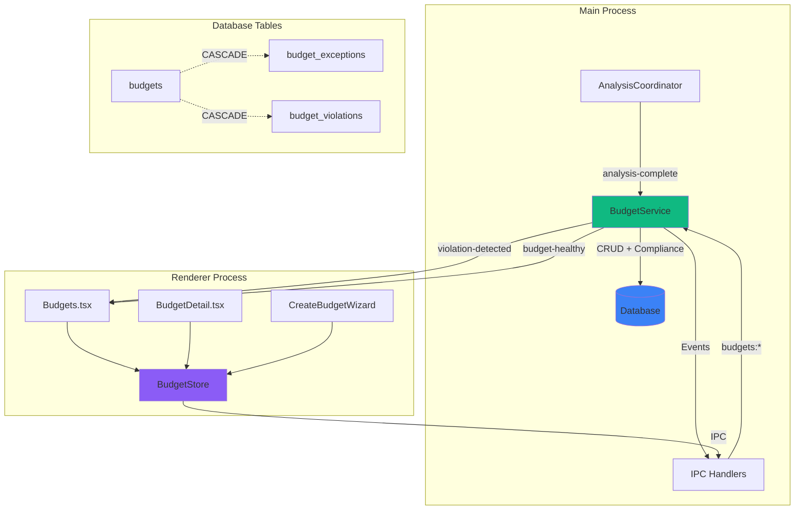
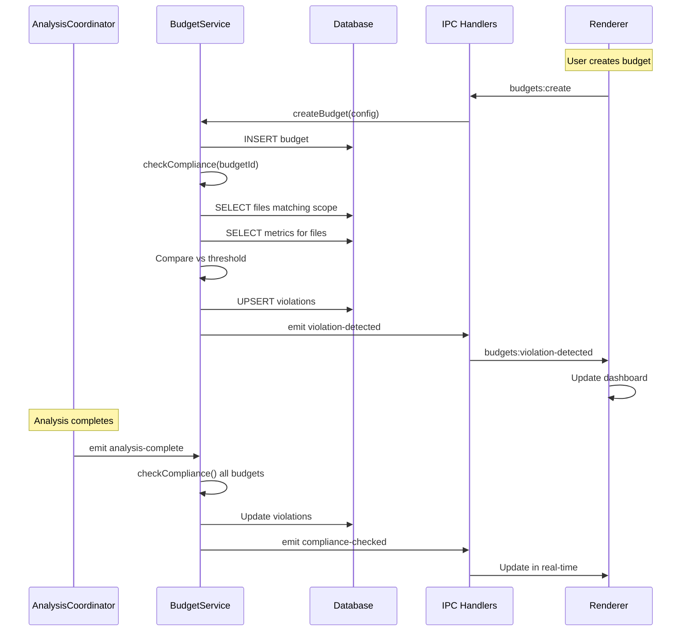

# Complexity Budget Monitoring

## Summary

This phase implements complexity budgets — explicit thresholds for code quality metrics that generate alerts when exceeded. Users can create budgets scoped to repositories, directories, file patterns, or individual files, targeting metrics like cyclomatic complexity, maintainability index, or lines of code. The system checks compliance automatically after each analysis batch, detects violations, and tracks trends over time.

The existing stub page at `clients/desktop/src/renderer/pages/Budgets.tsx` will be filled with a full dashboard, and a Modal-based creation wizard will guide budget setup.

The UX spec is in `round-two/16-complexity-budget-monitoring.md`.

## Prerequisites

- Phase 24 (Git Status Awareness) complete (DB migration v5, shared monitoring types)
- Existing analysis infrastructure: AnalysisCoordinator, DatabaseService, SnapshotService
- Existing score aggregation: `aggregateFileScore`, `computeDistribution` in `services/score-aggregation.ts`

## Architecture



### Data Flow



## Existing Infrastructure

| File                                                           | What to reuse                                              |
| -------------------------------------------------------------- | ---------------------------------------------------------- |
| `clients/desktop/src/renderer/pages/Budgets.tsx`               | Existing stub page — fill with dashboard content           |
| `clients/desktop/src/main/analysis/snapshot-service.ts`        | Score aggregation patterns for computing budget compliance |
| `clients/desktop/src/main/services/score-aggregation.ts`       | `aggregateFileScore`, `computeDistribution`                |
| `clients/desktop/src/main/config/metricNormalizationConfig.ts` | Metric normalization configuration                         |
| `clients/desktop/src/main/analysis/coordinator.ts`             | 'analysis-complete' event to trigger compliance checks     |
| `clients/desktop/src/main/db/database-service.ts`              | Database query patterns                                    |
| `clients/desktop/src/main/db/migrations/index.ts`              | Migration pattern                                          |
| `clients/desktop/src/shared/ipc-types.ts`                      | ViprDesktopAPI extension                                   |
| `clients/desktop/src/preload/index.ts`                         | Preload bridge pattern                                     |
| `clients/desktop/src/renderer/components/layout/Sidebar.tsx`   | Already has Budgets NavItem at `/budgets`                  |

## Database Schema

### Budgets Table

| Column            | Type    | Constraints | Description                                         |
| ----------------- | ------- | ----------- | --------------------------------------------------- |
| id                | TEXT    | PRIMARY KEY | UUID                                                |
| name              | TEXT    | NOT NULL    | User-facing budget name                             |
| scope_type        | TEXT    | NOT NULL    | One of: global, directory, pattern, fileType, file  |
| scope_value       | TEXT    | nullable    | Path, glob, JSON array of types, or null for global |
| metric            | TEXT    | NOT NULL    | Target metric (e.g., cyclomatic, maintainability)   |
| threshold         | REAL    | NOT NULL    | Maximum allowed value                               |
| warning_threshold | REAL    | nullable    | Optional warning level (default: 80% of threshold)  |
| enabled           | INTEGER | NOT NULL    | 1 = active, 0 = paused                              |
| created_at        | INTEGER | NOT NULL    | Unix timestamp                                      |
| updated_at        | INTEGER | NOT NULL    | Unix timestamp                                      |

Indexes: `scope_type`, `metric`, `enabled`

### Budget Exceptions Table

| Column     | Type    | Constraints | Description                              |
| ---------- | ------- | ----------- | ---------------------------------------- |
| id         | TEXT    | PRIMARY KEY | UUID                                     |
| budget_id  | TEXT    | FOREIGN KEY | References budgets(id) ON DELETE CASCADE |
| file_path  | TEXT    | NOT NULL    | File granted exemption                   |
| reason     | TEXT    | NOT NULL    | Explanation for waiver                   |
| expires_at | INTEGER | nullable    | Unix timestamp, null = permanent         |
| granted_at | INTEGER | NOT NULL    | Unix timestamp                           |

Indexes: `budget_id`, `file_path`

Unique constraint: `(budget_id, file_path)`

### Budget Violations Table

| Column            | Type    | Constraints | Description                              |
| ----------------- | ------- | ----------- | ---------------------------------------- |
| id                | TEXT    | PRIMARY KEY | UUID                                     |
| budget_id         | TEXT    | FOREIGN KEY | References budgets(id) ON DELETE CASCADE |
| file_path         | TEXT    | NOT NULL    | Violating file                           |
| current_value     | REAL    | NOT NULL    | Current metric value                     |
| threshold         | REAL    | NOT NULL    | Budget threshold (snapshot for history)  |
| status            | TEXT    | NOT NULL    | 'warning' or 'exceeded'                  |
| first_detected_at | INTEGER | NOT NULL    | Unix timestamp                           |
| last_checked_at   | INTEGER | NOT NULL    | Unix timestamp                           |
| resolved_at       | INTEGER | nullable    | Unix timestamp when violation cleared    |

Indexes: `budget_id`, `file_path`, `status`

Unique constraint: `(budget_id, file_path)`

## Implementation Tasks

### Task 01: Add budget types to shared monitoring types

**Agent**: typescript-engineer
**Files**: modify `clients/desktop/src/shared/monitoring-types.ts`
**Pattern**: Follow existing zod schema pattern from Task 01 of phase 01
**Dependencies**: 01-git-status-awareness Task 01

Add budget-related zod schemas to `monitoring-types.ts`:

```typescript
// Budget scope discriminated union
export const BudgetScopeSchema = z.discriminatedUnion('type', [
  z.object({ type: z.literal('global') }),
  z.object({ type: z.literal('directory'), path: z.string() }),
  z.object({ type: z.literal('pattern'), glob: z.string() }),
  z.object({ type: z.literal('fileType'), types: z.array(z.string()) }),
  z.object({ type: z.literal('file'), path: z.string() }),
]);

// Available budget metrics
export const BudgetMetricSchema = z.enum([
  'cyclomatic',
  'maintainability',
  'loc',
  'functions',
  'dependencies',
  'halstead-volume',
  'halstead-effort',
  'react-score',
  'hook-count',
  'anti-pattern-count',
  'security-score',
  'crash-risk',
]);

// Budget configuration
export const ComplexityBudgetSchema = z.object({
  id: z.string(),
  name: z.string(),
  scope: BudgetScopeSchema,
  metric: BudgetMetricSchema,
  threshold: z.number(),
  warningThreshold: z.number().optional(), // Default: threshold * 0.8
  enabled: z.boolean(),
  createdAt: z.number(),
  updatedAt: z.number(),
});

// Budget exception (waiver)
export const BudgetExceptionSchema = z.object({
  id: z.string(),
  budgetId: z.string(),
  filePath: z.string(),
  reason: z.string(),
  expiresAt: z.number().nullable(), // null = permanent
  grantedAt: z.number(),
});

// Budget violation record
export const BudgetViolationSchema = z.object({
  id: z.string(),
  budgetId: z.string(),
  filePath: z.string(),
  currentValue: z.number(),
  threshold: z.number(),
  status: z.enum(['warning', 'exceeded']),
  firstDetectedAt: z.number(),
  lastCheckedAt: z.number(),
  resolvedAt: z.number().nullable(),
});

// Budget compliance check result
export const BudgetComplianceResultSchema = z.object({
  budgetId: z.string(),
  compliant: z.boolean(),
  violations: z.array(BudgetViolationSchema),
  healthyCount: z.number(),
  warningCount: z.number(),
  exceededCount: z.number(),
  checkedAt: z.number(),
});

// Dashboard summary
export const BudgetDashboardSummarySchema = z.object({
  totalBudgets: z.number(),
  healthyCount: z.number(),
  warningCount: z.number(),
  exceededCount: z.number(),
  budgets: z.array(
    ComplexityBudgetSchema.extend({
      violationCount: z.number(),
      healthStatus: z.enum(['healthy', 'warning', 'exceeded']),
    })
  ),
});

// Create budget payload
export const CreateBudgetPayloadSchema = z.object({
  name: z.string(),
  scope: BudgetScopeSchema,
  metric: BudgetMetricSchema,
  threshold: z.number(),
  warningThreshold: z.number().optional(),
  enabled: z.boolean().optional(),
});

// Update budget payload
export const BudgetUpdateSchema = z.object({
  name: z.string().optional(),
  threshold: z.number().optional(),
  warningThreshold: z.number().optional(),
  enabled: z.boolean().optional(),
});

// Export inferred types
export type BudgetScope = z.infer<typeof BudgetScopeSchema>;
export type BudgetMetric = z.infer<typeof BudgetMetricSchema>;
export type ComplexityBudget = z.infer<typeof ComplexityBudgetSchema>;
export type BudgetException = z.infer<typeof BudgetExceptionSchema>;
export type BudgetViolation = z.infer<typeof BudgetViolationSchema>;
export type BudgetComplianceResult = z.infer<typeof BudgetComplianceResultSchema>;
export type BudgetDashboardSummary = z.infer<typeof BudgetDashboardSummarySchema>;
export type CreateBudgetPayload = z.infer<typeof CreateBudgetPayloadSchema>;
export type BudgetUpdate = z.infer<typeof BudgetUpdateSchema>;
```

**Verification**: TypeScript compiles without errors. All schemas export correctly.

---

### Task 02: Database migration v6

**Agent**: typescript-engineer
**Files**: modify `clients/desktop/src/main/db/migrations/index.ts`, modify `clients/desktop/src/main/db/schema.ts`
**Pattern**: Follow migration v5 pattern
**Dependencies**: 01-git-status-awareness Task 02 (migration v5 must exist first)

Add migration version 6 to `migrations/index.ts`:

```typescript
const migrationV6 = (db: Database.Database): void => {
  // Budgets table
  db.exec(`
    CREATE TABLE budgets (
      id TEXT PRIMARY KEY,
      name TEXT NOT NULL,
      scope_type TEXT NOT NULL CHECK(scope_type IN ('global', 'directory', 'pattern', 'fileType', 'file')),
      scope_value TEXT,
      metric TEXT NOT NULL,
      threshold REAL NOT NULL,
      warning_threshold REAL,
      enabled INTEGER NOT NULL DEFAULT 1,
      created_at INTEGER NOT NULL DEFAULT (unixepoch()),
      updated_at INTEGER NOT NULL DEFAULT (unixepoch())
    );

    CREATE INDEX idx_budgets_scope ON budgets(scope_type);
    CREATE INDEX idx_budgets_metric ON budgets(metric);
    CREATE INDEX idx_budgets_enabled ON budgets(enabled);
  `);

  // Budget exceptions table
  db.exec(`
    CREATE TABLE budget_exceptions (
      id TEXT PRIMARY KEY,
      budget_id TEXT NOT NULL REFERENCES budgets(id) ON DELETE CASCADE,
      file_path TEXT NOT NULL,
      reason TEXT NOT NULL,
      expires_at INTEGER,
      granted_at INTEGER NOT NULL DEFAULT (unixepoch()),
      UNIQUE(budget_id, file_path)
    );

    CREATE INDEX idx_budget_exceptions_budget ON budget_exceptions(budget_id);
    CREATE INDEX idx_budget_exceptions_file ON budget_exceptions(file_path);
  `);

  // Budget violations table
  db.exec(`
    CREATE TABLE budget_violations (
      id TEXT PRIMARY KEY,
      budget_id TEXT NOT NULL REFERENCES budgets(id) ON DELETE CASCADE,
      file_path TEXT NOT NULL,
      current_value REAL NOT NULL,
      threshold REAL NOT NULL,
      status TEXT NOT NULL CHECK(status IN ('warning', 'exceeded')),
      first_detected_at INTEGER NOT NULL DEFAULT (unixepoch()),
      last_checked_at INTEGER NOT NULL DEFAULT (unixepoch()),
      resolved_at INTEGER,
      UNIQUE(budget_id, file_path)
    );

    CREATE INDEX idx_budget_violations_budget ON budget_violations(budget_id);
    CREATE INDEX idx_budget_violations_file ON budget_violations(file_path);
    CREATE INDEX idx_budget_violations_status ON budget_violations(status);
  `);
};

// Update migrations array
export const migrations = [
  migrationV1,
  migrationV2,
  migrationV3,
  migrationV4,
  migrationV5,
  migrationV6,
];

// Update SCHEMA_VERSION
export const SCHEMA_VERSION = 6;
```

Update `schema.ts` with budget table interfaces:

```typescript
export interface BudgetRow {
  id: string;
  name: string;
  scope_type: 'global' | 'directory' | 'pattern' | 'fileType' | 'file';
  scope_value: string | null;
  metric: string;
  threshold: number;
  warning_threshold: number | null;
  enabled: number;
  created_at: number;
  updated_at: number;
}

export interface BudgetExceptionRow {
  id: string;
  budget_id: string;
  file_path: string;
  reason: string;
  expires_at: number | null;
  granted_at: number;
}

export interface BudgetViolationRow {
  id: string;
  budget_id: string;
  file_path: string;
  current_value: number;
  threshold: number;
  status: 'warning' | 'exceeded';
  first_detected_at: number;
  last_checked_at: number;
  resolved_at: number | null;
}
```

**Verification**: Migration runs successfully. Tables created with correct schema. Rollback drops all tables cleanly.

---

### Task 03: Database methods for budgets

**Agent**: typescript-engineer
**Files**: modify `clients/desktop/src/main/db/database-service.ts`
**Pattern**: Follow existing DB method patterns
**Dependencies**: Task 02

Add budget-related methods to `DatabaseService`:

```typescript
// ==================
// Budget CRUD
// ==================

createBudget(budget: {
  id: string;
  name: string;
  scopeType: string;
  scopeValue: string | null;
  metric: string;
  threshold: number;
  warningThreshold: number | null;
  enabled: boolean;
}): void {
  const stmt = this.db.prepare(`
    INSERT INTO budgets (id, name, scope_type, scope_value, metric, threshold, warning_threshold, enabled)
    VALUES (?, ?, ?, ?, ?, ?, ?, ?)
  `);
  stmt.run(
    budget.id,
    budget.name,
    budget.scopeType,
    budget.scopeValue,
    budget.metric,
    budget.threshold,
    budget.warningThreshold,
    budget.enabled ? 1 : 0
  );
}

updateBudget(
  id: string,
  updates: Partial<{
    name: string;
    threshold: number;
    warningThreshold: number;
    enabled: boolean;
  }>
): void {
  const fields: string[] = [];
  const values: unknown[] = [];

  if (updates.name !== undefined) {
    fields.push('name = ?');
    values.push(updates.name);
  }
  if (updates.threshold !== undefined) {
    fields.push('threshold = ?');
    values.push(updates.threshold);
  }
  if (updates.warningThreshold !== undefined) {
    fields.push('warning_threshold = ?');
    values.push(updates.warningThreshold);
  }
  if (updates.enabled !== undefined) {
    fields.push('enabled = ?');
    values.push(updates.enabled ? 1 : 0);
  }

  if (fields.length === 0) return;

  fields.push('updated_at = unixepoch()');
  values.push(id);

  const stmt = this.db.prepare(`
    UPDATE budgets
    SET ${fields.join(', ')}
    WHERE id = ?
  `);
  stmt.run(...values);
}

deleteBudget(id: string): void {
  const stmt = this.db.prepare('DELETE FROM budgets WHERE id = ?');
  stmt.run(id);
}

getBudget(id: string): BudgetRow | undefined {
  const stmt = this.db.prepare('SELECT * FROM budgets WHERE id = ?');
  return stmt.get(id) as BudgetRow | undefined;
}

getAllBudgets(): BudgetRow[] {
  const stmt = this.db.prepare('SELECT * FROM budgets ORDER BY created_at DESC');
  return stmt.all() as BudgetRow[];
}

getEnabledBudgets(): BudgetRow[] {
  const stmt = this.db.prepare('SELECT * FROM budgets WHERE enabled = 1');
  return stmt.all() as BudgetRow[];
}

// ==================
// Budget Exceptions
// ==================

createException(exception: {
  id: string;
  budgetId: string;
  filePath: string;
  reason: string;
  expiresAt: number | null;
}): void {
  const stmt = this.db.prepare(`
    INSERT INTO budget_exceptions (id, budget_id, file_path, reason, expires_at)
    VALUES (?, ?, ?, ?, ?)
  `);
  stmt.run(exception.id, exception.budgetId, exception.filePath, exception.reason, exception.expiresAt);
}

deleteException(id: string): void {
  const stmt = this.db.prepare('DELETE FROM budget_exceptions WHERE id = ?');
  stmt.run(id);
}

getExceptionsForBudget(budgetId: string): BudgetExceptionRow[] {
  const stmt = this.db.prepare('SELECT * FROM budget_exceptions WHERE budget_id = ?');
  return stmt.all(budgetId) as BudgetExceptionRow[];
}

getExceptionForFile(budgetId: string, filePath: string): BudgetExceptionRow | undefined {
  const stmt = this.db.prepare(`
    SELECT * FROM budget_exceptions
    WHERE budget_id = ? AND file_path = ?
  `);
  return stmt.get(budgetId, filePath) as BudgetExceptionRow | undefined;
}

getActiveExceptions(budgetId: string): BudgetExceptionRow[] {
  const now = Math.floor(Date.now() / 1000);
  const stmt = this.db.prepare(`
    SELECT * FROM budget_exceptions
    WHERE budget_id = ?
      AND (expires_at IS NULL OR expires_at > ?)
  `);
  return stmt.all(budgetId, now) as BudgetExceptionRow[];
}

// ==================
// Budget Violations
// ==================

upsertViolation(violation: {
  id: string;
  budgetId: string;
  filePath: string;
  currentValue: number;
  threshold: number;
  status: string;
}): void {
  const existing = this.db
    .prepare('SELECT * FROM budget_violations WHERE budget_id = ? AND file_path = ?')
    .get(violation.budgetId, violation.filePath) as BudgetViolationRow | undefined;

  if (existing) {
    // Update existing violation
    const stmt = this.db.prepare(`
      UPDATE budget_violations
      SET current_value = ?,
          threshold = ?,
          status = ?,
          last_checked_at = unixepoch(),
          resolved_at = NULL
      WHERE budget_id = ? AND file_path = ?
    `);
    stmt.run(
      violation.currentValue,
      violation.threshold,
      violation.status,
      violation.budgetId,
      violation.filePath
    );
  } else {
    // Insert new violation
    const stmt = this.db.prepare(`
      INSERT INTO budget_violations (id, budget_id, file_path, current_value, threshold, status)
      VALUES (?, ?, ?, ?, ?, ?)
    `);
    stmt.run(
      violation.id,
      violation.budgetId,
      violation.filePath,
      violation.currentValue,
      violation.threshold,
      violation.status
    );
  }
}

resolveViolation(budgetId: string, filePath: string): void {
  const stmt = this.db.prepare(`
    UPDATE budget_violations
    SET resolved_at = unixepoch(),
        last_checked_at = unixepoch()
    WHERE budget_id = ? AND file_path = ? AND resolved_at IS NULL
  `);
  stmt.run(budgetId, filePath);
}

getViolationsForBudget(budgetId: string): BudgetViolationRow[] {
  const stmt = this.db.prepare(`
    SELECT * FROM budget_violations
    WHERE budget_id = ?
    ORDER BY current_value DESC
  `);
  return stmt.all(budgetId) as BudgetViolationRow[];
}

getActiveViolations(): BudgetViolationRow[] {
  const stmt = this.db.prepare(`
    SELECT * FROM budget_violations
    WHERE resolved_at IS NULL
    ORDER BY status DESC, current_value DESC
  `);
  return stmt.all() as BudgetViolationRow[];
}

getViolationCount(): { warning: number; exceeded: number } {
  const stmt = this.db.prepare(`
    SELECT status, COUNT(*) as count
    FROM budget_violations
    WHERE resolved_at IS NULL
    GROUP BY status
  `);
  const rows = stmt.all() as Array<{ status: string; count: number }>;

  const result = { warning: 0, exceeded: 0 };
  for (const row of rows) {
    if (row.status === 'warning') result.warning = row.count;
    if (row.status === 'exceeded') result.exceeded = row.count;
  }
  return result;
}
```

**Verification**: CRUD operations round-trip correctly. Cascade deletes work. Active filters exclude expired/resolved records.

---

### Task 04: BudgetService

**Agent**: typescript-engineer
**Files**: create `clients/desktop/src/main/budgets/budget-service.ts`
**Pattern**: Follow TypedEventEmitter pattern from `watcher.ts`
**Dependencies**: Task 01, Task 03

Create `BudgetService` with compliance checking logic:

```typescript
import { TypedEventEmitter } from '../utils/typed-event-emitter.js';
import type { DatabaseService } from '../db/database-service.js';
import type { BudgetRow, BudgetExceptionRow, BudgetViolationRow } from '../db/schema.js';
import type {
  ComplexityBudget,
  BudgetScope,
  BudgetException,
  BudgetViolation,
  BudgetComplianceResult,
  CreateBudgetPayload,
  BudgetUpdate,
  BudgetDashboardSummary,
} from '../../shared/monitoring-types.js';
import { randomUUID } from 'node:crypto';
import { minimatch } from 'minimatch';
import path from 'node:path';
import { metricNormalizationConfig } from '../config/metricNormalizationConfig.js';

interface BudgetServiceEventMap extends Record<string, unknown[]> {
  'violation-detected': [{ budgetId: string; violations: BudgetViolation[] }];
  'budget-healthy': [{ budgetId: string }];
  'compliance-checked': [{ results: BudgetComplianceResult[] }];
}

export class BudgetService extends TypedEventEmitter<BudgetServiceEventMap> {
  constructor(
    private readonly db: DatabaseService,
    private readonly repoPath: string
  ) {
    super();
  }

  // ==================
  // CRUD Operations
  // ==================

  createBudget(config: CreateBudgetPayload): ComplexityBudget {
    const id = randomUUID();
    const now = Math.floor(Date.now() / 1000);

    const scopeType = config.scope.type;
    let scopeValue: string | null = null;

    if (scopeType === 'directory' || scopeType === 'file') {
      scopeValue = config.scope.path;
    } else if (scopeType === 'pattern') {
      scopeValue = config.scope.glob;
    } else if (scopeType === 'fileType') {
      scopeValue = JSON.stringify(config.scope.types);
    }

    this.db.createBudget({
      id,
      name: config.name,
      scopeType,
      scopeValue,
      metric: config.metric,
      threshold: config.threshold,
      warningThreshold: config.warningThreshold ?? config.threshold * 0.8,
      enabled: config.enabled ?? true,
    });

    // Trigger compliance check for new budget
    this.checkCompliance(id);

    return this.getBudget(id)!;
  }

  updateBudget(id: string, updates: BudgetUpdate): ComplexityBudget {
    this.db.updateBudget(id, {
      name: updates.name,
      threshold: updates.threshold,
      warningThreshold: updates.warningThreshold,
      enabled: updates.enabled,
    });

    // Re-check compliance if threshold or enabled state changed
    if (updates.threshold !== undefined || updates.enabled !== undefined) {
      this.checkCompliance(id);
    }

    return this.getBudget(id)!;
  }

  deleteBudget(id: string): void {
    this.db.deleteBudget(id);
  }

  getBudgets(): ComplexityBudget[] {
    const rows = this.db.getAllBudgets();
    return rows.map(row => this.rowToBudget(row));
  }

  getBudget(id: string): ComplexityBudget | null {
    const row = this.db.getBudget(id);
    return row ? this.rowToBudget(row) : null;
  }

  // ==================
  // Exception Management
  // ==================

  grantException(
    budgetId: string,
    filePath: string,
    reason: string,
    expiresAt?: number
  ): BudgetException {
    const id = randomUUID();
    const now = Math.floor(Date.now() / 1000);

    this.db.createException({
      id,
      budgetId,
      filePath,
      reason,
      expiresAt: expiresAt ?? null,
    });

    // Resolve any existing violation for this file
    this.db.resolveViolation(budgetId, filePath);

    return {
      id,
      budgetId,
      filePath,
      reason,
      expiresAt: expiresAt ?? null,
      grantedAt: now,
    };
  }

  revokeException(exceptionId: string): void {
    this.db.deleteException(exceptionId);
    // Re-check compliance after revoking exception
    // (Would need budgetId to be efficient, but for now check all)
    this.checkCompliance();
  }

  // ==================
  // Compliance Checking
  // ==================

  checkCompliance(budgetId?: string): BudgetComplianceResult[] {
    const budgets = budgetId
      ? [this.db.getBudget(budgetId)].filter(Boolean)
      : this.db.getEnabledBudgets();

    const results: BudgetComplianceResult[] = [];

    for (const budget of budgets) {
      const result = this.checkBudgetCompliance(budget);
      results.push(result);

      // Emit events based on result
      if (result.violations.length > 0) {
        this.emit('violation-detected', { budgetId: budget.id, violations: result.violations });
      } else if (result.compliant) {
        this.emit('budget-healthy', { budgetId: budget.id });
      }
    }

    this.emit('compliance-checked', { results });
    return results;
  }

  checkBudgetCompliance(budget: BudgetRow): BudgetComplianceResult {
    const scope = this.rowToScope(budget);
    const files = this.resolveScope(scope);
    const activeExceptions = this.db.getActiveExceptions(budget.id);
    const exceptedFiles = new Set(activeExceptions.map(e => e.file_path));

    const violations: BudgetViolation[] = [];
    let healthyCount = 0;
    let warningCount = 0;
    let exceededCount = 0;

    const warningThreshold = budget.warning_threshold ?? budget.threshold * 0.8;

    for (const filePath of files) {
      if (exceptedFiles.has(filePath)) continue;

      const value = this.getMetricForFile(filePath, budget.metric);
      if (value === null) continue;

      if (value > budget.threshold) {
        // Exceeded
        exceededCount++;
        const violation = this.createViolationRecord(
          budget.id,
          filePath,
          value,
          budget.threshold,
          'exceeded'
        );
        violations.push(violation);
        this.db.upsertViolation({
          id: violation.id,
          budgetId: violation.budgetId,
          filePath: violation.filePath,
          currentValue: violation.currentValue,
          threshold: violation.threshold,
          status: violation.status,
        });
      } else if (value > warningThreshold) {
        // Warning
        warningCount++;
        const violation = this.createViolationRecord(
          budget.id,
          filePath,
          value,
          budget.threshold,
          'warning'
        );
        violations.push(violation);
        this.db.upsertViolation({
          id: violation.id,
          budgetId: violation.budgetId,
          filePath: violation.filePath,
          currentValue: violation.currentValue,
          threshold: violation.threshold,
          status: violation.status,
        });
      } else {
        // Healthy
        healthyCount++;
        // Resolve any existing violation
        this.db.resolveViolation(budget.id, filePath);
      }
    }

    return {
      budgetId: budget.id,
      compliant: violations.length === 0,
      violations,
      healthyCount,
      warningCount,
      exceededCount,
      checkedAt: Math.floor(Date.now() / 1000),
    };
  }

  // ==================
  // Scope Resolution
  // ==================

  resolveScope(scope: BudgetScope): string[] {
    switch (scope.type) {
      case 'global':
        return this.db.getAllFiles().map(f => f.file_path);

      case 'directory': {
        const normalizedPath = path.normalize(scope.path);
        return this.db
          .getAllFiles()
          .filter(f => f.file_path.startsWith(normalizedPath))
          .map(f => f.file_path);
      }

      case 'pattern': {
        const allFiles = this.db.getAllFiles().map(f => f.file_path);
        return allFiles.filter(filePath => minimatch(filePath, scope.glob));
      }

      case 'fileType': {
        return this.db
          .getAllFiles()
          .filter(f => scope.types.includes(f.file_type))
          .map(f => f.file_path);
      }

      case 'file':
        return [scope.path];

      default:
        return [];
    }
  }

  // ==================
  // Metric Extraction
  // ==================

  getMetricForFile(filePath: string, metric: string): number | null {
    const config = metricNormalizationConfig[metric];
    if (!config) return null;

    const analysisId = `${config.plugin}-${metric}`;
    const analysis = this.db.getAnalysisForFile(filePath, analysisId);
    if (!analysis) return null;

    const data = JSON.parse(analysis.data);
    const value = data[config.field];

    return typeof value === 'number' ? value : null;
  }

  // ==================
  // Dashboard Summary
  // ==================

  getDashboardSummary(): BudgetDashboardSummary {
    const budgets = this.getBudgets();
    const violationsByBudget = new Map<string, BudgetViolationRow[]>();

    for (const budget of budgets) {
      const violations = this.db.getViolationsForBudget(budget.id);
      violationsByBudget.set(
        budget.id,
        violations.filter(v => !v.resolved_at)
      );
    }

    let healthyCount = 0;
    let warningCount = 0;
    let exceededCount = 0;

    const budgetsWithStatus = budgets.map(budget => {
      const violations = violationsByBudget.get(budget.id) ?? [];
      const hasExceeded = violations.some(v => v.status === 'exceeded');
      const hasWarning = violations.some(v => v.status === 'warning');

      let healthStatus: 'healthy' | 'warning' | 'exceeded';
      if (hasExceeded) {
        healthStatus = 'exceeded';
        exceededCount++;
      } else if (hasWarning) {
        healthStatus = 'warning';
        warningCount++;
      } else {
        healthStatus = 'healthy';
        healthyCount++;
      }

      return {
        ...budget,
        violationCount: violations.length,
        healthStatus,
      };
    });

    return {
      totalBudgets: budgets.length,
      healthyCount,
      warningCount,
      exceededCount,
      budgets: budgetsWithStatus,
    };
  }

  // ==================
  // Helper Methods
  // ==================

  private rowToBudget(row: BudgetRow): ComplexityBudget {
    let scope: BudgetScope;

    switch (row.scope_type) {
      case 'global':
        scope = { type: 'global' };
        break;
      case 'directory':
        scope = { type: 'directory', path: row.scope_value! };
        break;
      case 'pattern':
        scope = { type: 'pattern', glob: row.scope_value! };
        break;
      case 'fileType':
        scope = { type: 'fileType', types: JSON.parse(row.scope_value!) };
        break;
      case 'file':
        scope = { type: 'file', path: row.scope_value! };
        break;
      default:
        throw new Error(`Unknown scope type: ${row.scope_type}`);
    }

    return {
      id: row.id,
      name: row.name,
      scope,
      metric: row.metric as any,
      threshold: row.threshold,
      warningThreshold: row.warning_threshold ?? undefined,
      enabled: row.enabled === 1,
      createdAt: row.created_at,
      updatedAt: row.updated_at,
    };
  }

  private rowToScope(row: BudgetRow): BudgetScope {
    const budget = this.rowToBudget(row);
    return budget.scope;
  }

  private createViolationRecord(
    budgetId: string,
    filePath: string,
    currentValue: number,
    threshold: number,
    status: 'warning' | 'exceeded'
  ): BudgetViolation {
    const existing = this.db
      .getViolationsForBudget(budgetId)
      .find(v => v.file_path === filePath && !v.resolved_at);

    const now = Math.floor(Date.now() / 1000);

    return {
      id: existing?.id ?? randomUUID(),
      budgetId,
      filePath,
      currentValue,
      threshold,
      status,
      firstDetectedAt: existing?.first_detected_at ?? now,
      lastCheckedAt: now,
      resolvedAt: null,
    };
  }
}
```

Wire into `AnalysisCoordinator` in `clients/desktop/src/main/analysis/coordinator.ts`:

```typescript
// Listen for analysis completion
this.on('analysis-complete', () => {
  budgetService.checkCompliance();
});
```

**Verification**: Create budget, run compliance check, verify violations detected/resolved correctly. Events emitted appropriately.

---

### Task 05: Budget IPC handlers

**Agent**: typescript-engineer
**Files**: create `clients/desktop/src/main/ipc/handlers/budgets.ts`
**Pattern**: Follow `clients/desktop/src/main/ipc/handlers/snapshots.ts`
**Dependencies**: Task 04

Create IPC handlers for budgets:

```typescript
import { ipcMain, type BrowserWindow } from 'electron';
import type { BudgetService } from '../../budgets/budget-service.js';
import { CreateBudgetPayloadSchema, BudgetUpdateSchema } from '../../../shared/monitoring-types.js';
import { z } from 'zod';

export function registerBudgetHandlers(
  budgetService: BudgetService,
  getMainWindow: () => BrowserWindow | null
): void {
  // List all budgets
  ipcMain.handle('budgets:list', async () => {
    return budgetService.getBudgets();
  });

  // Get single budget
  ipcMain.handle('budgets:get', async (_, payload: { id: string }) => {
    const schema = z.object({ id: z.string() });
    const { id } = schema.parse(payload);
    return budgetService.getBudget(id);
  });

  // Create budget
  ipcMain.handle('budgets:create', async (_, payload) => {
    const config = CreateBudgetPayloadSchema.parse(payload);
    return budgetService.createBudget(config);
  });

  // Update budget
  ipcMain.handle('budgets:update', async (_, payload: { id: string; updates: unknown }) => {
    const schema = z.object({
      id: z.string(),
      updates: BudgetUpdateSchema,
    });
    const { id, updates } = schema.parse(payload);
    return budgetService.updateBudget(id, updates);
  });

  // Delete budget
  ipcMain.handle('budgets:delete', async (_, payload: { id: string }) => {
    const schema = z.object({ id: z.string() });
    const { id } = schema.parse(payload);
    budgetService.deleteBudget(id);
  });

  // Check compliance
  ipcMain.handle('budgets:checkCompliance', async (_, payload?: { budgetId?: string }) => {
    const schema = z.object({ budgetId: z.string().optional() }).optional();
    const params = schema.parse(payload);
    return budgetService.checkCompliance(params?.budgetId);
  });

  // Get dashboard summary
  ipcMain.handle('budgets:getDashboard', async () => {
    return budgetService.getDashboardSummary();
  });

  // Get violations for budget
  ipcMain.handle('budgets:getViolations', async (_, payload: { budgetId: string }) => {
    const schema = z.object({ budgetId: z.string() });
    const { budgetId } = schema.parse(payload);
    return budgetService.db.getViolationsForBudget(budgetId);
  });

  // Grant exception
  ipcMain.handle(
    'budgets:grantException',
    async (
      _,
      payload: { budgetId: string; filePath: string; reason: string; expiresAt?: number }
    ) => {
      const schema = z.object({
        budgetId: z.string(),
        filePath: z.string(),
        reason: z.string(),
        expiresAt: z.number().optional(),
      });
      const { budgetId, filePath, reason, expiresAt } = schema.parse(payload);
      return budgetService.grantException(budgetId, filePath, reason, expiresAt);
    }
  );

  // Revoke exception
  ipcMain.handle('budgets:revokeException', async (_, payload: { exceptionId: string }) => {
    const schema = z.object({ exceptionId: z.string() });
    const { exceptionId } = schema.parse(payload);
    budgetService.revokeException(exceptionId);
  });

  // Get exceptions for budget
  ipcMain.handle('budgets:getExceptions', async (_, payload: { budgetId: string }) => {
    const schema = z.object({ budgetId: z.string() });
    const { budgetId } = schema.parse(payload);
    return budgetService.db.getExceptionsForBudget(budgetId);
  });

  // Get metric preview (for wizard)
  ipcMain.handle(
    'budgets:getMetricPreview',
    async (_, payload: { scope: unknown; metric: string; threshold: number }) => {
      const schema = z.object({
        scope: z.any(), // BudgetScopeSchema
        metric: z.string(),
        threshold: z.number(),
      });
      const { scope, metric, threshold } = schema.parse(payload);

      const files = budgetService.resolveScope(scope);
      const filesWithValues = files
        .map(filePath => ({
          path: filePath,
          value: budgetService.getMetricForFile(filePath, metric),
        }))
        .filter(f => f.value !== null) as Array<{ path: string; value: number }>;

      const wouldViolate = filesWithValues.filter(f => f.value > threshold).length;

      return {
        totalFiles: filesWithValues.length,
        wouldViolate,
        files: filesWithValues.sort((a, b) => b.value - a.value).slice(0, 10), // Top 10
      };
    }
  );

  // Forward events to renderer
  budgetService.on('violation-detected', data => {
    const mainWindow = getMainWindow();
    mainWindow?.webContents.send('budgets:violation-detected', data);
  });

  budgetService.on('budget-healthy', data => {
    const mainWindow = getMainWindow();
    mainWindow?.webContents.send('budgets:budget-healthy', data);
  });

  budgetService.on('compliance-checked', data => {
    const mainWindow = getMainWindow();
    mainWindow?.webContents.send('budgets:compliance-checked', data);
  });
}
```

Register in `clients/desktop/src/main/ipc/index.ts`:

```typescript
import { registerBudgetHandlers } from './handlers/budgets.js';

// In registerIPCHandlers function
registerBudgetHandlers(budgetService, getMainWindow);
```

**Verification**: Each handler returns correctly shaped data. Events forwarded to renderer.

---

### Task 06: Extend preload and types for budgets namespace

**Agent**: typescript-engineer
**Files**: modify `clients/desktop/src/preload/index.ts`, modify `clients/desktop/src/shared/ipc-types.ts`
**Pattern**: Follow existing namespace patterns
**Dependencies**: Task 05

Update `ipc-types.ts` with budgets namespace:

```typescript
import type {
  ComplexityBudget,
  BudgetViolation,
  BudgetException,
  BudgetComplianceResult,
  BudgetDashboardSummary,
  CreateBudgetPayload,
  BudgetUpdate,
  BudgetScope,
} from './monitoring-types.js';

export interface ViprDesktopAPI {
  // ... existing namespaces

  budgets: {
    list(): Promise<ComplexityBudget[]>;
    get(payload: { id: string }): Promise<ComplexityBudget | null>;
    create(payload: CreateBudgetPayload): Promise<ComplexityBudget>;
    update(payload: { id: string; updates: Partial<BudgetUpdate> }): Promise<ComplexityBudget>;
    delete(payload: { id: string }): Promise<void>;
    checkCompliance(payload?: { budgetId?: string }): Promise<BudgetComplianceResult[]>;
    getDashboard(): Promise<BudgetDashboardSummary>;
    getViolations(payload: { budgetId: string }): Promise<BudgetViolation[]>;
    grantException(payload: {
      budgetId: string;
      filePath: string;
      reason: string;
      expiresAt?: number;
    }): Promise<BudgetException>;
    revokeException(payload: { exceptionId: string }): Promise<void>;
    getExceptions(payload: { budgetId: string }): Promise<BudgetException[]>;
    getMetricPreview(payload: { scope: BudgetScope; metric: string; threshold: number }): Promise<{
      totalFiles: number;
      wouldViolate: number;
      files: Array<{ path: string; value: number }>;
    }>;
    onViolationDetected(
      callback: (data: { budgetId: string; violations: BudgetViolation[] }) => void
    ): () => void;
    onBudgetHealthy(callback: (data: { budgetId: string }) => void): () => void;
    onComplianceChecked(
      callback: (data: { results: BudgetComplianceResult[] }) => void
    ): () => void;
  };
}
```

Implement in `preload/index.ts`:

```typescript
budgets: {
  list: () => ipcRenderer.invoke('budgets:list'),
  get: (payload) => ipcRenderer.invoke('budgets:get', payload),
  create: (payload) => ipcRenderer.invoke('budgets:create', payload),
  update: (payload) => ipcRenderer.invoke('budgets:update', payload),
  delete: (payload) => ipcRenderer.invoke('budgets:delete', payload),
  checkCompliance: (payload) => ipcRenderer.invoke('budgets:checkCompliance', payload),
  getDashboard: () => ipcRenderer.invoke('budgets:getDashboard'),
  getViolations: (payload) => ipcRenderer.invoke('budgets:getViolations', payload),
  grantException: (payload) => ipcRenderer.invoke('budgets:grantException', payload),
  revokeException: (payload) => ipcRenderer.invoke('budgets:revokeException', payload),
  getExceptions: (payload) => ipcRenderer.invoke('budgets:getExceptions', payload),
  getMetricPreview: (payload) => ipcRenderer.invoke('budgets:getMetricPreview', payload),
  onViolationDetected: (callback) => {
    const handler = (_: any, data: any) => callback(data);
    ipcRenderer.on('budgets:violation-detected', handler);
    return () => ipcRenderer.removeListener('budgets:violation-detected', handler);
  },
  onBudgetHealthy: (callback) => {
    const handler = (_: any, data: any) => callback(data);
    ipcRenderer.on('budgets:budget-healthy', handler);
    return () => ipcRenderer.removeListener('budgets:budget-healthy', handler);
  },
  onComplianceChecked: (callback) => {
    const handler = (_: any, data: any) => callback(data);
    ipcRenderer.on('budgets:compliance-checked', handler);
    return () => ipcRenderer.removeListener('budgets:compliance-checked', handler);
  },
},
```

**Verification**: TypeScript compiles. API matches type definitions.

---

### Task 07: Zustand budget store

**Agent**: react-engineer
**Files**: create `clients/desktop/src/renderer/stores/budgets.ts`
**Pattern**: Follow existing stores in `clients/desktop/src/renderer/stores/`
**Dependencies**: Task 06

Create Zustand store for budget state:

```typescript
import { create } from 'zustand';
import type {
  ComplexityBudget,
  BudgetDashboardSummary,
  BudgetViolation,
  BudgetException,
  CreateBudgetPayload,
  BudgetUpdate,
} from '../../shared/monitoring-types';

interface BudgetStore {
  budgets: ComplexityBudget[];
  dashboard: BudgetDashboardSummary | null;
  selectedBudget: ComplexityBudget | null;
  violations: BudgetViolation[];
  exceptions: BudgetException[];
  isLoading: boolean;

  // Actions
  fetchBudgets: () => Promise<void>;
  fetchDashboard: () => Promise<void>;
  selectBudget: (id: string) => Promise<void>;
  createBudget: (config: CreateBudgetPayload) => Promise<void>;
  updateBudget: (id: string, updates: Partial<BudgetUpdate>) => Promise<void>;
  deleteBudget: (id: string) => Promise<void>;
  checkCompliance: () => Promise<void>;
  grantException: (
    budgetId: string,
    filePath: string,
    reason: string,
    expiresAt?: number
  ) => Promise<void>;
  revokeException: (exceptionId: string) => Promise<void>;
}

export const useBudgetStore = create<BudgetStore>((set, get) => ({
  budgets: [],
  dashboard: null,
  selectedBudget: null,
  violations: [],
  exceptions: [],
  isLoading: false,

  fetchBudgets: async () => {
    set({ isLoading: true });
    try {
      const budgets = await window.vipr.budgets.list();
      set({ budgets });
    } finally {
      set({ isLoading: false });
    }
  },

  fetchDashboard: async () => {
    set({ isLoading: true });
    try {
      const dashboard = await window.vipr.budgets.getDashboard();
      set({ dashboard });
    } finally {
      set({ isLoading: false });
    }
  },

  selectBudget: async (id: string) => {
    set({ isLoading: true });
    try {
      const [budget, violations, exceptions] = await Promise.all([
        window.vipr.budgets.get({ id }),
        window.vipr.budgets.getViolations({ budgetId: id }),
        window.vipr.budgets.getExceptions({ budgetId: id }),
      ]);
      set({ selectedBudget: budget, violations, exceptions });
    } finally {
      set({ isLoading: false });
    }
  },

  createBudget: async (config: CreateBudgetPayload) => {
    set({ isLoading: true });
    try {
      await window.vipr.budgets.create(config);
      await get().fetchBudgets();
      await get().fetchDashboard();
    } finally {
      set({ isLoading: false });
    }
  },

  updateBudget: async (id: string, updates: Partial<BudgetUpdate>) => {
    set({ isLoading: true });
    try {
      await window.vipr.budgets.update({ id, updates });
      await get().fetchBudgets();
      await get().fetchDashboard();
      if (get().selectedBudget?.id === id) {
        await get().selectBudget(id);
      }
    } finally {
      set({ isLoading: false });
    }
  },

  deleteBudget: async (id: string) => {
    set({ isLoading: true });
    try {
      await window.vipr.budgets.delete({ id });
      await get().fetchBudgets();
      await get().fetchDashboard();
      if (get().selectedBudget?.id === id) {
        set({ selectedBudget: null, violations: [], exceptions: [] });
      }
    } finally {
      set({ isLoading: false });
    }
  },

  checkCompliance: async () => {
    await window.vipr.budgets.checkCompliance();
    await get().fetchDashboard();
    if (get().selectedBudget) {
      await get().selectBudget(get().selectedBudget!.id);
    }
  },

  grantException: async (
    budgetId: string,
    filePath: string,
    reason: string,
    expiresAt?: number
  ) => {
    set({ isLoading: true });
    try {
      await window.vipr.budgets.grantException({ budgetId, filePath, reason, expiresAt });
      if (get().selectedBudget?.id === budgetId) {
        await get().selectBudget(budgetId);
      }
    } finally {
      set({ isLoading: false });
    }
  },

  revokeException: async (exceptionId: string) => {
    set({ isLoading: true });
    try {
      await window.vipr.budgets.revokeException({ exceptionId });
      if (get().selectedBudget) {
        await get().selectBudget(get().selectedBudget.id);
      }
    } finally {
      set({ isLoading: false });
    }
  },
}));

// Subscribe to violation events
if (typeof window !== 'undefined') {
  window.vipr.budgets.onViolationDetected(() => {
    useBudgetStore.getState().fetchDashboard();
  });

  window.vipr.budgets.onComplianceChecked(() => {
    useBudgetStore.getState().fetchDashboard();
  });
}
```

**Verification**: Store actions work. State updates correctly. Events trigger dashboard refresh.

---

### Task 08: Budget creation wizard

**Agent**: react-engineer
**Files**: create `clients/desktop/src/renderer/components/budgets/CreateBudgetWizard.tsx`
**Pattern**: Follow the wizard pattern from the UX spec's Composition Patterns section
**Dependencies**: Task 06, Task 07

Create the 5-step wizard modal:

```typescript
import { useState } from 'react';
import { Modal } from '@vipr/ui/modal';
import { Button } from '@vipr/ui/button';
import { Radio } from '@vipr/ui/radio';
import { Input } from '@vipr/ui/input';
import { Checkbox } from '@vipr/ui/checkbox';
import { MetricBarChart } from '@vipr/ui/metric-bar-chart';
import type { BudgetScope, BudgetMetric, CreateBudgetPayload } from '../../../shared/monitoring-types';
import { useBudgetStore } from '../../stores/budgets';

interface CreateBudgetWizardProps {
  isOpen: boolean;
  onClose: () => void;
}

const METRIC_OPTIONS: Array<{ value: BudgetMetric; label: string; description: string; recommended: number }> = [
  { value: 'cyclomatic', label: 'Cyclomatic Complexity', description: 'Number of independent paths through code', recommended: 10 },
  { value: 'maintainability', label: 'Maintainability Index', description: 'Overall code maintainability score (0-100)', recommended: 65 },
  { value: 'loc', label: 'Lines of Code', description: 'Total lines of code per file', recommended: 300 },
  { value: 'functions', label: 'Function Count', description: 'Number of functions per file', recommended: 20 },
  { value: 'dependencies', label: 'Dependencies', description: 'Number of imported dependencies', recommended: 15 },
];

type WizardStep = 'scope' | 'metric' | 'threshold' | 'alerts' | 'review';

export function CreateBudgetWizard({ isOpen, onClose }: CreateBudgetWizardProps) {
  const createBudget = useBudgetStore((state) => state.createBudget);

  const [currentStep, setCurrentStep] = useState<WizardStep>('scope');
  const [name, setName] = useState('');
  const [scopeType, setScopeType] = useState<'global' | 'directory' | 'pattern' | 'fileType' | 'file'>('global');
  const [scopeValue, setScopeValue] = useState('');
  const [metric, setMetric] = useState<BudgetMetric>('cyclomatic');
  const [threshold, setThreshold] = useState(10);
  const [warningThreshold, setWarningThreshold] = useState(8);
  const [enableAlerts, setEnableAlerts] = useState(true);
  const [previewData, setPreviewData] = useState<{ totalFiles: number; wouldViolate: number; files: Array<{ path: string; value: number }> } | null>(null);

  const steps: WizardStep[] = ['scope', 'metric', 'threshold', 'alerts', 'review'];
  const currentStepIndex = steps.indexOf(currentStep);

  const handleNext = () => {
    const nextIndex = currentStepIndex + 1;
    if (nextIndex < steps.length) {
      setCurrentStep(steps[nextIndex]);
    }
  };

  const handleBack = () => {
    const prevIndex = currentStepIndex - 1;
    if (prevIndex >= 0) {
      setCurrentStep(steps[prevIndex]);
    }
  };

  const handleSave = async () => {
    const scope: BudgetScope =
      scopeType === 'global' ? { type: 'global' } :
      scopeType === 'directory' ? { type: 'directory', path: scopeValue } :
      scopeType === 'pattern' ? { type: 'pattern', glob: scopeValue } :
      scopeType === 'fileType' ? { type: 'fileType', types: scopeValue.split(',').map(t => t.trim()) } :
      { type: 'file', path: scopeValue };

    const config: CreateBudgetPayload = {
      name,
      scope,
      metric,
      threshold,
      warningThreshold,
      enabled: true,
    };

    await createBudget(config);
    onClose();
  };

  const loadPreview = async () => {
    const scope: BudgetScope =
      scopeType === 'global' ? { type: 'global' } :
      scopeType === 'directory' ? { type: 'directory', path: scopeValue } :
      scopeType === 'pattern' ? { type: 'pattern', glob: scopeValue } :
      scopeType === 'fileType' ? { type: 'fileType', types: scopeValue.split(',').map(t => t.trim()) } :
      { type: 'file', path: scopeValue };

    const preview = await window.vipr.budgets.getMetricPreview({ scope, metric, threshold });
    setPreviewData(preview);
  };

  return (
    <Modal isOpen={isOpen} onClose={onClose} size="lg" title="Create Budget">
      {/* Step breadcrumb */}
      <div className="flex items-center justify-between mb-6">
        {steps.map((step, idx) => (
          <div key={step} className="flex items-center">
            <div
              className={`w-8 h-8 rounded-full flex items-center justify-center ${
                idx < currentStepIndex
                  ? 'bg-green-500 text-white'
                  : idx === currentStepIndex
                  ? 'bg-violet-500 text-white'
                  : 'bg-gray-200 dark:bg-gray-700 text-gray-500'
              }`}
            >
              {idx < currentStepIndex ? '✓' : idx + 1}
            </div>
            {idx < steps.length - 1 && (
              <div className="w-12 h-0.5 bg-gray-200 dark:bg-gray-700 mx-2" />
            )}
          </div>
        ))}
      </div>

      {/* Step content */}
      <div className="min-h-[300px]">
        {currentStep === 'scope' && (
          <div>
            <h3 className="text-lg font-semibold mb-4">Select Scope</h3>
            <Input
              label="Budget Name"
              value={name}
              onChange={(e) => setName(e.target.value)}
              placeholder="e.g., Component Complexity Limit"
              className="mb-4"
            />
            <div className="space-y-3">
              <Radio
                label="Global (entire repository)"
                checked={scopeType === 'global'}
                onChange={() => setScopeType('global')}
              />
              <Radio
                label="Directory"
                checked={scopeType === 'directory'}
                onChange={() => setScopeType('directory')}
              />
              {scopeType === 'directory' && (
                <Input value={scopeValue} onChange={(e) => setScopeValue(e.target.value)} placeholder="src/components" />
              )}
              <Radio
                label="Pattern (glob)"
                checked={scopeType === 'pattern'}
                onChange={() => setScopeType('pattern')}
              />
              {scopeType === 'pattern' && (
                <Input value={scopeValue} onChange={(e) => setScopeValue(e.target.value)} placeholder="**/*.tsx" />
              )}
              <Radio
                label="File Type"
                checked={scopeType === 'fileType'}
                onChange={() => setScopeType('fileType')}
              />
              {scopeType === 'fileType' && (
                <Input value={scopeValue} onChange={(e) => setScopeValue(e.target.value)} placeholder="tsx, jsx" />
              )}
              <Radio
                label="Single File"
                checked={scopeType === 'file'}
                onChange={() => setScopeType('file')}
              />
              {scopeType === 'file' && (
                <Input value={scopeValue} onChange={(e) => setScopeValue(e.target.value)} placeholder="src/App.tsx" />
              )}
            </div>
          </div>
        )}

        {currentStep === 'metric' && (
          <div>
            <h3 className="text-lg font-semibold mb-4">Select Metric</h3>
            <div className="space-y-3">
              {METRIC_OPTIONS.map((option) => (
                <div key={option.value} className="border border-gray-200 dark:border-gray-700 rounded-lg p-4">
                  <Checkbox
                    label={option.label}
                    checked={metric === option.value}
                    onChange={() => setMetric(option.value)}
                  />
                  <p className="text-sm text-gray-600 dark:text-gray-400 mt-1">{option.description}</p>
                  <p className="text-sm text-violet-600 dark:text-violet-400 mt-1">
                    Recommended threshold: {option.recommended}
                  </p>
                </div>
              ))}
            </div>
          </div>
        )}

        {currentStep === 'threshold' && (
          <div>
            <h3 className="text-lg font-semibold mb-4">Set Threshold</h3>
            <Input
              label="Maximum Threshold"
              type="number"
              value={threshold}
              onChange={(e) => setThreshold(Number(e.target.value))}
              className="mb-4"
            />
            <Input
              label="Warning Threshold (optional)"
              type="number"
              value={warningThreshold}
              onChange={(e) => setWarningThreshold(Number(e.target.value))}
              className="mb-4"
            />
            <Button onClick={loadPreview} variant="secondary" size="sm">
              Preview Impact
            </Button>
            {previewData && (
              <div className="mt-4">
                <p className="text-sm text-gray-600 dark:text-gray-400">
                  {previewData.wouldViolate} of {previewData.totalFiles} files would violate this budget
                </p>
                <MetricBarChart
                  data={previewData.files.map((f) => ({ label: f.path, value: f.value }))}
                  className="mt-4"
                />
              </div>
            )}
          </div>
        )}

        {currentStep === 'alerts' && (
          <div>
            <h3 className="text-lg font-semibold mb-4">Configure Alerts</h3>
            <Checkbox
              label="Enable alerts for violations"
              checked={enableAlerts}
              onChange={(e) => setEnableAlerts(e.target.checked)}
            />
          </div>
        )}

        {currentStep === 'review' && (
          <div>
            <h3 className="text-lg font-semibold mb-4">Review & Save</h3>
            <dl className="space-y-2">
              <div>
                <dt className="text-sm font-medium text-gray-600 dark:text-gray-400">Name</dt>
                <dd className="text-base">{name}</dd>
              </div>
              <div>
                <dt className="text-sm font-medium text-gray-600 dark:text-gray-400">Scope</dt>
                <dd className="text-base">{scopeType === 'global' ? 'Global' : `${scopeType}: ${scopeValue}`}</dd>
              </div>
              <div>
                <dt className="text-sm font-medium text-gray-600 dark:text-gray-400">Metric</dt>
                <dd className="text-base">{METRIC_OPTIONS.find(m => m.value === metric)?.label}</dd>
              </div>
              <div>
                <dt className="text-sm font-medium text-gray-600 dark:text-gray-400">Threshold</dt>
                <dd className="text-base">{threshold} (warning: {warningThreshold})</dd>
              </div>
            </dl>
          </div>
        )}
      </div>

      {/* Navigation footer */}
      <div className="flex justify-between mt-6">
        <Button onClick={onClose} variant="secondary">
          Cancel
        </Button>
        <div className="flex gap-2">
          {currentStepIndex > 0 && (
            <Button onClick={handleBack} variant="secondary">
              Back
            </Button>
          )}
          {currentStepIndex < steps.length - 1 ? (
            <Button onClick={handleNext}>Continue</Button>
          ) : (
            <Button onClick={handleSave}>Save Budget</Button>
          )}
        </div>
      </div>
    </Modal>
  );
}
```

**Verification**: Wizard opens, all steps render, navigation works, budget saved on completion.

---

### Task 09: Fill Budgets.tsx dashboard page

**Agent**: react-engineer
**Files**: modify `clients/desktop/src/renderer/pages/Budgets.tsx`
**Pattern**: Follow UX spec's "Budget Dashboard Page" composition
**Dependencies**: Task 07, Task 08

Replace stub content with full dashboard:

```typescript
import { useEffect, useState } from 'react';
import { useNavigate } from 'react-router-dom';
import { StatCard } from '@vipr/ui/stat-card';
import { CardTable } from '@vipr/ui/card-table';
import { Badge } from '@vipr/ui/badge';
import { Button } from '@vipr/ui/button';
import { useBudgetStore } from '../stores/budgets';
import { CreateBudgetWizard } from '../components/budgets/CreateBudgetWizard';

export function Budgets() {
  const navigate = useNavigate();
  const { dashboard, fetchDashboard, isLoading } = useBudgetStore();
  const [wizardOpen, setWizardOpen] = useState(false);

  useEffect(() => {
    fetchDashboard();
  }, [fetchDashboard]);

  if (isLoading && !dashboard) {
    return <div className="p-8">Loading...</div>;
  }

  const getStatusBadge = (status: 'healthy' | 'warning' | 'exceeded') => {
    if (status === 'healthy') {
      return <Badge variant="success">Healthy</Badge>;
    }
    if (status === 'warning') {
      return <Badge variant="warning">Warning</Badge>;
    }
    return <Badge variant="error">Exceeded</Badge>;
  };

  return (
    <div className="p-8">
      {/* Header */}
      <div className="flex justify-between items-start mb-6">
        <div>
          <h1 className="text-3xl font-bold">Complexity Budgets</h1>
          <p className="text-gray-600 dark:text-gray-400 mt-1">
            Monitor and enforce code quality thresholds
          </p>
        </div>
        <div className="flex gap-2">
          <Button variant="secondary">Export Report</Button>
          <Button onClick={() => setWizardOpen(true)}>Add Budget</Button>
        </div>
      </div>

      {/* Summary stats */}
      <div className="grid grid-cols-12 gap-6 mb-6">
        <div className="col-span-3">
          <StatCard
            label="Total Budgets"
            value={dashboard?.totalBudgets ?? 0}
            variant="compact"
          />
        </div>
        <div className="col-span-3">
          <StatCard
            label="Healthy"
            value={dashboard?.healthyCount ?? 0}
            variant="compact"
            trend={{ direction: 'up', label: 'Within limits' }}
          />
        </div>
        <div className="col-span-3">
          <StatCard
            label="Warnings"
            value={dashboard?.warningCount ?? 0}
            variant="compact"
            trend={{ direction: 'neutral', label: 'Approaching threshold' }}
          />
        </div>
        <div className="col-span-3">
          <StatCard
            label="Exceeded"
            value={dashboard?.exceededCount ?? 0}
            variant="compact"
            trend={{ direction: 'down', label: 'Over budget' }}
          />
        </div>
      </div>

      {/* Active budgets table */}
      <CardTable
        title="Active Budgets"
        columns={[
          { key: 'name', label: 'Budget Name' },
          { key: 'scope', label: 'Scope' },
          { key: 'metric', label: 'Metric' },
          { key: 'threshold', label: 'Threshold' },
          { key: 'violations', label: 'Violations' },
          { key: 'status', label: 'Status' },
        ]}
        data={
          dashboard?.budgets.map((budget) => ({
            id: budget.id,
            name: budget.name,
            scope: budget.scope.type === 'global' ? 'Global' : `${budget.scope.type}: ${budget.scope.path || budget.scope.glob || 'N/A'}`,
            metric: budget.metric,
            threshold: budget.threshold,
            violations: budget.violationCount,
            status: getStatusBadge(budget.healthStatus),
          })) ?? []
        }
        onRowClick={(row) => navigate(`/budgets/${row.id}`)}
      />

      {/* Wizard modal */}
      <CreateBudgetWizard isOpen={wizardOpen} onClose={() => setWizardOpen(false)} />
    </div>
  );
}
```

**Verification**: Dashboard renders with summary stats and budget table. Add Budget opens wizard. Row click navigates to detail.

---

### Task 10: Budget detail page

**Agent**: react-engineer
**Files**: create `clients/desktop/src/renderer/pages/BudgetDetail.tsx`
**Pattern**: Follow page layout pattern
**Dependencies**: Task 07

Create budget detail page:

```typescript
import { useEffect, useState } from 'react';
import { useParams, useNavigate } from 'react-router-dom';
import { StatCard } from '@vipr/ui/stat-card';
import { CardTable } from '@vipr/ui/card-table';
import { Badge } from '@vipr/ui/badge';
import { Button } from '@vipr/ui/button';
import { Alert } from '@vipr/ui/alert';
import { useBudgetStore } from '../stores/budgets';

export function BudgetDetail() {
  const { budgetId } = useParams<{ budgetId: string }>();
  const navigate = useNavigate();
  const { selectedBudget, violations, exceptions, selectBudget, grantException, revokeException, isLoading } = useBudgetStore();
  const [waiverReason, setWaiverReason] = useState('');
  const [waiverFile, setWaiverFile] = useState<string | null>(null);

  useEffect(() => {
    if (budgetId) {
      selectBudget(budgetId);
    }
  }, [budgetId, selectBudget]);

  if (isLoading && !selectedBudget) {
    return <div className="p-8">Loading...</div>;
  }

  if (!selectedBudget) {
    return <div className="p-8">Budget not found</div>;
  }

  const activeViolations = violations.filter((v) => !v.resolvedAt);
  const exceededCount = activeViolations.filter((v) => v.status === 'exceeded').length;
  const warningCount = activeViolations.filter((v) => v.status === 'warning').length;
  const utilization = selectedBudget.threshold > 0
    ? Math.round((activeViolations.reduce((sum, v) => sum + v.currentValue, 0) / (activeViolations.length * selectedBudget.threshold)) * 100)
    : 0;

  const handleWaive = async (filePath: string) => {
    if (!waiverReason) {
      alert('Please provide a reason for the waiver');
      return;
    }
    await grantException(selectedBudget.id, filePath, waiverReason);
    setWaiverFile(null);
    setWaiverReason('');
  };

  return (
    <div className="p-8">
      {/* Header */}
      <div className="mb-6">
        <Button variant="secondary" size="sm" onClick={() => navigate('/budgets')}>
          ← Back to Budgets
        </Button>
        <h1 className="text-3xl font-bold mt-4">{selectedBudget.name}</h1>
        <p className="text-gray-600 dark:text-gray-400 mt-1">
          {selectedBudget.scope.type === 'global' ? 'Global scope' : `${selectedBudget.scope.type}: ${selectedBudget.scope.path || selectedBudget.scope.glob || 'N/A'}`}
        </p>
      </div>

      {/* Summary stats */}
      <div className="grid grid-cols-12 gap-6 mb-6">
        <div className="col-span-3">
          <StatCard label="Threshold" value={selectedBudget.threshold} variant="compact" />
        </div>
        <div className="col-span-3">
          <StatCard label="Violations" value={activeViolations.length} variant="compact" />
        </div>
        <div className="col-span-3">
          <StatCard label="Utilization" value={`${utilization}%`} variant="compact" />
        </div>
        <div className="col-span-3">
          <StatCard
            label="Status"
            value={exceededCount > 0 ? 'Exceeded' : warningCount > 0 ? 'Warning' : 'Healthy'}
            variant="compact"
          />
        </div>
      </div>

      {/* Violations table */}
      <CardTable
        title="Violations"
        columns={[
          { key: 'file', label: 'File' },
          { key: 'currentValue', label: 'Current Value' },
          { key: 'threshold', label: 'Threshold' },
          { key: 'delta', label: 'Delta' },
          { key: 'status', label: 'Status' },
          { key: 'actions', label: 'Actions' },
        ]}
        data={activeViolations.map((v) => ({
          id: v.id,
          file: v.filePath,
          currentValue: v.currentValue.toFixed(2),
          threshold: v.threshold,
          delta: `+${(v.currentValue - v.threshold).toFixed(2)}`,
          status: v.status === 'exceeded' ? <Badge variant="error">Exceeded</Badge> : <Badge variant="warning">Warning</Badge>,
          actions: (
            <Button
              variant="secondary"
              size="sm"
              onClick={() => {
                setWaiverFile(v.filePath);
                setWaiverReason('');
              }}
            >
              Waive
            </Button>
          ),
        }))}
      />

      {/* Waiver modal (inline for simplicity) */}
      {waiverFile && (
        <div className="mt-4 p-4 border border-gray-200 dark:border-gray-700 rounded-lg">
          <h3 className="font-semibold mb-2">Grant Exception for {waiverFile}</h3>
          <input
            type="text"
            placeholder="Reason for waiver"
            value={waiverReason}
            onChange={(e) => setWaiverReason(e.target.value)}
            className="w-full p-2 border border-gray-300 dark:border-gray-600 rounded mb-2"
          />
          <div className="flex gap-2">
            <Button onClick={() => handleWaive(waiverFile)}>Grant Exception</Button>
            <Button variant="secondary" onClick={() => setWaiverFile(null)}>Cancel</Button>
          </div>
        </div>
      )}

      {/* Exceptions table */}
      <CardTable
        title="Active Exceptions"
        className="mt-6"
        columns={[
          { key: 'file', label: 'File' },
          { key: 'reason', label: 'Reason' },
          { key: 'grantedAt', label: 'Granted' },
          { key: 'expiresAt', label: 'Expires' },
          { key: 'actions', label: 'Actions' },
        ]}
        data={exceptions.map((e) => ({
          id: e.id,
          file: e.filePath,
          reason: e.reason,
          grantedAt: new Date(e.grantedAt * 1000).toLocaleDateString(),
          expiresAt: e.expiresAt ? new Date(e.expiresAt * 1000).toLocaleDateString() : 'Never',
          actions: (
            <Button variant="secondary" size="sm" onClick={() => revokeException(e.id)}>
              Revoke
            </Button>
          ),
        }))}
      />

      {/* Recommended actions */}
      {activeViolations.length > 0 && (
        <Alert variant="info" className="mt-6">
          <strong>Recommended actions:</strong>
          <ul className="list-disc ml-5 mt-2">
            <li>Refactor functions with high complexity into smaller units</li>
            <li>Extract reusable logic into utility functions</li>
            <li>Consider design patterns to reduce coupling</li>
          </ul>
        </Alert>
      )}
    </div>
  );
}
```

**Verification**: Detail page renders for a budget. Violations listed. Waive and Revoke actions work.

---

### Task 11: Add budget detail route

**Agent**: react-engineer
**Files**: modify `clients/desktop/src/renderer/App.tsx` (or router config)
**Pattern**: Follow existing route pattern
**Dependencies**: Task 10

Add route for budget detail:

```typescript
import { BudgetDetail } from './pages/BudgetDetail';

// In router config
<Route path="/budgets/:budgetId" element={<BudgetDetail />} />
```

**Verification**: Navigation from budget table row to detail page works.

---

### Task 12: BudgetService unit tests

**Agent**: vitest-engineer
**Files**: create `clients/desktop/src/main/budgets/budget-service.test.ts`
**Pattern**: Co-located test
**Dependencies**: Task 04

Write comprehensive unit tests:

```typescript
import { describe, it, expect, beforeEach, afterEach } from 'vitest';
import { BudgetService } from './budget-service.js';
import { DatabaseService } from '../db/database-service.js';
import Database from 'better-sqlite3';
import { randomUUID } from 'node:crypto';

describe('BudgetService', () => {
  let db: DatabaseService;
  let budgetService: BudgetService;
  let dbInstance: Database.Database;

  beforeEach(() => {
    dbInstance = new Database(':memory:');
    db = new DatabaseService(dbInstance);
    db.migrate();
    budgetService = new BudgetService(db, '/test/repo');
  });

  afterEach(() => {
    dbInstance.close();
  });

  it('should create budget and return it', () => {
    const config = {
      name: 'Test Budget',
      scope: { type: 'global' as const },
      metric: 'cyclomatic' as const,
      threshold: 10,
    };

    const budget = budgetService.createBudget(config);

    expect(budget.name).toBe('Test Budget');
    expect(budget.metric).toBe('cyclomatic');
    expect(budget.threshold).toBe(10);
  });

  it('should resolve global scope to all files', () => {
    db.upsertFile({ filePath: '/test/file1.ts', fileType: 'typescript' });
    db.upsertFile({ filePath: '/test/file2.ts', fileType: 'typescript' });

    const files = budgetService.resolveScope({ type: 'global' });

    expect(files).toHaveLength(2);
    expect(files).toContain('/test/file1.ts');
    expect(files).toContain('/test/file2.ts');
  });

  it('should resolve directory scope to files in path', () => {
    db.upsertFile({ filePath: '/test/src/file1.ts', fileType: 'typescript' });
    db.upsertFile({ filePath: '/test/src/file2.ts', fileType: 'typescript' });
    db.upsertFile({ filePath: '/test/other/file3.ts', fileType: 'typescript' });

    const files = budgetService.resolveScope({ type: 'directory', path: '/test/src' });

    expect(files).toHaveLength(2);
    expect(files).toContain('/test/src/file1.ts');
    expect(files).toContain('/test/src/file2.ts');
  });

  it('should resolve pattern scope with glob', () => {
    db.upsertFile({ filePath: '/test/file1.tsx', fileType: 'tsx' });
    db.upsertFile({ filePath: '/test/file2.ts', fileType: 'typescript' });

    const files = budgetService.resolveScope({ type: 'pattern', glob: '**/*.tsx' });

    expect(files).toHaveLength(1);
    expect(files).toContain('/test/file1.tsx');
  });

  it('should resolve fileType scope', () => {
    db.upsertFile({ filePath: '/test/file1.tsx', fileType: 'tsx' });
    db.upsertFile({ filePath: '/test/file2.ts', fileType: 'typescript' });

    const files = budgetService.resolveScope({ type: 'fileType', types: ['tsx'] });

    expect(files).toHaveLength(1);
    expect(files).toContain('/test/file1.tsx');
  });

  it('should resolve file scope to single file', () => {
    const files = budgetService.resolveScope({ type: 'file', path: '/test/file.ts' });

    expect(files).toEqual(['/test/file.ts']);
  });

  it('should detect exceeded budget', () => {
    db.upsertFile({ filePath: '/test/file1.ts', fileType: 'typescript' });
    db.upsertAnalysis({
      id: randomUUID(),
      filePath: '/test/file1.ts',
      analysisId: 'core-cyclomatic',
      data: JSON.stringify({ complexity: 15 }),
    });

    const budget = budgetService.createBudget({
      name: 'Test',
      scope: { type: 'global' },
      metric: 'cyclomatic',
      threshold: 10,
    });

    const result = budgetService.checkCompliance(budget.id);

    expect(result[0].compliant).toBe(false);
    expect(result[0].violations).toHaveLength(1);
    expect(result[0].exceededCount).toBe(1);
  });

  it('should detect warning budget', () => {
    db.upsertFile({ filePath: '/test/file1.ts', fileType: 'typescript' });
    db.upsertAnalysis({
      id: randomUUID(),
      filePath: '/test/file1.ts',
      analysisId: 'core-cyclomatic',
      data: JSON.stringify({ complexity: 9 }),
    });

    const budget = budgetService.createBudget({
      name: 'Test',
      scope: { type: 'global' },
      metric: 'cyclomatic',
      threshold: 10,
      warningThreshold: 8,
    });

    const result = budgetService.checkCompliance(budget.id);

    expect(result[0].compliant).toBe(false);
    expect(result[0].warningCount).toBe(1);
  });

  it('should mark budget as healthy when within limits', () => {
    db.upsertFile({ filePath: '/test/file1.ts', fileType: 'typescript' });
    db.upsertAnalysis({
      id: randomUUID(),
      filePath: '/test/file1.ts',
      analysisId: 'core-cyclomatic',
      data: JSON.stringify({ complexity: 5 }),
    });

    const budget = budgetService.createBudget({
      name: 'Test',
      scope: { type: 'global' },
      metric: 'cyclomatic',
      threshold: 10,
    });

    const result = budgetService.checkCompliance(budget.id);

    expect(result[0].compliant).toBe(true);
    expect(result[0].healthyCount).toBe(1);
  });

  it('should respect exceptions (excluded files)', () => {
    db.upsertFile({ filePath: '/test/file1.ts', fileType: 'typescript' });
    db.upsertAnalysis({
      id: randomUUID(),
      filePath: '/test/file1.ts',
      analysisId: 'core-cyclomatic',
      data: JSON.stringify({ complexity: 15 }),
    });

    const budget = budgetService.createBudget({
      name: 'Test',
      scope: { type: 'global' },
      metric: 'cyclomatic',
      threshold: 10,
    });

    budgetService.grantException(budget.id, '/test/file1.ts', 'Legacy code');

    const result = budgetService.checkCompliance(budget.id);

    expect(result[0].violations).toHaveLength(0);
  });

  it('should resolve violation when file improves', () => {
    db.upsertFile({ filePath: '/test/file1.ts', fileType: 'typescript' });
    db.upsertAnalysis({
      id: randomUUID(),
      filePath: '/test/file1.ts',
      analysisId: 'core-cyclomatic',
      data: JSON.stringify({ complexity: 15 }),
    });

    const budget = budgetService.createBudget({
      name: 'Test',
      scope: { type: 'global' },
      metric: 'cyclomatic',
      threshold: 10,
    });

    let result = budgetService.checkCompliance(budget.id);
    expect(result[0].violations).toHaveLength(1);

    // Improve metric
    db.upsertAnalysis({
      id: randomUUID(),
      filePath: '/test/file1.ts',
      analysisId: 'core-cyclomatic',
      data: JSON.stringify({ complexity: 5 }),
    });

    result = budgetService.checkCompliance(budget.id);
    expect(result[0].violations).toHaveLength(0);
  });

  it('should emit violation-detected event', done => {
    db.upsertFile({ filePath: '/test/file1.ts', fileType: 'typescript' });
    db.upsertAnalysis({
      id: randomUUID(),
      filePath: '/test/file1.ts',
      analysisId: 'core-cyclomatic',
      data: JSON.stringify({ complexity: 15 }),
    });

    budgetService.on('violation-detected', ({ budgetId, violations }) => {
      expect(violations).toHaveLength(1);
      done();
    });

    budgetService.createBudget({
      name: 'Test',
      scope: { type: 'global' },
      metric: 'cyclomatic',
      threshold: 10,
    });
  });

  it('should extract metric value correctly', () => {
    db.upsertFile({ filePath: '/test/file1.ts', fileType: 'typescript' });
    db.upsertAnalysis({
      id: randomUUID(),
      filePath: '/test/file1.ts',
      analysisId: 'core-cyclomatic',
      data: JSON.stringify({ complexity: 12 }),
    });

    const value = budgetService.getMetricForFile('/test/file1.ts', 'cyclomatic');

    expect(value).toBe(12);
  });

  it('should return correct dashboard summary', () => {
    db.upsertFile({ filePath: '/test/file1.ts', fileType: 'typescript' });
    db.upsertFile({ filePath: '/test/file2.ts', fileType: 'typescript' });

    db.upsertAnalysis({
      id: randomUUID(),
      filePath: '/test/file1.ts',
      analysisId: 'core-cyclomatic',
      data: JSON.stringify({ complexity: 15 }),
    });

    db.upsertAnalysis({
      id: randomUUID(),
      filePath: '/test/file2.ts',
      analysisId: 'core-cyclomatic',
      data: JSON.stringify({ complexity: 5 }),
    });

    budgetService.createBudget({
      name: 'Budget 1',
      scope: { type: 'file', path: '/test/file1.ts' },
      metric: 'cyclomatic',
      threshold: 10,
    });

    budgetService.createBudget({
      name: 'Budget 2',
      scope: { type: 'file', path: '/test/file2.ts' },
      metric: 'cyclomatic',
      threshold: 10,
    });

    const summary = budgetService.getDashboardSummary();

    expect(summary.totalBudgets).toBe(2);
    expect(summary.exceededCount).toBe(1);
    expect(summary.healthyCount).toBe(1);
  });
});
```

**Verification**: All tests pass.

---

### Task 13: Database budget method tests

**Agent**: vitest-engineer
**Files**: create `clients/desktop/src/main/db/budget-queries.test.ts`
**Pattern**: Co-located test
**Dependencies**: Task 03

Test database methods:

```typescript
import { describe, it, expect, beforeEach, afterEach } from 'vitest';
import { DatabaseService } from './database-service.js';
import Database from 'better-sqlite3';
import { randomUUID } from 'node:crypto';

describe('Budget Database Queries', () => {
  let db: DatabaseService;
  let dbInstance: Database.Database;

  beforeEach(() => {
    dbInstance = new Database(':memory:');
    db = new DatabaseService(dbInstance);
    db.migrate();
  });

  afterEach(() => {
    dbInstance.close();
  });

  it('should create and retrieve budget', () => {
    const id = randomUUID();
    db.createBudget({
      id,
      name: 'Test Budget',
      scopeType: 'global',
      scopeValue: null,
      metric: 'cyclomatic',
      threshold: 10,
      warningThreshold: 8,
      enabled: true,
    });

    const budget = db.getBudget(id);

    expect(budget).toBeDefined();
    expect(budget!.name).toBe('Test Budget');
    expect(budget!.metric).toBe('cyclomatic');
  });

  it('should update budget', () => {
    const id = randomUUID();
    db.createBudget({
      id,
      name: 'Original',
      scopeType: 'global',
      scopeValue: null,
      metric: 'cyclomatic',
      threshold: 10,
      warningThreshold: null,
      enabled: true,
    });

    db.updateBudget(id, { name: 'Updated', threshold: 15 });

    const budget = db.getBudget(id);

    expect(budget!.name).toBe('Updated');
    expect(budget!.threshold).toBe(15);
  });

  it('should delete budget', () => {
    const id = randomUUID();
    db.createBudget({
      id,
      name: 'Test',
      scopeType: 'global',
      scopeValue: null,
      metric: 'cyclomatic',
      threshold: 10,
      warningThreshold: null,
      enabled: true,
    });

    db.deleteBudget(id);

    const budget = db.getBudget(id);
    expect(budget).toBeUndefined();
  });

  it('should cascade delete exceptions and violations', () => {
    const budgetId = randomUUID();
    db.createBudget({
      id: budgetId,
      name: 'Test',
      scopeType: 'global',
      scopeValue: null,
      metric: 'cyclomatic',
      threshold: 10,
      warningThreshold: null,
      enabled: true,
    });

    const exceptionId = randomUUID();
    db.createException({
      id: exceptionId,
      budgetId,
      filePath: '/test/file.ts',
      reason: 'Test',
      expiresAt: null,
    });

    const violationId = randomUUID();
    db.upsertViolation({
      id: violationId,
      budgetId,
      filePath: '/test/file.ts',
      currentValue: 15,
      threshold: 10,
      status: 'exceeded',
    });

    db.deleteBudget(budgetId);

    const exceptions = db.getExceptionsForBudget(budgetId);
    const violations = db.getViolationsForBudget(budgetId);

    expect(exceptions).toHaveLength(0);
    expect(violations).toHaveLength(0);
  });

  it('should filter active exceptions (not expired)', () => {
    const budgetId = randomUUID();
    db.createBudget({
      id: budgetId,
      name: 'Test',
      scopeType: 'global',
      scopeValue: null,
      metric: 'cyclomatic',
      threshold: 10,
      warningThreshold: null,
      enabled: true,
    });

    const now = Math.floor(Date.now() / 1000);

    db.createException({
      id: randomUUID(),
      budgetId,
      filePath: '/test/file1.ts',
      reason: 'Active',
      expiresAt: now + 10000,
    });

    db.createException({
      id: randomUUID(),
      budgetId,
      filePath: '/test/file2.ts',
      reason: 'Expired',
      expiresAt: now - 10000,
    });

    const active = db.getActiveExceptions(budgetId);

    expect(active).toHaveLength(1);
    expect(active[0].file_path).toBe('/test/file1.ts');
  });

  it('should filter active violations (not resolved)', () => {
    const budgetId = randomUUID();
    db.createBudget({
      id: budgetId,
      name: 'Test',
      scopeType: 'global',
      scopeValue: null,
      metric: 'cyclomatic',
      threshold: 10,
      warningThreshold: null,
      enabled: true,
    });

    db.upsertViolation({
      id: randomUUID(),
      budgetId,
      filePath: '/test/file1.ts',
      currentValue: 15,
      threshold: 10,
      status: 'exceeded',
    });

    db.upsertViolation({
      id: randomUUID(),
      budgetId,
      filePath: '/test/file2.ts',
      currentValue: 12,
      threshold: 10,
      status: 'exceeded',
    });

    db.resolveViolation(budgetId, '/test/file2.ts');

    const active = db.getActiveViolations();

    expect(active).toHaveLength(1);
    expect(active[0].file_path).toBe('/test/file1.ts');
  });

  it('should return violation counts by status', () => {
    const budgetId = randomUUID();
    db.createBudget({
      id: budgetId,
      name: 'Test',
      scopeType: 'global',
      scopeValue: null,
      metric: 'cyclomatic',
      threshold: 10,
      warningThreshold: null,
      enabled: true,
    });

    db.upsertViolation({
      id: randomUUID(),
      budgetId,
      filePath: '/test/file1.ts',
      currentValue: 15,
      threshold: 10,
      status: 'exceeded',
    });

    db.upsertViolation({
      id: randomUUID(),
      budgetId,
      filePath: '/test/file2.ts',
      currentValue: 9,
      threshold: 10,
      status: 'warning',
    });

    const counts = db.getViolationCount();

    expect(counts.exceeded).toBe(1);
    expect(counts.warning).toBe(1);
  });
});
```

**Verification**: All tests pass.

---

## Verification Plan

After all tasks complete:

1. **Build**: `pnpm build` succeeds
2. **TypeCheck**: `pnpm typecheck` passes
3. **Tests**: All tests pass (`pnpm test`)
4. **Integration**:
   - Navigate to Budgets page, see dashboard (empty state for new repos)
   - Click "Add Budget" to open wizard
   - Walk through wizard steps, create a budget
   - Budget appears in table with correct status
   - Click budget row to see detail page
   - If violations exist, see affected files
   - Grant exception, verify file excluded from violations
   - Trigger re-analysis, verify compliance re-checked automatically
   - Verify budget status updates in real-time

## Success Criteria

- All 13 tasks completed
- Database migration v6 applied successfully
- Budgets CRUD operations work end-to-end
- Compliance checking detects violations correctly
- Exceptions exclude files from violation detection
- Wizard guides budget creation through 5 steps
- Dashboard displays summary stats and active budgets
- Detail page shows violations, exceptions, and recommended actions
- Real-time updates via event subscriptions
- All unit tests pass
