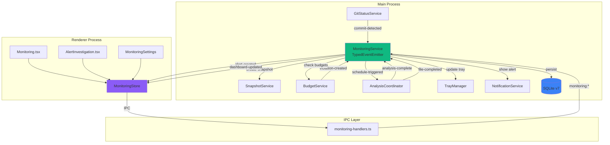
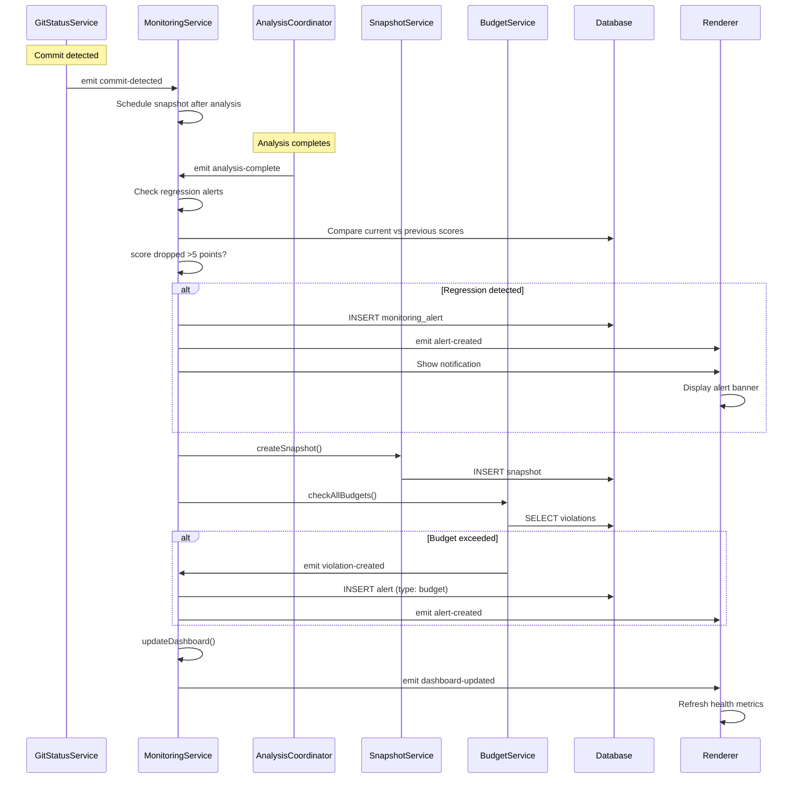
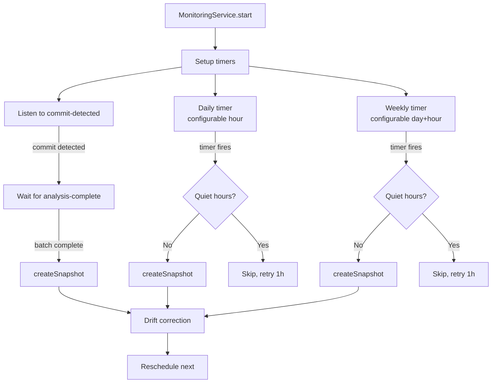

# Ongoing Monitoring Mode

## Summary

Ongoing Monitoring Mode transforms Vipr from an on-demand analysis tool into a proactive health assistant. After completing initial assessment, the app shifts into passive monitoring: watching for changes, detecting regressions, and alerting only when attention is needed. The system automatically creates snapshots on commits, monitors budget compliance, tracks health trends, and generates contextual alerts for quality degradation.

This phase integrates GitStatusService (Phase 24), SnapshotService (Phase 25), and BudgetService (Phase 26) into a unified MonitoringService that coordinates all monitoring activities, maintains a health dashboard, and respects user attention through configurable quiet hours and alert thresholds.

The UX spec is at `round-two/14-ongoing-monitoring-mode.md`.

## Prerequisites

- Phase 24 (Git Status Awareness): GitStatusService, DB migration v5, file_git_states table
- Phase 25 (Snapshot Comparison): SnapshotService with compareSnapshots(), git context
- Phase 26 (Budget Monitoring): BudgetService, budget_violations table
- Existing TrayManager and NotificationService
- Existing AnalysisCoordinator with event emission

## Architecture

### System Overview



### Data Flow



### Scheduling Logic



## Existing Infrastructure

| File                                                         | What to Reuse                                                 | Why                                             |
| ------------------------------------------------------------ | ------------------------------------------------------------- | ----------------------------------------------- |
| `clients/desktop/src/main/analysis/coordinator.ts`           | TypedEventEmitter pattern, event map, analysis-complete event | Proven event coordination, established patterns |
| `clients/desktop/src/main/analysis/snapshot-service.ts`      | createSnapshot(), compareSnapshots()                          | Core snapshot operations                        |
| `clients/desktop/src/main/git/git-status-service.ts`         | commit-detected, branch-switched events                       | Git state change detection                      |
| `clients/desktop/src/main/tray/tray-manager.ts`              | TrayState, updateState(), ICON_COLORS                         | Tray integration patterns                       |
| `clients/desktop/src/main/tray/notification-service.ts`      | showAnalysisComplete(), rate limiting                         | Notification patterns                           |
| `clients/desktop/src/main/ipc/handlers/tray.ts`              | Tray IPC handler pattern                                      | Consistent IPC approach                         |
| `clients/desktop/src/main/ipc/handlers/snapshots.ts`         | Snapshot IPC handler pattern                                  | Snapshot operation exposure                     |
| `clients/desktop/src/main/db/migrations/index.ts`            | Migration versioning (currently v5)                           | Schema evolution                                |
| `clients/desktop/src/shared/typed-event-emitter.ts`          | Base TypedEventEmitter class                                  | Type-safe events                                |
| `clients/desktop/src/shared/ipc-types.ts`                    | ViprDesktopAPI, TrayState                                     | Renderer-main contract                          |
| `clients/desktop/src/preload/index.ts`                       | Preload bridge pattern with event subscriptions               | Secure IPC exposure                             |
| `clients/desktop/src/renderer/stores/analysis.ts`            | Zustand store pattern, event subscriptions                    | State management patterns                       |
| `clients/desktop/src/renderer/components/layout/Sidebar.tsx` | NavItem structure, Insights section                           | Navigation patterns                             |

## Data Schema

### Database Migration v7

Extends v5 (from Phase 01) and v6 (from Phase 03).

#### monitoring_config Table

Singleton row for monitoring settings.

| Column                | Type    | Constraints               | Description                            |
| --------------------- | ------- | ------------------------- | -------------------------------------- |
| id                    | INTEGER | PRIMARY KEY CHECK(id = 1) | Always 1 (singleton)                   |
| monitoring_active     | INTEGER | NOT NULL DEFAULT 0        | Boolean: 1 = active, 0 = paused        |
| snapshot_frequency    | TEXT    | NOT NULL DEFAULT 'daily'  | daily, weekly, on-commit               |
| daily_snapshot_hour   | INTEGER | NULL CHECK(0-23)          | Hour for daily snapshots (UTC)         |
| weekly_snapshot_day   | INTEGER | NULL CHECK(0-6)           | Day for weekly (0=Sun, 6=Sat)          |
| weekly_snapshot_hour  | INTEGER | NULL CHECK(0-23)          | Hour for weekly snapshots              |
| alert_sensitivity     | INTEGER | NOT NULL DEFAULT 5        | Regression threshold (1-10 points)     |
| quiet_hours_start     | TEXT    | NULL                      | HH:MM format (24h)                     |
| quiet_hours_end       | TEXT    | NULL                      | HH:MM format (24h)                     |
| last_snapshot_at      | INTEGER | NULL                      | Unix timestamp                         |
| monitoring_started_at | INTEGER | NULL                      | Unix timestamp when monitoring started |

#### monitoring_alerts Table Extensions

Extends table created in Phase 01 migration v5.

| Column            | Type    | Constraints         | Description                       |
| ----------------- | ------- | ------------------- | --------------------------------- |
| resolution_status | TEXT    | NULL CHECK(IN(...)) | fixed, accepted, ignored          |
| resolved_at       | INTEGER | NULL                | Unix timestamp when resolved      |
| resolved_by       | TEXT    | NULL                | Source that resolved (user, auto) |

**New Indexes**: `idx_monitoring_alerts_resolution_status`

#### monitoring_schedules Table

Tracks scheduled snapshot creation.

| Column        | Type    | Constraints               | Description                       |
| ------------- | ------- | ------------------------- | --------------------------------- |
| id            | INTEGER | PRIMARY KEY AUTOINCREMENT | Unique identifier                 |
| schedule_type | TEXT    | NOT NULL CHECK(IN(...))   | daily, weekly, commit             |
| next_run      | INTEGER | NOT NULL                  | Unix timestamp for next execution |
| last_run      | INTEGER | NULL                      | Unix timestamp of last execution  |
| missed_count  | INTEGER | NOT NULL DEFAULT 0        | Consecutive missed runs           |
| metadata      | TEXT    | NULL                      | JSON with schedule-specific data  |

**Indexes**: `idx_monitoring_schedules_next_run`, `idx_monitoring_schedules_type`

## Type Definitions

### Shared Types

Located in `clients/desktop/src/shared/monitoring-types.ts`:

```typescript
import { z } from 'zod';

// Monitoring configuration
export const MonitoringConfigSchema = z.object({
  monitoringActive: z.boolean(),
  snapshotFrequency: z.enum(['daily', 'weekly', 'on-commit']),
  dailySnapshotHour: z.number().int().min(0).max(23).nullable(),
  weeklySnapshotDay: z.number().int().min(0).max(6).nullable(),
  weeklySnapshotHour: z.number().int().min(0).max(23).nullable(),
  alertSensitivity: z.number().int().min(1).max(10),
  quietHoursStart: z.string().nullable(), // HH:MM
  quietHoursEnd: z.string().nullable(),
  lastSnapshotAt: z.number().nullable(),
  monitoringStartedAt: z.number().nullable(),
});

export type MonitoringConfig = z.infer<typeof MonitoringConfigSchema>;

// Alert severity
export const AlertSeveritySchema = z.enum(['critical', 'warning', 'info']);
export type AlertSeverity = z.infer<typeof AlertSeveritySchema>;

// Alert type
export const AlertTypeSchema = z.enum([
  'regression',
  'budget',
  'anti-pattern',
  'stale',
  'quality-trend',
]);
export type AlertType = z.infer<typeof AlertTypeSchema>;

// Resolution status
export const ResolutionStatusSchema = z.enum(['fixed', 'accepted', 'ignored']);
export type ResolutionStatus = z.infer<typeof ResolutionStatusSchema>;

// Monitoring alert (extends Phase 01 type)
export const MonitoringAlertSchema = z.object({
  id: z.string(),
  type: AlertTypeSchema,
  severity: AlertSeveritySchema,
  title: z.string(),
  message: z.string(),
  affectedFiles: z.array(z.string()).nullable(),
  metadata: z.record(z.unknown()).nullable(),
  createdAt: z.number(),
  acknowledgedAt: z.number().nullable(),
  dismissedAt: z.number().nullable(),
  snoozedUntil: z.number().nullable(),
  resolutionStatus: ResolutionStatusSchema.nullable(),
  resolvedAt: z.number().nullable(),
  resolvedBy: z.string().nullable(),
});

export type MonitoringAlert = z.infer<typeof MonitoringAlertSchema>;

// Dashboard data
export const MonitoringDashboardSchema = z.object({
  currentHealth: z.number(),
  healthHistory: z.array(z.number()),
  scoreDelta: z.number(),
  activeAlertCount: z.number(),
  criticalAlertCount: z.number(),
  lastAnalysisAt: z.number().nullable(),
  lastSnapshotAt: z.number().nullable(),
  monitoringUptime: z.number(),
  nextSnapshotAt: z.number().nullable(),
});

export type MonitoringDashboard = z.infer<typeof MonitoringDashboardSchema>;

// Schedule entry
export const MonitoringScheduleSchema = z.object({
  id: z.number(),
  scheduleType: z.enum(['daily', 'weekly', 'commit']),
  nextRun: z.number(),
  lastRun: z.number().nullable(),
  missedCount: z.number(),
  metadata: z.record(z.unknown()).nullable(),
});

export type MonitoringSchedule = z.infer<typeof MonitoringScheduleSchema>;
```

## Implementation Tasks

Tasks follow the established pattern with ~15 tasks total, organized from infrastructure to UI.

### Task 01: Shared Monitoring Types

**Agent**: `typescript-engineer`
**Files**: Create `clients/desktop/src/shared/monitoring-types.ts`
**Pattern**: Zod schema definition from `clients/desktop/src/shared/ipc-types.ts`
**Dependencies**: None

**Description**:

Create comprehensive Zod schemas and exported types for all monitoring-related data. Include:

1. `MonitoringConfigSchema` - all configuration fields with validation
2. `AlertSeveritySchema`, `AlertTypeSchema`, `ResolutionStatusSchema` - enum types
3. `MonitoringAlertSchema` - extends Phase 01 alert with resolution fields
4. `MonitoringDashboardSchema` - all dashboard metrics
5. `MonitoringScheduleSchema` - schedule tracking

Export both schemas (for runtime validation) and inferred types (for compile-time safety).

**Verification**:

```bash
pnpm --filter @vipr/desktop typecheck
```

### Task 02: Database Migration v7

**Agent**: `typescript-engineer`
**Files**: Modify `clients/desktop/src/main/db/schema.ts` (SCHEMA_VERSION → 7), `clients/desktop/src/main/db/migrations/index.ts` (add migration_7)
**Pattern**: Migration versioning from existing migrations
**Dependencies**: Task 01

**Description**:

Create migration_7 that:

1. Creates `monitoring_config` table (singleton with CHECK id = 1, initialize with single row)
2. Alters `monitoring_alerts` table (add resolution_status, resolved_at, resolved_by columns)
3. Creates `monitoring_schedules` table with indexes
4. Bumps SCHEMA_VERSION from 6 to 7

**Verification**:

```bash
pnpm --filter @vipr/desktop build
# sqlite3 <test.db> ".schema monitoring_config"
```

### Task 03: Database Service Methods

**Agent**: `typescript-engineer`
**Files**: Modify `clients/desktop/src/main/db/database-service.ts`
**Pattern**: Existing CRUD method patterns
**Dependencies**: Task 02

**Description**:

Add methods for monitoring_config (getMonitoringConfig, updateMonitoringConfig, setMonitoringActive), alert extensions (resolveAlert, getActiveAlerts), and schedules (createSchedule, updateSchedule, getSchedulesByType, getNextSchedule). Use prepared statements and parameterized queries throughout.

**Verification**:

```bash
pnpm --filter @vipr/desktop typecheck
pnpm --filter @vipr/desktop test database-service
```

### Task 04: MonitoringService Core

**Agent**: `typescript-engineer`
**Files**: Create `clients/desktop/src/main/monitoring/monitoring-service.ts`
**Pattern**: TypedEventEmitter from watcher.ts, service lifecycle pattern
**Dependencies**: Task 03

**Description**:

Implement `MonitoringService extends TypedEventEmitter` with event map (alert-created, alert-resolved, dashboard-updated, schedule-triggered, monitoring-started, monitoring-stopped, error). Constructor takes db, gitStatusService, snapshotService, budgetService, coordinator. Core methods: start(), stop(), getDashboard(), getAlerts(), resolveAlert(), getConfig(), updateConfig(). Internal state: dashboardCache with 30s TTL, scheduleTimers Map, monitoringStartTime, lastScoreMap for regression detection.

**Verification**:

```bash
pnpm --filter @vipr/desktop typecheck
```

### Task 05: Alert Generation Engine

**Agent**: `typescript-engineer`
**Files**: Modify `clients/desktop/src/main/monitoring/monitoring-service.ts`
**Pattern**: Event-driven architecture
**Dependencies**: Task 04

**Description**:

Implement alert generation logic:

- **Regression Detection**: On coordinator `file-completed` events, compare new score vs lastScoreMap. If drop > alertSensitivity, create regression alert with metadata (oldScore, newScore, delta).
- **Budget Violation Forwarding**: On budgetService `violation-created` events, create budget alert with violation details.
- **Anti-Pattern Detection**: On coordinator `analysis-complete`, compare current anti-patterns vs previous snapshot. Create alert for new pattern categories.

All alerts use createAlert() helper that generates UUID and sets createdAt.

**Verification**:

```bash
pnpm --filter @vipr/desktop typecheck
pnpm --filter @vipr/desktop test monitoring-service
```

### Task 06: Snapshot Scheduling

**Agent**: `typescript-engineer`
**Files**: Modify `clients/desktop/src/main/monitoring/monitoring-service.ts`
**Pattern**: setInterval with drift correction
**Dependencies**: Task 05

**Description**:

Implement three scheduling mechanisms:

1. **Commit-Based**: Listen to gitStatusService `commit-detected`, wait for coordinator `analysis-complete`, then create snapshot
2. **Daily**: Calculate next midnight + configured hour, use setTimeout, reschedule after execution
3. **Weekly**: Calculate next target day + hour, use setTimeout, reschedule after execution

Include isQuietHours() check that handles quiet hours spanning midnight. If quiet hours active, defer by 1 hour and check again. Store all timers in scheduleTimers Map for cleanup.

**Verification**:

```bash
pnpm --filter @vipr/desktop typecheck
pnpm --filter @vipr/desktop test monitoring-service-schedules
```

### Task 07: Git-Aware Analysis Rules

**Agent**: `typescript-engineer`
**Files**: Modify `clients/desktop/src/main/monitoring/monitoring-service.ts`, `clients/desktop/src/main/db/database-service.ts`
**Pattern**: Event filtering based on git state
**Dependencies**: Task 04

**Description**:

Implement git-aware rules:

- Filter handleFileCompleted: Only committed files (classification='committed') trigger regression alerts. Unstaged/staged files are marked as "provisional" and excluded from snapshots.
- On branch-switched event: Clear provisional analyses and reset lastScoreMap.
- On status-changed event: Promote provisional to official if file reverted to committed state with same SHA.

Add database methods: markAnalysisProvisional(), deleteProvisionalAnalyses(), promoteProvisionalAnalysis() (requires provisional column in analyses table via schema update).

**Verification**:

```bash
pnpm --filter @vipr/desktop typecheck
pnpm --filter @vipr/desktop test git-aware-analysis
```

### Task 08: Dashboard Computation

**Agent**: `typescript-engineer`
**Files**: Modify `clients/desktop/src/main/monitoring/monitoring-service.ts`
**Pattern**: Caching with TTL
**Dependencies**: Task 04

**Description**:

Implement getDashboard() with 30s cache. Compute: currentHealth (latest snapshot avg_score), healthHistory (last 10 snapshots reversed), scoreDelta (current - previous), activeAlertCount, criticalAlertCount, lastAnalysisAt (from coordinator), lastSnapshotAt (from config), monitoringUptime (now - monitoringStartTime), nextSnapshotAt (calculated from frequency config). Cache invalidated on: new alert, alert resolved, snapshot created, config updated. Include calculateNextSnapshotTime() helper for daily/weekly schedules.

**Verification**:

```bash
pnpm --filter @vipr/desktop typecheck
pnpm --filter @vipr/desktop test dashboard-computation
```

### Task 09: IPC Handlers

**Agent**: `typescript-engineer`
**Files**: Create `clients/desktop/src/main/ipc/handlers/monitoring.ts`, modify `clients/desktop/src/main/ipc/index.ts`
**Pattern**: IPC handler registration from existing handlers
**Dependencies**: Tasks 04-08

**Description**:

Implement IPC handlers for monitoring namespace: monitoring:getDashboard, monitoring:getAlerts, monitoring:resolveAlert, monitoring:getConfig, monitoring:updateConfig, monitoring:start, monitoring:stop. Use module-level monitoringServiceRef pattern (like tray handlers). Include try/catch error handling and logging. Register in main IPC index.

**Verification**:

```bash
pnpm --filter @vipr/desktop typecheck
```

### Task 10: Preload Bridge

**Agent**: `typescript-engineer`
**Files**: Modify `clients/desktop/src/shared/ipc-types.ts`, `clients/desktop/src/preload/index.ts`
**Pattern**: ViprDesktopAPI namespace extension with event subscriptions
**Dependencies**: Task 09

**Description**:

Extend ViprDesktopAPI with monitoring namespace: methods (getDashboard, getAlerts, resolveAlert, getConfig, updateConfig, start, stop) and event subscriptions (onAlertCreated, onAlertResolved, onDashboardUpdated) that return cleanup functions. Implement in preload with Zod validation on all responses. Event listeners use ipcRenderer.on with removeListener cleanup.

**Verification**:

```bash
pnpm --filter @vipr/desktop typecheck
pnpm --filter @vipr/desktop build
```

### Task 11: Zustand Store

**Agent**: `typescript-engineer`
**Files**: Create `clients/desktop/src/renderer/stores/monitoring.ts`
**Pattern**: Zustand store pattern from analysis.ts
**Dependencies**: Task 10

**Description**:

Create monitoring store with state (dashboard, alerts, config, loading, error), actions (fetchDashboard, fetchAlerts, resolveAlert, updateConfig, startMonitoring, stopMonitoring, subscribeToEvents, reset), and internal event handlers (\_handleAlertCreated, \_handleAlertResolved, \_handleDashboardUpdated). Follow analysis store pattern for event subscriptions and cleanup. Export selector hooks (useMonitoringDashboard, useMonitoringAlerts, useMonitoringConfig, useMonitoringLoading, useMonitoringError).

**Verification**:

```bash
pnpm --filter @vipr/desktop typecheck
```

### Task 12: Monitoring Dashboard Page

**Agent**: `react-engineer`
**Files**: Create `clients/desktop/src/renderer/pages/Monitoring.tsx`
**Pattern**: UX spec composition with @vipr/ui components
**Dependencies**: Task 11

**Description**:

Implement monitoring dashboard page with 6 sections:

1. Page Header (title, status, pause toggle, force snapshot button)
2. Current Status (StatCard with LineChart sparkline in chart slot)
3. Delta Metrics Row (3 compact StatCards: Change, Active Alerts, Next Snapshot)
4. Active Alerts (EmptyState if none, Alert banners with action buttons if present)
5. Recent Activity (ActivityFeed with custom event types)
6. Velocity Trend Chart (LineChart with 30-day health + complexity)

Use exact component composition from UX spec. Action buttons live in Alert children slot.

**Verification**:

```bash
pnpm --filter @vipr/desktop build
# Manual: Navigate to /monitoring, verify all sections render
```

### Task 13: Alert Investigation View

**Agent**: `react-engineer`
**Files**: Create `clients/desktop/src/renderer/pages/AlertInvestigation.tsx`, `clients/desktop/src/renderer/hooks/useAlertInvestigation.ts`
**Pattern**: Route with URL parameter, CardTable for data display
**Dependencies**: Task 12

**Description**:

Implement alert investigation page for `/monitoring/alerts/:alertId`. Hook loads alert details, affected files metadata, and commit correlation. Page shows: Regression Summary (StatCards with before/after), Affected Files CardTable (File, Before, After, Delta, Cause columns), Commit Correlation (ActivityFeed or CardTable), Recommended Actions (action buttons). Follow UX spec visual concepts.

**Verification**:

```bash
pnpm --filter @vipr/desktop typecheck
# Manual: Click Investigate on alert, verify drill-down works
```

### Task 14: Tray Integration

**Agent**: `typescript-engineer`
**Files**: Modify `clients/desktop/src/shared/ipc-types.ts`, `clients/desktop/src/main/tray/tray-manager.ts`
**Pattern**: Backward-compatible interface extension
**Dependencies**: Task 04

**Description**:

Extend TrayState with optional monitoring fields (monitoringActive, alertCount, healthStatus). Update TrayManager icon color logic: gray when paused, red when alerts, else follow health status. Extend context menu with monitoring status labels and pause/resume toggle. Wire MonitoringService to update tray state on dashboard changes.

**Verification**:

```bash
pnpm --filter @vipr/desktop build
# Manual: Check tray icon changes color with alerts, menu shows monitoring status
```

### Task 15: Notification Integration

**Agent**: `typescript-engineer`
**Files**: Modify `clients/desktop/src/main/tray/notification-service.ts`
**Pattern**: Notification creation with rate limiting
**Dependencies**: Task 04

**Description**:

Add showMonitoringAlert() method with separate rate limiting (1 minute). Include isQuietHours() check (reuse from MonitoringService logic). Format notification title with severity emoji (🔴 CRITICAL, ⚠️ WARNING, ℹ️ INFO). Wire MonitoringService to call showMonitoringAlert() on alert-created events (respecting quiet hours and rate limits).

**Verification**:

```bash
pnpm --filter @vipr/desktop build
# Manual: Generate alert, verify notification appears (unless quiet hours)
```

### Task 16: Sidebar and Routing

**Agent**: `react-engineer`
**Files**: Modify `clients/desktop/src/renderer/components/layout/Sidebar.tsx`, `clients/desktop/src/renderer/App.tsx`, `clients/desktop/src/renderer/pages/Settings.tsx`
**Pattern**: NavItem structure, SettingCard from Phase 12
**Dependencies**: Tasks 12-13

**Description**:

Add Monitoring NavItem in Insights section (after Snapshots, before Velocity Trends) with alert badge. Add routes: `/monitoring` → Monitoring page, `/monitoring/alerts/:alertId` → AlertInvestigation page. Add monitoring settings section to Settings page using SettingCard pattern: Enable Monitoring (Switch), Snapshot Frequency (Dropdown), Alert Sensitivity (Input), Quiet Hours (two time Inputs).

**Verification**:

```bash
pnpm --filter @vipr/desktop build
# Manual: Navigate to /monitoring, click Investigate, verify routing works
```

### Task 17: Integration Tests

**Agent**: `vitest-engineer`
**Files**: Create `clients/desktop/src/main/monitoring/monitoring-service.test.ts`
**Pattern**: Service integration testing with mocked dependencies
**Dependencies**: Tasks 04-08

**Description**:

Write comprehensive integration tests covering: service lifecycle (start/stop cycles, no memory leaks), regression detection (score drop >5 creates alert, ≤5 doesn't, provisional files don't), budget integration (violation creates budget alert), snapshot scheduling (commit-based after analysis-complete, daily at configured hour, weekly at configured day+hour, quiet hours defers by 1h), dashboard computation (cache invalidation on alerts/snapshots), git-aware rules (committed files in snapshots, unstaged files provisional, branch switch clears provisional). Use `vi.useFakeTimers()` to control time.

**Verification**:

```bash
pnpm --filter @vipr/desktop test monitoring-service
```

## Verification Plan

### Build & Type Safety

```bash
pnpm --filter @vipr/desktop typecheck
pnpm --filter @vipr/desktop build
pnpm --filter @vipr/desktop test
```

### Unit Test Coverage

| Component         | Test File                  | Coverage Goals                                             |
| ----------------- | -------------------------- | ---------------------------------------------------------- |
| MonitoringService | monitoring-service.test.ts | Lifecycle, events, scheduling, regression, git integration |
| Database Methods  | database-service.test.ts   | CRUD for config/alerts/schedules, singleton pattern        |

### Functional Testing

1. **Monitoring Lifecycle**: Open repo → verify starts, close → verify stops, pause/resume → verify schedules
2. **Regression Detection**: Edit file → score drop >5 → verify alert, score drop ≤5 → no alert, unstaged → no alert
3. **Budget Alerts**: Exceed budget → verify budget alert created
4. **Snapshot Scheduling**: Commit → snapshot after analysis, daily/weekly → fires at configured time, quiet hours → deferred
5. **Dashboard Display**: Navigate to /monitoring → verify all sections render with correct data
6. **Alert Investigation**: Click Investigate → verify navigation and data population
7. **Tray Integration**: Verify icon color changes with alerts, menu shows monitoring status
8. **Notifications**: Generate alert → verify notification, quiet hours → verify suppressed

### Database Schema Verification

```sql
.schema monitoring_config
SELECT COUNT(*) FROM monitoring_config; -- Should be 1
.schema monitoring_alerts
.schema monitoring_schedules
SELECT version FROM schema_version; -- Should return 7
```

### Integration Points

| Feature              | Integration                        | Verification                              |
| -------------------- | ---------------------------------- | ----------------------------------------- |
| Git Status Awareness | commit-detected → snapshot         | Trigger commit, verify snapshot created   |
| Budget Monitoring    | violation-created → alert          | Exceed budget, verify alert shown         |
| Snapshot Comparison  | compareSnapshots in investigation  | Click Investigate, verify comparison data |
| Tray Manager         | updateState with monitoring fields | Generate alert, verify tray icon changes  |
| Notification Service | showMonitoringAlert                | Generate alert, verify notification       |

## Performance Considerations

1. **Dashboard Caching**: 30s TTL prevents redundant computation
2. **Snapshot Scheduling**: setTimeout for single-shot timers, drift correction prevents creep
3. **Regression Detection**: In-memory lastScoreMap (O(1) lookup), cleared on branch switch
4. **Event Emission**: Emit alert-created once, batch dashboard updates (30s cache)
5. **Database Operations**: Prepared statements, indexes on next_run for schedules

## Error Handling

| Scenario                  | Handling Strategy                                      |
| ------------------------- | ------------------------------------------------------ |
| Snapshot creation failure | Skip, log error, emit error event, continue monitoring |
| Alert generation failure  | Log warning, skip alert, continue monitoring           |
| Schedule failure          | Increment missedCount, retry next interval             |
| Database write failure    | Retry once, emit error, continue monitoring            |

## Security Considerations

1. **Input Validation**: Validate all config updates with Zod schemas, sanitize file paths in alerts
2. **Database Injection**: Use parameterized queries exclusively, validate enum values
3. **Event Listener Leaks**: Return cleanup functions, remove listeners on stop, test for leaks

## Future Enhancements

### Short Term (v0.26.x)

- Customizable regression thresholds per file/directory
- Alert grouping (multiple regressions in same commit)
- Email notifications
- Monitoring report export (PDF/Markdown)

### Medium Term (v0.27.x)

- Predictive alerts (ML-based regression prediction)
- Team collaboration (shared monitoring state)
- CI/CD integration (fail builds on critical alerts)

### Long Term (v0.28.x+)

- Multi-repository monitoring (portfolio dashboard)
- Custom alert rules (user-defined thresholds)
- Integration with issue trackers
- Monitoring API for external tools

## References

### Internal Documentation

- `round-two/14-ongoing-monitoring-mode.md` - UX spec
- `round-two/12-embedded-mcp-server.md` - SettingCard patterns
- `round-three/01-git-status-awareness.md` - GitStatusService
- `round-three/03-complexity-budget-monitoring.md` - BudgetService
- `clients/desktop/src/main/analysis/coordinator.ts` - Event patterns
- `clients/desktop/src/renderer/stores/analysis.ts` - Zustand patterns
- `packages/ui/src/components/common/InsightCard.tsx` - Progressive disclosure reference
