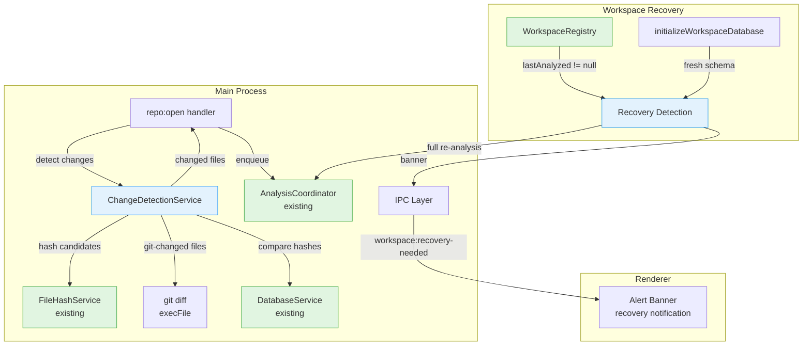
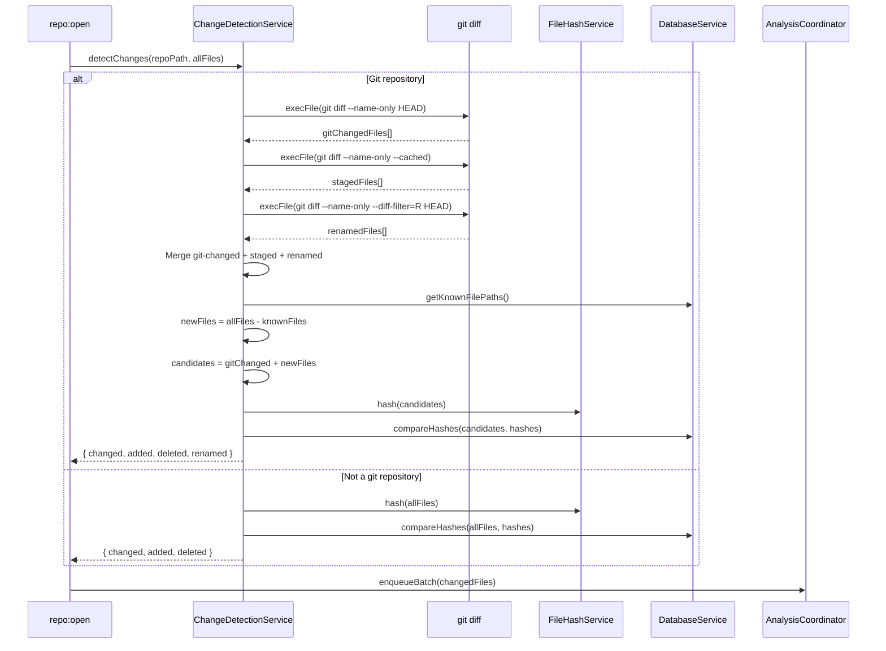
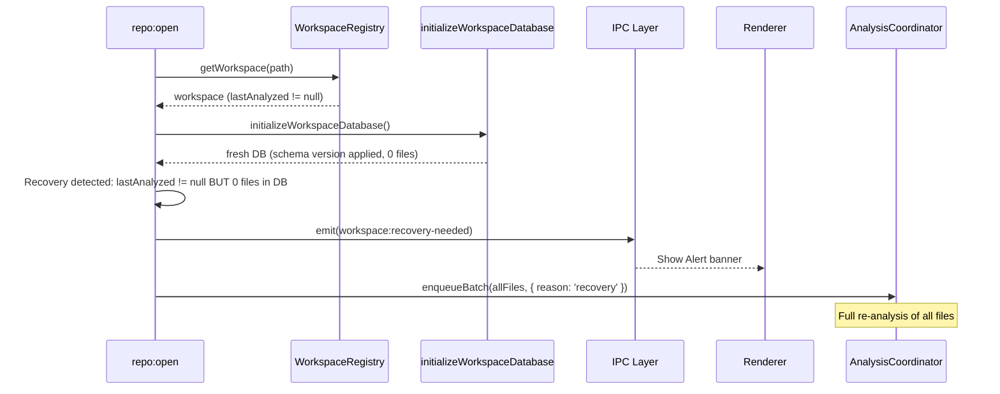

# Resilient Change Detection & Workspace Recovery

## Summary

This phase replaces the brute-force content hashing on `repo:open` with a hybrid git+hash strategy that narrows the candidate set before computing SHA-256 hashes. For returning workspaces, `git diff --name-only HEAD` identifies git-changed files in O(1) tree comparison, then only those files (plus any files not yet in the DB) are hashed against stored `files.sha` values. This reduces re-open time from O(n) full hashes to O(changed) hashes.

Additionally, this phase adds workspace recovery: when a workspace database is deleted or corrupted (fresh schema but non-null `lastAnalyzed` in registry), the system detects the recovery state, notifies the user, and triggers a full re-analysis.

No schema migration is needed -- this phase uses the existing `files.sha` column and workspace registry.

## Prerequisites

- Phase 24 (Git Status Awareness): GitStatusService available for git operations
- Existing `FileHashService` for SHA-256 hashing
- Existing `DatabaseService.getChangedFiles()` for hash comparison
- Existing `WorkspaceRegistry` for workspace metadata

## Architecture

### System Overview



### Data Flow: Hybrid Change Detection



### Data Flow: Workspace Recovery



## Existing Infrastructure

| File                                                     | What to Reuse                        | Why                                                 |
| -------------------------------------------------------- | ------------------------------------ | --------------------------------------------------- |
| `clients/desktop/src/main/analysis/file-hash-service.ts` | `FileHashService.computeHash()`      | SHA-256 hashing, error handling with Result type    |
| `clients/desktop/src/main/ipc/handlers/repository.ts`    | `repo:open` handler (lines 182-199)  | Current change detection logic to replace           |
| `clients/desktop/src/main/db/interfaces.ts`              | `DatabaseService.getChangedFiles()`  | Hash comparison against stored values               |
| `clients/desktop/src/main/db/workspace-registry.ts`      | `WorkspaceEntry`, `getWorkspace()`   | Workspace metadata for recovery detection           |
| `packages/engine/src/git-changed-files.ts`               | `execFile` pattern for git commands  | Security: prevents shell injection, proven approach |
| `clients/desktop/src/main/analysis/coordinator.ts`       | `AnalysisCoordinator.enqueueBatch()` | Batch file enqueue with reason tracking             |

## Type Definitions

```typescript
import { z } from 'zod';

// Change detection result
const changeDetectionResultSchema = z.object({
  changed: z.array(z.string()), // Files with different content hash
  added: z.array(z.string()), // Files not in DB (new)
  deleted: z.array(z.string()), // Files in DB but not on disk
  renamed: z.array(
    z.object({
      oldPath: z.string(),
      newPath: z.string(),
    })
  ),
  totalCandidates: z.number(), // Files actually hashed (for metrics)
  totalFiles: z.number(), // Total files on disk
  detectionMethod: z.enum(['hybrid', 'full-hash']), // Which strategy was used
  durationMs: z.number(), // Time taken for detection
});

type ChangeDetectionResult = z.infer<typeof changeDetectionResultSchema>;

// Recovery state
const workspaceRecoveryStateSchema = z.object({
  isRecovery: z.boolean(),
  reason: z.enum(['db-deleted', 'db-corrupted', 'schema-reset']),
  previousLastAnalyzed: z.number().nullable(),
  totalFiles: z.number(),
});

type WorkspaceRecoveryState = z.infer<typeof workspaceRecoveryStateSchema>;
```

## Implementation Tasks

### Task 01: Create ChangeDetectionService

**Agent**: `typescript-engineer`

**Files**:

- Create: `clients/desktop/src/main/services/change-detection-service.ts`

**Patterns**:

- `execFile` pattern from `packages/engine/src/git-changed-files.ts`
- `FileHashService.computeHash()` for SHA-256 hashing
- Error handling with Result type

**Dependencies**: None

**Description**:

Implement `ChangeDetectionService`:

```typescript
class ChangeDetectionService {
  constructor(
    private readonly fileHashService: FileHashService,
    private readonly db: DatabaseService
  ) {}

  async detectChanges(repoPath: string, allFiles: string[]): Promise<ChangeDetectionResult>;

  private async getGitChangedFiles(repoPath: string): Promise<string[]>;
  private async getGitStagedFiles(repoPath: string): Promise<string[]>;
  private async getGitRenamedFiles(
    repoPath: string
  ): Promise<Array<{ oldPath: string; newPath: string }>>;
  private async isGitRepository(repoPath: string): Promise<boolean>;
  private getDeletedFiles(allFiles: string[], knownFiles: string[]): string[];
  private getNewFiles(allFiles: string[], knownFiles: string[]): string[];
}
```

**Change detection strategy**:

1. Check if directory is a git repository (`git rev-parse --is-inside-work-tree`)
2. If git: use `git diff --name-only HEAD` + `git diff --name-only --cached` to get git-changed files
3. Get known file paths from DB
4. Compute new files: `allFiles - knownFiles`
5. Candidates = `gitChanged + newFiles` (only these need hashing)
6. Hash candidates with `FileHashService`
7. Compare hashes with `DatabaseService` stored `files.sha` values
8. Detect deleted files: files in DB but not in `allFiles`
9. Detect renamed files: `git diff --name-only --diff-filter=R HEAD`
10. If not git: fall back to full hash scan (existing behavior)

All git commands use `execFile` (not `exec`) for security. Handle git failures gracefully by falling back to full hash scan.

**Verification**:

```bash
pnpm --filter @vipr/desktop typecheck
```

### Task 02: Unit Tests for ChangeDetectionService

**Agent**: `vitest-engineer`

**Files**:

- Create: `clients/desktop/src/main/services/change-detection-service.test.ts`

**Patterns**:

- Mock `execFile` with `vi.mock('node:child_process')`
- Mock `FileHashService` and `DatabaseService`
- Test fixtures with sample git output

**Dependencies**: Task 01

**Description**:

Write comprehensive tests covering:

1. **Hybrid detection (git repo)**:
   - Git-changed files are hashed, unchanged files are skipped
   - New files (not in DB) are always hashed
   - Deleted files (in DB, not on disk) are detected
   - Renamed files are detected via `--diff-filter=R`
   - Staged files are included in candidates
2. **Full hash fallback (non-git)**:
   - All files are hashed when git is unavailable
   - `detectionMethod` is `'full-hash'`
3. **Git failures**:
   - `git diff` fails: falls back to full hash
   - `git rev-parse` fails: treated as non-git repo
4. **Edge cases**:
   - Empty repository (no files)
   - All files unchanged (nothing to analyze)
   - All files new (first-time, same as current behavior)
   - Mixed: some changed, some new, some deleted
5. **Performance metrics**:
   - `totalCandidates` reflects actual hashed count
   - `durationMs` is positive

**Verification**:

```bash
pnpm --filter @vipr/desktop test change-detection-service
```

### Task 03: Integrate ChangeDetectionService into repo:open

**Agent**: `typescript-engineer`

**Files**:

- Modify: `clients/desktop/src/main/ipc/handlers/repository.ts`

**Patterns**:

- Existing `repo:open` handler pattern (lines 182-199)
- Service instantiation in handler

**Dependencies**: Task 01

**Description**:

Replace the existing delta check logic in `repo:open`:

**Before** (current, lines 182-199):

```typescript
if (needsInitialAnalysis) {
  filesToAnalyze = files;
} else {
  filesToAnalyze = dbServiceRef!.getChangedFiles(files);
}
```

**After**:

```typescript
if (needsInitialAnalysis) {
  filesToAnalyze = files;
  changedFileCount = files.length;
} else {
  const changeDetection = new ChangeDetectionService(fileHashService, dbServiceRef!);
  const result = await changeDetection.detectChanges(payload.path, files);
  filesToAnalyze = [...result.changed, ...result.added];
  changedFileCount = filesToAnalyze.length;
  logger.info(
    `Hybrid detection (${result.detectionMethod}): ${result.totalCandidates}/${result.totalFiles} files hashed, ${changedFileCount} need analysis`,
    { durationMs: result.durationMs }
  );
}
```

Handle renamed files by updating file paths in the database rather than re-analyzing.

**Verification**:

```bash
pnpm --filter @vipr/desktop typecheck
pnpm --filter @vipr/desktop build
```

### Task 04: Implement Workspace Recovery Detection

**Agent**: `typescript-engineer`

**Files**:

- Modify: `clients/desktop/src/main/ipc/handlers/repository.ts`

**Patterns**:

- Existing workspace registry check pattern
- IPC event emission for renderer notification

**Dependencies**: Task 03

**Description**:

Add recovery detection to `repo:open`:

1. After `initializeWorkspaceDatabase()`, check if the DB is fresh (0 files) but `workspace.lastAnalyzed` is non-null in the registry
2. If recovery state detected:
   - Log: `'Workspace recovery detected: DB was reset but workspace was previously analyzed'`
   - Emit `workspace:recovery-needed` event to renderer with `WorkspaceRecoveryState`
   - Set `reason: 'recovery'` on the batch enqueue
   - Skip hybrid detection (full analysis needed)
3. Update workspace registry `lastAnalyzed` after recovery analysis completes

```typescript
const existingFiles = dbServiceRef!.getAllFiles();
const isRecovery = existingFiles.length === 0 && workspace.lastAnalyzed !== null;

if (isRecovery) {
  logger.warn('Workspace recovery: DB reset detected, triggering full re-analysis');
  sendToRenderer('workspace:recovery-needed', {
    isRecovery: true,
    reason: 'db-deleted',
    previousLastAnalyzed: workspace.lastAnalyzed,
    totalFiles: files.length,
  });
  filesToAnalyze = files;
  changedFileCount = files.length;
}
```

**Verification**:

```bash
pnpm --filter @vipr/desktop typecheck
```

### Task 05: Add Recovery UI Banner

**Agent**: `typescript-engineer`

**Files**:

- Modify: `clients/desktop/src/shared/ipc-types.ts` (add recovery event type)
- Modify: `clients/desktop/src/preload/index.ts` (add event subscription)
- Modify: `clients/desktop/src/renderer/stores/analysis.ts` (add recovery state)

**Patterns**:

- Event subscription pattern from existing stores
- Alert component for banner display

**Dependencies**: Task 04

**Description**:

1. Add `workspace:recovery-needed` event to IPC types and preload bridge:

```typescript
// In ViprDesktopAPI
workspace: {
  // ... existing
  onRecoveryNeeded: (callback: (state: WorkspaceRecoveryState) => void) => () => void;
};
```

2. Add recovery state to analysis store:

```typescript
interface AnalysisStore {
  // ... existing
  isRecovery: boolean;
  recoveryState: WorkspaceRecoveryState | null;
}
```

3. Subscribe to recovery event in store, set state when received, clear when analysis completes

4. In the renderer, show an Alert banner when `isRecovery` is true:

```tsx
<Alert variant="banner" type="warning">
  Workspace database was reset. Re-analyzing all {recoveryState.totalFiles} files...
</Alert>
```

Dismiss the banner when analysis completes (listen for `analysis-complete` event).

**Verification**:

```bash
pnpm --filter @vipr/desktop typecheck
```

### Task 06: Unit Tests for Workspace Recovery

**Agent**: `vitest-engineer`

**Files**:

- Create: `clients/desktop/src/main/ipc/handlers/repository-recovery.test.ts`

**Patterns**:

- Mock DatabaseService, WorkspaceRegistry
- Test detection logic in isolation

**Dependencies**: Task 04

**Description**:

Test coverage:

1. **Recovery detection**:
   - Fresh DB + non-null lastAnalyzed → recovery detected
   - Fresh DB + null lastAnalyzed → first-time (no recovery)
   - Existing files in DB + non-null lastAnalyzed → normal reopen (no recovery)
2. **Recovery behavior**:
   - All files enqueued for analysis on recovery
   - Recovery event emitted to renderer
   - Logger warns about recovery state
3. **Normal reopen**:
   - Hybrid detection used (not full scan)
   - No recovery event emitted

**Verification**:

```bash
pnpm --filter @vipr/desktop test repository-recovery
```

## IPC Surface

### Events (Main → Renderer)

| Event                       | Payload                  | Trigger                                             |
| --------------------------- | ------------------------ | --------------------------------------------------- |
| `workspace:recovery-needed` | `WorkspaceRecoveryState` | Fresh DB detected for previously-analyzed workspace |

No new IPC invoke methods are needed -- change detection is internal to `repo:open`.

### Preload Bridge

```typescript
workspace: {
  // ... existing methods
  onRecoveryNeeded: (callback: (state: WorkspaceRecoveryState) => void) => {
    const handler = (_: unknown, data: WorkspaceRecoveryState) => callback(data);
    ipcRenderer.on('workspace:recovery-needed', handler);
    return () => ipcRenderer.removeListener('workspace:recovery-needed', handler);
  },
},
```

## UI Components

### Recovery Banner

- **Component**: Alert (`variant="banner"`, `level="warning"`)
- **Location**: Top of main content area (same as existing notification banners)
- **Content**: "Workspace database was reset. Re-analyzing all N files..."
- **Dismiss**: Auto-dismiss when analysis completes
- **Catalog reference**: `@vipr/ui` Alert component

No new pages or complex UI is needed for this phase.

## Edge Cases

| Scenario                                 | Handling                                                                           |
| ---------------------------------------- | ---------------------------------------------------------------------------------- |
| Git not installed                        | Fall back to full hash scan, log warning                                           |
| Shallow clone (no history)               | `git diff HEAD` still works, proceed normally                                      |
| Large monorepo (10k+ files)              | Hybrid detection limits hashing to git-changed subset                              |
| Renamed + modified file                  | Detect rename via `--diff-filter=R`, hash new path                                 |
| Binary files in repo                     | `FileHashService` hashes all content types, no special handling                    |
| DB file locked by another process        | Database initialization fails, propagate error to user                             |
| DB file exists but is corrupted          | SQLite open may succeed but queries fail; catch, delete, re-initialize as recovery |
| Network drive (slow I/O)                 | Git operations may be slow; no timeout on `execFile` for diff (fast operation)     |
| `.git` directory missing but files exist | `isGitRepository()` returns false, use full hash scan                              |

## Performance Considerations

| Metric                   | Before (Full Hash) | After (Hybrid)           | Improvement               |
| ------------------------ | ------------------ | ------------------------ | ------------------------- |
| 1000 files, 10 changed   | 1000 hashes        | 10 hashes + 1 git diff   | ~100x fewer hashes        |
| 1000 files, 500 changed  | 1000 hashes        | 500 hashes + 1 git diff  | ~2x fewer hashes          |
| 1000 files, 1000 changed | 1000 hashes        | 1000 hashes + 1 git diff | No improvement (fallback) |
| Non-git directory        | 1000 hashes        | 1000 hashes              | No change (same behavior) |

The git diff operation is O(1) for tree comparison (it compares tree object SHAs, not file contents), making it effectively free compared to hashing.

## Verification Plan

### Build & Type Safety

```bash
pnpm --filter @vipr/desktop typecheck
pnpm --filter @vipr/desktop build
```

### Unit Test Coverage

| Component              | Test File                          | Coverage Goals                         |
| ---------------------- | ---------------------------------- | -------------------------------------- |
| ChangeDetectionService | `change-detection-service.test.ts` | Hybrid detection, fallback, edge cases |
| Recovery Detection     | `repository-recovery.test.ts`      | Detection logic, event emission        |

### Functional Testing

1. **Hybrid detection**: Open a previously-analyzed repo, modify 2 files, reopen. Verify only 2 files are re-analyzed (check coordinator queue size).
2. **Workspace recovery**: Delete the workspace `.db` file, reopen repo. Verify recovery banner appears and all files are re-analyzed.
3. **Non-git fallback**: Open a directory that is not a git repo. Verify full hash scan is used.
4. **Performance**: Time `repo:open` for a 1000+ file repo before and after this change.

## Security Considerations

1. **Command injection**: All git commands use `execFile` (not `exec`), preventing shell injection
2. **Path traversal**: File paths from git diff output are validated against repo root before use
3. **Race conditions**: Git state may change between diff and hash; hash comparison is the final authority (correctness preserved)

## References

### Internal Documentation

- `packages/engine/src/git-changed-files.ts` - Established `execFile` git pattern
- `clients/desktop/src/main/analysis/file-hash-service.ts` - SHA-256 hashing reference
- `clients/desktop/src/main/ipc/handlers/repository.ts` - Current change detection (lines 182-199)
- `clients/desktop/src/main/db/workspace-registry.ts` - Workspace metadata

### External Documentation

- [git-diff documentation](https://git-scm.com/docs/git-diff)
- [Node.js child_process.execFile](https://nodejs.org/api/child_process.html#child_processexecfilefile-args-options-callback)
