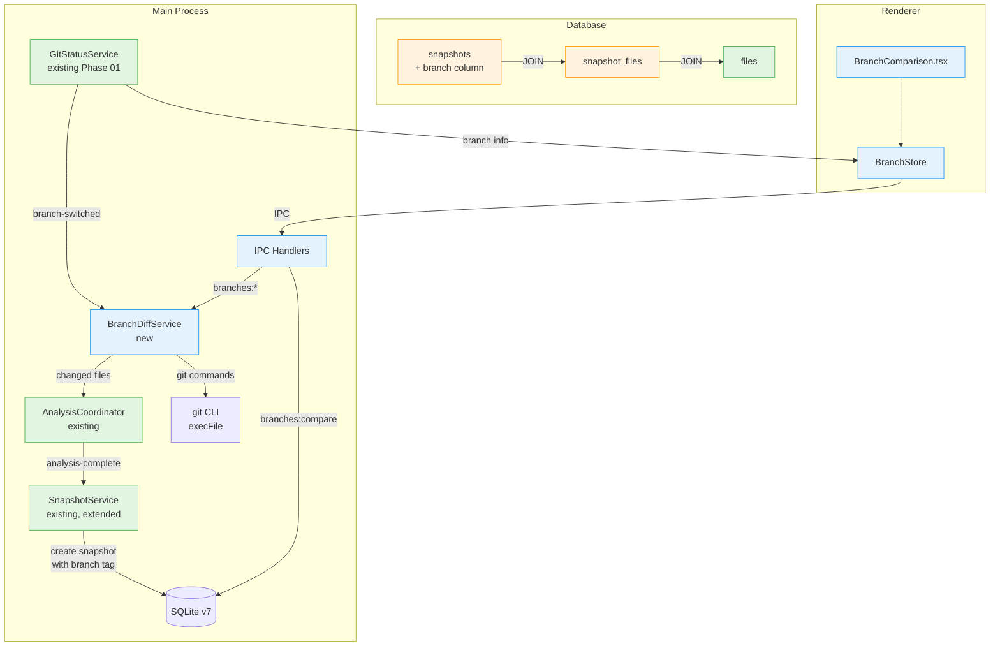
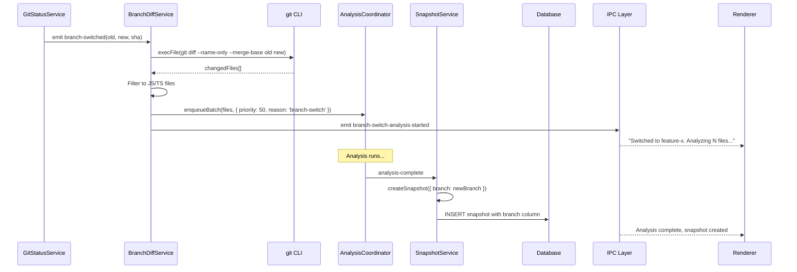
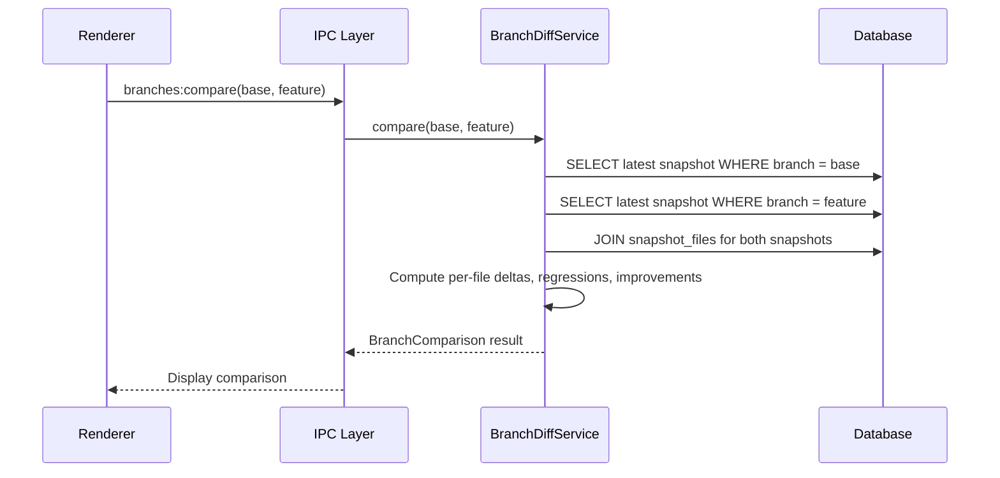

# Branch-Aware Analysis & Delta Comparison

## Summary

This phase adds branch awareness to the analysis pipeline. Snapshots are tagged with the branch they were created on, enabling per-branch history and cross-branch metric comparison. When `GitStatusService` detects a branch switch, `BranchDiffService` identifies changed files between branches and enqueues them for re-analysis. A new `BranchComparison.tsx` page lets users compare code quality metrics between any two branches.

The storage strategy is branch-tagged snapshots with branch-agnostic files/analyses. The `files` and `analyses` tables always reflect the current working tree state (semantically correct regardless of branch). Snapshots carry a `branch` column for per-branch history. Cross-branch comparison joins two branch-filtered snapshots via `snapshot_files`.

## Prerequisites

- Phase 24 (Git Status Awareness): `GitStatusService` with `branch-switched` event
- Phase 28 (Resilient Change Detection): `ChangeDetectionService` for efficient delta detection
- Existing `SnapshotService` with `createSnapshot()`
- Existing `AnalysisCoordinator` with `enqueueBatch()`

## Architecture

### System Overview



### Data Flow: Branch Switch



### Data Flow: Cross-Branch Comparison



## Existing Infrastructure

| File                                                    | What to Reuse                                  | Why                                       |
| ------------------------------------------------------- | ---------------------------------------------- | ----------------------------------------- |
| `clients/desktop/src/main/analysis/snapshot-service.ts` | `createSnapshot()` to extend with branch param | Add branch column to snapshot creation    |
| `clients/desktop/src/main/db/schema.ts`                 | Schema definition (SCHEMA_VERSION)             | Bump to v7, add branch column             |
| `clients/desktop/src/main/db/migrations/index.ts`       | Migration pattern                              | Add migration_7                           |
| `packages/engine/src/git-changed-files.ts`              | `execFile` git pattern                         | Security: `execFile` for all git commands |
| `clients/desktop/src/main/analysis/coordinator.ts`      | `enqueueBatch()` with priority and reason      | Enqueue branch-switch changed files       |
| `clients/desktop/src/renderer/pages/VelocityTrends.tsx` | Sparkline/trend chart patterns                 | Reference for branch comparison charts    |
| `packages/ui/src/components/tables/CardTable.tsx`       | File list table                                | Display file-level comparison             |

## Data Schema

### Migration v7: Add branch to snapshots

```sql
ALTER TABLE snapshots ADD COLUMN branch TEXT;
CREATE INDEX idx_snapshots_branch ON snapshots(branch);

-- Backfill existing snapshots with 'main' (best guess)
UPDATE snapshots SET branch = 'main' WHERE branch IS NULL;
```

No new tables are created. The existing `snapshots` table gains a single column.

### Query: Cross-Branch Comparison

```sql
-- Get file scores from two branch snapshots for comparison
SELECT
  COALESCE(a.file_path, b.file_path) AS file_path,
  a.overall_score AS base_score,
  b.overall_score AS feature_score,
  (b.overall_score - a.overall_score) AS delta,
  CASE
    WHEN a.file_path IS NULL THEN 'added'
    WHEN b.file_path IS NULL THEN 'removed'
    WHEN b.overall_score < a.overall_score THEN 'regression'
    WHEN b.overall_score > a.overall_score THEN 'improvement'
    ELSE 'unchanged'
  END AS status
FROM (
  SELECT f.path AS file_path, sf.overall_score
  FROM snapshot_files sf
  JOIN files f ON sf.file_id = f.id
  WHERE sf.snapshot_id = :baseSnapshotId
) a
FULL OUTER JOIN (
  SELECT f.path AS file_path, sf.overall_score
  FROM snapshot_files sf
  JOIN files f ON sf.file_id = f.id
  WHERE sf.snapshot_id = :featureSnapshotId
) b ON a.file_path = b.file_path
WHERE a.overall_score != b.overall_score
   OR a.file_path IS NULL
   OR b.file_path IS NULL
ORDER BY delta ASC;
```

## Type Definitions

```typescript
import { z } from 'zod';

// Branch info
const branchInfoSchema = z.object({
  name: z.string(),
  headSha: z.string(),
  upstream: z.string().nullable(),
});

type BranchInfo = z.infer<typeof branchInfoSchema>;

// Branch divergence
const branchDivergenceSchema = z.object({
  ahead: z.number(),
  behind: z.number(),
  mergeBase: z.string(),
});

type BranchDivergence = z.infer<typeof branchDivergenceSchema>;

// File comparison entry
const fileComparisonEntrySchema = z.object({
  filePath: z.string(),
  baseScore: z.number().nullable(),
  featureScore: z.number().nullable(),
  delta: z.number(),
  status: z.enum(['regression', 'improvement', 'added', 'removed', 'unchanged']),
});

type FileComparisonEntry = z.infer<typeof fileComparisonEntrySchema>;

// Per-metric delta
const metricDeltaSchema = z.object({
  metric: z.string(),
  baseMean: z.number().nullable(),
  featureMean: z.number().nullable(),
  delta: z.number(),
  baseFileCount: z.number(),
  featureFileCount: z.number(),
});

type MetricDelta = z.infer<typeof metricDeltaSchema>;

// Full branch comparison
const branchComparisonSchema = z.object({
  baseBranch: z.string(),
  featureBranch: z.string(),
  baseSnapshot: z
    .object({
      id: z.number(),
      gitSha: z.string(),
      createdAt: z.number(),
    })
    .nullable(),
  featureSnapshot: z
    .object({
      id: z.number(),
      gitSha: z.string(),
      createdAt: z.number(),
    })
    .nullable(),
  divergence: branchDivergenceSchema,
  files: z.array(fileComparisonEntrySchema),
  metricDeltas: z.array(metricDeltaSchema),
  summary: z.object({
    totalFilesChanged: z.number(),
    regressions: z.number(),
    improvements: z.number(),
    added: z.number(),
    removed: z.number(),
  }),
});

type BranchComparison = z.infer<typeof branchComparisonSchema>;
```

## Implementation Tasks

### Task 01: Database Migration v7

**Agent**: `typescript-engineer`

**Files**:

- Modify: `clients/desktop/src/main/db/schema.ts` (bump SCHEMA_VERSION to 7)
- Modify: `clients/desktop/src/main/db/migrations/index.ts` (add migration_7)

**Patterns**:

- Migration pattern from existing migrations (001-006)
- ALTER TABLE for adding columns

**Dependencies**: None

**Description**:

Create migration_7 that:

1. Adds `branch TEXT` column to `snapshots` table
2. Creates index `idx_snapshots_branch` on `snapshots(branch)`
3. Backfills existing rows: `UPDATE snapshots SET branch = 'main' WHERE branch IS NULL`
4. Bumps SCHEMA_VERSION from 6 to 7

Follow the existing migration pattern: check version, execute DDL, update metadata.

**Verification**:

```bash
pnpm --filter @vipr/desktop typecheck
```

### Task 02: Extend SnapshotService with Branch

**Agent**: `typescript-engineer`

**Files**:

- Modify: `clients/desktop/src/main/analysis/snapshot-service.ts`
- Modify: `clients/desktop/src/main/db/types.ts` (add branch to SnapshotRecord)

**Patterns**:

- Existing `createSnapshot()` pattern
- Optional parameter with default

**Dependencies**: Task 01 (migration)

**Description**:

Extend `SnapshotService.createSnapshot()` to accept an optional `branch` parameter:

```typescript
async createSnapshot(options?: { branch?: string }): Promise<SnapshotRecord> {
  const branch = options?.branch ?? await this.getCurrentBranch();
  // ... existing logic
  // Include branch in INSERT statement
}

private async getCurrentBranch(): Promise<string> {
  const { stdout } = await execFileAsync('git', ['rev-parse', '--abbrev-ref', 'HEAD'], {
    cwd: this.repoPath,
  });
  return stdout.trim();
}
```

Update `SnapshotRecord` type to include `branch: string | null`.

Update the INSERT query to include the branch column.

**Verification**:

```bash
pnpm --filter @vipr/desktop typecheck
```

### Task 03: Create BranchDiffService

**Agent**: `typescript-engineer`

**Files**:

- Create: `clients/desktop/src/main/git/branch-diff-service.ts`

**Patterns**:

- `execFile` pattern from `packages/engine/src/git-changed-files.ts`
- TypedEventEmitter pattern

**Dependencies**: Task 02 (snapshot branch support)

**Description**:

Implement `BranchDiffService`:

```typescript
class BranchDiffService {
  constructor(private readonly repoPath: string) {}

  async getChangedFilesBetweenBranches(base: string, feature: string): Promise<string[]>;

  async getMergeBase(branch1: string, branch2: string): Promise<string>;

  async getBranchList(): Promise<string[]>;

  async getCurrentBranch(): Promise<BranchInfo>;

  async getBranchDivergence(branch: string, upstream: string): Promise<BranchDivergence>;
}
```

**Implementation details**:

- `getChangedFilesBetweenBranches`: Use `git diff --name-only --merge-base base feature` (requires Git 2.30+). Fallback to `git diff --name-only base...feature` (three-dot syntax) for older git versions. Filter results to JS/TS file extensions.
- `getMergeBase`: Use `git merge-base branch1 branch2`
- `getBranchList`: Use `git branch --list --format=%(refname:short)`
- `getCurrentBranch`: Use `git rev-parse --abbrev-ref HEAD` + `git rev-parse HEAD`
- `getBranchDivergence`: Use `git rev-list --left-right --count branch...upstream`

All commands use `execFile` for security. Handle errors gracefully (e.g., branch doesn't exist, no merge base found).

**Verification**:

```bash
pnpm --filter @vipr/desktop typecheck
```

### Task 04: Unit Tests for BranchDiffService

**Agent**: `vitest-engineer`

**Files**:

- Create: `clients/desktop/src/main/git/branch-diff-service.test.ts`

**Patterns**:

- Mock `execFile` with `vi.mock('node:child_process')`
- Test fixtures with sample git output

**Dependencies**: Task 03

**Description**:

Test coverage:

1. **getChangedFilesBetweenBranches**:
   - Returns changed files between two branches
   - Filters to JS/TS extensions only
   - Handles empty diff (branches identical)
   - Falls back to three-dot syntax on `--merge-base` failure
2. **getMergeBase**:
   - Returns merge base SHA
   - Handles no common ancestor error
3. **getBranchList**:
   - Returns list of branch names
   - Handles empty repo (no branches)
4. **getCurrentBranch**:
   - Returns branch name and HEAD SHA
   - Handles detached HEAD state
5. **getBranchDivergence**:
   - Returns ahead/behind counts
   - Handles no upstream

**Verification**:

```bash
pnpm --filter @vipr/desktop test branch-diff-service
```

### Task 05: Wire Branch Switch to Re-Analysis

**Agent**: `typescript-engineer`

**Files**:

- Modify: `clients/desktop/src/main/ipc/handlers/repository.ts` (or service initialization)

**Patterns**:

- Event listener registration pattern
- Existing coordinator enqueueBatch usage

**Dependencies**: Task 03 (BranchDiffService), Phase 01 Task 05 (GitStatusService)

**Description**:

When `GitStatusService` emits `branch-switched`:

1. Create or reuse `BranchDiffService` instance
2. Call `getChangedFilesBetweenBranches(oldBranch, newBranch)`
3. Filter changed files to those that exist on disk and match JS/TS extensions
4. Enqueue with `AnalysisCoordinator.enqueueBatch(files, { priority: 50, reason: 'branch-switch' })`
5. On `analysis-complete`, call `SnapshotService.createSnapshot({ branch: newBranch })`
6. Emit `branch-switch-analysis-started` to renderer with file count and branch name

```typescript
gitStatusService.on('branch-switched', async (oldBranch, newBranch, newSha) => {
  const branchDiff = new BranchDiffService(repoPath);
  const changedFiles = await branchDiff.getChangedFilesBetweenBranches(oldBranch, newBranch);
  const jstsFiles = changedFiles.filter(f => /\.(ts|tsx|js|jsx|mjs|cjs)$/.test(f));

  if (jstsFiles.length > 0) {
    sendToRenderer('branches:switch-analysis-started', {
      branch: newBranch,
      fileCount: jstsFiles.length,
    });
    coordinator.enqueueBatch(jstsFiles, { priority: 50, reason: 'branch-switch' });
  }
});
```

**Verification**:

```bash
pnpm --filter @vipr/desktop typecheck
```

### Task 06: Branch Comparison Queries

**Agent**: `database-engineer`

**Files**:

- Create: `clients/desktop/src/main/db/queries/branch-queries.ts`

**Patterns**:

- Prepared statements pattern from existing query files
- FULL OUTER JOIN for cross-snapshot comparison

**Dependencies**: Task 01 (migration v7)

**Description**:

Implement query methods:

1. `getLatestSnapshotForBranch(branch: string): Promise<SnapshotRecord | null>` - SELECT with ORDER BY created_at DESC LIMIT 1 WHERE branch = ?
2. `getSnapshotsForBranch(branch: string, limit?: number): Promise<SnapshotRecord[]>` - SELECT with branch filter
3. `compareBranchSnapshots(baseSnapshotId: number, featureSnapshotId: number): Promise<FileComparisonEntry[]>` - FULL OUTER JOIN query from Data Schema section
4. `getMetricDeltasBetweenSnapshots(baseId: number, featureId: number): Promise<MetricDelta[]>` - Aggregate per-plugin score deltas

Use prepared statements. Handle case where one or both branches have no snapshots (return empty comparison).

**Verification**:

```bash
pnpm --filter @vipr/desktop typecheck
```

### Task 07: Add Branch IPC Handlers

**Agent**: `typescript-engineer`

**Files**:

- Create: `clients/desktop/src/main/ipc/handlers/branches.ts`
- Modify: `clients/desktop/src/main/ipc/router.ts` (register handlers)

**Patterns**:

- IPC handler registration from existing handlers
- Zod validation for payloads

**Dependencies**: Task 03 (BranchDiffService), Task 06 (queries)

**Description**:

Implement IPC handlers for `branches` namespace:

- `branches:list` → `BranchDiffService.getBranchList()` → `string[]`
- `branches:getCurrent` → `BranchDiffService.getCurrentBranch()` → `BranchInfo`
- `branches:compare(payload: { base: string, feature: string })` → Compare snapshots, return `BranchComparison`
- `branches:getDivergence(payload: { branch: string, upstream: string })` → `BranchDivergence`

Validate payloads with Zod schemas. Return typed results.

**Verification**:

```bash
pnpm --filter @vipr/desktop typecheck
```

### Task 08: Extend Preload Bridge and Types

**Agent**: `typescript-engineer`

**Files**:

- Modify: `clients/desktop/src/shared/ipc-types.ts`
- Modify: `clients/desktop/src/preload/index.ts`

**Patterns**:

- ViprDesktopAPI namespace extension
- Event subscription with cleanup functions

**Dependencies**: Task 07 (IPC handlers)

**Description**:

Extend ViprDesktopAPI with `branches` namespace:

```typescript
interface ViprDesktopAPI {
  // ... existing
  branches: {
    list(): Promise<string[]>;
    getCurrent(): Promise<BranchInfo>;
    compare(payload: { base: string; feature: string }): Promise<BranchComparison>;
    getDivergence(payload: { branch: string; upstream: string }): Promise<BranchDivergence>;
    onSwitchAnalysisStarted(
      callback: (data: { branch: string; fileCount: number }) => void
    ): () => void;
  };
}
```

**Verification**:

```bash
pnpm --filter @vipr/desktop typecheck
```

### Task 09: Create BranchStore

**Agent**: `react-engineer`

**Files**:

- Create: `clients/desktop/src/renderer/stores/branch-store.ts`

**Patterns**:

- Zustand store from existing stores (analysis, filter)
- Async actions with loading/error state

**Dependencies**: Task 08 (preload bridge)

**Description**:

```typescript
interface BranchStore {
  branches: string[];
  currentBranch: BranchInfo | null;
  comparison: BranchComparison | null;
  isLoading: boolean;
  error: string | null;

  loadBranches: () => Promise<void>;
  loadCurrentBranch: () => Promise<void>;
  compareBranches: (base: string, feature: string) => Promise<void>;
  subscribe: () => () => void; // Subscribe to branch switch events
  reset: () => void;
}
```

Subscribe to `branches:switch-analysis-started` event. Auto-refresh branch list on branch switch.

**Verification**:

```bash
pnpm --filter @vipr/desktop typecheck
```

### Task 10: Create BranchComparison Page

**Agent**: `react-engineer`

**Files**:

- Create: `clients/desktop/src/renderer/pages/BranchComparison.tsx`

**Patterns**:

- Page layout from existing pages (Sidebar + Titlebar)
- Component selection from `@vipr/ui` catalog

**Dependencies**: Task 09 (store)

**Description**:

Build the `BranchComparison.tsx` page with these sections:

1. **Header**: Two Dropdown selectors for base and feature branches. StatCards for ahead/behind divergence counts.

2. **Summary panel**: StatCard grid showing:
   - Total files changed
   - Regressions count (red)
   - Improvements count (green)
   - Added/removed file counts

3. **File changes table**: CardTable with columns:
   - File path
   - Base score
   - Feature score
   - Delta (color-coded: green for improvement, red for regression)
   - Status Badge (regression/improvement/added/removed)
   - Sortable by delta column

4. **Per-metric breakdown**: Tabs (one per metric) with MetricDelta StatCards showing before/after/delta.

5. **Empty state**: EmptyState when no snapshots exist for selected branches, guiding user to analyze both branches first.

Use existing `@vipr/ui` components: Dropdown, StatCard, CardTable, Badge, Tabs, EmptyState.

**Verification**:

```bash
pnpm --filter @vipr/desktop typecheck
```

### Task 11: Add Navigation Entry

**Agent**: `react-engineer`

**Files**:

- Modify: `clients/desktop/src/renderer/components/layout/Sidebar.tsx`

**Patterns**:

- Existing nav item pattern

**Dependencies**: Task 10

**Description**:

Add "Branch Comparison" nav item to the sidebar under the "Analysis" section. Use an appropriate icon (e.g., `GitBranch` or `GitCompare`). Link to the new `BranchComparison` page route.

**Verification**:

```bash
pnpm --filter @vipr/desktop typecheck
```

## IPC Surface

### Invoke Methods

| Method                   | Input                                  | Output             | Description                        |
| ------------------------ | -------------------------------------- | ------------------ | ---------------------------------- |
| `branches:list`          | None                                   | `string[]`         | List local branches                |
| `branches:getCurrent`    | None                                   | `BranchInfo`       | Current branch name, SHA, upstream |
| `branches:compare`       | `{ base: string, feature: string }`    | `BranchComparison` | Full cross-branch comparison       |
| `branches:getDivergence` | `{ branch: string, upstream: string }` | `BranchDivergence` | Ahead/behind counts + merge base   |

### Events (Main → Renderer)

| Event                              | Payload                                 | Trigger                            |
| ---------------------------------- | --------------------------------------- | ---------------------------------- |
| `branches:switch-analysis-started` | `{ branch: string, fileCount: number }` | Branch switch triggers re-analysis |

### Preload Bridge

```typescript
branches: {
  list: () => ipcRenderer.invoke('branches:list'),
  getCurrent: () => ipcRenderer.invoke('branches:getCurrent'),
  compare: (payload) => ipcRenderer.invoke('branches:compare', payload),
  getDivergence: (payload) => ipcRenderer.invoke('branches:getDivergence', payload),
  onSwitchAnalysisStarted: (callback) => {
    const handler = (_: unknown, data: { branch: string; fileCount: number }) => callback(data);
    ipcRenderer.on('branches:switch-analysis-started', handler);
    return () => ipcRenderer.removeListener('branches:switch-analysis-started', handler);
  },
},
```

## UI Components

### BranchComparison Page Layout

```
+------------------------------------------------------------------+
| [Dropdown: Base Branch] vs [Dropdown: Feature Branch]            |
+------------------------------------------------------------------+
| [StatCard: Ahead] [StatCard: Behind] [StatCard: Merge Base]     |
+------------------------------------------------------------------+
| Summary                                                          |
| [StatCard: Files Changed] [StatCard: Regressions]               |
| [StatCard: Improvements]  [StatCard: Added/Removed]             |
+------------------------------------------------------------------+
| [Tabs: All Files | Regressions | Improvements | Added/Removed]  |
| +--------------------------------------------------------------+ |
| | CardTable                                                     | |
| | File Path | Base Score | Feature Score | Delta | Status      | |
| | src/a.ts  | 72         | 65            | -7    | Regression  | |
| | src/b.ts  | 55         | 78            | +23   | Improvement | |
| | src/c.ts  | --         | 80            | +80   | Added       | |
| +--------------------------------------------------------------+ |
+------------------------------------------------------------------+
| Per-Metric Breakdown                                             |
| [Tabs: Cyclomatic | Maintainability | Halstead | ...]           |
| [StatCard: Base Mean] [StatCard: Feature Mean] [StatCard: Delta] |
+------------------------------------------------------------------+
```

### Component Selection

| Section          | Component  | Props/Config                                                                                        |
| ---------------- | ---------- | --------------------------------------------------------------------------------------------------- |
| Branch selectors | Dropdown   | `variant="select"`, populated from `branches:list`                                                  |
| Divergence stats | StatCard   | `variant="compact"`, values: ahead, behind, merge base SHA                                          |
| Summary          | StatCard   | `variant="default"`, color-coded by positive/negative delta                                         |
| File table       | CardTable  | Sortable columns, Badge for status, color-coded delta                                               |
| Status badges    | Badge      | `variant="success"` (improvement), `variant="error"` (regression), `variant="info"` (added/removed) |
| Metric tabs      | Tabs       | One tab per metric (cyclomatic, maintainability, etc.)                                              |
| Empty state      | EmptyState | "No snapshots found for this branch. Run analysis first."                                           |

## Edge Cases

| Scenario                                 | Handling                                                     |
| ---------------------------------------- | ------------------------------------------------------------ |
| Branch has no snapshots                  | Show EmptyState: "No analysis snapshots for branch X"        |
| Only one branch has snapshots            | Show partial comparison: all files shown as added/removed    |
| Detached HEAD state                      | Use commit SHA as branch name, warn user                     |
| Branch deleted after comparison started  | Return error, show ErrorDisplay                              |
| Very large diff (1000+ files)            | Paginate CardTable, aggregate metrics in main process        |
| Same branch selected for both            | Show info: "Select different branches to compare"            |
| Merge base not found                     | Fall back to direct diff, warn in UI                         |
| Git 2.30+ not available                  | Fall back to three-dot syntax for diff                       |
| Branch name contains special characters  | Sanitize for display, use raw name for git commands          |
| Snapshot was created before migration v7 | Backfilled with `branch = 'main'`, comparison works normally |

## Performance Considerations

1. **Branch diff**: `git diff --name-only` is fast (tree comparison, not content)
2. **Snapshot queries**: Index on `snapshots(branch)` ensures fast branch filtering
3. **FULL OUTER JOIN**: May be slow for very large snapshots; limit to changed files only
4. **Branch list**: Cache with 30s TTL to avoid repeated `git branch` calls
5. **Re-analysis on switch**: Priority 50 (lower than user-initiated) to not block active work
6. **Large file counts**: Aggregate metrics in main process before sending to renderer

## Verification Plan

### Build & Type Safety

```bash
pnpm --filter @vipr/desktop typecheck
pnpm --filter @vipr/desktop build
```

### Unit Test Coverage

| Component         | Test File                     | Coverage Goals                      |
| ----------------- | ----------------------------- | ----------------------------------- |
| BranchDiffService | `branch-diff-service.test.ts` | Git commands, edge cases, fallbacks |
| Branch queries    | `branch-queries.test.ts`      | SQL correctness, empty results      |

### Functional Testing

1. **Branch switch**: Switch branches in a repo with Vipr open. Verify changed files are re-analyzed and a new snapshot is created with the correct branch tag.
2. **Cross-branch comparison**: Create snapshots on two branches, then compare. Verify file deltas, regressions, and improvements are correctly displayed.
3. **No snapshots**: Select a branch with no snapshots. Verify EmptyState is shown.
4. **Migration backfill**: Open a workspace with existing snapshots (pre-v7). Verify they are backfilled with `branch = 'main'`.

## Security Considerations

1. **Branch name injection**: Branch names from git are used as parameters in `execFile` args array (not interpolated into shell strings), preventing injection
2. **SQL injection**: All queries use parameterized prepared statements
3. **Path traversal**: File paths from git diff are validated against repo root

## References

### Internal Documentation

- `clients/desktop/src/main/analysis/snapshot-service.ts` - SnapshotService to extend
- `packages/engine/src/git-changed-files.ts` - `execFile` git pattern
- `clients/desktop/src/renderer/pages/VelocityTrends.tsx` - Chart/trend patterns
- `packages/ui/src/components/tables/CardTable.tsx` - File comparison table

### External Documentation

- [git-diff --merge-base](https://git-scm.com/docs/git-diff#Documentation/git-diff.txt---merge-base)
- [git-merge-base](https://git-scm.com/docs/git-merge-base)
- [git-rev-list --left-right](https://git-scm.com/docs/git-rev-list#Documentation/git-rev-list.txt---left-right)
