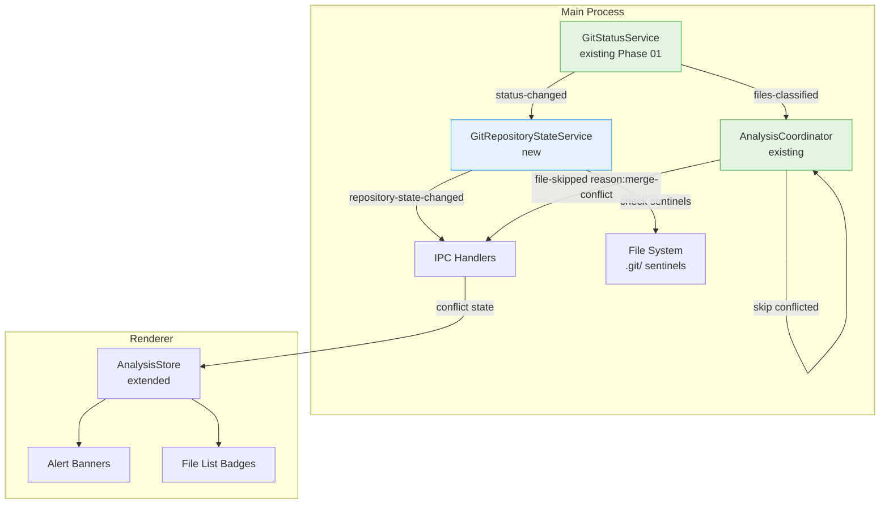
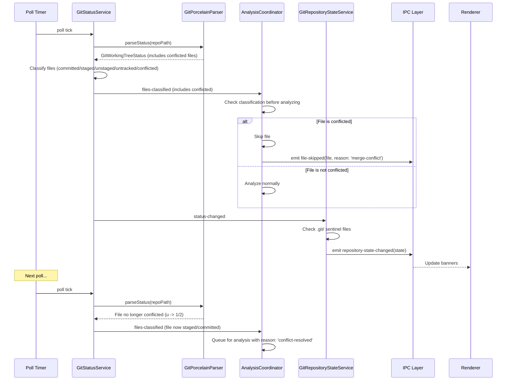
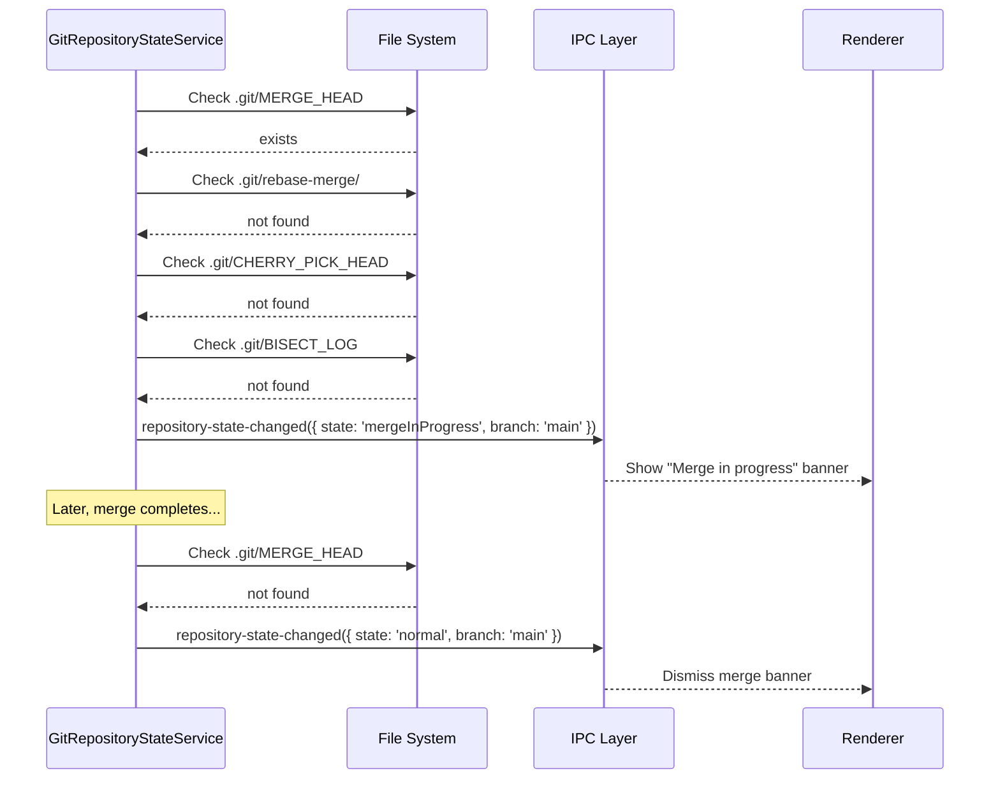

# Merge Conflict Awareness

## Summary

This phase adds merge conflict detection and transient git state awareness to Vipr Desktop. When files are in a conflicted state (unmerged entries from `git status --porcelain=v2`), the analysis coordinator skips them and queues them for re-analysis when conflicts are resolved. A new `GitRepositoryStateService` detects transient states like rebase-in-progress, cherry-pick, bisect, and active merge by checking `.git/` sentinel files. The UI displays appropriate banners and badges to keep the user informed.

Phase 24 is updated to include `conflicted` in the `GitFileClassification` type and `file_git_states.classification` CHECK constraint from the start. No additional schema migration is needed for this phase.

## Prerequisites

- Phase 24 (Git Status Awareness): `GitStatusService` with `conflicted` classification, `GitPorcelainParser` parsing `u` entries
- Phase 29 (Branch-Aware Analysis): Branch context for conflict resolution tracking
- Existing `AnalysisCoordinator` with `file-skipped` event

## Architecture

### System Overview



### Data Flow: Conflict Detection



### Data Flow: Transient State Detection



## Existing Infrastructure

| File                                                                        | What to Reuse                                | Why                                     |
| --------------------------------------------------------------------------- | -------------------------------------------- | --------------------------------------- |
| `clients/desktop/src/main/analysis/coordinator.ts`                          | `file-skipped` event, classification check   | Add `'merge-conflict'` as a skip reason |
| `clients/desktop/src/main/git/git-porcelain-parser.ts`                      | Parser handles `u` entries (Phase 01 update) | Conflicted files already classified     |
| `clients/desktop/src/main/git/git-status-service.ts`                        | `files-classified` event with conflict data  | Source of file classification           |
| `clients/desktop/src/shared/utils/typed-event-emitter.ts`                   | Base event emitter                           | For GitRepositoryStateService           |
| `clients/desktop/src/renderer/components/notifications/BannerContainer.tsx` | Banner display pattern                       | For conflict/rebase banners             |

## Type Definitions

```typescript
import { z } from 'zod';

// Git repository transient state
const gitRepositoryStateSchema = z.enum([
  'normal',
  'mergeInProgress',
  'rebaseInProgress',
  'cherryPickInProgress',
  'bisectInProgress',
  'detachedHead',
]);

type GitRepositoryState = z.infer<typeof gitRepositoryStateSchema>;

// Full repository state info
const repositoryStateInfoSchema = z.object({
  state: gitRepositoryStateSchema,
  branch: z.string().nullable(),
  conflictedFiles: z.array(z.string()),
  conflictedFileCount: z.number(),
  // Rebase-specific
  rebaseStep: z.number().nullable(),
  rebaseTotal: z.number().nullable(),
});

type RepositoryStateInfo = z.infer<typeof repositoryStateInfoSchema>;

// Conflict type from porcelain v2 XY field
const conflictTypeSchema = z.enum([
  'UU', // both modified
  'AA', // both added
  'DD', // both deleted
  'AU', // added by us
  'UA', // added by them
  'DU', // deleted by us
  'UD', // deleted by them
]);

type ConflictType = z.infer<typeof conflictTypeSchema>;

// Conflicted file entry
const conflictedFileSchema = z.object({
  filePath: z.string(),
  conflictType: conflictTypeSchema,
});

type ConflictedFile = z.infer<typeof conflictedFileSchema>;
```

## Implementation Tasks

### Task 01: Create GitRepositoryStateService

**Agent**: `typescript-engineer`

**Files**:

- Create: `clients/desktop/src/main/git/repository-state-service.ts`

**Patterns**:

- TypedEventEmitter from `clients/desktop/src/shared/utils/typed-event-emitter.ts`
- File existence checks with `fs.existsSync`

**Dependencies**: None

**Description**:

Implement `GitRepositoryStateService extends TypedEventEmitter`:

**Event Map**:

```typescript
interface RepositoryStateServiceEvents {
  'repository-state-changed': [state: RepositoryStateInfo];
  error: [error: Error];
}
```

**Constructor**: Accept `repoPath: string`, `gitDir: string` (resolved `.git` path)

**Methods**:

- `checkState(): Promise<RepositoryStateInfo>` - Check all sentinel files and return current state
- `getState(): RepositoryStateInfo` - Return cached state

**Detection logic** (check in order of priority):

1. `.git/rebase-merge/` or `.git/rebase-apply/` directory exists → `rebaseInProgress`
   - Read `.git/rebase-merge/msgnum` and `.git/rebase-merge/end` for step/total progress
2. `.git/CHERRY_PICK_HEAD` file exists → `cherryPickInProgress`
3. `.git/BISECT_LOG` file exists → `bisectInProgress`
4. `.git/MERGE_HEAD` file exists → `mergeInProgress`
5. `git rev-parse --abbrev-ref HEAD` returns `HEAD` → `detachedHead`
6. Otherwise → `normal`

**Integration**: Called from `GitStatusService` on each poll cycle. Emit `repository-state-changed` only when state transitions (changed from previous).

**Verification**:

```bash
pnpm --filter @vipr/desktop typecheck
```

### Task 02: Unit Tests for GitRepositoryStateService

**Agent**: `vitest-engineer`

**Files**:

- Create: `clients/desktop/src/main/git/repository-state-service.test.ts`

**Patterns**:

- Mock `fs.existsSync` for sentinel file checks
- Mock `execFile` for git commands

**Dependencies**: Task 01

**Description**:

Test coverage:

1. **State detection**:
   - `.git/rebase-merge/` exists → `rebaseInProgress` with step/total
   - `.git/rebase-apply/` exists → `rebaseInProgress`
   - `.git/CHERRY_PICK_HEAD` exists → `cherryPickInProgress`
   - `.git/BISECT_LOG` exists → `bisectInProgress`
   - `.git/MERGE_HEAD` exists → `mergeInProgress`
   - Detached HEAD → `detachedHead`
   - Clean state → `normal`
2. **Priority order**:
   - Rebase + merge both detected → `rebaseInProgress` wins (higher priority)
3. **State transitions**:
   - Event emitted only on state change
   - No event on repeated same state
4. **Error handling**:
   - Permission denied on `.git/` files → emit error, return `normal`

**Verification**:

```bash
pnpm --filter @vipr/desktop test repository-state-service
```

### Task 03: Integrate Conflict Skipping into AnalysisCoordinator

**Agent**: `typescript-engineer`

**Files**:

- Modify: `clients/desktop/src/main/analysis/coordinator.ts`

**Patterns**:

- Existing `file-skipped` event with reason
- Classification check before analysis

**Dependencies**: Phase 01 (GitFileClassification includes `conflicted`)

**Description**:

Add conflict-aware logic to `processFile()`:

```typescript
async processFile(item: QueuedFile): Promise<void> {
  // Check if file is conflicted
  if (item.gitClassification === 'conflicted') {
    this.emit('file-skipped', {
      filePath: item.filePath,
      reason: 'merge-conflict',
    });
    return;
  }

  // ... existing analysis logic
}
```

Track previously-conflicted files. When a file transitions from `conflicted` to any other classification, auto-enqueue it with `reason: 'conflict-resolved'` and `priority: 60`:

```typescript
// In the files-classified handler
for (const [filePath, classification] of files) {
  const wasConflicted = this.conflictedFiles.has(filePath);
  if (wasConflicted && classification !== 'conflicted') {
    this.enqueue(filePath, { priority: 60, reason: 'conflict-resolved' });
    this.conflictedFiles.delete(filePath);
  }
  if (classification === 'conflicted') {
    this.conflictedFiles.add(filePath);
  }
}
```

**Verification**:

```bash
pnpm --filter @vipr/desktop typecheck
pnpm --filter @vipr/desktop test coordinator
```

### Task 04: Integrate GitRepositoryStateService into Poll Cycle

**Agent**: `typescript-engineer`

**Files**:

- Modify: `clients/desktop/src/main/git/git-status-service.ts`

**Patterns**:

- Service composition (GitStatusService creates/owns RepositoryStateService)
- Poll-triggered state check

**Dependencies**: Task 01 (RepositoryStateService)

**Description**:

In `GitStatusService`, after each successful poll:

1. Call `repositoryStateService.checkState()`
2. Forward `repository-state-changed` events to IPC layer
3. When state is `rebaseInProgress` or `bisectInProgress` or `cherryPickInProgress`, emit a `analysis-paused` event to signal coordinator to pause

The coordinator should:

- Pause analysis when transient state is active (rebase, bisect, cherry-pick)
- Resume analysis when state returns to `normal` or `mergeInProgress`
- `mergeInProgress` without conflicts allows analysis to continue (only conflicted files are skipped)
- `detachedHead` allows analysis with a warning

**Verification**:

```bash
pnpm --filter @vipr/desktop typecheck
```

### Task 05: Add Repository State IPC and Preload

**Agent**: `typescript-engineer`

**Files**:

- Create: `clients/desktop/src/main/ipc/handlers/repository-state.ts`
- Modify: `clients/desktop/src/shared/ipc-types.ts`
- Modify: `clients/desktop/src/preload/index.ts`
- Modify: `clients/desktop/src/main/ipc/router.ts`

**Patterns**:

- IPC handler + event forwarding pattern
- Preload bridge event subscription

**Dependencies**: Task 04

**Description**:

1. IPC handler:
   - `repository-state:getCurrent` → return current `RepositoryStateInfo`

2. Event forwarding:
   - `repository-state:changed` → forward `RepositoryStateInfo` to renderer

3. Preload bridge:

```typescript
repositoryState: {
  getCurrent: () => ipcRenderer.invoke('repository-state:getCurrent'),
  onStateChanged: (callback: (state: RepositoryStateInfo) => void) => {
    const handler = (_: unknown, data: RepositoryStateInfo) => callback(data);
    ipcRenderer.on('repository-state:changed', handler);
    return () => ipcRenderer.removeListener('repository-state:changed', handler);
  },
},
```

4. Extend ViprDesktopAPI type accordingly.

**Verification**:

```bash
pnpm --filter @vipr/desktop typecheck
```

### Task 06: Add Conflict UI Banners and Badges

**Agent**: `react-engineer`

**Files**:

- Modify: `clients/desktop/src/renderer/stores/analysis.ts` (add repository state)
- Modify: `clients/desktop/src/renderer/components/notifications/BannerContainer.tsx`
- Modify: `clients/desktop/src/renderer/components/files/FileListItem.tsx`

**Patterns**:

- Alert component for banners
- Badge component for file list

**Dependencies**: Task 05

**Description**:

1. **Analysis store extension**:
   - Add `repositoryState: RepositoryStateInfo | null`
   - Subscribe to `repository-state:changed` event
   - Track `conflictedFileCount` for badge display

2. **Conflict banners** (in BannerContainer or equivalent):

```tsx
{
  repositoryState?.state === 'mergeInProgress' && repositoryState.conflictedFileCount > 0 && (
    <Alert variant="banner" level="warning">
      {repositoryState.conflictedFileCount} files have merge conflicts. Resolve conflicts to
      continue analysis.
    </Alert>
  );
}

{
  repositoryState?.state === 'rebaseInProgress' && (
    <Alert variant="banner" level="info">
      Rebase in progress
      {repositoryState.rebaseStep && repositoryState.rebaseTotal
        ? ` (step ${repositoryState.rebaseStep}/${repositoryState.rebaseTotal})`
        : ''}
      . Analysis paused until complete.
    </Alert>
  );
}

{
  repositoryState?.state === 'cherryPickInProgress' && (
    <Alert variant="banner" level="info">
      Cherry-pick in progress. Analysis paused until complete.
    </Alert>
  );
}

{
  repositoryState?.state === 'bisectInProgress' && (
    <Alert variant="banner" level="info">
      Bisect in progress. Analysis paused until complete.
    </Alert>
  );
}

{
  repositoryState?.state === 'detachedHead' && (
    <Alert variant="banner" level="info">
      Detached HEAD state. Snapshots will not be tagged to a branch.
    </Alert>
  );
}
```

3. **File list badges**: On files classified as `conflicted`, show `Badge variant="warning"` with label "Conflict".

4. **Resolution toast**: When `conflictedFileCount` transitions from >0 to 0, show `Alert variant="toast" level="success"`: "Conflicts resolved. Analyzing N files..."

**Verification**:

```bash
pnpm --filter @vipr/desktop typecheck
```

### Task 07: Unit Tests for Conflict Skipping

**Agent**: `vitest-engineer`

**Files**:

- Modify: `clients/desktop/src/main/analysis/coordinator.test.ts` (or create if needed)

**Patterns**:

- Existing coordinator test patterns
- Mock GitStatusService file classifications

**Dependencies**: Task 03

**Description**:

Test coverage:

1. **Skip conflicted files**:
   - File with `gitClassification: 'conflicted'` → `file-skipped` with reason `'merge-conflict'`
   - Non-conflicted files analyzed normally
2. **Conflict resolution re-queue**:
   - File transitions from `conflicted` to `committed` → auto-enqueued with reason `'conflict-resolved'`
   - File transitions from `conflicted` to `staged` → auto-enqueued
3. **Transient state pausing**:
   - Rebase state → coordinator paused
   - Rebase completes (normal state) → coordinator resumed
   - Merge without conflicts → coordinator not paused

**Verification**:

```bash
pnpm --filter @vipr/desktop test coordinator
```

## IPC Surface

### Invoke Methods

| Method                        | Input | Output                | Description                        |
| ----------------------------- | ----- | --------------------- | ---------------------------------- |
| `repository-state:getCurrent` | None  | `RepositoryStateInfo` | Current repository transient state |

### Events (Main → Renderer)

| Event                      | Payload               | Trigger                      |
| -------------------------- | --------------------- | ---------------------------- |
| `repository-state:changed` | `RepositoryStateInfo` | Repository state transitions |

### Preload Bridge

```typescript
repositoryState: {
  getCurrent: () => ipcRenderer.invoke('repository-state:getCurrent'),
  onStateChanged: (callback: (state: RepositoryStateInfo) => void) => {
    const handler = (_: unknown, data: RepositoryStateInfo) => callback(data);
    ipcRenderer.on('repository-state:changed', handler);
    return () => ipcRenderer.removeListener('repository-state:changed', handler);
  },
},
```

## UI Components

### Banners

| State                         | Banner Type              | Level     | Message                                                                 |
| ----------------------------- | ------------------------ | --------- | ----------------------------------------------------------------------- |
| `mergeInProgress` + conflicts | Alert `variant="banner"` | `warning` | "N files have merge conflicts. Resolve conflicts to continue analysis." |
| `rebaseInProgress`            | Alert `variant="banner"` | `info`    | "Rebase in progress. Analysis paused until complete."                   |
| `cherryPickInProgress`        | Alert `variant="banner"` | `info`    | "Cherry-pick in progress. Analysis paused until complete."              |
| `bisectInProgress`            | Alert `variant="banner"` | `info`    | "Bisect in progress. Analysis paused until complete."                   |
| `detachedHead`                | Alert `variant="banner"` | `info`    | "Detached HEAD. Snapshots will not be tagged to a branch."              |

### File List Badges

| Classification | Badge               | Display                             |
| -------------- | ------------------- | ----------------------------------- |
| `conflicted`   | `variant="warning"` | "Conflict" label on file list items |

### Resolution Toast

| Trigger               | Toast Type              | Level     | Message                                    |
| --------------------- | ----------------------- | --------- | ------------------------------------------ |
| Conflict count 0 → 0  | None                    | -         | -                                          |
| Conflict count >0 → 0 | Alert `variant="toast"` | `success` | "Conflicts resolved. Analyzing N files..." |

## Edge Cases

| Scenario                               | Handling                                                                                     |
| -------------------------------------- | -------------------------------------------------------------------------------------------- |
| Multiple conflict types in same merge  | Each file gets its own conflictType (UU, AA, etc.)                                           |
| Conflict in non-JS/TS file             | Tracked in `file_git_states` but not enqueued for analysis                                   |
| Rebase with conflicts                  | State is `rebaseInProgress` (higher priority than merge conflicts); analysis paused entirely |
| Interactive rebase without conflicts   | Analysis paused (can't predict which commits will be replayed)                               |
| `git stash pop` creates conflicts      | Detected as merge conflicts (porcelain v2 shows `u` entries)                                 |
| Conflict resolved but not staged       | File transitions from `u` to `1 .M` (unstaged); conflict cleared                             |
| Abort merge/rebase                     | State returns to `normal`; analysis resumes; re-analyze any files that changed               |
| Nested `.git` directories (submodules) | Only check sentinel files in the workspace's `.git` directory                                |
| Worktree `.git` file (not directory)   | Resolve actual gitdir from `.git` file content before checking sentinels (Phase 08 handles)  |

## Performance Considerations

1. **Sentinel file checks**: `fs.existsSync` is synchronous and fast for 4-5 file checks; no performance concern
2. **Poll integration**: State check adds <1ms to each poll cycle
3. **Conflict tracking**: Set-based tracking in coordinator (O(1) lookup per file)
4. **Event emission**: Only emit on state transitions, not every poll

## Verification Plan

### Build & Type Safety

```bash
pnpm --filter @vipr/desktop typecheck
pnpm --filter @vipr/desktop build
```

### Unit Test Coverage

| Component                 | Test File                          | Coverage Goals                         |
| ------------------------- | ---------------------------------- | -------------------------------------- |
| GitRepositoryStateService | `repository-state-service.test.ts` | All sentinel checks, state transitions |
| Coordinator conflict skip | `coordinator.test.ts`              | Skip logic, re-queue on resolve        |

### Functional Testing

1. **Conflict detection**: Create a merge conflict in a test repo. Verify conflicted files are classified as `conflicted` and skipped by coordinator.
2. **Conflict resolution**: Resolve the conflict and stage. Verify file is re-analyzed on next poll.
3. **Rebase state**: Start an interactive rebase. Verify "Rebase in progress" banner appears and analysis pauses.
4. **Rebase complete**: Finish the rebase. Verify banner dismisses and analysis resumes.
5. **Cherry-pick**: Start a cherry-pick that creates conflicts. Verify state detection and banner.

## Security Considerations

1. **File system access**: Sentinel file checks use `fs.existsSync` on paths constructed from known `.git` directory; no user input in paths
2. **State spoofing**: Manually creating sentinel files would trigger state detection, but this is harmless (analysis pauses/resumes safely)

## References

### Internal Documentation

- `clients/desktop/src/main/analysis/coordinator.ts` - Coordinator events and skip logic
- `clients/desktop/src/main/git/git-status-service.ts` - Poll cycle integration point
- `clients/desktop/src/main/git/git-porcelain-parser.ts` - `u` entry parsing (Phase 01 update)

### External Documentation

- [Git Porcelain v2 unmerged entries](https://git-scm.com/docs/git-status#_unmerged_entries)
- [Git repository layout](https://git-scm.com/docs/gitrepository-layout) - Sentinel file locations
