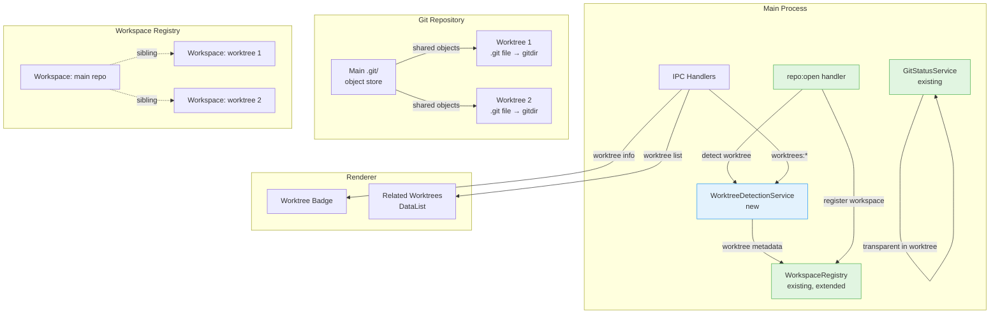
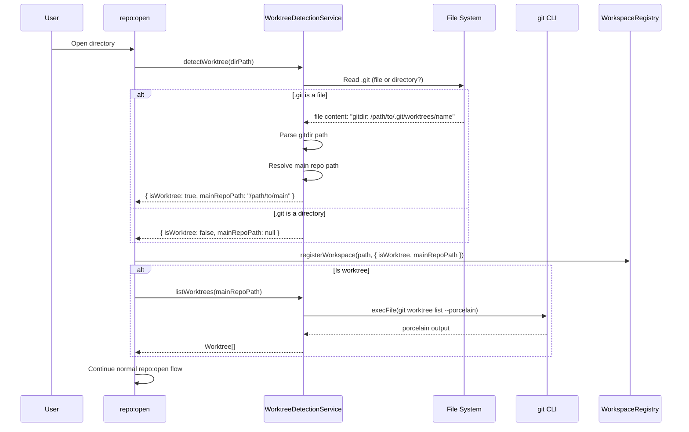
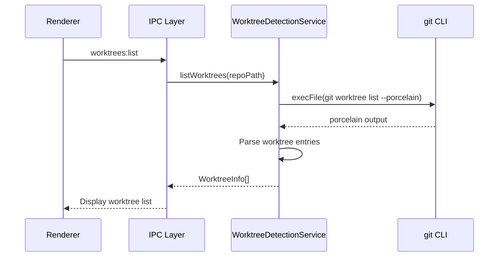

# Git Worktree Support

## Summary

This phase adds git worktree detection and support to Vipr Desktop. Git worktrees share a single `.git` object store but have separate working directories, each with its own HEAD, index, and working tree. In a worktree, `.git` is a **file** (not directory) containing `gitdir: /path/to/main/.git/worktrees/<name>`.

A new `WorktreeDetectionService` identifies worktree status on workspace registration, resolves the main repository path, and lists sibling worktrees. Each worktree gets its own workspace entry and database (existing pattern, no change needed). The workspace registry is extended with metadata to track worktree relationships.

No schema migration is needed -- the workspace registry is a separate JSON file, not the SQLite database.

## Prerequisites

- Phase 29 (Branch-Aware Analysis): Branch context for worktree branch tracking
- Existing `WorkspaceRegistry` for workspace metadata
- Existing `GitStatusService` works transparently inside worktrees

## Architecture

### System Overview



### Data Flow: Worktree Detection on Open



### Data Flow: Listing Worktrees



## Existing Infrastructure

| File                                                  | What to Reuse                           | Why                                                  |
| ----------------------------------------------------- | --------------------------------------- | ---------------------------------------------------- |
| `clients/desktop/src/main/db/workspace-registry.ts`   | `WorkspaceEntry`, `registerWorkspace()` | Extend with worktree metadata                        |
| `clients/desktop/src/main/ipc/handlers/repository.ts` | `repo:open` handler                     | Integration point for worktree detection             |
| `packages/engine/src/git-changed-files.ts`            | `execFile` pattern                      | Security: `execFile` for git worktree commands       |
| `clients/desktop/src/main/git/git-status-service.ts`  | `GitStatusService`                      | Works transparently in worktrees (no changes needed) |

## Type Definitions

```typescript
import { z } from 'zod';

// Worktree info from `git worktree list --porcelain`
const worktreeInfoSchema = z.object({
  path: z.string(),
  head: z.string(), // HEAD SHA
  branch: z.string().nullable(), // null if detached
  detached: z.boolean(),
  locked: z.boolean(),
  lockedReason: z.string().nullable(),
  bare: z.boolean(),
  prunable: z.boolean(),
});

type WorktreeInfo = z.infer<typeof worktreeInfoSchema>;

// Worktree detection result
const worktreeDetectionSchema = z.object({
  isWorktree: z.boolean(),
  mainRepoPath: z.string().nullable(),
  worktreeName: z.string().nullable(),
});

type WorktreeDetection = z.infer<typeof worktreeDetectionSchema>;

// Extended workspace entry (additions to existing WorkspaceEntry)
// Added to WorkspaceEntry interface:
//   isWorktree?: boolean;
//   mainRepoPath?: string | null;
```

## Implementation Tasks

### Task 01: Create WorktreeDetectionService

**Agent**: `typescript-engineer`

**Files**:

- Create: `clients/desktop/src/main/git/worktree-service.ts`

**Patterns**:

- `execFile` pattern from `packages/engine/src/git-changed-files.ts`
- File system reads for `.git` file detection

**Dependencies**: None

**Description**:

Implement `WorktreeDetectionService`:

```typescript
class WorktreeDetectionService {
  /**
   * Check if a directory is a git worktree (vs. main repo).
   * In a worktree, .git is a FILE containing "gitdir: /path/to/.git/worktrees/<name>"
   */
  async isWorktree(dirPath: string): Promise<boolean>;

  /**
   * Get the main repository path from a worktree.
   * Parse .git file content, resolve gitdir, navigate to parent .git, then parent dir.
   */
  async getMainRepoPath(worktreePath: string): Promise<string | null>;

  /**
   * Detect worktree status for a directory.
   * Returns detection result with isWorktree flag and resolved main repo path.
   */
  async detectWorktree(dirPath: string): Promise<WorktreeDetection>;

  /**
   * List all worktrees for a repository.
   * Parse `git worktree list --porcelain` output.
   */
  async listWorktrees(repoPath: string): Promise<WorktreeInfo[]>;

  /**
   * Get info for a specific worktree path.
   */
  async getWorktreeInfo(worktreePath: string): Promise<WorktreeInfo | null>;
}
```

**Worktree detection logic**:

1. Check if `.git` at `dirPath` is a file or directory
   - If file: read content, parse `gitdir: <path>` line
   - If directory: not a worktree, return `{ isWorktree: false }`
2. Resolve the `gitdir` path to the main `.git` directory:
   - `gitdir: /path/to/main/.git/worktrees/<name>` → main repo is `/path/to/main/`
   - Handle relative paths in gitdir

**Porcelain output parsing** (`git worktree list --porcelain`):

```
worktree /path/to/main
HEAD abc123
branch refs/heads/main

worktree /path/to/feature
HEAD def456
branch refs/heads/feature-x

worktree /path/to/detached
HEAD ghi789
detached
```

Each entry is separated by blank lines. Parse fields: `worktree`, `HEAD`, `branch`, `detached`, `locked`, `bare`, `prunable`.

**Verification**:

```bash
pnpm --filter @vipr/desktop typecheck
```

### Task 02: Unit Tests for WorktreeDetectionService

**Agent**: `vitest-engineer`

**Files**:

- Create: `clients/desktop/src/main/git/worktree-service.test.ts`

**Patterns**:

- Mock `fs.readFileSync`, `fs.statSync` for `.git` file detection
- Mock `execFile` for git worktree commands
- Test fixtures with sample porcelain output

**Dependencies**: Task 01

**Description**:

Test coverage:

1. **isWorktree**:
   - `.git` is a directory → false
   - `.git` is a file with `gitdir:` → true
   - `.git` doesn't exist → false (not a git repo)
2. **getMainRepoPath**:
   - Parse `gitdir: /abs/path/.git/worktrees/name` → `/abs/path/`
   - Parse relative gitdir path → resolve correctly
   - Non-worktree directory → null
3. **detectWorktree**:
   - Main repo → `{ isWorktree: false, mainRepoPath: null }`
   - Worktree → `{ isWorktree: true, mainRepoPath: "/path/to/main" }`
4. **listWorktrees**:
   - Parse porcelain output with multiple worktrees
   - Handle detached worktree
   - Handle locked worktree with reason
   - Handle bare repository
   - Handle prunable worktree
   - Handle empty output (main repo only)
5. **getWorktreeInfo**:
   - Returns specific worktree by path
   - Returns null for unknown path
6. **Edge cases**:
   - Pruned worktree (directory deleted but ref remains)
   - Locked worktree with reason text
   - Nested directory (walk up to find .git)

**Verification**:

```bash
pnpm --filter @vipr/desktop test worktree-service
```

### Task 03: Extend WorkspaceRegistry

**Agent**: `typescript-engineer`

**Files**:

- Modify: `clients/desktop/src/main/db/workspace-registry.ts`

**Patterns**:

- Existing `WorkspaceEntry` interface extension

**Dependencies**: Task 01

**Description**:

Extend `WorkspaceEntry` with worktree metadata:

```typescript
export interface WorkspaceEntry {
  // ... existing fields
  isWorktree?: boolean;
  mainRepoPath?: string | null;
}
```

Update `registerWorkspace()` to accept and persist worktree metadata:

```typescript
export function registerWorkspace(
  workspacePath: string,
  options?: {
    isWorktree?: boolean;
    mainRepoPath?: string | null;
  }
): WorkspaceEntry;
```

Add helper method:

```typescript
export function getRelatedWorkspaces(mainRepoPath: string): WorkspaceEntry[];
```

This returns all workspace entries where `mainRepoPath` matches (sibling worktrees) OR `path` matches (the main repo itself).

Bump `REGISTRY_VERSION` if the schema change requires migration of the JSON file.

**Verification**:

```bash
pnpm --filter @vipr/desktop typecheck
```

### Task 04: Integrate Worktree Detection into repo:open

**Agent**: `typescript-engineer`

**Files**:

- Modify: `clients/desktop/src/main/ipc/handlers/repository.ts`

**Patterns**:

- Existing repo:open flow
- Service instantiation and use

**Dependencies**: Task 01 (WorktreeDetectionService), Task 03 (WorkspaceRegistry)

**Description**:

In the `repo:open` handler, after path validation and before workspace registration:

```typescript
// Detect worktree status
const worktreeService = new WorktreeDetectionService();
const worktreeDetection = await worktreeService.detectWorktree(payload.path);

// Register workspace with worktree metadata
const workspace = registerWorkspace(payload.path, {
  isWorktree: worktreeDetection.isWorktree,
  mainRepoPath: worktreeDetection.mainRepoPath,
});

if (worktreeDetection.isWorktree) {
  logger.info('Opened git worktree', {
    worktreePath: payload.path,
    mainRepoPath: worktreeDetection.mainRepoPath,
  });
}
```

The rest of `repo:open` proceeds normally. `GitStatusService` works transparently inside worktrees, so no changes needed there.

**Verification**:

```bash
pnpm --filter @vipr/desktop typecheck
```

### Task 05: Add Worktree IPC Handlers

**Agent**: `typescript-engineer`

**Files**:

- Create: `clients/desktop/src/main/ipc/handlers/worktrees.ts`
- Modify: `clients/desktop/src/main/ipc/router.ts`

**Patterns**:

- IPC handler registration from existing handlers

**Dependencies**: Task 01 (WorktreeDetectionService), Task 03 (WorkspaceRegistry)

**Description**:

Implement IPC handlers for `worktrees` namespace:

- `worktrees:list` → List all worktrees for current repo. Uses `WorktreeDetectionService.listWorktrees(repoPath)`. Returns `WorktreeInfo[]`.
- `worktrees:getInfo` → Get info for a specific worktree. Uses `WorktreeDetectionService.getWorktreeInfo(path)`. Returns `WorktreeInfo | null`.

Register handlers in the IPC router.

**Verification**:

```bash
pnpm --filter @vipr/desktop typecheck
```

### Task 06: Extend Preload Bridge and Types

**Agent**: `typescript-engineer`

**Files**:

- Modify: `clients/desktop/src/shared/ipc-types.ts`
- Modify: `clients/desktop/src/preload/index.ts`

**Patterns**:

- ViprDesktopAPI namespace extension

**Dependencies**: Task 05

**Description**:

Extend ViprDesktopAPI with `worktrees` namespace:

```typescript
interface ViprDesktopAPI {
  // ... existing
  worktrees: {
    list(): Promise<WorktreeInfo[]>;
    getInfo(path: string): Promise<WorktreeInfo | null>;
  };
}
```

Implement in preload:

```typescript
worktrees: {
  list: () => ipcRenderer.invoke('worktrees:list'),
  getInfo: (path: string) => ipcRenderer.invoke('worktrees:getInfo', path),
},
```

**Verification**:

```bash
pnpm --filter @vipr/desktop typecheck
```

### Task 07: Add Worktree UI Elements

**Agent**: `react-engineer`

**Files**:

- Modify: `clients/desktop/src/renderer/pages/Welcome.tsx` (workspace list)

**Patterns**:

- Badge component from `@vipr/ui`
- DataList component for related worktrees

**Dependencies**: Task 06

**Description**:

1. **Worktree Badge on workspace list**: When a workspace entry has `isWorktree: true`, show a Badge next to the workspace name:

```tsx
{
  workspace.isWorktree && <Badge variant="info">Worktree</Badge>;
}
```

2. **Related worktrees section**: When viewing a workspace that is a worktree (or the main repo of worktrees), show a "Related Worktrees" section using DataList:

```tsx
<DataList
  items={relatedWorktrees.map(wt => ({
    label: wt.branch ?? 'detached',
    value: wt.path,
    badge: wt.locked ? 'Locked' : undefined,
  }))}
/>
```

3. **Error handling**: If the user tries to open a worktree whose branch is already checked out in another worktree (git prevents this), show an ErrorDisplay with a clear message.

**Verification**:

```bash
pnpm --filter @vipr/desktop typecheck
```

## IPC Surface

### Invoke Methods

| Method              | Input           | Output                 | Description                    |
| ------------------- | --------------- | ---------------------- | ------------------------------ |
| `worktrees:list`    | None            | `WorktreeInfo[]`       | All worktrees for current repo |
| `worktrees:getInfo` | `string` (path) | `WorktreeInfo \| null` | Metadata for specific worktree |

### Preload Bridge

```typescript
worktrees: {
  list: () => ipcRenderer.invoke('worktrees:list'),
  getInfo: (path: string) => ipcRenderer.invoke('worktrees:getInfo', path),
},
```

## UI Components

### Workspace List

| Element            | Component | Config                              |
| ------------------ | --------- | ----------------------------------- |
| Worktree indicator | Badge     | `variant="info"`, label "Worktree"  |
| Related worktrees  | DataList  | Branch name as label, path as value |
| Locked indicator   | Badge     | `variant="warning"`, label "Locked" |

### Component Selection

- **Worktree badge**: Badge (Tier 1 primitive, use freely)
- **Related worktrees list**: DataList (Tier 2 workhorse, 2-10 items typical)
- **Error on branch conflict**: ErrorDisplay (Tier 2 workhorse)

No new pages needed. Worktree information integrates into existing workspace list and welcome page.

## Edge Cases

| Scenario                                              | Handling                                                                         |
| ----------------------------------------------------- | -------------------------------------------------------------------------------- |
| Pruned worktree (directory deleted but ref remains)   | Detect via `prunable` field; show greyed-out entry with "Pruned" badge           |
| Locked worktree                                       | Show lock indicator Badge; allow opening but display info banner about lock      |
| Bare repository with worktrees                        | Detect via `bare` field; handle appropriately (no analysis, just list worktrees) |
| Worktree detection in nested directories              | Walk up from `.git` file to find actual git directory; resolve relative paths    |
| Main repo opened after worktree already has workspace | Show related worktrees in workspace list; no conflict                            |
| Worktree opened, main repo not yet registered         | Register worktree workspace independently; link via `mainRepoPath`               |
| `.git` file with unexpected content                   | Log warning, treat as non-worktree (graceful degradation)                        |
| Network-mounted worktree (slow I/O)                   | `git worktree list` may be slow; cache result with 60s TTL                       |
| Worktree on different filesystem                      | Absolute paths in gitdir handle this correctly                                   |
| Git version too old for worktrees                     | `git worktree list` fails; treat as non-worktree, log warning                    |

## Performance Considerations

1. **Detection cost**: Reading `.git` file is a single `fs.readFileSync` call (<1ms)
2. **Worktree list**: `git worktree list --porcelain` is fast (reads from `.git/worktrees/` directory)
3. **Caching**: Cache worktree list with 60s TTL (worktrees don't change frequently)
4. **No impact on analysis**: GitStatusService and AnalysisCoordinator work identically in worktrees

## Verification Plan

### Build & Type Safety

```bash
pnpm --filter @vipr/desktop typecheck
pnpm --filter @vipr/desktop build
```

### Unit Test Coverage

| Component                | Test File                  | Coverage Goals                      |
| ------------------------ | -------------------------- | ----------------------------------- |
| WorktreeDetectionService | `worktree-service.test.ts` | Detection, parsing, path resolution |

### Functional Testing

1. **Worktree detection**: Create a git worktree with `git worktree add`. Open the worktree directory in Vipr. Verify it's detected as a worktree and the main repo path is resolved correctly.
2. **Independent workspaces**: Open both main repo and worktree. Verify each gets its own workspace and database. Analysis runs independently in each.
3. **Related worktrees**: Open main repo. Verify related worktrees are listed in the workspace sidebar.
4. **Normal repo**: Open a regular git repository (not a worktree). Verify `isWorktree: false` and no worktree-specific UI appears.
5. **Non-git directory**: Open a directory that is not a git repo. Verify graceful handling (no worktree detection attempted).

## Security Considerations

1. **Path resolution**: Gitdir paths from `.git` files are resolved to absolute paths and validated before use
2. **Command injection**: All git commands use `execFile` (not `exec`)
3. **Symlink traversal**: Resolve symlinks in gitdir paths to prevent traversal attacks

## References

### Internal Documentation

- `clients/desktop/src/main/db/workspace-registry.ts` - WorkspaceEntry and registration
- `packages/engine/src/git-changed-files.ts` - `execFile` git pattern

### External Documentation

- [git-worktree documentation](https://git-scm.com/docs/git-worktree)
- [gitrepository-layout - worktrees](https://git-scm.com/docs/gitrepository-layout#Documentation/gitrepository-layout.txt-worktrees)
- [git-worktree list --porcelain format](https://git-scm.com/docs/git-worktree#_porcelain_format)
