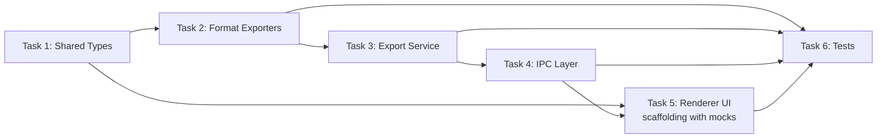

# Phase 09: Export Data

Export workspace analysis data as JSON or SQL for backup, migration, or external analysis.

## Overview

Users navigate to **Settings > Export Data** and configure which workspaces, data categories, date ranges, and formats to export. The output is a ZIP archive containing one directory per workspace, each with a data file and manifest. The architecture uses a strategy pattern for formats, making it trivial to add CSV, HTML, or other formats later.

### Output Structure

```
vipr-export-2026-02-26.zip        (or user-provided name)
├── export-manifest.json          top-level metadata
├── my-project-a1b2c3/
│   ├── data.json                 (or data.sql)
│   └── manifest.json             per-workspace metadata
└── api-service-d4e5f6/
    ├── data.json
    └── manifest.json
```

---

## Data Categories

Four practical presets mapped to real developer use cases, plus granular category selection:

| Category             | Description                                       | Use Case                                      | Tables                                                      |
| -------------------- | ------------------------------------------------- | --------------------------------------------- | ----------------------------------------------------------- |
| **Full Backup**      | Complete database export                          | Migration, archiving before workspace removal | All tables                                                  |
| **Analysis Results** | File scores, plugin results, insights, metrics    | Sharing with team, debugging quality changes  | `files`, `analyses`                                         |
| **Snapshots**        | Point-in-time quality captures with distributions | Trend tracking, external dashboards           | `snapshots`, `snapshot_metrics`, `snapshot_files`           |
| **Dependencies**     | Import graph and dependency edges                 | Architecture review, graph analysis           | `dependencies`                                              |
| **History**          | Commit-level metrics, velocity data               | Correlating with deploys/sprints              | `commit_files`, `schedule_history`                          |
| **Notes & Todos**    | User annotations, task items                      | Personal backup only                          | `notes`, `todo_lists`, `todo_items`                         |
| **Configuration**    | Budgets, exclusions, preferences                  | Workspace setup reproduction                  | `budgets`, `budget_exceptions`, `exclusions`, `preferences` |
| **Monitoring**       | Health alerts and audit events                    | Compliance, incident review                   | `monitoring_alerts`, `monitoring_events`                    |

"Full Backup" is a master toggle that selects all categories. Individual categories can be combined freely.

### Date Filtering

Optional date range applies to time-series data only: snapshots, history, monitoring events. Other categories (dependencies, configuration) export without date constraints. The UI displays an informational note when date filtering has no effect on the selected categories.

---

## UX Design

### Layout: Single Scrollable Section in Settings

The export section lives within the existing Settings page under a new sidebar entry. It is a progressive form — not a wizard or modal — following the established `SettingCard` pattern. The ordering follows the mental model: **what** (workspaces) > **which data** (categories) > **when** (date range) > **how** (format/naming) > **go** (export).

### Section Flow

```
Settings > Export Data
├── Workspace Selection        Table with row checkboxes, Select All
├── Data Categories            Checkbox list with Full Database master toggle
├── Date Range Filter          Switch-gated, reveals date inputs when enabled
├── Format & Output            Radio for format, text input for filename
└── Export Action              Summary badges + primary Export button
```

### Workspace Selection

Table with checkboxes — not a multi-select dropdown — because workspace entries carry metadata (path, file count, last analyzed date) that a dropdown cannot surface. The project's own guidance says "table-first for under 100 items."

```
┌──────────────────────────────────────────────────────────────────┐
│ [✓] Select all                                    3 of 5 selected│
├──────────────────────────────────────────────────────────────────┤
│ [✓] my-app          ~/projects/my-app     412 files    Feb 25   │
│ [✓] api-service     ~/work/api          1,204 files    Feb 20   │
│ [ ] legacy-dash     ~/work/legacy          89 files    Feb 1    │
│ [✓] auth-lib        ~/libs/auth           231 files    Feb 24   │
│ [ ] infra-scripts   ~/ops/infra            47 files    Never    │
└──────────────────────────────────────────────────────────────────┘
```

### Data Category Selection

Checkboxes (not switches — checkboxes communicate transient, export-scoped selection). "Full Database" at the top acts as master toggle: when checked, all other checkboxes are selected and disabled.

### Date Range Filter

Off by default. Gated behind a Switch in a `SettingCard`. When toggled on, reveals two `<input type="date">` fields (From / To). An inline note clarifies which categories are affected by date filtering.

### Format Selection

Radio buttons for JSON and SQL dump. JSON has a sub-option checkbox for pretty-printing. Future formats (CSV, HTML) appear as additional radio options.

### Filename Input

Text input defaulting to `vipr-export`. Output preview updates reactively: `vipr-export-3w-2026-02-26.zip`. For a single workspace, uses the workspace name slug instead of count.

### Export Action

Right-aligned primary button. Disabled until at least one workspace and one category are selected. Summary badges above the button show the current selection state at a glance:

```
[3 workspaces] [Analysis results, Snapshots] [JSON pretty-printed]
                                                          [Export]
```

### Progress States

When exporting, the button area is replaced by a progress bar with:

- Current workspace name
- Percentage (determinate for data reading, indeterminate for compression)
- Elapsed time

On completion: success state with file path + "Show in Finder" + "Close" actions.
On failure: error state with message + "Retry" action. Configuration is preserved.

---

## Architecture

### File Structure

```
clients/desktop/src/
├── shared/ipc/
│   └── export-types.ts                   # Zod schemas + inferred types
│
├── main/
│   ├── services/
│   │   ├── export-service.ts             # Orchestrator
│   │   └── exporters/
│   │       ├── exporter.ts               # DataExporter interface
│   │       ├── json-exporter.ts          # JSON format strategy
│   │       └── sql-exporter.ts           # SQL dump format strategy
│   └── ipc/
│       └── handlers/
│           └── export.ts                 # IPC handler registration
│
├── preload/
│   └── contexts/
│       └── export-context.ts             # Preload context (ISP)
│
└── renderer/
    ├── components/
    │   └── settings/
    │       └── ExportSettingsSection.tsx  # UI component
    └── stores/
        └── export.ts                     # Zustand store (extend existing)
```

### Wiring (one-line additions to existing files)

| File                                               | Change                                                          |
| -------------------------------------------------- | --------------------------------------------------------------- |
| `shared/ipc/api-types.ts`                          | Add `export` namespace to `ViprDesktopAPI`                      |
| `preload/contexts/index.ts`                        | Add `export * from './export-context'`                          |
| `preload/index.ts`                                 | Add `export: createExportAPI()` to the API object               |
| `main/ipc/router.ts`                               | Add `registerExportHandlers()` in `initializeIPC`               |
| `renderer/pages/Settings.tsx`                      | Add `{activeSection === 'export' && <ExportSettingsSection />}` |
| `renderer/components/settings/SettingsSidebar.tsx` | Add export entry to `NAV_SECTIONS` Analysis group               |

### Dependency Addition

Add to `clients/desktop/package.json`:

```json
"fflate": "^0.8.2"
```

`fflate` is 8 KB gzipped, zero dependencies. Its `zipSync` API aligns with `DatabaseSync`'s synchronous reads — no stream pipeline needed.

---

## Type Definitions

### `shared/ipc/export-types.ts`

```typescript
import { z } from 'zod';

// ---------------------------------------------------------------------------
// Format
// ---------------------------------------------------------------------------

export const ExportFormatSchema = z.discriminatedUnion('format', [
  z.object({ format: z.literal('json'), prettyPrint: z.boolean() }),
  z.object({ format: z.literal('sql') }),
  // Future: z.object({ format: z.literal('csv') }),
  // Future: z.object({ format: z.literal('html') }),
]);
export type ExportFormat = z.infer<typeof ExportFormatSchema>;

// ---------------------------------------------------------------------------
// Data categories
// ---------------------------------------------------------------------------

export const ExportCategorySchema = z.enum([
  'analyses', // files + analyses tables
  'snapshots', // snapshots + snapshot_metrics + snapshot_files
  'dependencies', // dependency edges
  'history', // commit_files + schedule_history
  'notes', // notes + todo_lists + todo_items
  'configuration', // budgets + budget_exceptions + exclusions + preferences
  'monitoring', // monitoring_alerts + monitoring_events
]);
export type ExportCategory = z.infer<typeof ExportCategorySchema>;

// ---------------------------------------------------------------------------
// Date range filter
// ---------------------------------------------------------------------------

export const ExportDateRangeSchema = z
  .object({
    /** Unix epoch milliseconds */
    from: z.number().int().positive(),
    /** Unix epoch milliseconds */
    to: z.number().int().positive(),
  })
  .refine(r => r.from < r.to, {
    message: 'from must be before to',
    path: ['to'],
  });
export type ExportDateRange = z.infer<typeof ExportDateRangeSchema>;

// ---------------------------------------------------------------------------
// Export request payload (renderer -> main)
// ---------------------------------------------------------------------------

export const ExportDataPayloadSchema = z.object({
  /** Workspace IDs to include (min 1) */
  workspaces: z.array(z.object({ workspaceId: z.string().uuid() })).min(1),
  /** Output format */
  format: ExportFormatSchema,
  /** Data categories to include (min 1) */
  categories: z.array(ExportCategorySchema).min(1),
  /** Optional date range filter */
  dateRange: ExportDateRangeSchema.optional(),
  /** Output filename without extension (default: vipr-export) */
  outputFilename: z
    .string()
    .min(1)
    .max(100)
    .regex(/^[a-zA-Z0-9_\-. ]+$/),
  /**
   * Absolute path to write the ZIP. When absent, the service
   * calls dialog.showSaveDialog() — matching report-service.ts pattern.
   */
  destination: z.string().optional(),
});
export type ExportDataPayload = z.infer<typeof ExportDataPayloadSchema>;

// ---------------------------------------------------------------------------
// Progress events (main -> renderer via sendToRenderer)
// ---------------------------------------------------------------------------

export const ExportPhaseSchema = z.enum([
  'initializing',
  'reading',
  'formatting',
  'compressing',
  'writing',
  'complete',
  'error',
]);
export type ExportPhase = z.infer<typeof ExportPhaseSchema>;

export const ExportProgressEventSchema = z.object({
  phase: ExportPhaseSchema,
  /** Overall progress 0-100 */
  percent: z.number().min(0).max(100),
  /** Human-readable status line */
  message: z.string(),
  /** Current workspace being processed */
  currentWorkspace: z.string().optional(),
  /** Index of current workspace (0-based) */
  workspaceIndex: z.number().int().nonnegative().optional(),
  /** Total workspaces in this export */
  workspaceTotal: z.number().int().positive().optional(),
});
export type ExportProgressEvent = z.infer<typeof ExportProgressEventSchema>;

// ---------------------------------------------------------------------------
// Export result (main -> renderer as IPC return value)
// ---------------------------------------------------------------------------

export const WorkspaceExportResultSchema = z.object({
  workspaceId: z.string(),
  workspaceName: z.string(),
  success: z.boolean(),
  rowCounts: z.record(z.string(), z.number()).optional(),
  error: z.string().optional(),
});
export type WorkspaceExportResult = z.infer<typeof WorkspaceExportResultSchema>;

export const ExportDataResultSchema = z.object({
  filePath: z.string(),
  success: z.boolean(),
  workspaceResults: z.array(WorkspaceExportResultSchema),
  fileSizeBytes: z.number().optional(),
  exportedAt: z.number(),
});
export type ExportDataResult = z.infer<typeof ExportDataResultSchema>;

// ---------------------------------------------------------------------------
// Manifest types (written inside the ZIP, not transmitted over IPC)
// ---------------------------------------------------------------------------

/** Per-workspace manifest.json */
export interface WorkspaceManifest {
  workspaceId: string;
  workspaceName: string;
  workspacePath: string;
  exportedAt: string; // ISO 8601
  viprSchemaVersion: number;
  format: ExportFormat;
  categories: ExportCategory[];
  dateRange?: { from: string; to: string };
  rowCounts: Partial<Record<ExportCategory, number>>;
}

/** Top-level export-manifest.json */
export interface ExportManifest {
  manifestVersion: 1;
  exportedAt: string; // ISO 8601
  viprAppVersion: string;
  platform: NodeJS.Platform;
  format: ExportFormat;
  categories: ExportCategory[];
  dateRange?: { from: string; to: string };
  workspaces: Array<{
    workspaceId: string;
    workspaceName: string;
    workspacePath: string;
    directoryInZip: string;
    success: boolean;
    rowCounts?: Partial<Record<ExportCategory, number>>;
    error?: string;
  }>;
}
```

### Format Strategy Interface

```typescript
// main/services/exporters/exporter.ts

import type { DatabaseSync } from 'node:sqlite';
import type { ExportCategory, ExportDateRange } from '../../../shared/ipc/export-types';

export interface ExportContext {
  db: DatabaseSync;
  categories: ExportCategory[];
  dateRange?: ExportDateRange;
  workspaceName: string;
}

export interface ExportResult {
  /** File extension without dot: "json" | "sql" */
  extension: string;
  /** UTF-8 encoded content */
  content: string;
  /** Row counts by category for manifests */
  rowCounts: Partial<Record<ExportCategory, number>>;
}

/**
 * Strategy interface for export formats.
 * Adding a new format: implement this interface + register in EXPORTERS map.
 */
export interface DataExporter {
  readonly format: string;
  export(ctx: ExportContext): ExportResult;
}
```

---

## Implementation Tasks

Tasks are organized for parallel execution. Dependencies are noted explicitly.

### Task 1: Shared Types

**File:** `shared/ipc/export-types.ts`

Create all Zod schemas and TypeScript types as defined in the [Type Definitions](#type-definitions) section above. This is the foundation — all other tasks depend on it.

**Depends on:** Nothing
**Blocks:** Tasks 2, 3, 4, 5

### Task 2: Format Exporters

**Files:**

- `main/services/exporters/exporter.ts` — `DataExporter` interface and context types
- `main/services/exporters/json-exporter.ts` — JSON format strategy
- `main/services/exporters/sql-exporter.ts` — SQL dump format strategy

#### JSON Exporter

- Reads each category from the workspace DB using `DatabaseSync` (synchronous)
- Joins `files` + `analyses` for the `analyses` category
- Aggregates snapshots with their metrics via `json_group_array`
- Uses `tryRead()` fallback for tables that may not exist (pre-migration DBs)
- Outputs `JSON.stringify(payload, null, 2)` for pretty or `JSON.stringify(payload)` for minified
- Date filtering applies `WHERE` clauses on `created_at` / `analyzed_at` columns

#### SQL Exporter

- Maps each category to its constituent tables via a `CATEGORY_TABLES` record
- Reads `PRAGMA table_info()` to discover column names dynamically
- Generates `INSERT INTO` statements per row
- Wraps output in `BEGIN TRANSACTION` / `COMMIT`
- Handles missing tables gracefully (writes a `-- WARNING` comment)

#### Category-to-Table Mapping

```typescript
const CATEGORY_TABLES: Record<ExportCategory, string[]> = {
  analyses: ['files', 'analyses'],
  snapshots: ['snapshots', 'snapshot_metrics', 'snapshot_files'],
  dependencies: ['dependencies'],
  history: ['commit_files', 'schedule_history'],
  notes: ['notes', 'todo_lists', 'todo_items'],
  configuration: ['budgets', 'budget_exceptions', 'exclusions', 'preferences'],
  monitoring: ['monitoring_alerts', 'monitoring_events'],
};
```

**Depends on:** Task 1
**Blocks:** Task 3

### Task 3: Export Service

**File:** `main/services/export-service.ts`

Orchestrates the full export pipeline:

1. **Resolve workspaces** — Map requested workspace IDs to `WorkspaceEntry` records from the workspace registry
2. **Open secondary databases** — For each workspace, open a fresh `DatabaseSync` instance with `PRAGMA query_only = ON` (read-only). Never touch the active workspace connection
3. **Run exporter** — Pass each DB to the selected `DataExporter` strategy
4. **Build ZIP** — Use `fflate.zipSync()` to create the archive. Each workspace gets a directory named `{slug}-{id-prefix}/` containing `data.{ext}` and `manifest.json`
5. **Write top-level manifest** — `export-manifest.json` at the ZIP root with app version, platform, format, categories, and per-workspace results
6. **Save file** — If no `destination` provided, call `dialog.showSaveDialog()`. Write with `writeFileSync`
7. **Emit progress** — Send `export:progress` events via `sendToRenderer()` at each stage
8. **Handle partial failures** — Each workspace is try/caught independently. Failed workspaces write an `ERROR.txt` marker and record `success: false` in results

#### Cross-Workspace Database Access

The app normally only has one workspace DB open. The export service opens secondary workspace DBs as independent `new DatabaseSync(path)` connections:

```typescript
private openReadonlyDb(dbPath: string): DatabaseSync {
  const db = new DatabaseSync(dbPath);
  db.exec('PRAGMA journal_mode = WAL');
  db.exec('PRAGMA busy_timeout = 3000');
  db.exec('PRAGMA query_only = ON');
  return db;
}
```

This is safe because `DatabaseSync` uses WAL mode — multiple readers coexist with one writer without contention. The connection is always closed in a `finally` block.

#### ZIP Directory Naming

```typescript
private toZipDirName(name: string, id: string): string {
  const slug = name.toLowerCase().replace(/[^a-z0-9]+/g, '-').replace(/^-|-$/g, '').slice(0, 40);
  return `${slug}-${id.slice(0, 6)}`;
}
```

First 6 chars of workspace ID disambiguate workspaces with the same name.

**Depends on:** Tasks 1, 2
**Blocks:** Task 4

### Task 4: IPC Layer

**Files:**

- `main/ipc/handlers/export.ts` — Handler registration
- `preload/contexts/export-context.ts` — Preload context (ISP)
- Wire-up additions to `api-types.ts`, `preload/contexts/index.ts`, `preload/index.ts`, `main/ipc/router.ts`

#### IPC Handler

```typescript
// main/ipc/handlers/export.ts
export function registerExportHandlers(): void {
  const exportService = new ExportService();

  ipcMain.handle('export:data', async (_event, rawPayload: unknown) => {
    const payload = ExportDataPayloadSchema.parse(rawPayload);
    return exportService.export(payload);
  });
}
```

No `updateExportHandlers()` needed — the export service is workspace-agnostic (it resolves DB paths from the registry itself).

#### Preload Context

```typescript
// preload/contexts/export-context.ts
export interface ExportAPI {
  exportData(payload: ExportDataPayload): Promise<ExportDataResult>;
  onProgress(callback: (event: ExportProgressEvent) => void): () => void;
}

export function createExportAPI(): ExportAPI {
  return {
    async exportData(payload) {
      const validated = ExportDataPayloadSchema.parse(payload);
      return ExportDataResultSchema.parse(await ipcRenderer.invoke('export:data', validated));
    },
    onProgress(callback) {
      const handler = (_event: Electron.IpcRendererEvent, data: unknown) => {
        callback(ExportProgressEventSchema.parse(data));
      };
      ipcRenderer.on('export:progress', handler);
      return () => ipcRenderer.removeListener('export:progress', handler);
    },
  };
}
```

#### API Type Addition

```typescript
// In ViprDesktopAPI:
export: {
  exportData(payload: ExportDataPayload): Promise<ExportDataResult>;
  onProgress(callback: (event: ExportProgressEvent) => void): () => void;
};
```

**Depends on:** Tasks 1, 3
**Blocks:** Task 5

### Task 5: Renderer UI

**Files:**

- `renderer/components/settings/ExportSettingsSection.tsx` — Main component
- `renderer/components/settings/SettingsSidebar.tsx` — Add nav entry
- `renderer/pages/Settings.tsx` — Add section route

#### Component Structure

```
ExportSettingsSection
├── Workspace selector       (table with row checkboxes, Select All)
├── Data category selector   (checkbox list, Full Database master toggle)
├── Date range filter        (Switch-gated SettingCard, date inputs)
├── Format selector          (radio group: JSON with pretty-print sub-option, SQL)
├── Filename input           (SettingCard with Input)
└── Export action area       (summary badges + Button, or progress bar when exporting)
```

#### Key UI Patterns

**Workspace list** — Raw `<ul>` with `<li>` rows (not `SettingCard`) because the content is full-width. Matches the pattern used in Settings.tsx lines 114-146 for multi-element items. Each row: checkbox + name + path + file count + last analyzed date. Health score uses `Badge` with color tokens (green 80+, yellow 60-79, red <60).

**Category checkboxes** — Checkboxes (not switches) because they communicate transient selection. "Full Database" when checked selects and disables all others. When unchecked, individual selections restore.

**Date range** — `SettingCard` with `Switch` for the toggle, matching `ScheduleSettingsSection` pattern. When enabled, reveals two `<input type="date">` styled with `form-input`. An informational `Alert` appears when date filtering has no effect on selected categories.

**Format** — Radio group with `role="radiogroup"`. JSON option conditionally reveals a pretty-print `Checkbox` underneath.

**Filename** — `SettingCard` with `Input` component. `w-52` matches the select widths used in `TraySettingsSection`.

**Export button** — Disabled until valid (1+ workspace, 1+ category, non-empty filename). Summary badges show selection state. During export, replaced by a progress bar with current workspace name and percentage.

#### Sidebar Addition

```typescript
// In NAV_SECTIONS, add to the 'Analysis' group after 'integrations':
{ id: 'export', label: 'Export Data', icon: ArrowDoorOutIcon },
```

#### Settings.tsx Route

```tsx
{
  activeSection === 'export' && <ExportSettingsSection />;
}
```

**Depends on:** Task 4 (for IPC calls) — but UI scaffolding can start in parallel with mock data
**Blocks:** Nothing

### Task 6: Tests

**Files:**

- `main/services/exporters/json-exporter.test.ts`
- `main/services/exporters/sql-exporter.test.ts`
- `main/services/export-service.test.ts`
- `main/ipc/handlers/export.test.ts`
- `renderer/components/settings/ExportSettingsSection.test.tsx`

#### Test Strategy

| Layer          | Focus                                                                     | Approach                             |
| -------------- | ------------------------------------------------------------------------- | ------------------------------------ |
| JSON exporter  | Category reading, date filtering, JSON output shape                       | Unit test with in-memory SQLite      |
| SQL exporter   | INSERT generation, column quoting, missing table handling                 | Unit test with in-memory SQLite      |
| Export service | Multi-workspace orchestration, ZIP structure, partial failures            | Integration test with temp databases |
| IPC handler    | Payload validation, error propagation                                     | Unit test with mocked service        |
| UI component   | Checkbox interactions, form validation, disabled states, progress display | Component test with mock data        |

**Depends on:** Tasks 2-5
**Blocks:** Nothing

---

## Task Dependency Graph



**Parallelization opportunities:**

- Task 2 (exporters) and Task 5 (UI scaffolding with mock data) can start as soon as Task 1 completes
- Task 6 (tests) can be written incrementally as each task completes
- The UI component can be fully built with local state and mock handlers, then wired to real IPC in a final pass

---

## Edge Cases

| Scenario                         | Behavior                                                                                                         |
| -------------------------------- | ---------------------------------------------------------------------------------------------------------------- |
| No workspaces analyzed           | Empty state message in workspace list. Export button disabled.                                                   |
| Single workspace                 | Table renders with one pre-checked row. Select All hidden.                                                       |
| All workspaces selected          | Filename hint uses "all" slug. Badge reads "All N workspaces."                                                   |
| Date range with no matching data | Error state in progress modal with "widen date range" suggestion.                                                |
| Large export (>500 MB estimated) | Warning Alert below export button before triggering. Informational only.                                         |
| Filename collision               | Append numeric suffix automatically (e.g., `vipr-export-2.zip`).                                                 |
| Database missing for a workspace | Partial failure: write `ERROR.txt` marker in that workspace's ZIP directory, continue with remaining workspaces. |
| Pre-migration database           | `tryRead()` fallback returns empty array for tables that don't exist yet.                                        |
| Export canceled via save dialog  | Throw "Export canceled by user" — renderer handles gracefully.                                                   |

---

## Extensibility: Adding a New Format

To add CSV support (or any other format):

1. Create `main/services/exporters/csv-exporter.ts` implementing `DataExporter`
2. Add `z.object({ format: z.literal('csv'), delimiter: z.enum([',', '\t']).default(',') })` to the `ExportFormatSchema` discriminated union
3. Register the new exporter in the `EXPORTERS` map in `export-service.ts`
4. Add a radio option in the UI component

No changes needed to the IPC layer, preload context, or orchestration logic. The `switch` exhaustiveness check on `ExportFormat['format']` will flag any handler that needs updating.
