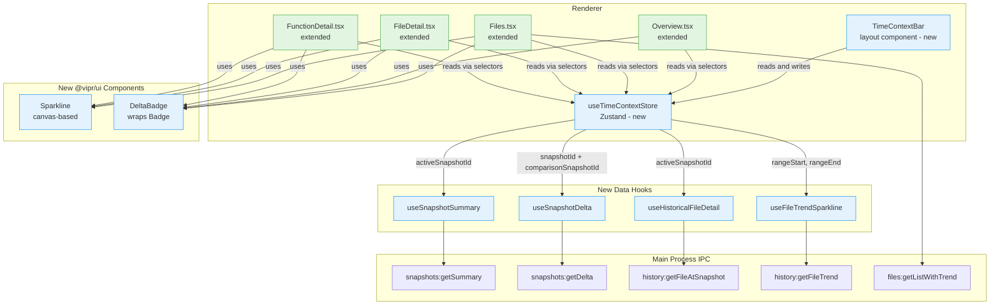
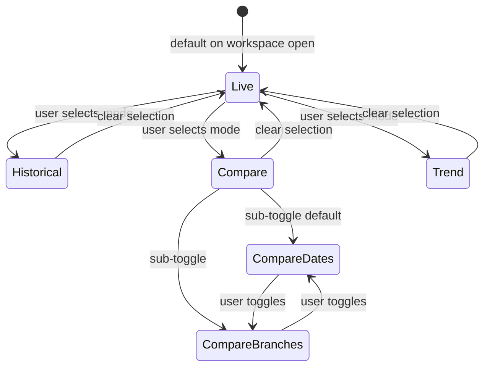
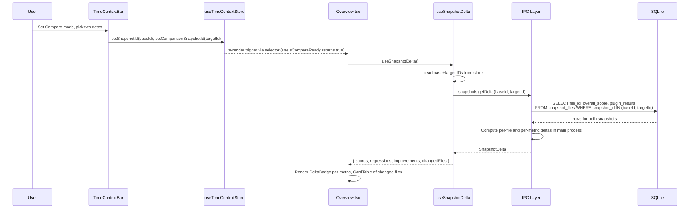
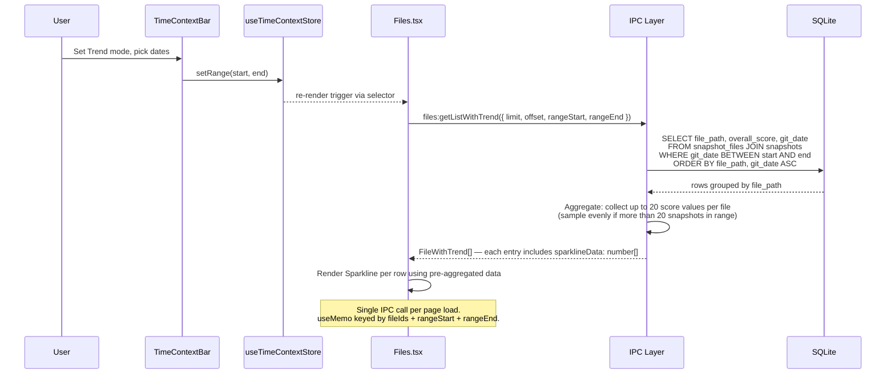
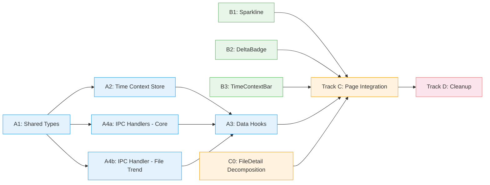

# Phase 10: Consolidate Time-Aware Features

## Overview

This phase consolidates five fragmented, partially-redundant pages — Snapshots, SnapshotComparison, BranchComparison, VelocityTrends, and the health-trend section of Monitoring — into a unified time dimension baked directly into the four main analysis views: Overview, Files, FileDetail, and FunctionDetail.

The central mechanism is a **Time Context Bar** that appears on all analysis routes. Users switch between four modes — Live, Historical, Compare (by date or branch), and Trend — and the active view automatically recontextualizes its data accordingly. The five deprecated pages are removed from the sidebar immediately; their routes remain temporarily as soft deprecation targets before final deletion.

> **Design vocabulary:** Mode labels use user vocabulary, not developer vocabulary. "Live" (not "Now") establishes clear contrast with temporal modes. "Historical" (not "Point-in-Time") is the natural word when looking up a past state. "Trend" (not "Range") is how analytics users describe a chart showing metric behavior over a span of time.

### Goals

- Eliminate three duplicated ScoreDelta badge implementations
- Eliminate two duplicated health-trend chart implementations (Monitoring and VelocityTrends)
- Eliminate three duplicated Before/After comparison UI patterns
- Unify inconsistent state management (local `useState` vs. Zustand) across comparison pages
- Surface historical and comparative data in context, not on separate pages
- Standardize terminology (`improved`/`degraded`) across all delta displays

---

## Current State Analysis

### Pages Being Consolidated

| Page                                  | Route                   | State Management               | Primary IPC                                                                                                          | Status              |
| ------------------------------------- | ----------------------- | ------------------------------ | -------------------------------------------------------------------------------------------------------------------- | ------------------- |
| `Snapshots.tsx`                       | `/snapshots`            | Local `useState` (lost on nav) | `snapshots:list`, `snapshots:compare`                                                                                | Deprecated          |
| `SnapshotComparison.tsx`              | `/snapshot-comparison`  | Local `useState` (lost on nav) | `snapshots:list`, `comparison:generate`, `comparison:getCommits`, `comparison:getAuthors`, `comparison:getLineStats` | Deprecated          |
| `BranchComparison.tsx`                | `/branch-comparison`    | `useBranchStore` (Zustand)     | `branch:list`, `branch:getCurrent`, `branch:compare`                                                                 | Deprecated          |
| `VelocityTrends.tsx`                  | `/velocity-trends`      | Local `useState`               | History/snapshot IPC, `TimeRange` type                                                                               | Deprecated          |
| `Monitoring.tsx` health trend section | `/monitoring` (partial) | `useMonitoringStore` (Zustand) | `monitoring:getHealthTrend`                                                                                          | Slim to Alerts only |

### Pages Being Extended

| Page                 | Route                          | What Changes                                                                            |
| -------------------- | ------------------------------ | --------------------------------------------------------------------------------------- |
| `Overview.tsx`       | `/overview`                    | Absorbs snapshot comparison and velocity trends; gains time-context-aware data fetching |
| `Files.tsx`          | `/files`                       | Gains ScoreDelta badges, per-file sparklines in Trend mode                              |
| `FileDetail.tsx`     | `/files/:path`                 | `selectedDate` local state already partially wired; gains full Trend and Compare data   |
| `FunctionDetail.tsx` | `/files/:path/functions/:name` | Gains Compare (stacked code panels) and Trend (metric sparklines) modes                 |

### Redundancies to Eliminate

| Redundancy                        | Current Locations                                                 | Resolution                                                 |
| --------------------------------- | ----------------------------------------------------------------- | ---------------------------------------------------------- |
| ScoreDelta badge implementation   | `Snapshots.tsx`, `SnapshotComparison.tsx`, `BranchComparison.tsx` | Extract to `DeltaBadge` in `@vipr/ui`                      |
| Before/After + Compare UI pattern | Same three pages                                                  | TimeContextBar Compare mode on existing views              |
| Health trend LineChart            | `Monitoring.tsx`, `VelocityTrends.tsx`                            | Trend mode on Overview                                     |
| Status terminology mismatch       | `improved`/`degraded` vs `improvement`/`regression` across pages  | Standardize to `improved`/`degraded` everywhere            |
| `useState` lost on navigation     | `Snapshots.tsx`, `SnapshotComparison.tsx`                         | `useTimeContextStore` (Zustand) persists across navigation |

### Existing Time Infrastructure to Preserve

| File                                                           | Relevant Content                                                  | What to Do                                                     |
| -------------------------------------------------------------- | ----------------------------------------------------------------- | -------------------------------------------------------------- |
| `clients/desktop/src/renderer/pages/FileDetail.tsx`            | `DatePicker` imported; `selectedDate` local state partially wired | Remove local state in C0 refactor; replace with store selector |
| `clients/desktop/src/renderer/pages/VelocityTrends.tsx`        | `TimeRange` type, `useMultiMetricTrend` hook                      | Extract both before deleting the page                          |
| `clients/desktop/src/renderer/components/charts/LineChart.tsx` | Used for sparklines in Monitoring at `width=200, height=60`       | Reuse for health trend in Overview Trend mode                  |

---

## Architecture

### System Overview



### Time Context Store

The store is Zustand, not React Context, to match the existing pattern established by `useBranchStore`, `useMonitoringStore`, and `useHistoryStore`. The only Context in the application is `ViprAPIContext` for IPC abstraction — do not introduce additional Context for business data.

```typescript
// clients/desktop/src/renderer/stores/time-context.ts

type TimeMode = 'live' | 'historical' | 'compare' | 'trend';
type CompareBy = 'date' | 'branch';

interface TimeContextState {
  mode: TimeMode;
  compareBy: CompareBy;
  // Point-in-time or left side of comparison (resolved snapshot ID)
  snapshotId: number | null;
  // Right side of comparison (compare mode only)
  comparisonSnapshotId: number | null;
  // Trend mode
  rangeStart: string | null; // ISO date string YYYY-MM-DD
  rangeEnd: string | null; // ISO date string YYYY-MM-DD
  // Branch compare mode
  baseBranch: string | null;
  targetBranch: string | null;
}

interface TimeContextActions {
  setMode(mode: TimeMode): void;
  setCompareBy(compareBy: CompareBy): void;
  setSnapshotId(id: number | null): void;
  setComparisonSnapshotId(id: number | null): void;
  setRange(start: string, end: string): void;
  setBranches(base: string, target: string): void;
  reset(): void; // Called on workspace/repo switch
}

// Selector hooks — consume in pages, no prop drilling
export const useTimeMode = () => useTimeContextStore(s => s.mode);
export const useActiveSnapshotId = () => useTimeContextStore(s => s.snapshotId);
export const useTimeRange = () =>
  useTimeContextStore(s => ({ start: s.rangeStart, end: s.rangeEnd }));
export const useComparisonIds = () =>
  useTimeContextStore(s => ({ base: s.snapshotId, target: s.comparisonSnapshotId }));
export const useIsCompareReady = () =>
  useTimeContextStore(s => s.snapshotId !== null && s.comparisonSnapshotId !== null);
```

### Time Context Modes



| Mode               | Controls Shown                                                      | Store Fields Written                 | Data Source                    |
| ------------------ | ------------------------------------------------------------------- | ------------------------------------ | ------------------------------ |
| Live               | Mode selector only                                                  | `mode: 'live'`                       | Current analysis DB            |
| Historical         | Single `DatePicker`; resolves to nearest snapshot                   | `snapshotId`                         | `snapshots` table              |
| Compare (Dates)    | Two `DatePicker` + swap `Button`                                    | `snapshotId`, `comparisonSnapshotId` | `snapshots` table (both sides) |
| Compare (Branches) | Two branch `Dropdown variant="select"`                              | `baseBranch`, `targetBranch`         | Branch analysis results        |
| Trend              | `Calendar` with `mode="range"` inside `Popover` + metric `Dropdown` | `rangeStart`, `rangeEnd`             | `commit_files` + `snapshots`   |

> **DatePicker vs Calendar:** The existing `DatePicker` component only exposes a single-date API (`date: Date`, `onDateChange`). Historical and Compare modes use `DatePicker` for single-date selection. Trend mode requires a date range — use `Calendar` with `mode="range"` inside a `Popover` (both already in `@vipr/ui`), not `DatePicker`. The Trend row also includes the metric `Dropdown variant="select"` (moved here from the Files page header so the metric selection persists across page navigation).

> **Mid-selection state (Compare mode):** Until both dates/branches are selected, the page renders in Live mode with a visual indicator in the bar showing the incomplete selection. The `useIsCompareReady` selector returns `false` until both sides are populated, and pages use this to gate Compare-mode rendering.

---

## UX Design

### Time Context Bar Layout

The bar renders between the Titlebar and page content on all analysis routes. The Titlebar already has route-conditional rendering precedent via `ROUTES_WITH_ZOOM_BREADCRUMBS` — follow the same pattern for the bar's visibility gate.

**Visibility gate:** The bar does not render at all when `needsInitialAnalysis` is true (the existing centered `ErrorDisplay` message is the primary first-run UI). The bar only renders after at least one analysis has completed.

**Positioning:** The bar is sticky with `top: 64px` (below the Titlebar's `h-16`) and `z-20` (below the Titlebar's `z-30` but above page content). This ensures time context remains visible when scrolling long pages like FileDetail and FunctionDetail.

**Container styling:** `px-4 sm:px-6 lg:px-8 py-2 border-b border-gray-200 dark:border-gray-700/60 bg-white dark:bg-gray-900`

**Electron requirement:** The bar's outer element must set `WebkitAppRegion: 'no-drag'` since all its interactive controls (tabs, dropdowns, date pickers) must be clickable. The Titlebar uses `WebkitAppRegion: 'drag'` on its outer element with `'no-drag'` on interactive children.

```
Live mode (no extra controls):
┌──────────────────────────────────────────────────────────────────────┐
│  [Live]  [Historical]  [Compare]  [Trend]                           │
└──────────────────────────────────────────────────────────────────────┘

Historical:
┌──────────────────────────────────────────────────────────────────────┐
│  [Live]  [Historical]  [Compare]  [Trend]                           │
│  Viewing: [Feb 15, 2026 ▼]   Nearest snapshot: Feb 14               │
└──────────────────────────────────────────────────────────────────────┘

Compare (by date):
┌──────────────────────────────────────────────────────────────────────┐
│  [Live]  [Historical]  [Compare]  [Trend]    [Compare Dates] Branches│
│  Before: [Feb 1, 2026 ▼]  (snap: Jan 30)                            │
│  After:  [Feb 25, 2026 ▼] (snap: Feb 24)   [Swap]                   │
└──────────────────────────────────────────────────────────────────────┘

Compare (by branch):
┌──────────────────────────────────────────────────────────────────────┐
│  [Live]  [Historical]  [Compare]  [Trend]   Compare Dates [Branches] │
│  Base: [main ▼]   Target: [feature/refactor ▼]                      │
└──────────────────────────────────────────────────────────────────────┘

Trend:
┌──────────────────────────────────────────────────────────────────────┐
│  [Live]  [Historical]  [Compare]  [Trend]                           │
│  From: [Jan 1, 2026]   To: [Feb 25, 2026]   Show: [Health Score ▼]  │
└──────────────────────────────────────────────────────────────────────┘
```

> **Resolved snapshot dates:** In Compare mode, the bar shows the actual resolved snapshot dates in parentheses next to each selected date (e.g., "snap: Jan 30"), so users know which snapshots their approximate date selections resolved to. This is especially important when snapshot frequency is low.

> **Keyboard navigation:** Mode switching is accessible via Tab and Enter. Escape clears date/branch selections and returns to Live mode. The mode selector `Tabs` supports standard keyboard navigation.

### How Each View Adapts Per Mode

#### Overview

| Mode                     | Behavior                                                                                                                                            |
| ------------------------ | --------------------------------------------------------------------------------------------------------------------------------------------------- |
| Live                     | Existing behavior unchanged                                                                                                                         |
| Historical               | HealthScoreCard, StatCards, and distribution cards source data from `useSnapshotSummary`; bar label shows "Viewing [actual snapshot date]"          |
| Compare (Date or Branch) | `DeltaBadge` beside each metric StatCard; changed files `CardTable` with `improved`/`degraded` sort; source from `useSnapshotDelta`                 |
| Trend                    | Health-score `LineChart` replaces HealthScoreCard gauge; velocity StatCards (issues opened/closed per week); source from `snapshots:getHealthTrend` |

> **Trend mode chart precedent:** Follow the `FintechCard01` (Portfolio Returns) pattern from the styleguide: a multi-dataset area chart with `chartAreaGradient` fill (already exported from `@vipr/ui/chart-config`). The primary line shows the health score trend; an optional dashed secondary line can show a comparison branch's health score for the same period when branch context is available.

#### Files

| Mode       | Behavior                                                                                                                                                                                                                  |
| ---------- | ------------------------------------------------------------------------------------------------------------------------------------------------------------------------------------------------------------------------- |
| Live       | Existing behavior unchanged                                                                                                                                                                                               |
| Historical | File list reflects snapshot; score badges show historical values from `snapshots:getFileList`                                                                                                                             |
| Compare    | `DeltaBadge` per file row; sort options: Most Improved, Most Degraded, All Changes                                                                                                                                        |
| Trend      | `Sparkline` column added to file `CardTable`; metric selected via `Dropdown` in the TimeContextBar's Trend row (not in the Files page header) drives sparkline color and sort; batch-fetched via `files:getListWithTrend` |

> **Sparkline-in-table precedent:** Follow the `FintechCard14` (Market Trends) pattern from the styleguide, which renders sparklines color-coded green/red based on a `growth` flag. Map this directly to the `Sparkline` component's `color` prop, computed from the selected metric's `higherIsBetter` value and the file's trend direction.

#### FileDetail

| Mode       | Behavior                                                                                                                                                                        |
| ---------- | ------------------------------------------------------------------------------------------------------------------------------------------------------------------------------- |
| Live       | Existing behavior; `selectedDate` local state removed, store takes over                                                                                                         |
| Historical | RadialGauge, StatCards, InsightCards show historical values via `useHistoricalFileDetail`                                                                                       |
| Compare    | `MetricDescriptionList` for before/after metric comparison (not doubled StatCards); InsightCard list distinguishes new vs. resolved issues with Badge labels "New" / "Resolved" |
| Trend      | Metric sparklines next to each StatCard; full health-score `LineChart` via `history:getFileTrend`                                                                               |

> **Compare layout rationale:** The existing FileDetail renders a RadialGauge (1/3 width), four StatCards (2/3 width), source code, and issues table. Doubling StatCards to 8 for before/after pairs is too cramped. Instead, use `MetricDescriptionList` from `@vipr/ui/metric-description-list` (already used in Overview for Score Distribution) to show before/after metric pairs in a compact vertical format. The RadialGauge shows the delta value via a `DeltaBadge` overlay.

#### FunctionDetail

| Mode       | Behavior                                                                                                              |
| ---------- | --------------------------------------------------------------------------------------------------------------------- |
| Live       | Existing behavior unchanged                                                                                           |
| Historical | RadialGauge and StatCards show historical values                                                                      |
| Compare    | Stacked `HighlightedCode` panels (Before / After, each with header Badge label); `DeltaBadge` on each metric StatCard |
| Trend      | Metric sparklines next to each StatCard                                                                               |

> **Compare code display:** `HighlightedCode` is a syntax highlighter, not a diff component. True side-by-side diff is a component gap (see `component-gap-analysis.md`). The interim solution is stacked Before/After panels, each as a separate `HighlightedCode` instance with a "Before" / "After" `Badge` label in its header. This avoids introducing a diff algorithm dependency and works within the existing single-column layout.

### Sidebar Changes

Remove from sidebar navigation immediately (routes kept alive until Track D):

- `/snapshots`
- `/snapshot-comparison`
- `/branch-comparison`
- `/velocity-trends`

The `/monitoring` sidebar entry is retained. The health trend `LineChart` section is removed from `Monitoring.tsx` content in Task D0; alert management remains.

---

## New Components

### Sparkline

A lightweight canvas-based sparkline for embedding in table rows and detail panels. `LineChart` is too heavy for per-row use (full Chart.js instance per row). This follows the existing pattern of `MetricBarChart` and `PillChart`, which draw directly on `<canvas>` without Chart.js.

**File:** `packages/ui/src/components/charts/Sparkline.tsx`

```typescript
interface SparklineProps {
  data: number[]; // Pre-aggregated, 10-20 points maximum
  width?: number; // Default: 80
  height?: number; // Default: 24
  color: string; // CSS color string — always caller-provided, no auto-color-from-trend
  showDot?: boolean; // Highlight final value with a filled circle; default: true
  className?: string;
}
```

> **No auto-color-from-trend:** The original `trend` prop was removed. For inverted metrics (cyclomatic complexity, Halstead volume), `trend: 'up'` would incorrectly render green. Callers must always pass an explicit `color`, computed from the selected metric's `higherIsBetter` value and the data's direction. This eliminates a class of color-direction bugs at the component level.

Implementation constraints:

- No Chart.js dependency
- No ResizeObserver (fixed dimensions)
- No tooltips (table rows are not the right context for hover detail)
- DPI-aware: scale canvas by `window.devicePixelRatio` for crisp rendering on retina displays
- Static draw: `useEffect` re-draws only when `data`, `width`, `height`, or `color` changes
- Normalized: scale data min/max to canvas height before drawing polyline

Update `packages/ui/package.json` exports (`"./sparkline"`), `packages/ui/src/components/charts/index.ts` barrel, and `packages/ui/catalogs/component-catalog.json`.

### DeltaBadge

Extracts the three duplicated ScoreDelta badge implementations across deprecated pages into a single shared component.

**File:** `packages/ui/src/components/common/DeltaBadge.tsx`

```typescript
interface DeltaBadgeProps {
  value: number; // Raw delta value
  threshold?: number; // Default: 0. Values within ±threshold show as neutral
  format?: 'absolute' | 'percent'; // Default: 'absolute'
  size?: 'sm' | 'md'; // Default: 'sm'
  higherIsBetter?: boolean; // Default: true. Set false for complexity metrics
  className?: string;
}
```

Passes a `variant` prop directly to the existing `Badge` component (`variant="green"`, `variant="red"`, `variant="gray"`). Does not inject custom class strings that override Badge's internal styling.

Color assignment via Badge variants:

| Condition                               | Badge Variant | Resolved Tokens (from `component-recipes.json`)      |
| --------------------------------------- | ------------- | ---------------------------------------------------- |
| Positive delta, `higherIsBetter: true`  | `green`       | `bg-green-500/20 text-green-700 dark:text-green-400` |
| Negative delta, `higherIsBetter: true`  | `red`         | `bg-red-500/20 text-red-700 dark:text-red-400`       |
| Positive delta, `higherIsBetter: false` | `red`         | `bg-red-500/20 text-red-700 dark:text-red-400`       |
| Negative delta, `higherIsBetter: false` | `green`       | `bg-green-500/20 text-green-700 dark:text-green-400` |
| Within threshold                        | `gray`        | `bg-gray-400/20 text-gray-500 dark:text-gray-400`    |

Display examples: `+4.2` (absolute, positive), `-1.8` (absolute, negative), `+6%` (percent), `0` (neutral).

Update `packages/ui/package.json` exports (`"./delta-badge"`), `packages/ui/src/components/common/index.ts` barrel, and `packages/ui/catalogs/component-catalog.json`.

### TimeContextBar

Layout component composing existing `@vipr/ui` primitives. Lives in the desktop renderer, not in `@vipr/ui`, because it depends on Electron IPC and the Zustand store.

**File:** `clients/desktop/src/renderer/components/layout/TimeContextBar.tsx`

```typescript
interface TimeContextBarProps {
  snapshotCount: number; // From IPC; bar disabled with Tooltip when 0
}
```

Uses only existing primitives: `Tabs variant="underline"` for the mode selector, `Dropdown variant="select"` for branch pickers, `Button` for swap, `DatePicker` for single-date selection (Historical and Compare modes), `Calendar` with `mode="range"` inside `Popover` for Trend mode date range, `Tooltip` for the disabled state. No new `@vipr/ui` components are introduced.

**Internal decomposition:** Extract mode-specific control sets as named sub-components to contain the 4-mode x 2-compareBy x 3-snapshotCount configuration matrix:

- `LiveControls` — no-op (mode selector only)
- `HistoricalControls` — single DatePicker + resolved snapshot label
- `CompareControls` — sub-toggle for Dates/Branches, two pickers, swap button, resolved snapshot labels
- `TrendControls` — Calendar range + metric Dropdown

Each sub-component receives only the props it needs from the store. The main bar renders the mode selector `Tabs` and delegates the secondary controls row to the active sub-component.

Disabled behavior when `snapshotCount === 0`: all controls disabled; `Tooltip` reads "No snapshots available. Run analysis to generate snapshots."

Disabled behavior when `snapshotCount === 1`: Historical available; Compare and Trend controls disabled with `Tooltip` "Compare and Trend require at least two snapshots."

---

## Data Flow and Aggregation

### Compare Mode on Overview



### Trend Mode on Files



### Aggregation Strategy

Sparkline data is fetched at the page level in a single batch IPC call. The main process aggregates before sending to the renderer. Never send 1000+ item datasets to the renderer — aggregate in the main process first.

| Data                             | Source Tables                     | Max Points                    | IPC Channel                 |
| -------------------------------- | --------------------------------- | ----------------------------- | --------------------------- |
| Per-file sparkline               | `snapshot_files` JOIN `snapshots` | 20 per file (sampled if more) | `files:getListWithTrend`    |
| Overview health trend            | `snapshots`                       | 365                           | `snapshots:getHealthTrend`  |
| Per-plugin avg scores over range | `snapshot_metrics`                | < 200                         | `snapshots:getPluginTrends` |
| File metrics at a snapshot       | `snapshot_files`                  | 1 row per file                | `snapshots:getFileList`     |
| File metric history              | `snapshot_files` JOIN `snapshots` | 100                           | `history:getFileTrend`      |

### Metric Selector

In Trend mode, a `Dropdown variant="select"` in the TimeContextBar's Trend row (not in any page header) controls which metric drives sparkline color direction and sort order. This placement ensures the metric selection persists across page navigation (Files → FileDetail → FunctionDetail) in Trend mode. Use DB keys (unprefixed), not analysis IDs. See the CLAUDE.md memory note on DB metric key differences.

| Display Label         | DB Key            | `higherIsBetter` |
| --------------------- | ----------------- | ---------------- |
| Health Score          | `overall_score`   | `true`           |
| Cyclomatic Complexity | `cyclomatic`      | `false`          |
| Maintainability Index | `maintainability` | `true`           |
| Halstead Volume       | `halstead`        | `false`          |
| Issue Count           | `issue_count`     | `false`          |

For the canonical inversion configuration, see `clients/desktop/src/main/config/metricNormalizationConfig.ts`.

---

## Database and IPC

### Relevant Schema

No schema migrations are required. All queries read existing tables.

```sql
-- Snapshots (existing, schema v1 + v4 + v14)
snapshots(id, git_sha, git_author, git_message, git_date, file_count,
  avg_score, median_score, p25_score, p75_score, p95_score, score_stddev,
  total_issues, critical_issues, branch)

snapshot_metrics(id, snapshot_id, plugin_id, file_count, avg_score, total_issues, ...)

snapshot_files(id, snapshot_id, file_id, overall_score, plugin_results JSON)

-- Commit-level history (existing, schema v2)
-- Indexed on (file_path, commit_date DESC)
commit_files(id, commit_sha, file_path, content_sha, health_score,
  complexity_score, maintainability_score, issue_count, critical_count,
  commit_date, author)
```

### New IPC Channels

| Channel                     | Input                                                                     | Output                       | Description                                          |
| --------------------------- | ------------------------------------------------------------------------- | ---------------------------- | ---------------------------------------------------- |
| `snapshots:getSummary`      | `{ snapshotId: number }`                                                  | `SnapshotSummary`            | Aggregate stats for one snapshot                     |
| `snapshots:getDelta`        | `{ baseId: number, targetId: number }`                                    | `SnapshotDelta`              | Per-file and per-metric deltas between two snapshots |
| `snapshots:getHealthTrend`  | `{ start: string, end: string }`                                          | `HealthTrendPoint[]`         | Health score data points for range charts            |
| `snapshots:getFileList`     | `{ snapshotId: number, limit: number, offset: number }`                   | `SnapshotFileEntry[]`        | File list at a specific snapshot                     |
| `history:getFileAtSnapshot` | `{ filePath: string, snapshotId: number }`                                | `HistoricalFileData \| null` | File metrics at a specific snapshot                  |
| `history:getFileTrend`      | `{ filePath: string, start: string, end: string }`                        | `FileTrendPoint[]`           | File metric history for sparklines                   |
| `files:getListWithTrend`    | `{ limit: number, offset: number, rangeStart: string, rangeEnd: string }` | `FileWithTrend[]`            | File list with pre-aggregated sparkline arrays       |

### Existing IPC to Retain

These channels already exist and continue to be used by new hooks or by monitoring:

- `snapshots:list` — List of snapshots for DatePicker resolution and mode initialization
- `branch:list`, `branch:getCurrent`, `branch:compare` — Branch Compare mode
- `monitoring:getState`, `monitoring:getAlerts`, `monitoring:getEvents` — Alert management (kept in Monitoring page)

### IPC to Remove After Deprecated Page Deletion

Do not remove these channels until the deprecated pages are confirmed deleted in Track D.

- `snapshots:compare` — used only by deprecated `Snapshots.tsx`
- `comparison:generate`, `comparison:getCommits`, `comparison:getAuthors`, `comparison:getLineStats` — used only by deprecated `SnapshotComparison.tsx`
- `monitoring:getHealthTrend` — used only by the Monitoring health trend section being removed

### Preload Bridge Additions

```typescript
// Additions to ViprDesktopAPI in clients/desktop/src/shared/ipc/api-types.ts

snapshots: {
  // existing channels remain unchanged
  getSummary(snapshotId: number): Promise<SnapshotSummary>;
  getDelta(baseId: number, targetId: number): Promise<SnapshotDelta>;
  getHealthTrend(start: string, end: string): Promise<HealthTrendPoint[]>;
  getFileList(snapshotId: number, limit: number, offset: number): Promise<SnapshotFileEntry[]>;
};
history: {
  // existing channels remain unchanged
  getFileAtSnapshot(filePath: string, snapshotId: number): Promise<HistoricalFileData | null>;
  getFileTrend(filePath: string, start: string, end: string): Promise<FileTrendPoint[]>;
};
files: {
  // existing channels remain unchanged
  getListWithTrend(params: FileListWithTrendParams): Promise<FileWithTrend[]>;
};
```

---

## Implementation Phases and Parallelization

Three independent tracks that converge at page integration. Track A (store and hooks) and Track B (UI components) have no dependencies on each other and can run in parallel from the start.



---

### Track A — Store and Hooks

All Track A files are pure TypeScript with no renderer UI dependencies. Start immediately.

#### Task A1: Shared Types

**Agent:** `typescript-engineer`

**File:** `clients/desktop/src/shared/ipc/time-context-types.ts`

Create Zod schemas and inferred TypeScript types for all new IPC channels:

- `SnapshotSummary` — aggregate stats for one snapshot
- `SnapshotDelta` — per-file and per-metric deltas with `improved`/`degraded` classification
- `HealthTrendPoint` — `{ date: string, score: number }`
- `SnapshotFileEntry` — file record at a snapshot
- `HistoricalFileData` — file metrics at a snapshot for FileDetail
- `FileTrendPoint` — `{ date: string, score: number, issueCount: number }`
- `FileWithTrend` — file record augmented with `sparklineData: number[]`
- `FileListWithTrendParams` — `{ limit, offset, rangeStart, rangeEnd, metric? }`

Follow the Zod + inferred type pattern from `clients/desktop/src/shared/ipc/export-types.ts`.

**Depends on:** Nothing. **Blocks:** A2, A3, A4.

**Verification:**

```bash
pnpm --filter @vipr/desktop typecheck
```

---

#### Task A2: Time Context Store

**Agent:** `typescript-engineer`

**File:** `clients/desktop/src/renderer/stores/time-context.ts`

Implement `useTimeContextStore` with full `TimeContextState` and `TimeContextActions` as defined in the Architecture section. Include `reset()` — wire it to the workspace-change handler that already calls `useBranchStore`'s equivalent reset, so both stores clear together on repo switch.

Export selector hooks (`useTimeMode`, `useActiveSnapshotId`, `useTimeRange`, `useComparisonIds`) from the same file.

**Depends on:** A1. **Blocks:** A3.

**Verification:**

```bash
pnpm --filter @vipr/desktop typecheck
```

---

#### Task A3: Data-Fetching Hooks

**Agent:** `typescript-engineer`

**Files:**

- `clients/desktop/src/renderer/hooks/useSnapshotSummary.ts`
- `clients/desktop/src/renderer/hooks/useSnapshotDelta.ts`
- `clients/desktop/src/renderer/hooks/useHistoricalFileDetail.ts`
- `clients/desktop/src/renderer/hooks/useFileTrendSparkline.ts`

Each hook follows the existing pattern from `clients/desktop/src/renderer/hooks/`:

1. Read relevant fields from the time context store via selector hooks
2. Call the appropriate IPC channel through `ViprAPIContext`
3. Return `{ data, loading, error }` matching the existing hook return shape

Performance notes:

- Cache responses in a module-level `Map` keyed by `${repositoryPath}:${snapshotId}` (snapshot data is immutable once written, but snapshot IDs from different repositories can collide)
- Each hook must export a `clearCache()` function; wire these to the workspace-change handler alongside `useBranchStore.reset()` and `useTimeContextStore.reset()`
- `useSnapshotDelta`: return `null` when `comparisonSnapshotId` is null — avoids IPC calls while only one side is selected
- `useFileTrendSparkline`: accept an `enabled` flag so pages suppress fetching when mode is not Trend
- All hooks must use `AbortController` to cancel in-flight IPC requests when the time mode changes. Without cancellation, stale responses from a previous mode may arrive after the mode switch and overwrite current data

**Depends on:** A1, A2, A4. **Blocks:** C1, C2, C3.

**Verification:**

```bash
pnpm --filter @vipr/desktop typecheck
```

---

#### Task A4a: Core IPC Handlers

**Agent:** `typescript-engineer`

**Files:**

- `clients/desktop/src/main/ipc/handlers/snapshots.ts` (modify existing)
- `clients/desktop/src/main/ipc/handlers/history.ts` (modify existing)
- `clients/desktop/src/shared/ipc/api-types.ts` (extend `ViprDesktopAPI`)
- `clients/desktop/src/preload/index.ts` (add new channel bridges)
- `clients/desktop/src/main/ipc/router.ts` (register new handlers)

Add handlers for: `snapshots:getSummary`, `snapshots:getDelta`, `snapshots:getHealthTrend`, `snapshots:getFileList`, `history:getFileAtSnapshot`, `history:getFileTrend`. Follow the existing handler registration pattern.

**Depends on:** A1. **Blocks:** A3.

**Verification:**

```bash
pnpm --filter @vipr/desktop typecheck
```

---

#### Task A4b: File Trend IPC Handler

**Agent:** `typescript-engineer`

**File:** `clients/desktop/src/main/ipc/handlers/file-trend-handlers.ts` (create new)

> **Separate file rationale:** The existing `file-handlers.ts` has cyclomatic complexity ~12 across three handlers. The `files:getListWithTrend` handler adds ~15 cyclomatic points. Combining them would push the file past the ~20-point threshold. A separate handler file keeps each file focused and independently testable.

`files:getListWithTrend` aggregation logic in main process:

```typescript
// Query snapshot_files JOIN snapshots filtered by date range
// Group rows by file_id in main process
// Collect score values in git_date ASC order
// If group has more than 20 values, sample evenly:
//   indices = [0, totalCount/19, 2*totalCount/19, ..., totalCount-1]
// Return FileWithTrend[] with sparklineData: number[]
```

Must use a single bulk query that returns all file trends in one result set, then group in JavaScript. Do not inherit the N+1 query pattern from the existing `db:getFileList` handler (which runs `issueCountStmt.get(row.id)` per file row inside a `map`).

Also modify: `clients/desktop/src/shared/ipc/api-types.ts`, `clients/desktop/src/preload/index.ts`, `clients/desktop/src/main/ipc/router.ts`.

**Depends on:** A1. **Blocks:** A3.

**Verification:**

```bash
pnpm --filter @vipr/desktop typecheck
```

---

### Track B — UI Components

Track B has no dependency on Track A. These components can be built with mocked store values and wired to the real store in Track C.

#### Task B1: Sparkline Component

**Agent:** `react-engineer`

**File:** `packages/ui/src/components/charts/Sparkline.tsx`

Follow the `MetricBarChart` canvas draw pattern:

- `useRef<HTMLCanvasElement>` + `useEffect` for draw lifecycle
- Scale canvas by `window.devicePixelRatio` at mount time
- Normalize data: `y = height - ((value - min) / (max - min)) * height`
- Draw polyline with `moveTo` / `lineTo` / `stroke`
- Draw optional dot (last point) with `arc` + `fill`
- Re-draw `useEffect` dependency array: `[data, width, height, color]`

Update `packages/ui/package.json` exports and `packages/ui/catalogs/component-catalog.json`.

**Depends on:** Nothing. **Blocks:** C2, C3.

**Verification:**

```bash
pnpm --filter @vipr/ui typecheck
```

---

#### Task B2: DeltaBadge Component

**Agent:** `react-engineer`

**File:** `packages/ui/src/components/common/DeltaBadge.tsx`

Implement wrapping existing `Badge`. Color token table is in the New Components section. Format rules:

- Absolute: prefix `+` for positive, `-` is built-in for negatives, display `0` when within threshold
- Percent: same prefix convention, append `%`

Update `packages/ui/package.json` exports and `packages/ui/catalogs/component-catalog.json`.

**Depends on:** Nothing. **Blocks:** B3, C1, C2, C3.

**Verification:**

```bash
pnpm --filter @vipr/ui typecheck
```

---

#### Task B3: TimeContextBar Component

**Agent:** `react-engineer`

**Files:**

- `clients/desktop/src/renderer/components/layout/TimeContextBar.tsx` (create)
- `clients/desktop/src/renderer/components/layout/Titlebar.tsx` (modify)

Compose `TimeContextBar` from existing primitives only: `Tabs`, `Dropdown`, `Button`, `DatePicker`, `Tooltip`. No new `@vipr/ui` components.

Modify `Titlebar.tsx` to render `<TimeContextBar snapshotCount={snapshotCount} />` conditionally on analysis routes, mirroring the `ROUTES_WITH_ZOOM_BREADCRUMBS` conditional pattern. The `snapshotCount` value comes from a lightweight `snapshots:list` call already made at workspace load.

During development, the store can be mocked — `TimeContextBar` reads from and writes to `useTimeContextStore` via the selector hooks defined in Task A2.

**Depends on:** Nothing (A2 is needed for the real store; mock during development). **Blocks:** C1, C2, C3.

> **Removed B2 dependency:** TimeContextBar does not use DeltaBadge. DeltaBadge appears in page views (Overview Compare mode, Files Compare mode), not in the bar itself.

**Verification:**

```bash
pnpm --filter @vipr/desktop typecheck
```

---

### Track C — Page Integration

Requires Track A hooks and Track B components.

#### Task C0: FileDetail Decomposition (Prerequisite Refactor)

**Agent:** `react-engineer`

> **Complexity rationale:** `FileDetail.tsx` is already at ~22 cyclomatic complexity with 14+ state variables and ~750 LOC. Adding 4-mode branching in C3 would push it to ~32-35 cyclomatic — well past the god component threshold. This prerequisite refactor must complete before C3 begins.

**File:** `clients/desktop/src/renderer/pages/FileDetail.tsx`

Decompose into a mode-dispatch orchestrator plus mode-specific panel components:

- `FileDetail.tsx` — orchestration only (~50 LOC): reads `useTimeMode()`, renders shared layout (breadcrumbs, page header), delegates to the active panel
- `FileDetailLivePanel.tsx` — existing rendering logic moves here (no behavior change)
- `FileDetailHistoricalPanel.tsx` — (placeholder, implemented in C3)
- `FileDetailComparePanel.tsx` — (placeholder, implemented in C3)
- `FileDetailTrendPanel.tsx` — (placeholder, implemented in C3)

Each panel has its own data-fetch hook call and rendering logic. The orchestration component's complexity stays near cyclomatic ~8 (one branch per mode + existing error/loading guards).

Also apply the same decomposition pattern to `Files.tsx`: extract a `useFilesForTimeMode()` hook that internally delegates to `useFilesLive()` (current approach with event subscriptions), `useFilesAtSnapshot()` (single IPC call, no subscriptions), or `useFilesWithTrend()` (batch fetch). This keeps `Files.tsx` branching limited to render-layer concerns (which columns to show).

**Depends on:** Nothing (pure refactor of existing code). **Blocks:** C3.

**Verification:**

```bash
pnpm --filter @vipr/desktop typecheck
pnpm --filter @vipr/desktop build
```

---

#### Task C1: Overview Integration

**Agent:** `react-engineer`

**File:** `clients/desktop/src/renderer/pages/Overview.tsx`

Add one `useTimeMode()` read at the top of the component. Branch render path on mode value:

- `live`: existing render path, unchanged
- `historical`: replace data fetching with `useSnapshotSummary(snapshotId)` result; add "Viewing [snapshot date]" label above the page header
- `compare`: render `DeltaBadge` beside each metric StatCard; render a changed files `CardTable` sourced from `useSnapshotDelta(baseId, targetId).changedFiles`; sort options: Most Improved, Most Degraded. Gate on `useIsCompareReady()` — render Live data until both sides are populated.
- `trend`: replace HealthScoreCard gauge with health-score `LineChart` (`width` fills container, `height=200`) using `chartAreaGradient` (from `@vipr/ui/chart-config`); velocity StatCards from `snapshots:getHealthTrend` aggregation. Follow `FintechCard01` multi-dataset pattern: primary line for health score, optional dashed line for comparison branch.

**Depends on:** A3, A4a, A4b, B2, B3. **Blocks:** D1.

**Verification:**

```bash
pnpm --filter @vipr/desktop typecheck
pnpm --filter @vipr/desktop build
```

---

#### Task C2: Files Integration

**Agent:** `react-engineer`

**File:** `clients/desktop/src/renderer/pages/Files.tsx`

- `live`: existing render path, unchanged
- `snapshot`: replace file list fetch with `snapshots:getFileList(snapshotId, limit, offset)`
- `compare`: add `DeltaBadge` column to the file `CardTable`; add sort `Dropdown` with Most Improved, Most Degraded, All Changes options
- `trend`: add `Sparkline` column; metric selection comes from the TimeContextBar's Trend row (not in the Files page header); batch-fetch via `files:getListWithTrend` using `useFilesForTimeMode()` hook from C0; `useMemo` result keyed by current file IDs + range string

**Depends on:** A3, A4a, A4b, B1, B2, B3, C0. **Blocks:** D1.

**Verification:**

```bash
pnpm --filter @vipr/desktop typecheck
```

---

#### Task C3: FileDetail and FunctionDetail Integration

**Agent:** `react-engineer`

**Files:**

- `clients/desktop/src/renderer/pages/FileDetailHistoricalPanel.tsx` (implement placeholder from C0)
- `clients/desktop/src/renderer/pages/FileDetailComparePanel.tsx` (implement placeholder from C0)
- `clients/desktop/src/renderer/pages/FileDetailTrendPanel.tsx` (implement placeholder from C0)
- `clients/desktop/src/renderer/pages/FunctionDetail.tsx`

**FileDetail panels** (orchestration already done in C0):

- `FileDetailHistoricalPanel`: `useHistoricalFileDetail(filePath, snapshotId)` drives all metrics
- `FileDetailComparePanel`: `MetricDescriptionList` for before/after metric comparison; InsightCard list adds Badge labels "New" (appeared in target) and "Resolved" (present in base, absent in target); RadialGauge shows delta via `DeltaBadge` overlay. Gate on `useIsCompareReady()`.
- `FileDetailTrendPanel`: `Sparkline` next to each StatCard; full health-score `LineChart` at bottom via `history:getFileTrend`

**FunctionDetail:**

- `historical`: `useHistoricalFileDetail` scoped to function metrics (pass function name in params)
- `compare`: stacked Before/After `HighlightedCode` panels (each with header Badge label "Before" / "After"); `DeltaBadge` on each metric StatCard. Gate on `useIsCompareReady()`.
- `trend`: `Sparkline` next to each metric StatCard

**Depends on:** A3, A4a, A4b, B1, B2, B3, C0. **Blocks:** D1.

**Verification:**

```bash
pnpm --filter @vipr/desktop typecheck
```

---

### Track D — Cleanup

Do not start until all Track C tasks are verified working end-to-end.

#### Task D0: Monitoring Health Trend Cleanup

**Agent:** `react-engineer`

Remove the health trend `LineChart` section from `Monitoring.tsx` and the corresponding `monitoring:getHealthTrend` IPC call from `useMonitoringStore`. The health trend is now served by Overview's Trend mode. Alert management in Monitoring remains unchanged.

> **Separated from C1:** This was originally bundled into C1 (Overview Integration). Coupling a Monitoring change to an Overview change increases the blast radius if C1 fails. This independent task can proceed after C1 is verified working.

**Depends on:** C1 (verify Overview Trend mode works before removing the Monitoring duplicate). **Blocks:** D2.

---

#### Task D1: Remove Deprecated Pages

**Agent:** `react-engineer`

**Files to delete:**

- `clients/desktop/src/renderer/pages/Snapshots.tsx`
- `clients/desktop/src/renderer/pages/SnapshotComparison.tsx`
- `clients/desktop/src/renderer/pages/BranchComparison.tsx`
- `clients/desktop/src/renderer/pages/VelocityTrends.tsx`

**Files to modify:**

- `clients/desktop/src/renderer/components/layout/Sidebar.tsx` — remove four nav entries
- `clients/desktop/src/renderer/App.tsx` (or router file) — remove four `<Route>` entries
- `clients/desktop/src/renderer/stores/branch.ts` — delete `useBranchStore` if no remaining consumers after `BranchComparison.tsx` deletion; grep for any other usage before deleting

Before deleting `VelocityTrends.tsx`, extract the `TimeRange` type and `useMultiMetricTrend` hook to appropriate permanent locations if they are needed by Overview Trend mode. If they are no longer needed after Trend mode is implemented with the new hooks, delete them with the page.

**Depends on:** C1, C2, C3. **Blocks:** D2.

---

#### Task D2: Remove Deprecated IPC Channels

**Agent:** `typescript-engineer`

After confirming no remaining consumers in the codebase, remove:

- Handler + preload bridge: `snapshots:compare`
- Handlers + preload bridge: `comparison:generate`, `comparison:getCommits`, `comparison:getAuthors`, `comparison:getLineStats`
- Handler + preload bridge: `monitoring:getHealthTrend`
- `ViprDesktopAPI` type entries for all of the above

**Depends on:** D0, D1. **Blocks:** D3.

---

#### Task D3: Tests

**Agent:** `vitest-engineer`

| Test File                                               | Coverage                                                                                       |
| ------------------------------------------------------- | ---------------------------------------------------------------------------------------------- |
| `renderer/stores/time-context.test.ts`                  | All actions, selector values, `reset()` clears all fields                                      |
| `renderer/hooks/useSnapshotSummary.test.ts`             | IPC call on snapshotId change, loading/error states, cache hit on repeat                       |
| `renderer/hooks/useSnapshotDelta.test.ts`               | Returns null when comparisonSnapshotId is null; correct delta shape                            |
| `renderer/hooks/useHistoricalFileDetail.test.ts`        | IPC call with correct args; null when snapshotId is null                                       |
| `renderer/hooks/useFileTrendSparkline.test.ts`          | Enabled flag suppresses IPC; batch fetch shape                                                 |
| `packages/ui/src/components/charts/Sparkline.test.ts`   | Canvas draw called; data prop change triggers redraw                                           |
| `packages/ui/src/components/common/DeltaBadge.test.tsx` | All color class combinations; absolute and percent format strings; higherIsBetter inversion    |
| `renderer/components/layout/TimeContextBar.test.tsx`    | Mode switching; correct controls per mode; disabled state and tooltip when snapshotCount is 0  |
| `main/ipc/handlers/snapshots.test.ts`                   | getDelta query shape, date filtering, getSummary, getHealthTrend                               |
| `main/ipc/handlers/file-trend-handlers.test.ts`         | getListWithTrend aggregation; sampling at more than 20 snapshots per file; bulk query (no N+1) |

Select DOM elements by role, label, or visible text — not `data-testid` — per CLAUDE.md.

**Depends on:** D1, D2.

---

## Edge Cases

| Scenario                                       | Handling                                                                                                                                       |
| ---------------------------------------------- | ---------------------------------------------------------------------------------------------------------------------------------------------- |
| No snapshots exist (`needsInitialAnalysis`)    | TimeContextBar does not render at all; existing centered `ErrorDisplay` is the primary first-run UI                                            |
| No snapshots exist (post first analysis)       | TimeContextBar renders but all controls disabled; `Tooltip` explains why                                                                       |
| Single snapshot                                | Historical available; Compare and Trend disabled with `Tooltip`                                                                                |
| Selected date has no nearby snapshot           | Resolve to nearest snapshot; bar label shows "Nearest snapshot: [actual date]"                                                                 |
| Compare mode with only one date selected       | Page renders Live data; bar shows incomplete selection indicator; `useIsCompareReady()` returns false                                          |
| Same snapshot on both sides of Compare         | Compare result is available but all deltas are zero; show empty changed files table with informational message                                 |
| Mode switch with in-flight IPC request         | `AbortController` cancels previous request; loading state shown for new mode; stale responses discarded                                        |
| Workspace or repo switch                       | `useTimeContextStore.reset()` returns mode to `live`; hook caches cleared via `clearCache()` exports; `useBranchStore.reset()` already handled |
| File not present in selected snapshot          | `useHistoricalFileDetail` returns null; page shows `EmptyState` "This file has no data for the selected snapshot."                             |
| Function not present in selected snapshot      | Same `EmptyState` handling as file                                                                                                             |
| Trend mode with zero snapshots in period       | Hooks return empty arrays; charts render `EmptyState` instead of blank canvas                                                                  |
| Files Compare with zero changed files          | `CardTable` shows empty row "No changes between selected snapshots."                                                                           |
| `rangeStart` equals `rangeEnd`                 | Valid single-day range; treated as degenerate Historical for files                                                                             |
| Monitoring page — no time bar                  | `/monitoring` is not an analysis route; `TimeContextBar` does not appear there                                                                 |
| Branch with no completed analysis in DB        | Branch `Dropdown` shows the branch entry; Compare returns `ErrorDisplay` with message "No analysis data available for [branch]."               |
| `files:getListWithTrend` on a large date range | Main process samples evenly to 20 points per file before sending to renderer; renderer never receives unbounded arrays                         |

---

## Pages Deprecated and Consolidated

| Page                                  | Route                   | Absorbed Into                        | Deletion Task |
| ------------------------------------- | ----------------------- | ------------------------------------ | ------------- |
| `Snapshots.tsx`                       | `/snapshots`            | Overview (Compare mode, by date)     | D1            |
| `SnapshotComparison.tsx`              | `/snapshot-comparison`  | Overview (Compare mode, full detail) | D1            |
| `BranchComparison.tsx`                | `/branch-comparison`    | Overview (Compare mode, by branch)   | D1            |
| `VelocityTrends.tsx`                  | `/velocity-trends`      | Overview (Trend mode)                | D1            |
| `Monitoring.tsx` health trend section | `/monitoring` (partial) | Overview (Trend mode)                | D0            |

Sidebar nav entries for the four deprecated routes are removed in Task D1 at the same time as the page files. Routes remain registered in the router until D1 completes. This keeps any internal navigation links from breaking during the Track C integration window.

---

## Catalog Updates Required

| File                                             | Update                                                                                                                                                                                    | Trigger  |
| ------------------------------------------------ | ----------------------------------------------------------------------------------------------------------------------------------------------------------------------------------------- | -------- |
| `packages/ui/catalogs/component-catalog.json`    | Add `Sparkline` entry under `charts`; add `DeltaBadge` entry under `common`                                                                                                               | B1, B2   |
| `packages/ui/catalogs/composition-patterns.json` | Add `trendChart` sub-entry to `chartPatterns` documenting axis-enabled LineChart with `chartAreaGradient`; add `deltaDisplay` note to `dashboardPatterns.cardGrid` referencing DeltaBadge | After B2 |
| `packages/ui/package.json`                       | Add `"./sparkline"` and `"./delta-badge"` export entries                                                                                                                                  | B1, B2   |
| `packages/ui/src/components/charts/index.ts`     | Add `Sparkline` barrel export                                                                                                                                                             | B1       |
| `packages/ui/src/components/common/index.ts`     | Add `DeltaBadge` barrel export                                                                                                                                                            | B2       |

---

## References

### Internal Files

- `clients/desktop/src/renderer/pages/Snapshots.tsx` — ScoreDelta badge pattern to extract into DeltaBadge
- `clients/desktop/src/renderer/pages/SnapshotComparison.tsx` — Three-tab comparison layout; `useSnapshotList` and `useComparisonView` hook patterns
- `clients/desktop/src/renderer/pages/BranchComparison.tsx` — `useBranchStore` pattern; store may be removable after D1
- `clients/desktop/src/renderer/pages/VelocityTrends.tsx` — `TimeRange` type and `useMultiMetricTrend` hook; extract before deletion
- `clients/desktop/src/renderer/pages/Monitoring.tsx` — Health trend `LineChart` section; remove in Task D0
- `clients/desktop/src/renderer/pages/FileDetail.tsx` — `selectedDate` local state; remove and replace with store selector in Task C0
- `clients/desktop/src/renderer/components/layout/Titlebar.tsx` — `ROUTES_WITH_ZOOM_BREADCRUMBS` pattern; integration point for `TimeContextBar`
- `clients/desktop/src/main/config/metricNormalizationConfig.ts` — Canonical `invert` flags for each metric; consult when setting `higherIsBetter` defaults in `DeltaBadge`
- `packages/ui/src/components/charts/MetricBarChart.tsx` — Canvas draw pattern for `Sparkline` implementation
- `clients/desktop/src/shared/ipc/export-types.ts` — Zod schema pattern to follow for `time-context-types.ts`
- `documentation/docs/feature-development/electron-app/round-two/component-selection-guide.md`
- `documentation/docs/feature-development/electron-app/round-two/component-gap-analysis.md`

### Styleguide Precedents

- `packages/styleguide/src/partials/fintech/FintechCard01.jsx` — Multi-dataset area chart with `chartAreaGradient` fill (actual vs. expected vs. baseline). **Precedent for:** Overview Trend mode health-score chart.
- `packages/styleguide/src/partials/fintech/FintechCard07.jsx` — Compact `col-span-4` trend chart with target line. **Precedent for:** Compact trend charts in constrained layouts.
- `packages/styleguide/src/partials/fintech/FintechCard14.jsx` — Sparkline column in data table with green/red trend color encoding based on `growth` flag. **Precedent for:** Files Trend mode sparkline column. Map `growth` flag to `higherIsBetter` from metric config.
- `packages/styleguide/src/partials/analytics/AnalyticsCard01.jsx` — Current vs. previous dual-line chart with summary stats header. **Precedent for:** Overview Trend mode dual-dataset comparison.
- `packages/styleguide/src/charts/ChartjsConfig.jsx` — `chartAreaGradient` utility. **Note:** Already exported from `@vipr/ui/chart-config`. Styleguide should consume the `@vipr/ui` version, not re-implement.
