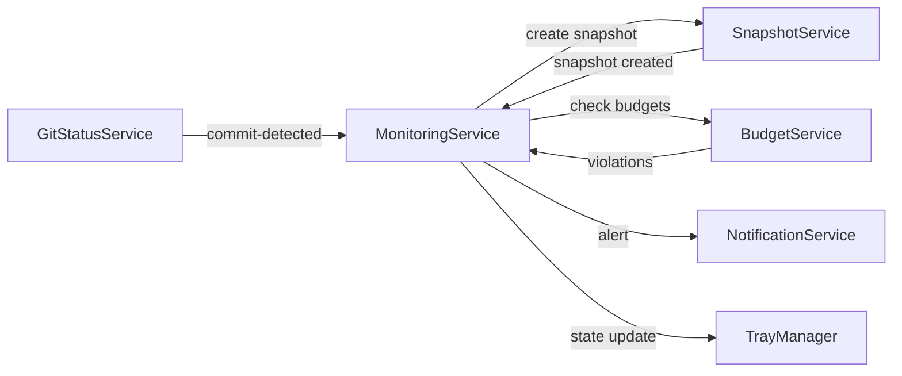

# Round Three Final Integration & Polish

## Summary

This phase completes Round Three (Phases 24-31) with comprehensive git integration testing, cross-phase validation, performance benchmarking, and final polish. It extends Phase 23 (Round Two QA) with git-aware testing scenarios, validates the monitoring orchestration, and ensures all git-based features work cohesively.

Phase 32 does NOT duplicate Phase 23 work—it focuses exclusively on git integration, cross-service orchestration, and round-three specific features.

## Prerequisites

- Phase 24 (Git Status Awareness) complete and tested
- Phase 25 (Snapshot Comparison with Git Context) complete and tested
- Phase 26 (Complexity Budget Monitoring) complete and tested
- Phase 27 (Ongoing Monitoring Mode) complete and tested
- Phase 28 (Resilient Change Detection) complete and tested
- Phase 29 (Branch-Aware Analysis) complete and tested
- Phase 30 (Merge Conflict Awareness) complete and tested
- Phase 31 (Worktree Support) complete and tested
- Phase 23 (Round Two QA) passing all tests

## Git Integration Test Matrix

### Phase 24: Git Status Awareness

| Scenario                | Steps                                   | Expected Outcome                                         | Status |
| ----------------------- | --------------------------------------- | -------------------------------------------------------- | ------ |
| Initial git status poll | Open workspace with uncommitted changes | GitStatusService detects staged/unstaged/untracked files | ☐      |
| Branch switch detection | `git checkout <branch>`                 | `branch-switched` event emitted, file states refreshed   | ☐      |
| New commit detection    | `git commit -m "test"`                  | `new-commit` event emitted, committed files reclassified | ☐      |
| Non-git repository      | Open workspace with no .git directory   | GitStatusService handles gracefully, no errors           | ☐      |
| Bare repository         | Open bare git repository                | GitStatusService detects bare repo, no errors            | ☐      |
| Corrupted .git          | .git directory missing HEAD or refs     | Error logged, service degrades gracefully                | ☐      |
| File state persistence  | Classify files → close app → reopen     | `file_git_states` table populated correctly              | ☐      |

### Phase 25: Snapshot Comparison with Git Context

| Scenario           | Steps                                          | Expected Outcome                                   | Status |
| ------------------ | ---------------------------------------------- | -------------------------------------------------- | ------ |
| Commit range query | Compare snapshots from 2 days ago to now       | All commits in range displayed with author/message | ☐      |
| Author attribution | Change file, commit, create snapshot           | File changes attributed to correct author          | ☐      |
| Empty commit range | Compare two snapshots with no commits between  | Empty state: "No commits between snapshots"        | ☐      |
| Large commit range | Compare snapshots 30 days apart (100+ commits) | Pagination works, no performance degradation       | ☐      |
| Merge commits      | Compare across a merge commit                  | Merge commit shown, both parents attributed        | ☐      |
| Detached HEAD      | Create snapshot in detached HEAD state         | Snapshot created, commit hash recorded             | ☐      |

### Phase 26: Complexity Budget Monitoring

| Scenario                   | Steps                                                   | Expected Outcome                                  | Status |
| -------------------------- | ------------------------------------------------------- | ------------------------------------------------- | ------ |
| Budget CRUD                | Create/update/delete budgets via UI                     | All operations persist correctly                  | ☐      |
| Violation detection        | Set threshold=10, file exceeds → analyze                | Violation created in `budget_violations`          | ☐      |
| Exception creation         | Add exception for violating file                        | Violation suppressed, exception expires correctly | ☐      |
| Scope filtering: global    | Budget with `scope: 'global'`                           | All files checked                                 | ☐      |
| Scope filtering: directory | Budget with `scope: 'directory'`, `value: 'src/utils'`  | Only files in `src/utils/` checked                | ☐      |
| Scope filtering: pattern   | Budget with `scope: 'pattern'`, `value: '**/*.test.ts'` | Only test files checked                           | ☐      |
| Metric targeting           | Budget targeting `maintainability`                      | Only maintainability metric evaluated             | ☐      |
| Disabled budget            | Budget with `enabled: false`                            | Budget not evaluated during checks                | ☐      |

### Phase 27: Ongoing Monitoring Mode

| Scenario                    | Steps                                               | Expected Outcome                         | Status |
| --------------------------- | --------------------------------------------------- | ---------------------------------------- | ------ |
| Monitoring start/stop       | Start monitoring → stop → restart                   | State persists, tray icon updates        | ☐      |
| Automatic snapshot creation | Monitoring enabled → commit code                    | Snapshot created automatically on commit | ☐      |
| Budget violation alert      | File exceeds budget during monitoring               | Alert generated, notification sent       | ☐      |
| Regression alert            | Metric degrades >10% vs last snapshot               | Alert generated with delta details       | ☐      |
| Tray state updates          | Start monitoring                                    | Tray icon changes to monitoring state    | ☐      |
| Quiet hours                 | Set quiet hours 22:00-08:00, trigger alert at 23:00 | Alert suppressed, shown after 08:00      | ☐      |
| Event log                   | Monitoring active for 1 hour                        | `monitoring_events` table populated      | ☐      |
| Alert dismissal             | Dismiss alert via UI                                | Alert removed from active list           | ☐      |

### Phase 28: Resilient Change Detection

| Scenario                     | Steps                                          | Expected Outcome                                  | Status |
| ---------------------------- | ---------------------------------------------- | ------------------------------------------------- | ------ |
| Hybrid change detection      | Modify 5 files → close workspace → reopen      | Only 5 files hashed, not full repository          | ☐      |
| New file detection           | Add new file → reopen workspace                | New file detected and hashed                      | ☐      |
| Deleted file detection       | Delete file → reopen workspace                 | File removed from database                        | ☐      |
| No git repository            | Open non-git workspace → modify files → reopen | Falls back to full hash comparison                | ☐      |
| Database deletion recovery   | Delete workspace.db → reopen workspace         | Recovery banner shown, full re-analysis triggered | ☐      |
| Database corruption recovery | Corrupt workspace.db → reopen workspace        | Recovery detected, full re-analysis triggered     | ☐      |
| Performance: large repo      | 10,000 file repo, modify 50 files, reopen      | Reopen time <5 seconds (vs 30+ for full hash)     | ☐      |

### Phase 29: Branch-Aware Analysis

| Scenario                  | Steps                                                           | Expected Outcome                                 | Status |
| ------------------------- | --------------------------------------------------------------- | ------------------------------------------------ | ------ |
| Branch-tagged snapshots   | Create snapshot on `main`, switch to `feature`, create snapshot | Two snapshots with `branch` column set correctly | ☐      |
| Branch switch re-analysis | Switch from `main` to `feature` with 10 changed files           | Only 10 changed files re-analyzed                | ☐      |
| Cross-branch comparison   | Compare `main` vs `feature` branch snapshots                    | Per-file metric deltas displayed                 | ☐      |
| Branch divergence         | Compare branches with 50+ file differences                      | All file changes shown, no duplicates            | ☐      |
| Branch deletion           | Create snapshot on branch, delete branch                        | Snapshot retained, branch name preserved         | ☐      |
| Detached HEAD             | Switch to detached HEAD, create snapshot                        | Snapshot created with commit hash                | ☐      |
| Branch list               | Open BranchComparison page                                      | All branches with snapshots listed               | ☐      |

### Phase 30: Merge Conflict Awareness

| Scenario                        | Steps                                     | Expected Outcome                                 | Status |
| ------------------------------- | ----------------------------------------- | ------------------------------------------------ | ------ |
| Conflict detection              | `git merge` creates conflicts             | Conflicted files classified correctly            | ☐      |
| Conflict skip during analysis   | Trigger analysis with conflicted files    | Conflicted files skipped, logged                 | ☐      |
| Conflict resolution re-analysis | Resolve conflicts → `git add`             | Files re-enqueued for analysis                   | ☐      |
| Conflict banner                 | Conflicted state active                   | Alert banner shown in UI                         | ☐      |
| Conflict badge                  | File list with conflicted files           | Badge displayed next to conflicted files         | ☐      |
| Rebase in progress              | `git rebase` interrupted by conflict      | `GitRepositoryStateService` detects rebase state | ☐      |
| Cherry-pick in progress         | `git cherry-pick` interrupted             | Cherry-pick state detected, banner shown         | ☐      |
| Bisect in progress              | `git bisect start`                        | Bisect state detected, analysis paused           | ☐      |
| Transient state resolution      | Complete rebase → `git rebase --continue` | State cleared, normal analysis resumes           | ☐      |

### Phase 31: Worktree Support

| Scenario                        | Steps                                   | Expected Outcome                             | Status |
| ------------------------------- | --------------------------------------- | -------------------------------------------- | ------ |
| Worktree detection              | Open worktree directory (not main repo) | WorktreeDetectionService detects worktree    | ☐      |
| Main repository path resolution | Open worktree                           | Main repository path resolved correctly      | ☐      |
| Sibling worktree listing        | Open worktree, query sibling worktrees  | All worktrees listed with branch info        | ☐      |
| Per-worktree workspace          | Open 3 worktrees of same repo           | Each gets independent workspace entry and DB | ☐      |
| Worktree badge                  | Workspace list with worktrees           | Badge or indicator shows worktree status     | ☐      |
| Worktree branch tracking        | Each worktree on different branch       | Branch context correct for each workspace    | ☐      |
| Worktree deletion               | Delete worktree directory               | Workspace entry retained (for history)       | ☐      |

## Cross-Service Integration Tests

### MonitoringService Orchestration

| Scenario                          | Expected Interaction                                                                                              | Status |
| --------------------------------- | ----------------------------------------------------------------------------------------------------------------- | ------ |
| Analysis complete → Budget check  | AnalysisCoordinator emits `analysis-complete` → MonitoringService calls BudgetService.checkCompliance()           | ☐      |
| Budget violation → Alert          | BudgetService detects violation → MonitoringService creates alert → NotificationService sends notification        | ☐      |
| Commit detected → Snapshot        | GitStatusService emits `new-commit` → MonitoringService creates snapshot via SnapshotService                      | ☐      |
| Branch switch → Re-analysis       | GitStatusService emits `branch-switched` → BranchDiffService detects changed files → AnalysisCoordinator enqueues | ☐      |
| Conflict detected → Analysis skip | GitStatusService classifies files as conflicted → AnalysisCoordinator skips conflicted files                      | ☐      |
| Monitoring start → Tray update    | MonitoringService.start() → TrayManager.updateState('monitoring')                                                 | ☐      |

### Event Flow Validation

Validate that events flow correctly through the system:

| Event Chain            | Steps                                                                           | Expected Outcome                    | Status |
| ---------------------- | ------------------------------------------------------------------------------- | ----------------------------------- | ------ |
| Full monitoring cycle  | Make change → commit → automatic snapshot → budget check → alert (if violation) | All events emitted in sequence      | ☐      |
| Recovery after restart | MonitoringService running → close app → reopen                                  | Monitoring resumes from saved state | ☐      |
| Error propagation      | BudgetService throws error during check                                         | Error logged, monitoring continues  | ☐      |

## Performance Benchmarks

### Git Operations

| Operation                       | Target                      | Measurement | Status |
| ------------------------------- | --------------------------- | ----------- | ------ |
| `git status --porcelain=v2`     | <500ms (1000 files)         |             | ☐      |
| `git diff --name-only HEAD`     | <200ms (1000 files)         |             | ☐      |
| `git log` commit range query    | <1s (100 commits)           |             | ☐      |
| Branch-tagged snapshot creation | <2s (including git context) |             | ☐      |
| Git status polling interval     | 5s (configurable)           |             | ☐      |

### Database Operations

| Operation                     | Target                              | Measurement | Status |
| ----------------------------- | ----------------------------------- | ----------- | ------ |
| Budget compliance check       | <1s (<1000 files)                   |             | ☐      |
| Cross-branch comparison query | <2s (two snapshots, 500 files each) |             | ☐      |
| Snapshot with git context     | <3s (including commit range query)  |             | ☐      |
| File git states bulk insert   | <500ms (1000 files)                 |             | ☐      |
| Monitoring dashboard query    | <1s (aggregate stats)               |             | ☐      |

### Hybrid Change Detection

| Scenario                 | Baseline (Full Hash) | Hybrid (git diff + selective hash) | Improvement | Status |
| ------------------------ | -------------------- | ---------------------------------- | ----------- | ------ |
| 1000 files, 10 changed   | ~8s                  | ~1s                                | 8x faster   | ☐      |
| 5000 files, 50 changed   | ~40s                 | ~3s                                | 13x faster  | ☐      |
| 10000 files, 100 changed | ~90s                 | ~6s                                | 15x faster  | ☐      |

## UI/UX Validation

### New Pages

| Page                   | Component Usage                              | Responsive | Dark Mode | Empty States | Loading States | Error States | Status |
| ---------------------- | -------------------------------------------- | ---------- | --------- | ------------ | -------------- | ------------ | ------ |
| SnapshotComparison.tsx | DatePicker, StatCard, CardTable, Tabs        | ☐          | ☐         | ☐            | ☐              | ☐            | ☐      |
| Budgets.tsx            | CardTable, Modal, LineChart, Input, Dropdown | ☐          | ☐         | ☐            | ☐              | ☐            | ☐      |
| Monitoring.tsx         | StatCard, Alert, ActivityFeed, LineChart     | ☐          | ☐         | ☐            | ☐              | ☐            | ☐      |
| BranchComparison.tsx   | Dropdown, StatCard, CardTable, Badge         | ☐          | ☐         | ☐            | ☐              | ☐            | ☐      |

### Existing Pages Extended

| Page          | New Features                         | Status |
| ------------- | ------------------------------------ | ------ |
| Workspace.tsx | Git status badges on file list       | ☐      |
| Workspace.tsx | Conflict banners during merge/rebase | ☐      |
| Workspace.tsx | Worktree indicator badge             | ☐      |
| Workspace.tsx | Branch-aware snapshot creation       | ☐      |

### Tray Integration

| Scenario                     | Expected Tray State                   | Status |
| ---------------------------- | ------------------------------------- | ------ |
| Monitoring inactive          | Idle icon                             | ☐      |
| Monitoring active, no alerts | Monitoring icon (green)               | ☐      |
| Monitoring active, warnings  | Monitoring icon (yellow)              | ☐      |
| Monitoring active, errors    | Monitoring icon (red)                 | ☐      |
| Click tray icon              | Context menu with monitoring controls | ☐      |

## Cross-Platform Testing

Test all git integration features on:

| Feature                    | macOS | Windows | Linux | Notes                             |
| -------------------------- | ----- | ------- | ----- | --------------------------------- |
| Git status polling         | ☐     | ☐       | ☐     | Path separators, case sensitivity |
| Branch switch detection    | ☐     | ☐       | ☐     | Windows: CRLF vs LF               |
| Commit detection           | ☐     | ☐       | ☐     |                                   |
| Worktree detection         | ☐     | ☐       | ☐     | Symlink handling on Windows       |
| Merge conflict handling    | ☐     | ☐       | ☐     |                                   |
| Repository state detection | ☐     | ☐       | ☐     | .git/ sentinel files              |
| Hybrid change detection    | ☐     | ☐       | ☐     | Git executable path resolution    |

## Database Migration Validation

| Migration       | Version | Validation                                                                 | Status |
| --------------- | ------- | -------------------------------------------------------------------------- | ------ |
| v5              | 5       | `file_git_states`, `monitoring_alerts`, `monitoring_events` tables created | ☐      |
| v5              | 5       | Indexes on `file_git_states.file_path`, `monitoring_alerts.created_at`     | ☐      |
| v6              | 6       | `budgets`, `budget_exceptions`, `budget_violations` tables created         | ☐      |
| v6              | 6       | Foreign key constraints: `budget_id` references `budgets(id)`              | ☐      |
| v6              | 6       | Cascade deletes: delete budget → delete exceptions/violations              | ☐      |
| v7              | 7       | `snapshots.branch` column added                                            | ☐      |
| v7              | 7       | `idx_snapshots_branch` index created                                       | ☐      |
| Rollback safety | v7→v4   | Graceful degradation (no data loss, features disabled)                     | ☐      |

## Accessibility (WCAG 2.1 AA)

Extend Phase 23 accessibility checklist with round-three specific pages:

| Criterion                | SnapshotComparison | Budgets | Monitoring | BranchComparison | Status |
| ------------------------ | ------------------ | ------- | ---------- | ---------------- | ------ |
| Keyboard navigation      | ☐                  | ☐       | ☐          | ☐                | ☐      |
| Screen reader labels     | ☐                  | ☐       | ☐          | ☐                | ☐      |
| Color contrast (4.5:1)   | ☐                  | ☐       | ☐          | ☐                | ☐      |
| Focus indicators         | ☐                  | ☐       | ☐          | ☐                | ☐      |
| ARIA attributes          | ☐                  | ☐       | ☐          | ☐                | ☐      |
| Form validation messages | N/A                | ☐       | ☐          | N/A              | ☐      |

## Bug Tracking

| Priority | Component | Description | Severity | Status | Assignee |
| -------- | --------- | ----------- | -------- | ------ | -------- |
| P0       |           |             |          |        |          |
| P1       |           |             |          |        |          |
| P2       |           |             |          |        |          |
| P3       |           |             |          |        |          |

**Priority Levels:**

- P0: Blocks release (crashes, data loss, security)
- P1: Major functionality broken (feature unusable)
- P2: Minor functionality issues (degraded UX)
- P3: Polish/cosmetic (typos, minor layout issues)

## Polish Tasks

### Git Integration UI

- [ ] Git status badges styled consistently with existing badges
- [ ] Conflict/rebase banners use Alert component with appropriate severity
- [ ] Branch dropdowns use Dropdown component with search
- [ ] Worktree indicators subtle, not distracting
- [ ] Commit range display in SnapshotComparison page readable, condensed for long ranges

### Monitoring Dashboard

- [ ] Alert severity colors consistent (success/warning/error)
- [ ] ActivityFeed timeline with relative timestamps
- [ ] StatCard grid layout responsive on small screens
- [ ] Empty state when no alerts: friendly, actionable

### Budget Management

- [ ] Modal forms validation with inline error messages
- [ ] Scope selector (global/directory/pattern/file) clear and unambiguous
- [ ] Metric selector shows units and descriptions
- [ ] Budget list CardTable with status badges (compliant/violated)
- [ ] Exception expiry dates formatted consistently

### Copy & Microcopy

| Location                 | Current              | Improved                                                                   | Status |
| ------------------------ | -------------------- | -------------------------------------------------------------------------- | ------ |
| Git status polling error | "Git error"          | "Unable to detect git status. Is this a git repository?"                   | ☐      |
| No commits in range      | "No commits"         | "No commits between these snapshots"                                       | ☐      |
| Budget violation alert   | "Threshold exceeded" | "File exceeds complexity budget: {metric} is {value} (limit: {threshold})" | ☐      |
| Conflict banner          | "Conflicts detected" | "Merge conflicts detected. Resolve conflicts to continue analysis."        | ☐      |
| Monitoring paused        | "Paused"             | "Monitoring paused. Resume to track code quality changes."                 | ☐      |

### Animations & Transitions

- [ ] Alert banners slide in from top (300ms ease-out)
- [ ] Budget violation badges pulse once on creation
- [ ] Monitoring state transitions smooth (tray icon)
- [ ] Branch dropdown expand/collapse animated
- [ ] Modal open/close transitions

## Documentation

### User-Facing

- [ ] README.md: Git integration features section
- [ ] CHANGELOG.md: Round Three release notes
- [ ] User guide: Snapshot comparison with git context
- [ ] User guide: Complexity budgets setup
- [ ] User guide: Ongoing monitoring configuration
- [ ] User guide: Branch-aware analysis
- [ ] User guide: Worktree support
- [ ] FAQ: "Why are conflicted files skipped?"
- [ ] FAQ: "How does hybrid change detection work?"

### Developer-Facing

- [ ] Architecture docs: Git integration layer
- [ ] Architecture docs: MonitoringService orchestration
- [ ] Architecture docs: Database migrations (v5, v6, v7)
- [ ] API docs: GitStatusService events
- [ ] API docs: BudgetService interface
- [ ] API docs: MonitoringService interface
- [ ] Testing guide: Git integration test patterns
- [ ] Testing guide: Event-driven service testing

## Release Criteria

All criteria must be met before Round Three release:

### Functional

- [ ] All Phase 24-31 features implemented and tested
- [ ] All git integration test scenarios passing (see matrix above)
- [ ] All cross-service integration tests passing
- [ ] All performance benchmarks met
- [ ] Database migrations v5, v6, v7 applied successfully
- [ ] No P0 or P1 bugs outstanding
- [ ] All new pages responsive and accessible

### Quality

- [ ] TypeScript: 0 errors (strict mode)
- [ ] ESLint: 0 errors, <5 warnings
- [ ] Unit test coverage: >80% for new code
- [ ] Integration test coverage: All critical paths
- [ ] No console errors in production build
- [ ] No memory leaks (heap profiling)

### Polish

- [ ] All UI components use @vipr/ui (no custom variants)
- [ ] Dark mode fully supported
- [ ] Loading states on all async operations
- [ ] Error states with actionable guidance
- [ ] Empty states with next action prompts
- [ ] All copy reviewed and approved

### Documentation

- [ ] All user-facing docs complete
- [ ] All developer-facing docs complete
- [ ] CHANGELOG.md updated
- [ ] Migration guide for Phase 23 → Phase 32

### Cross-Platform

- [ ] macOS: All features tested and working
- [ ] Windows: All features tested and working
- [ ] Linux: All features tested and working
- [ ] Platform-specific issues documented

## Post-Release Monitoring

After Round Three release, monitor:

| Metric                    | Target            | Measurement Interval |
| ------------------------- | ----------------- | -------------------- |
| Crash rate                | <0.1%             | Daily                |
| Git operation failures    | <1%               | Daily                |
| Monitoring service uptime | >99%              | Hourly               |
| Budget check performance  | <1s avg           | Hourly               |
| User-reported bugs        | Triage within 24h | Daily                |

## Handoff Notes

Round Three completes all git-aware monitoring features. Future work:

- **Round Four (Future)**: Advanced visualizations, AI-powered insights
- **Phase 33+ (Future)**: Team collaboration features (shared budgets, multi-user monitoring)

Ensure Phase 32 QA is thorough—this is the foundation for future collaborative features.

## Sign-Off

- [ ] Technical Lead: All functional requirements met
- [ ] QA Lead: All test scenarios passing, no blockers
- [ ] UX Lead: All pages polished, accessible, responsive
- [ ] Product Lead: Release criteria met, ready to ship
