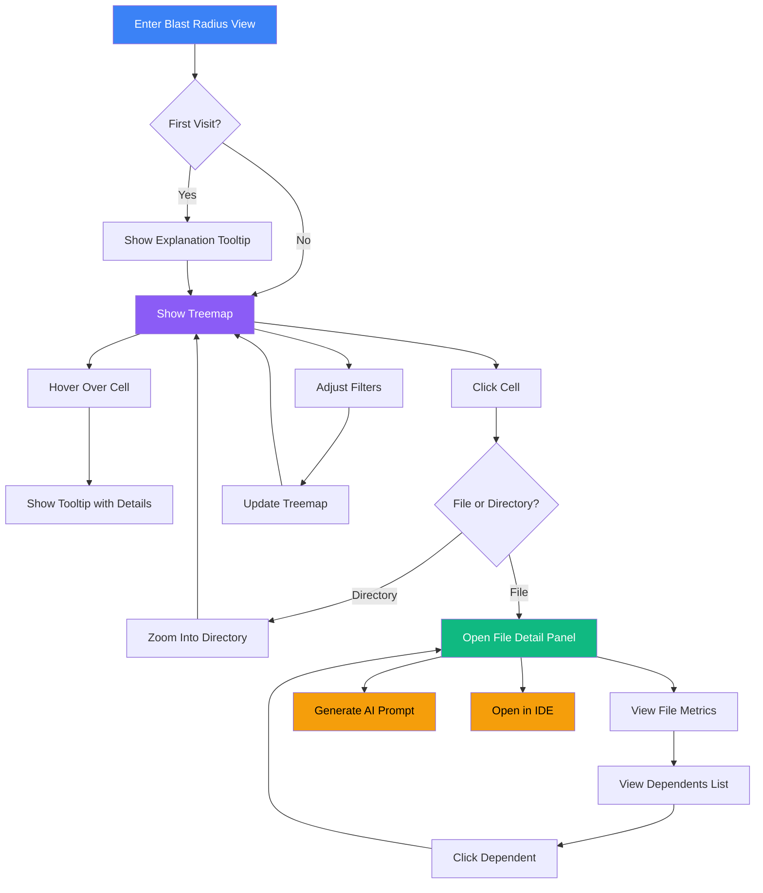

# Blast Radius Hotspot View

## User Story

**As a developer inheriting an unfamiliar codebase**, I want to identify which files have the highest "blast radius" (most downstream dependencies combined with the greatest combination of abnormal metric values), so that I can prioritize which areas require the most careful refactoring.

## User Need

Developers waste significant time refactoring low-impact code. A file might be complex, but if nothing depends on it, changes carry minimal risk. Conversely, a moderately complex file with 50 downstream dependents creates enormous risk with every change.

The blast radius metric combines multiple dimensions that matter:

1. **How complex is this code?** (structural complexity, hooks complexity, temporal complexity, coupling)
2. **How risky is this code?** (security vulnerabilities, reliability issues, anti-patterns, poor null safety)
3. **How hard is this code to maintain?** (maintainability index incorporating React-specific factors, technical debt score)
4. **How far do changes propagate?** (more things break if you get it wrong)

Without this view, developers either:

- Fix everything (inefficient, often unnecessary)
- Fix nothing (risk accumulates silently)
- Guess which files matter most (often wrong)

---

## UX Flow

### Entry Points

1. **Primary:** Dashboard card "High Impact Files" with count badge
2. **Secondary:** Navigation sidebar "Blast Radius" under Analysis section
3. **Contextual:** File detail page shows blast radius score with link to full view
4. **Search:** Global search result type "blast radius hotspots"

### User Journey



### Exit Points

1. **To File Detail:** Click any cell to dive into specific file
2. **To AI Prompt:** Generate refactoring prompt from any hotspot
3. **To IDE:** Open file directly in preferred editor
4. **To Dependency View:** Explore full dependency cascade for selected file
5. **To Dashboard:** Breadcrumb navigation back to overview

---

## Information Architecture

### Data Displayed

**Level 1: Overview (Default View)**

- Treemap of entire repository
- Cell size = file size in lines of code
- Cell color = blast radius score (0-100)
- Directory hierarchy visible through nesting

**Level 2: Cell Hover**

- File name and path
- Blast radius score (composite of multiple risk dimensions)
- Direct dependents count
- Transitive dependents count
- Top risk factors:
  - Structural complexity (cyclomatic, maintainability index)
  - React-specific risks (hook complexity, temporal complexity, unstable references)
  - Security vulnerabilities (by category and severity)
  - Reliability score (crash risk, error boundary coverage, null safety)
  - Anti-pattern count (by category)
- Last modified date

**Level 3: Cell Click (Split Panel)**

- Full file metrics panel
- Sorted list of dependents
- Complexity trend sparkline
- Recent git activity

### Progressive Disclosure Strategy

| Visible By Default | Revealed on Hover | Revealed on Click   |
| ------------------ | ----------------- | ------------------- |
| File name          | Full path         | Complete metrics    |
| Color intensity    | Exact score       | Score breakdown     |
| Relative size      | Actual LOC        | Historical trend    |
| Directory grouping | Dependent count   | Full dependent list |

### Hierarchy and Navigation

This view operates at **Levels 2-4** of the zoom model:

- **Level 2 (Repository):** Full treemap, directories as nested containers
- **Level 3 (Directory):** Zoom into single directory, files as leaves
- **Level 4 (File):** Split panel with file detail, treemap as context

Users can zoom in/out using:

- Click to drill down
- Breadcrumb to jump up
- Escape key to zoom out one level
- Double-click to zoom directly to file

---

## Interaction Patterns

### Primary Actions

| Action              | Trigger              | Result                                      |
| ------------------- | -------------------- | ------------------------------------------- |
| Inspect hotspot     | Click cell           | Open file detail panel                      |
| Zoom into directory | Click directory cell | Re-render treemap for directory             |
| Filter by threshold | Adjust slider        | Hide low-impact files                       |
| Change color metric | Toggle button        | Switch between complexity/coupling/combined |

### Secondary Actions

| Action              | Trigger        | Result                          |
| ------------------- | -------------- | ------------------------------- |
| Export hotspot list | Toolbar button | Download CSV of top hotspots    |
| Share view link     | Toolbar button | Copy deep link to current view  |
| Toggle labels       | Toolbar button | Show/hide file names on cells   |
| Adjust density      | Toolbar button | Compact/comfortable view toggle |

### Micro-interactions

**Hover Effects:**

- Cell border highlights (2px blue)
- Related cells dim slightly (show isolation)
- Tooltip appears after 200ms delay

**Click Effects:**

- Selected cell scales up 2%
- Panel slides in from right (300ms ease-out)
- Breadcrumb updates immediately

**Zoom Transitions:**

- Cells morph smoothly to new positions (400ms)
- Fade-out for removed cells
- Fade-in for revealed cells

---

## Visual Concepts

### Treemap Layout

```
+------------------------------------------------------------------+
|  src/                                                             |
|  +------------------------+  +----------------------------------+ |
|  | components/            |  | utils/                           | |
|  | +-------+ +----------+ |  | +----------+ +------+ +--------+ | |
|  | |Button | |DataTable | |  | |formatter | |dates | |helpers | | |
|  | | (LOW) | | (HIGH)   | |  | | (MED)    | |(LOW) | |(HIGH)  | | |
|  | +-------+ +----------+ |  | +----------+ +------+ +--------+ | |
|  | +-------------------+  |  +----------------------------------+ |
|  | | UserProfile       |  |                                      |
|  | | (CRITICAL)        |  |  +----------------------------------+ |
|  | +-------------------+  |  | services/                        | |
|  +------------------------+  | +-------------+ +--------------+ | |
|                              | | api/        | | auth/        | | |
+------------------------------+ | (HIGH)      | | (CRITICAL)   | | |
                               | +-------------+ +--------------+ | |
                               +----------------------------------+ |
+------------------------------------------------------------------+

Color Scale:
LOW      = Green  (#22c55e)  Score 0-25
MEDIUM   = Yellow (#eab308)  Score 26-50
HIGH     = Orange (#f97316)  Score 51-75
CRITICAL = Red    (#ef4444)  Score 76-100
```

### Split Panel Layout (File Selected)

```
+------------------------------------------------------------------+
|                                    |                              |
|  [Treemap with DataTable         |  DataTable.tsx                |
|   highlighted]                    |  ================================
|                                   |                              |
|                                   |  Blast Radius Score: 78      |
|                                   |  [========--------] High     |
|                                   |                              |
|                                   |  Complexity: 42              |
|                                   |  Direct Dependents: 12       |
|                                   |  Transitive Dependents: 47   |
|                                   |  Lines of Code: 423          |
|                                   |                              |
|                                   |  Trend [sparkline graph]     |
|                                   |                              |
|                                   |  -- Dependents (12) ---------+
|                                   |  UserList.tsx                |
|                                   |  AdminPanel.tsx              |
|-----------------------------------|  Dashboard.tsx               |
|  src > components > DataTable.tsx |  ...8 more                   |
------------------------------------|                              |
                                    |  [Generate AI Prompt]        |
                                    |  [Open in IDE].              |
                                    +------------------------------+
```

---

## Complexity Analysis Methodology

### Core Metrics Combined

The blast radius score combines MULTIPLE fundamental dimensions of code risk, drawing from Vipr's comprehensive metric set:

**1. Structural Complexity (Core Plugin Metrics)**

- Cyclomatic complexity (independent execution paths)
- Halstead metrics (volume, difficulty, effort, estimated bugs)
- Maintainability index (Microsoft's formula)
- Cognitive complexity (mental effort to understand)
- Lines of code (scope of change)
- Function count (number of discrete units)

**2. React-Specific Complexity (React Plugin Metrics)**

- **Hook Complexity**: Total hooks, temporal complexity weight (useEffect risk)
- **Temporal Complexity**: Effects analysis (dependency count, cleanup, risk level, mount-only vs every-render)
- **Coupling Complexity**: Props count, context consumers, callback props, prop drilling depth
- **Identity Complexity**: useCallback/useMemo counts, unstable references (inline functions)
- **Dataflow Complexity**: State update paths, transform chains, shared mutable state, derived state

**3. Risk & Quality Factors (React Plugin Metrics)**

- **Anti-patterns**: Categorized by type (hooks, performance, state-management, lifecycle, JSX, props, security, testing, accessibility) and severity
- **Security**: XSS vulnerabilities, injection risks, sensitive data exposure, authentication issues, input validation gaps
- **Reliability**: Crash risk score, error boundary score, null safety score, async error handling, memory leak risk
- **Performance**: Unnecessary render risk, expensive operations, missing memoization, bundle impact, tree-shaking score
- **Technical Debt**: Code health grade, technical debt score, maintenance burden, debt interest rate
- **Accessibility**: WCAG violations by level (A/AA/AAA), keyboard navigation score, screen reader compatibility

**4. Technology-Specific Factors (Next.js Plugin Metrics when applicable)**

- Server Component vs Client Component patterns
- Route optimization issues
- Data fetching anti-patterns

**5. Dependency Impact (How far do changes propagate?)**

- Direct dependents (immediate imports)
- Transitive dependents (downstream cascade)
- Import coupling strength (how tightly bound)
- Shared type dependencies (contract coupling)

**Enhanced Blast Radius Formula:**

```
BlastRadius = (
  StructuralScore × 0.20 +
  ReactComplexityScore × 0.20 +
  SecurityRiskScore × 0.20 +
  ReliabilityRiskScore × 0.15 +
  AntiPatternScore × 0.15 +
  TechnicalDebtScore × 0.10
) × DependencyFactor

Where:
  StructuralScore = Weighted combination of cyclomatic, Halstead, maintainability index
  ReactComplexityScore = Hook + Temporal + Coupling + Identity + Dataflow complexity
  SecurityRiskScore = Weighted severity of security vulnerabilities
  ReliabilityRiskScore = Inverse of reliability score (crash risk, null safety, etc.)
  AntiPatternScore = Count and severity of detected anti-patterns
  TechnicalDebtScore = Technical debt principal + interest
  DependencyFactor = DirectDependents + (TransitiveDependents × 0.3)
```

This multiplicative relationship captures the key insight: a file with complexity 50 and 2 dependents (score: 100) is less risky than a file with complexity 10 and 50 dependents (score: 500).

### Meaningful Thresholds

| Blast Radius Score | Risk Level | Interpretation          | Action Required                                |
| ------------------ | ---------- | ----------------------- | ---------------------------------------------- |
| 0-25               | Low        | Isolated or simple code | Monitor only                                   |
| 26-50              | Moderate   | Some impact, manageable | Include in reviews                             |
| 51-75              | High       | Significant risk        | Priority for refactoring                       |
| 76-100             | Critical   | Changes are dangerous   | Immediate attention, pair programming required |

**Threshold Calibration:**
These thresholds are percentile-based on typical codebases:

- Low (0-25): Bottom 50% of files
- Moderate (26-50): 50th-75th percentile
- High (51-75): 75th-90th percentile
- Critical (76-100): Top 10% of risky files

### Pattern Recognition

**Hotspot Patterns That Indicate Problems:**

1. **Hub Files** - High dependents, moderate complexity
   - Pattern: 20+ direct dependents, complexity 30-50
   - Problem: Changes ripple unpredictably
   - Example: Shared utility file imported everywhere

2. **God Modules** - High complexity, high dependents
   - Pattern: Complexity >60, dependents >15
   - Problem: Doing too much, breaking changes common
   - Example: Main application controller or service

3. **Legacy Anchors** - Moderate everything, but old
   - Pattern: Complexity 40-60, dependents 10-20, last changed >6 months ago
   - Problem: Fear of touching creates stagnation
   - Example: Authentication module "that works, don't touch"

4. **Coupling Bombs** - Low complexity, extremely high dependents
   - Pattern: Complexity < 20, dependents >50
   - Problem: Breaking change affects everything
   - Example: Shared type definitions file

## Detection Algorithms

### Hotspot Identification Process

**Step 1: Calculate File Complexity**

```
FOR each file:
  Calculate cyclomatic complexity from AST
  Calculate cognitive complexity (nesting penalties)
  Measure lines of code
  Count functions/methods
  Normalize to 0-100 scale
```

**Step 2: Build Dependency Graph**

```
FOR each file:
  Parse imports to find direct dependencies
  Traverse graph to find transitive dependencies
  Calculate coupling strength (number of symbols imported)
  Identify circular dependencies (separate alert)
```

**Step 3: Compute Blast Radius**

```
FOR each file:
  BlastRadius = ComplexityScore × (DirectDeps + TransitiveDeps × 0.3)
  Normalize to 0-100 scale
  Assign risk level based on thresholds
```

**Step 4: Cluster and Rank**

```
GROUP files by directory
FOR each directory:
  Identify worst offenders (top 10%)
  Calculate aggregate directory risk
  Flag for prioritization
```

### Alert Triggers

| Condition                            | Alert Type | Notification                           |
| ------------------------------------ | ---------- | -------------------------------------- |
| New file enters Critical zone (76+)  | Immediate  | Desktop notification + dashboard badge |
| File moves from High to Critical     | Warning    | Dashboard badge, daily digest          |
| Directory average exceeds High (51+) | Info       | Weekly summary                         |
| Hotspot unchanged for 90+ days       | Reminder   | Monthly tech debt review               |

### Score Calculation Details

**Complexity Normalization:**

- Cyclomatic complexity is divided by repository maximum, scaled to 0-50
- Cognitive complexity is divided by repository maximum, scaled to 0-30
- LOC is divided by 1000 (capping at 1000), scaled to 0-20
- These are summed for a 0-100 complexity score

**Dependency Weighting:**

- Direct dependents count fully (each = +1 to factor)
- Transitive dependents count 30% (each = +0.3 to factor)
- Why 30%? Direct breaks are immediate; transitive breaks are one step removed and often caught by intermediate layers

## Interpretation Guidance

### Understanding Your Blast Radius Score

**Score of 0-25 (Low Risk - Green):**

- What it means: This code can be changed with minimal risk
- Why: Either it's simple (low complexity) or isolated (few dependents)
- Action: Normal development pace, standard code review
- Example: Utility function with complexity 8, used in 2 places = score 16

**Score of 26-50 (Moderate Risk - Yellow):**

- What it means: Changes require care but are manageable
- Why: Moderate complexity or moderate dependency impact
- Action: Thorough testing, consider impact on dependents
- Example: Component with complexity 20, used in 8 places = score 40

**Score of 51-75 (High Risk - Orange):**

- What it means: Changes are dangerous without careful planning
- Why: High complexity combined with meaningful dependencies
- Action: Design review before changes, comprehensive test coverage
- Example: Service with complexity 35, used in 15 places (5 transitive) = score 58

**Score of 76-100 (Critical Risk - Red):**

- What it means: This is a critical piece of infrastructure requiring extreme care
- Why: Very high complexity AND many dependents creates perfect storm
- Action: Pair programming, feature flags, incremental refactoring only
- Example: API client with complexity 50, used in 30 places (20 transitive) = score 95

### Good vs. Bad Values in Context

**Context Matters:**

1. **Infrastructure Files** (routers, core services)
   - Expected: Scores 40-60 are normal
   - Concerning: Scores >70 indicate over-complexity
   - Strategy: Accept higher scores but invest in tests

2. **UI Components**
   - Expected: Scores 10-30 are ideal
   - Concerning: Scores >40 suggest god components
   - Strategy: Extract subcomponents, use composition

3. **Utilities**
   - Expected: Scores 5-20 are healthy
   - Concerning: Scores >30 mean utilities are doing too much
   - Strategy: Split by concern, reduce responsibilities

4. **Business Logic**
   - Expected: Scores 30-50 are reasonable
   - Concerning: Scores >60 indicate tangled logic
   - Strategy: Extract pure functions, separate concerns

## Example Scenarios

### Scenario 1: The Isolated Monster

**File:** `src/algorithms/pathfinding.ts`

- Cyclomatic Complexity: 45
- Cognitive Complexity: 38
- Lines of Code: 520
- Direct Dependents: 1
- Transitive Dependents: 0

**Blast Radius Score:** 22 (Low Risk - Green)

**Analysis:** This file implements a complex A\* pathfinding algorithm. While internally complex, it's only used by one game engine component. Changes here have minimal ripple effects.

**Interpretation:** High complexity is acceptable because:

1. Algorithm is inherently complex (essential complexity)
2. Well-isolated behind a clean interface
3. Changes rarely needed (stable problem domain)

**Recommended Action:** Ensure excellent test coverage, but don't prioritize refactoring.

---

### Scenario 2: The Hub

**File:** `src/utils/formatting.ts`

- Cyclomatic Complexity: 12
- Cognitive Complexity: 8
- Lines of Code: 180
- Direct Dependents: 45
- Transitive Dependents: 120

**Blast Radius Score:** 87 (Critical - Red)

**Analysis:** Simple utility functions for formatting dates, currency, and text. Each function is trivial, but the file is imported everywhere.

**Interpretation:** Low complexity but critical blast radius because:

1. Breaking changes affect 45 files immediately
2. 120 more files affected transitively
3. Single file creates coupling across entire app

**Recommended Action:**

- Split into separate files by concern (dates.ts, currency.ts, text.ts)
- Reduce coupling by letting components import only what they need
- Expected new scores: 3 files with scores 15-25 each

---

### Scenario 3: The God Component

**File:** `src/components/Dashboard.tsx`

- Cyclomatic Complexity: 68
- Cognitive Complexity: 72
- Lines of Code: 847
- Direct Dependents: 12
- Transitive Dependents: 35

**Blast Radius Score:** 94 (Critical - Red)

**Analysis:** Main dashboard component handles authentication, data fetching, rendering, analytics tracking, and error handling. Used by multiple page layouts.

**Interpretation:** High on both dimensions - the worst combination:

1. Complex internally (hard to modify safely)
2. Widely used (changes break many things)
3. Multiple concerns (no single clear purpose)

**Recommended Action:**

- Extract hooks: `useAuth()`, `useDashboardData()`, `useAnalytics()`
- Extract presentation: `DashboardLayout`, `DashboardWidgets`
- Expected result: 5 files with scores 15-30 each, easier to test and modify

---

### Scenario 4: The Stable Infrastructure

**File:** `src/api/client.ts`

- Cyclomatic Complexity: 38
- Cognitive Complexity: 32
- Lines of Code: 450
- Direct Dependents: 28
- Transitive Dependents: 89

**Blast Radius Score:** 78 (Critical - Red)

**Analysis:** Core API client with request/response handling, authentication, retry logic, error handling. Foundation of all API interactions.

**Interpretation:** High blast radius is expected for infrastructure:

1. Central piece of architecture
2. Complexity reflects real-world API needs
3. Changes are infrequent but high-impact

**Recommended Action:**

- Accept the high score as architectural reality
- Invest heavily in integration tests
- Use feature flags for any changes
- Consider gradual migration if redesign is needed
- Document thoroughly - this is critical infrastructure

---

## Psychological Principles

### Opportunity Framing

The view emphasizes "high impact potential" rather than "problematic files." Colors progress from green (stable, low risk) through warm colors to red (high impact, prioritize attention). This frames hotspots as opportunities to create leverage, not as failures.

### Gestalt Principles

- **Proximity:** Files in same directory cluster together
- **Similarity:** Similar blast radius scores share color
- **Enclosure:** Directory boundaries create clear groupings
- **Figure-Ground:** Selected file stands out from treemap background

### Cognitive Load Management

- Maximum 7 colors in scale (matches working memory limits)
- Labels hidden at small sizes (reduce visual noise)
- Details hidden until requested (progressive disclosure)
- Consistent position for controls (predictable interface)

---

## Success Metrics

| Metric                       | Target       | Measurement                                           |
| ---------------------------- | ------------ | ----------------------------------------------------- |
| Time to identify top hotspot | < 10 seconds | From view load to first hover on critical file        |
| Hotspot investigation rate   | > 50%        | Users who click into at least one hotspot             |
| Action completion            | > 30%        | Users who generate prompt or open IDE from hotspot    |
| Return to view               | > 40%        | Users who return to blast radius view in same session |

---

## Integration with Broader Application

### Feature Dependencies

**Requires:**

- Five-Level Zoom Navigation (US-NEW-05) - Zoom controls and breadcrumb
- Adaptive Visualizations (US-NEW-17) - Treemap rendering at scale

**Enables:**

- Dependency Cascade Analysis (US-NEW-07) - "View full cascade" from hotspot
- AI Prompt Generation (US-NEW-19) - Context-aware prompts for hotspots
- Complexity Budget (US-NEW-16) - Hotspots inform budget allocation

### Data Sources

- Dependency graph from `@vipr/engine` analysis
- Cyclomatic complexity from `@vipr/core` plugin
- Git history for change frequency
- File metadata from SQLite database

### Shared Components

| Component   | Source       | Customization            |
| ----------- | ------------ | ------------------------ |
| Treemap     | D3.js custom | Blast radius color scale |
| Split Panel | Styleguide   | Right-side panel variant |
| Breadcrumb  | Styleguide   | Zoom-aware navigation    |
| Tooltip     | Styleguide   | Metrics-specific content |

---

## Open Questions

1. **Threshold defaults:** What blast radius score should trigger "critical" (red)? Need user research to calibrate.

2. **Directory aggregation:** Should directory cells show max, average, or sum of child blast radii?

3. **Animation performance:** Can we maintain 60fps transitions on repositories with 10,000+ files?

4. **Color accessibility:** Current red-green scale may need adjustment for colorblind users. Consider secondary encoding (pattern or icon)?

5. **Mobile/small screen:** Is treemap viable below 768px width, or should we switch to ranked list?
