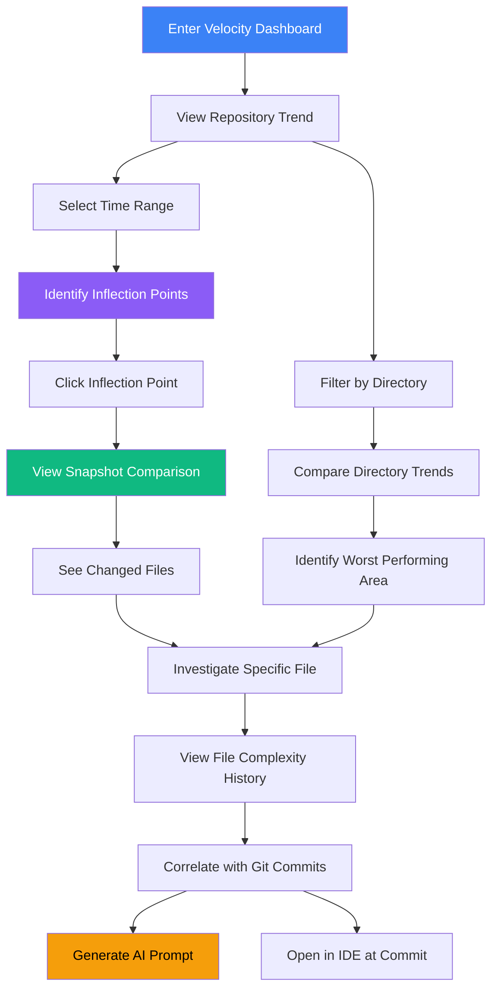

# Complexity Velocity Dashboard

## User Story

**As a technical lead**, I want to see how ALL code health metrics are changing over time (velocity), not just the current snapshot, so that I can identify whether recent development is improving or degrading the codebase across multiple dimensions.

## User Need

A codebase with complexity score 65 tells you nothing about trajectory. Is it improving from 80? Degrading from 50? Stable for months? And complexity is just ONE dimension—what about security, reliability, technical debt, and React-specific metrics?

Technical leads need to answer:

- "Are our refactoring efforts working?" (maintainability index trending)
- "Is new feature development adding technical debt?" (debt score velocity)
- "Are we introducing more anti-patterns?" (anti-pattern count acceleration)
- "Is our security posture improving?" (vulnerability trend)
- "Are we fixing null safety issues?" (null safety score velocity)
- "Is hook complexity increasing?" (temporal complexity velocity)
- "Which areas are getting worse fastest across WHICH metrics?"
- "When did this regression start and in what metric category?"

Without temporal context across all metric dimensions, single-point metrics are just numbers. With multi-dimensional velocity tracking, they become actionable intelligence.

---

## UX Flow

### Entry Points

1. **Primary:** Dashboard home shows velocity indicator on health score card
2. **Secondary:** Navigation sidebar "Velocity Trends" under Insights section
3. **Contextual:** Any trend arrow throughout app links to velocity detail
4. **Alert:** Regression notification leads directly to velocity dashboard

### User Journey



### Exit Points

1. **To Snapshot Comparison:** Click any point on timeline to compare snapshots
2. **To File Detail:** Click any file in the changed files list
3. **To Git History:** View commits associated with complexity changes
4. **To AI Prompt:** Generate prompt for regressed areas
5. **To Budget Settings:** Set targets based on trend data

---

## Information Architecture

### Data Displayed

**Primary View: Repository Trend Chart**

- X-axis: Time (configurable range)
- Y-axis: Aggregate complexity score (0-100)
- Line: Repository-wide trend
- Markers: Significant snapshots (git tags, manual snapshots)
- Shaded regions: Confidence interval or variance band

**Secondary View: Directory Comparison**

- Small multiples showing trend per major directory
- Allows quick identification of divergent areas
- Clickable to drill into directory-specific view

**Tertiary View: Velocity Leaderboard**

- Table of directories/files ranked by velocity (rate of change)
- Positive velocity = improving (green arrow up)
- Negative velocity = degrading (red arrow down)
- Stable = no significant change (gray dash)

### Progressive Disclosure Strategy

| Visible By Default | Revealed on Hover    | Revealed on Click   |
| ------------------ | -------------------- | ------------------- |
| Trend line         | Exact score at point | Snapshot comparison |
| Velocity direction | Rate of change       | Contributing files  |
| Time range         | Specific dates       | Git context         |
| Major inflections  | Commit messages      | Full diff analysis  |

### Hierarchy and Navigation

This view operates at **Levels 2-3** of the zoom model:

- **Level 2 (Repository):** Aggregate trend for entire codebase
- **Level 3 (Directory):** Filtered trend for specific directory

Time dimension adds a third navigation axis:

- Pan: Shift time window
- Zoom: Expand/contract time range
- Select: Click specific point for detail

---

## Interaction Patterns

### Primary Actions

| Action              | Trigger                | Result                         |
| ------------------- | ---------------------- | ------------------------------ |
| Change time range   | Dropdown or drag       | Re-render chart with new range |
| Compare snapshots   | Click two points       | Open side-by-side comparison   |
| Filter by directory | Sidebar tree selection | Show filtered trend line       |
| Export trend data   | Toolbar button         | Download CSV of trend data     |

### Secondary Actions

| Action                 | Trigger              | Result                                    |
| ---------------------- | -------------------- | ----------------------------------------- |
| Toggle confidence band | Checkbox             | Show/hide variance indicator              |
| Add annotation         | Right-click timeline | Mark significant event                    |
| Set baseline           | Context menu         | Use selected point as comparison baseline |
| Share view             | Toolbar button       | Copy deep link with current filters       |

### Micro-interactions

**Hover Effects:**

- Vertical guideline follows cursor
- Tooltip shows exact values at point
- Corresponding date highlights in x-axis

**Click Effects:**

- Point enlarges and pulses briefly
- Detail panel animates in from bottom
- Breadcrumb updates with temporal context

**Drag Effects:**

- Brush selection for time range
- Rubber band visual during drag
- Smooth transition to new range

---

## Visual Concepts

### Main Trend Chart

```
Complexity Velocity Dashboard
================================================================================

Time Range: [Last 30 Days v]    Directory: [All Directories v]    [Export]

Score
100 |
    |
 75 |                                    ____
    |                              ___---    \
 50 |        ___--------____------           \___
    |   ___--                                    \___
 25 | --                                             ---___
    |
  0 +-----|-----|-----|-----|-----|-----|-----|-----|-----|-->
        Jan 5  Jan 10 Jan 15 Jan 20 Jan 25 Jan 30 Feb 1  Feb 5

    [v1.2.0]        [v1.2.1]                    [v1.3.0]
                         ^
                    Click to compare

Velocity: +2.3 pts/week [Trending Up - Improving]

================================================================================
```

### Directory Comparison (Small Multiples)

```
Directory Velocity Comparison
================================================================================

+------------------+  +------------------+  +------------------+
| src/components/  |  | src/utils/       |  | src/services/    |
|     ___          |  |   ___            |  |          ___     |
|  __/   \__       |  |  /   \___        |  |   ______/   \___ |
| /                |  | /                |  | _/               |
| Velocity: +1.2   |  | Velocity: -0.3   |  | Velocity: +3.8   |
| [Improving]      |  | [Stable]         |  | [Degrading]      |
+------------------+  +------------------+  +------------------+

+------------------+  +------------------+  +------------------+
| src/hooks/       |  | src/api/         |  | src/pages/       |
|                  |  |      ___         |  |   _____          |
| ___________      |  |  ___/   \        |  |  /     \____     |
|                  |  | /                |  | /                |
| Velocity: 0.0    |  | Velocity: +0.8   |  | Velocity: +1.5   |
| [Stable]         |  | [Improving]      |  | [Improving]      |
+------------------+  +------------------+  +------------------+

================================================================================
```

### Velocity Leaderboard

```
Velocity Leaderboard - Largest Changes
================================================================================

Rank | Path                          | Current | 30d Ago | Velocity | Status
-----|-------------------------------|---------|---------|----------|----------
  1  | src/services/auth/            |    72   |    45   |  +3.8    | [!!!]
  2  | src/components/DataTable/     |    58   |    52   |  +0.9    | [!]
  3  | src/pages/Dashboard/          |    41   |    35   |  +0.9    | [!]
  4  | src/utils/formatting/         |    23   |    28   |  -0.7    | [OK]
  5  | src/hooks/                    |    31   |    31   |   0.0    | [--]

[!!!] = Critical degradation (> +3.0 pts/week)
[!]   = Notable degradation (> +0.5 pts/week)
[OK]  = Improving
[--]  = Stable

================================================================================
```

---

## Complexity Analysis Methodology

### Velocity Calculation

Velocity measures the rate of change in complexity over time, answering "how fast is code quality improving or degrading?"

**Core Formula:**

```
Velocity = ΔComplexity / ΔTime

Where:
  ΔComplexity = CurrentScore - BaselineScore
  ΔTime = Time period (in weeks)
```

**Aggregate Metrics Tracked (Comprehensive Set):**

1. **Structural Complexity Metrics (Core Plugin)**
   - Repository-wide cyclomatic complexity average
   - Halstead volume, difficulty, effort aggregates
   - Maintainability index distribution (A-F rating percentages)
   - Function count and size distribution

2. **React-Specific Metrics (React Plugin)**
   - **Hook Complexity**: Average hooks per component, temporal complexity weight trend
   - **Temporal Complexity**: Risky effects count, dependency complexity trend
   - **Coupling**: Average props count, context usage trend, prop drilling instances
   - **Identity**: Unstable reference count trend (inline functions, unstable context values)
   - **Dataflow**: State update complexity, prop drilling depth trend, shared mutable state instances
   - **Anti-patterns**: Total count by category (hooks, performance, state, lifecycle, JSX, props, security, testing, a11y) with severity breakdown

3. **Security Metrics (React Plugin)**
   - Vulnerability count by type (XSS, injection, sensitive data, auth, access control, crypto, input validation)
   - Severity distribution (critical, high, medium, low)
   - Security score trend

4. **Performance Metrics (React Plugin)**
   - Unnecessary render risk instances
   - Missing memoization count
   - Bundle impact score (heavy dependencies, tree-shaking opportunities)
   - Code-splitting opportunities

5. **Reliability Metrics (React Plugin)**
   - Crash risk score average
   - Error boundary coverage percentage
   - Null safety score distribution
   - Async error handling coverage
   - Memory leak risk indicators

6. **Technical Debt Metrics (React Plugin)**
   - Overall code health grade distribution (A-F)
   - Technical debt score (principal + interest)
   - Maintenance burden trend
   - Debt interest rate
   - Hotspot count

7. **Accessibility Metrics (React Plugin)**
   - WCAG violation count by level (A, AA, AAA)
   - Keyboard navigation score
   - Screen reader compatibility score
   - ARIA attribute coverage

8. **Technology-Specific Metrics (Next.js Plugin when applicable)**
   - Server/Client component ratio
   - Route optimization issues
   - Data fetching pattern quality

9. **Directory-Specific Rollups**
   - All above metrics aggregated per directory
   - Enables identification of problem areas across ALL dimensions

10. **Trend Confidence**
    - Standard deviation of recent data points for each metric
    - Narrow band = reliable trend
    - Wide band = noisy, unreliable signal

### Meaningful Thresholds

| Velocity (pts/week) | Status            | Interpretation               | Action                     |
| ------------------- | ----------------- | ---------------------------- | -------------------------- |
| < -2.0              | Rapidly Improving | Major refactoring paying off | Continue, document wins    |
| -2.0 to -0.5        | Improving         | Steady quality improvement   | Maintain practices         |
| -0.5 to +0.5        | Stable            | No significant change        | Monitor, may be acceptable |
| +0.5 to +2.0        | Degrading         | Quality declining            | Investigate causes         |
| > +2.0              | Rapidly Degrading | Critical quality loss        | Immediate intervention     |

**Why these thresholds:**

- ±0.5 pts/week accounts for measurement noise and minor refactorings
- ±2.0 pts/week represents significant sustained change
- Thresholds are per-week to normalize across different analysis frequencies

### Pattern Recognition

**Velocity Patterns That Indicate Issues:**

1. **Steady Upward Drift** (+0.5 to +1.0 pts/week for >4 weeks)
   - Pattern: Consistent small increases
   - Problem: "Death by a thousand cuts" - accumulated tech debt
   - Cause: Feature velocity prioritized over code health
   - Action: Institute complexity budgets, mandate refactoring time

2. **Sudden Spike** (+5+ pts in one snapshot)
   - Pattern: Dramatic one-time increase
   - Problem: Major feature added without architectural consideration
   - Cause: Deadline pressure, inadequate design phase
   - Action: Identify responsible changes, schedule targeted refactoring

3. **Stair-Step Pattern** (plateaus with periodic jumps)
   - Pattern: Stable periods interrupted by jumps
   - Problem: Release-driven accumulation
   - Cause: Features added in sprints, no cleanup between
   - Action: Add refactoring phase to release cycle

4. **Improvement Plateau** (was improving, now stable at high level)
   - Pattern: Downward trend stops above target
   - Problem: Easy wins exhausted, hard problems remain
   - Cause: Tackled accessible issues, avoided difficult refactorings
   - Action: Allocate dedicated time for hard problems

5. **Oscillation** (up one week, down next, repeatedly)
   - Pattern: Noisy signal with no clear trend
   - Problem: Instability in measurement or churn in specific files
   - Cause: Files being rewritten frequently, A/B test toggles
   - Action: Identify oscillating files, may need stabilization

## Detection Algorithms

### Velocity Computation Process

**Step 1: Snapshot Creation**

```
ON analysis trigger (manual, scheduled, or git hook):
  Calculate repository aggregate score
  Calculate per-directory aggregate scores
  Calculate per-file scores
  Store with timestamp and git SHA
  Link to git author and commit message
```

**Step 2: Velocity Calculation**

```
SELECT time window (7d, 30d, 90d, 1y, all-time)
FETCH snapshots in time window
IF snapshot count < 2:
  RETURN "Insufficient data"

CALCULATE linear regression:
  x = timestamps (converted to weeks since first)
  y = complexity scores
  slope = Σ((x - x̄)(y - ȳ)) / Σ((x - x̄)²)

velocity = slope  // pts per week
```

**Step 3: Trend Analysis**

```
CALCULATE confidence:
  r² = coefficient of determination
  IF r² > 0.7: HIGH confidence (reliable trend)
  IF r² > 0.4: MODERATE confidence
  IF r² < 0.4: LOW confidence (noisy data)

IDENTIFY inflection points:
  FOR each snapshot:
    IF velocity changes sign: MARK as inflection
    IF velocity magnitude changes >2x: MARK as acceleration
```

**Step 4: Attribution**

```
FOR each inflection point:
  FIND git commits between previous snapshot and inflection
  ANALYZE changed files for complexity changes
  RANK commits by complexity delta
  PRESENT top 5 contributors to change
```

### Alert Triggers

| Condition                                   | Alert Type           | Notification                                   |
| ------------------------------------------- | -------------------- | ---------------------------------------------- |
| Velocity exceeds +2.0 pts/week              | Critical Degradation | Immediate notification, require acknowledgment |
| Velocity between +0.5 and +2.0 for >2 weeks | Warning              | Daily digest, weekly summary                   |
| Repository score exceeds budget (if set)    | Budget Violation     | Immediate notification                         |
| Inflection point detected                   | Info                 | Dashboard badge, trend analysis available      |

### Regression Detection

**Identifying Problematic Changes:**

```
FOR each snapshot pair (before, after):
  delta = after.score - before.score
  IF delta > threshold:
    commits = git log between snapshots
    FOR each commit:
      affected_files = files changed in commit
      FOR each file:
        file_delta = file.complexity_after - file.complexity_before
        complexity_contribution = file_delta
      commit.total_contribution = SUM(complexity_contribution)
    RANK commits by total_contribution
    IDENTIFY top 3 as "likely culprits"
```

**False Positive Reduction:**

- Ignore files smaller than 20 LOC (noise)
- Discount test file changes by 50% (higher complexity acceptable)
- Exclude vendored/generated code (not under team control)

## Interpretation Guidance

### Understanding Velocity Values

**Velocity of -1.5 pts/week (Improving):**

- What it means: Code quality is steadily improving
- In context: Over 30 days, complexity would drop by ~6.5 points
- Real-world: A repo at 65 would reach 58 in a month
- Assessment: Excellent - refactoring efforts are working
- Action: Document what's working, continue practices

**Velocity of +0.3 pts/week (Slightly Degrading):**

- What it means: Very slow quality decline
- In context: Over 30 days, complexity would rise by ~1.3 points
- Real-world: A repo at 40 would reach 41.3 in a month
- Assessment: Borderline acceptable - may be "noise" or minor feature work
- Action: Monitor, but no immediate action needed

**Velocity of +1.2 pts/week (Degrading):**

- What it means: Code quality is noticeably declining
- In context: Over 30 days, complexity would rise by ~5.2 points
- Real-world: A repo at 45 would reach 50.2 in a month
- Assessment: Concerning - unsustainable if continued
- Action: Investigate recent changes, identify root causes, implement corrective measures

**Velocity of +3.5 pts/week (Rapidly Degrading):**

- What it means: Code quality is in freefall
- In context: Over 30 days, complexity would rise by ~15 points
- Real-world: A repo at 50 would reach 65 in a month
- Assessment: Critical - emergency intervention needed
- Action: Stop feature work, mandate refactoring, pair programming on all changes

### Good vs. Bad in Context

**Early-Stage Projects (< 3 months old):**

- Expected: Slightly positive velocity (+0.5 to +1.5)
- Why: Establishing patterns, exploring solutions
- Concerning: Rapid increase (+2.5+) suggests architectural mistakes
- Target: Stabilize by month 4

**Mature Projects (> 1 year):**

- Expected: Stable velocity (-0.5 to +0.5)
- Why: Patterns established, fewer big changes
- Concerning: Steady increase suggests maintenance decay
- Target: Maintain stability

**Active Refactoring Phase:**

- Expected: Strong negative velocity (-2.0 to -4.0)
- Why: Deliberate complexity reduction
- Concerning: Improvement slowing before goals reached
- Target: Sustain until target achieved

**Feature Development Sprint:**

- Expected: Moderate positive velocity (+0.5 to +1.5)
- Why: Adding functionality adds complexity
- Concerning: No "payback" cleanup in subsequent sprints
- Target: Follow with refactoring sprint

### Confidence Bands

**High Confidence (r² > 0.7):**

- Trend is reliable
- Act on the velocity value
- Safe to extrapolate forward

**Moderate Confidence (r² 0.4-0.7):**

- General direction is clear
- Specific velocity value may be imprecise
- Monitor for another week before major decisions

**Low Confidence (r² < 0.4):**

- Data is too noisy to interpret
- Velocity value is unreliable
- Need more snapshots or more stable codebase

## Example Scenarios

### Scenario 1: Successful Refactoring Campaign

**Timeline:** 8 weeks
**Starting Score:** 72 (High complexity)
**Ending Score:** 54 (Moderate complexity)
**Velocity:** -2.25 pts/week
**Confidence:** High (r² = 0.89)

**Story:**
Week 0: Team decides complexity is too high, impeding feature velocity
Week 1-2: Extract god components into smaller pieces (-4 pts)
Week 3-4: Remove duplicate code, consolidate utilities (-5 pts)
Week 5-6: Simplify conditional logic, reduce nesting (-4 pts)
Week 7-8: Final cleanup, documentation improvements (-5 pts)

**Interpretation:** Textbook refactoring effort. Consistent improvement, good velocity, high confidence. The -2.25 pts/week is sustainable and shows deliberate effort.

**Key Success Factor:** Dedicated refactoring time, not "fit in when possible."

---

### Scenario 2: Feature Rush Degradation

**Timeline:** 6 weeks
**Starting Score:** 48 (Moderate)
**Ending Score:** 63 (High)
**Velocity:** +2.5 pts/week
**Confidence:** High (r² = 0.82)

**Inflection Points:**

- Week 2: +7 points (major feature: user dashboard)
- Week 4: +5 points (major feature: real-time notifications)
- Week 6: +3 points (feature: advanced filtering)

**Story:**
Sales promised three major features for demo. Engineering delivered but "quick and dirty." Each feature added complexity without refactoring time allocated.

**Interpretation:** Velocity shows unsustainable quality decline. At this rate, codebase would be unmaintainable in 12 weeks. Classic tech debt accumulation.

**Recommended Action:**

1. Stop feature work for 2 weeks
2. Allocate sprint to targeted refactoring
3. Institute 20% rule: 1 day per sprint for code health
4. Target: Return to ~50 complexity in 6 weeks

---

### Scenario 3: The Plateau

**Timeline:** 16 weeks
**Week 0-8 Score:** 68 → 56 (Velocity: -1.5 pts/week)
**Week 9-16 Score:** 56 → 54 (Velocity: -0.25 pts/week)

**Story:**
First 8 weeks: Aggressive refactoring. Tackled obvious god components, extracted utilities, reduced duplication. Strong progress.

Weeks 9-16: Improvement stalls. Remaining complexity is deeply embedded in domain logic and algorithmic code. Easy wins are gone.

**Interpretation:** Hit the "hard problems" plateau. Velocity drop isn't failure—it reflects reality that remaining complexity is harder to address.

**Recommended Action:**

1. Reassess target: Is 54 acceptable long-term? (Likely yes)
2. For remaining issues: Accept as essential complexity OR
3. Allocate dedicated architect time for deep refactoring
4. Don't force velocity metrics if complexity is justified

---

### Scenario 4: Oscillating Churn

**Timeline:** 12 weeks
**Pattern:** 52 → 56 → 51 → 58 → 50 → 55 → 52...
**Velocity:** +0.1 pts/week (but r² = 0.18 - very low confidence)

**Root Cause Investigation:**
Two files oscillating wildly:

- `src/features/experimental-dashboard.tsx` - being A/B tested, frequently toggled
- `src/api/client.ts` - team can't decide on error handling approach, rewritten 3 times

**Interpretation:** Velocity is meaningless here. The oscillation indicates instability, not trend. Low r² correctly identifies this.

**Recommended Action:**

1. Experimental features: Isolate behind feature flags, don't let churn affect metrics
2. API client: Make architectural decision, stop rewriting
3. Consider excluding volatile files from aggregate score temporarily
4. Re-measure after stabilization

---

## Psychological Principles

### Trend Perception

Humans naturally understand direction (up/down) better than magnitude. The dashboard emphasizes:

- Clear directional indicators (arrows, color coding)
- "Improving" vs "Degrading" labels, not just numbers
- Velocity as rate of change, not absolute values

### Loss Aversion

Degradation (loss of code quality) feels worse than improvement feels good. The interface:

- Highlights degradation more prominently than improvement
- Uses warning colors for negative velocity
- Frames improvement as "maintaining momentum"

### Temporal Landmarks

People anchor understanding to meaningful events. The dashboard:

- Marks git tags and releases on timeline
- Allows custom annotations ("Started refactoring project")
- Correlates changes with commits

---

## Success Metrics

| Metric                    | Target      | Measurement                                         |
| ------------------------- | ----------- | --------------------------------------------------- |
| Trend comprehension       | < 5 seconds | User identifies improvement/degradation direction   |
| Inflection discovery      | > 60%       | Users who click to investigate an inflection point  |
| Root cause identification | < 2 minutes | Time to identify commits causing regression         |
| Correlation accuracy      | > 80%       | Changes correctly attributed to responsible commits |

---

## Integration with Broader Application

### Feature Dependencies

**Requires:**

- Snapshot system from Round One (historical data storage)
- Git integration (commit correlation)
- Five-Level Zoom (navigation patterns)

**Enables:**

- Snapshot Comparison (US-NEW-15) - Detailed diff between points
- Ongoing Monitoring Mode (US-NEW-14) - Velocity alerts
- Complexity Budget (US-NEW-16) - Trend-based targets

### Data Sources

- Historical snapshots from SQLite database
- Git log for commit metadata
- Aggregate metrics calculated at snapshot time
- Directory-level rollups computed on demand

### Shared Components

| Component         | Source       | Customization                    |
| ----------------- | ------------ | -------------------------------- |
| Line Chart        | Chart.js     | Time-series optimized            |
| Small Multiples   | D3.js custom | Sparkline variant                |
| Data Table        | Styleguide   | Velocity column formatting       |
| Time Range Picker | Styleguide   | Preset ranges (7d, 30d, 90d, 1y) |

---

## Open Questions

1. **Snapshot frequency:** How often should automatic snapshots be created to enable meaningful velocity calculation?

2. **Velocity calculation:** Should velocity be linear regression slope, or simple (end - start) / time?

3. **Variance handling:** How do we handle noisy data where complexity jumps around due to non-substantive changes?

4. **Cross-repo comparison:** Should velocity be normalized to enable comparison across repositories of different sizes?

5. **Alert thresholds:** What velocity value triggers a degradation alert? Configurable per-repo?
