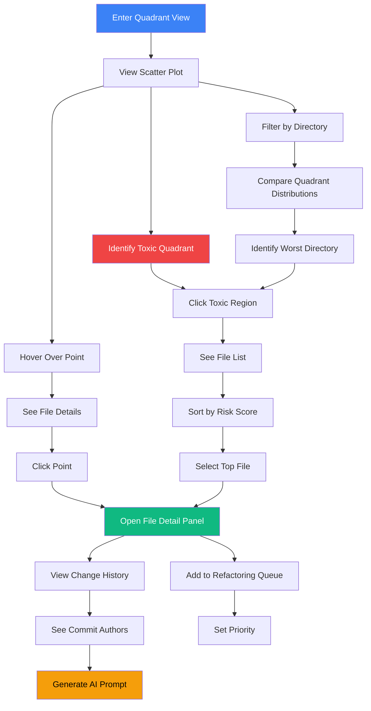

# Churn-Complexity Quadrant Analysis

## User Story

**As a technical debt prioritization lead**, I want to see files plotted on a churn vs. complexity matrix, so that I can identify "toxic" files (high churn AND high complexity) that are the most dangerous to the codebase.

## User Need

Not all complex code is problematic. A complex algorithm that never changes is stable. A simple utility that changes daily is manageable. But complex code that changes frequently is toxic: every change risks introducing bugs, and the complexity makes bugs hard to find.

The four quadrants reveal different action strategies:

| Quadrant   | Churn | Complexity | Strategy                                  |
| ---------- | ----- | ---------- | ----------------------------------------- |
| **Toxic**  | High  | High       | Priority refactoring - highest risk       |
| **Risky**  | Low   | High       | Monitor - stable but dangerous if touched |
| **Active** | High  | Low        | Acceptable - changes are manageable       |
| **Stable** | Low   | Low        | Ideal - leave alone                       |

Without this view, teams treat all complex files equally, wasting effort on stable code while toxic files continue accumulating risk.

---

## UX Flow

### Entry Points

1. **Primary:** Dashboard card "Risk Quadrants" with toxic file count
2. **Secondary:** Navigation sidebar "Churn Analysis" under Analysis section
3. **Contextual:** File detail shows quadrant position with link to full view
4. **Search:** Global search result type "toxic files"

### User Journey



### Exit Points

1. **To File Detail:** Click any point to see full file analysis
2. **To Change History:** View commits contributing to churn
3. **To AI Prompt:** Generate refactoring prompt for toxic files
4. **To Refactoring Queue:** Add file to prioritized work list
5. **To Team View:** See who touches toxic files most

---

## Information Architecture

### Data Displayed

**Primary View: Scatter Plot**

- X-axis: Churn rate (commits per time period, normalized)
- Y-axis: Complexity score (cyclomatic or maintainability index)
- Point size: Lines of code
- Point color: Age of last change (recent = warm, old = cool)
- Quadrant lines: Configurable thresholds

**Secondary View: Quadrant Summary Cards**

- Count of files in each quadrant
- Percentage of codebase
- Trend indicator (more/fewer than last period)
- Click to filter plot to that quadrant

**Tertiary View: File List Panel**

- Sortable table of files in selected quadrant
- Risk score (combined metric)
- Last changed date
- Primary contributors
- Quick actions (open, prompt, queue)

### Progressive Disclosure Strategy

| Visible By Default | Revealed on Hover | Revealed on Click |
| ------------------ | ----------------- | ----------------- |
| Point position     | File name         | Full file detail  |
| Quadrant region    | Exact metrics     | Change history    |
| Point size (rough) | Actual LOC        | Contributor list  |
| Point color (age)  | Last change date  | Commit messages   |

### Hierarchy and Navigation

This view operates at **Levels 2-4** of the zoom model:

- **Level 2 (Repository):** All files plotted, quadrant overview
- **Level 3 (Directory):** Filtered to single directory
- **Level 4 (File):** Selected file highlighted, detail panel open

Zoom controls:

- Box selection: Zoom to region of scatter plot
- Quadrant click: Filter to quadrant
- Directory filter: Reduce point population

---

## Interaction Patterns

### Primary Actions

| Action              | Trigger                | Result                          |
| ------------------- | ---------------------- | ------------------------------- |
| Select quadrant     | Click quadrant region  | Filter to show only those files |
| Inspect file        | Click point            | Open detail panel               |
| Adjust thresholds   | Drag quadrant lines    | Recalculate quadrant membership |
| Filter by directory | Sidebar tree selection | Show only files in directory    |

### Secondary Actions

| Action              | Trigger        | Result                                |
| ------------------- | -------------- | ------------------------------------- |
| Change time period  | Dropdown       | Recalculate churn with new window     |
| Toggle point sizing | Checkbox       | Uniform size vs. LOC-based            |
| Export toxic list   | Toolbar button | Download CSV of toxic files           |
| Compare periods     | Toggle         | Side-by-side view of two time periods |

### Micro-interactions

**Hover Effects:**

- Point enlarges (1.5x)
- Label appears showing file name
- Connecting line to axes shows exact values
- Other points dim slightly

**Click Effects:**

- Point pulses and locks in enlarged state
- Panel slides in from right
- Quadrant statistics update to show selection

**Drag Effects:**

- Threshold lines show preview position
- File counts update in real-time
- Snap to reasonable values (5-point increments)

---

## Visual Concepts

### Scatter Plot Layout

```
Churn-Complexity Quadrant Analysis
================================================================================

Time Period: [Last 90 Days v]    Directory: [All v]    [Export Toxic Files]

Complexity
    ^
100 |  RISKY              |  TOXIC
    |                     |
    |    o                |      O  <- UserAuth.tsx (hover)
    |         o           |   o
 50 |......................+......................
    |  o       o    o     |      o
    |      o         o    |  o
    |  STABLE             |  ACTIVE
    |    o  o    o  o     |    o    o
  0 +-----|-----|-----|-----|-----|-----|------> Churn
          0    20    40    60    80   100

Legend:
  O = Large file (>500 LOC)
  o = Small file (<500 LOC)

Quadrant Summary:
+--------+--------+--------+--------+
| Toxic  | Risky  | Active | Stable |
|   12   |   34   |   28   |  156   |
|  +3    |   -2   |   +1   |   +4   | (vs last period)
+--------+--------+--------+--------+

================================================================================
```

### File List Panel (Toxic Quadrant Selected)

```
================================================================================
Toxic Files (12)                                    Sort: [Risk Score v]
================================================================================

| File                          | Complexity | Churn | Risk  | Actions      |
|-------------------------------|------------|-------|-------|--------------|
| src/services/auth/login.tsx   |     78     |  92   | 98.2  | [>] [AI] [+] |
| src/api/users/mutations.ts    |     65     |  88   | 91.4  | [>] [AI] [+] |
| src/hooks/useDataFetch.ts     |     71     |  76   | 87.3  | [>] [AI] [+] |
| src/components/DataTable.tsx  |     68     |  71   | 82.1  | [>] [AI] [+] |
| ...                           |     ...    |  ...  |  ...  | ...          |

[>] = Open in IDE
[AI] = Generate AI Prompt
[+] = Add to Refactoring Queue

================================================================================
```

### Quadrant Detail Tooltip

```
+----------------------------------+
| UserAuth.tsx                     |
| src/services/auth/               |
+----------------------------------+
| Complexity:    78 / 100          |
| Churn:         92 commits (90d)  |
| Lines:         423               |
| Last Changed:  2 days ago        |
+----------------------------------+
| Top Contributors:                |
|   jsmith (34 commits)            |
|   alee (28 commits)              |
|   mwang (18 commits)             |
+----------------------------------+
| Risk Score: 98.2 (Critical)      |
+----------------------------------+
```

---

## Complexity Analysis Methodology

### Dual-Axis Risk Assessment

The churn-complexity quadrant combines two independent risk dimensions that multiply when combined:

**Axis 1: Churn Rate (How often does this code change?)**

- Measured: Commit frequency over time window
- Normalized: Commits per week or per month
- Adjusted: By file age (newer files naturally have higher churn)

**Axis 2: Composite Risk Score (How hard/risky is this code to change safely?)**

- **Option 1: Overall Vipr Score** - Composite of ALL metric categories:
  - Structural complexity (cyclomatic, Halstead, maintainability index)
  - React complexity (hooks, temporal, coupling, identity, dataflow)
  - Security risk (vulnerability count and severity)
  - Reliability risk (crash risk, null safety, error handling)
  - Anti-pattern severity
  - Technical debt score
  - Performance issues
  - Accessibility violations
- **Option 2: React Maintainability Index** - React-specific comprehensive score incorporating:
  - Halstead volume, cyclomatic complexity, LOC (traditional factors)
  - Hook complexity, temporal complexity, coupling complexity (React factors)
  - Type coverage, identity complexity (modern React factors)
- **Option 3: Specific Metric** - User selectable (cyclomatic, maintainability, security score, reliability score, etc.)
- Aggregated: Weighted average if multiple functions per file
- Normalized: Scaled to 0-100 for consistent visualization

**Risk Formula (Enhanced with Comprehensive Metrics):**

```
RiskScore = (Churn × ChurnWeight) + (CompositeRisk × RiskWeight) + (Churn × CompositeRisk × InteractionWeight)

Where CompositeRisk incorporates:
  - Structural complexity (cyclomatic, Halstead, maintainability)
  - React complexity (hooks, temporal, coupling, identity, dataflow)
  - Security vulnerabilities (weighted by severity)
  - Reliability issues (crash risk, null safety)
  - Anti-patterns (count and severity)
  - Technical debt (principal + interest)
  - Performance issues
  - Accessibility violations

Default Weights:
  ChurnWeight = 0.25
  RiskWeight = 0.35  // Increased to account for multi-dimensional risk
  InteractionWeight = 0.40  // The multiplicative danger factor

Alternative: User can select specific metric dimension for Y-axis:
  - Security risk only (for security-focused analysis)
  - Reliability risk only (for stability-focused analysis)
  - React maintainability index (for React-specific code health)
  - Traditional cyclomatic complexity (for comparison with legacy tools)
```

### Quadrant Definitions and Thresholds

**Default Thresholds (Adjustable):**

- Churn Threshold: 5 commits/month (50th percentile of active files)
- Complexity Threshold: 40/100 (recommended maximum for maintainability)

**Quadrant Characteristics:**

| Quadrant   | Churn         | Complexity  | Risk Level | Strategy                      |
| ---------- | ------------- | ----------- | ---------- | ----------------------------- |
| **Stable** | Low (< 5/mo)  | Low (< 40)  | Minimal    | Leave alone, ideal state      |
| **Active** | High (≥ 5/mo) | Low (< 40)  | Low        | Acceptable, changes are safe  |
| **Risky**  | Low (< 5/mo)  | High (≥ 40) | Moderate   | Monitor, dangerous if touched |
| **Toxic**  | High (≥ 5/mo) | High (≥ 40) | Critical   | Priority for refactoring      |

### Meaningful Thresholds

**Churn Rate Interpretation:**

| Commits/Month | Classification | Typical Cause                          |
| ------------- | -------------- | -------------------------------------- |
| 0-1           | Stable         | Rarely touched, mature code            |
| 2-5           | Low Activity   | Occasional maintenance                 |
| 6-15          | Active         | Regular feature work                   |
| 16-30         | High Activity  | Core business logic area               |
| 31+           | Churning       | Too many changes, possible instability |

**Complexity Score Interpretation:**

| Score  | Classification | Characteristics                       |
| ------ | -------------- | ------------------------------------- |
| 0-20   | Simple         | Easy to understand, minimal branching |
| 21-40  | Moderate       | Acceptable complexity, maintainable   |
| 41-60  | Complex        | Difficult to modify safely            |
| 61-80  | Very Complex   | High risk of bugs, needs refactoring  |
| 81-100 | Critical       | Nearly unmaintainable                 |

### Pattern Recognition

**Toxic Quadrant Patterns:**

1. **The Hotspot** - Files everyone touches
   - Pattern: 20+ commits/month, complexity 50-70
   - Problem: Central to many features, poorly designed
   - Example: Main application state manager
   - Risk: Every change risks regression

2. **The Kitchen Sink** - Files that do everything
   - Pattern: 10+ commits/month, complexity 70-90
   - Problem: Multiple responsibilities attract multiple changes
   - Example: God component or utility file
   - Risk: Changes in one area break unrelated areas

3. **The Bandaid File** - Repeated attempted fixes
   - Pattern: 15+ commits/month, complexity increasing over time
   - Problem: Underlying issue not addressed, symptoms patched
   - Example: Error handling that catches everything
   - Risk: Complexity accumulates, root cause hidden

**Risky Quadrant Patterns:**

1. **The Legacy Monster** - Old, complex, untouched
   - Pattern: 0-2 commits/month, complexity 60-80
   - Problem: Fear of touching creates stagnation
   - Example: Original authentication module
   - Risk: When change is needed, nobody understands it

2. **The Algorithm File** - Inherently complex
   - Pattern: 0-1 commits/month, complexity 50-70
   - Problem: Complexity is essential, not accidental
   - Example: Sorting, pathfinding, crypto algorithms
   - Risk: Low - complexity is justified and stable

## Detection Algorithms

### Churn Calculation

**Step 1: Gather Git History**

```
FOR each file in repository:
  commits = git log --follow --format=%H,%ai -- <file_path>
  PARSE commits to extract:
    - Commit SHA
    - Timestamp
    - Author (for social analysis)
```

**Step 2: Calculate Churn Rate**

```
SELECT time_window (30d, 90d, 1y)
commits_in_window = FILTER commits BY timestamp >= (now - time_window)
churn_rate = commits_in_window.length / (time_window in months)

IF file_age < time_window:
  // Normalize for young files
  churn_rate = churn_rate × (time_window / file_age)
```

**Step 3: Normalize Churn**

```
repository_churn_values = COLLECT churn_rate FOR all files
percentile_rank = RANK churn_rate IN repository_churn_values

normalized_churn = (percentile_rank / 100) × 100
// Converts to 0-100 scale matching complexity
```

### Complexity Calculation

**Step 1: Analyze File**

```
AST = parse_file(file_path)
metrics = {
  cyclomatic_complexity: calculate_cc(AST),
  cognitive_complexity: calculate_cognitive(AST),
  nesting_depth: max_nesting_depth(AST),
  function_count: count_functions(AST)
}
```

**Step 2: Aggregate to File Level**

```
IF file has multiple functions:
  // Weighted average by function size
  total_loc = SUM(function.loc FOR each function)
  complexity_score = SUM(function.complexity × function.loc) / total_loc
ELSE:
  complexity_score = file.complexity
```

**Step 3: Normalize**

```
normalized_complexity = (complexity_score / max_complexity) × 100
// OR use industry standard thresholds:
normalized_complexity = min(complexity_score / 40 × 100, 100)
// This scales so that 40 = 100%, matching "maximum recommended"
```

### Quadrant Assignment

**Step 1: Position File**

```
x = normalized_churn
y = normalized_complexity
quadrant = determine_quadrant(x, y, churn_threshold, complexity_threshold)
```

**Step 2: Calculate Risk Score**

```
// Risk emphasizes the interaction of high churn AND high complexity
churn_factor = x / 100  // 0 to 1
complexity_factor = y / 100  // 0 to 1

risk_score = (
  (churn_factor × 30) +
  (complexity_factor × 30) +
  (churn_factor × complexity_factor × 40)
) × 100

// This means a file at (100, 100) scores 100
// A file at (100, 0) or (0, 100) scores only 30
```

**Step 3: Rank Within Quadrant**

```
FOR each quadrant:
  files_in_quadrant = FILTER by quadrant
  SORT files_in_quadrant BY risk_score DESC
  MARK top 10% as "priority"
```

### Alert Triggers

| Condition                                     | Alert Type       | Notification                                  |
| --------------------------------------------- | ---------------- | --------------------------------------------- |
| File enters Toxic quadrant                    | Warning          | Dashboard badge, weekly summary               |
| File in Toxic quadrant for >30 days           | Critical         | Desktop notification, requires acknowledgment |
| Toxic quadrant file count increases 50%+      | Trend Alert      | Monthly summary, stakeholder report           |
| File moves from Stable to Toxic in one period | Regression Alert | Immediate investigation prompt                |

## Interpretation Guidance

### Understanding Quadrant Position

**Toxic Quadrant (High Churn, High Complexity):**

- What it means: Dangerous code that changes frequently
- Why it's bad: Each change risks bugs; complexity makes bugs hard to find
- Real-world: 12 commits/month on a file with cyclomatic complexity 65
- Action: Priority refactoring. Consider feature freeze on this file until improved
- Risk: 10x more likely to introduce bugs than Stable quadrant

**Risky Quadrant (Low Churn, High Complexity):**

- What it means: Complex but stable code
- Why it's concerning: Ticking time bomb - dangerous when touched
- Real-world: 1 commit/month on a file with complexity 70
- Action: Document thoroughly, increase test coverage, refactor only if needed
- Risk: 3x more likely to introduce bugs than Stable, but changes are rare

**Active Quadrant (High Churn, Low Complexity):**

- What it means: Frequently changing but manageable code
- Why it's acceptable: Changes are safe due to low complexity
- Real-world: 15 commits/month on a file with complexity 20
- Action: Monitor to ensure complexity stays low despite changes
- Risk: Similar to Stable quadrant - changes are safe

**Stable Quadrant (Low Churn, Low Complexity):**

- What it means: Ideal state - simple and stable
- Why it's good: Low maintenance, low risk
- Real-world: 2 commits/month on a file with complexity 15
- Action: Leave alone unless requirements change
- Risk: Baseline low risk

### Good vs. Bad Values in Context

**Infrastructure Files (API clients, routers, core services):**

- Expected Quadrant: Risky (low churn, moderate-high complexity)
- Why: These are complex but shouldn't change often
- Concerning: If in Toxic (high churn means unstable architecture)
- Target: Move to Risky or refactor to reduce complexity

**UI Components:**

- Expected Quadrant: Active (moderate churn, low complexity)
- Why: UI changes frequently for features, should stay simple
- Concerning: Toxic quadrant (complex components that keep changing)
- Target: Keep in Active, or refactor to Stable

**Business Logic:**

- Expected Quadrant: Risky to Stable
- Why: Complex domain logic, but should stabilize
- Concerning: Toxic (constantly changing complex logic)
- Target: Refactor to reduce complexity, then stabilize

**Utility Functions:**

- Expected Quadrant: Stable (low churn, low complexity)
- Why: Utilities should be simple and stable
- Concerning: Any other quadrant
- Target: Always Stable

### Threshold Customization

**When to adjust the churn threshold:**

- Fast-moving startup: Raise to 10-15 commits/month (everything changes fast)
- Mature product: Lower to 3-4 commits/month (less change is normal)
- Based on team size: More developers = more commits naturally

**When to adjust the complexity threshold:**

- Highly technical domain: Raise to 50-60 (algorithms expected)
- Simple CRUD app: Lower to 30 (no excuse for complexity)
- Legacy codebase: Start at 60, lower gradually as you refactor

## Example Scenarios

### Scenario 1: The Authentication Crisis

**File:** `src/services/auth/index.ts`
**Position:** Toxic Quadrant

- Churn: 18 commits/month
- Complexity: 72/100
- Risk Score: 91

**Recent Commits (Last 30 Days):**

1. "Add OAuth provider"
2. "Fix token refresh bug"
3. "Add MFA support"
4. "Fix race condition in logout"
5. "Add session timeout handling"
   ... (13 more commits)

**Analysis:**
Every new feature touches auth. File has grown to handle OAuth, MFA, session management, token refresh, error handling. Too many responsibilities.

**Why Toxic:**

- High churn because every feature needs auth changes
- High complexity from accumulated responsibilities
- Each change risks breaking existing auth flows

**Refactoring Strategy:**

1. Extract: OAuthProvider, MFAHandler, SessionManager, TokenService
2. Result: 4 files in Active quadrant (complexity 15-25 each)
3. Core auth.ts moves to Risky quadrant (complexity 35, low churn)

---

### Scenario 2: The Stable Algorithm

**File:** `src/algorithms/compression.ts`
**Position:** Risky Quadrant

- Churn: 0.5 commits/month
- Complexity: 68/100
- Risk Score: 34

**Recent Activity:**

- Last modified: 6 months ago
- Change: "Fix edge case with empty buffers"
- Before that: 11 months ago

**Analysis:**
Implements LZ77 compression algorithm. High cyclomatic complexity due to algorithmic nature. Rarely touched because it works correctly.

**Why Acceptable:**

- Complexity is essential (compression is inherently complex)
- Low churn indicates stability
- Well-tested (98% coverage)
- Clear input/output contract

**Action:** None needed. This is acceptable Risky quadrant code. Ensure test coverage remains high.

---

### Scenario 3: The Churning Form

**File:** `src/components/UserProfileForm.tsx`
**Position:** Toxic Quadrant

- Churn: 22 commits/month
- Complexity: 58/100
- Risk Score: 88

**Churn Analysis:**
Why so many commits?

- 8 commits: "Add field for X"
- 7 commits: "Fix validation for Y"
- 4 commits: "Update styling"
- 3 commits: "Fix bug in Z"

**Root Cause:**
Form fields hard-coded. Each new profile field requires:

1. Update component (add JSX)
2. Update validation
3. Update state management
4. Update submission handler

**Refactoring Strategy:**
Extract to schema-driven form:

```typescript
// Before: Hard-coded complexity
<Form>
  <Input name="firstName" validate={validateFirstName} />
  <Input name="lastName" validate={validateLastName} />
  {/* 20 more fields... */}
</Form>

// After: Schema-driven simplicity
<SchemaForm schema={userProfileSchema} />
```

**Expected Result:**

- Move to Active quadrant
- Complexity drops to 15
- Churn remains high but safer (schema changes only)
- Risk score drops to 22

---

### Scenario 4: Active Development File

**File:** `src/features/analytics/dashboard.tsx`
**Position:** Active Quadrant

- Churn: 12 commits/month
- Complexity: 28/100
- Risk Score: 24

**Recent Commits:**

- "Add conversion rate widget"
- "Add date range picker"
- "Add export to CSV"
- "Add user segment filter"

**Analysis:**
Active feature under development. Each commit adds a widget or filter. Complexity stays low through good composition patterns.

**Why Healthy:**

- High churn is expected (active development)
- Complexity stays low (good architecture)
- Each widget is separate component
- Dashboard just composes them

**Action:** Monitor to ensure complexity doesn't creep up. Current trajectory is healthy.

---

### Scenario 5: The Stable Legacy

**File:** `src/utils/date-helpers.ts`
**Position:** Stable Quadrant

- Churn: 0.2 commits/month (1 commit in 5 months)
- Complexity: 18/100
- Risk Score: 4

**Status:** Perfect. Simple utility functions, stable, well-tested. The goal state for most code.

**Action:** None. This is what we want most code to look like.

---

## Psychological Principles

### Risk Salience

The "toxic" quadrant is labeled and colored to emphasize risk without being alarmist. Using red sparingly (only for the quadrant itself, not the files) maintains urgency without causing panic.

### Anchoring with Thresholds

Movable threshold lines let users calibrate their own definition of "high" churn and complexity. This prevents arguments about absolute numbers and focuses discussion on relative priorities.

### Social Proof

Showing top contributors in tooltips leverages social dynamics:

- Teams can identify who to consult about changes
- Contributors can take ownership of improving their areas
- Knowledge distribution becomes visible

### Pareto Principle

Toxic files are typically < 5% of codebase but represent >50% of risk. The visualization makes this imbalance obvious, justifying focused attention on a small number of files.

---

## Success Metrics

| Metric                     | Target       | Measurement                                  |
| -------------------------- | ------------ | -------------------------------------------- |
| Quadrant comprehension     | < 10 seconds | User correctly identifies toxic quadrant     |
| Toxic file investigation   | > 70%        | Users who click into at least one toxic file |
| Refactoring queue addition | > 20%        | Toxic files added to queue per session       |
| Threshold customization    | > 30%        | Users who adjust quadrant thresholds         |

---

## Integration with Broader Application

### Feature Dependencies

**Requires:**

- Git integration for commit history (churn calculation)
- Complexity metrics from `@vipr/core` plugin
- Five-Level Zoom (navigation patterns)

**Enables:**

- Complexity Budget (US-NEW-16) - Toxic files inform budget
- Initial Analysis Mode (US-NEW-13) - Quadrant as triage step
- AI Prompt Generation (US-NEW-19) - Context for toxic file prompts

### Data Sources

- Git log for commit frequency (churn)
- File analysis for complexity scores
- SQLite for contributor aggregation
- Historical snapshots for trend comparison

### Shared Components

| Component     | Source       | Customization                          |
| ------------- | ------------ | -------------------------------------- |
| Scatter Plot  | D3.js custom | Quadrant overlay, draggable thresholds |
| Summary Cards | Styleguide   | Quadrant-specific colors               |
| File Table    | Styleguide   | Risk score column, quick actions       |
| Tooltip       | Styleguide   | Contributor list, metrics layout       |

---

## Open Questions

1. **Churn normalization:** Should churn be normalized by file age? A new file with 10 commits in 2 weeks is different from an old file with 10 commits in 2 years.

2. **Complexity metric:** Cyclomatic complexity, maintainability index, or composite score? Different metrics may move files between quadrants.

3. **Threshold defaults:** What are sensible defaults for quadrant boundaries? Should they be percentile-based (top 25%) or absolute?

4. **Team filtering:** Should users be able to filter to "my toxic files" based on contributor history?

5. **Trend overlay:** Should we show how files have moved between quadrants over time? Would require additional visual complexity.
