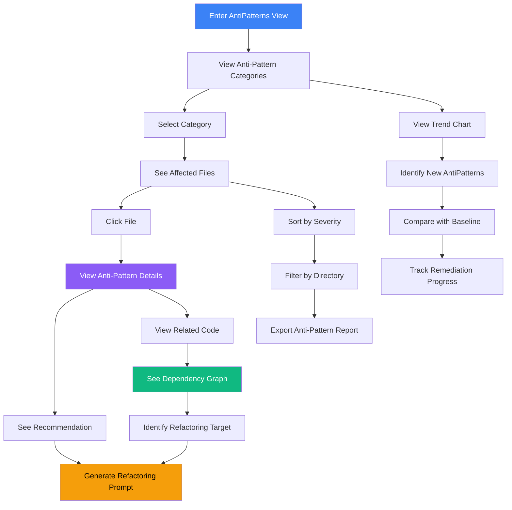

# Architectural AntiPatterns Detection

## User Story

**As a software architect**, I want to automatically detect common architectural anti-patterns (god components, circular dependencies, feature envy, excessive prop drilling), so that I can address structural issues before they become entrenched.

## User Need

Code metrics like complexity tell you "what" is problematic. Architectural anti-patterns tell you "why." A file with complexity 80 might be acceptable if it encapsulates a genuinely complex algorithm. But if that complexity comes from doing too many unrelated things (god component), the architecture needs restructuring.

Architects need to answer:

- "Which components are doing too much?"
- "Where are our dependency cycles?"
- "Which modules have inappropriate coupling?"
- "What patterns are emerging that will cause maintenance problems?"

Manual detection of these patterns requires expert review of the entire codebase. Automated detection surfaces them instantly.

---

## UX Flow

### Entry Points

1. **Primary:** Navigation sidebar "Architectural AntiPatterns" under Insights section
2. **Secondary:** Dashboard card "Architecture Issues" with anti-pattern count
3. **Contextual:** File detail shows architectural anti-patterns with link to full view
4. **Alert:** New anti-pattern detection notification leads to this view

### User Journey



### Exit Points

1. **To File Detail:** Click any affected file for full analysis
2. **To Dependency View:** Explore dependency graph for coupling anti-patterns
3. **To AI Prompt:** Generate refactoring prompt with anti-pattern context
4. **To Comparison:** Compare anti-pattern counts across snapshots
5. **To Report:** Export anti-pattern summary for stakeholder communication

---

## Information Architecture

### Anti-Pattern Categories

Vipr detects a COMPREHENSIVE set of architectural anti-patterns, many automatically identified by the React Plugin's anti-pattern detection system:

#### Automatically Detected by Vipr React Plugin

**Hooks Anti-patterns:**

- Conditional hooks usage
- Hooks in loops
- Hooks in nested functions
- Custom hooks not prefixed with 'use'
- Missing dependency arrays
- Unnecessary dependencies
- Stale closures
- Hook ordering violations

**Performance Anti-patterns:**

- Inline function props
- Missing key props in lists
- Expensive operations in render
- Large component trees
- Excessive re-renders
- Missing memoization opportunities

**State Management Anti-patterns:**

- Direct state mutation
- Derived state in useState
- Prop drilling (detected with depth and component chain)
- State synchronization issues
- Unnecessary state
- Complex state updates

**Lifecycle Anti-patterns:**

- Missing cleanup in useEffect
- Infinite loop risks in effects
- Race conditions in async effects
- Effect dependency issues

**JSX Anti-patterns:**

- Fragments misuse
- Key prop issues
- Dangerous innerHTML usage
- Incorrect event handlers

**Props Anti-patterns:**

- Boolean props overuse
- Too many props (detection with count threshold)
- Prop types inconsistency
- Children prop misuse

**Security Anti-patterns (with severity levels):**

- XSS vulnerabilities
- Unsafe data binding
- Missing input sanitization
- dangerouslySetInnerHTML usage
- Unsafe href attributes
- Missing CSRF protection
- Insecure storage usage

**Testing Anti-patterns:**

- Missing test coverage indicators
- Hard-to-test components
- Test coupling

**Accessibility Anti-patterns:**

- WCAG violations by level (A, AA, AAA)
- Missing ARIA labels
- Keyboard navigation issues
- Screen reader incompatibility
- Color contrast issues
- Form accessibility issues

#### Additional Architectural AntiPatterns

| Anti-Pattern                   | Description                               | Detection Signal                                                                              |
| ------------------------------ | ----------------------------------------- | --------------------------------------------------------------------------------------------- |
| **God Component**              | Component doing too many things           | High complexity + many imports + multiple concerns + auto-detected by responsibility analysis |
| **Circular Dependency**        | A depends on B depends on A               | Cycle detection in import graph                                                               |
| **Feature Envy**               | Component uses another's data excessively | High external data access vs. local state                                                     |
| **Prop Drilling**              | Props passed through many levels          | **Automatically detected with exact depth and chain**                                         |
| **Shotgun Surgery**            | Change requires touching many files       | High coupling coefficient                                                                     |
| **Data Clump**                 | Same data grouped repeatedly              | Repeated parameter groupings                                                                  |
| **Long Parameter List**        | Function with too many parameters         | >5 parameters                                                                                 |
| **Divergent Change**           | One file changes for many reasons         | Commits span multiple feature areas                                                           |
| **SRP Violations**             | Single Responsibility Principle broken    | **Automatically detected with responsibility breakdown**                                      |
| **Poor Error Boundaries**      | Missing error handling                    | **Detected via error boundary score**                                                         |
| **Poor Null Safety**           | Unsafe null/undefined handling            | **Detected via null safety score**                                                            |
| **Temporal Complexity Issues** | Multiple concerns in useEffect            | **Detected via effect dependency analysis**                                                   |
| **Identity Issues**            | Unstable references causing re-renders    | **Detected via unstable reference count**                                                     |

### Data Displayed

**Level 1: Category Overview**

- Anti-Pattern categories as cards
- Count of instances per category
- Severity distribution (critical/warning/info)
- Trend indicator (increasing/decreasing/stable)

**Level 2: Anti-Pattern Instances**

- Table of affected files
- Severity badge
- Anti-Pattern-specific metrics
- Quick actions

**Level 3: Anti-Pattern Detail**

- Full explanation of the anti-pattern
- Specific code locations
- Recommended refactoring approach
- Related files affected

### Progressive Disclosure Strategy

| Visible By Default | Revealed on Hover    | Revealed on Click   |
| ------------------ | -------------------- | ------------------- |
| Category name      | Description          | Full instances list |
| Instance count     | Severity breakdown   | Affected code       |
| Trend direction    | Exact numbers        | Remediation steps   |
| Affected file name | Anti-Pattern metrics | Dependency context  |

---

## Interaction Patterns

### Primary Actions

| Action           | Trigger             | Result                                           |
| ---------------- | ------------------- | ------------------------------------------------ |
| Select category  | Click category card | Show instances list                              |
| Inspect instance | Click file row      | Open anti-pattern detail panel                   |
| Generate prompt  | Click AI button     | Create refactoring prompt                        |
| Mark as accepted | Context menu        | Exclude from reports (technical debt acceptance) |

### Secondary Actions

| Action               | Trigger         | Result                                    |
| -------------------- | --------------- | ----------------------------------------- |
| Configure thresholds | Settings button | Adjust anti-pattern detection sensitivity |
| Export report        | Toolbar button  | Download anti-pattern summary             |
| Compare snapshots    | Date picker     | Side-by-side anti-pattern comparison      |
| Bulk mark accepted   | Multi-select    | Accept multiple instances                 |

### Micro-interactions

**Category Cards:**

- Hover: Elevation increases, show "view all" link
- Click: Expand to show preview of top instances

**Instance Rows:**

- Hover: Highlight related files in sidebar
- Click: Slide-in detail panel with code preview

**Severity Badges:**

- Tooltip on hover: Explanation of severity level
- Color: Red (critical), Yellow (warning), Blue (info)

---

## Visual Concepts

### Category Overview

```
Architectural AntiPatterns Detection
================================================================================

Overview | Trends | Configuration

+------------------+  +------------------+  +------------------+
| God Components   |  | Circular Deps    |  | Prop Drilling    |
|                  |  |                  |  |                  |
|    [!!!] 7       |  |    [!] 3         |  |    [!] 12        |
|    Critical: 3   |  |    Critical: 1   |  |    Critical: 0   |
|    Warning: 4    |  |    Warning: 2    |  |    Warning: 8    |
|                  |  |                  |  |                  |
|    Trend: +2     |  |    Trend: 0      |  |    Trend: -1     |
+------------------+  +------------------+  +------------------+

+------------------+  +------------------+  +------------------+
| Feature Envy    |  | Shotgun Surgery  |  | Data Clumps      |
|                  |  |                  |  |                  |
|    [--] 5        |  |    [!] 8         |  |    [--] 4        |
|    Critical: 0   |  |    Critical: 2   |  |    Critical: 0   |
|    Warning: 2    |  |    Warning: 6    |  |    Warning: 1    |
|                  |  |                  |  |                  |
|    Trend: 0      |  |    Trend: +3     |  |    Trend: -2     |
+------------------+  +------------------+  +------------------+

================================================================================
Total AntiPatterns: 39   Critical: 6   Warning: 23   Info: 10
================================================================================
```

### Instance List (God Components Selected)

```
God Components (7)                                           [Configure] [Export]
================================================================================

| Severity | File                          | Complexity | Imports | Concerns |
|----------|-------------------------------|------------|---------|----------|
| Critical | src/pages/Dashboard.tsx       |     82     |   24    |    6     |
| Critical | src/services/api/client.ts    |     71     |   18    |    5     |
| Critical | src/components/UserProfile.tsx|     68     |   21    |    4     |
| Warning  | src/hooks/useDataManager.ts   |     54     |   15    |    4     |
| Warning  | src/utils/helpers.ts          |     48     |   12    |    3     |
| Warning  | src/components/Layout.tsx     |     45     |   14    |    3     |
| Warning  | src/services/auth/index.ts    |     42     |   11    |    3     |

Concerns = distinct functional areas detected in the component

[Mark Selected as Accepted]   [Generate Batch AI Prompt]

================================================================================
```

### Anti-Pattern Detail Panel

```
+------------------------------------------------------------------+
| God Component: Dashboard.tsx                                      |
+------------------------------------------------------------------+
| Severity: Critical                                                |
|                                                                   |
| This component is doing too many unrelated things:                |
|                                                                   |
| Detected Concerns:                                                |
| 1. User authentication state management                           |
| 2. Data fetching and caching                                      |
| 3. UI layout and rendering                                        |
| 4. Analytics tracking                                             |
| 5. Error handling and recovery                                    |
| 6. Feature flag evaluation                                        |
|                                                                   |
| Metrics:                                                          |
| - Cyclomatic Complexity: 82                                       |
| - Import Count: 24                                                |
| - Lines of Code: 847                                              |
| - Function Count: 23                                              |
|                                                                   |
| RECOMMENDED REFACTORING:                                          |
| Split into focused components:                                    |
| - DashboardLayout (UI structure)                                  |
| - DashboardDataProvider (data fetching)                           |
| - useAuthState hook (authentication)                              |
| - useAnalytics hook (tracking)                                    |
|                                                                   |
| Estimated Effort: 4-8 hours                                       |
|                                                                   |
| [Generate AI Refactoring Prompt]   [Open in IDE]   [Mark Accepted]|
+------------------------------------------------------------------+
```

---

## Psychological Principles

### Pattern Recognition

Naming patterns (god component, feature envy) leverages existing mental models from software engineering literature. Developers recognize these terms and understand their implications without explanation.

### Actionable Recommendations

Each anti-pattern comes with a specific remediation strategy, not just "this is bad." The effort estimate helps prioritization decisions.

### Technical Debt Acceptance

The "Mark as Accepted" feature acknowledges that not all anti-patterns should be fixed immediately. This prevents alert fatigue and lets teams consciously choose technical debt.

### Progress Tracking

Trend indicators show whether anti-pattern counts are increasing or decreasing. This creates positive feedback loops when refactoring reduces anti-pattern counts.

---

## Success Metrics

| Metric                     | Target       | Measurement                                            |
| -------------------------- | ------------ | ------------------------------------------------------ |
| Anti-Pattern comprehension | < 15 seconds | User understands why file is flagged                   |
| Remediation rate           | > 20%        | Critical anti-patterns addressed within 30 days        |
| False positive rate        | < 15%        | AntiPatterns marked as accepted due to false detection |
| Prompt generation          | > 40%        | AntiPatterns that lead to AI prompt generation         |

---

## Integration with Broader Application

### Feature Dependencies

**Requires:**

- Dependency graph from engine analysis
- Progressive Disclosure (US-NEW-06) - Expandable detail pattern
- Dependency Cascade (US-NEW-07) - For coupling anti-patterns

**Enables:**

- Initial Analysis Mode (US-NEW-13) - AntiPatterns as triage category
- AI Prompt Generation (US-NEW-19) - Anti-Pattern-specific prompts
- Complexity Budget (US-NEW-16) - Anti-Pattern-aware budgeting

### Data Sources

- Import/export analysis from `@vipr/engine`
- React component analysis from `@vipr/react`
- Git history for divergent change detection
- Custom anti-pattern detection algorithms

---

## Complexity Analysis Methodology

### Multi-Pattern Detection Framework

Architectural anti-patterns are detected through pattern matching across multiple code dimensions. Unlike simple metrics, anti-patterns require contextual analysis of structure, relationships, and change patterns.

**Detection Layers:**

1. **Structural Analysis** - Static code patterns from AST
2. **Dependency Analysis** - Import/export relationships
3. **Historical Analysis** - Git commit patterns over time
4. **Semantic Analysis** - Naming patterns and conceptual grouping

**Severity Calculation:**

```
Severity = (PatternStrength × 0.4) + (Impact × 0.3) + (Frequency × 0.3)

Where:
  PatternStrength = How strongly the code matches the anti-pattern (0-100)
  Impact = How many files/components affected (0-100)
  Frequency = How often this pattern appears in codebase (0-100)
```

### Anti-Pattern-Specific Thresholds

| Anti-Pattern        | Critical Threshold                       | Warning Threshold                        | Justification              |
| ------------------- | ---------------------------------------- | ---------------------------------------- | -------------------------- |
| God Component       | Complexity >60, Imports >20, Concerns >4 | Complexity >40, Imports >15, Concerns >3 | Exceeds cognitive limits   |
| Circular Dependency | Any cycle                                | -                                        | Always problematic         |
| Feature Envy        | >60% external access                     | >40% external access                     | Violates encapsulation     |
| Prop Drilling       | >4 levels                                | >3 levels                                | Breaks component isolation |
| Long Parameter List | >7 parameters                            | >5 parameters                            | Exceeds working memory     |
| Shotgun Surgery     | >8 coupled files                         | >5 coupled files                         | Change complexity          |
| Data Clump          | >3 occurrences                           | >2 occurrences                           | DRY violation              |
| Divergent Change    | >4 change reasons                        | >3 change reasons                        | Single Responsibility      |

### Pattern Recognition

**Architectural Anti-Patterns by Category:**

**1. Responsibility Anti-Patterns** (Too much in one place)

- God Component
- Long Function/Method
- Large Class/Module

**2. Coupling Anti-Patterns** (Too tightly connected)

- Circular Dependency
- Feature Envy
- Inappropriate Intimacy
- Shotgun Surgery

**3. Data Anti-Patterns** (Poor data management)

- Data Clump
- Primitive Obsession
- Long Parameter List

**4. Change Anti-Patterns** (Hard to modify)

- Divergent Change
- Shotgun Surgery
- Solution Sprawl

## Detection Algorithms

### God Component Detection

**Step 1: Analyze Responsibilities**

```
AST = parse_component(file)
responsibilities = detect_concerns(AST)

detect_concerns(AST):
  concerns = []

  // Pattern 1: Different hook types suggest different concerns
  IF uses useState AND useEffect:
    concerns.add("state_management")
  IF uses fetch/axios:
    concerns.add("data_fetching")
  IF has authentication checks:
    concerns.add("authorization")
  IF has analytics calls:
    concerns.add("analytics")
  IF has complex JSX rendering:
    concerns.add("presentation")
  IF has form handling:
    concerns.add("form_management")

  // Pattern 2: Distinct import groups
  auth_imports = imports matching /auth|login|user/
  api_imports = imports matching /api|fetch|axios/
  ui_imports = imports matching /Button|Modal|Input/

  IF auth_imports.length > 3: concerns.add("authentication")
  IF api_imports.length > 3: concerns.add("api_integration")
  IF ui_imports.length > 10: concerns.add("complex_ui")

  RETURN concerns
```

**Step 2: Calculate God Component Score**

```
complexity = cyclomatic_complexity(AST)
imports = count_imports(file)
concerns = detect_concerns(AST).length
loc = count_lines(file)

god_score = (
  (complexity / 10) × 25 +
  (imports / 5) × 25 +
  (concerns / 2) × 30 +
  (loc / 200) × 20
)

IF god_score > 75: severity = "Critical"
ELSE IF god_score > 50: severity = "Warning"
ELSE: severity = "Info"
```

### Circular Dependency Detection

**Algorithm: Tarjan's Strongly Connected Components**

```
function detectCycles(importGraph):
  index = 0
  stack = []
  indices = {}
  lowlinks = {}
  cycles = []

  function strongConnect(node):
    indices[node] = index
    lowlinks[node] = index
    index++
    stack.push(node)

    FOR each successor in node.imports:
      IF successor not in indices:
        strongConnect(successor)
        lowlinks[node] = min(lowlinks[node], lowlinks[successor])
      ELSE IF successor in stack:
        lowlinks[node] = min(lowlinks[node], indices[successor])

    IF lowlinks[node] == indices[node]:
      component = []
      REPEAT:
        w = stack.pop()
        component.add(w)
      UNTIL w == node

      IF component.length > 1:
        cycles.add(component)

  FOR each node in graph:
    IF node not in indices:
      strongConnect(node)

  RETURN cycles
```

**Cycle Severity:**

```
severity = (cycle_length / max_cycle_length) × (files_in_cycle / total_files) × 100

IF severity > 70 OR cycle_length > 5: Critical
ELSE IF severity > 40 OR cycle_length > 3: Warning
ELSE: Info
```

### Feature Envy Detection

**Step 1: Analyze Data Access Patterns**

```
FOR each component:
  local_access_count = count_accesses_to(own_state, own_props)
  external_access_count = count_accesses_to(other_components_data)

  count_accesses_to(source):
    count = 0
    FOR each expression in AST:
      IF expression accesses source:
        count++
    RETURN count

  external_ratio = external_access_count / (local_access_count + external_access_count)
```

**Step 2: Identify Envy Target**

```
access_by_target = {}
FOR each external access:
  target = identify_source_component(access)
  access_by_target[target] = (access_by_target[target] || 0) + 1

primary_envy_target = max(access_by_target)
envy_concentration = access_by_target[primary_envy_target] / sum(access_by_target.values)
```

**Step 3: Calculate Severity**

```
IF external_ratio > 0.6 AND envy_concentration > 0.7:
  severity = "Critical"  // Clearly belongs in other component
ELSE IF external_ratio > 0.4:
  severity = "Warning"
ELSE:
  severity = "Info"
```

### Prop Drilling Detection

**Step 1: Trace Prop Flow**

```
function tracePropFlow(component):
  prop_flows = {}

  FOR each prop in component.props:
    IF prop is forwarded to child:
      child_component = identify_child_component(prop)
      depth = 1 + tracePropFlow(child_component, prop)
      prop_flows[prop] = { depth, path: [component, ...child_path] }

  RETURN prop_flows

FOR each component:
  flows = tracePropFlow(component)
  FOR each flow:
    IF flow.depth > 3:
      FLAG as prop_drilling
```

**Step 2: Calculate Severity**

```
drilling_severity = (
  (depth / max_depth) × 40 +
  (components_in_path / 10) × 30 +
  (number_of_drilled_props / 5) × 30
)

IF drilling_severity > 70 OR depth > 4: Critical
ELSE IF drilling_severity > 40 OR depth > 3: Warning
```

**Recommendation Generation:**

```
IF drilling_depth < 5:
  recommend("Use Context API")
ELSE:
  recommend("Use state management library (Redux/Zustand)")
```

### Shotgun Surgery Detection

**Step 1: Analyze Change Coupling**

```
FOR each commit in git_history:
  files_changed = commit.modified_files

  FOR each pair (file_a, file_b) in files_changed:
    coupling_matrix[file_a][file_b]++

FOR each file:
  coupled_files = files where coupling_matrix[file][other] > threshold
  IF coupled_files.length > 5:
    FLAG as shotgun_surgery
```

**Step 2: Calculate Severity**

```
coupling_score = (
  (coupled_files.length / 20) × 50 +
  (average_coupling_strength / 10) × 30 +
  (change_frequency / 50) × 20
)

IF coupling_score > 75: Critical
ELSE IF coupling_score > 50: Warning
```

### Data Clump Detection

**Step 1: Identify Parameter Patterns**

```
function_signatures = extract_all_function_signatures()
parameter_groups = {}

FOR each signature:
  params = signature.parameters
  IF params.length >= 3:
    FOR each subset of size 3+ in params:
      subset_key = hash(sort(subset))
      parameter_groups[subset_key] = (parameter_groups[subset_key] || []).push(signature)

data_clumps = FILTER parameter_groups WHERE count > 2
```

**Step 2: Calculate Severity**

```
clump_severity = (
  (occurrences / 10) × 40 +
  (parameters_in_clump / 5) × 30 +
  (spread_across_files / 20) × 30
)

IF clump_severity > 70: Critical (extract to type/interface)
ELSE IF clump_severity > 40: Warning (consider extraction)
```

### Divergent Change Detection

**Step 1: Analyze Commit Reasons**

```
FOR each file:
  commits = git_log(file)

  FOR each commit:
    reason = classify_commit_message(commit.message)
    // Reasons: feature, bugfix, refactor, performance, security, ui, api, etc.
    change_reasons[file][reason]++

  distinct_reasons = count(change_reasons[file])
  IF distinct_reasons > 3:
    FLAG as divergent_change
```

**Step 2: Reason Classification (NLP/Pattern Matching)**

```
function classify_commit_message(message):
  patterns = {
    "feature": /add|implement|new feature/i,
    "bugfix": /fix|bug|issue|error/i,
    "refactor": /refactor|cleanup|reorganize/i,
    "performance": /optimize|performance|speed/i,
    "security": /security|auth|permission/i,
    "ui": /style|css|ui|design/i,
    "api": /api|endpoint|route/i
  }

  FOR each reason, pattern in patterns:
    IF message matches pattern:
      RETURN reason

  RETURN "other"
```

**Step 3: Calculate Severity**

```
divergence_score = (
  (distinct_reasons / 7) × 50 +
  (total_commits / 100) × 30 +
  (time_span / 365) × 20
)

IF divergence_score > 70: Critical (major SRP violation)
ELSE IF divergence_score > 50: Warning
```

### Alert Triggers

| Condition                                            | Alert Type    | Notification                            |
| ---------------------------------------------------- | ------------- | --------------------------------------- |
| New Critical anti-pattern detected                   | Immediate     | Desktop notification, dashboard badge   |
| Anti-Pattern severity increases (Warning → Critical) | Warning       | Daily digest                            |
| Anti-Pattern count in category increases 50%+        | Trend Alert   | Weekly summary                          |
| Same anti-pattern appears in >10 files               | Pattern Alert | Architectural review recommended        |
| Circular dependency detected                         | Critical      | Immediate (blocks build in strict mode) |

## Interpretation Guidance

### Understanding Anti-Pattern Severity

**Critical Severity:**

- What it means: This code violates fundamental design principles
- Immediate impact: High risk of bugs, difficult to modify safely
- Long-term impact: Accumulating tech debt, slowing development
- Action: Priority refactoring within 30 days

**Warning Severity:**

- What it means: Code is approaching problematic thresholds
- Immediate impact: Moderate risk, can still be changed
- Long-term impact: Will become Critical if not addressed
- Action: Include in refactoring backlog, address within quarter

**Info Severity:**

- What it means: Pattern detected but below concerning thresholds
- Immediate impact: Minimal risk
- Long-term impact: Monitor for degradation
- Action: Awareness only, no immediate action

### Good vs. Bad Values by Anti-Pattern

**God Component:**

- Acceptable: Complexity 30-40, Imports 10-15, Concerns 2-3
- Concerning: Complexity 40-60, Imports 15-20, Concerns 3-4
- Critical: Complexity 60+, Imports 20+, Concerns 4+
- Context: Dashboard components may legitimately be higher

**Circular Dependencies:**

- Acceptable: Zero
- Concerning: Any cycle of length 2-3
- Critical: Cycles of length 4+, or multiple cycles
- Context: Never acceptable, always refactor

**Feature Envy:**

- Acceptable: 0-30% external data access
- Concerning: 30-50% external data access
- Critical: 50%+ external data access
- Context: Some coordination components may be higher

**Prop Drilling:**

- Acceptable: 0-2 levels deep
- Concerning: 3 levels deep
- Critical: 4+ levels deep
- Context: Simple page layouts may tolerate 3 levels

## Example Scenarios

### Scenario 1: God Component Breakdown

**Detected Anti-Pattern:** God Component (Critical)
**File:** `src/pages/Dashboard.tsx`
**Metrics:**

- Cyclomatic Complexity: 72
- Import Count: 24
- Detected Concerns: 6 (auth, data fetching, rendering, analytics, error handling, routing)
- Lines of Code: 847
- God Score: 88

**Refactoring Recommendation:**
Extract into focused components:

```
Dashboard.tsx (orchestrator, CC: 12, 120 LOC)
  ├─ useDashboardAuth() (hook, CC: 8, 45 LOC)
  ├─ useDashboardData() (hook, CC: 15, 80 LOC)
  ├─ useAnalytics() (hook, CC: 5, 30 LOC)
  ├─ DashboardLayout (component, CC: 6, 90 LOC)
  └─ DashboardWidgets (component, CC: 10, 120 LOC)
```

**Expected Outcome:**

- 5 files with scores 15-25 each (all Info severity)
- Improved testability (each piece testable independently)
- Reduced change risk (changes isolated to relevant piece)

---

### Scenario 2: Circular Dependency Resolution

**Detected Anti-Pattern:** Circular Dependency (Critical)
**Cycle:** auth.ts → user.ts → session.ts → auth.ts

**Analysis:**

- auth.ts imports UserType from user.ts
- user.ts imports SessionManager from session.ts
- session.ts imports validateAuth from auth.ts

**Root Cause:** Types and logic mixed in each file

**Refactoring Recommendation:**

1. Extract types: Create `auth-types.ts` with UserType, SessionType, AuthConfig
2. Create dependency hierarchy:
   ```
   auth-types.ts (no dependencies)
   ↑
   session.ts (imports auth-types)
   ↑
   user.ts (imports session, auth-types)
   ↑
   auth.ts (imports user, session, auth-types)
   ```

**Expected Outcome:** Cycle eliminated, clear dependency direction

---

### Scenario 3: Feature Envy in Practice

**Detected Anti-Pattern:** Feature Envy (Warning)
**File:** `src/components/UserCard.tsx`
**Metrics:**

- Local State Access: 12 times
- External State Access: 22 times (user.profile._, user.settings._)
- External Ratio: 64.7%
- Primary Target: UserProfile component

**Analysis:**
UserCard displays user information but accesses UserProfile's data 22 times. Most of UserCard's logic is about formatting UserProfile data.

**Refactoring Recommendation:**
Move formatting logic to UserProfile:

```typescript
// Before
<UserCard user={user} />
  // Inside: formats user.profile.name, user.profile.avatar, etc.

// After
<UserCard {...user.getCardData()} />
  // UserProfile has getCardData() method that returns formatted data
```

**Expected Outcome:**

- External ratio drops to 20%
- Logic lives where data lives
- UserCard becomes presentation-only

---

### Scenario 4: Prop Drilling to Context

**Detected Anti-Pattern:** Prop Drilling (Critical)
**Path:** App → Layout → Dashboard → Widget → WidgetHeader → ThemeToggle
**Depth:** 5 levels
**Prop:** `theme` and `setTheme`

**Analysis:**
Theme preference passed through 5 components. Most don't use it, just forward it.

**Refactoring Recommendation:**

```typescript
// Create ThemeContext
const ThemeContext = createContext();

// Provide at top level
<ThemeProvider>
  <App>
    <Layout>
      <Dashboard>
        <Widget>
          // No more prop forwarding
          <WidgetHeader>
            <ThemeToggle />  // Uses useTheme() hook
```

**Expected Outcome:**

- Drilling eliminated
- 4 components simplified (no longer forward props)
- ThemeToggle accesses context directly

---

### Scenario 5: Data Clump Extraction

**Detected Anti-Pattern:** Data Clump (Warning)
**Pattern:** `(email: string, phone: string, address: string)` appears in 8 functions
**Occurrences:**

- `sendNotification(email, phone, address)`
- `validateContact(email, phone, address)`
- `formatContact(email, phone, address)`
- `updateContact(email, phone, address)`
- ... (4 more)

**Refactoring Recommendation:**

```typescript
// Extract to interface
interface ContactInfo {
  email: string;
  phone: string;
  address: string;
}

// Refactor functions
sendNotification(contact: ContactInfo)
validateContact(contact: ContactInfo)
formatContact(contact: ContactInfo)
updateContact(contact: ContactInfo)
```

**Expected Outcome:**

- Reduced parameter lists
- Single source of truth for contact data
- Easier to add/remove contact fields (change one type, not 8 functions)

---

## Detection Algorithms

## Open Questions

1. **Anti-Pattern severity:** How do we calculate severity? Number of affected files? Code size? Maintenance frequency?

2. **Custom rules:** Should users be able to define custom anti-pattern patterns? What DSL would support this?

3. **Cross-repository patterns:** Can we detect patterns that span multiple repositories in a workspace?

4. **False positive handling:** How do we learn from "Mark as Accepted" to improve detection accuracy?

5. **Framework-specific anti-patterns:** Are there React/Next.js-specific anti-patterns beyond generic architectural patterns? Server/client boundary violations?
