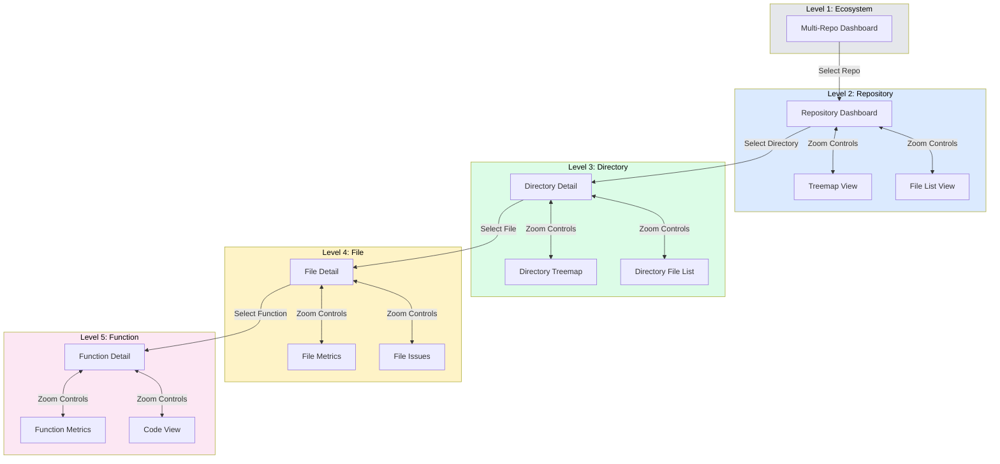

# Five-Level Zoom Navigation

## User Story

**As a developer navigating a large codebase**, I want consistent zoom controls that let me move between codebase scales (repository -> directory -> file -> function -> line), so that I can maintain context while drilling into details.

## User Need

Large codebases require navigation at multiple scales. Developers constantly shift between:

- "How healthy is the overall codebase?"
- "Which directory has problems?"
- "What's wrong with this file?"
- "Which function is the culprit?"
- "What line should I change?"

Without consistent zoom controls, users get lost. They lose context when drilling down and struggle to zoom back out. Mental models fragment across disconnected views.

The five-level zoom provides a unified navigation paradigm that:

- Works the same way in every view
- Preserves context across zoom levels
- Enables fluid movement in both directions
- Shows current position in the hierarchy

---

## UX Flow

### Entry Points

This is not a destination view but a navigation system that applies across all views.

### User Journey



### Exit Points

Every view supports:

- Zoom out: Return to parent level
- Zoom in: Drill into child level
- Jump: Navigate directly to any level via breadcrumb
- Search: Find items at any level via Cmd+K

---

## Information Architecture

### Zoom Level Definitions

| Level | Name       | Scope                 | Example View        | Primary Action           |
| ----- | ---------- | --------------------- | ------------------- | ------------------------ |
| 1     | Ecosystem  | Multiple repositories | Workspace dashboard | Select repository        |
| 2     | Repository | Entire codebase       | Main dashboard      | Select directory or file |
| 3     | Directory  | Single directory tree | Directory detail    | Select file              |
| 4     | File       | Single file           | File detail         | Select function          |
| 5     | Function   | Single abstraction    | Function metrics    | Edit code                |

### Context Preservation

Each zoom level preserves:

- **Filters:** File type, severity, and other active filters
- **Sort order:** Current sorting preference
- **Selection:** Multi-select state for batch operations
- **Scroll position:** Restored when zooming back out

### Breadcrumb Structure

```
Workspace > my-app > src/components > DataTable.tsx > handleSort()
   L1         L2          L3              L4             L5
```

Clicking any segment navigates directly to that level while preserving descendant context (e.g., clicking L2 from L5 remembers which directory was selected).

---

## Interaction Patterns

### Zoom Controls

| Action            | Keyboard            | Mouse                    | Touch       |
| ----------------- | ------------------- | ------------------------ | ----------- |
| Zoom In           | Enter / Right Arrow | Double-click item        | Tap item    |
| Zoom Out          | Escape / Left Arrow | Click breadcrumb         | Swipe right |
| Jump to Level     | Cmd+1 through Cmd+5 | Click breadcrumb segment | N/A         |
| Home (Repository) | Cmd+H               | Click repository name    | N/A         |

### Consistent Gestures

These gestures work identically across all views:

**Click:**

- Single click: Select (for context panel)
- Double click: Zoom in
- Cmd+click: Add to multi-selection

**Keyboard:**

- Arrow keys: Navigate within current level
- Enter: Zoom into selected item
- Escape: Zoom out one level
- Backspace: Same as Escape

**Scroll:**

- Vertical scroll: Navigate within level
- Horizontal scroll (or shift+scroll): Pan large visualizations

### Visual Feedback

**Current Level Indicator:**

- Breadcrumb shows current position
- Level number badge in toolbar
- Zoom slider shows current level

**Transition Animations:**

- Zoom in: Content expands from click point
- Zoom out: Content contracts toward parent
- Duration: 300ms ease-out
- Context preserved during transition

---

## Visual Concepts

### Breadcrumb with Zoom Slider

```
+--------------------------------------------------------------------------+
| [<] Workspace > my-app > src/components > DataTable.tsx                   |
+--------------------------------------------------------------------------+
|                                                                           |
| Zoom: [1]----[2]----[3]----[4]----[5]                                    |
|              Repo   Dir   File   Func                                     |
|                            ^                                              |
|                       Current Level                                       |
+--------------------------------------------------------------------------+
```

### Level Transition Animation Concept

```
State 1: Repository View (Level 2)
+------------------------------------------------------------------+
|  [src/]              [lib/]              [tests/]                 |
|  +--------+          +--------+          +--------+               |
|  | comp/  |          | utils/ |          | unit/  |               |
|  | hooks/ |          | api/   |          | e2e/   |               |
|  +--------+          +--------+          +--------+               |
+------------------------------------------------------------------+

User double-clicks "comp/"

State 2: Transition (200ms)
+------------------------------------------------------------------+
|                                                                   |
|           +-----------------------------------+                    |
|           |  comp/ (expanding)               |                    |
|           |  +------+  +------+  +------+    |                    |
|           |  |Button|  |Table |  |Modal |    |                    |
|           +-----------------------------------+                    |
|                                                                   |
+------------------------------------------------------------------+

State 3: Directory View (Level 3)
+------------------------------------------------------------------+
|  Breadcrumb: Workspace > my-app > src/components                  |
+------------------------------------------------------------------+
|  +--------+    +--------+    +--------+    +--------+             |
|  | Button |    | Table  |    | Modal  |    | Form   |             |
|  | .tsx   |    | .tsx   |    | .tsx   |    | .tsx   |             |
|  +--------+    +--------+    +--------+    +--------+             |
|  +--------+    +--------+    +--------+                           |
|  | Input  |    | Select |    | Card   |                           |
|  | .tsx   |    | .tsx   |    | .tsx   |                           |
|  +--------+    +--------+    +--------+                           |
+------------------------------------------------------------------+
```

### Context Panel (Any Level)

```
+------------------------------------------------------------------+
|                                    |                              |
|  [Current Level Content]           |  Context Panel               |
|                                    |  ========================    |
|                                    |                              |
|                                    |  Selected: DataTable.tsx     |
|                                    |                              |
|                                    |  Quick Stats:                |
|                                    |  - Complexity: 45            |
|                                    |  - Lines: 234                |
|                                    |  - Issues: 3                 |
|                                    |                              |
|                                    |  [Zoom In]  [Open in IDE]    |
|                                    |                              |
+-----------------------------------+------------------------------+
                  60%                           40%
```

---

## Psychological Principles

### Spatial Memory

Users build mental maps of information spaces. Consistent zoom navigation leverages spatial memory:

- "Down" means more detail
- "Up" means more context
- Position in hierarchy is always visible

### Progressive Disclosure

Each zoom level reveals appropriate detail:

- Level 1-2: Aggregate metrics, trends
- Level 3: File-level metrics
- Level 4: Function-level detail
- Level 5: Line-by-line analysis

### Recognition over Recall

Breadcrumbs and zoom controls are always visible, eliminating the need to remember navigation paths.

### Undo Safety

Escape always works to zoom out. Users can explore confidently knowing they can easily return.

---

## Success Metrics

| Metric                | Target      | Measurement                                      |
| --------------------- | ----------- | ------------------------------------------------ |
| Navigation efficiency | < 3 clicks  | Average clicks to reach any level from any other |
| Context retention     | > 90%       | Users return to correct context when zooming out |
| Gesture consistency   | 100%        | Same gesture produces same action across views   |
| Learning curve        | < 5 minutes | Time for new user to navigate all 5 levels       |

---

## Integration with Broader Application

### Feature Dependencies

**Requires:**

- None (foundational feature)

**Enables:**

- All visualization features (Blast Radius, Quadrant, etc.)
- Progressive Disclosure (US-NEW-06)
- Multi-Repository Workspace (US-NEW-10)

### Implementation Scope

This feature affects:

1. **Navigation architecture:** React Router configuration for level-based routing
2. **State management:** Zustand store for zoom state, context preservation
3. **Animation system:** Framer Motion or CSS transitions for zoom effects
4. **Keyboard handling:** Global keyboard event listeners
5. **Breadcrumb component:** Reusable navigation component

### Shared Components

| Component      | Purpose                           | Scope  |
| -------------- | --------------------------------- | ------ |
| ZoomBreadcrumb | Display and navigate hierarchy    | Global |
| ZoomSlider     | Visual level indicator            | Global |
| ZoomContainer  | Manage zoom state and transitions | Global |
| ContextPanel   | Show selected item details        | Global |

### Route Structure

```typescript
// React Router configuration
const routes = [
  { path: '/', element: <Dashboard /> },  // Level 2 default
  { path: '/workspace', element: <WorkspaceDashboard /> },  // Level 1
  { path: '/directory/:path', element: <DirectoryDetail /> },  // Level 3
  { path: '/file/:path', element: <FileDetail /> },  // Level 4
  { path: '/file/:path/function/:name', element: <FunctionDetail /> },  // Level 5
];
```

---

## Open Questions

1. **Level 1 availability:** Should Level 1 (Ecosystem) be visible even with single repository, or only appear when multiple repos are in workspace?

2. **Keyboard discoverability:** How do we teach users about Cmd+1-5 shortcuts? Tooltip? Onboarding?

3. **Mobile adaptation:** On small screens, should zoom levels stack differently? Fewer levels visible?

4. **Animation performance:** Can we maintain 60fps transitions on large repositories (10,000+ files)?

5. **Deep linking:** Should URLs encode full zoom state, allowing sharing of specific views at specific levels?
