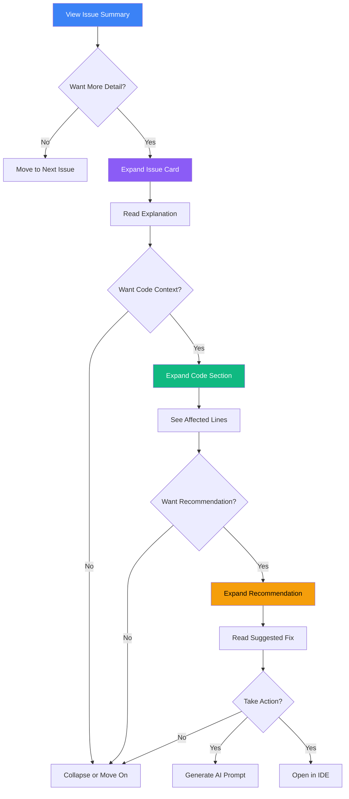

# Progressive Disclosure with Expandable Insights

## User Story

**As a developer reviewing complexity metrics**, I want insights to expand progressively (summary -> detail -> code -> recommendation), so that I'm not overwhelmed with information but can access depth when needed.

## User Need

Analysis tools typically fall into two traps:

1. **Too shallow:** Show a score without explanation
2. **Too deep:** Dump all data at once, overwhelming the user

Developers need to start with "what's the issue?" and progressively reveal "why does it matter?", "where in the code?", and "what should I do?"

Progressive disclosure respects cognitive limits:

- Working memory holds 7 +/- 2 items
- Attention is finite
- Context switching is expensive

By revealing information in layers, we let users control their depth of investigation.

---

## UX Flow

### Entry Points

This is a design pattern, not a destination. It applies wherever insights are displayed:

- Dashboard issue cards
- File detail issue list
- Architectural anti-pattern details
- Complexity explanations

### User Journey



### Exit Points

From any level:

- Collapse and continue browsing
- Take action (prompt, IDE, exclude)
- Navigate to related entity (file, dependency, etc.)

---

## Information Architecture

### Disclosure Levels

| Level | Name           | Content                 | Trigger                  |
| ----- | -------------- | ----------------------- | ------------------------ |
| 0     | Badge          | Icon + count            | Always visible           |
| 1     | Summary        | Title + severity        | Default expanded         |
| 2     | Explanation    | Why this matters        | Click to expand          |
| 3     | Code Context   | Affected lines          | Click to expand          |
| 4     | Recommendation | What to do              | Click to expand          |
| 5     | Actions        | AI prompt, IDE, exclude | Always visible at bottom |

### Content at Each Level

**Level 0 - Badge:**

```
[3 issues]
```

**Level 1 - Summary:**

```
High Cyclomatic Complexity (45)
Warning | src/services/auth.ts
```

**Level 2 - Explanation:**

```
This function has 45 independent paths, making it difficult to test
and maintain. Industry standard recommends keeping complexity below 10.
High complexity often indicates the function is doing too many things.
```

**Level 3 - Code Context:**

```typescript
// Lines 45-89: Multiple nested conditions
if (user.isActive) {
  if (user.hasPermission('read')) {
    if (user.subscription.isValid()) {
      // ... 15 more levels of nesting
    }
  }
}
```

**Level 4 - Recommendation:**

```
Consider extracting conditions into separate functions:
1. Create validateUserAccess(user) for authentication checks
2. Create validateSubscription(user) for subscription logic
3. Use early returns to reduce nesting depth

Estimated effort: 1-2 hours
```

**Level 5 - Actions:**

```
[Generate AI Prompt]  [Open in IDE]  [Mark as Accepted]
```

---

## Interaction Patterns

### Expand/Collapse Controls

| Action           | Trigger             | Result                         |
| ---------------- | ------------------- | ------------------------------ |
| Expand one level | Click expand icon   | Reveal next level              |
| Expand all       | Shift+click         | Reveal all levels              |
| Collapse         | Click collapse icon | Hide expanded content          |
| Collapse all     | Escape              | Collapse all expanded insights |

### Keyboard Navigation

| Key       | Action                          |
| --------- | ------------------------------- |
| Tab       | Move to next insight            |
| Shift+Tab | Move to previous insight        |
| Enter     | Expand/collapse current insight |
| Space     | Toggle expansion                |
| Escape    | Collapse and move to parent     |

### State Persistence

- Expansion state persists within session
- Commonly expanded items remember preference
- Bulk operations remember which items were selected

---

## Visual Concepts

### Insight Card - All States

```
STATE 1: Collapsed (Level 1)
+------------------------------------------------------------------+
| [!] High Cyclomatic Complexity (45)          [v] Expand          |
|     Warning | src/services/auth.ts:45                            |
+------------------------------------------------------------------+

STATE 2: Expanded to Level 2 (Explanation)
+------------------------------------------------------------------+
| [!] High Cyclomatic Complexity (45)          [^] Collapse        |
|     Warning | src/services/auth.ts:45                            |
+------------------------------------------------------------------+
|                                                                   |
| This function has 45 independent paths, making it difficult to   |
| test and maintain. Industry standard recommends keeping          |
| complexity below 10.                                             |
|                                                                   |
| [Show Code]  [Show Recommendation]                                |
+------------------------------------------------------------------+

STATE 3: Expanded to Level 3 (Code)
+------------------------------------------------------------------+
| [!] High Cyclomatic Complexity (45)          [^] Collapse        |
|     Warning | src/services/auth.ts:45                            |
+------------------------------------------------------------------+
|                                                                   |
| This function has 45 independent paths...                        |
|                                                                   |
| [Hide Code]  [Show Recommendation]                                |
|                                                                   |
| +------------------------------------------------------------+   |
| | 45 |  if (user.isActive) {                                 |   |
| | 46 |    if (user.hasPermission('read')) {                  |   |
| | 47 |      if (user.subscription.isValid()) {               |   |
| | .. |        // ... more conditions                         |   |
| | 89 |  }                                                    |   |
| +------------------------------------------------------------+   |
|                                                                   |
+------------------------------------------------------------------+

STATE 4: Fully Expanded (All Levels)
+------------------------------------------------------------------+
| [!] High Cyclomatic Complexity (45)          [^] Collapse All    |
|     Warning | src/services/auth.ts:45                            |
+------------------------------------------------------------------+
|                                                                   |
| This function has 45 independent paths...                        |
|                                                                   |
| [Hide Code]  [Hide Recommendation]                                |
|                                                                   |
| +------------------------------------------------------------+   |
| | 45 |  if (user.isActive) {                                 |   |
| | .. |        // ... code preview                            |   |
| +------------------------------------------------------------+   |
|                                                                   |
| RECOMMENDATION                                                    |
| Consider extracting conditions into separate functions:          |
| 1. Create validateUserAccess(user) for authentication checks     |
| 2. Create validateSubscription(user) for subscription logic      |
| 3. Use early returns to reduce nesting depth                     |
|                                                                   |
| Estimated effort: 1-2 hours                                      |
|                                                                   |
+------------------------------------------------------------------+
| [Generate AI Prompt]    [Open in IDE]    [Mark as Accepted]      |
+------------------------------------------------------------------+
```

### Multiple Insights (Mixed Expansion States)

```
Issues in src/services/auth.ts (3)
================================================================================

+------------------------------------------------------------------+
| [!] High Cyclomatic Complexity (45)          [^] Collapse        |
|     Warning | Line 45                                            |
|                                                                   |
| This function has 45 independent paths...                        |
| [Show Code]  [Show Recommendation]                                |
+------------------------------------------------------------------+

+------------------------------------------------------------------+
| [!] Missing Error Handling                   [v] Expand          |
|     Warning | Line 78                                            |
+------------------------------------------------------------------+

+------------------------------------------------------------------+
| [i] Long Function                            [v] Expand          |
|     Info | Line 45-120                                           |
+------------------------------------------------------------------+

================================================================================
[Expand All]  [Collapse All]  [Export Issues]
================================================================================
```

---

## Psychological Principles

### Cognitive Load Management

Each disclosure level adds cognitive load. By controlling revelation:

- Users process at their own pace
- Important information (summary) is never hidden
- Detail is available but not mandatory

### Information Scent

Expand buttons signal that more content exists. Users can assess:

- "Is this worth investigating further?"
- "Do I need the code context?"
- "Should I read the recommendation?"

### Progressive Commitment

Each expansion is a micro-commitment. Users invest attention incrementally:

- Low-cost: Scan summaries
- Medium-cost: Read explanations
- High-cost: Analyze code + recommendations

### Completion Satisfaction

Fully expanding an insight and taking action provides completion. The action buttons at the bottom reward investigation with clear next steps.

---

## Success Metrics

| Metric            | Target             | Measurement                            |
| ----------------- | ------------------ | -------------------------------------- |
| Scan efficiency   | > 10 issues/minute | Issues reviewed at summary level       |
| Expansion rate    | 30-50%             | Percentage of issues expanded          |
| Depth exploration | > 15%              | Issues expanded to code/recommendation |
| Action rate       | > 20%              | Issues leading to prompt/IDE/exclude   |

---

## Integration with Broader Application

### Feature Dependencies

**Requires:**

- None (foundational pattern)

**Enables:**

- Architectural AntiPatterns (US-NEW-04) - Anti-Pattern details follow this pattern
- File Detail - Issue list uses expandable cards
- Dashboard - Issue preview cards

### Implementation Scope

This pattern requires:

1. **Expandable card component:** Reusable component with animation
2. **Keyboard handling:** Focus management, expansion shortcuts
3. **State management:** Track expansion state per insight
4. **Code preview component:** Syntax-highlighted code snippets
5. **Recommendation component:** Structured recommendation display

### Shared Components

| Component             | Purpose               | States                         |
| --------------------- | --------------------- | ------------------------------ |
| InsightCard           | Container for insight | collapsed, expanding, expanded |
| InsightSummary        | Level 1 content       | Always visible                 |
| InsightExplanation    | Level 2 content       | Hidden, visible                |
| InsightCode           | Level 3 content       | Hidden, visible                |
| InsightRecommendation | Level 4 content       | Hidden, visible                |
| InsightActions        | Level 5 actions       | Always visible when expanded   |

### Animation Specifications

| Transition    | Duration | Easing   |
| ------------- | -------- | -------- |
| Expand        | 200ms    | ease-out |
| Collapse      | 150ms    | ease-in  |
| Content fade  | 100ms    | linear   |
| Height change | 200ms    | ease-out |

---

## Open Questions

1. **Default expansion level:** Should some insights start expanded based on severity? Critical = expanded, Info = collapsed?

2. **Memory management:** Should expansion states persist across sessions or reset each time?

3. **Batch expansion:** When expanding all, should there be a delay between items (cascade effect) or instant?

4. **Code preview length:** How many lines of code should preview show? Truncate with "show more" or scroll?

5. **Mobile adaptation:** On small screens, should expansion be modal (overlay) instead of inline?
