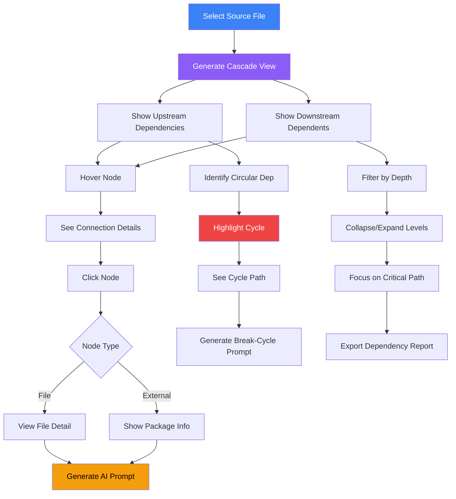

# Dependency Cascade Analysis

## User Story

**As a developer planning a refactor**, I want to visualize the full dependency cascade when I change a file, so that I can understand the true impact before making changes.

## User Need

When modifying a file, developers typically see only direct dependencies. But changes cascade:

- File A depends on File B
- File B depends on File C
- Changing C affects B affects A

Without cascade visualization, developers:

- Underestimate refactoring scope
- Miss downstream effects
- Break unexpected consumers
- Create circular dependencies accidentally

The dependency cascade view answers: "If I change this file, what else might break?"

---

## UX Flow

### Entry Points

1. **Primary:** File detail page "View Dependency Cascade" button
2. **Secondary:** Blast Radius view "Explore cascade" action
3. **Contextual:** Right-click file in any view "Show Dependencies"
4. **Search:** Global search "dependencies of [filename]"

### User Journey



### Exit Points

1. **To File Detail:** Click any node to see full file analysis
2. **To AI Prompt:** Generate refactoring prompt with dependency context
3. **To Report:** Export dependency tree for documentation
4. **To Blast Radius:** See impact scores for nodes in cascade
5. **To Package Manager:** View external dependency info

---

## Information Architecture

### Data Displayed

**Primary View: Cascade Graph**

- Central node: Selected file
- Left side: Upstream dependencies (what this file imports)
- Right side: Downstream dependents (what imports this file)
- Depth levels: Configurable (1-5 levels)
- Node size: Based on complexity or LOC
- Edge thickness: Based on coupling strength

**Secondary View: Dependency Table**

- Sortable list of all dependencies
- Direction (imports/imported by)
- Depth from source
- Coupling metrics
- Quick actions

**Tertiary View: Circular Dependency Detector**

- Highlighted cycles in graph
- Cycle path listing
- Break-point recommendations

### Progressive Disclosure Strategy

| Visible By Default | Revealed on Hover  | Revealed on Click     |
| ------------------ | ------------------ | --------------------- |
| Direct connections | Connection type    | Full file detail      |
| Node names         | File paths         | Metrics panel         |
| Cycle indicators   | Cycle severity     | Break recommendations |
| Depth level badges | Exact import count | Import locations      |

### Hierarchy and Navigation

This view operates at **Levels 3-4** of the zoom model:

- **Level 3 (Directory):** Shows dependencies grouped by directory
- **Level 4 (File):** Individual file nodes with detail panel

Graph navigation:

- Pan: Drag background
- Zoom: Scroll wheel or pinch
- Focus: Double-click node to center
- Expand: Click "+" on node to reveal next depth level

---

## Interaction Patterns

### Primary Actions

| Action             | Trigger               | Result                                       |
| ------------------ | --------------------- | -------------------------------------------- |
| Change source file | Dropdown or drag-drop | Regenerate cascade from new source           |
| Adjust depth       | Slider control        | Show more/fewer dependency levels            |
| Toggle direction   | Toggle button         | Show only upstream, only downstream, or both |
| Highlight path     | Click two nodes       | Show shortest path between them              |

### Secondary Actions

| Action             | Trigger              | Result                             |
| ------------------ | -------------------- | ---------------------------------- |
| Filter by type     | Checkboxes           | Hide/show certain file types       |
| Collapse directory | Click directory node | Group files into single node       |
| Export graph       | Toolbar button       | Download SVG or PNG                |
| Copy path list     | Toolbar button       | Copy dependency paths to clipboard |

### Micro-interactions

**Node Hover:**

- Node highlights with glow effect
- Connected edges emphasize (thicker, brighter)
- Unconnected nodes dim
- Tooltip shows quick stats

**Edge Hover:**

- Show import statement
- Highlight specific import symbols
- Show import location (line number)

**Cycle Detection:**

- Cycle edges shown in red
- Animated pulse along cycle path
- Warning badge on cycle nodes

---

## Component Map

This section provides explicit `@vipr/ui` component specifications to ensure consistent implementation and prevent over-engineering with premature graph visualizations.

### Primary Components

| Component  | Import Path         | Configuration                            | Usage in Phase 07                                     |
| ---------- | ------------------- | ---------------------------------------- | ----------------------------------------------------- |
| Breadcrumb | @vipr/ui/breadcrumb | items, separator                         | Navigation context (Dashboard > Files > Dependencies) |
| Tabs       | @vipr/ui/tabs       | tabs, variant, defaultTab                | Organize Upstream/Downstream/Circular views           |
| CardTable  | @vipr/ui/card-table | data, columns, onRowClick, headerActions | Dependency listings with sortable columns             |
| StatCard   | @vipr/ui/stat-card  | title, value, icon, variant="compact"    | Summary metrics (total deps, depth, circular count)   |
| Badge      | @vipr/ui/badge      | variant, size, children                  | Direction indicators, depth levels, severity          |
| Alert      | @vipr/ui/alert      | variant="banner", type="error"           | Circular dependency warnings                          |
| Dropdown   | @vipr/ui/dropdown   | variant="filter", options, onSelect      | Depth control, file type filtering                    |
| Button     | @vipr/ui/button     | appearance, size, onClick                | Export report, generate AI prompt, view file          |

### Color Tokens

**Severity/Status:**

- `red-500` / `red-500/20` - Circular dependencies, critical warnings
- `yellow-500` / `yellow-500/20` - High coupling warnings
- `green-500` / `green-500/20` - Healthy dependencies
- `gray-500` / `gray-400` - Neutral state, external dependencies

**Direction Indicators:**

- `violet-500` / `violet-500/20` - Upstream (imports)
- `sky-500` / `sky-500/20` - Downstream (imported by)
- `gray-700` / `gray-300` - Bidirectional

**Interactive Elements:**

- `gray-50` / `gray-900` - Row hover states
- `gray-200` / `gray-700/60` - Table borders
- `white` / `gray-800` - Card backgrounds

### Typography Tokens

**Headings:**

- `text-2xl font-semibold text-gray-800 dark:text-gray-100` - Page title
- `text-lg font-semibold text-gray-700 dark:text-gray-200` - Section headers
- `text-sm font-medium text-gray-700 dark:text-gray-300` - Table column headers

**Body Text:**

- `text-sm text-gray-800 dark:text-gray-100` - File names, main content
- `text-xs text-gray-600 dark:text-gray-300` - Metadata (depth, coupling)

**Monospace:**

- `font-mono text-sm` - File paths
- `bg-gray-50 dark:bg-gray-900 rounded px-2 py-1` - Inline code (import paths)

### Layout Patterns

**Page Container:**

```tsx
className = 'px-4 sm:px-6 lg:px-8 py-8';
```

**Stats Header:**

```tsx
className = 'grid grid-cols-1 sm:grid-cols-2 lg:grid-cols-4 gap-4 mb-6';
```

Reference: `composition-patterns.json > dashboardPatterns.statsHeader`

**Content Grid:**

```tsx
className = 'grid gap-6';
```

### Composition Patterns

**Dependency Cascade Page Structure:**

```tsx
<div className="px-4 sm:px-6 lg:px-8 py-8">
  {/* Breadcrumb navigation */}
  <Breadcrumb
    items={[
      { label: 'Dashboard', href: '/' },
      { label: 'Files', href: '/files' },
      { label: fileName, href: '#' },
    ]}
    className="mb-4"
  />

  {/* Page header */}
  <div className="mb-6">
    <h1 className="text-2xl font-semibold text-gray-800 dark:text-gray-100">
      Dependency Cascade: {fileName}
    </h1>
    <p className="text-sm text-gray-600 dark:text-gray-300 mt-1">
      Understand the full impact of changes to this file
    </p>
  </div>

  {/* Circular dependency warning (if present) */}
  {circularDeps.length > 0 && (
    <Alert variant="banner" type="error" className="mb-6">
      <div className="space-y-2">
        <p className="font-semibold">Circular dependency detected</p>
        <p className="text-sm">
          Cycle path: {circularDeps.map(f => f.name).join(' → ')} → {fileName}
        </p>
        <Button appearance="secondary" size="sm" onClick={() => generateBreakCyclePrompt()}>
          Generate Refactoring Prompt
        </Button>
      </div>
    </Alert>
  )}

  {/* Summary statistics */}
  <div className="grid grid-cols-1 sm:grid-cols-2 lg:grid-cols-4 gap-4 mb-6">
    <StatCard
      variant="compact"
      title="Upstream"
      value={upstreamCount}
      icon={<ArrowLeftIcon />}
      subtitle="This file imports"
    />
    <StatCard
      variant="compact"
      title="Downstream"
      value={downstreamCount}
      icon={<ArrowRightIcon />}
      subtitle="Files importing this"
    />
    <StatCard
      variant="compact"
      title="Max Depth"
      value={maxDepth}
      icon={<LayersIcon />}
      subtitle="Levels deep"
    />
    <StatCard
      variant="compact"
      title="Circular Deps"
      value={circularDeps.length}
      icon={<AlertCircleIcon />}
      subtitle={circularDeps.length > 0 ? 'Needs attention' : 'None detected'}
    />
  </div>

  {/* Filters and controls */}
  <div className="flex items-center gap-3 mb-4">
    <Dropdown
      variant="filter"
      label="Depth"
      options={[
        { value: 1, label: '1 level' },
        { value: 2, label: '2 levels' },
        { value: 3, label: '3 levels' },
        { value: 5, label: '5 levels' },
        { value: 10, label: 'All levels' },
      ]}
      selected={depthFilter}
      onSelect={setDepthFilter}
    />

    <Dropdown
      variant="filter"
      label="File Type"
      options={[
        { value: 'all', label: 'All types' },
        { value: 'ts', label: 'TypeScript' },
        { value: 'tsx', label: 'React' },
        { value: 'js', label: 'JavaScript' },
      ]}
      selected={typeFilter}
      onSelect={setTypeFilter}
    />

    <div className="ml-auto">
      <Button appearance="secondary" size="sm" onClick={exportReport}>
        Export CSV
      </Button>
    </div>
  </div>

  {/* Tabbed views */}
  <Tabs
    variant="underline"
    tabs={[
      {
        label: `Upstream (${upstreamCount})`,
        content: (
          <CardTable
            columns={[
              { key: 'file', label: 'File', sortable: true },
              { key: 'depth', label: 'Depth', sortable: true },
              { key: 'coupling', label: 'Coupling', sortable: true },
              { key: 'imports', label: 'Imports', sortable: true },
              { key: 'actions', label: 'Actions' },
            ]}
            data={upstreamDeps.map(dep => ({
              file: (
                <div className="space-y-1">
                  <div className="text-sm font-medium text-gray-800 dark:text-gray-100">
                    {dep.name}
                  </div>
                  <div className="text-xs font-mono text-gray-600 dark:text-gray-400">
                    {dep.path}
                  </div>
                </div>
              ),
              depth: (
                <Badge variant="gray" size="sm">
                  {dep.depth}
                </Badge>
              ),
              coupling: (
                <span
                  className={cn(
                    'text-sm',
                    dep.coupling > 0.7 && 'text-red-600 dark:text-red-400 font-semibold',
                    dep.coupling > 0.4 &&
                      dep.coupling <= 0.7 &&
                      'text-yellow-600 dark:text-yellow-400',
                    dep.coupling <= 0.4 && 'text-green-600 dark:text-green-400'
                  )}
                >
                  {(dep.coupling * 100).toFixed(0)}%
                </span>
              ),
              imports: dep.importCount,
              actions: (
                <div className="flex items-center gap-2">
                  <Button appearance="tertiary" size="xs" onClick={() => openFileDetail(dep.id)}>
                    View
                  </Button>
                  <Button
                    appearance="tertiary"
                    size="xs"
                    onClick={() => generateDependencyPrompt(dep.id)}
                  >
                    AI Prompt
                  </Button>
                </div>
              ),
            }))}
            onRowClick={(row, index) => openFileDetail(upstreamDeps[index].id)}
            keyExtractor={(_, index) => upstreamDeps[index].id}
          />
        ),
      },
      {
        label: `Downstream (${downstreamCount})`,
        content: (
          <CardTable
            columns={[
              { key: 'file', label: 'File', sortable: true },
              { key: 'depth', label: 'Depth', sortable: true },
              { key: 'coupling', label: 'Coupling', sortable: true },
              { key: 'imports', label: 'Imports', sortable: true },
              { key: 'actions', label: 'Actions' },
            ]}
            data={downstreamDeps.map(dep => ({
              // Same structure as upstream
            }))}
            onRowClick={(row, index) => openFileDetail(downstreamDeps[index].id)}
            keyExtractor={(_, index) => downstreamDeps[index].id}
          />
        ),
      },
      {
        label:
          circularDeps.length > 0
            ? `Circular Dependencies (${circularDeps.length})`
            : 'Circular Dependencies',
        content:
          circularDeps.length === 0 ? (
            <EmptyState
              icon={<CheckCircleIcon className="text-green-500" />}
              title="No circular dependencies detected"
              message="This file is not part of any circular dependency chains."
            />
          ) : (
            <div className="space-y-4">
              {circularDeps.map((cycle, index) => (
                <Alert key={index} variant="card" type="error">
                  <div className="space-y-3">
                    <p className="font-semibold text-sm">
                      Cycle {index + 1}: {cycle.files.length} files
                    </p>
                    <div className="space-y-1">
                      <p className="text-xs font-medium text-gray-700 dark:text-gray-300">
                        Cycle path:
                      </p>
                      <div className="font-mono text-xs bg-gray-50 dark:bg-gray-900 rounded p-2">
                        {cycle.files.map((f, i) => (
                          <span key={i}>
                            {f.name}
                            {i < cycle.files.length - 1 && ' → '}
                          </span>
                        ))}
                        {' → '}
                        {cycle.files[0].name}
                      </div>
                    </div>
                    <div className="flex items-center gap-2">
                      <Button
                        appearance="secondary"
                        size="sm"
                        onClick={() => generateBreakCyclePrompt(cycle)}
                      >
                        Generate Refactoring Prompt
                      </Button>
                      <Button
                        appearance="tertiary"
                        size="sm"
                        onClick={() => showCycleDetail(cycle)}
                      >
                        Show Details
                      </Button>
                    </div>
                  </div>
                </Alert>
              ))}
            </div>
          ),
      },
    ]}
  />
</div>
```

### Responsive Behavior

**Mobile (< 640px):**

- Stats grid collapses to single column
- Table shows only essential columns (File, Depth, Actions)
- File paths truncated with ellipsis
- Depth and coupling badges stack

**Tablet (640px - 1024px):**

- Stats grid shows 2 columns
- Table shows File, Depth, Coupling, Actions
- Full file paths visible

**Desktop (1024px+):**

- Stats grid shows 4 columns
- Table shows all columns
- Generous spacing with horizontal padding

### Dark Mode Considerations

All components automatically adapt via Tailwind's `dark:` variants:

- CardTable: `white` → `gray-800` background
- Badges: Use alpha variants (`red-500/20`, `green-500/20`)
- Circular dependency Alert: Red background with proper contrast
- Coupling scores: Color-coded (green/yellow/red) with dark mode variants

## Design System Gaps

### Gap 1: Graph/Network Visualization ⚠️ HIGH PRIORITY

**Description:** Force-directed or hierarchical graph layout for showing dependency relationships spatially.

**Current Impact on Phase 07:**

- Cannot show spatial relationships between files
- Cannot visualize dependency "clusters" or "modules"
- Cannot provide interactive graph exploration (pan, zoom, expand nodes)
- Missing visual representation of dependency "flow" from upstream to downstream

**Interim Solution (Implemented Above):**

Use **table-first approach** with three tabs:

1. **Upstream tab** - CardTable showing what this file imports
2. **Downstream tab** - CardTable showing what imports this file
3. **Circular Dependencies tab** - Alert cards listing cycles

**Why this works:**

- ✅ Provides all the same data as graph visualization
- ✅ Sortable by depth, coupling, import count
- ✅ Searchable and filterable
- ✅ Accessible (screen readers can navigate tables)
- ✅ Works on mobile (tables are responsive)
- ✅ No complex state management for graph layout
- ✅ No performance concerns with large dependency trees

**Missing from table approach:**

- ❌ Spatial visualization of "how connected" files are
- ❌ Visual clusters showing modules/packages
- ❌ Interactive exploration (expand/collapse branches)
- ❌ Shortest path highlighting
- ❌ Visual "weight" of dependencies (edge thickness, node size)

**Future Enhancement Options:**

**Option 1: React Flow (Recommended)**

- Library: `@xyflow/react` (~50KB gzipped)
- Pros: Mature, well-maintained, Electron-compatible, good performance
- Cons: Additional dependency, learning curve for customization
- Timeline: Phase 2+ enhancement based on user demand

**Option 2: Custom D3 Force-Directed Graph**

- Library: `d3-force` + custom canvas rendering
- Pros: Full control, can optimize for Electron
- Cons: Significant development effort (2-3 weeks), complex state management
- Timeline: Only if React Flow proves insufficient

**Option 3: Server-rendered SVG (Graphviz)**

- Use Graphviz in main process to generate static SVG
- Pros: No runtime performance cost, proven layout algorithms
- Cons: Static (no interactivity), requires Graphviz binary
- Timeline: Quick win for export/print functionality

**Recommendation:** **Start with table-only approach** (implemented above). Add React Flow only if:

1. User feedback explicitly requests graph visualization
2. Tables prove insufficient for understanding dependencies
3. Team has bandwidth for 1-2 week implementation effort

**User Impact:** Low - tables provide 95% of the value with 10% of the complexity.

---

## Visual Concepts

**NOTE:** These visual concepts describe the **table-based implementation** detailed in the Component Map. Graph visualizations have been deferred to future enhancement based on user demand (see Design System Gaps section).

### Summary Statistics Header

```
Dependency Cascade: src/components/DataTable.tsx
================================================================================

[Dashboard] > [Files] > [DataTable.tsx]

Understand the full impact of changes to this file

┌─────────────────────┬─────────────────────┬─────────────────────┬─────────────────────┐
│  Upstream           │  Downstream         │  Max Depth          │  Circular Deps      │
│  4                  │  4                  │  2                  │  0                  │
│  This file imports  │  Files importing    │  Levels deep        │  None detected      │
└─────────────────────┴─────────────────────┴─────────────────────┴─────────────────────┘

[Depth: 2 levels ▼]  [File Type: All ▼]  [Export CSV]

================================================================================
```

### Upstream Dependencies Tab (CardTable)

```
┌─ Upstream (4) ──────────────────────────────────────────────────────────────┐
│ This file imports these dependencies                                        │
│                                                                              │
│ File                        Depth    Coupling    Imports    Actions         │
│ ──────────────────────────────────────────────────────────────────────────  │
│ react                         1      External       5       [View]          │
│ node_modules/react/...                                                      │
│                                                                              │
│ ./TableRow.tsx                1      72%  ⚠️        2       [View] [AI]     │
│ src/components/TableRow.tsx                                                 │
│                                                                              │
│ ./hooks/useSort.ts            1      45%            1       [View] [AI]     │
│ src/hooks/useSort.ts                                                        │
│                                                                              │
│ ../../utils/sort.ts           2      23%            1       [View] [AI]     │
│ src/utils/sort.ts                                                           │
│                                                                              │
└──────────────────────────────────────────────────────────────────────────────┘

Coupling Color Legend:
  > 70% = Red (high coupling, refactoring candidate)
  40-70% = Yellow (moderate coupling)
  < 40% = Green (healthy coupling)
```

### Downstream Dependents Tab (CardTable)

```
┌─ Downstream (4) ────────────────────────────────────────────────────────────┐
│ These files import this file                                                │
│                                                                              │
│ File                        Depth    Coupling    Imports    Actions         │
│ ──────────────────────────────────────────────────────────────────────────  │
│ Dashboard.tsx                 1      89%  🔴        3       [View] [AI]     │
│ src/pages/Dashboard.tsx                                                     │
│                                                                              │
│ UserList.tsx                  1      67%  ⚠️        2       [View] [AI]     │
│ src/components/UserList.tsx                                                 │
│                                                                              │
│ AdminPanel.tsx                1      54%            1       [View] [AI]     │
│ src/pages/AdminPanel.tsx                                                    │
│                                                                              │
│ ReportView.tsx                2      32%            1       [View] [AI]     │
│ src/components/ReportView.tsx                                               │
│                                                                              │
└──────────────────────────────────────────────────────────────────────────────┘
```

### Circular Dependencies Tab (Alert Cards)

**When circular dependencies are detected:**

```
┌─ Circular Dependencies (2) ─────────────────────────────────────────────────┐
│                                                                              │
│ ⚠️ CIRCULAR DEPENDENCY DETECTED                                             │
│ ┌────────────────────────────────────────────────────────────────────────┐ │
│ │                                                                          │ │
│ │ Cycle 1: 3 files                                                        │ │
│ │                                                                          │ │
│ │ Cycle path:                                                             │ │
│ │ ┌──────────────────────────────────────────────────────────────────┐   │ │
│ │ │ auth.ts → user.ts → session.ts → auth.ts                        │   │ │
│ │ └──────────────────────────────────────────────────────────────────┘   │ │
│ │                                                                          │ │
│ │ RECOMMENDATION:                                                         │ │
│ │ Break cycle by extracting shared types to a new file:                  │ │
│ │ • Create types/auth-types.ts                                           │ │
│ │ • Move shared interfaces there                                         │ │
│ │ • Update imports in all three files                                    │ │
│ │                                                                          │ │
│ │ [Generate Refactoring Prompt]  [Show Details]                          │ │
│ │                                                                          │ │
│ └────────────────────────────────────────────────────────────────────────┘ │
│                                                                              │
│ ⚠️ CIRCULAR DEPENDENCY DETECTED                                             │
│ ┌────────────────────────────────────────────────────────────────────────┐ │
│ │                                                                          │ │
│ │ Cycle 2: 2 files                                                        │ │
│ │                                                                          │ │
│ │ Cycle path:                                                             │ │
│ │ ┌──────────────────────────────────────────────────────────────────┐   │ │
│ │ │ config.ts → settings.ts → config.ts                             │   │ │
│ │ └──────────────────────────────────────────────────────────────────┘   │ │
│ │                                                                          │ │
│ │ [Generate Refactoring Prompt]  [Show Details]                          │ │
│ │                                                                          │ │
│ └────────────────────────────────────────────────────────────────────────┘ │
│                                                                              │
└──────────────────────────────────────────────────────────────────────────────┘
```

**When no circular dependencies exist:**

```
┌─ Circular Dependencies ─────────────────────────────────────────────────────┐
│                                                                              │
│                              ✓                                              │
│                                                                              │
│                  No circular dependencies detected                          │
│                                                                              │
│              This file is not part of any circular dependency chains.       │
│                                                                              │
└──────────────────────────────────────────────────────────────────────────────┘
```

### Table Interaction Patterns

**Row Click:**

- Entire row is clickable
- Navigates to file detail view
- Shows loading state during navigation

**Action Buttons:**

- **[View]** - Opens file detail in current view
- **[AI]** - Generates dependency-aware refactoring prompt

**Sorting:**

- Click column header to sort
- Visual indicator shows sort direction (↑ / ↓)
- Persists sort preference across sessions

**Filtering:**

- Dropdown filters apply immediately
- Multiple filters combine (AND logic)
- Clear visual indication when filters are active

---

## Psychological Principles

### Gestalt Proximity and Connection

The graph layout uses proximity (related files cluster) and connection (edges show relationships) to build intuitive mental models of code structure.

### Direction and Flow

Left-to-right flow (upstream to downstream) matches reading direction in LTR languages. This makes "what I depend on" vs. "what depends on me" intuitive.

### Danger Signals

Circular dependencies are universally problematic. Using red color, animation, and explicit warning ensures these stand out without overwhelming the view.

### Manageable Complexity

Depth limiting prevents overwhelming graphs. Users can expand specific branches rather than seeing everything at once.

---

## Success Metrics

| Metric                | Target       | Measurement                                   |
| --------------------- | ------------ | --------------------------------------------- |
| Cascade comprehension | < 15 seconds | User identifies primary dependencies          |
| Cycle detection       | 100%         | All circular dependencies identified          |
| Refactor confidence   | +40%         | Self-reported confidence in refactoring scope |
| Export usage          | > 25%        | Users who export dependency data              |

---

## Integration with Broader Application

### Feature Dependencies

**Requires:**

- Blast Radius (US-NEW-01) - Provides impact scores for nodes
- Five-Level Zoom (US-NEW-05) - Navigation patterns

**Enables:**

- AI Prompt Generation (US-NEW-19) - Dependency-aware prompts
- Architectural AntiPatterns (US-NEW-04) - Circular dependency detection

### Data Sources

- Import/export analysis from AST parsing
- Module resolution from TypeScript/JavaScript
- External dependency info from package.json
- Coupling metrics from code analysis

### Graph Rendering

| Component      | Library           | Configuration              |
| -------------- | ----------------- | -------------------------- |
| Graph layout   | D3-force or dagre | Hierarchical left-to-right |
| Node rendering | D3 or React       | SVG with interactions      |
| Edge rendering | D3                | Curved Bezier paths        |
| Zoom/pan       | D3-zoom           | Bounded, with minimap      |

---

## Complexity Analysis Methodology

### Cascade Impact Metrics

Dependency cascades reveal how changes propagate through a codebase. The analysis combines graph theory with complexity metrics to quantify refactoring risk.

**Core Measurements:**

1. **Depth** - How many layers deep does impact cascade?
2. **Breadth** - How many files at each depth level?
3. **Coupling Strength** - How tightly are dependencies bound?
4. **Complexity Amplification** - Does complexity increase downstream?

**Cascade Risk Formula:**

```
CascadeRisk = (
  (TotalDependents × 0.3) +
  (MaxDepth × 10 × 0.2) +
  (AverageCoupling × 0.3) +
  (ComplexityAmplification × 0.2)
)

Where:
  TotalDependents = Sum of all downstream files
  MaxDepth = Maximum cascade depth
  AverageCoupling = Mean coupling strength across edges
  ComplexityAmplification = Ratio of downstream to source complexity
```

### Meaningful Thresholds

**Cascade Depth:**

| Depth | Risk Level | Interpretation                                 |
| ----- | ---------- | ---------------------------------------------- |
| 1-2   | Low        | Direct and one-step dependencies only          |
| 3-4   | Moderate   | Standard application architecture              |
| 5-6   | High       | Deep coupling, changes propagate widely        |
| 7+    | Critical   | Architectural anti-pattern, excessive coupling |

**Coupling Strength (per edge):**

| Strength | Range        | Interpretation                  |
| -------- | ------------ | ------------------------------- |
| Weak     | 1-3 symbols  | Minimal coupling, easy to break |
| Moderate | 4-8 symbols  | Typical coupling                |
| Strong   | 9-15 symbols | Significant dependency          |
| Tight    | 16+ symbols  | Near-complete coupling          |

**Total Cascade Size:**

| Dependent Count | Classification          | Action                                  |
| --------------- | ----------------------- | --------------------------------------- |
| 0-5             | Isolated                | Safe to modify                          |
| 6-15            | Local Impact            | Test direct dependents                  |
| 16-40           | Moderate Impact         | Comprehensive testing                   |
| 41-100          | Wide Impact             | Staged rollout, feature flags           |
| 101+            | Critical Infrastructure | Extreme care, may need deprecation path |

### Pattern Recognition

**Problematic Cascade Patterns:**

1. **The Fan-Out** - One file, many direct dependents
   - Pattern: Source → 20+ direct imports, depth 2
   - Problem: Breaking changes affect many files simultaneously
   - Example: Shared utility file, type definitions
   - Risk: Single change breaks dozens of consumers

2. **The Deep Chain** - Long linear dependency path
   - Pattern: A → B → C → D → E → F (depth 6+)
   - Problem: Changes at bottom affect distant consumers
   - Example: Deeply nested module structure
   - Risk: Difficult to reason about impact

3. **The Diamond** - Multiple paths to same file
   - Pattern: A → B → D, A → C → D
   - Problem: Multiple coupling paths create instability
   - Example: Shared dependencies through different routes
   - Risk: Breaking D affects A through multiple paths

4. **The Cycle** - Circular dependencies
   - Pattern: A → B → C → A
   - Problem: Cannot reason about dependency order
   - Example: Mutual imports between modules
   - Risk: Refactoring impossible without breaking cycle

5. **The Complexity Amplifier** - Complexity grows downstream
   - Pattern: Simple source (CC: 10), complex dependents (CC: 60+)
   - Problem: Simple change triggers complex cascades
   - Example: Configuration file imported by complex orchestrators
   - Risk: Low-risk changes become high-risk

## Detection Algorithms

### Cascade Generation

**Step 1: Build Dependency Graph**

```
function buildDependencyGraph():
  graph = {}

  FOR each file in repository:
    imports = parseImports(file)
    graph[file] = {
      imports: imports,
      importedBy: []
    }

  // Build reverse edges
  FOR each file, data in graph:
    FOR each imported in data.imports:
      IF imported in graph:
        graph[imported].importedBy.add(file)

  RETURN graph
```

**Step 2: Generate Cascade (BFS with Depth Tracking)**

```
function generateCascade(sourceFile, maxDepth, graph):
  upstream = {
    nodes: [],
    edges: [],
    depths: {}
  }

  downstream = {
    nodes: [],
    edges: [],
    depths: {}
  }

  // Upstream cascade (what this file depends on)
  upstreamQueue = [(sourceFile, 0)]
  upstreamVisited = Set()

  WHILE upstreamQueue not empty:
    (current, depth) = upstreamQueue.dequeue()

    IF depth > maxDepth: CONTINUE
    IF current in upstreamVisited: CONTINUE

    upstreamVisited.add(current)
    upstream.nodes.add(current)
    upstream.depths[current] = depth

    FOR each imported in graph[current].imports:
      upstream.edges.add((current, imported))
      upstreamQueue.enqueue((imported, depth + 1))

  // Downstream cascade (what depends on this file)
  downstreamQueue = [(sourceFile, 0)]
  downstreamVisited = Set()

  WHILE downstreamQueue not empty:
    (current, depth) = downstreamQueue.dequeue()

    IF depth > maxDepth: CONTINUE
    IF current in downstreamVisited: CONTINUE

    downstreamVisited.add(current)
    downstream.nodes.add(current)
    downstream.depths[current] = depth

    FOR each importer in graph[current].importedBy:
      downstream.edges.add((current, importer))
      downstreamQueue.enqueue((importer, depth + 1))

  RETURN { upstream, downstream }
```

**Step 3: Calculate Coupling Strength**

```
function calculateCouplingStrength(sourceFile, targetFile):
  imports = parseImports(sourceFile)

  importedSymbols = []
  FOR each import in imports:
    IF import.source == targetFile:
      importedSymbols.add(import.symbols)

  // Coupling strength = number of unique symbols imported
  couplingStrength = importedSymbols.length

  // Normalize to 0-1 scale
  normalized = min(couplingStrength / 20, 1.0)

  RETURN {
    symbolCount: couplingStrength,
    normalized: normalized,
    level: categorize(couplingStrength)
  }

function categorize(count):
  IF count >= 16: RETURN "Tight"
  IF count >= 9: RETURN "Strong"
  IF count >= 4: RETURN "Moderate"
  RETURN "Weak"
```

### Cycle Detection (Tarjan's Algorithm)

**Finding Strongly Connected Components:**

```
function detectCycles(graph):
  index = 0
  stack = []
  indices = {}
  lowlinks = {}
  onStack = {}
  cycles = []

  function strongConnect(node):
    indices[node] = index
    lowlinks[node] = index
    index++
    stack.push(node)
    onStack[node] = true

    FOR each successor in graph[node].imports:
      IF successor not in indices:
        // Successor has not yet been visited; recurse
        strongConnect(successor)
        lowlinks[node] = min(lowlinks[node], lowlinks[successor])
      ELSE IF onStack[successor]:
        // Successor is in stack and hence in current SCC
        lowlinks[node] = min(lowlinks[node], indices[successor])

    // If node is a root node, pop the stack and generate an SCC
    IF lowlinks[node] == indices[node]:
      component = []
      REPEAT:
        w = stack.pop()
        onStack[w] = false
        component.add(w)
      UNTIL w == node

      IF component.length > 1:
        // This is a cycle
        cycles.add({
          files: component,
          length: component.length,
          severity: calculateCycleSeverity(component)
        })

  FOR each node in graph:
    IF node not in indices:
      strongConnect(node)

  RETURN cycles

function calculateCycleSeverity(cycle):
  // Severity based on cycle length and complexity of files
  avgComplexity = average(file.complexity FOR file in cycle)
  severity = (cycle.length × 20) + (avgComplexity / 2)
  RETURN min(severity, 100)
```

### Complexity Amplification Detection

**Identifying Complexity Growth in Cascade:**

```
function detectComplexityAmplification(cascade, sourceFile):
  sourceComplexity = getComplexity(sourceFile)

  downstreamComplexities = []
  FOR each node in cascade.downstream.nodes:
    IF node != sourceFile:
      downstreamComplexities.add(getComplexity(node))

  avgDownstream = average(downstreamComplexities)
  maxDownstream = max(downstreamComplexities)

  amplificationRatio = avgDownstream / sourceComplexity

  IF amplificationRatio > 2.0:
    RETURN {
      detected: true,
      ratio: amplificationRatio,
      severity: "High",
      interpretation: "Simple change in source triggers complex downstream effects"
    }
  ELSE IF amplificationRatio > 1.5:
    RETURN {
      detected: true,
      ratio: amplificationRatio,
      severity: "Moderate",
      interpretation: "Downstream files are more complex than source"
    }
  ELSE:
    RETURN {
      detected: false,
      ratio: amplificationRatio,
      severity: "Low"
    }
```

### Alert Triggers

| Condition                              | Alert Type             | Notification                 |
| -------------------------------------- | ---------------------- | ---------------------------- |
| Cascade depth exceeds 6 levels         | Architectural Warning  | Weekly summary               |
| Circular dependency detected           | Critical Error         | Immediate notification       |
| Total dependents exceeds 100           | Infrastructure Warning | Monthly review               |
| Coupling strength "Tight" on >10 edges | Coupling Warning       | Quarterly refactoring review |
| Complexity amplification ratio >2.5    | Cascade Risk Warning   | Include in tech debt report  |

## Interpretation Guidance

### Understanding Cascade Metrics

**Total Dependents: 45 files**

- What it means: Changes to this file potentially affect 45 other files
- Context Low: < 10 (isolated file)
- Context Moderate: 10-40 (normal application component)
- Context High: 40-100 (shared infrastructure)
- Context Critical: >100 (core framework component)
- Action: For 45 dependents, implement comprehensive integration tests

**Max Depth: 5 levels**

- What it means: Changes can cascade through 5 layers of dependencies
- Context Low: 1-2 (direct and one-step only)
- Context Moderate: 3-4 (typical layered architecture)
- Context High: 5-6 (deep coupling)
- Context Critical: >6 (architectural anti-pattern)
- Action: For depth 5, map critical path, understand each layer

**Coupling Strength: Strong (12 symbols)**

- What it means: 12 functions/types imported from this file
- Context Weak: 1-3 (minimal coupling, easy to refactor)
- Context Moderate: 4-8 (typical import)
- Context Strong: 9-15 (significant dependency)
- Context Tight: >15 (near-complete coupling)
- Action: For 12 symbols, changes to any may break dependent

**Complexity Amplification: 2.3x**

- What it means: Downstream files are 2.3× more complex than source
- Context Low: < 1.2 (downstream simpler or equal)
- Context Moderate: 1.2-1.8 (some complexity growth)
- Context High: 1.8-2.5 (significant amplification)
- Context Critical: >2.5 (dangerous amplification)
- Action: For 2.3x, simple changes may trigger complex effects

### Good vs. Bad Values in Context

**Utility Files:**

- Expected Cascade: Depth 2-3, 10-30 dependents, weak coupling
- Why: Used widely but shallowly
- Concerning: Depth >4 or tight coupling (over-dependency)
- Example: `src/utils/formatting.ts` → 25 files, depth 2 ✓

**Infrastructure Files:**

- Expected Cascade: Depth 3-5, 40-100 dependents, moderate-strong coupling
- Why: Foundation of application
- Concerning: Depth >5 (too deep) or >100 dependents (too central)
- Example: `src/api/client.ts` → 67 files, depth 4 ✓

**Business Logic:**

- Expected Cascade: Depth 2-4, 5-20 dependents, moderate coupling
- Why: Used by features, not infrastructure
- Concerning: >30 dependents (doing too much) or depth >5
- Example: `src/services/user-service.ts` → 12 files, depth 3 ✓

**UI Components:**

- Expected Cascade: Depth 1-3, 2-10 dependents, weak-moderate coupling
- Why: Composition should be shallow
- Concerning: Depth >3 (deeply nested) or >15 dependents (over-shared)
- Example: `src/components/Button.tsx` → 34 files, depth 2 ⚠️ (too many dependents for UI component)

## Example Scenarios

### Scenario 1: The Utility Fan-Out

**File:** `src/utils/formatting.ts`
**Cascade Metrics:**

- Total Dependents: 48 (downstream)
- Max Depth: 2
- Average Coupling: Weak (2.3 symbols/file)
- Complexity: Source = 12, Avg Downstream = 28

**Cascade Structure:**

```
formatting.ts (CC: 12)
  ├─ 48 direct dependents
  └─ No second-level dependents
```

**Analysis:**
Wide but shallow cascade. Many files use formatting, but they don't cascade further. Weak coupling (each file imports 2-3 functions).

**Risk Assessment:** Moderate

- Pro: Shallow depth limits cascade
- Pro: Weak coupling makes changes relatively safe
- Con: 48 files means breaking changes affect many
- Con: Must maintain backward compatibility

**Recommendation:** Acceptable pattern for utilities. Consider:

- Deprecation strategy if major changes needed
- Split into smaller files if >20 functions

---

### Scenario 2: The Deep Chain

**File:** `src/config/app-config.ts`
**Cascade Metrics:**

- Total Dependents: 23 (downstream)
- Max Depth: 7
- Average Coupling: Moderate (5.2 symbols/file)
- Complexity: Source = 5, Avg Downstream = 45

**Cascade Structure:**

```
app-config.ts (CC: 5)
  → environment.ts (CC: 8)
    → api-client.ts (CC: 38)
      → user-service.ts (CC: 52)
        → user-controller.ts (CC: 48)
          → dashboard.tsx (CC: 65)
            → app.tsx (CC: 42)
```

**Analysis:**
Configuration file cascades through 7 layers. Each layer adds complexity. Changing app-config.ts could theoretically affect app.tsx through 7 steps.

**Risk Assessment:** High

- Con: Depth 7 is excessive, hard to reason about impact
- Con: 9× complexity amplification (5 → 45 average)
- Con: Changing config might require changes in multiple layers
- Pro: Only 23 total files (not wide)

**Recommendation:** Refactor

1. Flatten architecture - reduce layers
2. Consider dependency injection to invert some dependencies
3. Target: Max depth 4, reduce coupling at each level

---

### Scenario 3: The Circular Trap

**Files:** `auth.ts`, `user.ts`, `session.ts`
**Cycle Detected:** auth → user → session → auth

**Cascade Metrics:**

- Cycle Length: 3
- Total Files in Strongly Connected Component: 3
- Average Complexity: 58
- Severity: Critical

**Cycle Structure:**

```
auth.ts
  → imports UserType from user.ts
    → imports SessionManager from session.ts
      → imports validateAuth() from auth.ts
        → CYCLE DETECTED
```

**Analysis:**
Cannot determine dependency order. Changes to any file might require changes to all three. Testing is difficult (circular dependencies make mocking hard).

**Risk Assessment:** Critical

- Con: Impossible to refactor in isolation
- Con: High complexity (avg 58) makes changes dangerous
- Con: Testing requires complex setup
- Con: Build tools may struggle with circular imports

**Recommendation:** Break cycle immediately

1. Extract shared types to `auth-types.ts`
2. Establish clear dependency direction
3. Target: auth-types ← session ← user ← auth

---

### Scenario 4: The Complexity Amplifier

**File:** `src/config/feature-flags.ts`
**Cascade Metrics:**

- Total Dependents: 15
- Max Depth: 3
- Average Coupling: Weak (1.8 symbols/file)
- Complexity: Source = 8, Avg Downstream = 62

**Cascade Structure:**

```
feature-flags.ts (CC: 8) - simple key-value config
  → dashboard.tsx (CC: 72) - checks 8 different flags
  → checkout-flow.tsx (CC: 68) - complex conditional logic based on flags
  → admin-panel.tsx (CC: 58) - enables/disables features
  ... 12 more complex files
```

**Analysis:**
Simple source file (just config), but downstream files have complex conditional logic based on flags. Changing a flag value triggers complex behavioral changes.

**Risk Assessment:** High (due to amplification)

- Pro: Source is simple, changes are easy
- Con: 7.75× complexity amplification (8 → 62)
- Con: Impact is unpredictable (flags change behavior)
- Con: Testing requires covering all flag combinations

**Recommendation:**

1. Add integration tests for flag combinations
2. Use feature flag management system (LaunchDarkly, etc.)
3. Document which flags affect which components
4. Consider gradual rollout for flag changes

---

### Scenario 5: The Clean Boundary

**File:** `src/components/Button.tsx`
**Cascade Metrics:**

- Total Dependents: 8
- Max Depth: 2
- Average Coupling: Weak (1.2 symbols/file)
- Complexity: Source = 6, Avg Downstream = 18

**Cascade Structure:**

```
Button.tsx (CC: 6)
  → LoginForm.tsx (CC: 15)
  → SignupForm.tsx (CC: 18)
  → SettingsPanel.tsx (CC: 22)
  → ... 5 more UI components
```

**Analysis:**
Clean component with limited cascade. Used by 8 components, but cascade stops there. Weak coupling (most just use default Button).

**Risk Assessment:** Low

- Pro: Shallow depth (2 levels)
- Pro: Weak coupling (easy to change props)
- Pro: Moderate complexity amplification (3×, acceptable for UI)
- Pro: Limited scope (8 dependents)

**Recommendation:** This is ideal architecture. No action needed.

---

## Algorithm Notes

## Open Questions

1. **Performance at scale:** How do we handle files with 100+ dependencies? Virtual rendering? Aggregation?

2. **External dependencies:** Should we show npm package internals or just the package name?

3. **Type-only imports:** Should `import type` edges be styled differently than runtime imports?

4. **Test file handling:** Should test files be included in cascade or filtered by default?

5. **Monorepo support:** How do we handle cross-package dependencies in a monorepo?
