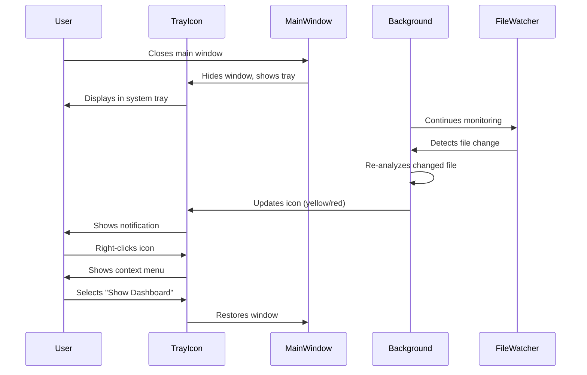

# System Tray Always-On Monitoring

## User Story

**As a user**, I want Vipr to run in the system tray so I can monitor my codebase health without the main window open.

## Desktop Capability Utilized

**Electron's Tray API** enables persistent background processes with minimal UI footprint. This provides:

- Native system tray icon with platform-appropriate menu
- Background file watching and analysis without visible windows
- Notification integration for alerting users to issues
- Quick access to recent analysis results and key metrics

**Why can't this be done in a web app?**

Web applications cannot:

- Place persistent icons in the OS system tray/menu bar
- Run truly in the background when the browser tab is closed
- Provide native context menus with OS-level integration
- Send native OS notifications with the same reliability
- Persist across browser restarts or system reboots

## UX Flow

### User Journey



### Tray States

1. **Green**: All metrics healthy, no critical issues
2. **Yellow**: Warning-level issues detected
3. **Red**: Critical issues or complexity threshold exceeded
4. **Gray**: Analysis paused or repository not loaded
5. **Animated**: Active re-indexing in progress

### Context Menu Structure

```
Vipr - [Repository Name]
├── Dashboard
├── Recent Issues (3)
│   ├── ComponentName.tsx - High complexity
│   ├── utils/helper.ts - Prop drilling detected
│   └── hooks/useData.ts - Cyclomatic > 15
├── Status
│   ├── ✓ 1,234 files analyzed
│   ├── ⚠ 12 warnings
│   └── ✗ 3 critical issues
├── Pause Monitoring
├── Settings
├── Quit Vipr
```

### Platform Differences

**macOS**:

- Icon appears in menu bar (top-right)
- Icon should be monochrome template image (adapts to light/dark mode)
- Size: 22x22 points (44x44px @2x)
- Menu opens on left-click

**Windows**:

- Icon appears in system tray (bottom-right notification area)
- Full-color icon supported
- Size: 16x16px
- Menu opens on right-click, left-click shows/hides window

**Linux**:

- Behavior varies by desktop environment (GNOME, KDE, etc.)
- Some environments hide tray icons by default
- Fallback: provide option to disable tray mode
- Consider AppIndicator for Ubuntu Unity compatibility

## Electron APIs and Patterns

### Primary APIs Used

**`Tray`**: Creates system tray icon with menu

```typescript
const tray = new Tray('/path/to/icon.png');
tray.setToolTip('Vipr - Monitoring repository');
tray.setContextMenu(menu);
```

**`Menu` and `MenuItem`**: Builds native context menus

```typescript
const menu = Menu.buildFromTemplate([
  { label: 'Dashboard', click: () => showMainWindow() },
  { type: 'separator' },
  { label: 'Quit', click: () => app.quit() },
]);
```

**`Notification`**: Native OS notifications

```typescript
new Notification({
  title: 'Vipr Alert',
  body: 'Critical complexity detected in ComponentName.tsx',
  icon: '/path/to/icon.png',
}).show();
```

**`app.dock` (macOS only)**: Controls dock visibility

```typescript
if (process.platform === 'darwin') {
  app.dock.hide(); // Hide from dock when only tray is visible
}
```

### Process Architecture

**Main Process**: Owns the `Tray` instance and coordinates all background activity.

**Why?** The Tray API is main-process-only and must persist independently of renderer windows. The main process:

- Creates and manages the tray icon
- Handles menu item clicks
- Coordinates file watching and analysis
- Manages window show/hide lifecycle

**Renderer Process**: Not required when running in tray-only mode, reducing memory footprint.

### IPC Communication

**Renderer → Main**: Request tray state updates

```typescript
// renderer/hooks/useTrayStatus.ts
ipcRenderer.send('tray:update-status', {
  state: 'warning',
  issueCount: 12,
});
```

**Main → Renderer**: Notify of tray menu actions

```typescript
// main/tray.ts
menuItem.click = () => {
  mainWindow.webContents.send('tray:action', 'show-recent-issues');
  mainWindow.show();
};
```

**Background Analysis → Main**: Update tray on analysis completion

```typescript
// main/analysis-coordinator.ts
analysisEngine.on('analysis:complete', result => {
  updateTrayIcon(result.healthStatus);
  if (result.criticalIssues.length > 0) {
    showNotification(result.criticalIssues[0]);
  }
});
```

## Configuration and Preferences

### User Settings

```typescript
interface TrayPreferences {
  enabled: boolean; // Enable/disable tray mode
  closeToTray: boolean; // Close window vs quit app
  startInTray: boolean; // Launch minimized to tray
  showNotifications: boolean; // Enable desktop notifications
  notificationThreshold: 'warning' | 'critical'; // Notify on...
  updateInterval: number; // Polling interval (minutes)
}
```

### Storage Location

SQLite `preferences` table:

```sql
CREATE TABLE preferences (
  key TEXT PRIMARY KEY,
  value TEXT NOT NULL,
  updated_at INTEGER NOT NULL
);
```

### Sensible Defaults

- `enabled`: `true` (tray available by default)
- `closeToTray`: `true` (minimize to tray, don't quit)
- `startInTray`: `false` (show window on launch)
- `showNotifications`: `true` (notify on critical issues)
- `notificationThreshold`: `'critical'` (only critical issues)
- `updateInterval`: `5` (re-analyze every 5 minutes if idle)

---

## Component Map

### Architecture Clarification

**CRITICAL DISTINCTION**: System tray functionality is split between native Electron APIs (main process) and React UI (settings panel):

**Native Electron (Main Process) - NOT React:**

- Tray icon creation and management (`Tray` API)
- Context menu (`Menu.buildFromTemplate()`)
- OS notifications (`Notification` API)
- Platform-specific behavior (menu bar vs system tray)

**React Components (Renderer Process) - Settings Panel Only:**

- Tray preferences configuration UI
- Notification testing interface
- Status indicators

**DO NOT** attempt to build:

- Custom tray icon preview in React
- Elaborate notification center UI
- Tray menu simulation in React

The tray itself is 100% native - React is only used for the settings panel.

---

### Primary Components (Settings Panel)

**Reference Implementation**: Phase 12 (MCP Server) - Follow the same SettingCard pattern

| Component   | Import Path             | Configuration                         | Purpose                          |
| ----------- | ----------------------- | ------------------------------------- | -------------------------------- |
| SettingCard | `@vipr/ui/setting-card` | `label`, `description`                | Group related tray preferences   |
| Switch      | `@vipr/ui/switch`       | `checked`, `onChange`                 | Enable/disable toggles           |
| Dropdown    | `@vipr/ui/dropdown`     | `variant="select"`, `options`         | Threshold and interval selection |
| Checkbox    | `@vipr/ui/checkbox`     | `checked`, `onChange`                 | Notification type selection      |
| Badge       | `@vipr/ui/badge`        | `variant="success\|warning\|error"`   | Tray status indicator            |
| Button      | `@vipr/ui/button`       | `appearance="secondary"`, `size="sm"` | Test notification action         |
| Alert       | `@vipr/ui/alert`        | `variant="banner"`, `type="info"`     | Platform-specific guidance       |

### Color Tokens

**Status Indicators:**

```tsx
// Tray status (shown in settings panel)
'bg-green-500/20 text-green-700 dark:bg-green-500/10 dark:text-green-400'; // Active, healthy
'bg-yellow-500/20 text-yellow-700 dark:bg-yellow-500/10 dark:text-yellow-400'; // Active, warnings
'bg-red-500/20 text-red-700 dark:bg-red-500/10 dark:text-red-400'; // Active, critical
'bg-gray-500/20 text-gray-700 dark:bg-gray-500/10 dark:text-gray-400'; // Paused
```

**Platform Guidance:**

- Info alerts: `bg-blue-50 dark:bg-blue-900/20 border-blue-200 dark:border-blue-800`

### Typography Tokens

**Section Headers:**

- Settings group: `text-lg font-semibold text-gray-900 dark:text-gray-50`

**Setting Labels:**

- Primary label: `text-sm font-medium text-gray-900 dark:text-gray-50`
- Description: `text-xs text-gray-600 dark:text-gray-400`

**Status Text:**

- Active status: `text-sm font-medium text-green-600 dark:text-green-400`
- Platform info: `text-xs text-gray-600 dark:text-gray-400`

### Layout Pattern

**Settings Panel:**

```tsx
<div className="space-y-6 p-6">
  <div>
    <h2 className="text-lg font-semibold mb-4">System Tray Preferences</h2>

    {/* Platform-specific guidance */}
    {process.platform === 'darwin' && (
      <Alert variant="banner" type="info" className="mb-4">
        <p className="text-xs">
          macOS: Tray icon appears in menu bar (top-right). Icon adapts to light/dark mode
          automatically.
        </p>
      </Alert>
    )}

    {/* Settings groups */}
    <div className="space-y-4">
      <SettingCard
        label="Enable System Tray"
        description="Run Vipr in the system tray for background monitoring"
      >
        <div className="flex items-center gap-3">
          <Switch
            checked={preferences.enabled}
            onChange={enabled => updatePreference('enabled', enabled)}
          />
          {preferences.enabled && (
            <Badge variant="success" size="sm">
              Active
            </Badge>
          )}
        </div>
      </SettingCard>

      <SettingCard
        label="Close to Tray"
        description="Minimize to tray instead of quitting when closing window"
      >
        <Switch
          checked={preferences.closeToTray}
          onChange={enabled => updatePreference('closeToTray', enabled)}
          disabled={!preferences.enabled}
        />
      </SettingCard>

      <SettingCard label="Start in Tray" description="Launch Vipr minimized to system tray">
        <Switch
          checked={preferences.startInTray}
          onChange={enabled => updatePreference('startInTray', enabled)}
          disabled={!preferences.enabled}
        />
      </SettingCard>

      <SettingCard
        label="Show Notifications"
        description="Display desktop notifications for code quality alerts"
      >
        <div className="space-y-3">
          <Switch
            checked={preferences.showNotifications}
            onChange={enabled => updatePreference('showNotifications', enabled)}
            disabled={!preferences.enabled}
          />

          {preferences.showNotifications && (
            <>
              <Dropdown
                variant="select"
                label="Notification Threshold"
                options={[
                  { value: 'warning', label: 'Warning and Critical' },
                  { value: 'critical', label: 'Critical Only' },
                ]}
                value={preferences.notificationThreshold}
                onChange={value => updatePreference('notificationThreshold', value)}
                className="w-full"
              />

              <Button appearance="secondary" size="sm" onClick={handleTestNotification}>
                Test Notification
              </Button>
            </>
          )}
        </div>
      </SettingCard>

      <SettingCard
        label="Update Interval"
        description="How often to re-analyze repository when idle (minutes)"
      >
        <Dropdown
          variant="select"
          label="Interval"
          options={[
            { value: 1, label: '1 minute' },
            { value: 5, label: '5 minutes' },
            { value: 10, label: '10 minutes' },
            { value: 30, label: '30 minutes' },
            { value: 60, label: '1 hour' },
          ]}
          value={preferences.updateInterval}
          onChange={value => updatePreference('updateInterval', value)}
          disabled={!preferences.enabled}
          className="w-full"
        />
      </SettingCard>
    </div>
  </div>
</div>
```

### Composition Pattern

**Reference**: Phase 12 (MCP Server Settings) - This uses the exact same pattern

**Key Points:**

1. **SettingCard grouping** - Each preference gets its own card with label + description
2. **Switch for toggles** - All enable/disable options use Switch component
3. **Dropdown for selections** - Threshold and interval selections use Dropdown (select variant)
4. **Disabled states** - Child preferences disabled when parent feature is off
5. **Platform-specific alerts** - Use Alert (banner variant) for platform guidance
6. **Nested controls** - When a switch enables additional options, nest them with spacing

### Integration with Electron

**IPC Communication Pattern:**

```tsx
// Renderer: Update preferences via IPC
const updatePreference = async (key: keyof TrayPreferences, value: any) => {
  await window.electron.ipcRenderer.invoke('tray:update-preference', { key, value });
  // Main process will update SQLite and reconfigure tray
};

// Renderer: Test notification
const handleTestNotification = async () => {
  await window.electron.ipcRenderer.invoke('tray:test-notification');
  // Main process will show native OS notification
};

// Renderer: Listen for tray state changes
useEffect(() => {
  const handler = (state: TrayState) => {
    setTrayState(state);
  };

  window.electron.ipcRenderer.on('tray:state-changed', handler);

  return () => {
    window.electron.ipcRenderer.removeListener('tray:state-changed', handler);
  };
}, []);
```

**Main Process: Handle Settings Changes:**

```typescript
// main/ipc/handlers/tray.ts
ipcMain.handle('tray:update-preference', async (event, { key, value }) => {
  // Update SQLite
  await db.run('INSERT OR REPLACE INTO preferences (key, value, updated_at) VALUES (?, ?, ?)', [
    `tray.${key}`,
    JSON.stringify(value),
    Date.now(),
  ]);

  // Reconfigure tray based on new preference
  if (key === 'enabled') {
    value ? createTray() : destroyTray();
  } else if (key === 'updateInterval') {
    setAnalysisInterval(value * 60 * 1000);
  }
  // ... other reconfigurations

  return { success: true };
});
```

### Platform-Specific Settings Display

**macOS-Specific Note:**

```tsx
{
  process.platform === 'darwin' && (
    <Alert variant="banner" type="info">
      <p className="text-xs">
        <strong>macOS:</strong> Tray icon appears in menu bar (top-right). The icon automatically
        adapts to light/dark mode using template images.
      </p>
    </Alert>
  );
}
```

**Windows-Specific Note:**

```tsx
{
  process.platform === 'win32' && (
    <Alert variant="banner" type="info">
      <p className="text-xs">
        <strong>Windows:</strong> Tray icon appears in system tray (bottom-right). Right-click for
        menu, left-click to show/hide window.
      </p>
    </Alert>
  );
}
```

**Linux-Specific Warning:**

```tsx
{
  process.platform === 'linux' && !traySupported && (
    <Alert variant="banner" type="warning">
      <p className="text-xs">
        <strong>Linux:</strong> System tray support depends on your desktop environment. GNOME 3.26+
        hides tray icons by default. KDE and XFCE have full support.
      </p>
    </Alert>
  );
}
```

---

## Error Handling and Edge Cases

### Tray Icon Creation Failure

**Scenario**: On some Linux systems, tray support is unavailable.

**Handling**:

- Detect failure: `tray.isDestroyed()` returns `true` immediately
- Show warning dialog: "System tray not supported on this environment"
- Gracefully disable tray features
- Save preference: `enabled: false`

### Notification Permission Denied

**Scenario**: User has disabled notifications at OS level.

**Handling**:

- Check permission before showing: `Notification.isSupported()`
- Fallback: Update tray icon state only (color change)
- In settings, show status: "Notifications disabled by OS"

### Multiple Repository Monitoring

**Scenario**: User wants to monitor multiple repositories simultaneously.

**Limitation**: Single tray icon per application instance.

**Solution**:

- Context menu shows active repository
- Support repository switching via submenu
- Future enhancement: Multiple instances with unique icons

### File Watcher Overwhelmed

**Scenario**: Mass file changes (git checkout, npm install) trigger thousands of events.

**Handling**:

- Debounce file events (500ms delay)
- Batch changes into single analysis pass
- Show "Re-indexing..." state in tray tooltip
- Pause notifications during bulk operations

## Platform-Specific Considerations

### macOS

**Template Images**: Required for proper light/dark mode adaptation.

```typescript
if (process.platform === 'darwin') {
  tray.setImage(
    nativeImage.createFromPath(iconPath).resize({
      width: 22,
      height: 22,
    })
  );
  tray.getPressedImage()?.setTemplateImage(true);
}
```

**Menu Bar Icon Design**:

- Use SF Symbols where possible for native look
- Avoid gradients and shadows
- 22x22 points, 44x44px @2x, 66x66px @3x

**Dock Behavior**:

- Hide dock icon when only tray is visible: `app.dock.hide()`
- Show dock icon when window is visible: `app.dock.show()`

**Notifications**:

- macOS Notification Center integration is automatic
- Users can configure per-app notification settings in System Preferences

### Windows

**Icon Format**: Use `.ico` files with multiple resolutions (16x16, 32x32, 48x48, 256x256).

**Tray Icon Design**:

- Full-color icons are standard
- Use distinct colors for status indication
- Test against both light and dark taskbars

**Balloon Notifications**:

- Windows 10/11 use Action Center
- Set `timeoutType: 'default'` for proper behavior
- Icon appears in notification automatically

**Startup on Boot**:

- Use `app.setLoginItemSettings({ openAtLogin: true })`
- Provide UI toggle in settings

**System Tray Context Menu**:

- Opens on right-click (Windows convention)
- Left-click typically shows/hides main window

### Linux

**Desktop Environment Variations**:

- GNOME: Tray icons hidden by default in GNOME 3.26+
- KDE Plasma: Full tray support
- XFCE, MATE, Cinnamon: Traditional tray behavior

**AppIndicator Support**:

- Use `libappindicator` for better Ubuntu compatibility
- Set `ELECTRON_FORCE_IS_PACKAGED=true` for AppIndicator to work in dev mode

**Icon Format**:

- Use PNG with transparency
- Provide multiple resolutions (16x16, 22x22, 32x32, 48x48)

**Fallback Strategy**:

```typescript
if (process.platform === 'linux') {
  // Check if tray is supported
  if (!Tray.isSupported?.() || tray.isDestroyed()) {
    // Disable tray features, show warning
    dialog.showMessageBox({
      type: 'warning',
      message: 'System tray not supported',
      detail: 'Vipr will run as a standard application window.',
    });
  }
}
```

## Security and Permissions

### Required Permissions

**macOS**:

- Notification permissions (requested automatically on first use)
- Accessibility permissions (only if global shortcuts are used)

**Windows**:

- No special permissions required for tray
- Windows Defender may scan on startup (normal behavior)

**Linux**:

- No special permissions required
- Some desktop environments require user to manually enable tray icons

### Privacy Implications

**Data Exposure**: Tray icon and notifications may reveal:

- Repository names
- File paths
- Issue descriptions

**Mitigation**:

- Provide "Privacy Mode" that shows generic messages
- Allow disabling specific notification types
- Never include code snippets in notifications
- Blur sensitive info in notification text

### Requesting Permissions

**Notifications (macOS/Windows)**:

```typescript
const permission = Notification.isSupported();
if (!permission) {
  // Show in-app prompt to enable notifications in OS settings
}
```

**Auto-Start (All platforms)**:

```typescript
app.setLoginItemSettings({
  openAtLogin: userPreference.startOnBoot,
  openAsHidden: userPreference.startInTray,
});
```

## Performance Considerations

### Background Process Impact

**CPU Usage**:

- Idle state: < 1% CPU (only file watcher active)
- Active analysis: 10-30% CPU (throttled to prevent fan spin-up)
- Use `setInterval` with >= 5-second intervals for polling

**Memory Footprint**:

- Tray-only mode: ~50-100 MB (no renderer process)
- With window open: ~200-400 MB (renderer + React)
- Consider `v8.writeHeapSnapshot()` for memory leak detection

**Optimization Strategy**:

```typescript
// Only keep renderer alive when window is visible
mainWindow.on('hide', () => {
  // Optionally destroy renderer to free memory
  if (preferences.aggressiveMemoryMode) {
    mainWindow.destroy();
  }
});
```

### Battery Usage

**Laptop Considerations**:

- Reduce file watcher frequency on battery power
- Pause background analysis when battery < 20%
- Use `powerMonitor` API to detect power state

```typescript
import { powerMonitor } from 'electron';

powerMonitor.on('on-battery', () => {
  // Reduce polling interval
  setAnalysisInterval(30 * 60 * 1000); // 30 minutes
});

powerMonitor.on('on-ac', () => {
  // Restore normal interval
  setAnalysisInterval(5 * 60 * 1000); // 5 minutes
});
```

### Memory Footprint

**SQLite Connection Management**:

- Keep single persistent connection for tray operations
- Use prepared statements for repeated queries
- Run `PRAGMA optimize` periodically to maintain performance

**File Watcher Optimization**:

- Ignore `node_modules`, `.git`, and other large directories
- Use `chokidar` with `ignoreInitial: true` to avoid startup overhead
- Debounce rapid changes to reduce analysis load

## Testing Strategy

### Unit Tests (Vitest)

**Test tray menu generation**:

```typescript
describe('TrayMenuBuilder', () => {
  it('should build menu with repository context', () => {
    const menu = buildTrayMenu({ repoName: 'vipr', issueCount: 12 });
    expect(menu.items).toHaveLength(7);
    expect(menu.items[0].label).toBe('Vipr - vipr');
  });
});
```

**Test notification formatting**:

```typescript
describe('NotificationService', () => {
  it('should format critical issue notifications', () => {
    const notification = formatIssueNotification(criticalIssue);
    expect(notification.title).toBe('Vipr Alert');
    expect(notification.body).toContain('ComponentName.tsx');
  });
});
```

### Integration Tests (Vitest)

**Test tray state synchronization**:

```typescript
describe('Tray Integration', () => {
  it('should update tray icon when analysis completes', async () => {
    const tray = createMockTray();
    const analysisEngine = createMockEngine();

    analysisEngine.emit('analysis:complete', warningResult);

    await waitFor(() => {
      expect(tray.setImage).toHaveBeenCalledWith(expect.stringContaining('warning'));
    });
  });
});
```

### End-to-End Tests (Playwright)

**Test tray menu interactions**:

```typescript
test('should show main window from tray menu', async ({ electronApp }) => {
  // Close main window
  const window = await electronApp.firstWindow();
  await window.close();

  // Simulate tray menu click (platform-specific)
  // Note: Direct tray interaction is challenging in E2E tests
  // Consider testing IPC handlers instead

  await electronApp.evaluate(({ app }) => {
    app.emit('tray:show-window');
  });

  const newWindow = await electronApp.waitForEvent('window');
  expect(await newWindow.isVisible()).toBe(true);
});
```

### Platform-Specific Testing

**macOS**:

- Test template image rendering in both light and dark modes
- Verify dock icon shows/hides correctly
- Test menu bar icon positioning (ensure it's not clipped)

**Windows**:

- Test icon visibility in system tray overflow area
- Verify balloon notification appearance
- Test startup on boot behavior

**Linux**:

- Test across multiple desktop environments (GNOME, KDE, XFCE)
- Verify AppIndicator fallback works
- Test icon rendering with different themes

### Manual Testing Checklist

- [ ] Tray icon appears on app launch
- [ ] Icon color changes reflect analysis state
- [ ] Context menu opens on correct mouse button (platform-specific)
- [ ] Menu items trigger correct actions
- [ ] Notifications appear at appropriate times
- [ ] Closing window hides app to tray (if preference enabled)
- [ ] Quitting from tray menu exits app completely
- [ ] Settings changes persist across restarts
- [ ] Multiple repositories can be switched via menu
- [ ] Background analysis continues with window hidden

## Integration with Application

### Dependencies

- **US-01 (Repository Opening)**: Must have active repository to monitor
- **US-02 (SQLite Persistence)**: Query database for metrics and issues
- **US-03 (File Watching)**: Receive file change events for re-analysis

### Components That Depend On This Feature

**Main Window**:

- Coordinate show/hide behavior with tray state
- Sync UI state when restored from tray

**Settings Panel**:

- Provide tray preferences configuration
- Test notification delivery from settings

**Analysis Coordinator**:

- Emit events that trigger tray updates
- Respect tray preferences (pause monitoring, etc.)

### Shared State Management

**Tray State Store** (Main Process):

```typescript
interface TrayState {
  health: 'healthy' | 'warning' | 'critical';
  issueCount: number;
  recentIssues: Issue[];
  isMonitoring: boolean;
  currentRepo: string | null;
}
```

**IPC Bridge**:

```typescript
// Renderer can query tray state
ipcRenderer.invoke('tray:get-state') => TrayState

// Main process broadcasts tray updates
mainWindow.webContents.send('tray:state-changed', newState)
```

## Future Enhancements

### Multiple Repository Monitoring

**Feature**: Monitor multiple repositories simultaneously with single tray icon.

**Implementation**:

- Submenu for repository selection
- Aggregate health status across all repos
- Click tray to cycle through repository dashboards

### Rich Notifications

**Feature**: Interactive notifications with quick actions.

**macOS**: Use notification actions API:

```typescript
new Notification({
  title: 'Critical Issue Detected',
  body: 'ComponentName.tsx has complexity > 20',
  actions: [
    { type: 'button', text: 'View in IDE' },
    { type: 'button', text: 'Dismiss' },
  ],
});
```

**Windows**: Use Action Center toast notifications with buttons.

### Historical Trends in Tray

**Feature**: Show mini trend chart in tray menu.

**Implementation**:

- Render small sparkline chart as menu item image
- Show last 7 days of complexity trends
- Click to open full dashboard

### Team Notifications

**Feature**: Share alerts with team members via cloud sync.

**Implementation**:

- Optionally push critical alerts to team channel (Slack, Discord)
- Show "Team Alert" indicator in tray
- Require explicit user opt-in for data sharing

### Custom Alert Rules

**Feature**: User-defined thresholds for tray notifications.

**UI**:

```
Notification Preferences
├── Notify when complexity > [20]
├── Notify when new prop drilling detected
├── Notify when maintainability < [50]
└── Notify on git commit (if analysis fails)
```

**Storage**: JSON rules stored in SQLite preferences.

### System Sleep/Wake Handling

**Feature**: Intelligently pause/resume monitoring on system sleep.

**API**:

```typescript
import { powerMonitor } from 'electron';

powerMonitor.on('suspend', () => {
  pauseFileWatching();
  saveState();
});

powerMonitor.on('resume', () => {
  resumeFileWatching();
  triggerIncrementalAnalysis();
});
```
