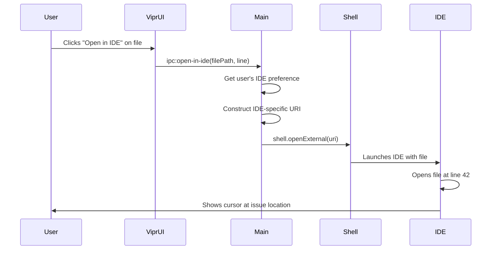
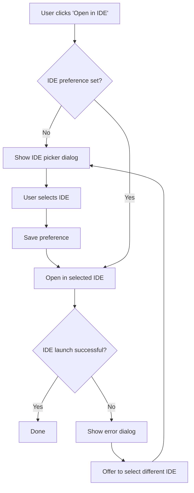

# IDE Deep Linking from Issues

## User Story

**As a user**, I want to click on any file or issue in Vipr and have it open directly in my IDE at the exact line number, so I can immediately fix the problem without manual navigation.

## Desktop Capability Utilized

**Electron's `shell.openExternal()` API** enables launching external applications with custom URI schemes. Combined with **protocol handler registration**, this provides:

- Direct file opening in external IDEs with line/column positioning
- Support for multiple IDE-specific URI schemes (VSCode, Cursor, JetBrains, etc.)
- Fallback to OS-level file opening when IDE URIs fail
- Deep linking to specific functions, components, or issues within files

**Why can't this be done in a web app?**

Web applications have severe limitations:

- Cannot invoke custom URI schemes reliably (browser security restrictions)
- Cannot detect which IDEs are installed on the user's system
- Cannot register as protocol handlers for `vscode://` or similar schemes
- Cannot open local file paths directly (security sandbox)
- Require complex browser extensions for limited functionality

## UX Flow

### User Journey



### Click Targets

**File List View**:

- File name row: Click opens file at line 1
- Issue badge: Click opens file at issue line
- Right-click menu: "Open in [IDE Name]" with IDE icon

**Dashboard Issue Cards**:

- "View in IDE" button: Primary CTA
- File path link: Opens at line 1
- Line number badge: Opens at specific line

**File Detail View**:

- Abstraction names (components, functions): Opens at definition line
- Issue descriptions: "Open" button with IDE icon
- Code snippet preview: Click opens at snippet start line

### IDE Selection Flow

**First Launch**:



**IDE Picker Dialog**:

```
Select your preferred IDE

⚫ VSCode
⚫ Cursor
⚫ WebStorm
⚫ Sublime Text
⚫ System Default

[x] Always use this IDE
[Cancel] [Open]
```

### Platform Differences

**macOS**:

- All major IDEs support URI schemes
- `open` command can launch apps by bundle ID: `open -b com.microsoft.VSCode`
- Fallback: `shell.showItemInFolder()` to reveal file in Finder

**Windows**:

- URI schemes registered in Windows Registry
- Fallback: `shell.openPath()` with default editor association
- Some IDEs require explicit protocol handler installation

**Linux**:

- URI scheme support varies by desktop environment
- May require `xdg-open` for proper launching
- Flatpak/Snap packaged IDEs have different protocol paths

## Electron APIs and Patterns

### Primary APIs Used

**`shell.openExternal()`**: Opens URLs and URIs in external applications

```typescript
import { shell } from 'electron';

shell.openExternal('vscode://file/path/to/file.tsx:42:10');
```

**`shell.openPath()`**: Opens files with default system application

```typescript
import { shell } from 'electron';

// Fallback if URI scheme fails
await shell.openPath('/path/to/file.tsx');
```

**`shell.showItemInFolder()`**: Reveals file in system file manager

```typescript
import { shell } from 'electron';

// Alternative fallback
shell.showItemInFolder('/path/to/file.tsx');
```

**`app.setAsDefaultProtocolClient()`**: Register custom protocol handler (future)

```typescript
import { app } from 'electron';

// Register vipr:// protocol for reverse deep linking
app.setAsDefaultProtocolClient('vipr');
```

### Process Architecture

**Renderer Process**: Initiates IDE open requests via IPC.

**Main Process**: Handles URI construction and shell invocation.

**Why?** The `shell` API is available in both processes, but centralizing logic in main process provides:

- Single source of truth for IDE preferences
- Ability to test alternative launch methods if URI fails
- Consistent error handling across all renderers
- Easier logging and debugging of launch attempts

### IPC Communication

**Renderer → Main**: Request file opening

```typescript
// renderer/hooks/useOpenInIde.ts
const openInIde = async (filePath: string, line?: number, column?: number) => {
  const result = await ipcRenderer.invoke('ide:open-file', {
    filePath,
    line,
    column,
  });

  if (!result.success) {
    showErrorToast(result.error);
  }
};
```

**Main → Renderer**: Notify of launch failures

```typescript
// main/ide-launcher.ts
ipcMain.handle('ide:open-file', async (event, { filePath, line, column }) => {
  try {
    await launchIde(filePath, line, column);
    return { success: true };
  } catch (error) {
    return {
      success: false,
      error: error.message,
      suggestReconfigure: true,
    };
  }
});
```

**Background**: No direct involvement (IDE launching is synchronous operation).

## Configuration and Preferences

### IDE Configuration Schema

```typescript
interface IdePreference {
  id: string; // 'vscode', 'cursor', 'webstorm', etc.
  name: string; // Display name: "Visual Studio Code"
  uriScheme?: string; // URI scheme: "vscode"
  commandPath?: string; // CLI command: "/usr/local/bin/code"
  protocol: IdeProtocol; // How to construct URIs
  icon?: string; // Icon for UI display
  installed: boolean; // Detected on system
  priority: number; // Auto-selection priority
}

type IdeProtocol =
  | { type: 'uri'; template: string } // vscode://file{path}:{line}:{column}
  | { type: 'command'; args: string[] } // code --goto {path}:{line}:{column}
  | { type: 'applescript'; script: string }; // macOS-specific
```

### Supported IDEs

| IDE           | URI Scheme           | Line/Column Format      | Detection Method               |
| ------------- | -------------------- | ----------------------- | ------------------------------ |
| VSCode        | `vscode://file`      | `path:line:column`      | Check for `code` in PATH       |
| Cursor        | `cursor://file`      | `path:line:column`      | Check for `cursor` in PATH     |
| WebStorm      | `webstorm://open`    | `?file=path&line=num`   | Check for `webstorm` in PATH   |
| IntelliJ IDEA | `idea://open`        | `?file=path&line=num`   | Check for `idea` in PATH       |
| Sublime Text  | `subl://open`        | `?url=file://path:line` | Check for `subl` in PATH       |
| Vim/Neovim    | N/A                  | Command-line            | Check for `vim`/`nvim` in PATH |
| Emacs         | `emacsclient://open` | `+line:column path`     | Check for `emacs` in PATH      |
| Atom          | `atom://core/open`   | `/file?line=num`        | Check for `atom` in PATH       |
| Zed           | `zed://file`         | `path:line:column`      | Check for `zed` in PATH        |

### Storage Location

SQLite `preferences` table:

```sql
CREATE TABLE preferences (
  key TEXT PRIMARY KEY,
  value TEXT NOT NULL,
  updated_at INTEGER NOT NULL
);

-- Example:
-- key: 'ide.selected'
-- value: '{"id":"vscode","name":"Visual Studio Code",...}'
```

### IDE Detection Algorithm

```typescript
async function detectInstalledIdes(): Promise<IdePreference[]> {
  const ides: IdePreference[] = [...IDE_DEFINITIONS];

  for (const ide of ides) {
    ide.installed = await isIdeInstalled(ide);
  }

  return ides.filter(ide => ide.installed).sort((a, b) => b.priority - a.priority);
}

async function isIdeInstalled(ide: IdePreference): Promise<boolean> {
  // Try URI scheme first
  if (ide.uriScheme) {
    const testUri = `${ide.uriScheme}://test`;
    // Note: No reliable way to test URI without actually opening
    // Fall through to command check
  }

  // Try command path
  if (ide.commandPath) {
    return await commandExists(ide.commandPath);
  }

  return false;
}
```

### Sensible Defaults

**Auto-Detection Priority**:

1. Cursor (if installed) - Modern AI-first editor
2. VSCode (if installed) - Most popular
3. WebStorm (if installed) - Full-featured IDE
4. Sublime Text (if installed) - Lightweight
5. System default editor - Last resort

**User Preference**: Override auto-detection with explicit selection.

---

## Component Map

### Primary Components

| Component   | Import Path             | Configuration                              | Purpose                            |
| ----------- | ----------------------- | ------------------------------------------ | ---------------------------------- |
| Modal       | `@vipr/ui/modal`        | `size="md"`, `title`                       | IDE picker dialog                  |
| Radio       | `@vipr/ui/radio`        | `options`, `value`, `onChange`             | IDE selection                      |
| Badge       | `@vipr/ui/badge`        | `variant="success\|default"`, `size="sm"`  | IDE status (detected/not found)    |
| Button      | `@vipr/ui/button`       | `appearance="primary\|secondary"`          | Confirm selection, test IDE        |
| SettingCard | `@vipr/ui/setting-card` | `label`, `description`                     | IDE preferences grouping           |
| Dropdown    | `@vipr/ui/dropdown`     | `variant="select"`, `options`              | IDE selector in settings           |
| Checkbox    | `@vipr/ui/checkbox`     | `checked`, `onChange`, `label`             | "Always use this IDE" toggle       |
| Alert       | `@vipr/ui/alert`        | `variant="banner"`, `type="info\|warning"` | Platform-specific guidance, errors |

### Color Tokens

**IDE Status:**

```tsx
// Detected/installed
'bg-green-500/20 text-green-700 dark:bg-green-500/10 dark:text-green-400';

// Not found
'bg-gray-500/20 text-gray-700 dark:bg-gray-500/10 dark:text-gray-400';
```

**IDE Icons:**

- Use inline-flex pattern: `inline-flex items-center gap-2`
- Icon size: `w-5 h-5`
- Icon color: Inherit from parent or use `text-gray-600 dark:text-gray-400`

### Typography Tokens

**Dialog/Modal:**

- Modal title: `text-lg font-semibold` (built into Modal component)
- Radio labels: `text-sm font-medium text-gray-900 dark:text-gray-50`
- Radio descriptions: `text-xs text-gray-600 dark:text-gray-400`

**Settings Panel:**

- Section header: `text-lg font-semibold text-gray-900 dark:text-gray-50`
- Setting labels: `text-sm font-medium` (built into SettingCard)
- Descriptions: `text-xs text-gray-600 dark:text-gray-400`

**File Paths (displayed in UI):**

- Font: `font-mono text-xs text-gray-600 dark:text-gray-400`

### Layout Pattern: IDE Picker Dialog

**Component Assembly:**

```tsx
const IdePickerDialog: React.FC<IdePickerDialogProps> = ({ open, onClose, onSelect }) => {
  const [selectedIde, setSelectedIde] = useState<IdePreference | null>(null);
  const [rememberChoice, setRememberChoice] = useState(true);

  const handleConfirm = async () => {
    if (selectedIde) {
      if (rememberChoice) {
        await saveIdePreference(selectedIde);
      }
      onSelect(selectedIde);
      onClose();
    }
  };

  return (
    <Modal
      open={open}
      onClose={onClose}
      title="Select your preferred IDE"
      size="md"
      footer={
        <>
          <Button appearance="tertiary" onClick={onClose}>
            Cancel
          </Button>
          <Button appearance="primary" onClick={handleConfirm} disabled={!selectedIde}>
            Open in {selectedIde?.name || 'IDE'}
          </Button>
        </>
      }
    >
      <div className="space-y-4">
        {/* Radio group for IDE selection */}
        <Radio
          name="ide-selection"
          value={selectedIde?.id}
          onChange={id => {
            const ide = availableIdes.find(i => i.id === id);
            setSelectedIde(ide || null);
          }}
          options={availableIdes.map(ide => ({
            value: ide.id,
            label: (
              <div className="flex items-center justify-between w-full">
                {/* Icon + name */}
                <div className="inline-flex items-center gap-2">
                  {ide.icon && }
                  <span className="text-sm font-medium">{ide.name}</span>
                </div>

                {/* Status badge */}
                <Badge variant={ide.installed ? 'success' : 'default'} size="sm">
                  {ide.installed ? 'Detected' : 'Not Found'}
                </Badge>
              </div>
            ),
            description: ide.installed
              ? ide.commandPath || ide.uriScheme
              : 'Not installed or not detected',
            disabled: !ide.installed,
          }))}
        />

        {/* Remember choice checkbox */}
        <div className="pt-4 border-t border-gray-200 dark:border-gray-700">
          <Checkbox
            checked={rememberChoice}
            onChange={setRememberChoice}
            label="Always use this IDE"
          />
        </div>

        {/* Platform-specific guidance */}
        {process.platform === 'darwin' && !selectedIde?.installed && (
          <Alert variant="banner" type="info">
            <p className="text-xs">
              <strong>Tip:</strong> If your IDE isn't detected, make sure its command-line tool is
              installed. For VSCode: Open Command Palette → "Shell Command: Install 'code' command
              in PATH"
            </p>
          </Alert>
        )}
      </div>
    </Modal>
  );
};
```

**Key Patterns:**

- **Radio options with complex labels** - Use label render function to show icon + name + badge
- **Icon integration** - `inline-flex items-center gap-2` pattern for icon + text
- **Status badges** - success (green) for detected, default (gray) for not found
- **Disabled options** - IDEs not installed are shown but disabled
- **Platform-specific help** - Alert banner with tips for detection issues

### Layout Pattern: Settings Panel

**Reference Implementation**: Phase 12 (MCP Server) - Same SettingCard pattern

```tsx
const IdeSettings: React.FC = () => {
  const { selectedIde, availableIdes, setSelectedIde } = useIdeStore();

  return (
    <div className="space-y-6 p-6">
      <div>
        <h2 className="text-lg font-semibold mb-4">IDE Integration</h2>

        <div className="space-y-4">
          {/* IDE Selector */}
          <SettingCard label="Default IDE" description="Choose which IDE to open files in">
            <div className="space-y-3">
              <Dropdown
                variant="select"
                label="IDE"
                options={availableIdes.map(ide => ({
                  value: ide.id,
                  label: (
                    <div className="inline-flex items-center gap-2">
                      {ide.icon && }
                      <span>{ide.name}</span>
                    </div>
                  ),
                }))}
                value={selectedIde?.id}
                onChange={id => {
                  const ide = availableIdes.find(i => i.id === id);
                  if (ide) setSelectedIde(ide);
                }}
                className="w-full"
              />

              {selectedIde && (
                <div className="flex items-center gap-2 text-xs">
                  <Badge variant={selectedIde.installed ? 'success' : 'default'} size="sm">
                    {selectedIde.installed ? 'Detected' : 'Not Found'}
                  </Badge>
                  {selectedIde.installed && (
                    <code className="font-mono text-gray-600 dark:text-gray-400">
                      {selectedIde.commandPath || selectedIde.uriScheme}
                    </code>
                  )}
                </div>
              )}

              <Button
                appearance="secondary"
                size="sm"
                onClick={handleTestIdeOpen}
                disabled={!selectedIde?.installed}
              >
                Test IDE Integration
              </Button>
            </div>
          </SettingCard>

          {/* Refresh Detection */}
          <SettingCard label="IDE Detection" description="Refresh the list of detected IDEs">
            <Button appearance="secondary" size="sm" onClick={handleRefreshDetection}>
              Refresh Detection
            </Button>
          </SettingCard>
        </div>
      </div>
    </div>
  );
};
```

### Icon Integration Pattern

**Existing Pattern** (from other components):

```tsx
// Inline icon + text
<div className="inline-flex items-center gap-2">
  <Icon className="w-5 h-5" />
  <span>Label Text</span>
</div>

// Apply to IDE icons
<div className="inline-flex items-center gap-2">
  
  <span>Visual Studio Code</span>
</div>
```

**DO NOT** create custom icon preview components or elaborate IDE branding. Use simple img tags with IDE logos.

### IPC Integration Pattern

**Opening Files in IDE:**

```tsx
// Renderer: Hook for opening files in IDE
const useOpenInIde = () => {
  const { selectedIde } = useIdeStore();

  const openInIde = async (filePath: string, line?: number, column?: number) => {
    try {
      const result = await window.electron.ipcRenderer.invoke('ide:open-file', {
        filePath,
        line,
        column,
      });

      if (!result.success) {
        // Show error alert
        toast.error(result.error);

        if (result.suggestReconfigure) {
          // Optionally open IDE picker dialog
          setShowIdePickerDialog(true);
        }
      }
    } catch (error) {
      toast.error('Failed to open file in IDE');
    }
  };

  return { openInIde, selectedIde };
};

// Usage in components
const IssueCard: React.FC<IssueCardProps> = ({ issue }) => {
  const { openInIde, selectedIde } = useOpenInIde();

  return (
    <div className="p-4 border rounded">
      <h3>{issue.title}</h3>
      <p className="text-xs font-mono text-gray-600">
        {issue.filePath}:{issue.line}
      </p>

      <Button
        appearance="secondary"
        size="sm"
        onClick={() => openInIde(issue.filePath, issue.line)}
      >
        <div className="inline-flex items-center gap-2">
          {selectedIde?.icon && }
          <span>Open in {selectedIde?.name || 'IDE'}</span>
        </div>
      </Button>
    </div>
  );
};
```

### Composition Guidelines

**DO:**

- ✅ Use simple Radio for IDE selection
- ✅ Use Modal (size="md") for IDE picker dialog
- ✅ Use Badge for status indicators (Detected/Not Found)
- ✅ Use `inline-flex items-center gap-2` for icon + text
- ✅ Reference Phase 12 SettingCard pattern for preferences
- ✅ Show platform-specific help with Alert (banner variant)

**DON'T:**

- ❌ Build custom IDE icon preview components
- ❌ Create elaborate IDE branding displays
- ❌ Over-engineer the selection UI
- ❌ Add unnecessary IDE comparison features
- ❌ Build custom radio button variants

**Keep it simple** - Radio selection with status badges is sufficient for IDE picking.

---

## Error Handling and Edge Cases

### IDE Not Installed

**Scenario**: User's selected IDE is uninstalled or moved.

**Handling**:

```typescript
try {
  await shell.openExternal(ideUri);
} catch (error) {
  dialog
    .showMessageBox({
      type: 'error',
      title: 'IDE Not Found',
      message: `Could not open ${ideName}`,
      detail: 'The IDE may not be installed or the URI scheme is not registered.',
      buttons: ['Select Different IDE', 'Open in Finder', 'Cancel'],
    })
    .then(({ response }) => {
      if (response === 0) showIdePickerDialog();
      if (response === 1) shell.showItemInFolder(filePath);
    });
}
```

### URI Scheme Not Registered

**Scenario**: IDE is installed but URI scheme isn't registered (common on Windows).

**Handling**:

1. Attempt URI scheme launch
2. On failure, fall back to command-line launch
3. If that fails, attempt `shell.openPath()`
4. Last resort: `shell.showItemInFolder()`

```typescript
async function openInIdeWithFallbacks(filePath: string, line?: number): Promise<boolean> {
  const ide = getUserIdePreference();

  // Try 1: URI scheme
  if (ide.uriScheme) {
    const uri = buildIdeUri(ide, filePath, line);
    try {
      await shell.openExternal(uri);
      return true;
    } catch {}
  }

  // Try 2: Command-line
  if (ide.commandPath) {
    try {
      await execCommand(ide.commandPath, ['--goto', `${filePath}:${line}`]);
      return true;
    } catch {}
  }

  // Try 3: System default
  try {
    await shell.openPath(filePath);
    return true;
  } catch {}

  // Try 4: Show in folder
  shell.showItemInFolder(filePath);
  return false;
}
```

### File Path Encoding Issues

**Scenario**: File paths with spaces, unicode, or special characters.

**Handling**:

- Always encode URI components: `encodeURIComponent(filePath)`
- Use `file://` protocol with proper encoding
- Test with edge case file names: `my file (1).tsx`, `日本語.ts`, `file with spaces.tsx`

```typescript
function buildIdeUri(ide: IdePreference, filePath: string, line?: number, column?: number): string {
  // Normalize path separators (Windows backslashes)
  const normalizedPath = filePath.replace(/\\/g, '/');

  // Encode for URI
  const encodedPath = encodeURIComponent(normalizedPath);

  // Construct based on IDE protocol
  if (ide.protocol.type === 'uri') {
    return ide.protocol.template
      .replace('{path}', encodedPath)
      .replace('{line}', String(line || 1))
      .replace('{column}', String(column || 1));
  }

  // ... other protocol types
}
```

### Line Number Out of Bounds

**Scenario**: Stored line number exceeds current file line count (file edited externally).

**Handling**:

- IDE will typically navigate to last line automatically
- Vipr could pre-validate line count and clamp to file length
- Acceptable to let IDE handle gracefully

### Multiple IDE Instances

**Scenario**: User has both VSCode and VSCode Insiders installed.

**Handling**:

- Detect both variants during IDE scan
- Present as separate options in picker: "Visual Studio Code" vs "Visual Studio Code Insiders"
- Use distinct URI schemes: `vscode://` vs `vscode-insiders://`

### Sandboxed Environments

**Scenario**: IDEs installed via Snap, Flatpak, or Mac App Store may have different protocol paths.

**Handling**:

```typescript
// macOS App Store sandboxed apps
if (process.platform === 'darwin') {
  const sandboxedPath = path.join(os.homedir(), 'Library/Containers/com.microsoft.VSCode/Data');
  if (fs.existsSync(sandboxedPath)) {
    // Use alternative launch method
  }
}

// Linux Snap
if (process.platform === 'linux') {
  if (await commandExists('snap')) {
    const snapApps = await execCommand('snap', ['list']);
    // Check if IDE is installed via snap
  }
}
```

## Platform-Specific Considerations

### macOS

**AppleScript Integration**: For IDEs without URI support, use AppleScript.

```typescript
import { execFile } from 'child_process';

async function openInIdeViaAppleScript(appName: string, filePath: string, line: number) {
  const script = `
    tell application "${appName}"
      activate
      open POSIX file "${filePath}"
      -- Some IDEs support "go to line" via AppleScript
    end tell
  `;

  return new Promise((resolve, reject) => {
    execFile('osascript', ['-e', script], (error, stdout, stderr) => {
      if (error) reject(error);
      else resolve(stdout);
    });
  });
}
```

**Bundle ID Detection**: Detect installed apps by bundle ID.

```typescript
async function isAppInstalled(bundleId: string): Promise<boolean> {
  try {
    await execFile('mdfind', [`kMDItemCFBundleIdentifier == "${bundleId}"`]);
    return true;
  } catch {
    return false;
  }
}

// Example bundle IDs:
// VSCode: com.microsoft.VSCode
// Cursor: com.cursor.Cursor
// WebStorm: com.jetbrains.WebStorm
```

**Command-Line Tools**: VSCode and others require separate CLI tool installation.

```typescript
// Detect if 'code' command is available
const vscodeCliInstalled = await commandExists('code');

if (!vscodeCliInstalled) {
  // Show instructions to user
  dialog.showMessageBox({
    message: 'VSCode command-line tool not found',
    detail: 'Open VSCode and run: Shell Command: Install "code" command in PATH',
  });
}
```

### Windows

**Registry-Based Protocol Detection**: Check if URI scheme is registered.

```typescript
import { exec } from 'child_process';

async function isProtocolRegistered(scheme: string): Promise<boolean> {
  return new Promise(resolve => {
    exec(`reg query HKEY_CLASSES_ROOT\\${scheme}`, error => resolve(!error));
  });
}
```

**Path Format**: Windows uses backslashes, must be converted for URIs.

```typescript
function normalizePathForIde(filePath: string): string {
  if (process.platform === 'win32') {
    // Convert C:\Users\... to /C:/Users/...
    return filePath.replace(/\\/g, '/').replace(/^([A-Z]):/, '/$1:');
  }
  return filePath;
}
```

**Elevated Permissions**: Some IDEs require admin launch if installed in Program Files.

**Handling**: No special handling needed, `shell.openExternal()` handles elevation automatically.

### Linux

**Desktop Environment Detection**: Different DEs handle URI schemes differently.

```typescript
async function getDesktopEnvironment(): Promise<string | null> {
  return process.env.XDG_CURRENT_DESKTOP || process.env.DESKTOP_SESSION || null;
}

// Adjust URI launching based on DE
if (de === 'GNOME') {
  // Use gio open
} else if (de === 'KDE') {
  // Use kde-open
} else {
  // Use xdg-open
}
```

**xdg-open Fallback**: Universal file opener for Linux.

```typescript
async function openWithXdg(uri: string): Promise<void> {
  return new Promise((resolve, reject) => {
    exec(`xdg-open "${uri}"`, error => {
      if (error) reject(error);
      else resolve();
    });
  });
}
```

**Snap/Flatpak Paths**: Sandboxed apps have different executable paths.

```typescript
// Regular install
/usr/bin/code

// Snap install
/snap/bin/code

// Flatpak install
flatpak run com.visualstudio.code
```

**URI Scheme Registration**: May require manual `.desktop` file configuration.

```desktop
[Desktop Entry]
Name=VSCode URI Handler
Exec=/usr/bin/code --open-url %u
Type=Application
MimeType=x-scheme-handler/vscode;
```

## Security and Permissions

### Required Permissions

**macOS**: No special permissions required.

**Windows**: No special permissions required.

**Linux**: May require desktop integration permissions depending on sandbox.

### Security Risks

**Command Injection**: User-controlled file paths could contain shell metacharacters.

**Mitigation**:

```typescript
// NEVER do this:
exec(`code ${filePath}:${line}`); // Vulnerable!

// Always use parameterized execution:
execFile('code', ['--goto', `${filePath}:${line}`]);

// Or properly escape:
import { shellescape } from 'shell-escape';
exec(`code ${shellescape([filePath])}:${line}`);
```

**Path Traversal**: Malicious file paths could navigate outside repository.

**Mitigation**:

```typescript
function validateFilePath(filePath: string, repoRoot: string): boolean {
  const resolvedPath = path.resolve(filePath);
  const resolvedRoot = path.resolve(repoRoot);

  // Ensure file is within repository
  return resolvedPath.startsWith(resolvedRoot);
}
```

**URI Scheme Hijacking**: Malicious apps could register as handlers for `vscode://` etc.

**Mitigation**: No protection at app level. Rely on OS-level security for protocol handlers.

### Privacy Implications

**Data Exposure**: Opening files in IDE reveals:

- Full file system paths (could contain sensitive directory names)
- Repository structure
- Line numbers and code context

**Mitigation**: Users willingly invoke this action, no additional warnings needed.

## Performance Considerations

### Launch Time

**Typical Latency**:

- URI scheme launch: 50-200ms (OS-dependent)
- Command-line launch: 100-500ms
- AppleScript launch (macOS): 200-800ms
- IDE cold start: 2-10 seconds (out of our control)

**Optimization**: None needed. Launch time is dominated by IDE startup, not Vipr.

### IDE Detection Caching

**Problem**: Scanning for installed IDEs on every click is wasteful.

**Solution**: Cache detection results for 24 hours.

```typescript
interface IdeDetectionCache {
  ides: IdePreference[];
  timestamp: number;
  platform: NodeJS.Platform;
}

async function getInstalledIdes(): Promise<IdePreference[]> {
  const cache = await readCache();

  if (cache && Date.now() - cache.timestamp < 86400000) {
    return cache.ides;
  }

  const ides = await detectInstalledIdes();
  await writeCache({ ides, timestamp: Date.now(), platform: process.platform });

  return ides;
}
```

**Invalidation**: Clear cache when user manually changes IDE preference.

### Memory Footprint

**Impact**: Negligible. IDE configuration is < 10 KB in memory.

## Testing Strategy

### Unit Tests (Vitest)

**Test URI construction**:

```typescript
describe('buildIdeUri', () => {
  it('should construct VSCode URI with line and column', () => {
    const uri = buildIdeUri(VSCODE_IDE, '/path/to/file.tsx', 42, 10);
    expect(uri).toBe('vscode://file/path/to/file.tsx:42:10');
  });

  it('should handle file paths with spaces', () => {
    const uri = buildIdeUri(VSCODE_IDE, '/path/my file.tsx', 1);
    expect(uri).toContain(encodeURIComponent('my file.tsx'));
  });
});
```

**Test IDE detection**:

```typescript
describe('detectInstalledIdes', () => {
  it('should detect VSCode when code command exists', async () => {
    vi.mocked(commandExists).mockResolvedValue(true);

    const ides = await detectInstalledIdes();

    expect(ides).toContainEqual(expect.objectContaining({ id: 'vscode', installed: true }));
  });
});
```

### Integration Tests (Vitest)

**Test IPC handler**:

```typescript
describe('IDE IPC Handler', () => {
  it('should handle ide:open-file request', async () => {
    const mockShell = vi.mocked(shell);

    const result = await ipcMain.emit('ide:open-file', null, {
      filePath: '/test/file.tsx',
      line: 42,
    });

    expect(result.success).toBe(true);
    expect(mockShell.openExternal).toHaveBeenCalled();
  });

  it('should return error when IDE launch fails', async () => {
    vi.mocked(shell.openExternal).mockRejectedValue(new Error('IDE not found'));

    const result = await ipcMain.emit('ide:open-file', null, {
      filePath: '/test/file.tsx',
    });

    expect(result.success).toBe(false);
    expect(result.error).toContain('IDE not found');
  });
});
```

### End-to-End Tests (Playwright)

**Test IDE opening from UI**:

```typescript
test('should open file in IDE from issue card', async ({ page, electronApp }) => {
  // Mock shell.openExternal to capture calls
  await electronApp.evaluate(({ shell }) => {
    shell.openExternal = async (url: string) => {
      (global as any).__lastIdeUrl = url;
      return Promise.resolve();
    };
  });

  // Click "Open in IDE" button
  await page.click('[data-test="issue-card"] button:has-text("Open in IDE")');

  // Verify URI was constructed correctly
  const lastUrl = await electronApp.evaluate(() => {
    return (global as any).__lastIdeUrl;
  });

  expect(lastUrl).toContain('vscode://file');
  expect(lastUrl).toContain(':42:'); // Line number
});
```

### Platform-Specific Testing

**macOS**:

- Test URI launching with actual VSCode, Cursor, WebStorm installations
- Verify AppleScript fallback works
- Test bundle ID detection

**Windows**:

- Test registry-based protocol detection
- Verify path format conversion (backslash to forward slash)
- Test with spaces in file paths

**Linux**:

- Test across GNOME, KDE, XFCE desktop environments
- Verify xdg-open fallback
- Test Snap/Flatpak installed IDEs

### Manual Testing Checklist

- [ ] IDE picker dialog appears on first use
- [ ] Clicking "Open in IDE" launches correct IDE
- [ ] File opens at correct line number
- [ ] File with spaces in path opens correctly
- [ ] Unicode file names open correctly
- [ ] Fallback to file manager works when IDE unavailable
- [ ] Error message appears when IDE not found
- [ ] Settings allow changing IDE preference
- [ ] IDE detection refreshes after installing new IDE
- [ ] Multiple repository file paths resolve correctly

## Integration with Application

### Dependencies

- **US-05 (Dashboard Overview)**: Provides issue lists with IDE open actions
- **US-06 (Multi-Abstraction Analysis)**: Supplies abstraction line numbers for linking
- **US-13 (IDE Integration)**: Original user story defining this feature

### Components That Use This Feature

**Issue Cards** (`renderer/components/IssueCard.tsx`):

```typescript
<Button
  variant="ghost"
  size="sm"
  icon={<IdeIcon />}
  onClick={() => openInIde(issue.filePath, issue.line)}
>
  Open in IDE
</Button>
```

**File List** (`renderer/components/FileList.tsx`):

```typescript
<TableRow
  onClick={() => openInIde(file.path)}
  onContextMenu={(e) => showContextMenu(e, [
    { label: 'Open in IDE', action: () => openInIde(file.path) },
    { label: 'Reveal in Finder', action: () => revealInFinder(file.path) }
  ])}
/>
```

**Code Preview** (`renderer/components/CodePreview.tsx`):

```typescript
<pre onClick={(e) => {
  const lineNum = getLineNumberFromClick(e);
  openInIde(filePath, lineNum);
}}>
  {codeContent}
</pre>
```

### Shared State Management

**IDE Preference Store** (Renderer):

```typescript
interface IdeStore {
  selectedIde: IdePreference | null;
  availableIdes: IdePreference[];
  setSelectedIde: (ide: IdePreference) => Promise<void>;
  refreshAvailableIdes: () => Promise<void>;
}
```

**Usage**:

```typescript
const { selectedIde, openInIde } = useIdeStore();

<Button onClick={() => openInIde(filePath, lineNum)}>
  Open in {selectedIde?.name || 'IDE'}
</Button>
```

## Future Enhancements

### Reverse Deep Linking (vipr:// Protocol)

**Feature**: Register `vipr://` protocol so IDEs can open Vipr to specific analyses.

**Use Case**: IDE extension could show "View in Vipr" context menu option.

**Implementation**:

```typescript
app.setAsDefaultProtocolClient('vipr');

app.on('open-url', (event, url) => {
  // Parse vipr://file/path/to/file.tsx?line=42
  const parsed = parseViprUrl(url);
  showMainWindow();
  navigateToFile(parsed.filePath, parsed.line);
});
```

### IDE Extension Integration

**Feature**: Bi-directional integration via MCP or language server protocol.

**Capabilities**:

- Show Vipr metrics as inline code decorations in IDE
- "Open in Vipr" context menu in IDE
- Real-time metric updates in IDE gutter

**Implementation**: Separate IDE extension packages with MCP client integration.

### Smart IDE Detection

**Feature**: Detect which IDE the user most frequently uses by monitoring process activity.

**Implementation**:

```typescript
import { exec } from 'child_process';

async function detectActiveIde(): Promise<string | null> {
  if (process.platform === 'darwin') {
    const script =
      'osascript -e "tell application \\"System Events\\" to get name of first application process whose frontmost is true"';
    const output = await execCommand(script);
    // Map process name to IDE
  }
  // Similar for Windows/Linux
}
```

### Project-Specific IDE Preferences

**Feature**: Remember different IDE for each repository.

**Storage**:

```sql
CREATE TABLE repository_preferences (
  repo_path TEXT PRIMARY KEY,
  ide_id TEXT NOT NULL,
  created_at INTEGER NOT NULL
);
```

**UI**: Dropdown in repository settings to override global IDE preference.

### Line Number Preview

**Feature**: Show small preview of the target line before opening in IDE.

**UI**:

```
Issue: High Cyclomatic Complexity

function calculateComplexMetric(...) {  <-- Line 42
  if (condition) {
    ...
  }
}

[Preview in Vipr] [Open in IDE]
```

### Multi-IDE Workflows

**Feature**: Open different file types in different IDEs.

**Example**:

- `.tsx` files → VSCode (React development)
- `.test.ts` files → WebStorm (full-featured debugging)
- `.md` files → Typora (markdown editor)

**Configuration**:

```typescript
interface IdeMapping {
  filePattern: string; // *.test.ts
  ideId: string; // webstorm
}
```
