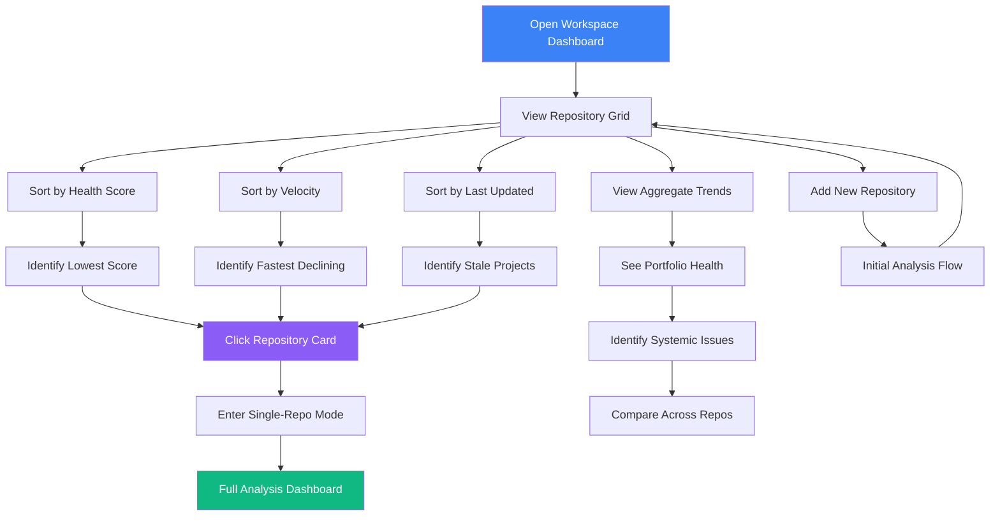

# Multi-Repository Workspace Dashboard

## User Story

**As a consultant or lead managing multiple codebases**, I want to see all my repositories in a single dashboard with comparative metrics, so that I can prioritize attention across projects.

## User Need

Technical leads and consultants often manage 5-20 repositories simultaneously. Each codebase competes for limited attention. Without comparative visibility:

- Healthy projects get unnecessary attention
- Declining projects go unnoticed
- Resource allocation is based on gut feeling, not data
- Progress across initiatives is hard to track

The multi-repo workspace provides:

- Single-pane-of-glass for all projects
- Comparative metrics for prioritization
- Aggregate trends across portfolio
- Early warning for declining codebases

---

## UX Flow

### Entry Points

1. **Primary:** App launch with multiple repos in workspace
2. **Secondary:** "Add Repository" from any view
3. **Contextual:** Switch from single-repo to workspace view
4. **Settings:** Configure workspace repositories

### User Journey



### Exit Points

1. **To Single Repository:** Click any repo card to enter full analysis mode
2. **To Settings:** Configure workspace membership
3. **To Report:** Generate cross-repository report
4. **To Compare:** Side-by-side comparison of two repositories

---

## Information Architecture

### Data Displayed

**Primary View: Repository Grid**

- Card per repository
- Health score with trend indicator
- Key metrics summary
- Last analysis timestamp
- Alert badges

**Secondary View: Aggregate Dashboard**

- Total health across all repos
- Combined issue counts by severity
- Aggregate velocity trends
- Cross-repo pattern detection

**Tertiary View: Comparison Matrix**

- Side-by-side metric comparison
- Relative rankings
- Normalized scores for fair comparison

### Progressive Disclosure Strategy

| Visible By Default | Revealed on Hover | Revealed on Click |
| ------------------ | ----------------- | ----------------- |
| Repo name          | Full path         | Full dashboard    |
| Health score       | Score breakdown   | Historical trend  |
| Alert count        | Alert types       | Alert list        |
| Last updated       | Analysis details  | Re-analyze action |

### Hierarchy and Navigation

This view is **Level 1** in the zoom model:

- Contains multiple Level 2 (Repository) items
- Click any repo to zoom to Level 2
- Breadcrumb shows "Workspace" as root

---

## Interaction Patterns

### Primary Actions

| Action            | Trigger                   | Result                             |
| ----------------- | ------------------------- | ---------------------------------- |
| Select repository | Click card                | Navigate to single-repo dashboard  |
| Sort repositories | Dropdown or column header | Reorder grid                       |
| Add repository    | "+" button                | Open folder picker                 |
| Remove repository | Context menu              | Remove from workspace (not delete) |

### Secondary Actions

| Action                  | Trigger                    | Result                       |
| ----------------------- | -------------------------- | ---------------------------- |
| Compare two repos       | Select both, click Compare | Side-by-side comparison      |
| Re-analyze all          | Toolbar button             | Queue analysis for all repos |
| Export workspace report | Toolbar button             | Generate PDF with all repos  |
| Search across repos     | Global search              | Find files in any repository |

### Micro-interactions

**Card Hover:**

- Elevation increases (shadow)
- Quick stats expand
- "Open" button appears

**Health Score Badge:**

- Tooltip shows trend direction
- Color reflects score (green/yellow/red)
- Pulse animation if recently changed

**Alert Badges:**

- Click to see alert list
- Grouped by type (regression, budget, anti-pattern)

---

## Component Map

This section provides explicit `@vipr/ui` component specifications for the multi-repository workspace dashboard.

### Primary Components

| Component                  | Import Path          | Configuration                     | Usage in Phase 10                                  |
| -------------------------- | -------------------- | --------------------------------- | -------------------------------------------------- |
| **Custom Repository Card** | Custom composition   | See pattern below                 | Repository display with health, metrics, sparkline |
| StatsRow                   | @vipr/ui/stats-row   | stats (array)                     | Portfolio summary (health, issues, trend)          |
| StatCard                   | @vipr/ui/stat-card   | variant="compact", value, title   | Individual stats in repo card                      |
| LineChart                  | @vipr/ui/line-chart  | data, width (fixed for sparkline) | Sparklines in repo cards + aggregate trends        |
| Badge                      | @vipr/ui/badge       | variant, size                     | Health indicators, alert badges                    |
| Button                     | @vipr/ui/button      | appearance="primary", size        | Open repository action                             |
| Dropdown                   | @vipr/ui/dropdown    | variant="filter", options         | Sort and filter controls                           |
| CardTable                  | @vipr/ui/card-table  | data, columns                     | Side-by-side comparison view                       |
| Alert                      | @vipr/ui/alert       | variant="banner", type            | Budget exceeded, declining repos                   |
| EmptyState                 | @vipr/ui/empty-state | title, message, action            | No repositories in workspace yet                   |

### Color Tokens

**Health Score Indicators:**

- `green-500` / `green-500/20` - Excellent health (80-100)
- `sky-500` / `sky-500/20` - Good health (60-79)
- `yellow-500` / `yellow-500/20` - Fair health (40-59)
- `red-500` / `red-500/20` - Poor health (0-39)

**Trend Indicators:**

- `green-500` - Improving trend (+)
- `red-500` - Declining trend (-)
- `gray-500` - Stable trend (≈0)

**Card States:**

- `white` / `gray-800` - Card background
- `gray-50` / `gray-900` - Hover state background
- `gray-200` / `gray-700/60` - Card borders

### Typography Tokens

**Repository Names:**

- `text-lg font-semibold text-gray-800 dark:text-gray-100` - Repository name
- `text-xs font-mono text-gray-600 dark:text-gray-400` - Repository path

**Metrics:**

- `text-2xl font-bold` - Health score number
- `text-sm text-gray-600 dark:text-gray-300` - Metric labels
- `text-xs text-gray-500 dark:text-gray-400` - Last updated timestamps

### Layout Patterns

**Page Container:**

```tsx
className = 'px-4 sm:px-6 lg:px-8 py-8';
```

**Portfolio Summary:**

```tsx
className = 'mb-8'; // StatsRow with margin below
```

**Repository Grid:**

```tsx
className = 'grid grid-cols-1 md:grid-cols-2 xl:grid-cols-3 gap-6';
```

**Responsive breakpoints:**

- Mobile (< 768px): 1 column
- Tablet (768px - 1279px): 2 columns
- Desktop (1280px+): 3 columns

### Composition Patterns

#### Workspace Dashboard Page

```tsx
<div className="px-4 sm:px-6 lg:px-8 py-8">
  {/* Page header */}
  <div className="flex items-center justify-between mb-6">
    <div>
      <h1 className="text-2xl font-semibold text-gray-800 dark:text-gray-100">
        Workspace Dashboard
      </h1>
      <p className="text-sm text-gray-600 dark:text-gray-300 mt-1">
        {repositories.length} repositories • Portfolio health: {portfolioHealth}/100
      </p>
    </div>

    <div className="flex items-center gap-3">
      <Button appearance="secondary" onClick={analyzeAll}>
        Analyze All
      </Button>
      <Button appearance="primary" onClick={addRepository}>
        Add Repository
      </Button>
    </div>
  </div>

  {/* Portfolio summary stats */}
  <StatsRow
    stats={[
      {
        label: 'Portfolio Health',
        value: `${portfolioHealth}/100`,
        trend: portfolioTrend,
        trendLabel: `${portfolioTrend > 0 ? '+' : ''}${portfolioTrend.toFixed(1)}/week`,
      },
      {
        label: 'Total Issues',
        value: totalIssues,
        breakdown: `${criticalCount} critical, ${warningCount} warning`,
      },
      {
        label: 'Active Repositories',
        value: repositories.length,
        breakdown: `${analyzedCount} analyzed`,
      },
      {
        label: 'Last Analysis',
        value: formatRelativeTime(lastAnalysisTime),
      },
    ]}
    className="mb-8"
  />

  {/* Sort and filter controls */}
  <div className="flex items-center gap-3 mb-6">
    <Dropdown
      variant="filter"
      label="Sort by"
      options={[
        { value: 'health', label: 'Health Score' },
        { value: 'trend', label: 'Trend' },
        { value: 'updated', label: 'Last Updated' },
        { value: 'issues', label: 'Issue Count' },
        { value: 'name', label: 'Name' },
      ]}
      selected={sortBy}
      onSelect={setSortBy}
    />

    <Dropdown
      variant="filter"
      label="Filter"
      options={[
        { value: 'all', label: 'All Repositories' },
        { value: 'declining', label: 'Declining Only' },
        { value: 'exceeded', label: 'Budget Exceeded' },
        { value: 'critical', label: 'Has Critical Issues' },
      ]}
      selected={filterBy}
      onSelect={setFilterBy}
    />
  </div>

  {/* Repository grid */}
  {repositories.length === 0 ? (
    <EmptyState
      title="No repositories in workspace"
      message="Add your first repository to start tracking code quality across multiple projects"
      action={{
        label: 'Add Repository',
        onClick: addRepository,
      }}
    />
  ) : (
    <div className="grid grid-cols-1 md:grid-cols-2 xl:grid-cols-3 gap-6">
      {repositories.map(repo => (
        <RepositoryCard key={repo.id} repository={repo} />
      ))}
    </div>
  )}

  {/* Aggregate trends chart */}
  {repositories.length > 0 && (
    <div className="mt-8 bg-white dark:bg-gray-800 rounded-xl shadow-xs p-6">
      <h2 className="text-lg font-semibold text-gray-800 dark:text-gray-100 mb-4">
        Portfolio Health Over Time
      </h2>
      <LineChart
        data={{
          labels: last30Days,
          datasets: repositories.map((repo, index) => ({
            label: repo.name,
            data: repo.healthHistory,
            borderColor: CHART_COLORS[index % CHART_COLORS.length],
            backgroundColor: `${CHART_COLORS[index % CHART_COLORS.length]}20`,
            borderWidth: 2,
          })),
        }}
        options={{
          plugins: {
            legend: {
              position: 'bottom',
              labels: {
                boxWidth: 12,
                padding: 15,
              },
            },
          },
          scales: {
            y: {
              min: 0,
              max: 100,
              title: {
                display: true,
                text: 'Health Score',
              },
            },
          },
        }}
        height={300}
      />
    </div>
  )}
</div>
```

#### Custom Repository Card Component

**This is NOT an existing `@vipr/ui` component - it's a custom composition:**

```tsx
interface RepositoryCardProps {
  repository: {
    id: string;
    name: string;
    path: string;
    health: number;
    healthTrend: number;
    criticalIssues: number;
    warningIssues: number;
    lastAnalyzed: Date;
    budgetExceeded: boolean;
    healthHistory: number[]; // Last 7 days for sparkline
  };
}

const RepositoryCard: React.FC<RepositoryCardProps> = ({ repository }) => {
  const healthColor =
    repository.health >= 80
      ? 'green'
      : repository.health >= 60
        ? 'sky'
        : repository.health >= 40
          ? 'yellow'
          : 'red';

  const trendColor =
    repository.healthTrend > 0 ? 'green' : repository.healthTrend < 0 ? 'red' : 'gray';

  return (
    <div
      className={cn(
        'bg-white dark:bg-gray-800 rounded-xl shadow-xs border border-gray-200 dark:border-gray-700',
        'hover:shadow-md hover:border-gray-300 dark:hover:border-gray-600',
        'transition-all duration-200 cursor-pointer',
        'flex flex-col'
      )}
      onClick={() => openRepository(repository.id)}
    >
      {/* Card header */}
      <div className="p-4 border-b border-gray-200 dark:border-gray-700">
        <h3 className="text-lg font-semibold text-gray-800 dark:text-gray-100 truncate">
          {repository.name}
        </h3>
        <p className="text-xs font-mono text-gray-600 dark:text-gray-400 truncate">
          {repository.path}
        </p>
      </div>

      {/* Card body */}
      <div className="p-4 flex-1 space-y-4">
        {/* Health score with badge */}
        <div className="flex items-center justify-between">
          <div>
            <div className="text-xs text-gray-600 dark:text-gray-400 mb-1">Health Score</div>
            <div className="flex items-center gap-2">
              <span className="text-2xl font-bold text-gray-800 dark:text-gray-100">
                {repository.health}
              </span>
              <Badge variant={healthColor} size="sm">
                /100
              </Badge>
            </div>
          </div>

          {/* Trend indicator */}
          <div className="text-right">
            <div className="text-xs text-gray-600 dark:text-gray-400 mb-1">Trend</div>
            <div
              className={cn(
                'text-sm font-semibold',
                trendColor === 'green' && 'text-green-600 dark:text-green-400',
                trendColor === 'red' && 'text-red-600 dark:text-red-400',
                trendColor === 'gray' && 'text-gray-600 dark:text-gray-400'
              )}
            >
              {repository.healthTrend > 0 ? '+' : ''}
              {repository.healthTrend.toFixed(1)}/week
            </div>
          </div>
        </div>

        {/* Health sparkline */}
        <div className="h-12">
          <LineChart
            data={{
              labels: ['', '', '', '', '', '', ''], // 7 days, no labels
              datasets: [
                {
                  data: repository.healthHistory,
                  borderColor:
                    healthColor === 'green'
                      ? '#4bd37d'
                      : healthColor === 'sky'
                        ? '#67bfff'
                        : healthColor === 'yellow'
                          ? '#f0bb33'
                          : '#ff5656',
                  backgroundColor: 'transparent',
                  borderWidth: 2,
                  pointRadius: 0,
                  tension: 0.4,
                },
              ],
            }}
            options={{
              plugins: {
                legend: { display: false },
                tooltip: { enabled: false },
              },
              scales: {
                x: { display: false },
                y: { display: false, min: 0, max: 100 },
              },
              maintainAspectRatio: false,
            }}
            width={200}
            height={48}
          />
        </div>

        {/* Issue counts */}
        <div className="flex items-center justify-between text-sm">
          <span className="text-gray-600 dark:text-gray-400">Issues:</span>
          <div className="flex items-center gap-2">
            {repository.criticalIssues > 0 && (
              <Badge variant="red" size="sm">
                {repository.criticalIssues} critical
              </Badge>
            )}
            {repository.warningIssues > 0 && (
              <Badge variant="yellow" size="sm">
                {repository.warningIssues} warning
              </Badge>
            )}
            {repository.criticalIssues === 0 && repository.warningIssues === 0 && (
              <Badge variant="green" size="sm">
                None
              </Badge>
            )}
          </div>
        </div>

        {/* Budget exceeded warning */}
        {repository.budgetExceeded && (
          <Alert variant="card" type="error" className="text-xs">
            Budget exceeded
          </Alert>
        )}

        {/* Last updated */}
        <div className="text-xs text-gray-500 dark:text-gray-400">
          Updated {formatRelativeTime(repository.lastAnalyzed)}
        </div>
      </div>

      {/* Card footer */}
      <div className="p-4 border-t border-gray-200 dark:border-gray-700">
        <Button
          appearance="primary"
          size="sm"
          onClick={e => {
            e.stopPropagation();
            openRepository(repository.id);
          }}
          className="w-full"
        >
          Open Repository
        </Button>
      </div>
    </div>
  );
};
```

#### Comparison View (CardTable)

```tsx
<CardTable
  title="Repository Comparison"
  description="Side-by-side metric comparison"
  columns={[
    { key: 'metric', label: 'Metric' },
    { key: 'repo1', label: repositories[0].name, sortable: false },
    { key: 'repo2', label: repositories[1].name, sortable: false },
    { key: 'delta', label: 'Difference', sortable: true },
  ]}
  data={[
    {
      metric: 'Health Score',
      repo1: repositories[0].health,
      repo2: repositories[1].health,
      delta: (
        <span
          className={cn(
            'font-semibold',
            repositories[0].health > repositories[1].health ? 'text-green-600' : 'text-red-600'
          )}
        >
          {repositories[0].health > repositories[1].health ? '+' : ''}
          {repositories[0].health - repositories[1].health}
        </span>
      ),
    },
    {
      metric: 'Total Issues',
      repo1: repositories[0].totalIssues,
      repo2: repositories[1].totalIssues,
      delta: (
        <span
          className={cn(
            'font-semibold',
            repositories[0].totalIssues < repositories[1].totalIssues
              ? 'text-green-600'
              : 'text-red-600'
          )}
        >
          {repositories[0].totalIssues < repositories[1].totalIssues ? '' : '+'}
          {repositories[0].totalIssues - repositories[1].totalIssues}
        </span>
      ),
    },
    // ... more metrics
  ]}
  headerActions={
    <Button appearance="secondary" onClick={exportComparison}>
      Export Comparison
    </Button>
  }
/>
```

### Responsive Behavior

**Mobile (< 768px):**

- Repository cards stack in single column
- StatsRow collapses to 2×2 grid
- Sparklines remain visible (key to quick assessment)
- Card footers stay sticky

**Tablet (768px - 1279px):**

- Repository cards show 2 columns
- StatsRow shows all 4 stats in single row
- Full card content visible

**Desktop (1280px+):**

- Repository cards show 3 columns
- Optimal card width (~350px) for readability
- Sparklines render at full detail

### Dark Mode Considerations

All components adapt automatically:

- Repository cards: `white` → `gray-800` background
- Health badges use alpha variants for better contrast
- Sparklines use theme-aware colors
- StatsRow adapts all text and border colors
- LineChart uses getChartColors() for theme awareness

## Design System Gaps

**No gaps for Phase 10.** All required components exist:

- ✅ StatsRow - exists (portfolio summary)
- ✅ StatCard (compact) - exists (used in custom card)
- ✅ LineChart - exists (sparklines + aggregate trends)
- ✅ Badge - exists (health, issues, status)
- ✅ Button - exists (actions)
- ✅ Dropdown (filter variant) - exists (sort/filter)
- ✅ CardTable - exists (comparison view)
- ✅ Alert (card variant) - exists (budget warnings)
- ✅ EmptyState - exists (no repositories state)

**Custom Repository Card:** Appropriate to build as custom composition rather than forcing into existing card types. This is a domain-specific card that combines multiple primitives effectively.

---

## Visual Concepts

**NOTE:** Visual concepts updated to reflect responsive grid layout and custom repository card composition using `@vipr/ui` primitives.

### Workspace Dashboard Layout

```
Workspace Dashboard                              [Add Repository] [Analyze All]
================================================================================

Portfolio Health: 72/100 [====------]  Trend: Stable (0.0/week)
Total Issues: 47 Critical, 234 Warning    Repos: 6 active

Sort: [Health Score v]    Filter: [All v]    View: [Grid] [List]

+---------------------------+  +---------------------------+
| my-app                    |  | client-portal             |
| /Users/dev/my-app         |  | /Users/dev/client-portal  |
|                           |  |                           |
| Health: 85 [=========-]   |  | Health: 71 [=======--]    |
| Trend: +2.3/week          |  | Trend: -1.2/week [!]      |
|                           |  |                           |
| Issues: 3 critical        |  | Issues: 12 critical       |
| Updated: 2 hours ago      |  | Updated: 1 day ago        |
|                           |  |                           |
| [Open Repository]         |  | [Open Repository]         |
+---------------------------+  +---------------------------+

+---------------------------+  +---------------------------+
| api-server                |  | shared-components         |
| /Users/dev/api-server     |  | /Users/dev/shared-ui      |
|                           |  |                           |
| Health: 78 [=======--]    |  | Health: 92 [==========]   |
| Trend: +0.5/week          |  | Trend: +0.1/week          |
|                           |  |                           |
| Issues: 8 critical        |  | Issues: 0 critical        |
| Updated: 5 hours ago      |  | Updated: 3 hours ago      |
|                           |  |                           |
| [Open Repository]         |  | [Open Repository]         |
+---------------------------+  +---------------------------+

+---------------------------+  +---------------------------+
| legacy-dashboard          |  | mobile-app                |
| /Users/dev/legacy-dash    |  | /Users/dev/mobile         |
|                           |  |                           |
| Health: 45 [====------]   |  | Health: 68 [======---]    |
| Trend: -3.1/week [!!!]    |  | Trend: +1.8/week          |
|                           |  |                           |
| Issues: 24 critical       |  | Issues: 5 critical        |
| Budget: EXCEEDED [!]      |  | Updated: 6 hours ago      |
|                           |  |                           |
| [Open Repository]         |  | [Open Repository]         |
+---------------------------+  +---------------------------+

================================================================================
```

### Aggregate Trend Chart

```
Portfolio Health Over Time
================================================================================

Score
100 |
    |  shared-components ------------------------------------------
 90 |
    |
 80 |  my-app --------+--------+--------+--------+--------+--------
    |                 |        |        |        |        |
 70 |  api-server ----+--------+--------+--------+--------+--------
    |                          client-portal ----+--------+--------
 60 |                                            |
    |                                            mobile-app -------
 50 |
    |
 40 |  legacy-dashboard ------------------------------------+------
    |                                                       |
 30 +-----|-----|-----|-----|-----|-----|-----|-----|-----|---> Time
        Jan   Feb   Mar   Apr   May   Jun   Jul   Aug   Sep

Legend:
  [shared-components]  [my-app]  [api-server]
  [client-portal]  [mobile-app]  [legacy-dashboard]

================================================================================
```

### Comparison View

```
Repository Comparison
================================================================================

                        | my-app         | legacy-dashboard |
------------------------|----------------|------------------|
Health Score           | 85             | 45               |
Trend (30d)            | +2.3           | -3.1             |
Total Files            | 234            | 567              |
Total Issues           | 23             | 128              |
Critical Issues        | 3              | 24               |
Avg Complexity         | 12.4           | 28.7             |
God Components         | 1              | 12               |
Circular Dependencies  | 0              | 5                |
Last Updated           | 2 hours ago    | 6 hours ago      |

ANALYSIS:
legacy-dashboard requires immediate attention:
- Health score 40 points lower than my-app
- 8x more critical issues
- Actively declining (-3.1/week)
- Multiple architectural anti-patterns

[Generate Comparison Report]   [Open legacy-dashboard]

================================================================================
```

---

## Psychological Principles

### Portfolio Thinking

By presenting repos as a portfolio, we encourage strategic thinking about resource allocation rather than reactive firefighting.

### Relative Comparison

Side-by-side comparison makes differences visceral. "45 vs 85" is more impactful than "45 is bad."

### Attention Guidance

Sort and filter controls let users focus attention where it matters most, preventing the paralysis of seeing all problems at once.

### Progress Visibility

Trend indicators show whether things are getting better or worse, motivating continued attention to improvements.

---

## Success Metrics

| Metric                | Target       | Measurement                           |
| --------------------- | ------------ | ------------------------------------- |
| Time to prioritize    | < 30 seconds | User identifies highest-priority repo |
| Cross-repo navigation | < 2 clicks   | Move between any two repos            |
| Comparative insight   | > 50%        | Users use comparison feature          |
| Portfolio tracking    | Weekly       | Users check workspace dashboard       |

---

## Integration with Broader Application

### Feature Dependencies

**Requires:**

- Five-Level Zoom (US-NEW-05) - Level 1 in hierarchy
- Initial Analysis Mode (US-NEW-13) - For adding new repos
- Ongoing Monitoring Mode (US-NEW-14) - For tracking trends

**Enables:**

- Cross-repository search (future)
- Portfolio-level budgets (future)
- Team-level dashboards (future)

### Data Sources

- SQLite database per repository
- Metadata stored in workspace configuration file
- Aggregate calculations on demand

### Workspace Configuration

```typescript
interface WorkspaceConfig {
  id: string;
  name: string;
  repositories: Array<{
    path: string;
    alias?: string;
    addedAt: number;
    lastAnalyzed?: number;
  }>;
  preferences: {
    defaultSort: 'health' | 'velocity' | 'updated' | 'name';
    alertThresholds: {
      healthCritical: number;
      velocityCritical: number;
    };
  };
}
```

### Storage Location

Workspace configuration stored in:

- macOS: `~/Library/Application Support/Vipr Desktop/workspaces/`
- Windows: `%APPDATA%/Vipr Desktop/workspaces/`
- Linux: `~/.config/vipr-desktop/workspaces/`

---

## Open Questions

1. **Repository limit:** What's the practical limit for repos in a workspace? 10? 50? Need performance testing.

2. **Cross-repo analysis:** Should we detect patterns that span repos (e.g., similar code, shared dependencies)?

3. **Team features:** Should workspace support multiple users seeing the same repos? Requires cloud sync.

4. **Aggregation method:** How do we calculate portfolio health? Average? Weighted by size? Min score?

5. **Stale detection:** When should we alert that a repo hasn't been analyzed recently? 1 day? 1 week?
