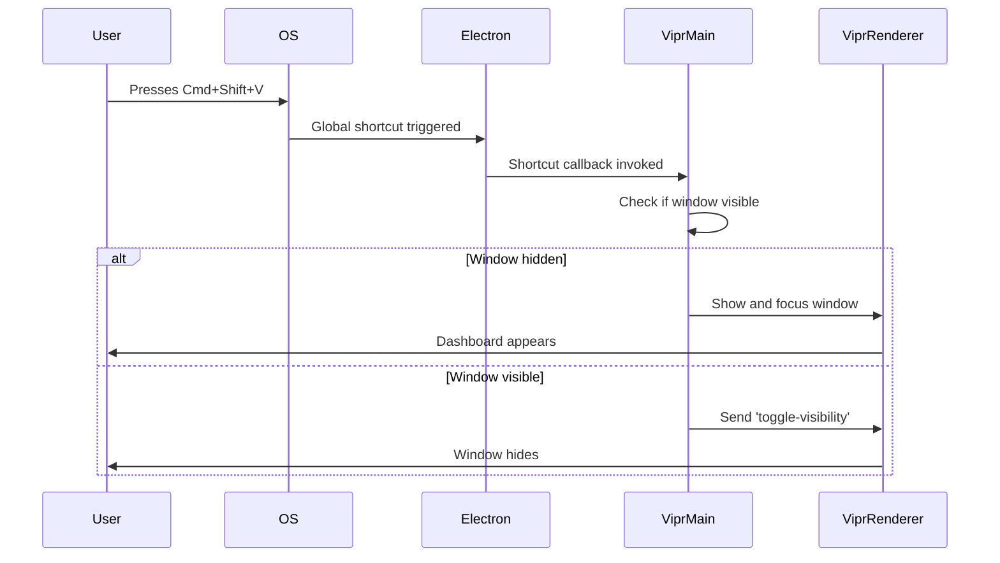
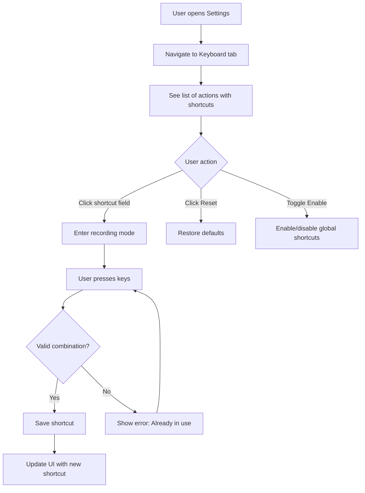

# Global Keyboard Shortcuts

## User Story

**As a user**, I want to use global keyboard shortcuts to quickly open Vipr, trigger analysis, or access recent issues without switching windows.

## Desktop Capability Utilized

**Electron's `globalShortcut` API** enables system-wide keyboard shortcuts that work regardless of which application has focus. This provides:

- OS-level hotkey registration (Command/Ctrl combinations)
- Shortcuts active even when Vipr is hidden or minimized
- Quick access to key functionality without window switching
- Platform-appropriate shortcut conventions

**Why can't this be done in a web app?**

Web applications are fundamentally limited:

- Keyboard shortcuts only work when browser tab has focus
- Cannot register system-wide hotkeys that override OS behavior
- Browser security sandbox prevents global event listening
- Tab-switching causes complete loss of keyboard context
- No API exists for registering shortcuts at OS level

## UX Flow

### User Journey



### Default Shortcuts

| Shortcut (macOS)        | Shortcut (Windows/Linux) | Action                          |
| ----------------------- | ------------------------ | ------------------------------- |
| `Cmd+Shift+V`           | `Ctrl+Shift+V`           | Show/hide Vipr window           |
| `Cmd+Shift+R`           | `Ctrl+Shift+R`           | Run analysis on current repo    |
| `Cmd+Shift+I`           | `Ctrl+Shift+I`           | Show issues panel               |
| `Cmd+Shift+O`           | `Ctrl+Shift+O`           | Quick open file picker          |
| `Cmd+Shift+H`           | `Ctrl+Shift+H`           | Show health dashboard           |
| `Cmd+Option+V` (toggle) | `Ctrl+Alt+V` (toggle)    | Pause/resume background monitor |

### Shortcut Configuration Flow



### Shortcut Conflict Resolution

**System Shortcut Conflict**:

```
⚠ Conflict Detected

Cmd+Shift+V is already used by another application.

Current assignment: Clipboard Manager
Vipr action: Show/hide window

[Choose Different Shortcut] [Override Anyway] [Cancel]
```

**Vipr Internal Conflict**:

```
⚠ Shortcut Already Assigned

Cmd+Shift+R is already assigned to "Run Analysis"

Reassign to "Show Recent Files"?

[Reassign] [Cancel]
```

### Platform Differences

**macOS**:

- Use `Cmd` (⌘) as primary modifier, not `Ctrl`
- `Option` (⌥) for alternative shortcuts
- System shortcuts take precedence (cannot override most Cmd+\* shortcuts)
- Accessibility permission required in macOS 10.15+

**Windows**:

- Use `Ctrl` as primary modifier
- `Alt` for alternative shortcuts
- Some `Ctrl+Alt+*` shortcuts conflict with AltGr on international keyboards
- No special permissions required

**Linux**:

- Use `Ctrl` as primary modifier
- Behavior varies by desktop environment (GNOME, KDE, etc.)
- Some desktop environments aggressively capture shortcuts
- May require manual override of system shortcuts

## Electron APIs and Patterns

### Primary APIs Used

**`globalShortcut.register()`**: Registers system-wide keyboard shortcut

```typescript
import { globalShortcut } from 'electron';

globalShortcut.register('CommandOrControl+Shift+V', () => {
  toggleMainWindow();
});
```

**`globalShortcut.isRegistered()`**: Check if shortcut is already registered

```typescript
const isRegistered = globalShortcut.isRegistered('CommandOrControl+Shift+V');
```

**`globalShortcut.unregister()`**: Removes single shortcut registration

```typescript
globalShortcut.unregister('CommandOrControl+Shift+V');
```

**`globalShortcut.unregisterAll()`**: Removes all registered shortcuts

```typescript
app.on('will-quit', () => {
  globalShortcut.unregisterAll();
});
```

**`systemPreferences.isTrustedAccessibilityClient()` (macOS only)**: Check accessibility permission

```typescript
import { systemPreferences } from 'electron';

if (process.platform === 'darwin') {
  const isTrusted = systemPreferences.isTrustedAccessibilityClient(false);
  if (!isTrusted) {
    // Show permission request dialog
  }
}
```

### Process Architecture

**Main Process**: Exclusively owns global shortcut registration.

**Why?** The `globalShortcut` API is only available in the main process. This centralizes:

- Shortcut lifecycle management (register on app start, unregister on quit)
- Conflict detection and resolution
- Coordination with system-level keyboard events
- Window show/hide orchestration

**Renderer Process**: Provides UI for configuring shortcuts, displays current bindings.

**IPC Bridge**: Renderer requests shortcut changes, main process validates and registers.

### IPC Communication

**Renderer → Main**: Request shortcut registration

```typescript
// renderer/components/ShortcutSettings.tsx
const registerShortcut = async (action: string, accelerator: string) => {
  const result = await ipcRenderer.invoke('shortcuts:register', {
    action,
    accelerator,
  });

  if (!result.success) {
    showError(result.error);
  }
};
```

**Main → Renderer**: Notify of shortcut conflicts

```typescript
// main/shortcuts-manager.ts
ipcMain.handle('shortcuts:register', async (event, { action, accelerator }) => {
  if (globalShortcut.isRegistered(accelerator)) {
    return {
      success: false,
      error: 'Shortcut already in use',
      conflictingAction: getActionForShortcut(accelerator),
    };
  }

  globalShortcut.register(accelerator, () => {
    executeAction(action);
  });

  return { success: true };
});
```

**Main → Renderer**: Broadcast shortcut invocation (for UI feedback)

```typescript
// main/shortcuts-manager.ts
globalShortcut.register('CommandOrControl+Shift+I', () => {
  mainWindow.webContents.send('shortcut:invoked', 'show-issues');
  showIssuesPanel();
});
```

## Configuration and Preferences

### Shortcut Configuration Schema

```typescript
interface ShortcutConfig {
  action: string; // Internal action ID: 'show-window', 'run-analysis'
  label: string; // Display name: "Show/Hide Window"
  defaultAccelerator: string; // Default shortcut: "CommandOrControl+Shift+V"
  accelerator: string | null; // User-configured shortcut (null = disabled)
  enabled: boolean; // User can disable individual shortcuts
  category: ShortcutCategory; // For organized settings UI
}

type ShortcutCategory =
  | 'window' // Window management shortcuts
  | 'analysis' // Analysis-related shortcuts
  | 'navigation' // Navigation shortcuts
  | 'system'; // System-level shortcuts (tray, quit)
```

### Storage

SQLite `shortcuts` table:

```sql
CREATE TABLE shortcuts (
  action TEXT PRIMARY KEY,
  accelerator TEXT,
  enabled INTEGER NOT NULL DEFAULT 1,
  created_at INTEGER NOT NULL,
  updated_at INTEGER NOT NULL
);
```

### Accelerator Format

Electron uses web-standard accelerator syntax:

```typescript
// Modifiers (in order): Command/Control, Alt, Shift
'CommandOrControl+Shift+V'; // Cross-platform
'Command+Shift+V'; // macOS only
'Ctrl+Shift+V'; // Windows/Linux only

// Special keys
'CommandOrControl+F12'; // Function keys
'CommandOrControl+Up'; // Arrow keys
'CommandOrControl+PageDown'; // Navigation keys

// Media keys (may not work on all platforms)
'MediaPlayPause';
'MediaNextTrack';
```

### Default Shortcuts Configuration

```typescript
const DEFAULT_SHORTCUTS: ShortcutConfig[] = [
  {
    action: 'show-window',
    label: 'Show/Hide Window',
    defaultAccelerator: 'CommandOrControl+Shift+V',
    accelerator: 'CommandOrControl+Shift+V',
    enabled: true,
    category: 'window',
  },
  {
    action: 'run-analysis',
    label: 'Run Analysis',
    defaultAccelerator: 'CommandOrControl+Shift+R',
    accelerator: 'CommandOrControl+Shift+R',
    enabled: true,
    category: 'analysis',
  },
  {
    action: 'show-issues',
    label: 'Show Issues Panel',
    defaultAccelerator: 'CommandOrControl+Shift+I',
    accelerator: 'CommandOrControl+Shift+I',
    enabled: true,
    category: 'navigation',
  },
  {
    action: 'quick-open',
    label: 'Quick Open File',
    defaultAccelerator: 'CommandOrControl+Shift+O',
    accelerator: 'CommandOrControl+Shift+O',
    enabled: true,
    category: 'navigation',
  },
  {
    action: 'show-dashboard',
    label: 'Show Health Dashboard',
    defaultAccelerator: 'CommandOrControl+Shift+H',
    accelerator: 'CommandOrControl+Shift+H',
    enabled: true,
    category: 'navigation',
  },
  {
    action: 'toggle-monitoring',
    label: 'Pause/Resume Monitoring',
    defaultAccelerator: 'CommandOrControl+Alt+V',
    accelerator: 'CommandOrControl+Alt+V',
    enabled: false, // Disabled by default (advanced feature)
    category: 'system',
  },
];
```

### Sensible Defaults

- Use `CommandOrControl` for cross-platform compatibility
- Always include `Shift` to avoid conflicts with common shortcuts
- Avoid single-key shortcuts (too easy to trigger accidentally)
- Provide "Enable Global Shortcuts" master toggle
- Default to shortcuts disabled on Linux (desktop environment conflicts common)

---

## Component Map

### Primary Components

| Component     | Import Path              | Configuration                                    | Purpose                             |
| ------------- | ------------------------ | ------------------------------------------------ | ----------------------------------- |
| CardTable     | `@vipr/ui/card-table`    | `columns`, `data`, grouped by category           | Shortcut list with actions          |
| ShortcutInput | Custom (~100 LOC)        | Wrapper around `Input`                           | Record keyboard combinations        |
| Badge         | `@vipr/ui/badge`         | `variant="default"`, `size="sm"`, custom rounded | Key-cap rendering (Cmd, Shift, V)   |
| ConfirmModal  | `@vipr/ui/confirm-modal` | `title`, `message`, `onConfirm`                  | Conflict resolution                 |
| Switch        | `@vipr/ui/switch`        | `checked`, `onChange`                            | Enable/disable global shortcuts     |
| Button        | `@vipr/ui/button`        | `appearance="secondary\|tertiary"`, `size="sm"`  | Record, Reset, Save actions         |
| Alert         | `@vipr/ui/alert`         | `variant="banner"`, `type="warning\|info"`       | Permission warnings, platform notes |

### Color Tokens

**Shortcut Status:**

```tsx
// Enabled shortcut
'text-gray-900 dark:text-gray-50';

// Disabled shortcut
'text-gray-400 dark:text-gray-600';

// Recording mode (active input)
'border-violet-500 ring-2 ring-violet-500/20';

// Conflict warning
'bg-red-500/10 border-red-500/50 text-red-700 dark:text-red-400';
```

**Key-cap Badges:**

```tsx
// Individual key badges
'bg-gray-100 dark:bg-gray-800 text-gray-700 dark:text-gray-300 border border-gray-300 dark:border-gray-600'

// Use Badge with custom styling:
<Badge
  variant="default"
  size="sm"
  className="rounded-sm px-2 font-mono" // Override for keyboard key appearance
>
  Cmd
</Badge>
```

### Typography Tokens

**Shortcut Labels:**

- Action name: `text-sm font-medium text-gray-900 dark:text-gray-50`
- Category headers: `text-xs font-semibold uppercase text-gray-500 dark:text-gray-400`

**Keyboard Keys:**

- Key-cap text: `text-xs font-mono font-semibold`

**Descriptions:**

- Shortcut description: `text-xs text-gray-600 dark:text-gray-400`

### Custom Component: ShortcutInput

**Purpose**: Capture keyboard combinations for shortcut recording. Simple wrapper (~100 LOC) around Input component.

**Implementation:**

```tsx
import { useState, useRef, useEffect } from 'react';
import { Input } from '@vipr/ui/input';
import { Badge } from '@vipr/ui/badge';

interface ShortcutInputProps {
  value: string | null; // Current accelerator (e.g., "CommandOrControl+Shift+V")
  onChange: (accelerator: string | null) => void;
  onConflict?: (accelerator: string) => void;
  disabled?: boolean;
  placeholder?: string;
}

export const ShortcutInput: React.FC<ShortcutInputProps> = ({
  value,
  onChange,
  onConflict,
  disabled,
  placeholder = 'Click to record shortcut...',
}) => {
  const [recording, setRecording] = useState(false);
  const [pressedKeys, setPressedKeys] = useState<Set<string>>(new Set());
  const inputRef = useRef<HTMLInputElement>(null);

  const handleKeyDown = (e: KeyboardEvent) => {
    if (!recording) return;

    e.preventDefault();
    e.stopPropagation();

    // Track pressed keys
    const key = normalizeKey(e.key, e.code);
    setPressedKeys(prev => new Set(prev).add(key));
  };

  const handleKeyUp = (e: KeyboardEvent) => {
    if (!recording || pressedKeys.size === 0) return;

    e.preventDefault();
    e.stopPropagation();

    // Build accelerator string
    const accelerator = buildAccelerator(pressedKeys);

    // Validate
    const validation = validateAccelerator(accelerator);
    if (validation.valid) {
      onChange(accelerator);
      setRecording(false);
      setPressedKeys(new Set());
    } else if (validation.isConflict) {
      onConflict?.(accelerator);
    }
  };

  useEffect(() => {
    if (recording) {
      window.addEventListener('keydown', handleKeyDown);
      window.addEventListener('keyup', handleKeyUp);

      return () => {
        window.removeEventListener('keydown', handleKeyDown);
        window.removeEventListener('keyup', handleKeyUp);
      };
    }
  }, [recording, pressedKeys]);

  return (
    <div className="relative">
      <Input
        ref={inputRef}
        value={recording ? 'Recording...' : value ? formatAccelerator(value) : ''}
        onClick={() => !disabled && setRecording(true)}
        onBlur={() => setRecording(false)}
        placeholder={placeholder}
        readOnly
        disabled={disabled}
        className={cn(
          'cursor-pointer font-mono',
          recording && 'border-violet-500 ring-2 ring-violet-500/20'
        )}
      />

      {value && !recording && (
        <div className="absolute right-2 top-1/2 -translate-y-1/2 flex items-center gap-1">
          {parseAcceleratorToKeys(value).map((key, i) => (
            <Badge
              key={i}
              variant="default"
              size="sm"
              className="rounded-sm px-2 font-mono text-xs"
            >
              {key}
            </Badge>
          ))}
        </div>
      )}
    </div>
  );
};

// Helper functions
function normalizeKey(key: string, code: string): string {
  if (key === 'Meta') return 'Command';
  if (key === 'Control') return 'Ctrl';
  if (key === 'Alt') return 'Alt';
  if (key === 'Shift') return 'Shift';
  return code.replace('Key', '').replace('Digit', '');
}

function buildAccelerator(keys: Set<string>): string {
  const modifiers = [];
  let mainKey = '';

  for (const key of keys) {
    if (['Command', 'Ctrl', 'Alt', 'Shift'].includes(key)) {
      modifiers.push(key);
    } else {
      mainKey = key;
    }
  }

  // Order: Command/Ctrl, Alt, Shift
  const ordered = modifiers.sort((a, b) => {
    const order = { Command: 0, Ctrl: 0, Alt: 1, Shift: 2 };
    return order[a] - order[b];
  });

  return [...ordered, mainKey].join('+');
}

function parseAcceleratorToKeys(accelerator: string): string[] {
  // Convert "CommandOrControl+Shift+V" to ["⌘/Ctrl", "⇧", "V"]
  return accelerator
    .replace('CommandOrControl', process.platform === 'darwin' ? '⌘' : 'Ctrl')
    .replace('Command', '⌘')
    .replace('Shift', '⇧')
    .replace('Alt', '⌥')
    .split('+');
}

function formatAccelerator(accelerator: string): string {
  return parseAcceleratorToKeys(accelerator).join(' + ');
}
```

**Key Design Decisions:**

- **Simple wrapper** - Don't build elaborate keyboard visualization
- **Recording state** - Click to activate, type combination, release to save
- **Visual feedback** - Border + ring on active recording
- **Badge key-caps** - Show current shortcut as separate Badge components
- **Validation** - Check for conflicts before saving

### Layout Pattern: Shortcuts Settings

```tsx
<div className="space-y-6 p-6">
  <div>
    <div className="flex items-center justify-between mb-4">
      <h2 className="text-lg font-semibold">Keyboard Shortcuts</h2>

      <Switch
        checked={shortcutsEnabled}
        onChange={setShortcutsEnabled}
        label="Enable Global Shortcuts"
      />
    </div>

    {/* macOS permission warning */}
    {process.platform === 'darwin' && !accessibilityGranted && (
      <Alert variant="banner" type="warning" className="mb-4">
        <div className="space-y-2">
          <p className="text-sm font-medium">Accessibility Permission Required</p>
          <p className="text-xs">macOS requires accessibility permission for global shortcuts.</p>
          <Button appearance="secondary" size="sm" onClick={openAccessibilityPreferences}>
            Open System Preferences
          </Button>
        </div>
      </Alert>
    )}

    {/* Linux desktop environment note */}
    {process.platform === 'linux' && (
      <Alert variant="banner" type="info" className="mb-4">
        <p className="text-xs">
          <strong>Note:</strong> Some Linux desktop environments aggressively capture shortcuts. You
          may need to manually disable system shortcuts that conflict with Vipr.
        </p>
      </Alert>
    )}

    {/* Shortcuts table grouped by category */}
    <div className="space-y-6">
      {Object.entries(groupedShortcuts).map(([category, shortcuts]) => (
        <div key={category}>
          <h3 className="text-xs font-semibold uppercase text-gray-500 dark:text-gray-400 mb-2">
            {category}
          </h3>

          <CardTable
            columns={[
              { key: 'action', label: 'Action' },
              { key: 'shortcut', label: 'Shortcut' },
              { key: 'actions', label: '' },
            ]}
            data={shortcuts.map(shortcut => ({
              action: (
                <div>
                  <p className="text-sm font-medium">{shortcut.label}</p>
                  <p className="text-xs text-gray-600 dark:text-gray-400">{shortcut.description}</p>
                </div>
              ),
              shortcut: (
                <ShortcutInput
                  value={shortcut.accelerator}
                  onChange={accelerator => updateShortcut(shortcut.action, accelerator)}
                  onConflict={accelerator => handleConflict(shortcut, accelerator)}
                  disabled={!shortcutsEnabled || !shortcut.enabled}
                />
              ),
              actions: (
                <div className="flex items-center gap-2">
                  <Button
                    appearance="tertiary"
                    size="sm"
                    onClick={() => resetShortcut(shortcut.action)}
                    disabled={shortcut.accelerator === shortcut.defaultAccelerator}
                  >
                    Reset
                  </Button>
                  <Switch
                    checked={shortcut.enabled}
                    onChange={enabled => toggleShortcut(shortcut.action, enabled)}
                    disabled={!shortcutsEnabled}
                  />
                </div>
              ),
            }))}
            className="border border-gray-200 dark:border-gray-700 rounded-lg"
          />
        </div>
      ))}
    </div>

    {/* Reset all button */}
    <div className="flex justify-end mt-6">
      <Button appearance="secondary" onClick={handleResetAll} disabled={!shortcutsEnabled}>
        Reset All to Defaults
      </Button>
    </div>
  </div>
</div>
```

### Conflict Resolution Pattern

```tsx
// ConfirmModal for shortcut conflicts
<ConfirmModal
  open={conflictDialogOpen}
  onClose={() => setConflictDialogOpen(false)}
  onConfirm={handleReassign}
  title="Shortcut Already Assigned"
  message={`${conflictAccelerator} is already assigned to "${conflictingAction}".`}
  confirmText="Reassign"
  cancelText="Cancel"
  type="warning"
>
  <p className="text-sm text-gray-600 dark:text-gray-400 mt-2">
    Do you want to reassign this shortcut to "{newAction}"?
  </p>
</ConfirmModal>

// System conflict alert
<Alert variant="banner" type="error" open={systemConflictDetected}>
  <div className="space-y-2">
    <p className="text-sm font-medium">Conflict Detected</p>
    <p className="text-xs">
      {conflictAccelerator} is already used by another application or the system.
    </p>
    <div className="flex items-center gap-2">
      <Button appearance="secondary" size="sm" onClick={chooseDifferentShortcut}>
        Choose Different
      </Button>
      <Button appearance="tertiary" size="sm" onClick={dismissAlert}>
        Cancel
      </Button>
    </div>
  </div>
</Alert>
```

### Integration with Electron

**IPC Communication:**

```tsx
// Renderer: Update shortcut preference
const updateShortcut = async (action: string, accelerator: string | null) => {
  const result = await window.electron.ipcRenderer.invoke('shortcuts:register', {
    action,
    accelerator,
  });

  if (!result.success) {
    if (result.isSystemConflict) {
      setSystemConflictDetected(true);
      setConflictAccelerator(accelerator);
    } else if (result.conflictingAction) {
      setConflictDialogOpen(true);
      setConflictingAction(result.conflictingAction);
      setNewAction(action);
    }
  }
};

// Main Process: Register global shortcut
ipcMain.handle('shortcuts:register', async (event, { action, accelerator }) => {
  // Check for system conflict
  if (accelerator && globalShortcut.isRegistered(accelerator)) {
    return {
      success: false,
      isSystemConflict: true,
      error: 'Shortcut already in use',
    };
  }

  // Check for internal conflict
  const existingAction = findActionByAccelerator(accelerator);
  if (existingAction && existingAction !== action) {
    return {
      success: false,
      conflictingAction: existingAction,
      error: 'Shortcut assigned to different action',
    };
  }

  // Unregister old shortcut if exists
  const oldAccelerator = getAcceleratorForAction(action);
  if (oldAccelerator) {
    globalShortcut.unregister(oldAccelerator);
  }

  // Register new shortcut
  if (accelerator) {
    const registered = globalShortcut.register(accelerator, () => {
      executeAction(action);
    });

    if (!registered) {
      return {
        success: false,
        isSystemConflict: true,
        error: 'Failed to register shortcut',
      };
    }
  }

  // Save to SQLite
  await db.run(
    'INSERT OR REPLACE INTO shortcuts (action, accelerator, updated_at) VALUES (?, ?, ?)',
    [action, accelerator, Date.now()]
  );

  return { success: true };
});
```

### Composition Guidelines

**DO:**

- ✅ Use CardTable grouped by category (Window, Analysis, Navigation, System)
- ✅ Build simple ShortcutInput wrapper (~100 LOC) around Input
- ✅ Use Badge for key-cap rendering with custom rounded-sm styling
- ✅ Use ConfirmModal for conflict resolution
- ✅ Show platform-specific permission warnings with Alert
- ✅ Provide Reset button for individual shortcuts and "Reset All" globally

**DON'T:**

- ❌ Build complex keyboard visualization components
- ❌ Add elaborate shortcut recording animations
- ❌ Create custom conflict resolution UI beyond ConfirmModal
- ❌ Over-engineer the shortcut display

**Keep it simple** - Focus on clear conflict resolution and easy shortcut customization.

---

## Error Handling and Edge Cases

### Registration Failure

**Scenario**: Shortcut cannot be registered (already in use by system or another app).

**Handling**:

```typescript
const success = globalShortcut.register(accelerator, callback);

if (!success) {
  dialog.showMessageBox({
    type: 'warning',
    title: 'Shortcut Registration Failed',
    message: `Could not register ${accelerator}`,
    detail: 'This shortcut may be in use by another application or reserved by the system.',
    buttons: ['Choose Different Shortcut', 'Disable Shortcut', 'OK'],
  });
}
```

### macOS Accessibility Permission

**Scenario**: macOS 10.15+ requires accessibility permission for some global shortcuts.

**Detection**:

```typescript
if (process.platform === 'darwin') {
  const isTrusted = systemPreferences.isTrustedAccessibilityClient(false);

  if (!isTrusted) {
    dialog
      .showMessageBox({
        type: 'info',
        title: 'Accessibility Permission Required',
        message: 'Vipr needs accessibility permission for global shortcuts.',
        detail: 'Click "Open System Preferences" to grant permission.',
        buttons: ['Open System Preferences', 'Skip'],
      })
      .then(({ response }) => {
        if (response === 0) {
          shell.openExternal(
            'x-apple.systempreferences:com.apple.preference.security?Privacy_Accessibility'
          );
        }
      });
  }
}
```

### Shortcut Recording Invalid Input

**Scenario**: User presses invalid key combination (single key, modifier-only).

**Validation**:

```typescript
function validateAccelerator(accelerator: string): {
  valid: boolean;
  error?: string;
} {
  // Must include at least one modifier
  const hasModifier = /Command|Control|Alt|Shift/.test(accelerator);
  if (!hasModifier) {
    return { valid: false, error: 'Must include a modifier key' };
  }

  // Must include a non-modifier key
  const parts = accelerator.split('+');
  const hasKey = parts.some(p => !['Command', 'Control', 'Alt', 'Shift'].includes(p));
  if (!hasKey) {
    return { valid: false, error: 'Must include a non-modifier key' };
  }

  // Check if valid Electron accelerator
  try {
    // Attempt to parse (Electron will throw if invalid)
    globalShortcut.isRegistered(accelerator);
    return { valid: true };
  } catch {
    return { valid: false, error: 'Invalid key combination' };
  }
}
```

### Shortcut Conflicts with Vipr's Own UI

**Scenario**: Global shortcut conflicts with in-app keyboard shortcut.

**Resolution Strategy**:

- Global shortcuts take precedence when app is hidden/unfocused
- In-app shortcuts take precedence when app is focused
- Provide clear indication in settings which shortcuts are global vs. local

**Implementation**:

```typescript
// Disable global shortcuts when main window is focused
mainWindow.on('focus', () => {
  if (preferences.disableGlobalWhenFocused) {
    globalShortcut.unregisterAll();
  }
});

mainWindow.on('blur', () => {
  if (preferences.disableGlobalWhenFocused) {
    registerAllShortcuts();
  }
});
```

### Multi-Instance Conflicts

**Scenario**: User launches multiple Vipr instances (different repos).

**Problem**: Only one instance can register each global shortcut.

**Solution**:

- Detect existing Vipr instance using lock file or named pipe
- Show warning: "Global shortcuts are already registered by another Vipr instance"
- Offer to disable global shortcuts for this instance

```typescript
import { app } from 'electron';

const gotLock = app.requestSingleInstanceLock();

if (!gotLock) {
  dialog.showMessageBox({
    type: 'warning',
    message: 'Another Vipr instance is running',
    detail: 'Global shortcuts may not work in this instance.',
  });
  // Continue launching, but with shortcuts disabled
}
```

### Platform-Specific Key Availability

**Scenario**: User configures shortcut using keys not available on all platforms.

**Example**: `Command+Shift+V` is macOS-only, breaks on Windows.

**Solution**: Always use `CommandOrControl` in configuration UI, but store platform-specific versions internally.

## Platform-Specific Considerations

### macOS

**Accessibility Permission**: Required in macOS 10.15 Catalina and later.

**Request Flow**:

1. Check permission: `systemPreferences.isTrustedAccessibilityClient(false)`
2. If denied, show dialog explaining need
3. Open System Preferences: `x-apple.systempreferences:com.apple.preference.security?Privacy_Accessibility`
4. User must manually check "Vipr" in accessibility list
5. Restart app for permission to take effect

**System Shortcut Conflicts**: Many `Cmd+*` shortcuts are reserved.

**Common conflicts**:

- `Cmd+Q`: Quit (cannot override)
- `Cmd+W`: Close window (cannot override)
- `Cmd+Tab`: App switcher (cannot override)
- `Cmd+Space`: Spotlight (can override with permission)

**Best Practice**: Use `Cmd+Shift+*` or `Cmd+Option+*` to avoid conflicts.

**Function Keys**: `F1-F12` are often mapped to system functions (brightness, volume).

**Handling**: Avoid function keys for primary shortcuts, offer as alternatives.

### Windows

**No Special Permissions**: Global shortcuts work out-of-the-box.

**AltGr Conflicts**: On international keyboards, `Ctrl+Alt` produces AltGr.

**Example**: German keyboard uses `AltGr+Q` for `@` symbol.

**Solution**: Avoid `Ctrl+Alt+*` shortcuts, or document known conflicts.

**Windows Key Shortcuts**: Cannot register `Win+*` shortcuts (system-reserved).

**Function Keys**: Generally available, F1-F12 widely used by other apps.

**Best Practice**: Stick to `Ctrl+Shift+*` for maximum compatibility.

### Linux

**Desktop Environment Variations**: Different DEs have different shortcut priorities.

**GNOME**: Aggressively captures many shortcuts, especially `Super+*` (Windows key).

**KDE Plasma**: More permissive, most shortcuts can be overridden.

**XFCE/MATE**: Traditional behavior, generally permissive.

**Detection Strategy**:

```typescript
const desktopEnv = process.env.XDG_CURRENT_DESKTOP;

if (desktopEnv === 'GNOME') {
  // Warn user about potential conflicts
  // Suggest using Tweaks to disable conflicting shortcuts
}
```

**Super Key**: `Super+*` shortcuts often conflict with desktop environment.

**Solution**: Default to `Ctrl+Shift+*`, avoid `Super+*` entirely.

**X11 vs Wayland**: Wayland has stricter security model, some shortcuts may not work.

**Fallback**: Provide option to disable global shortcuts entirely.

## Security and Permissions

### macOS Accessibility Permission

**Required For**: Global keyboard event listening.

**User Prompt**:

```
Vipr would like to use global keyboard shortcuts.

To enable this feature, Vipr needs accessibility access.

[Open System Preferences] [Not Now]
```

**Privacy Policy**: Clearly state that Vipr only listens for configured shortcuts, not all keystrokes.

### Windows/Linux

**No Special Permissions**: Global shortcuts work without additional permissions.

### Keystroke Privacy

**Concern**: Could Vipr log all keystrokes globally?

**Answer**: No. `globalShortcut` API only triggers callbacks for registered shortcuts, cannot log arbitrary keystrokes.

**Transparency**: Document in privacy policy that global shortcuts are limited to configured combinations.

### Malicious Shortcut Registration

**Attack Vector**: Malicious code could register `Cmd+C`, `Cmd+V` to capture clipboard.

**Mitigation**: Electron prevents registration of system-critical shortcuts (copy, paste, select all).

## Performance Considerations

### CPU Impact

**Idle State**: < 0.1% CPU (OS-level keyboard event listening is very efficient).

**Shortcut Invocation**: Negligible CPU spike (< 1ms to execute callback).

**Registration Cost**: Minimal. Registering 10 shortcuts takes < 10ms on app start.

### Memory Footprint

**Per Shortcut**: ~1 KB (includes callback closure and accelerator string).

**Total**: < 10 KB for typical configuration (10 shortcuts).

### Battery Impact

**Negligible**: Global shortcut listening is passive, does not poll or actively monitor.

## Testing Strategy

### Unit Tests (Vitest)

**Test accelerator validation**:

```typescript
describe('validateAccelerator', () => {
  it('should reject single key without modifiers', () => {
    const result = validateAccelerator('V');
    expect(result.valid).toBe(false);
    expect(result.error).toContain('modifier');
  });

  it('should accept valid combination', () => {
    const result = validateAccelerator('CommandOrControl+Shift+V');
    expect(result.valid).toBe(true);
  });
});
```

**Test shortcut conflict detection**:

```typescript
describe('ShortcutManager', () => {
  it('should detect conflicting shortcuts', () => {
    const manager = new ShortcutManager();

    manager.register('action1', 'CommandOrControl+Shift+V');

    const result = manager.register('action2', 'CommandOrControl+Shift+V');

    expect(result.success).toBe(false);
    expect(result.conflictingAction).toBe('action1');
  });
});
```

### Integration Tests (Vitest)

**Test IPC handlers**:

```typescript
describe('Shortcut IPC', () => {
  it('should handle shortcut registration request', async () => {
    const result = await ipcMain.handle('shortcuts:register', null, {
      action: 'show-window',
      accelerator: 'CommandOrControl+Shift+V',
    });

    expect(result.success).toBe(true);
    expect(globalShortcut.isRegistered('CommandOrControl+Shift+V')).toBe(true);
  });

  it('should unregister shortcuts on quit', async () => {
    globalShortcut.register('CommandOrControl+Shift+V', () => {});

    app.emit('will-quit');

    expect(globalShortcut.isRegistered('CommandOrControl+Shift+V')).toBe(false);
  });
});
```

### End-to-End Tests (Playwright)

**Note**: Playwright cannot directly test global shortcuts (requires system-level keyboard input).

**Alternative**: Test IPC mechanism and UI representation.

```typescript
test('should show shortcut configuration in settings', async ({ page }) => {
  await page.click('[data-test="settings-button"]');
  await page.click('[data-test="keyboard-tab"]');

  // Verify shortcuts are displayed
  const shortcuts = await page.locator('[data-test="shortcut-row"]').count();
  expect(shortcuts).toBeGreaterThan(0);

  // Verify labels and accelerators
  await expect(page.locator('text=Show/Hide Window')).toBeVisible();
  await expect(page.locator('text=CommandOrControl+Shift+V')).toBeVisible();
});
```

### Manual Testing (Platform-Specific)

**macOS**:

- [ ] Shortcuts work without accessibility permission (verify graceful degradation)
- [ ] Permission prompt appears when shortcuts fail
- [ ] Opening System Preferences navigates to correct pane
- [ ] Shortcuts work after granting permission
- [ ] Template image icons show correctly in shortcuts UI

**Windows**:

- [ ] Shortcuts work immediately without prompts
- [ ] No conflicts with Windows key combinations
- [ ] Shortcuts respect international keyboard layouts (test with German, French keyboards)
- [ ] Shortcuts persist across Windows sessions

**Linux (GNOME)**:

- [ ] Shortcuts work or show clear conflict warnings
- [ ] Fallback to disabled state works gracefully
- [ ] Settings indicate which shortcuts are in conflict
- [ ] Documentation links to desktop environment shortcut settings

**Linux (KDE)**:

- [ ] Shortcuts work reliably
- [ ] No unexpected conflicts with KDE defaults

### Manual Testing Checklist (All Platforms)

- [ ] Global shortcuts trigger actions when Vipr is hidden
- [ ] Global shortcuts trigger actions when other apps are focused
- [ ] Shortcuts can be customized in settings
- [ ] Shortcut recording captures correct key combinations
- [ ] Invalid shortcuts show appropriate error messages
- [ ] Conflicting shortcuts are detected and warned
- [ ] Master toggle disables all global shortcuts
- [ ] Shortcuts are saved and restored across app restarts
- [ ] Unregistering shortcuts works (they no longer trigger)
- [ ] App quit properly unregisters all shortcuts

## Integration with Application

### Dependencies

- **US-01 (Repository Opening)**: Shortcuts should work regardless of whether repo is open
- **US-08 (System Tray)**: Coordinate with tray for show/hide behavior

### Components That Depend On This Feature

**Main Window Manager**:

```typescript
// main/window-manager.ts
globalShortcut.register('CommandOrControl+Shift+V', () => {
  toggleMainWindow();
});

function toggleMainWindow() {
  if (mainWindow.isVisible()) {
    mainWindow.hide();
  } else {
    mainWindow.show();
    mainWindow.focus();
  }
}
```

**Analysis Coordinator**:

```typescript
// main/analysis-coordinator.ts
globalShortcut.register('CommandOrControl+Shift+R', () => {
  triggerAnalysis();
  mainWindow.webContents.send('analysis:triggered-by-shortcut');
});
```

**Settings Panel**:

```typescript
// renderer/pages/Settings/KeyboardTab.tsx
const ShortcutSettings = () => {
  const [shortcuts, setShortcuts] = useState<ShortcutConfig[]>([]);

  useEffect(() => {
    ipcRenderer.invoke('shortcuts:get-all').then(setShortcuts);
  }, []);

  return (
    <div>
      {shortcuts.map(shortcut => (
        <ShortcutRow
          key={shortcut.action}
          config={shortcut}
          onEdit={(accelerator) => updateShortcut(shortcut.action, accelerator)}
        />
      ))}
    </div>
  );
};
```

### Shared State Management

**Shortcuts Store** (Main Process):

```typescript
class ShortcutManager {
  private shortcuts: Map<string, ShortcutConfig> = new Map();

  register(action: string, accelerator: string): boolean {
    const success = globalShortcut.register(accelerator, () => {
      this.executeAction(action);
    });

    if (success) {
      this.shortcuts.set(action, { action, accelerator, ... });
      this.persist();
    }

    return success;
  }

  unregister(action: string): void {
    const config = this.shortcuts.get(action);
    if (config?.accelerator) {
      globalShortcut.unregister(config.accelerator);
      this.shortcuts.delete(action);
      this.persist();
    }
  }

  private persist(): void {
    // Save to SQLite
  }
}
```

## Future Enhancements

### Context-Aware Shortcuts

**Feature**: Different shortcuts based on current view or context.

**Example**:

- When file list is focused: `Cmd+J/K` navigates files
- When dashboard is focused: `Cmd+1/2/3` switches tabs
- When code preview is shown: `Cmd+[/]` navigates issues

**Implementation**: Toggle shortcut sets based on renderer state.

### Shortcut Profiles

**Feature**: Save and switch between shortcut configurations.

**Use Cases**:

- "Default" profile for casual use
- "Power User" profile with more shortcuts
- "Vim" profile with hjkl navigation
- "Emacs" profile with Emacs-style bindings

**Storage**: Multiple rows in `shortcut_profiles` table.

### Shortcut Suggestions

**Feature**: Suggest shortcuts based on user's frequent actions.

**Algorithm**:

1. Track action invocations (clicks, menu selections)
2. Identify top 5 most-used actions without shortcuts
3. Suggest available, intuitive shortcuts for those actions

**UI**: Badge on settings icon: "3 shortcut suggestions available"

### Visual Shortcut Overlay

**Feature**: Press `Cmd+/` to show overlay of all available shortcuts.

**Inspiration**: Similar to VSCode's `Cmd+K Cmd+S` shortcut reference.

**UI**: Modal showing all shortcuts, categorized, searchable.

### Chord Shortcuts

**Feature**: Multi-key sequences like VSCode's `Cmd+K Cmd+S`.

**Limitation**: Electron's `globalShortcut` doesn't support chords natively.

**Workaround**: Implement chord detection manually using timestamps and key sequences.

### Gamepad Support

**Feature**: Use game controller buttons as shortcuts (for accessibility).

**API**: Use Node.js `gamepad` package for input detection.

**Use Cases**: Users with mobility impairments who prefer gamepad input.
