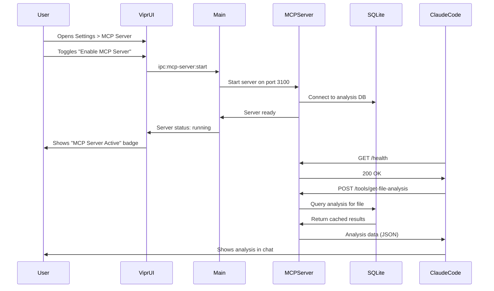
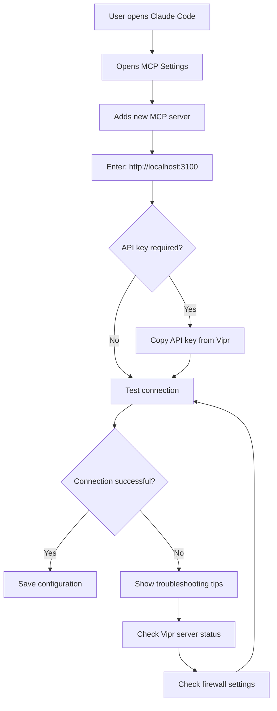

# Embedded MCP Server for AI Integration

## User Story

**As a user**, I want Vipr to run an embedded MCP server so my AI coding assistants (Claude Code, Cursor, etc.) can query analysis results and get context-aware recommendations directly from my codebase analysis.

## Desktop Capability Utilized

**Electron's Node.js Process Management** enables running full server applications within the desktop app. Combined with **local network access**, this provides:

- Embedded MCP server running in main process or utility process
- Local HTTP/WebSocket server accessible to AI tools on localhost
- Direct SQLite database access for real-time query responses
- Process lifecycle management (start, stop, restart, health monitoring)
- Port management and conflict resolution
- Service discovery for AI tools

**Why can't this be done in a web app?**

Web applications cannot:

- Run server processes locally (browser sandbox restriction)
- Listen on network ports for incoming connections
- Expose services to other applications on localhost
- Access local file system or SQLite databases directly
- Persist background processes independent of browser tabs
- Provide reliable service discovery mechanisms

## UX Flow

### User Journey



### Settings Panel

**MCP Server Settings Tab**:

```
┌─ MCP Server Integration ─────────────────────────┐
│                                                   │
│  [✓] Enable MCP Server                           │
│                                                   │
│  Status: ● Running                               │
│  Port: 3100                    [Change]          │
│  URL: http://localhost:3100                      │
│                                    [Copy URL]    │
│                                                   │
│  Connected Clients: 1                            │
│    • Claude Code (last seen: 2s ago)             │
│                                                   │
│  [ ] Start server on app launch                  │
│  [ ] Allow remote connections (LAN)              │
│                                                   │
│  Security:                                        │
│  [ ] Require API key authentication              │
│      API Key: ••••••••••••••••   [Generate New]  │
│                                                   │
│  [View Server Logs] [Restart Server]             │
│                                                   │
└───────────────────────────────────────────────────┘
```

## Component Map

This section provides explicit `@vipr/ui` component specifications to ensure consistent implementation and prevent over-engineering.

### Primary Components

| Component   | Import Path           | Configuration                   | Usage in Phase 12                       |
| ----------- | --------------------- | ------------------------------- | --------------------------------------- |
| SettingCard | @vipr/ui/setting-card | label, description, children    | Grouping each server preference section |
| Switch      | @vipr/ui/switch       | checked, onChange, disabled     | Enable MCP Server toggle                |
| Input       | @vipr/ui/input        | type, value, onChange, disabled | Port number, API key fields             |
| Badge       | @vipr/ui/badge        | variant, size, children         | Server status (Running/Stopped)         |
| Button      | @vipr/ui/button       | appearance, size, onClick       | Generate Key, Copy URL, Restart Server  |
| DataList    | @vipr/ui/data-list    | items, variant, renderItem      | Connected clients list                  |
| Alert       | @vipr/ui/alert        | variant, type, open, onClose    | Error messages, status notifications    |
| Checkbox    | @vipr/ui/checkbox     | checked, onChange, label        | Auto-start, Allow remote connections    |

### Color Tokens

**Status Indicators:**

- `green-500` / `green-500/20` - Running status, healthy state (light bg / dark bg)
- `red-500` / `red-500/20` - Stopped/error status
- `gray-500` / `gray-400` - Neutral/inactive states
- `violet-500` / `violet-500/20` - Active/focused states

**Interactive Elements:**

- `gray-50` / `gray-900` - Hover states (light / dark)
- `gray-200` / `gray-700` - Borders (light / dark with 60% opacity: `gray-700/60`)
- `white` / `gray-800` - Backgrounds (light / dark)

### Typography Tokens

**Headings:**

- `text-lg font-semibold text-gray-800 dark:text-gray-100` - Section titles ("MCP Server Integration")
- `text-sm font-medium text-gray-700 dark:text-gray-200` - SettingCard labels

**Body Text:**

- `text-sm text-gray-600 dark:text-gray-300` - Descriptions, helper text
- `text-xs text-gray-500 dark:text-gray-400` - Metadata (last seen times, connection counts)

**Monospace:**

- `font-mono text-sm text-gray-800 dark:text-gray-100` - Port numbers, URLs, API keys
- `bg-gray-50 dark:bg-gray-900 rounded px-2 py-1` - Code-like values (URLs, keys)

### Layout Patterns

**Settings Container:**

```tsx
className = 'max-w-4xl mx-auto px-4 sm:px-6 lg:px-8 py-8';
```

Reference: `composition-patterns.json > pageLayouts.settings.container`

**Settings Grid:**

```tsx
className = 'grid gap-6';
```

Each SettingCard stacks vertically with 1.5rem gap (gap-6)

**Form Controls Layout:**

```tsx
// Side-by-side label + control
className = 'flex items-center justify-between';

// Stacked label + control
className = 'space-y-2';
```

### Composition Patterns

**SettingCard Pattern (REUSE THIS IN PHASES 08, 09, 11, 20):**

```tsx
<SettingCard
  label="Enable MCP Server"
  description="Allow AI assistants to connect to Vipr for analysis queries"
>
  <Switch
    checked={config.enabled}
    onChange={(checked) => updateConfig({ enabled: checked })}
  />
</SettingCard>

<SettingCard
  label="Server Port"
  description="Port number for MCP server connections (default: 3100)"
>
  <Input
    type="number"
    value={config.port}
    onChange={(e) => updateConfig({ port: parseInt(e.target.value) })}
    className="w-32"
  />
</SettingCard>

<SettingCard
  label="API Key Authentication"
  description="Require clients to provide an API key for security"
>
  <div className="space-y-3">
    <Checkbox
      checked={config.requireAuth}
      onChange={(checked) => updateConfig({ requireAuth: checked })}
      label="Require API key"
    />
    {config.requireAuth && (
      <div className="flex items-center gap-2">
        <Input
          type="password"
          value={config.apiKey || ''}
          readOnly
          className="flex-1 font-mono text-sm"
        />
        <Button
          appearance="secondary"
          size="sm"
          onClick={generateApiKey}
        >
          Generate New
        </Button>
      </div>
    )}
  </div>
</SettingCard>
```

**Status Display Pattern:**

```tsx
<div className="flex items-center gap-2">
  <span className="text-sm font-medium text-gray-700 dark:text-gray-200">Status:</span>
  <Badge variant={serverStatus === 'running' ? 'green' : 'gray'} size="sm">
    {serverStatus === 'running' ? '● Running' : '○ Stopped'}
  </Badge>
</div>
```

**Connected Clients List:**

```tsx
<DataList
  items={connectedClients}
  variant="default"
  renderItem={client => ({
    title: client.name,
    subtitle: `Last seen: ${formatRelativeTime(client.lastSeen)}`,
    avatar: (
      <div className="w-8 h-8 rounded-full bg-violet-100 dark:bg-violet-500/20 flex items-center justify-center text-violet-600 dark:text-violet-400 text-xs font-semibold">
        {client.name.charAt(0).toUpperCase()}
      </div>
    ),
  })}
  keyExtractor={client => client.id}
/>
```

**Error Alert Pattern:**

```tsx
<Alert variant="banner" type="error" open={!!errorMessage} onClose={() => setErrorMessage(null)}>
  {errorMessage}
</Alert>
```

### Visual Component Specification

Replace the ASCII wireframe above with this component-based specification:

**MCP Server Settings Panel:**

```tsx
<div className="max-w-4xl mx-auto px-4 sm:px-6 lg:px-8 py-8">
  <div className="mb-6">
    <h1 className="text-2xl font-semibold text-gray-800 dark:text-gray-100">
      MCP Server Integration
    </h1>
    <p className="text-sm text-gray-600 dark:text-gray-300 mt-1">
      Enable AI coding assistants to query your codebase analysis
    </p>
  </div>

  {/* Error banner if present */}
  {errorMessage && (
    <Alert variant="banner" type="error" className="mb-6">
      {errorMessage}
    </Alert>
  )}

  <div className="grid gap-6">
    {/* Enable toggle */}
    <SettingCard label="Enable MCP Server" description="Allow AI assistants to connect to Vipr">
      <Switch checked={enabled} onChange={setEnabled} />
    </SettingCard>

    {/* Server status and configuration (only shown when enabled) */}
    {enabled && (
      <>
        <SettingCard
          label="Server Status"
          description="Current MCP server state and connection details"
        >
          <div className="space-y-3">
            <div className="flex items-center gap-2">
              <Badge variant={status === 'running' ? 'green' : 'gray'} size="sm">
                {status === 'running' ? '● Running' : '○ Stopped'}
              </Badge>
            </div>

            <div className="space-y-2 text-sm">
              <div className="flex items-center justify-between">
                <span className="text-gray-600 dark:text-gray-300">Port:</span>
                <span className="font-mono text-gray-800 dark:text-gray-100">{port}</span>
              </div>
              <div className="flex items-center justify-between">
                <span className="text-gray-600 dark:text-gray-300">URL:</span>
                <div className="flex items-center gap-2">
                  <span className="font-mono text-sm bg-gray-50 dark:bg-gray-900 px-2 py-1 rounded">
                    http://localhost:{port}
                  </span>
                  <Button appearance="tertiary" size="xs" onClick={copyUrl}>
                    Copy
                  </Button>
                </div>
              </div>
            </div>
          </div>
        </SettingCard>

        {/* Connected clients */}
        {connectedClients.length > 0 && (
          <SettingCard
            label={`Connected Clients (${connectedClients.length})`}
            description="AI tools currently connected to the server"
          >
            <DataList
              items={connectedClients}
              variant="default"
              renderItem={client => ({
                title: client.name,
                subtitle: `Last seen: ${formatRelativeTime(client.lastSeen)}`,
              })}
            />
          </SettingCard>
        )}

        {/* Auto-start preference */}
        <SettingCard
          label="Startup Behavior"
          description="Automatically start the server when Vipr launches"
        >
          <Checkbox
            checked={autoStart}
            onChange={setAutoStart}
            label="Start server on app launch"
          />
        </SettingCard>

        {/* Remote connections */}
        <SettingCard
          label="Network Access"
          description="Allow connections from other devices on your local network"
        >
          <Checkbox
            checked={allowRemote}
            onChange={setAllowRemote}
            label="Allow remote connections (LAN)"
          />
        </SettingCard>

        {/* Security settings */}
        <SettingCard
          label="Security"
          description="Require API key authentication for client connections"
        >
          <div className="space-y-3">
            <Checkbox
              checked={requireAuth}
              onChange={setRequireAuth}
              label="Require API key authentication"
            />

            {requireAuth && (
              <div className="pl-6 space-y-2">
                <label className="block text-xs font-medium text-gray-700 dark:text-gray-300">
                  API Key
                </label>
                <div className="flex items-center gap-2">
                  <Input
                    type="password"
                    value={apiKey}
                    readOnly
                    className="flex-1 font-mono text-sm"
                  />
                  <Button appearance="secondary" size="sm" onClick={generateKey}>
                    Generate New
                  </Button>
                </div>
              </div>
            )}
          </div>
        </SettingCard>

        {/* Actions */}
        <div className="flex items-center gap-3 pt-4">
          <Button appearance="secondary" onClick={viewLogs}>
            View Server Logs
          </Button>
          <Button appearance="secondary" onClick={restartServer}>
            Restart Server
          </Button>
        </div>
      </>
    )}
  </div>
</div>
```

### Responsive Behavior

**Mobile (< 640px):**

- Settings container uses full width with `px-4` padding
- Button labels remain visible (no icon-only state)
- DataList items stack vertically

**Tablet (640px - 1024px):**

- Settings container expands to `px-6` padding
- Two-column layout for some SettingCard controls where appropriate

**Desktop (1024px+):**

- Settings container max-width of `4xl` (56rem) with `px-8` padding
- Generous spacing with `gap-6` between SettingCards

### Dark Mode Considerations

All components automatically adapt to dark mode via Tailwind's `dark:` variant:

- Backgrounds: `white` → `gray-800`
- Text: `gray-800` → `gray-100`
- Borders: `gray-200` → `gray-700/60`
- Interactive hover: `gray-50` → `gray-900`
- Badge colors use alpha variants: `green-500/20`, `violet-500/20`

No custom dark mode logic needed - Tailwind handles it via class-based theme switching.

## Design System Gaps

**No gaps identified for Phase 12.** All required components exist in `@vipr/ui`:

- ✅ SettingCard - exists
- ✅ Switch - exists
- ✅ Input (including type="password", type="number") - exists
- ✅ Badge - exists
- ✅ Button - exists
- ✅ DataList - exists
- ✅ Alert (banner variant) - exists
- ✅ Checkbox - exists

**Note for other phases:** This settings panel pattern should be reused in:

- Phase 08 (System Tray Monitoring) - settings configuration
- Phase 09 (IDE Deep Linking) - default IDE preference
- Phase 11 (Global Keyboard Shortcuts) - shortcut enable/disable
- Phase 20 (Scheduled Background Analysis) - schedule configuration

### AI Tool Configuration Flow

**Claude Code Setup**:



### Connection Status Indicator

**Main Window Header**:

```
┌─────────────────────────────────────────┐
│ Vipr  [Repository: my-app]              │
│                                         │
│ Dashboard  Issues  Files  Settings      │
│                                         │
│ 🔌 MCP Server: Active (1 client)  ▼    │
│    • Claude Code                        │
│    • Last request: 5s ago               │
│    • Requests today: 127                │
│                                         │
└─────────────────────────────────────────┘
```

### Platform Differences

**macOS**:

- Firewall may prompt for network access permission on first server start
- Server can run in background with app in tray mode
- Dock badge shows number of connected clients (optional)

**Windows**:

- Windows Defender Firewall may show prompt for localhost server
- Server process shows in Task Manager as child of Vipr
- Can run as system service for always-on access (future enhancement)

**Linux**:

- No special firewall prompts for localhost (127.0.0.1)
- systemd integration possible for service management
- SELinux may require policy adjustment for network access

## Electron APIs and Patterns

### Primary APIs Used

**`utilityProcess.fork()` (Electron 30+)**: Runs MCP server in isolated process

```typescript
import { utilityProcess } from 'electron';

const mcpServer = utilityProcess.fork(path.join(__dirname, 'mcp-server.js'), ['--port', '3100'], {
  stdio: 'pipe',
  serviceName: 'com.vipr.mcp-server',
});

mcpServer.on('message', message => {
  console.log('MCP Server:', message);
});
```

**Alternative: `ChildProcess` (Node.js)**: For broader Electron version support

```typescript
import { spawn } from 'child_process';

const mcpServer = spawn('node', [path.join(__dirname, 'mcp-server.js'), '--port', '3100'], {
  stdio: ['pipe', 'pipe', 'pipe', 'ipc'],
});
```

**`net` Module (Node.js)**: TCP server for MCP protocol

```typescript
import net from 'net';

const server = net.createServer(socket => {
  // Handle MCP connections
});

server.listen(3100, '127.0.0.1');
```

**`http` Module (Node.js)**: HTTP endpoint for MCP over HTTP transport

```typescript
import http from 'http';

const server = http.createServer(async (req, res) => {
  if (req.url === '/tools/get-file-analysis') {
    const result = await handleGetFileAnalysis(req);
    res.writeHead(200, { 'Content-Type': 'application/json' });
    res.end(JSON.stringify(result));
  }
});

server.listen(3100, '127.0.0.1');
```

**`portfinder` (npm)**: Automatic port selection if default is occupied

```typescript
import portfinder from 'portfinder';

const port = await portfinder.getPortPromise({ port: 3100 });
console.log(`Starting MCP server on port ${port}`);
```

### Process Architecture

**Main Process**: Manages server lifecycle (start, stop, monitor health).

**Utility Process**: Runs the actual MCP server.

**Why Utility Process?**

- **Isolation**: Server crashes don't crash main app
- **Resource limits**: Can set memory limits, CPU quotas
- **Clean shutdown**: Easy to kill and restart
- **Security**: Reduced privilege level
- **Performance**: Offloads I/O and processing from main thread

**Renderer Process**: Displays server status, handles user controls.

### IPC Communication

**Renderer → Main**: Start/stop server

```typescript
// renderer/hooks/useMcpServer.ts
const startMcpServer = async () => {
  const result = await ipcRenderer.invoke('mcp-server:start');
  if (!result.success) {
    showError(result.error);
  }
  return result;
};

const stopMcpServer = async () => {
  await ipcRenderer.invoke('mcp-server:stop');
};
```

**Main → Utility Process**: Configuration and control

```typescript
// main/mcp-server-manager.ts
mcpServer.postMessage({
  type: 'config',
  port: 3100,
  dbPath: databasePath,
  apiKey: userApiKey,
});

mcpServer.on('message', msg => {
  if (msg.type === 'started') {
    console.log('MCP server started on port', msg.port);
  }
});
```

**Main → Renderer**: Broadcast server status updates

```typescript
// main/mcp-server-manager.ts
mcpServer.on('message', msg => {
  if (msg.type === 'client-connected') {
    mainWindow.webContents.send('mcp-server:client-connected', msg.client);
  }
});
```

**MCP Server → Main**: Health checks and error reporting

```typescript
// utility/mcp-server.ts
process.parentPort.on('message', msg => {
  if (msg.type === 'health-check') {
    process.parentPort.postMessage({
      type: 'health',
      status: 'healthy',
      uptime: process.uptime(),
      connections: connectedClients.length,
    });
  }
});
```

## Configuration and Preferences

### Server Configuration Schema

```typescript
interface McpServerConfig {
  enabled: boolean; // Enable/disable server
  port: number; // Port number (default: 3100)
  host: string; // Bind address ('127.0.0.1' or '0.0.0.0')
  autoStart: boolean; // Start on app launch
  allowRemote: boolean; // Allow LAN connections (0.0.0.0)
  requireAuth: boolean; // Require API key authentication
  apiKey: string | null; // API key (null = no auth)
  rateLimitEnabled: boolean; // Rate limit requests
  rateLimitPerMinute: number; // Max requests per minute per client
  logLevel: 'error' | 'warn' | 'info' | 'debug';
  maxConnections: number; // Max concurrent connections
}
```

### MCP Server Tools (Exposed to AI)

```typescript
interface McpTool {
  name: string;
  description: string;
  inputSchema: JSONSchema;
  handler: (params: any) => Promise<any>;
}

const MCP_TOOLS: McpTool[] = [
  {
    name: 'get-file-analysis',
    description: 'Get analysis results for a specific file',
    inputSchema: {
      type: 'object',
      properties: {
        filePath: { type: 'string', description: 'Relative path from repo root' },
      },
      required: ['filePath'],
    },
    handler: async ({ filePath }) => {
      return await db.query('SELECT * FROM analyses WHERE file_path = ?', [filePath]);
    },
  },
  {
    name: 'search-issues',
    description: 'Search for issues by severity, plugin, or file pattern',
    inputSchema: {
      type: 'object',
      properties: {
        severity: { type: 'string', enum: ['critical', 'warning', 'info'] },
        plugin: { type: 'string' },
        filePattern: { type: 'string' },
      },
    },
    handler: async params => {
      // Query SQLite for matching issues
    },
  },
  {
    name: 'get-recommendations',
    description: 'Get AI-generated refactoring recommendations for a file',
    inputSchema: {
      type: 'object',
      properties: {
        filePath: { type: 'string' },
        issueType: { type: 'string' },
      },
      required: ['filePath'],
    },
    handler: async ({ filePath, issueType }) => {
      // Load cached recommendations from DB
    },
  },
  {
    name: 'get-complexity-trends',
    description: 'Get complexity trend data over time for a file',
    inputSchema: {
      type: 'object',
      properties: {
        filePath: { type: 'string' },
        days: { type: 'number', default: 30 },
      },
      required: ['filePath'],
    },
    handler: async ({ filePath, days }) => {
      // Query snapshots for historical data
    },
  },
  {
    name: 'get-health-summary',
    description: 'Get overall repository health summary',
    inputSchema: { type: 'object', properties: {} },
    handler: async () => {
      // Aggregate metrics from all files
    },
  },
];
```

### Storage Location

SQLite `preferences` table:

```sql
CREATE TABLE preferences (
  key TEXT PRIMARY KEY,
  value TEXT NOT NULL,
  updated_at INTEGER NOT NULL
);

-- key: 'mcp_server.config'
-- value: '{"enabled":true,"port":3100,...}'
```

### Sensible Defaults

- `enabled`: `false` (opt-in feature)
- `port`: `3100` (avoids common conflicts)
- `host`: `'127.0.0.1'` (localhost only, secure by default)
- `autoStart`: `false` (manual start)
- `allowRemote`: `false` (localhost only)
- `requireAuth`: `false` (no auth for localhost)
- `rateLimitEnabled`: `true`
- `rateLimitPerMinute`: `60` (1 request/second)
- `logLevel`: `'info'`
- `maxConnections`: `5`

## Error Handling and Edge Cases

### Port Already in Use

**Scenario**: Port 3100 is occupied by another application.

**Handling**:

```typescript
async function startMcpServer(config: McpServerConfig): Promise<ServerResult> {
  let port = config.port;

  try {
    await server.listen(port, config.host);
    return { success: true, port };
  } catch (error) {
    if (error.code === 'EADDRINUSE') {
      // Try to find available port
      port = await portfinder.getPortPromise({ port: port + 1 });

      dialog.showMessageBox({
        type: 'warning',
        message: `Port ${config.port} is in use`,
        detail: `MCP server will use port ${port} instead. Update your AI tool configuration.`,
        buttons: ['OK', 'Change Port in Settings'],
      });

      await server.listen(port, config.host);
      return { success: true, port };
    }

    return { success: false, error: error.message };
  }
}
```

### Database Lock Contention

**Scenario**: MCP server and main app both try to write to SQLite simultaneously.

**Handling**:

- Use SQLite connection pool with busy timeout
- MCP server only performs READ operations (no writes)
- Main process owns all writes (analysis results, preferences)

```typescript
// mcp-server.ts
import Database from 'better-sqlite3';

const db = new Database(dbPath, { readonly: true }); // Read-only mode
db.pragma('busy_timeout = 5000'); // Wait up to 5s for locks
```

### Server Crash Recovery

**Scenario**: MCP server process crashes unexpectedly.

**Handling**:

```typescript
mcpServer.on('exit', code => {
  console.error(`MCP server exited with code ${code}`);

  if (config.autoRestart && code !== 0) {
    setTimeout(() => {
      console.log('Attempting to restart MCP server...');
      startMcpServer(config);
    }, 5000); // Wait 5s before restart
  }

  mainWindow.webContents.send('mcp-server:status', {
    status: 'stopped',
    reason: 'crashed',
  });
});
```

### Authentication Bypass

**Scenario**: User enables API key auth but AI tool can't connect.

**Handling**:

- Provide clear setup instructions with API key copy button
- Test connection button in settings
- Detailed error messages: "Authentication failed: Invalid API key"

```typescript
function validateApiKey(req: http.IncomingMessage): boolean {
  const authHeader = req.headers['authorization'];

  if (!authHeader) {
    return false;
  }

  const providedKey = authHeader.replace('Bearer ', '');
  return providedKey === config.apiKey;
}
```

### Rate Limiting Exceeded

**Scenario**: AI tool sends too many requests and gets rate-limited.

**Handling**:

```typescript
const rateLimiter = new Map<string, { count: number; resetAt: number }>();

function checkRateLimit(clientIp: string): boolean {
  const now = Date.now();
  const client = rateLimiter.get(clientIp);

  if (!client || now > client.resetAt) {
    rateLimiter.set(clientIp, {
      count: 1,
      resetAt: now + 60000, // Reset in 1 minute
    });
    return true;
  }

  if (client.count >= config.rateLimitPerMinute) {
    return false; // Rate limit exceeded
  }

  client.count++;
  return true;
}

// In request handler:
if (!checkRateLimit(req.socket.remoteAddress)) {
  res.writeHead(429, { 'Retry-After': '60' });
  res.end(JSON.stringify({ error: 'Rate limit exceeded' }));
  return;
}
```

### Firewall Blocking Connections

**Scenario**: OS firewall blocks MCP server connections.

**Detection**:

```typescript
// Test server accessibility
async function testServerReachability(port: number): Promise<boolean> {
  try {
    const response = await fetch(`http://localhost:${port}/health`);
    return response.ok;
  } catch {
    return false;
  }
}

// After starting server:
const reachable = await testServerReachability(port);
if (!reachable) {
  dialog.showMessageBox({
    type: 'warning',
    message: 'MCP Server may be blocked by firewall',
    detail: 'If AI tools cannot connect, check your firewall settings.',
    buttons: ['Open Firewall Settings', 'Dismiss'],
  });
}
```

### Stale Connections

**Scenario**: AI tool disconnects without closing connection properly.

**Handling**:

- Implement heartbeat/ping mechanism
- Timeout idle connections after 5 minutes
- Clean up stale connection state

```typescript
const connections = new Map<string, { socket: Socket; lastSeen: number }>();

setInterval(() => {
  const now = Date.now();
  for (const [id, conn] of connections) {
    if (now - conn.lastSeen > 300000) {
      // 5 minutes
      console.log(`Closing stale connection: ${id}`);
      conn.socket.destroy();
      connections.delete(id);
    }
  }
}, 60000); // Check every minute
```

## Platform-Specific Considerations

### macOS

**Firewall Prompt**: macOS may show firewall dialog on first server start.

**Prompt Text**: "Do you want the application 'Vipr' to accept incoming network connections?"

**User Action**: Click "Allow" to enable MCP server.

**Programmatic Detection**:

```typescript
import { systemPreferences } from 'electron';

if (process.platform === 'darwin') {
  // Note: No direct API to check firewall status
  // Best practice: Show user-friendly message on first start
  dialog.showMessageBox({
    message: 'MCP Server Starting',
    detail:
      'macOS may prompt you to allow network access. Click "Allow" to enable AI tool integration.',
  });
}
```

**Code Signing**: App must be code-signed to avoid repeated firewall prompts.

**Gatekeeper**: Notarization recommended for distribution outside Mac App Store.

### Windows

**Windows Defender Firewall**: May prompt for network access.

**Prompt Types**:

- Private networks (home/work): Usually allow by default
- Public networks: May block by default

**Registry Check** (detect if firewall rule exists):

```typescript
import { exec } from 'child_process';

function checkFirewallRule(): Promise<boolean> {
  return new Promise(resolve => {
    exec('netsh advfirewall firewall show rule name="Vipr MCP Server"', (error, stdout) => {
      resolve(!error && stdout.includes('Rule Name'));
    });
  });
}
```

**Automatic Rule Creation** (requires admin, not recommended):

```bash
netsh advfirewall firewall add rule name="Vipr MCP Server" dir=in action=allow protocol=TCP localport=3100
```

**Best Practice**: Let Windows prompt user, don't try to create rules automatically.

### Linux

**No Firewall Prompts**: Localhost (127.0.0.1) is typically not firewalled.

**LAN Access**: If `allowRemote` is enabled, `ufw` or `firewalld` may block.

**UFW (Ubuntu/Debian)**:

```bash
sudo ufw allow 3100/tcp
sudo ufw reload
```

**Firewalld (Fedora/RHEL)**:

```bash
sudo firewall-cmd --add-port=3100/tcp --permanent
sudo firewall-cmd --reload
```

**SELinux**: May block network access for Electron app.

**Temporary Disable** (testing):

```bash
sudo setenforce 0
```

**Permanent Fix**: Create SELinux policy for Vipr.

**Detection**:

```typescript
import { exec } from 'child_process';

async function isSELinuxEnforcing(): Promise<boolean> {
  try {
    const { stdout } = await execPromise('getenforce');
    return stdout.trim() === 'Enforcing';
  } catch {
    return false; // SELinux not installed
  }
}
```

## Security and Permissions

### Network Permissions

**macOS**: Firewall permission requested automatically by OS.

**Windows**: Firewall prompt appears on first server start.

**Linux**: No permissions required for localhost.

### Security Best Practices

**Bind to Localhost by Default**: Prevents external network access.

```typescript
server.listen(port, '127.0.0.1'); // NOT '0.0.0.0'
```

**API Key Authentication**: Optional but recommended for LAN access.

```typescript
if (config.allowRemote && !config.requireAuth) {
  dialog.showMessageBox({
    type: 'warning',
    message: 'Security Warning',
    detail:
      'Allowing remote connections without authentication is insecure. Enable API key authentication in settings.',
  });
}
```

**HTTPS Support**: For production LAN deployments (future enhancement).

```typescript
import https from 'https';
import fs from 'fs';

const server = https.createServer(
  {
    key: fs.readFileSync('key.pem'),
    cert: fs.readFileSync('cert.pem'),
  },
  handleRequest
);
```

**CORS Policy**: Restrict origins if serving over HTTP.

```typescript
res.setHeader('Access-Control-Allow-Origin', 'vscode://'); // Only VSCode
```

**Input Validation**: Sanitize all user inputs.

```typescript
function validateFilePath(filePath: string): boolean {
  // Prevent directory traversal
  if (filePath.includes('..')) return false;

  // Must be within repository
  const fullPath = path.join(repoRoot, filePath);
  return fullPath.startsWith(repoRoot);
}
```

### Privacy Implications

**Data Exposure**: MCP server exposes:

- File paths and names
- Analysis results (complexity, issues)
- Repository structure
- Historical snapshots

**Mitigation**:

- Default to localhost-only (no LAN access)
- Require explicit opt-in for remote connections
- Log all client connections and requests
- Provide "Private Mode" that redacts sensitive file paths

**Transparency**: Document in privacy policy that MCP server data is never sent to cloud.

## Performance Considerations

### Server Startup Time

**Target**: < 500ms from start request to ready state.

**Optimization**:

- Use precompiled SQLite database (no schema creation on start)
- Lazy-load tool handlers
- Pre-bind server socket during app initialization

**Measurement**:

```typescript
const startTime = Date.now();
await server.listen(port);
const duration = Date.now() - startTime;
console.log(`MCP server started in ${duration}ms`);
```

### Request Latency

**Target**: < 100ms for cached queries, < 500ms for complex queries.

**Optimization**:

- SQLite query optimization (indexes on file_path, plugin_id)
- Response caching for frequently accessed data
- Streaming large result sets

```typescript
// Add index for fast lookups
db.exec('CREATE INDEX IF NOT EXISTS idx_analyses_file ON analyses(file_id)');
```

### Memory Footprint

**Target**: < 50 MB for server process.

**Monitoring**:

```typescript
setInterval(() => {
  const usage = process.memoryUsage();
  console.log(`MCP Server memory: ${Math.round(usage.heapUsed / 1024 / 1024)}MB`);

  if (usage.heapUsed > 100 * 1024 * 1024) {
    // 100 MB
    console.warn('High memory usage detected');
  }
}, 60000); // Every minute
```

**Optimization**:

- Limit concurrent connections (max 5)
- Stream large responses instead of buffering
- Implement LRU cache with size limits

### CPU Impact

**Idle State**: < 0.5% CPU (event loop with no active connections).

**Active Requests**: 5-15% CPU per concurrent request.

**Throttling**: Use worker threads for CPU-intensive operations.

```typescript
import { Worker } from 'worker_threads';

async function complexAnalysis(params: any): Promise<any> {
  return new Promise((resolve, reject) => {
    const worker = new Worker('./analysis-worker.js', {
      workerData: params,
    });

    worker.on('message', resolve);
    worker.on('error', reject);
  });
}
```

## Testing Strategy

### Unit Tests (Vitest)

**Test tool handlers**:

```typescript
describe('MCP Tool Handlers', () => {
  it('should return file analysis for valid path', async () => {
    const result = await handlers['get-file-analysis']({
      filePath: 'src/App.tsx',
    });

    expect(result).toHaveProperty('complexity');
    expect(result).toHaveProperty('issues');
  });

  it('should reject invalid file paths', async () => {
    await expect(
      handlers['get-file-analysis']({ filePath: '../../../etc/passwd' })
    ).rejects.toThrow('Invalid file path');
  });
});
```

**Test rate limiting**:

```typescript
describe('Rate Limiter', () => {
  it('should allow requests within limit', () => {
    const limiter = new RateLimiter(60);

    for (let i = 0; i < 60; i++) {
      expect(limiter.check('client-1')).toBe(true);
    }
  });

  it('should block requests exceeding limit', () => {
    const limiter = new RateLimiter(60);

    for (let i = 0; i < 60; i++) {
      limiter.check('client-1');
    }

    expect(limiter.check('client-1')).toBe(false);
  });
});
```

### Integration Tests (Vitest)

**Test server lifecycle**:

```typescript
describe('MCP Server Lifecycle', () => {
  it('should start and stop cleanly', async () => {
    const server = new McpServer(config);

    await server.start();
    expect(server.isRunning()).toBe(true);

    await server.stop();
    expect(server.isRunning()).toBe(false);
  });

  it('should handle port conflicts', async () => {
    const server1 = new McpServer({ port: 3100 });
    const server2 = new McpServer({ port: 3100 });

    await server1.start();

    await expect(server2.start()).rejects.toThrow('Port already in use');

    await server1.stop();
  });
});
```

**Test IPC communication**:

```typescript
describe('MCP Server IPC', () => {
  it('should handle start request', async () => {
    const result = await ipcMain.handle('mcp-server:start', null, {});

    expect(result.success).toBe(true);
    expect(result.port).toBe(3100);
  });

  it('should notify renderer of status changes', async () => {
    const spy = vi.fn();
    mainWindow.webContents.on('mcp-server:status', spy);

    await startMcpServer();

    expect(spy).toHaveBeenCalledWith(expect.objectContaining({ status: 'running' }));
  });
});
```

### End-to-End Tests (Playwright + HTTP Client)

**Test HTTP endpoint**:

```typescript
test('should respond to health check', async ({ request, electronApp }) => {
  // Start MCP server via IPC
  await electronApp.evaluate(async () => {
    const { ipcMain } = require('electron');
    await ipcMain.handle('mcp-server:start', null, {});
  });

  // Wait for server to be ready
  await new Promise(resolve => setTimeout(resolve, 1000));

  // Test HTTP endpoint
  const response = await request.get('http://localhost:3100/health');
  expect(response.ok()).toBe(true);

  const body = await response.json();
  expect(body).toHaveProperty('status', 'healthy');
});
```

**Test MCP protocol**:

```typescript
test('should handle MCP tool invocation', async ({ request }) => {
  const response = await request.post('http://localhost:3100/tools/get-file-analysis', {
    data: { filePath: 'src/App.tsx' },
  });

  expect(response.ok()).toBe(true);

  const analysis = await response.json();
  expect(analysis).toHaveProperty('complexity');
  expect(analysis.complexity).toBeGreaterThan(0);
});
```

### Manual Testing with Real AI Tools

**Claude Code Configuration**:

1. Open Claude Code settings
2. Navigate to MCP Servers section
3. Add new server: `http://localhost:3100`
4. Test connection
5. Invoke tool: "What files have critical issues?"

**Expected Result**: Claude Code queries MCP server and displays results.

**Cursor Configuration**:
Similar to Claude Code, test with actual Cursor IDE.

### Manual Testing Checklist

- [ ] Server starts successfully from settings
- [ ] Server stops cleanly without errors
- [ ] Port conflict handled gracefully
- [ ] API key authentication works
- [ ] Rate limiting triggers correctly
- [ ] Health endpoint returns 200 OK
- [ ] Tool endpoints return valid JSON
- [ ] Invalid file paths are rejected
- [ ] Server restart recovers from crashes
- [ ] Settings persist across app restarts
- [ ] AI tool can connect and query successfully

## Integration with Application

### Dependencies

- **US-02 (SQLite Persistence)**: MCP server queries analysis database
- **US-10 (MCP Server Integration)**: Original user story defining this feature

### Components That Use This Feature

**Settings Panel** (`renderer/pages/Settings/McpServerTab.tsx`):

```typescript
const McpServerTab = () => {
  const [config, setConfig] = useState<McpServerConfig>(defaultConfig);
  const [status, setStatus] = useState<ServerStatus>('stopped');

  const toggleServer = async () => {
    if (status === 'stopped') {
      await ipcRenderer.invoke('mcp-server:start', config);
    } else {
      await ipcRenderer.invoke('mcp-server:stop');
    }
  };

  return (
    <div>
      <Toggle checked={status === 'running'} onChange={toggleServer} />
      <ServerStatusBadge status={status} />
      <PortInput value={config.port} onChange={...} />
    </div>
  );
};
```

**Header Status Indicator** (`renderer/components/Header.tsx`):

```typescript
const McpServerStatus = () => {
  const { status, connectedClients } = useMcpServerStatus();

  return (
    <Popover>
      <PopoverTrigger>
        <Badge variant={status === 'running' ? 'success' : 'default'}>
          🔌 MCP Server: {status}
        </Badge>
      </PopoverTrigger>
      <PopoverContent>
        <h3>Connected Clients ({connectedClients.length})</h3>
        <ul>
          {connectedClients.map(client => (
            <li key={client.id}>{client.name}</li>
          ))}
        </ul>
      </PopoverContent>
    </Popover>
  );
};
```

### Shared State Management

**MCP Server Store** (Main Process):

```typescript
class McpServerManager {
  private server: UtilityProcess | null = null;
  private config: McpServerConfig;
  private status: ServerStatus = 'stopped';

  async start(config: McpServerConfig): Promise<void> {
    this.config = config;
    this.server = utilityProcess.fork('./mcp-server.js', [
      '--port',
      String(config.port),
      '--db',
      databasePath,
    ]);

    this.server.on('message', this.handleMessage);
    this.server.on('exit', this.handleExit);

    this.status = 'running';
    this.broadcastStatus();
  }

  async stop(): Promise<void> {
    if (this.server) {
      this.server.kill();
      this.server = null;
    }
    this.status = 'stopped';
    this.broadcastStatus();
  }

  private broadcastStatus(): void {
    BrowserWindow.getAllWindows().forEach(win => {
      win.webContents.send('mcp-server:status', {
        status: this.status,
        config: this.config,
      });
    });
  }
}
```

## Future Enhancements

### WebSocket Support

**Feature**: Real-time updates via WebSocket instead of polling.

**Use Case**: AI tool gets instant notifications when new issues are detected.

**Implementation**:

```typescript
import { WebSocketServer } from 'ws';

const wss = new WebSocketServer({ port: 3101 });

wss.on('connection', ws => {
  ws.on('message', data => {
    // Handle incoming messages
  });

  // Send real-time updates
  analysisEngine.on('analysis:complete', result => {
    ws.send(JSON.stringify({ type: 'analysis-update', data: result }));
  });
});
```

### Service Discovery

**Feature**: Zero-config service discovery for AI tools.

**Implementation**: mDNS/Bonjour for local network discovery.

```typescript
import mdns from 'mdns';

const ad = mdns.createAdvertisement(mdns.tcp('vipr-mcp'), 3100, {
  name: 'Vipr Analysis Server',
  txtRecord: {
    version: '1.0',
    repo: repoName,
  },
});

ad.start();
```

### Cloud Relay (Team Sharing)

**Feature**: Optional cloud relay for remote team access.

**Use Case**: Remote team members access analysis via secure tunnel.

**Implementation**: Use ngrok or custom relay service.

```typescript
import ngrok from 'ngrok';

const publicUrl = await ngrok.connect({
  addr: 3100,
  authtoken: userNgrokToken,
});

console.log(`Public MCP URL: ${publicUrl}`);
```

### Plugin System for Custom Tools

**Feature**: Allow users to add custom MCP tools via plugins.

**Configuration**:

```typescript
interface CustomTool {
  name: string;
  handler: (params: any) => Promise<any>;
  schema: JSONSchema;
}

// User-provided custom-tool.js
module.exports = {
  name: 'get-todos',
  handler: async () => {
    // Custom logic
  },
  schema: { ... }
};
```

### Webhook Integration

**Feature**: Post analysis results to external services.

**Use Case**: Send Slack notifications when critical issues detected.

**Configuration**:

```typescript
interface WebhookConfig {
  url: string;
  events: ('analysis:complete' | 'issue:detected')[];
  headers: Record<string, string>;
}
```

### GraphQL API

**Feature**: Expose GraphQL endpoint for more flexible queries.

**Advantage**: AI tools can request exactly the data they need.

**Implementation**:

```typescript
import { ApolloServer } from '@apollo/server';

const server = new ApolloServer({
  typeDefs: `
    type Query {
      file(path: String!): FileAnalysis
      issues(severity: String): [Issue]
    }
  `,
  resolvers: { ... }
});
```

### Embedded Documentation

**Feature**: Serve Vipr documentation via MCP server.

**Use Case**: AI tools can reference docs when generating recommendations.

**Endpoint**: `GET /docs/:topic`

```typescript
app.get('/docs/:topic', (req, res) => {
  const doc = loadDocumentation(req.params.topic);
  res.json({ content: doc });
});
```
