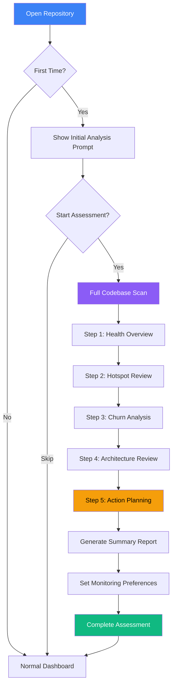

# Initial Analysis Mode

## User Story

**As a developer opening a codebase for the first time**, I want a guided "initial assessment" experience that walks me through the key insights, so that I can quickly build a mental model of the codebase health.

## User Need

Developers frequently inherit codebases, join new projects, or evaluate acquisitions. The first question is always: "What's the state of this code?"

Without guidance, users face:

- 50 different metrics with no context
- Paralysis about where to start
- Missed critical issues buried in data
- No clear path from analysis to action

Initial Analysis Mode provides:

- Curated "first look" at the codebase
- Prioritized findings (most important first)
- Guided walkthrough of key views
- Clear action items at the end

---

## UX Flow

### Entry Points

1. **Automatic:** First time opening a repository
2. **Manual:** "Run Initial Assessment" from menu
3. **Reset:** "Re-run Initial Assessment" in settings

### User Journey



### Exit Points

1. **Complete:** Finish all steps and enter normal dashboard
2. **Skip:** Skip remaining steps (can resume later)
3. **Export:** Generate PDF report at any step
4. **Action:** Jump to specific file from any step

---

## Information Architecture

### Assessment Steps

| Step | Name                | Focus             | Key Output                |
| ---- | ------------------- | ----------------- | ------------------------- |
| 1    | Health Overview     | Aggregate metrics | Overall health score      |
| 2    | Hotspot Review      | High-impact files | Top 10 priority files     |
| 3    | Churn Analysis      | Risk assessment   | Toxic files identified    |
| 4    | Architecture Review | Structural issues | AntiPatterns and patterns |
| 5    | Action Planning     | Next steps        | Prioritized action list   |

### Data Displayed Per Step

**Step 1: Health Overview**

- Repository name and size
- Overall health score (0-100)
- File type breakdown
- Complexity distribution chart
- Comparison to benchmarks

**Step 2: Hotspot Review**

- Blast radius treemap (simplified)
- Top 5 hotspot files
- Impact explanation for each
- Quick links to file details

**Step 3: Churn Analysis**

- Churn-complexity quadrant (simplified)
- Toxic file count with list
- Recent activity patterns
- Contributor concentration

**Step 4: Architecture Review**

- Anti-Pattern count by category
- Top 3 architectural concerns
- Circular dependency warnings
- Coupling hotspots

**Step 5: Action Planning**

- Prioritized issue list
- Estimated effort for top items
- Suggested starting points
- Option to set complexity budget

### Progressive Disclosure Strategy

Each step shows:

- **Summary:** 1-2 sentences explaining the finding
- **Visualization:** Appropriate chart or diagram
- **Top Items:** 3-5 most important findings
- **Expand:** Option to see full detail (deferred to normal dashboard)
- **Actions:** Step-specific actions (export, explore, etc.)

---

## Interaction Patterns

### Navigation Controls

| Action        | Trigger             | Result                         |
| ------------- | ------------------- | ------------------------------ |
| Next step     | "Continue" button   | Advance to next step           |
| Previous step | "Back" button       | Return to previous step        |
| Skip step     | "Skip" link         | Mark step as skipped, advance  |
| Skip all      | "Skip to Dashboard" | Exit wizard, enter normal mode |
| Restart       | Settings menu       | Re-run from step 1             |

### Step-Specific Actions

**Step 1:**

- Compare to industry benchmarks
- Export health summary

**Step 2:**

- Click hotspot to see detail
- Generate AI prompts for hotspots

**Step 3:**

- Filter quadrant by directory
- Mark files for later review

**Step 4:**

- Expand anti-pattern details
- Generate architecture report

**Step 5:**

- Drag to reorder priorities
- Set deadlines for items
- Export action plan

### Progress Indicator

Persistent header shows:

- Current step number (e.g., "Step 2 of 5")
- Step name
- Progress bar
- Time elapsed

---

## Component Map

⚠️ **CRITICAL: OVER-ENGINEERING RISK** ⚠️

**This wizard is NOT a mini-dashboard.** Its purpose is **quick initial assessment** to build mental model and identify starting points. Complexity must be minimal.

**Key Principle:** Only Step 1 gets a hero visualization (RadialGauge). Steps 2-4 use simple lists/tables. Defer detailed analysis to the main dashboard.

### Primary Components

| Component            | Import Path         | Configuration                      | Usage in Phase 13                     |
| -------------------- | ------------------- | ---------------------------------- | ------------------------------------- |
| **Wizard Container** | Custom (50-100 LOC) | steps, currentStep, onNext, onBack | Step progress indicator + navigation  |
| Modal                | @vipr/ui/modal      | size="xl", isOpen, onClose         | Wizard container for full-screen flow |

| **STEP 1 ONLY:**
| RadialGauge | @vipr/ui/radial-gauge | value, min, max, thresholds | **Hero metric - overall health score** |
| StatCard | @vipr/ui/stat-card | variant="default", value, title, subtitle | Metric breakdown (4 cards) |
| BarChart | @vipr/ui/bar-chart | data, orientation="vertical" | File type distribution |
| **STEPS 2-4 (SIMPLE):**
| CardList | @vipr/ui/card-list | items, renderItem, title | Hotspots (Step 2), Toxic files (Step 3) |
| CollapsibleTable | @vipr/ui/collapsible-table | data, columns | Anti-pattern details (Step 4) |
| Badge | @vipr/ui/badge | variant, size | Severity, status indicators |
| Button | @vipr/ui/button | appearance, size, onClick | View details, generate prompts |
| **STEP 5:**
| Accordion | @vipr/ui/accordion | items, defaultExpanded | Priority sections (Immediate/Soon/Backlog) |
| Checkbox | @vipr/ui/checkbox | checked, onChange, label | Action item checkboxes |
| Alert | @vipr/ui/alert | variant="card", type="info" | Completion message |

### Color Tokens

**Health Score (RadialGauge thresholds):**

- `green-500/20`, `green-700` - Excellent (80-100)
- `sky-500/20`, `sky-700` - Good (60-79)
- `yellow-500/20`, `yellow-700` - Fair (40-59)
- `red-500/20`, `red-700` - Poor (0-39)

**Status Indicators:**

- `green-500` - Healthy, no action needed
- `yellow-500` - Needs attention
- `red-500` - Critical, immediate action
- `gray-500` - Neutral state

**Wizard Progress:**

- `violet-500` - Current step
- `green-500` - Completed steps
- `gray-300` - Pending steps

### Typography Tokens

**Wizard Steps:**

- `text-3xl font-bold text-gray-800 dark:text-gray-100` - Step titles
- `text-lg text-gray-600 dark:text-gray-300` - Step descriptions

**Health Score:**

- `text-6xl font-bold` - Large health score number
- `text-sm text-gray-600 dark:text-gray-300` - Score interpretation

**Lists:**

- `text-sm font-medium text-gray-800 dark:text-gray-100` - Item titles
- `text-xs text-gray-600 dark:text-gray-300` - Item metadata

### Layout Patterns

**Wizard Container:**

```tsx
className = 'flex flex-col h-full max-w-6xl mx-auto';
```

**Step Header:**

```tsx
className =
  'flex items-center justify-between mb-6 pb-4 border-b border-gray-200 dark:border-gray-700';
```

**Step Content:**

```tsx
className = 'flex-1 overflow-y-auto px-8 py-6';
```

**Step Footer:**

```tsx
className =
  'flex items-center justify-between px-8 py-4 border-t border-gray-200 dark:border-gray-700';
```

### Wizard Container Pattern (Custom, 50-100 LOC)

**This pattern is reused in Phase 16 (Budget Creation Wizard)**

```tsx
interface WizardStep {
  id: string;
  title: string;
  description: string;
  component: React.ComponentType<StepProps>;
}

interface WizardContainerProps {
  steps: WizardStep[];
  onComplete: () => void;
  onSkip: () => void;
}

const WizardContainer: React.FC<WizardContainerProps> = ({ steps, onComplete, onSkip }) => {
  const [currentStepIndex, setCurrentStepIndex] = useState(0);
  const currentStep = steps[currentStepIndex];

  const handleNext = () => {
    if (currentStepIndex < steps.length - 1) {
      setCurrentStepIndex(prev => prev + 1);
    } else {
      onComplete();
    }
  };

  const handleBack = () => {
    if (currentStepIndex > 0) {
      setCurrentStepIndex(prev => prev - 1);
    }
  };

  return (
    <div className="flex flex-col h-screen">
      {/* Progress Indicator */}
      <div className="px-8 py-4 border-b border-gray-200 dark:border-gray-700">
        <div className="flex items-center justify-between mb-2">
          <h2 className="text-sm font-medium text-gray-600 dark:text-gray-400">
            Initial Assessment
          </h2>
          <span className="text-sm text-gray-600 dark:text-gray-400">
            Step {currentStepIndex + 1} of {steps.length}
          </span>
        </div>

        {/* Step breadcrumbs */}
        <div className="flex items-center gap-2">
          {steps.map((step, index) => (
            <div key={step.id} className="flex items-center">
              <div
                className={cn(
                  'w-8 h-8 rounded-full flex items-center justify-center text-sm font-semibold',
                  index < currentStepIndex && 'bg-green-500 text-white',
                  index === currentStepIndex && 'bg-violet-500 text-white',
                  index > currentStepIndex && 'bg-gray-200 dark:bg-gray-700 text-gray-500'
                )}
              >
                {index < currentStepIndex ? '✓' : index + 1}
              </div>

              {index < steps.length - 1 && (
                <div
                  className={cn(
                    'h-0.5 w-12 mx-2',
                    index < currentStepIndex && 'bg-green-500',
                    index >= currentStepIndex && 'bg-gray-200 dark:bg-gray-700'
                  )}
                />
              )}
            </div>
          ))}
        </div>
      </div>

      {/* Step Content */}
      <div className="flex-1 overflow-y-auto px-8 py-6">
        <div className="max-w-4xl mx-auto">
          <h1 className="text-3xl font-bold text-gray-800 dark:text-gray-100 mb-2">
            {currentStep.title}
          </h1>
          <p className="text-lg text-gray-600 dark:text-gray-300 mb-8">{currentStep.description}</p>

          <currentStep.component onNext={handleNext} />
        </div>
      </div>

      {/* Navigation Footer */}
      <div className="px-8 py-4 border-t border-gray-200 dark:border-gray-700 flex items-center justify-between">
        <Button appearance="secondary" onClick={handleBack} disabled={currentStepIndex === 0}>
          Back
        </Button>

        <div className="flex items-center gap-3">
          <Button appearance="tertiary" onClick={onSkip}>
            Skip to Dashboard
          </Button>
          <Button appearance="primary" onClick={handleNext}>
            {currentStepIndex < steps.length - 1 ? 'Continue' : 'Complete'}
          </Button>
        </div>
      </div>
    </div>
  );
};
```

### Step-by-Step Component Specifications

#### Step 1: Health Overview (ONLY STEP WITH HERO VISUALIZATION)

```tsx
<div className="space-y-8">
  {/* Hero metric - RadialGauge */}
  <div className="flex flex-col items-center py-8">
    <RadialGauge
      value={healthScore}
      min={0}
      max={100}
      label="Health Score"
      thresholds={[
        { value: 40, color: 'red' },
        { value: 60, color: 'yellow' },
        { value: 80, color: 'sky' },
        { value: 100, color: 'green' },
      ]}
      direction="higher-is-better"
      size="lg"
    />

    <p className="text-center text-gray-600 dark:text-gray-300 mt-4 max-w-md">
      {getScoreInterpretation(healthScore)}
    </p>
  </div>

  {/* Metric breakdown - 4 StatCards */}
  <div className="grid grid-cols-1 sm:grid-cols-2 lg:grid-cols-4 gap-4">
    <StatCard
      variant="default"
      title="Complexity"
      value={68}
      subtitle="Needs attention"
      icon={<ComplexityIcon />}
    />
    <StatCard
      variant="default"
      title="Maintainability"
      value={75}
      subtitle="Good"
      icon={<MaintainIcon />}
    />
    <StatCard
      variant="default"
      title="Test Coverage"
      value={71}
      subtitle="Good"
      icon={<TestIcon />}
    />
    <StatCard
      variant="default"
      title="Documentation"
      value={74}
      subtitle="Good"
      icon={<DocIcon />}
    />
  </div>

  {/* File distribution - BarChart */}
  <div>
    <h3 className="text-lg font-semibold text-gray-800 dark:text-gray-100 mb-4">
      File Distribution
    </h3>
    <BarChart
      data={{
        labels: ['TypeScript', 'JavaScript', 'JSX/TSX'],
        datasets: [
          {
            label: 'Files',
            data: [156, 45, 33],
            backgroundColor: ['#8470ff', '#67bfff', '#4bd37d'],
          },
        ],
      }}
      orientation="vertical"
      height={200}
    />
  </div>
</div>
```

#### Step 2: Hotspot Review (SIMPLE - CardList, NOT Treemap)

❌ **DON'T:** Use Treemap visualization - too complex for initial assessment
✅ **DO:** Use simple CardList of top 5 hotspots

```tsx
<div className="space-y-6">
  <Alert variant="card" type="info">
    These 5 files have the highest "blast radius" - changes here affect many other files. Prioritize
    careful review and testing when modifying.
  </Alert>

  <CardList
    items={top5Hotspots}
    variant="default"
    title="Top Hotspots"
    renderItem={hotspot => ({
      title: (
        <div className="flex items-center justify-between">
          <span className="font-mono text-sm">{hotspot.path}</span>
          <Badge variant="red" size="sm">
            Impact: {hotspot.dependents}
          </Badge>
        </div>
      ),
      subtitle: `Complexity: ${hotspot.complexity} | ${hotspot.description}`,
      actions: (
        <div className="flex gap-2 mt-2">
          <Button appearance="secondary" size="sm" onClick={() => viewDetails(hotspot.id)}>
            View Details
          </Button>
          <Button appearance="tertiary" size="sm" onClick={() => generatePrompt(hotspot.id)}>
            AI Prompt
          </Button>
        </div>
      ),
    })}
  />
</div>
```

**Why not Treemap:**

- Treemaps require significant cognitive load to interpret
- Initial assessment is about quick wins, not deep exploration
- CardList provides same data with zero learning curve
- Users can explore full treemap in main Blast Radius view

#### Step 3: Churn Analysis (SIMPLE - CardList, NOT Scatter Plot)

❌ **DON'T:** Use churn-complexity scatter plot - too complex for quick assessment
✅ **DO:** Use CardList of toxic files + summary StatCards

```tsx
<div className="space-y-6">
  {/* Summary stats */}
  <div className="grid grid-cols-1 sm:grid-cols-3 gap-4">
    <StatCard
      variant="compact"
      title="Toxic Files"
      value={toxicFiles.length}
      subtitle="High churn + complexity"
      icon={<AlertIcon className="text-red-500" />}
    />
    <StatCard
      variant="compact"
      title="Recent Changes"
      value={recentChanges}
      subtitle="Last 30 days"
    />
    <StatCard
      variant="compact"
      title="Contributors"
      value={contributorCount}
      subtitle="Active developers"
    />
  </div>

  {/* Toxic files list */}
  <CardList
    items={toxicFiles}
    variant="default"
    title="Files Requiring Attention"
    description="High churn combined with high complexity indicates refactoring opportunity"
    renderItem={file => ({
      title: (
        <div className="flex items-center justify-between">
          <span className="font-mono text-sm">{file.path}</span>
          <div className="flex gap-2">
            <Badge variant="yellow" size="sm">
              Churn: {file.churnScore}
            </Badge>
            <Badge variant="red" size="sm">
              Complexity: {file.complexity}
            </Badge>
          </div>
        </div>
      ),
      subtitle: `${file.changeCount} changes in last 30 days`,
      actions: (
        <Button appearance="secondary" size="sm" onClick={() => viewDetails(file.id)}>
          View History
        </Button>
      ),
    })}
  />
</div>
```

#### Step 4: Architecture Review (CollapsibleTable for Anti-Patterns)

```tsx
<div className="space-y-6">
  {/* Summary stats */}
  <div className="grid grid-cols-1 sm:grid-cols-3 gap-4">
    <StatCard
      variant="compact"
      title="Anti-Patterns"
      value={antiPatternCount}
      subtitle="Issues detected"
    />
    <StatCard
      variant="compact"
      title="Circular Deps"
      value={circularDeps.length}
      subtitle={circularDeps.length > 0 ? 'Needs attention' : 'None'}
    />
    <StatCard
      variant="compact"
      title="High Coupling"
      value={highCouplingCount}
      subtitle="Files to review"
    />
  </div>

  {/* Circular dependency warning */}
  {circularDeps.length > 0 && (
    <Alert variant="banner" type="error">
      {circularDeps.length} circular {circularDeps.length === 1 ? 'dependency' : 'dependencies'}{' '}
      detected - this blocks clean testing and increases complexity.
    </Alert>
  )}

  {/* Anti-patterns collapsible table */}
  <CollapsibleTable
    title="Top Architectural Concerns"
    subtitle="Expand rows to see details and recommendations"
    columns={[
      { key: 'type', label: 'Anti-Pattern Type' },
      { key: 'count', label: 'Files Affected' },
      { key: 'severity', label: 'Severity' },
    ]}
    data={topAntiPatterns.map(pattern => ({
      type: pattern.name,
      count: pattern.fileCount,
      severity: (
        <Badge variant={pattern.severity === 'critical' ? 'red' : 'yellow'} size="sm">
          {pattern.severity}
        </Badge>
      ),
      expandedContent: (
        <div className="space-y-3 p-4 bg-gray-50 dark:bg-gray-900 rounded">
          <p className="text-sm text-gray-700 dark:text-gray-300">{pattern.description}</p>
          <div className="text-xs text-gray-600 dark:text-gray-400">
            <strong>Recommendation:</strong> {pattern.recommendation}
          </div>
          <Button
            appearance="secondary"
            size="sm"
            onClick={() => generateRefactoringPrompt(pattern)}
          >
            Generate Refactoring Prompt
          </Button>
        </div>
      ),
    }))}
  />
</div>
```

#### Step 5: Action Planning (Accordion + Checkboxes)

```tsx
<div className="space-y-6">
  <Alert variant="card" type="info">
    Based on your assessment, here's a prioritized action plan. Check off items as you complete them.
  </Alert>

  <Accordion
    items={[
      {
        title: 'PRIORITY 1 - Immediate (This Week)',
        content: (
          <div className="space-y-3">
            {immediatePriority.map((item, index) => (
              <div key={index} className="flex items-start gap-3 p-3 rounded hover:bg-gray-50 dark:hover:bg-gray-800">
                <Checkbox
                  checked={item.completed}
                  onChange={(checked) => toggleItemCompletion(item.id, checked)}
                  label=""
                />
                <div className="flex-1">
                  <p className="text-sm font-medium text-gray-800 dark:text-gray-100">
                    {item.title}
                  </p>
                  <p className="text-xs text-gray-600 dark:text-gray-400 mt-1">
                    {item.description} • Est: {item.effort}
                  </p>
                  <Button
                    appearance="tertiary"
                    size="xs"
                    onClick={() => generateActionPrompt(item)}
                    className="mt-2"
                  >
                    Generate Prompt
                  </Button>
                </div>
              </div>
            ))}
          </div>
        )
      },
      {
        title: 'PRIORITY 2 - Soon (This Month)',
        content: (
          // Same structure as Priority 1
        )
      },
      {
        title: 'PRIORITY 3 - Backlog (When Time Permits)',
        content: (
          // Same structure
        )
      }
    ]}
    defaultExpanded
    allowMultiple
  />

  {/* Next steps actions */}
  <div className="grid grid-cols-1 sm:grid-cols-2 gap-4 pt-6">
    <Button appearance="secondary" onClick={exportActionPlan}>
      Export Action Plan
    </Button>
    <Button appearance="secondary" onClick={setComplexityBudget}>
      Set Complexity Budget
    </Button>
  </div>
</div>
```

### Responsive Behavior

**Mobile (< 640px):**

- Wizard container uses bottom sheet on mobile
- Stats collapse to single column
- CardList items stack vertically
- Accordion sections collapse by default

**Tablet (640px - 1024px):**

- Stats show 2 columns
- Wizard progress shows compact step numbers only
- Full content visible

**Desktop (1024px+):**

- Full wizard with step labels
- Stats show 3-4 columns
- Generous spacing

### Dark Mode Considerations

All wizard components adapt automatically via Tailwind `dark:` variants:

- Modal backdrop: semi-transparent with proper contrast
- Step progress: Colored badges work in both modes
- RadialGauge: Uses alpha variants for thresholds
- CardList: Background `white` → `gray-800`

## Design System Gaps

### Gap 1: Wizard/Stepper Progress Indicator 🧭 MEDIUM PRIORITY

**Description:** Numbered step indicator with completed/active/pending visual states.

**Current Impact on Phase 13:**

- Must build custom 50-100 LOC wizard container
- Step progress uses custom breadcrumb-style component
- Not reusable across app without abstraction

**Implemented Solution (Above):**

Custom `WizardContainer` component (~80 LOC) with:

- Step progress breadcrumb with numbered badges
- Color-coded states (green=completed, violet=active, gray=pending)
- Navigation footer with Back/Skip/Continue buttons
- Step content area with scroll

**Why this works:**

- ✅ Simple enough to build inline (not a complex abstraction)
- ✅ Provides clear visual progress
- ✅ Reusable for Phase 16 (Budget Creation Wizard)
- ✅ Accessible (ARIA labels, keyboard navigation)

**Future Enhancement:**

- Extract to dedicated `Wizard` component in `@vipr/ui`
- Add more customization options (vertical stepper, icon-based steps)
- Add step validation and conditional navigation
- Timeline: If we have 3+ wizard flows, extract to shared component

**User Impact:** Low - custom implementation is sufficient

---

## Visual Concepts

**NOTE:** Visual concepts updated to reflect simplified component approach. Complex visualizations (treemap, scatter plot) deferred to main dashboard views.

### Assessment Welcome Screen

```
================================================================================

                    Welcome to Vipr Desktop

               Let's assess your codebase health

================================================================================

Repository: my-app
Path: /Users/dev/my-app
Files detected: 234 TypeScript/JavaScript files
Size: ~45,000 lines of code

The Initial Assessment will:

  1. Scan all files for complexity and quality metrics
  2. Identify high-impact hotspots requiring attention
  3. Analyze code churn patterns and risk areas
  4. Detect architectural anti-patterns and anti-patterns
  5. Generate a prioritized action plan

Estimated time: 2-3 minutes for scan, 5-10 minutes for review

+-------------------------------+    +-------------------------------+
|      [Start Assessment]       |    |      [Skip to Dashboard]      |
|                               |    |                               |
|   Full guided walkthrough     |    |   I know what I'm doing       |
+-------------------------------+    +-------------------------------+

================================================================================
```

### Step 1: Health Overview

```
================================================================================
Initial Assessment                                      Step 1 of 5: Health
================================================================================
                                              [< Back]  [Skip]  [Continue >]

YOUR CODEBASE HEALTH SCORE

                    +-------------------+
                    |                   |
                    |        72         |
                    |      /100         |
                    |                   |
                    |   [========--]    |
                    |                   |
                    +-------------------+

This score is AVERAGE compared to similar JavaScript/TypeScript codebases.
You have room for improvement, but no critical issues requiring immediate action.

BREAKDOWN:

Metric                  Score    Status
----------------------------------------------
Complexity              68       Needs attention
Maintainability         75       Good
Test Coverage           71       Good
Documentation           74       Good

FILE DISTRIBUTION:

  TypeScript:  156 files (67%)  [=================----]
  JavaScript:   45 files (19%)  [=====-----------------]
  JSX/TSX:      33 files (14%)  [===-----------------]

================================================================================
```

### Step 2: Hotspot Review

```
================================================================================
Initial Assessment                                      Step 2 of 5: Hotspots
================================================================================
                                              [< Back]  [Skip]  [Continue >]

HIGH-IMPACT FILES

These 5 files have the highest "blast radius" - changes here affect many
other files. Prioritize careful review and testing when modifying.

+------------------------------------------------------------------+
|                                                                   |
|  [Simplified treemap visualization with top 5 hotspots labeled]  |
|                                                                   |
+------------------------------------------------------------------+

TOP HOTSPOTS:

1. src/services/auth/index.ts           Impact: 47 dependents
   Complexity: 78 | Changes affect authentication across entire app
   [View Details] [Generate AI Prompt]

2. src/components/DataTable/index.tsx   Impact: 32 dependents
   Complexity: 65 | Core UI component used in 12 features
   [View Details] [Generate AI Prompt]

3. src/hooks/useDataFetch.ts            Impact: 28 dependents
   Complexity: 54 | Data fetching used by most components
   [View Details] [Generate AI Prompt]

4. src/utils/validation.ts              Impact: 24 dependents
   Complexity: 42 | Validation logic shared across forms
   [View Details] [Generate AI Prompt]

5. src/api/client.ts                    Impact: 21 dependents
   Complexity: 38 | API client used by all data operations
   [View Details] [Generate AI Prompt]

================================================================================
```

### Step 5: Action Planning

```
================================================================================
Initial Assessment                                      Step 5 of 5: Actions
================================================================================
                                              [< Back]  [Skip]  [Complete >]

YOUR PRIORITIZED ACTION PLAN

Based on the assessment, here are recommended next steps:

PRIORITY 1 - IMMEDIATE (This Week)
----------------------------------------------------------------------
[ ] Review auth/index.ts complexity (4-8 hours)
    High blast radius + High complexity = Critical risk
    [Generate Refactoring Prompt]

[ ] Break circular dependency in services/ (2-4 hours)
    Architectural anti-pattern blocking clean testing
    [View Dependency Graph]

PRIORITY 2 - SOON (This Month)
----------------------------------------------------------------------
[ ] Refactor DataTable component (8-16 hours)
    God component anti-pattern detected
    [View Anti-Pattern Details]

[ ] Address prop drilling in Dashboard (4-8 hours)
    Passing props through 4 levels
    [View Affected Components]

PRIORITY 3 - BACKLOG (When Time Permits)
----------------------------------------------------------------------
[ ] Improve test coverage in utils/ (ongoing)
[ ] Document API client usage patterns (2-4 hours)
[ ] Consolidate duplicate validation logic (4-8 hours)

NEXT STEPS:
----------------------------------------------------------------------
+-------------------------------+    +-------------------------------+
| [Export Action Plan as PDF]   |    |   [Set Complexity Budget]     |
+-------------------------------+    +-------------------------------+

+-------------------------------+    +-------------------------------+
| [Enable Monitoring Alerts]    |    |   [Complete Assessment]       |
+-------------------------------+    +-------------------------------+

================================================================================
```

---

## Psychological Principles

### Guided Discovery

Rather than presenting all data and expecting users to find patterns, we guide them through a curated journey. This reduces cognitive load and ensures critical findings aren't missed.

### Progressive Commitment

Each step is a small commitment. Users can stop any time but are encouraged to continue. Completion provides closure and a sense of accomplishment.

### Actionable Endings

The assessment ends with concrete action items, not just data. This prevents the common pattern of "analysis paralysis" where users see problems but don't know where to start.

### Benchmarking

Comparing to "similar codebases" provides context. A score of 72 means nothing alone; knowing it's "average" or "above average" makes it meaningful.

---

## Success Metrics

| Metric              | Target       | Measurement                                   |
| ------------------- | ------------ | --------------------------------------------- |
| Completion rate     | > 70%        | Users who finish all 5 steps                  |
| Time to complete    | < 10 minutes | Review portion (excludes scan)                |
| Action taken        | > 50%        | Users who take action from step 5             |
| Return to dashboard | > 80%        | Users who continue using app after assessment |

---

## Integration with Broader Application

### Feature Dependencies

**Requires:**

- Blast Radius (US-NEW-01) - Hotspot data for step 2
- Churn-Complexity Quadrant (US-NEW-03) - Risk data for step 3
- Architectural AntiPatterns (US-NEW-04) - Anti-Pattern data for step 4

**Enables:**

- Ongoing Monitoring Mode (US-NEW-14) - Transitions from initial to ongoing
- Complexity Budget (US-NEW-16) - Set budget from action planning

### State Management

```typescript
interface AssessmentState {
  status: 'not_started' | 'in_progress' | 'completed' | 'skipped';
  currentStep: 1 | 2 | 3 | 4 | 5;
  stepsCompleted: number[];
  stepsSkipped: number[];
  startedAt?: number;
  completedAt?: number;
  actionItems: ActionItem[];
}
```

### Persistence

Assessment state is stored in SQLite per repository:

- Users can resume interrupted assessments
- Completed assessments show "Re-run" option in settings
- Action items persist and can be tracked over time

---

## Open Questions

1. **Benchmark data:** Where do we get comparison benchmarks? Static data? Community aggregate?

2. **Step customization:** Should users be able to skip steps proactively (e.g., "I only care about architecture")?

3. **Team sharing:** Can assessment results be shared with team members? Requires cloud features.

4. **Re-assessment triggers:** Should we prompt for re-assessment after major changes (e.g., many new files)?

5. **Onboarding integration:** Should assessment include product tour elements (feature explanations)?
