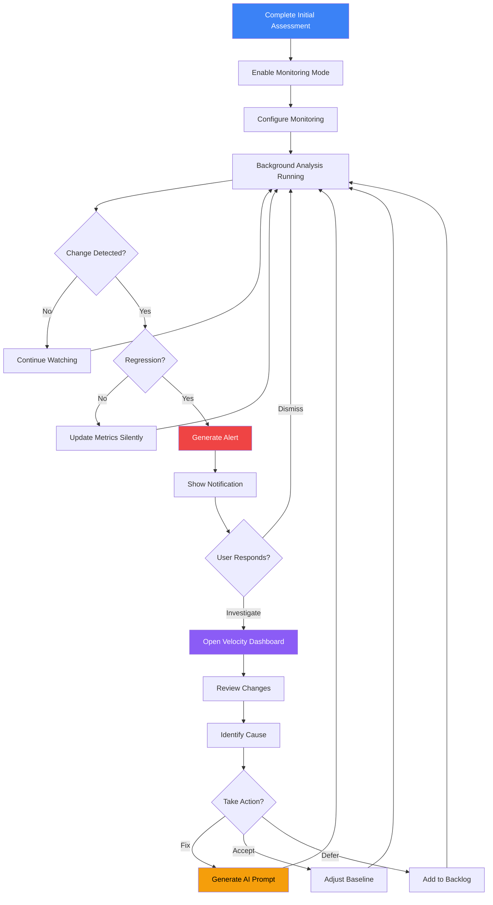

# Ongoing Monitoring Mode

## User Story

**As a developer who has completed initial assessment**, I want the app to shift into "ongoing monitoring" mode that emphasizes change detection and regression alerts, so that I can maintain awareness without active investigation.

## User Need

After the initial assessment, the relationship with a codebase changes. Users no longer need to build a mental model from scratch. Instead, they need to:

- Know when something changes
- Understand if changes are good or bad
- Catch regressions before they compound
- Track progress on improvement initiatives

Ongoing monitoring is passive-first: the app watches in the background and alerts when attention is needed. This respects the developer's primary work (writing code) while ensuring codebase health stays visible.

---

## UX Flow

### Entry Points

1. **Automatic:** Transitions from Initial Analysis completion
2. **Manual:** "Switch to Monitoring Mode" in settings
3. **System Tray:** Click tray icon to see monitoring status

### User Journey



### Exit Points

1. **To Dashboard:** Click notification to investigate
2. **To Settings:** Adjust monitoring preferences
3. **To Initial Assessment:** Re-run full assessment
4. **To Comparison:** View specific snapshot comparison

---

## Information Architecture

### Monitoring Configuration

| Setting            | Options                                       | Default      |
| ------------------ | --------------------------------------------- | ------------ |
| Watch frequency    | On file save, Every 5 min, Hourly, Daily      | On file save |
| Snapshot frequency | Every commit, Daily, Weekly                   | Daily        |
| Alert threshold    | Sensitivity slider (1-10)                     | 5            |
| Alert types        | Regression, Budget exceeded, New anti-pattern | All enabled  |
| Quiet hours        | Time range                                    | 10pm - 8am   |

### Data Displayed

**Monitoring Dashboard (Compact View)**

- Current health score with sparkline
- Change since last snapshot
- Active alerts (if any)
- Last analysis timestamp
- Quick actions

**Alert Details**

- Type of regression
- Affected files
- Magnitude of change
- Likely cause (if detectable)
- Recommended actions

**Trend View**

- Velocity chart (last 30 days)
- Alert history
- Budget status
- Milestone markers

### Progressive Disclosure Strategy

| Always Visible | On Alert       | On Click          |
| -------------- | -------------- | ----------------- |
| Health score   | Alert badge    | Full dashboard    |
| Trend arrow    | Alert summary  | Historical data   |
| Last updated   | Affected count | File-level detail |

---

## Interaction Patterns

### Passive Monitoring

| Event               | System Response    | User Notification      |
| ------------------- | ------------------ | ---------------------- |
| File saved          | Queue for analysis | None                   |
| Analysis complete   | Update metrics     | Status bar update only |
| Small change        | Record delta       | None                   |
| Regression detected | Generate alert     | Desktop notification   |
| Budget exceeded     | Generate alert     | Desktop notification   |
| New anti-pattern    | Generate alert     | Desktop notification   |

### Alert Interactions

| Action        | Trigger             | Result                           |
| ------------- | ------------------- | -------------------------------- |
| View alert    | Click notification  | Open relevant dashboard section  |
| Dismiss alert | Click X or swipe    | Remove from queue (still logged) |
| Snooze alert  | Click snooze button | Hide for configurable time       |
| Investigate   | Click "Investigate" | Open comparison view             |

### Dashboard Actions

| Action           | Trigger       | Result                           |
| ---------------- | ------------- | -------------------------------- |
| Pause monitoring | Toggle switch | Stop watching (manual re-enable) |
| Force snapshot   | Button click  | Create snapshot immediately      |
| Clear alerts     | Button click  | Dismiss all pending alerts       |
| Export status    | Button click  | Generate status report           |

---

## Component Map

This section provides explicit `@vipr/ui` component specifications for ongoing monitoring mode.

### Primary Components

| Component    | Import Path            | Configuration                            | Usage in Phase 14                               |
| ------------ | ---------------------- | ---------------------------------------- | ----------------------------------------------- |
| StatCard     | @vipr/ui/stat-card     | variant="default", chart slot            | Health score with sparkline in chart slot       |
| StatCard     | @vipr/ui/stat-card     | variant="compact", value, subtitle       | Delta metrics (change since last snapshot)      |
| LineChart    | @vipr/ui/line-chart    | data, width (sparkline), height          | Sparklines in StatCard + velocity trends        |
| Alert        | @vipr/ui/alert         | variant="toast"/"banner", type, children | Regression notifications with action buttons    |
| ActivityFeed | @vipr/ui/activity-feed | items, renderItemContent                 | Recent activity timeline                        |
| Badge        | @vipr/ui/badge         | variant, size                            | Monitoring status (Active/Paused), alert counts |
| Switch       | @vipr/ui/switch        | checked, onChange                        | Pause/resume monitoring toggle                  |
| Button       | @vipr/ui/button        | appearance, size, onClick                | Investigate, snooze, dismiss actions            |
| CardTable    | @vipr/ui/card-table    | data, columns                            | Affected files in regression investigation      |
| EmptyState   | @vipr/ui/empty-state   | icon, title, message                     | No active alerts state                          |

### Color Tokens

**Monitoring Status:**

- `green-500` / `green-500/20` - Healthy, no alerts
- `yellow-500` / `yellow-500/20` - Warning alerts pending
- `red-500` / `red-500/20` - Critical alerts, regression detected
- `gray-500` / `gray-400` - Monitoring paused

**Health Trends:**

- `green-500` - Improving (+)
- `red-500` - Declining (-)
- `gray-500` - Stable (≈0)

**Alert Types:**

- `red-500` - Regression
- `yellow-500` - Budget exceeded
- `violet-500` - New anti-pattern

### Typography Tokens

**Health Score:**

- `text-4xl font-bold text-gray-800 dark:text-gray-100` - Large health score display
- `text-sm text-gray-600 dark:text-gray-300` - Score label

**Activity Events:**

- `text-sm font-medium text-gray-800 dark:text-gray-100` - Event description
- `text-xs text-gray-500 dark:text-gray-400` - Timestamp

**Alert Messages:**

- `text-lg font-semibold text-gray-800 dark:text-gray-100` - Alert title
- `text-sm text-gray-700 dark:text-gray-300` - Alert description

### Layout Patterns

**Page Container:**

```tsx
className = 'px-4 sm:px-6 lg:px-8 py-8';
```

**Health Score Section:**

```tsx
className = 'mb-8';
```

**Delta Stats Row:**

```tsx
className = 'grid grid-cols-1 sm:grid-cols-3 gap-4 mb-6';
```

### Composition Patterns

#### Monitoring Dashboard Page

```tsx
<div className="px-4 sm:px-6 lg:px-8 py-8">
  {/* Page header */}
  <div className="flex items-center justify-between mb-6">
    <div>
      <h1 className="text-2xl font-semibold text-gray-800 dark:text-gray-100">
        Monitoring Dashboard
      </h1>
      <p className="text-sm text-gray-600 dark:text-gray-300 mt-1">
        {repository.name} • Monitoring: {isMonitoring ? 'Active' : 'Paused'}
      </p>
    </div>

    <div className="flex items-center gap-3">
      <div className="flex items-center gap-2">
        <span className="text-sm text-gray-700 dark:text-gray-300">
          {isMonitoring ? 'Pause' : 'Resume'}
        </span>
        <Switch checked={isMonitoring} onChange={setIsMonitoring} />
      </div>
      <Button appearance="secondary" onClick={forceSnapshot}>
        Force Snapshot
      </Button>
    </div>
  </div>

  {/* Current status - Health score with sparkline */}
  <div className="mb-8">
    <h2 className="text-lg font-semibold text-gray-800 dark:text-gray-100 mb-4">Current Status</h2>

    <StatCard
      variant="default"
      title="Health Score"
      value={currentHealth}
      subtitle={`Last snapshot: ${formatRelativeTime(lastSnapshot)}`}
      chart={
        <LineChart
          data={{
            labels: last7Days,
            datasets: [
              {
                data: healthHistory,
                borderColor:
                  currentHealth >= 80
                    ? '#4bd37d'
                    : currentHealth >= 60
                      ? '#67bfff'
                      : currentHealth >= 40
                        ? '#f0bb33'
                        : '#ff5656',
                backgroundColor: 'transparent',
                borderWidth: 2,
                pointRadius: 3,
                pointBackgroundColor: 'white',
                tension: 0.4,
              },
            ],
          }}
          options={{
            plugins: {
              legend: { display: false },
              tooltip: {
                callbacks: {
                  label: context => `Health: ${context.parsed.y}`,
                },
              },
            },
            scales: {
              x: { display: false },
              y: {
                display: true,
                min: 0,
                max: 100,
                ticks: {
                  stepSize: 25,
                },
              },
            },
          }}
          height={120}
        />
      }
    />
  </div>

  {/* Delta metrics - compact StatCards */}
  <div className="grid grid-cols-1 sm:grid-cols-3 gap-4 mb-8">
    <StatCard
      variant="compact"
      title="Change (24h)"
      value={delta24h > 0 ? `+${delta24h}` : delta24h}
      subtitle={delta24h > 0 ? 'Improving' : delta24h < 0 ? 'Declining' : 'Stable'}
      icon={
        delta24h > 0 ? (
          <TrendingUpIcon className="text-green-500" />
        ) : delta24h < 0 ? (
          <TrendingDownIcon className="text-red-500" />
        ) : (
          <MinusIcon className="text-gray-500" />
        )
      }
    />

    <StatCard
      variant="compact"
      title="Active Alerts"
      value={activeAlerts.length}
      subtitle={activeAlerts.length === 0 ? 'All clear' : 'Needs attention'}
      icon={
        activeAlerts.length === 0 ? (
          <CheckCircleIcon className="text-green-500" />
        ) : (
          <AlertCircleIcon className="text-red-500" />
        )
      }
    />

    <StatCard
      variant="compact"
      title="Next Snapshot"
      value={formatRelativeTime(nextSnapshot)}
      subtitle={`Every ${snapshotFrequency}`}
      icon={<ClockIcon className="text-gray-500" />}
    />
  </div>

  {/* Active alerts section */}
  <div className="mb-8">
    <h2 className="text-lg font-semibold text-gray-800 dark:text-gray-100 mb-4">
      Active Alerts ({activeAlerts.length})
    </h2>

    {activeAlerts.length === 0 ? (
      <EmptyState
        icon={<CheckCircleIcon className="text-green-500 w-12 h-12" />}
        title="No active alerts"
        message="Your codebase is healthy. Monitoring will notify you if regressions are detected."
      />
    ) : (
      <div className="space-y-4">
        {activeAlerts.map(alert => (
          <Alert
            key={alert.id}
            variant="banner"
            type={alert.type === 'regression' ? 'error' : 'warning'}
            open={true}
            onClose={() => dismissAlert(alert.id)}
          >
            <div className="space-y-3">
              <div>
                <p className="font-semibold text-sm mb-1">
                  {alert.type === 'regression'
                    ? 'REGRESSION DETECTED'
                    : alert.type === 'budget'
                      ? 'BUDGET EXCEEDED'
                      : 'NEW ANTI-PATTERN DETECTED'}
                </p>
                <p className="text-sm">{alert.message}</p>
                {alert.details && (
                  <p className="text-xs text-gray-600 dark:text-gray-400 mt-1">{alert.details}</p>
                )}
              </div>

              {/* Action buttons in Alert children slot */}
              <div className="flex items-center gap-2">
                <Button appearance="secondary" size="sm" onClick={() => investigateAlert(alert.id)}>
                  Investigate
                </Button>
                <Button appearance="tertiary" size="sm" onClick={() => snoozeAlert(alert.id)}>
                  Snooze
                </Button>
                <Button appearance="tertiary" size="sm" onClick={() => dismissAlert(alert.id)}>
                  Dismiss
                </Button>
              </div>
            </div>
          </Alert>
        ))}
      </div>
    )}
  </div>

  {/* Recent activity - ActivityFeed */}
  <div className="mb-8">
    <h2 className="text-lg font-semibold text-gray-800 dark:text-gray-100 mb-4">Recent Activity</h2>

    <ActivityFeed
      items={recentActivity.map(event => ({
        id: event.id,
        type: 'custom',
        timestamp: event.timestamp,
        user: {
          name: event.author || 'System',
          avatar: event.author ? getAvatar(event.author) : null,
        },
        customIcon: getEventIcon(event.type),
        customContent: (
          <div>
            <p className="text-sm font-medium text-gray-800 dark:text-gray-100">
              {event.description}
            </p>
            {event.change && (
              <p className="text-xs text-gray-600 dark:text-gray-400 mt-1">
                Change: {event.change > 0 ? `+${event.change}` : event.change}
              </p>
            )}
          </div>
        ),
      }))}
      keyExtractor={item => item.id}
    />

    <div className="flex items-center gap-3 mt-6">
      <Button appearance="secondary" onClick={viewFullHistory}>
        View Full History
      </Button>
      <Button appearance="secondary" onClick={exportStatus}>
        Export Status Report
      </Button>
    </div>
  </div>

  {/* Velocity trend chart */}
  <div className="bg-white dark:bg-gray-800 rounded-xl shadow-xs p-6">
    <h2 className="text-lg font-semibold text-gray-800 dark:text-gray-100 mb-4">
      Velocity Trend (Last 30 Days)
    </h2>

    <LineChart
      data={{
        labels: last30Days,
        datasets: [
          {
            label: 'Health Score',
            data: healthTrend,
            borderColor: '#8470ff',
            backgroundColor: 'rgba(132, 112, 255, 0.1)',
            borderWidth: 2,
            fill: true,
            tension: 0.4,
          },
          {
            label: 'Complexity',
            data: complexityTrend,
            borderColor: '#ff5656',
            backgroundColor: 'rgba(255, 86, 86, 0.1)',
            borderWidth: 2,
            fill: true,
            tension: 0.4,
          },
        ],
      }}
      options={{
        plugins: {
          legend: {
            position: 'bottom',
          },
        },
        scales: {
          y: {
            beginAtZero: true,
            max: 100,
          },
        },
      }}
      height={300}
    />
  </div>
</div>
```

#### Alert with Action Buttons Pattern

**This demonstrates the Alert children slot for action buttons:**

```tsx
<Alert
  variant="banner" // or "toast" for desktop notifications
  type="error"
  open={true}
  onClose={() => dismissAlert(alertId)}
>
  <div className="space-y-3">
    {/* Alert content */}
    <div>
      <p className="font-semibold text-sm">REGRESSION DETECTED</p>
      <p className="text-sm">Health dropped from 85 to 78 (-7 points)</p>
      <p className="text-xs text-gray-600 dark:text-gray-400 mt-1">
        Likely cause: src/services/auth/index.ts
      </p>
    </div>

    {/* Action buttons in children slot */}
    <div className="flex items-center gap-2">
      <Button appearance="secondary" size="sm" onClick={handleInvestigate}>
        Investigate
      </Button>
      <Button appearance="tertiary" size="sm" onClick={handleSnooze}>
        Snooze
      </Button>
      <Button appearance="tertiary" size="sm" onClick={handleDismiss}>
        Dismiss
      </Button>
    </div>
  </div>
</Alert>
```

#### Regression Investigation View (CardTable)

```tsx
<CardTable
  title="Affected Files"
  description="Files that contributed to the regression"
  columns={[
    { key: 'file', label: 'File', sortable: true },
    { key: 'before', label: 'Before', sortable: true },
    { key: 'after', label: 'After', sortable: true },
    { key: 'delta', label: 'Delta', sortable: true },
    { key: 'cause', label: 'Likely Cause' },
  ]}
  data={affectedFiles.map(file => ({
    file: (
      <div>
        <div className="text-sm font-medium text-gray-800 dark:text-gray-100">{file.name}</div>
        <div className="text-xs font-mono text-gray-600 dark:text-gray-400">{file.path}</div>
      </div>
    ),
    before: <span className="text-sm text-gray-700 dark:text-gray-300">{file.before}</span>,
    after: (
      <span
        className={cn(
          'text-sm font-semibold',
          file.after > file.before && 'text-red-600 dark:text-red-400',
          file.after < file.before && 'text-green-600 dark:text-green-400'
        )}
      >
        {file.after}
      </span>
    ),
    delta: (
      <Badge variant={file.delta > 10 ? 'red' : file.delta > 5 ? 'yellow' : 'gray'} size="sm">
        {file.delta > 0 ? '+' : ''}
        {file.delta}
      </Badge>
    ),
    cause: <span className="text-xs text-gray-600 dark:text-gray-400">{file.cause}</span>,
  }))}
  onRowClick={(row, index) => openFileDetail(affectedFiles[index].id)}
  keyExtractor={(_, index) => affectedFiles[index].id}
/>
```

#### ActivityFeed with Custom Event Types

```tsx
<ActivityFeed
  items={[
    {
      id: '1',
      type: 'custom',
      timestamp: new Date('2024-01-15T14:30:00'),
      user: {
        name: 'System',
      },
      customIcon: <FileIcon className="text-gray-500" />,
      customContent: (
        <div>
          <p className="text-sm font-medium text-gray-800 dark:text-gray-100">
            src/auth/login.tsx modified
          </p>
          <p className="text-xs text-gray-600 dark:text-gray-400">No impact on health score</p>
        </div>
      ),
    },
    {
      id: '2',
      type: 'custom',
      timestamp: new Date('2024-01-15T09:00:00'),
      user: {
        name: 'System',
      },
      customIcon: <CameraIcon className="text-violet-500" />,
      customContent: (
        <div>
          <p className="text-sm font-medium text-gray-800 dark:text-gray-100">
            Daily snapshot created
          </p>
          <p className="text-xs text-green-600 dark:text-green-400">Health improved: +0.3</p>
        </div>
      ),
    },
    {
      id: '3',
      type: 'custom',
      timestamp: new Date('2024-01-14T16:45:00'),
      user: {
        name: 'System',
      },
      customIcon: <CheckCircleIcon className="text-green-500" />,
      customContent: (
        <div>
          <p className="text-sm font-medium text-gray-800 dark:text-gray-100">
            Budget check passed
          </p>
          <p className="text-xs text-gray-600 dark:text-gray-400">All budgets within limits</p>
        </div>
      ),
    },
  ]}
  keyExtractor={item => item.id}
/>
```

### Responsive Behavior

**Mobile (< 640px):**

- Delta stats stack vertically (single column)
- Alert buttons stack vertically
- ActivityFeed shows compact view
- Velocity chart height reduced to 200px

**Tablet (640px - 1024px):**

- Delta stats show 2 columns (first row: 2 items, second row: 1 item)
- Alert buttons remain horizontal
- Full ActivityFeed detail visible

**Desktop (1024px+):**

- Delta stats show 3 columns
- Generous spacing throughout
- Full chart and table details

### Dark Mode Considerations

All components adapt automatically:

- StatCard with chart: Chart uses theme-aware colors via getChartColors()
- Alert banners: Background and text adapt with proper contrast
- ActivityFeed: Timeline connector and icons use theme-aware colors
- Badge colors use alpha variants for better dark mode contrast

## Design System Gaps

**No gaps for Phase 14.** All required components exist:

- ✅ StatCard (default with chart slot) - exists (health score with sparkline)
- ✅ StatCard (compact) - exists (delta metrics)
- ✅ LineChart - exists (sparklines + velocity trends)
- ✅ Alert (banner/toast variants with children slot) - exists (regression notifications)
- ✅ ActivityFeed (with custom event types) - exists (recent activity)
- ✅ Badge - exists (monitoring status, alert counts)
- ✅ Switch - exists (pause/resume toggle)
- ✅ Button - exists (action buttons)
- ✅ CardTable - exists (affected files)
- ✅ EmptyState - exists (no alerts state)

**Alert Children Slot:** The Alert component's children slot is perfect for action buttons (Investigate/Snooze/Dismiss), avoiding the need for custom notification components.

**ActivityFeed Custom Events:** The ActivityFeed's `customContent` and `customIcon` props support monitoring-specific event types without needing new components.

---

## Visual Concepts

**NOTE:** Visual concepts updated to reflect StatCard with sparkline composition and Alert with action buttons pattern.

### System Tray Status

```
System Tray Icon States:

[GREEN DOT]  - Healthy, no alerts
[YELLOW DOT] - Warning alerts pending
[RED DOT]    - Critical alerts pending
[GRAY DOT]   - Monitoring paused
[SPINNING]   - Analysis in progress
```

### Tray Menu

```
+----------------------------------+
| Vipr Desktop                     |
+----------------------------------+
| my-app: Healthy (85)             |
|   Last updated: 5 min ago        |
|   No alerts                      |
+----------------------------------+
| client-portal: Warning (71)      |
|   Last updated: 2 hours ago      |
|   1 alert pending                |
+----------------------------------+
| [Open Dashboard]                 |
| [Pause Monitoring]               |
| [Settings]                       |
| [Quit]                           |
+----------------------------------+
```

### Monitoring Dashboard

```
================================================================================
Monitoring Dashboard                                      [Pause] [Force Snapshot]
================================================================================

CURRENT STATUS

my-app                                                Health: 85 [=========-]
+----------------------------------------------------------------+
|                                                                 |
| [Sparkline showing last 7 days: stable with slight improvement] |
|                                                                 |
+----------------------------------------------------------------+
Last snapshot: Today, 9:15 AM           Change: +0.3 (improving)
Next snapshot: Today, 5:00 PM           Monitoring: Active

ACTIVE ALERTS (0)
----------------------------------------------------------------------
No active alerts. Your codebase is healthy.

RECENT ACTIVITY
----------------------------------------------------------------------
| Time          | Event                                | Change      |
|---------------|--------------------------------------|-------------|
| 2 hours ago   | src/auth/login.tsx modified         | No impact   |
| 5 hours ago   | Daily snapshot created              | +0.3        |
| Yesterday     | 12 files modified                   | -0.1        |
| 2 days ago    | Budget check passed                 | --          |

[View Full History]    [Export Status Report]

================================================================================
```

### Alert Notification

```
+------------------------------------------------------------------+
| Vipr Desktop                                              [X]     |
|------------------------------------------------------------------|
| REGRESSION DETECTED                                               |
|                                                                   |
| Health dropped from 85 to 78 (-7 points)                         |
|                                                                   |
| Likely cause: src/services/auth/index.ts                         |
| Complexity increased from 45 to 68                                |
|                                                                   |
| +-------------+  +-------------+  +-------------+                 |
| |  Investigate |  |   Snooze    |  |   Dismiss   |                |
| +-------------+  +-------------+  +-------------+                 |
+------------------------------------------------------------------+
```

### Alert Investigation View

```
================================================================================
Regression Investigation                                              [< Back]
================================================================================

REGRESSION SUMMARY

Health Score Change: 85 -> 78 (-7 points)
Detected: Today, 2:34 PM
Files Affected: 3

AFFECTED FILES

| File                          | Before | After | Delta | Cause           |
|-------------------------------|--------|-------|-------|-----------------|
| src/services/auth/index.ts    |   45   |  68   |  +23  | New conditions  |
| src/api/client.ts             |   32   |  38   |   +6  | Error handling  |
| src/hooks/useAuth.ts          |   28   |  31   |   +3  | Dependency      |

COMMIT CORRELATION

Most likely commit: abc123f "Add OAuth2 support"
Author: jsmith
Date: Today, 2:15 PM

Changed files match regression pattern.

RECOMMENDED ACTIONS

1. Review auth/index.ts complexity
   The OAuth2 implementation added significant branching.
   Consider extracting OAuth-specific logic to separate module.
   [Generate AI Prompt]

2. Update complexity budget
   If this complexity is intentional, consider adjusting the
   budget to accommodate the new authentication flow.
   [Adjust Budget]

3. Defer to backlog
   Track this as technical debt for future refactoring.
   [Add to Backlog]

================================================================================
```

---

## Psychological Principles

### Ambient Awareness

The system tray icon provides glanceable status without requiring app focus. This supports peripheral awareness while minimizing distraction.

### Exception-Based Attention

By only alerting on exceptions (regressions, budget exceeded), we respect the user's primary task. Constant updates would cause alert fatigue.

### Contextual Alerts

Alerts include enough context to make immediate decisions. Users shouldn't need to open the app just to dismiss irrelevant alerts.

### Graceful Degradation

If monitoring is paused or the app is closed, nothing breaks. Users can catch up on changes when they return.

---

## Success Metrics

| Metric                | Target      | Measurement                                       |
| --------------------- | ----------- | ------------------------------------------------- |
| Alert relevance       | > 80%       | Alerts that lead to investigation (not dismissed) |
| Response time         | < 5 minutes | Time from alert to user action                    |
| False positive rate   | < 15%       | Alerts dismissed as noise                         |
| Regression catch rate | > 90%       | Regressions caught within 24 hours                |

---

## Integration with Broader Application

### Feature Dependencies

**Requires:**

- Velocity Dashboard (US-NEW-02) - Trend visualization
- Snapshot Comparison (US-NEW-15) - Regression investigation
- Complexity Budget (US-NEW-16) - Budget alerts

**Enables:**

- System Tray Monitoring (US-NEW-08) - Electron-specific
- Scheduled Background Analysis (US-NEW-20) - Electron-specific

### State Management

```typescript
interface MonitoringState {
  enabled: boolean;
  lastSnapshot: number;
  lastAnalysis: number;
  activeAlerts: Alert[];
  recentActivity: ActivityEvent[];
  config: MonitoringConfig;
}

interface Alert {
  id: string;
  type: 'regression' | 'budget' | 'anti-pattern' | 'stale';
  severity: 'critical' | 'warning' | 'info';
  title: string;
  message: string;
  affectedFiles: string[];
  likelyCause?: string;
  createdAt: number;
  acknowledgedAt?: number;
  dismissedAt?: number;
}
```

### Alert Storage

Alerts persist in SQLite:

- Alert history viewable in dashboard
- Dismissed alerts logged for pattern analysis
- Alert frequency informs sensitivity tuning

---

## Open Questions

1. **Cross-device sync:** Should monitoring status sync across devices? Would require cloud features.

2. **Team alerts:** Should alerts be shareable? "Hey team, our health dropped."

3. **Smart snooze:** Should snooze duration adapt based on patterns (e.g., longer snooze if often dismissed)?

4. **Integration alerts:** Should we alert on external events (CI failure, new PR)?

5. **Predictive alerts:** Can we predict regressions before they happen based on patterns?
