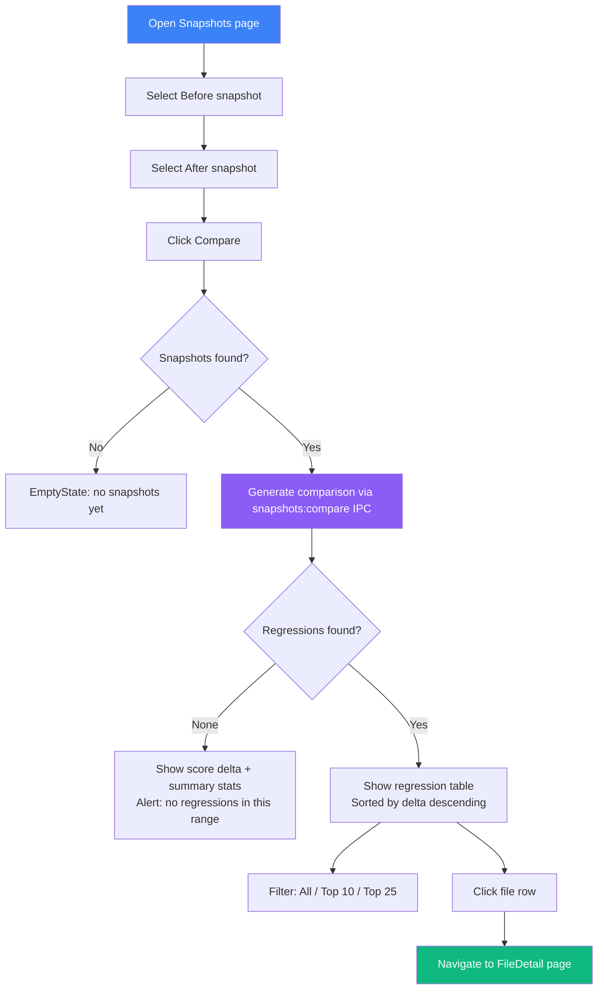
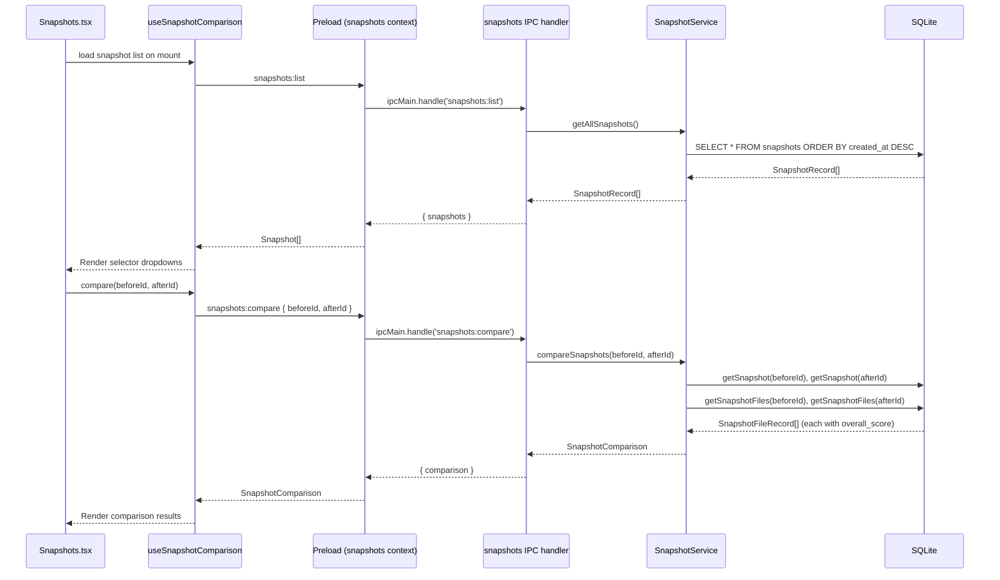

# Snapshot Comparison

## User Story

**As a developer or tech lead reviewing a period of development**, I want to compare any two snapshots side by side to see which files improved or degraded, so that I can understand what changed between analysis runs and act on regressions.

## User Need

When the health score shifts between snapshots, the raw delta alone is not enough. Users need to know:

- Which files drove the change?
- Did specific files regress or improve?
- How large was the per-file impact?
- Can I navigate to a regressed file to investigate further?

Round-two delivers this using data already available from `compareSnapshots()`: the before/after `SnapshotRecord`, counts of files added/removed/changed, the score delta, and the regression list. No git history traversal or author attribution is required at this stage — those capabilities are reserved for round-three.

---

## Scope Boundary

**Implemented in round-two (this phase):**

- Snapshot selector (Dropdown, not DatePicker) — choose before/after from the existing snapshot list
- Side-by-side score comparison witPromoh delta indicator
- Summary statistics: files changed, files added, files removed, score delta
- File changes table — files that regressed (score decreased), derived from `regressions[]`
- Filter by change direction: all regressions vs. largest regressions
- Navigate to file detail page from a regression row
- Empty state when no snapshots exist or no regressions found

**Deferred to round-three (Phase 02):**

- Git commit range queries between snapshots
- Author attribution and contributor breakdown
- PR reference detection
- Recommendations tab with AI-generated insights
- Commit history table

---

## UX Flow

### Entry Points

1. **Primary:** Snapshots page — "Compare" action selects two snapshots from the list
2. **Secondary:** Monitoring page — "View Comparison" button on a quality-degradation alert links to the comparison for the two snapshots that triggered the alert

### User Journey



### Exit Points

1. **To File Detail:** Click any regression row to open that file's detail view
2. **Back to Snapshots list:** Breadcrumb or clear selection

---

## Information Architecture

### Data Available from `compareSnapshots()`

The `SnapshotComparison` type returned by `snapshotService.compareSnapshots(beforeId, afterId)` provides:

| Field          | Type             | Description                                                                            |
| -------------- | ---------------- | -------------------------------------------------------------------------------------- |
| `before`       | `SnapshotRecord` | Before snapshot with `avg_score`, `git_sha`, `git_message`, `git_author`, `created_at` |
| `after`        | `SnapshotRecord` | After snapshot — same fields                                                           |
| `filesChanged` | `number`         | Files present in both snapshots                                                        |
| `filesAdded`   | `number`         | Files in after but not before                                                          |
| `filesRemoved` | `number`         | Files in before but not after                                                          |
| `scoreChange`  | `number`         | `after.avg_score - before.avg_score`                                                   |
| `regressions`  | `Array`          | Files where score decreased; contains `filePath`, `scoreBefore`, `scoreAfter`, `delta` |

### Data Displayed

**Comparison Header:**

- Before snapshot: date, git SHA (short), commit message (truncated), health score
- After snapshot: same fields
- Score delta with direction indicator (positive = improved, negative = degraded)

**Summary Statistics:**

- Files changed (present in both)
- Files added (new in after)
- Files removed (gone in after)
- Regression count

**Regression Table:**

- File path (link to FileDetail)
- Score before
- Score after
- Delta (color-coded, negative = regression)
- Status badge

### Progressive Disclosure

| Visible by Default        | Revealed on Click                 |
| ------------------------- | --------------------------------- |
| Score delta               | Full score breakdown per snapshot |
| File count summary        | Regression list                   |
| Top regression file paths | Navigate to FileDetail            |
| Short commit message      | Full git SHA (tooltip)            |

---

## Interaction Patterns

### Snapshot Selection

The snapshot list is loaded from `snapshots:list` IPC and displayed in two Dropdowns (Before, After). Snapshots are identified by their creation date and short git SHA. The user selects from the list — no date picker calendar is needed because snapshots are discrete records, not a continuous time range.

| Pattern         | Behavior                                                                         |
| --------------- | -------------------------------------------------------------------------------- |
| Before Dropdown | Shows all snapshots newest-first; selected item becomes snapshot A               |
| After Dropdown  | Same list; filters out the item selected in Before to prevent invalid comparison |
| Swap button     | Exchanges the two selected IDs and re-runs the comparison                        |
| Compare button  | Triggers `snapshots:compare` with `{ beforeId, afterId }`                        |

### Comparison Actions

| Action             | Trigger       | Result                                           |
| ------------------ | ------------- | ------------------------------------------------ |
| Filter regressions | Dropdown      | Show all / top 10 / top 25 regressions           |
| Sort by delta      | Column header | Reorder rows by magnitude                        |
| Open file detail   | Click row     | Navigate to `/files/:fileId`                     |
| Swap snapshots     | Button        | Reverses before/after IDs, re-fetches comparison |
| Clear selection    | Button        | Resets to empty selection state                  |

---

## Component Map

### Primary Components

| Component    | Import Path                            | Configuration                                     | Usage                                              |
| ------------ | -------------------------------------- | ------------------------------------------------- | -------------------------------------------------- |
| `Dropdown`   | `@vipr/ui/dropdown`                    | `variant="select"`, options from snapshot list    | Before / After snapshot selectors                  |
| `StatCard`   | `@vipr/ui/stat-card`                   | `variant="compact"`, `value`, `title`, `subtitle` | Before score, After score side-by-side             |
| `StatsRow`   | `@vipr/ui/stat-card` (StatsRow export) | `stats` array                                     | Files changed / added / removed / regression count |
| `CardTable`  | `@vipr/ui/card-table`                  | `columns`, `data`, `onRowClick`                   | Regression file list                               |
| `Badge`      | `@vipr/ui/badge`                       | `variant` based on delta direction                | Regression status, delta magnitude                 |
| `Button`     | `@vipr/ui/button`                      | `appearance`, `size`                              | Compare, Swap, Clear                               |
| `Alert`      | `@vipr/ui/alert`                       | `variant="card"`, `type="info"`                   | No regressions found message                       |
| `EmptyState` | `@vipr/ui/empty-state`                 | `title`, `description`, optional action           | No snapshots yet                                   |
| `Spinner`    | `@vipr/ui/spinner`                     | default                                           | Loading comparison result                          |

### Design System Gaps for Phase 15

No gaps. All required components exist in `@vipr/ui`:

- Dropdown (variant="select") — snapshot selection
- StatCard (compact) — side-by-side health scores
- StatsRow — summary statistics row
- CardTable — regression file list
- Badge — delta status indicators
- Button — compare, swap, clear actions
- Alert (card variant) — no-regressions feedback
- EmptyState — no-snapshots state

**Note on DatePicker:** The `DatePicker` component exists in `@vipr/ui/datepicker` but is not used here. Snapshots are discrete records indexed by ID, not a continuous time axis. A Dropdown over the snapshot list is more accurate and avoids the need to map a selected date to a snapshot record.

### Color Tokens

**Score direction:**

- Improved: `bg-green-500/20 text-green-700 dark:bg-green-500/10 dark:text-green-400`
- Degraded: `bg-red-500/20 text-red-700 dark:bg-red-500/10 dark:text-red-400`
- Unchanged: `bg-gray-500/20 text-gray-700 dark:bg-gray-500/10 dark:text-gray-400`

**Snapshot A (before):** `text-violet-500` accent
**Snapshot B (after):** `text-sky-500` accent

**Delta values:**

- `text-green-600 dark:text-green-400` — positive delta (score went up)
- `text-red-600 dark:text-red-400` — negative delta (score went down)
- `text-gray-600 dark:text-gray-400` — zero delta

### Layout Patterns

**Page container:**

```tsx
className = 'px-4 sm:px-6 lg:px-8 py-8 w-full max-w-[96rem] mx-auto';
```

**Snapshot selector row:**

```tsx
className = 'flex items-center gap-4 mb-6';
```

**Side-by-side score comparison:**

```tsx
className = 'flex items-center gap-6 mb-6';
```

**Summary statistics:**

```tsx
// StatsRow wraps the four summary stat cards in a flex row
```

### Composition

```tsx
<div className="px-4 sm:px-6 lg:px-8 py-8 w-full max-w-[96rem] mx-auto">
  {/* Page header */}
  <div className="mb-8">
    <h1 className="text-2xl font-semibold text-gray-800 dark:text-gray-100">Snapshot Comparison</h1>
    <p className="text-sm text-gray-600 dark:text-gray-400 mt-1">
      Compare two analysis snapshots to identify regressions and improvements.
    </p>
  </div>

  {/* Snapshot selectors */}
  <div className="flex items-center gap-4 mb-6">
    <div className="flex-1">
      <label className="block text-sm font-medium text-gray-700 dark:text-gray-300 mb-2">
        Before
      </label>
      <Dropdown
        variant="select"
        options={snapshots.map(s => ({
          value: String(s.id),
          label: `${formatDate(s.created_at)} — ${s.git_sha.substring(0, 7)}`,
        }))}
        selected={beforeId ? String(beforeId) : null}
        onSelect={id => setBeforeId(Number(id))}
        placeholder="Select snapshot"
      />
    </div>

    <div className="flex items-center justify-center pt-6">
      <Button appearance="tertiary" size="sm" onClick={swapSnapshots} title="Swap snapshots">
        {/* swap icon */}
      </Button>
    </div>

    <div className="flex-1">
      <label className="block text-sm font-medium text-gray-700 dark:text-gray-300 mb-2">
        After
      </label>
      <Dropdown
        variant="select"
        options={snapshots
          .filter(s => s.id !== beforeId)
          .map(s => ({
            value: String(s.id),
            label: `${formatDate(s.created_at)} — ${s.git_sha.substring(0, 7)}`,
          }))}
        selected={afterId ? String(afterId) : null}
        onSelect={id => setAfterId(Number(id))}
        placeholder="Select snapshot"
      />
    </div>

    <div className="pt-6">
      <Button
        appearance="primary"
        onClick={runComparison}
        disabled={!beforeId || !afterId || isLoading}
        loading={isLoading}
      >
        Compare
      </Button>
    </div>
  </div>

  {/* Empty: no snapshots */}
  {snapshots.length < 2 && (
    <EmptyState
      title="Not enough snapshots"
      description="Run analysis at least twice to create two snapshots for comparison."
    />
  )}

  {/* Comparison results */}
  {comparison && (
    <>
      {/* Side-by-side scores */}
      <div className="flex items-center gap-6 mb-6">
        <StatCard
          variant="compact"
          title="Before"
          value={comparison.before.avg_score?.toFixed(1) ?? '—'}
          subtitle={`${formatDate(comparison.before.created_at)} · ${comparison.before.git_sha.substring(0, 7)}`}
        />

        <div className="flex flex-col items-center">
          {/* Arrow icon colored by delta direction */}
          <span
            className={cn(
              'text-lg font-semibold',
              comparison.scoreChange > 0 && 'text-green-600 dark:text-green-400',
              comparison.scoreChange < 0 && 'text-red-600 dark:text-red-400',
              comparison.scoreChange === 0 && 'text-gray-500 dark:text-gray-400'
            )}
          >
            {comparison.scoreChange > 0 ? '+' : ''}
            {comparison.scoreChange.toFixed(1)}
          </span>
        </div>

        <StatCard
          variant="compact"
          title="After"
          value={comparison.after.avg_score?.toFixed(1) ?? '—'}
          subtitle={`${formatDate(comparison.after.created_at)} · ${comparison.after.git_sha.substring(0, 7)}`}
        />
      </div>

      {/* Summary statistics */}
      <StatsRow
        stats={[
          { label: 'Files Changed', value: comparison.filesChanged },
          { label: 'Files Added', value: comparison.filesAdded },
          { label: 'Files Removed', value: comparison.filesRemoved },
          { label: 'Regressions', value: comparison.regressions.length },
        ]}
        className="mb-6"
      />

      {/* Regression table */}
      {comparison.regressions.length === 0 ? (
        <Alert variant="card" type="info">
          No regressions detected in this range. The health score{' '}
          {comparison.scoreChange >= 0
            ? 'improved or held steady'
            : 'declined due to file removals or score recalculation'}
          .
        </Alert>
      ) : (
        <div>
          <div className="flex items-center justify-between mb-4">
            <h2 className="text-lg font-semibold text-gray-800 dark:text-gray-100">
              Regressions ({comparison.regressions.length})
            </h2>
            <Dropdown
              variant="filter"
              label="Show"
              options={[
                { value: 'all', label: 'All regressions' },
                { value: '10', label: 'Top 10' },
                { value: '25', label: 'Top 25' },
              ]}
              selected={regressionLimit}
              onSelect={setRegressionLimit}
            />
          </div>

          <CardTable
            columns={[
              { key: 'file', label: 'File', sortable: true },
              { key: 'before', label: 'Before', sortable: true },
              { key: 'after', label: 'After', sortable: true },
              { key: 'delta', label: 'Delta', sortable: true },
              { key: 'status', label: 'Status' },
            ]}
            data={visibleRegressions.map(reg => ({
              file: (
                <span className="text-sm font-mono text-gray-700 dark:text-gray-300">
                  {reg.filePath}
                </span>
              ),
              before: (
                <span className="text-sm text-gray-600 dark:text-gray-400">
                  {reg.scoreBefore.toFixed(1)}
                </span>
              ),
              after: (
                <span className="text-sm font-semibold text-red-600 dark:text-red-400">
                  {reg.scoreAfter.toFixed(1)}
                </span>
              ),
              delta: (
                <Badge variant="red" size="sm">
                  -{reg.delta.toFixed(1)}
                </Badge>
              ),
              status: (
                <Badge variant="red" size="sm">
                  Regressed
                </Badge>
              ),
            }))}
            onRowClick={(_row, index) => navigateToFile(visibleRegressions[index].filePath)}
            keyExtractor={(_row, index) => visibleRegressions[index].filePath}
          />
        </div>
      )}
    </>
  )}
</div>
```

### Responsive Behavior

**Mobile (< 640px):**

- Snapshot selectors stack vertically
- Side-by-side scores stack vertically, delta appears between them
- StatsRow renders 2x2 grid
- Regression table hides Before/After columns, shows File, Delta, Status only

**Tablet (640px - 1024px):**

- Selectors side-by-side
- Scores side-by-side
- StatsRow single row
- All table columns visible

**Desktop (1024px+):**

- Full layout with generous spacing
- File paths not truncated unless very long

### Dark Mode Considerations

- StatCards: background and text adapt automatically
- Dropdown: border and text colors adapt
- Table rows: `gray-50` → `gray-900` striped backgrounds
- Delta badges: use alpha variants (`/20`, `/10`) for correct contrast in both modes

---

## Data Flow



### IPC Channels Used

| Channel             | Direction       | Payload                                 | Response                                     |
| ------------------- | --------------- | --------------------------------------- | -------------------------------------------- |
| `snapshots:list`    | renderer → main | none                                    | `{ snapshots: SnapshotRecord[] }`            |
| `snapshots:compare` | renderer → main | `{ beforeId: number, afterId: number }` | `{ comparison: SnapshotComparison \| null }` |

### `SnapshotComparison` Shape (Current)

```typescript
// From clients/desktop/src/main/analysis/snapshot-service.ts
export interface SnapshotComparison {
  before: SnapshotRecord;
  after: SnapshotRecord;
  filesChanged: number;
  filesAdded: number;
  filesRemoved: number;
  scoreChange: number;
  regressions: Array<{
    filePath: string;
    scoreBefore: number;
    scoreAfter: number;
    delta: number; // positive = regression magnitude (before - after)
  }>;
}
```

Regressions are pre-sorted by `delta` descending (worst first) in `compareSnapshots()`. The UI applies a limit filter client-side.

---

## Database Notes

The current schema is at **version 7** (defined in `schema.ts` as `SCHEMA_VERSION = 7`). The migrations relevant to this feature were applied earlier in round-two:

| Version | Tables Added                                                                                                                            |
| ------- | --------------------------------------------------------------------------------------------------------------------------------------- |
| v1      | Initial: `files`, `analyses`, `snapshots`, `snapshot_metrics`, `snapshot_files`, `notes`, `exclusions`, `preferences`, `analysis_queue` |
| v4      | Distribution columns on `snapshots` and `snapshot_metrics` (`median_score`, `p25_score`, `p75_score`, etc.)                             |
| v5      | `todo_lists`                                                                                                                            |
| v6      | `todo_items`                                                                                                                            |
| v7      | `monitoring_alerts`, `monitoring_events`                                                                                                |

Phase 15 requires no new migrations. The `snapshot_files` table (available since v1) provides `overall_score` per file per snapshot, which is sufficient for regression detection.

---

## Visual Concepts

### Snapshot Selector Row

```
Snapshot Comparison
Compare two analysis snapshots to identify regressions.

Before                                          After
[Jan 15 2024 — abc1234 v]  [<=>]  [Feb 05 2024 — def5678 v]  [Compare]
```

### Score Comparison Header

```
+---------------------+        +---------------------+
| Before              |        | After               |
| 72.4                |  -5.3  | 67.1                |
| Jan 15 · abc1234    |   v    | Feb 05 · def5678    |
+---------------------+        +---------------------+

Files Changed: 34    Files Added: 8    Files Removed: 3    Regressions: 12
```

### Regression Table

```
Regressions (12)                                          [All regressions v]

| File                          | Before | After | Delta | Status    |
|-------------------------------|--------|-------|-------|-----------|
| src/services/auth/index.ts    |  45.2  | 38.0  |  -7.2 | Regressed |
| src/components/DataTable.tsx  |  58.1  | 52.4  |  -5.7 | Regressed |
| src/hooks/useDataFetch.ts     |  54.0  | 48.9  |  -5.1 | Regressed |
| src/api/client.ts             |  67.3  | 63.0  |  -4.3 | Regressed |
| + 8 more...                                                         |

Click any row to open the File Detail view.
```

### No Regressions State

```
+------------------------------------------------------------------+
|  No regressions detected in this snapshot range.                  |
|  The health score improved or held steady from 72.4 to 78.1.     |
+------------------------------------------------------------------+
```

---

## Feature Dependencies

**Requires:**

- Phase 02 (Complexity Velocity Dashboard) — source of snapshot cadence and health score concept
- Phase 14 (Ongoing Monitoring Mode) — creates snapshots on analysis complete; supplies "View Comparison" entry point from alerts

**Enables:**

- Phase 14 alert investigation — monitoring alerts link directly to this comparison view
- Phase 16 (Complexity Budget Monitoring) — budget violation context references comparison data

---

## Round-Three Enhancements

Round-three Phase 02 (`round-three/02-snapshot-comparison-git-context.md`) extends this feature with full git context. The page layout is designed to accept additional tabs without restructuring.

### What Round-Three Adds

| Capability            | Round-Three Approach                                                                                                 |
| --------------------- | -------------------------------------------------------------------------------------------------------------------- |
| Git commit range      | `HistoryCoordinator.getCommitsBetween(fromSha, toSha)` using the `git_sha` fields already stored on `SnapshotRecord` |
| Author attribution    | `git shortlog` + `git log --numstat` via `GitHistoryService`                                                         |
| Commit list tab       | New `Git Context` tab in `Tabs` component alongside the existing File Changes tab                                    |
| Recommendations tab   | AI-generated insights tab, third tab position                                                                        |
| Per-file commit count | Extends the regression table with a `Commits` column                                                                 |
| Line stats            | Net lines added/removed in StatsRow (extends the existing four stats)                                                |

### Upgrade Path

The comparison page uses a `Tabs` component. Round-three adds two tabs:

```
Before (round-two):   [File Changes (12)]
After (round-three):  [File Changes (12)]  [Git Context (47)]  [Recommendations]
```

The `SnapshotComparison` interface is extensible — round-three adds git fields to the result without removing existing fields:

```typescript
// Round-three extension (do not implement in round-two)
interface SnapshotComparisonWithGitContext extends SnapshotComparison {
  commits: CommitInfo[];
  authors: AuthorAttribution[];
  lineStats: { added: number; removed: number };
}
```

The column definitions for the regression table include a `commits` column slot that round-three can populate without replacing the existing columns.

### Prerequisites Round-Three Must Satisfy

- DB migration v8+: `git_file_states` table from `GitStatusService` (Phase 14 / round-three Phase 01)
- `GitHistoryService` and `HistoryCoordinator` in main process
- `comparison:getCommits`, `comparison:getAuthors`, `comparison:getLineStats` IPC channels

---

## Success Metrics

| Metric                    | Target       | Measurement                                                |
| ------------------------- | ------------ | ---------------------------------------------------------- |
| Comparison comprehension  | < 30 seconds | User identifies direction of change within 30 seconds      |
| Regression identification | > 70%        | User identifies the worst-regressed file without prompting |
| File detail navigation    | Functional   | Clicking a regression row opens the correct file detail    |
| Empty state clarity       | No confusion | User knows what to do when fewer than 2 snapshots exist    |

---

## Open Questions

1. **File path resolution:** `regressions[].filePath` is a raw filesystem path from `snapshot_files.path`. When navigating to FileDetail, the renderer needs to resolve this path to a `fileId`. Does the FileDetail page accept a path param or only an ID? This needs to be verified before implementing row click navigation.

2. **Snapshot minimum count:** Should the page show the comparison UI immediately with an informational message when only one snapshot exists, or should it show the EmptyState until two snapshots are present?

3. **Score precision:** Health scores are stored as `REAL` in SQLite. The UI rounds to one decimal place. Should delta values be displayed to one decimal or rounded to integers for simplicity?

4. **Round-three Tabs extension:** When round-three adds the Git Context tab, the tab label for the file changes tab should include a count badge (e.g., `File Changes (12)`). Should round-two implement the Tabs shell with a single tab now, or add Tabs only in round-three when there are multiple tabs to show?
