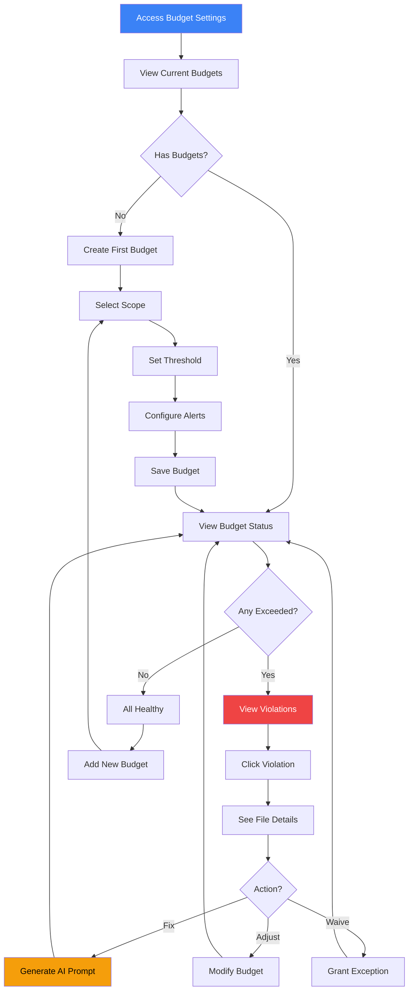

# Complexity Budget Monitoring

## User Story

**As a tech lead responsible for code quality**, I want to set complexity "budgets" for different areas of the codebase and get alerts when budgets are exceeded, so that I can enforce quality gates without manual review.

## User Need

Code reviews catch many issues, but complexity often slips through:

- "Just one more conditional..."
- "This is temporary, I'll refactor later..."
- "It's complex but it works..."

Budgets create explicit limits:

- Teams agree on acceptable complexity levels
- Violations are caught automatically
- Decisions become conscious rather than accidental
- Technical debt accumulation becomes visible

Without budgets, complexity creeps upward continuously. With budgets, teams must consciously decide when to exceed limits.

---

## UX Flow

### Entry Points

1. **Primary:** Settings > Complexity Budgets
2. **Secondary:** Initial Assessment final step
3. **Contextual:** Alert investigation "Adjust budget"
4. **File Detail:** "Set budget for this file/directory"

### User Journey



### Exit Points

1. **To File Detail:** Investigate specific violation
2. **To AI Prompt:** Generate refactoring prompt for violation
3. **To Dashboard:** Return to main view with budget status
4. **To Report:** Export budget compliance report

---

## Information Architecture

### Budget Types

| Type              | Scope                  | Example                          |
| ----------------- | ---------------------- | -------------------------------- |
| **Global**        | Entire repository      | Max complexity 40 for any file   |
| **Directory**     | Specific directory     | src/components/ max 30           |
| **File Pattern**  | Files matching pattern | \*.test.ts max 20                |
| **File Type**     | Language/framework     | React components max 25          |
| **Specific File** | Individual file        | auth/index.ts max 50 (exception) |

### Budget Metrics (Comprehensive Set from Vipr Plugins)

#### Core Structural Metrics (Core Plugin)

| Metric                | Description                       | Common Thresholds                                 |
| --------------------- | --------------------------------- | ------------------------------------------------- |
| Cyclomatic Complexity | Number of independent paths       | 10 (good), 20 (acceptable), 40 (warning)          |
| Halstead Volume       | Implementation size               | 100 (simple), 1000 (moderate), 5000 (complex)     |
| Halstead Effort       | Effort to understand              | 5000 (easy), 20000 (moderate), 100000 (difficult) |
| Maintainability Index | Microsoft's maintainability score | 20 (poor), 40 (moderate), 65 (good)               |
| Lines of Code         | File length                       | 200 (ideal), 400 (acceptable), 1000 (warning)     |
| Function Count        | Functions per file                | 10 (good), 20 (acceptable), 50 (warning)          |

#### React-Specific Metrics (React Plugin)

| Metric                          | Description                                                         | Common Thresholds                              |
| ------------------------------- | ------------------------------------------------------------------- | ---------------------------------------------- |
| **Overall React Score**         | Composite React quality score                                       | 70+ (good), 50-70 (acceptable), < 50 (warning) |
| **Hook Count**                  | Total hooks in component                                            | 5 (simple), 10 (moderate), 15 (complex)        |
| **Temporal Complexity Weight**  | Effect complexity                                                   | 5 (simple), 15 (moderate), 25 (complex)        |
| **Risky Effects Count**         | useEffects with risk indicators                                     | 0 (ideal), 2 (acceptable), 5 (warning)         |
| **Props Count**                 | Number of props                                                     | 5 (simple), 10 (moderate), 15 (complex)        |
| **Prop Drilling Depth**         | Max prop forwarding depth                                           | 2 (good), 3 (acceptable), 4 (warning)          |
| **Unstable References**         | Inline functions, unstable values                                   | 0 (ideal), 3 (acceptable), 8 (warning)         |
| **State Update Paths**          | State mutation complexity                                           | 3 (simple), 8 (moderate), 15 (complex)         |
| **Anti-pattern Count**          | Detected anti-patterns                                              | 0 (ideal), 2 (acceptable), 5 (critical)        |
| **React Maintainability Index** | React-specific MI incorporating hooks, temporal, coupling, identity | 65+ (good), 40-65 (acceptable), < 40 (warning) |

#### Security Metrics (React Plugin)

| Metric                           | Description              | Common Thresholds                                           |
| -------------------------------- | ------------------------ | ----------------------------------------------------------- |
| **Security Vulnerability Count** | XSS, injection, etc.     | 0 (ideal), 1 (acceptable with justification), 3+ (critical) |
| **Critical Vulnerabilities**     | Severity: Critical       | 0 (required)                                                |
| **Security Score**               | Overall security posture | 80+ (good), 60-80 (acceptable), < 60 (warning)              |

#### Reliability Metrics (React Plugin)

| Metric                   | Description                   | Common Thresholds                              |
| ------------------------ | ----------------------------- | ---------------------------------------------- |
| **Crash Risk Score**     | Likelihood of runtime crashes | < 20 (low), 20-50 (moderate), >50 (high)       |
| **Error Boundary Score** | Error handling coverage       | 80+ (good), 50-80 (acceptable), < 50 (warning) |
| **Null Safety Score**    | Safe null handling            | 80+ (good), 60-80 (acceptable), < 60 (warning) |
| **Memory Leak Risk**     | Memory safety indicators      | < 20 (low), 20-50 (moderate), >50 (high)       |

#### Performance Metrics (React Plugin)

| Metric                        | Description                | Common Thresholds                              |
| ----------------------------- | -------------------------- | ---------------------------------------------- |
| **Unnecessary Render Risk**   | Re-render likelihood       | < 20 (low), 20-50 (moderate), >50 (high)       |
| **Missing Memoization Count** | Optimization opportunities | 0 (ideal), 3 (acceptable), 8 (warning)         |
| **Bundle Impact Score**       | Code size and tree-shaking | < 30 (good), 30-60 (acceptable), >60 (warning) |
| **Heavy Dependencies Count**  | Large imported libraries   | 0 (ideal), 2 (acceptable), 5 (warning)         |

#### Technical Debt Metrics (React Plugin)

| Metric                   | Description               | Common Thresholds                           |
| ------------------------ | ------------------------- | ------------------------------------------- |
| **Code Health Grade**    | Overall health (A-F)      | A/B (good), C (acceptable), D/F (warning)   |
| **Technical Debt Score** | Debt principal + interest | < 30 (low), 30-60 (moderate), >60 (high)    |
| **Maintenance Burden**   | Effort to maintain        | < 30 (low), 30-60 (moderate), >60 (high)    |
| **Debt Interest Rate**   | Compounding cost          | < 10% (low), 10-20% (moderate), >20% (high) |

#### Accessibility Metrics (React Plugin)

| Metric                        | Description                 | Common Thresholds                              |
| ----------------------------- | --------------------------- | ---------------------------------------------- |
| **WCAG Violation Count**      | A, AA, AAA violations       | 0 (ideal), 2 (acceptable), 5 (warning)         |
| **Keyboard Navigation Score** | Keyboard accessibility      | 80+ (good), 60-80 (acceptable), < 60 (warning) |
| **Screen Reader Score**       | Screen reader compatibility | 80+ (good), 60-80 (acceptable), < 60 (warning) |

#### General Metrics

| Metric           | Description  | Common Thresholds                        |
| ---------------- | ------------ | ---------------------------------------- |
| Dependency Count | Import count | 15 (good), 25 (acceptable), 50 (warning) |

### Data Displayed

**Budget Dashboard**

- List of active budgets
- Current status (healthy/warning/exceeded)
- Utilization percentage
- Trend indicator

**Violation List**

- Files exceeding budget
- Current value vs. budget
- Time in violation
- Suggested actions

**Budget Detail**

- Configuration settings
- Historical compliance
- Exception history
- Related files

---

## Interaction Patterns

### Budget Management

| Action           | Trigger             | Result                            |
| ---------------- | ------------------- | --------------------------------- |
| Create budget    | "Add Budget" button | Open budget creation wizard       |
| Edit budget      | Click budget row    | Open budget editor                |
| Delete budget    | Context menu        | Remove budget (with confirmation) |
| Duplicate budget | Context menu        | Create copy with modified scope   |

### Violation Response

| Action          | Trigger           | Result                           |
| --------------- | ----------------- | -------------------------------- |
| View violation  | Click violation   | Show file details                |
| Grant exception | "Waive" button    | Temporarily or permanently waive |
| Adjust budget   | "Adjust" button   | Modify threshold                 |
| Fix violation   | "Generate Prompt" | Create AI refactoring prompt     |

### Alert Configuration

| Setting             | Options                      | Default |
| ------------------- | ---------------------------- | ------- |
| Alert on warning    | 80% of budget                | Enabled |
| Alert on exceeded   | 100% of budget               | Enabled |
| Alert frequency     | Once, Daily, Each occurrence | Once    |
| Notification method | Desktop, Email, Both         | Desktop |

---

## Component Map

This section provides explicit `@vipr/ui` component specifications for budget monitoring and creation.

### Primary Components

| Component      | Import Path               | Configuration                   | Usage in Phase 16                        |
| -------------- | ------------------------- | ------------------------------- | ---------------------------------------- |
| CardTable      | @vipr/ui/card-table       | data, columns, headerActions    | Budget listing with status columns       |
| StatCard       | @vipr/ui/stat-card        | variant="compact", value, title | Summary (Total/Healthy/Warning/Exceeded) |
| LineChart      | @vipr/ui/line-chart       | data, options (threshold lines) | Budget compliance trends                 |
| MetricBarChart | @vipr/ui/metric-bar-chart | label, value, min, max          | Current vs target visualization          |
| Badge          | @vipr/ui/badge            | variant, size                   | Status (on-track/at-risk/exceeded)       |
| Modal          | @vipr/ui/modal            | size="lg", isOpen, onClose      | Budget creation wizard container         |
| Radio          | @vipr/ui/radio            | checked, onChange, label        | Scope selection in wizard                |
| Checkbox       | @vipr/ui/checkbox         | checked, onChange, label        | Metric selection in wizard               |
| Input          | @vipr/ui/input            | type, value, onChange           | Threshold values, path input             |
| Button         | @vipr/ui/button           | appearance, size, onClick       | Add budget, save, generate prompt        |
| Alert          | @vipr/ui/alert            | variant="banner", type          | Violation warnings                       |
| Dropdown       | @vipr/ui/dropdown         | variant="select", options       | Alert frequency, notification method     |

### Color Tokens

**Budget Status:**

- `green-500` / `green-500/20` - Healthy (< 80% of budget)
- `yellow-500` / `yellow-500/20` - Warning (80-99% of budget)
- `red-500` / `red-500/20` - Exceeded (≥ 100% of budget)
- `gray-500` / `gray-400` - No budget set

**Trend Indicators:**

- `green-500` - Improving (↓)
- `red-500` - Worsening (↑)
- `gray-500` - Stable (=)

### Typography Tokens

**Budget Dashboard:**

- `text-2xl font-semibold text-gray-800 dark:text-gray-100` - Page title
- `text-sm font-medium text-gray-700 dark:text-gray-300` - Table headers

**Values:**

- `text-lg font-mono text-gray-800 dark:text-gray-100` - Budget/current values
- `text-xs text-gray-600 dark:text-gray-400` - Utilization percentages

### Layout Patterns

**Page Container:**

```tsx
className = 'px-4 sm:px-6 lg:px-8 py-8';
```

**Stats Header:**

```tsx
className = 'grid grid-cols-1 sm:grid-cols-2 lg:grid-cols-4 gap-4 mb-6';
```

### Composition Patterns

#### Budget Dashboard Page

```tsx
<div className="px-4 sm:px-6 lg:px-8 py-8">
  {/* Page header */}
  <div className="flex items-center justify-between mb-6">
    <div>
      <h1 className="text-2xl font-semibold text-gray-800 dark:text-gray-100">
        Complexity Budgets
      </h1>
      <p className="text-sm text-gray-600 dark:text-gray-300 mt-1">
        Set and monitor quality gates for your codebase
      </p>
    </div>
    <div className="flex items-center gap-3">
      <Button appearance="secondary" onClick={exportReport}>
        Export Report
      </Button>
      <Button appearance="primary" onClick={openCreateBudgetWizard}>
        Add Budget
      </Button>
    </div>
  </div>

  {/* Summary stats */}
  <div className="grid grid-cols-1 sm:grid-cols-2 lg:grid-cols-4 gap-4 mb-6">
    <StatCard variant="compact" title="Total Budgets" value={totalBudgets} icon={<TargetIcon />} />
    <StatCard
      variant="compact"
      title="Healthy"
      value={healthyCount}
      icon={<CheckCircleIcon className="text-green-500" />}
    />
    <StatCard
      variant="compact"
      title="Warnings"
      value={warningCount}
      icon={<AlertTriangleIcon className="text-yellow-500" />}
    />
    <StatCard
      variant="compact"
      title="Exceeded"
      value={exceededCount}
      icon={<XCircleIcon className="text-red-500" />}
    />
  </div>

  {/* Budget compliance trend */}
  <div className="mb-6">
    <h2 className="text-lg font-semibold text-gray-800 dark:text-gray-100 mb-4">
      Compliance Trend (Last 30 Days)
    </h2>
    <LineChart
      data={{
        labels: last30Days,
        datasets: [
          {
            label: 'Healthy',
            data: healthyTrend,
            borderColor: '#4bd37d',
            backgroundColor: 'rgba(75, 211, 125, 0.1)',
          },
          {
            label: 'Warning',
            data: warningTrend,
            borderColor: '#f0bb33',
            backgroundColor: 'rgba(240, 187, 51, 0.1)',
          },
          {
            label: 'Exceeded',
            data: exceededTrend,
            borderColor: '#ff5656',
            backgroundColor: 'rgba(255, 86, 86, 0.1)',
          },
        ],
      }}
      options={{
        // Add threshold line at 80% (warning level)
        plugins: {
          annotation: {
            annotations: {
              warningLine: {
                type: 'line',
                yMin: 80,
                yMax: 80,
                borderColor: '#f0bb33',
                borderWidth: 2,
                borderDash: [5, 5],
                label: {
                  content: 'Warning Threshold',
                  enabled: true,
                },
              },
            },
          },
        },
      }}
      height={300}
    />
  </div>

  {/* Active budgets table */}
  <CardTable
    title="Active Budgets"
    description="Click a row to view violations and details"
    columns={[
      { key: 'scope', label: 'Scope', sortable: true },
      { key: 'metric', label: 'Metric', sortable: true },
      { key: 'budget', label: 'Budget', sortable: true },
      { key: 'current', label: 'Current', sortable: true },
      { key: 'status', label: 'Status', sortable: true },
      { key: 'trend', label: 'Trend' },
    ]}
    data={budgets.map(budget => ({
      scope: budget.scope,
      metric: budget.metric,
      budget: <span className="font-mono text-sm">{budget.threshold}</span>,
      current: (
        <span
          className={cn(
            'font-mono text-sm',
            budget.current >= budget.threshold && 'text-red-600 dark:text-red-400 font-semibold',
            budget.current >= budget.threshold * 0.8 &&
              budget.current < budget.threshold &&
              'text-yellow-600 dark:text-yellow-400'
          )}
        >
          {budget.current}
        </span>
      ),
      status: (
        <Badge
          variant={
            budget.current >= budget.threshold
              ? 'red'
              : budget.current >= budget.threshold * 0.8
                ? 'yellow'
                : 'green'
          }
          size="sm"
        >
          {budget.current >= budget.threshold
            ? 'Exceeded'
            : budget.current >= budget.threshold * 0.8
              ? 'Warning'
              : 'Healthy'}
        </Badge>
      ),
      trend: (
        <span
          className={cn(
            'text-sm',
            budget.trend === 'up' && 'text-red-500',
            budget.trend === 'down' && 'text-green-500',
            budget.trend === 'stable' && 'text-gray-500'
          )}
        >
          {budget.trend === 'up' ? '↑' : budget.trend === 'down' ? '↓' : '='}
        </span>
      ),
    }))}
    onRowClick={(row, index) => openBudgetDetail(budgets[index])}
    keyExtractor={(_, index) => budgets[index].id}
  />
</div>
```

#### Budget Creation Wizard (Modal with Internal Steps)

**This wizard uses the same pattern as Phase 13 Initial Assessment but inside a Modal instead of full-screen.**

```tsx
const CreateBudgetWizard: React.FC<{ isOpen: boolean; onClose: () => void }> = ({
  isOpen,
  onClose,
}) => {
  const [currentStep, setCurrentStep] = useState(0);
  const [config, setConfig] = useState({
    scope: null,
    scopeValue: '',
    metric: null,
    threshold: null,
    alertConfig: {},
  });

  const steps = [
    { title: 'Select Scope', description: 'Choose what this budget applies to' },
    { title: 'Select Metric', description: 'Choose the metric to monitor' },
    { title: 'Set Threshold', description: 'Define the budget limit' },
    { title: 'Configure Alerts', description: 'Set up notification preferences' },
    { title: 'Review & Save', description: 'Confirm your budget configuration' },
  ];

  return (
    <Modal size="lg" isOpen={isOpen} onClose={onClose}>
      <div className="flex flex-col h-[600px]">
        {/* Wizard header with breadcrumb */}
        <div className="px-6 py-4 border-b border-gray-200 dark:border-gray-700">
          <h2 className="text-lg font-semibold text-gray-800 dark:text-gray-100 mb-3">
            Create New Budget
          </h2>

          {/* Step breadcrumb (same as Phase 13) */}
          <div className="flex items-center gap-2">
            {steps.map((step, index) => (
              <div key={index} className="flex items-center">
                <div
                  className={cn(
                    'w-8 h-8 rounded-full flex items-center justify-center text-sm font-semibold',
                    index < currentStep && 'bg-green-500 text-white',
                    index === currentStep && 'bg-violet-500 text-white',
                    index > currentStep && 'bg-gray-200 dark:bg-gray-700 text-gray-500'
                  )}
                >
                  {index < currentStep ? '✓' : index + 1}
                </div>
                {index < steps.length - 1 && (
                  <div
                    className={cn(
                      'h-0.5 w-8 mx-1',
                      index < currentStep && 'bg-green-500',
                      index >= currentStep && 'bg-gray-200 dark:bg-gray-700'
                    )}
                  />
                )}
              </div>
            ))}
          </div>
        </div>

        {/* Step content */}
        <div className="flex-1 overflow-y-auto px-6 py-6">
          {currentStep === 0 && (
            <div className="space-y-4">
              <h3 className="text-lg font-semibold text-gray-800 dark:text-gray-100">
                {steps[0].title}
              </h3>
              <p className="text-sm text-gray-600 dark:text-gray-300">{steps[0].description}</p>

              <div className="space-y-3">
                <Radio
                  name="scope"
                  checked={config.scope === 'global'}
                  onChange={() => setConfig({ ...config, scope: 'global' })}
                  label="Repository-wide (all files)"
                />
                <Radio
                  name="scope"
                  checked={config.scope === 'directory'}
                  onChange={() => setConfig({ ...config, scope: 'directory' })}
                  label="Directory"
                />
                {config.scope === 'directory' && (
                  <Input
                    type="text"
                    placeholder="src/components/"
                    value={config.scopeValue}
                    onChange={e => setConfig({ ...config, scopeValue: e.target.value })}
                    className="ml-6"
                  />
                )}
                <Radio
                  name="scope"
                  checked={config.scope === 'pattern'}
                  onChange={() => setConfig({ ...config, scope: 'pattern' })}
                  label="File pattern"
                />
                {config.scope === 'pattern' && (
                  <Input
                    type="text"
                    placeholder="*.test.ts"
                    value={config.scopeValue}
                    onChange={e => setConfig({ ...config, scopeValue: e.target.value })}
                    className="ml-6"
                  />
                )}
              </div>
            </div>
          )}

          {currentStep === 1 && (
            <div className="space-y-4">
              <h3 className="text-lg font-semibold text-gray-800 dark:text-gray-100">
                {steps[1].title}
              </h3>
              <p className="text-sm text-gray-600 dark:text-gray-300">{steps[1].description}</p>

              <div className="space-y-3">
                <Checkbox
                  checked={config.metric === 'complexity'}
                  onChange={checked =>
                    setConfig({ ...config, metric: checked ? 'complexity' : null })
                  }
                  label="Cyclomatic Complexity"
                />
                <p className="text-xs text-gray-600 dark:text-gray-400 ml-6">
                  Measures independent execution paths. Recommended: 10-20 for maintainable code.
                </p>

                <Checkbox
                  checked={config.metric === 'maintainability'}
                  onChange={checked =>
                    setConfig({ ...config, metric: checked ? 'maintainability' : null })
                  }
                  label="Maintainability Index"
                />
                <p className="text-xs text-gray-600 dark:text-gray-400 ml-6">
                  Microsoft's maintainability score. Higher is better (65+ is good).
                </p>

                {/* More metrics... */}
              </div>
            </div>
          )}

          {currentStep === 2 && (
            <div className="space-y-4">
              <h3 className="text-lg font-semibold text-gray-800 dark:text-gray-100">
                {steps[2].title}
              </h3>

              <div className="space-y-4">
                <div>
                  <label className="block text-sm font-medium text-gray-700 dark:text-gray-300 mb-2">
                    Budget Threshold
                  </label>
                  <Input
                    type="number"
                    value={config.threshold || ''}
                    onChange={e => setConfig({ ...config, threshold: parseInt(e.target.value) })}
                    placeholder="e.g., 20"
                  />
                  <p className="text-xs text-gray-600 dark:text-gray-400 mt-1">
                    Recommended: {getRecommendedThreshold(config.metric)}
                  </p>
                </div>

                {/* Preview: Current vs Budget */}
                {config.threshold && (
                  <div className="border border-gray-200 dark:border-gray-700 rounded-lg p-4">
                    <h4 className="text-sm font-medium text-gray-700 dark:text-gray-300 mb-3">
                      Preview: Files that would exceed this budget
                    </h4>
                    <MetricBarChart
                      label="Example File 1"
                      value={35}
                      min={0}
                      max={config.threshold}
                      direction="lower-is-better"
                    />
                    <MetricBarChart
                      label="Example File 2"
                      value={18}
                      min={0}
                      max={config.threshold}
                      direction="lower-is-better"
                    />
                  </div>
                )}
              </div>
            </div>
          )}

          {/* Steps 3 & 4... */}
        </div>

        {/* Navigation footer */}
        <div className="px-6 py-4 border-t border-gray-200 dark:border-gray-700 flex items-center justify-between">
          <Button
            appearance="secondary"
            onClick={() => setCurrentStep(currentStep - 1)}
            disabled={currentStep === 0}
          >
            Back
          </Button>

          <div className="flex items-center gap-3">
            <Button appearance="tertiary" onClick={onClose}>
              Cancel
            </Button>
            <Button
              appearance="primary"
              onClick={() => {
                if (currentStep < steps.length - 1) {
                  setCurrentStep(currentStep + 1);
                } else {
                  handleSaveBudget();
                }
              }}
            >
              {currentStep < steps.length - 1 ? 'Continue' : 'Save Budget'}
            </Button>
          </div>
        </div>
      </div>
    </Modal>
  );
};
```

### LineChart with Threshold Lines

**Use Chart.js `options` prop to add threshold annotation lines:**

```typescript
<LineChart
  data={complianceData}
  options={{
    plugins: {
      annotation: {
        annotations: {
          warningLine: {
            type: 'line',
            yMin: 80,  // 80% = warning threshold
            yMax: 80,
            borderColor: '#f0bb33',  // yellow-500
            borderWidth: 2,
            borderDash: [5, 5],
            label: {
              content: 'Warning (80%)',
              enabled: true,
              position: 'end'
            }
          },
          criticalLine: {
            type: 'line',
            yMin: 100,  // 100% = exceeded threshold
            yMax: 100,
            borderColor: '#ff5656',  // red-500
            borderWidth: 2,
            label: {
              content: 'Budget Exceeded',
              enabled: true,
              position: 'end'
            }
          }
        }
      }
    }
  }}
/>
```

**NOTE:** Requires `chartjs-plugin-annotation` package. Add to dependencies if using threshold lines.

### MetricBarChart for Current vs Target

**Perfect for showing budget utilization:**

```tsx
<MetricBarChart
  label="Complexity"
  value={currentValue}
  min={0}
  max={budgetThreshold}
  direction="lower-is-better"
  description={`${currentValue} / ${budgetThreshold} (${utilization}%)`}
  formatValue={val => val.toString()}
/>
```

## Design System Gaps

**No new gaps for Phase 16.** All required components exist:

- ✅ Modal - exists (wizard container)
- ✅ Radio - exists (scope selection)
- ✅ Checkbox - exists (metric selection)
- ✅ CardTable - exists (budget listing)
- ✅ StatCard (compact) - exists (summary metrics)
- ✅ LineChart - exists (trends with threshold lines via options)
- ✅ MetricBarChart - exists (current vs budget bars)
- ✅ Badge - exists (status indicators)

**Wizard Pattern:** Reuses the numbered breadcrumb pattern from Phase 13, adapted to Modal instead of full-screen.

**Threshold Lines:** Requires `chartjs-plugin-annotation` package (add to `package.json` dependencies).

---

## Visual Concepts

**NOTE:** Visual concepts updated to reflect component-based implementation using CardTable, LineChart with thresholds, and Modal-based wizard.

### Budget Dashboard

```
================================================================================
Complexity Budgets                                    [Add Budget]  [Export Report]
================================================================================

OVERVIEW

Total Budgets: 8              Healthy: 5              Warnings: 2              Exceeded: 1

+------------------------------------------------------------------+
|    [==========================================|====]              |
|    Healthy (62.5%)           Warning (25%)    Exceeded (12.5%)   |
+------------------------------------------------------------------+

ACTIVE BUDGETS
--------------------------------------------------------------------------------

| Scope                    | Metric      | Budget | Current | Status   | Trend |
|--------------------------|-------------|--------|---------|----------|-------|
| Repository (Global)      | Complexity  |   40   |   38    | Healthy  |   =   |
| src/components/          | Complexity  |   30   |   28    | Healthy  |  \/   |
| src/services/            | Complexity  |   35   |   34    | Warning  |  /\   |
| src/pages/               | LOC         |  400   |  412    | Exceeded |  /\   |
| *.test.ts               | Complexity  |   20   |   15    | Healthy  |   =   |
| src/hooks/               | Dependencies|   15   |   12    | Healthy  |  \/   |
| React Components         | Complexity  |   25   |   22    | Healthy  |   =   |
| src/api/client.ts       | Complexity  |   50   |   38    | Healthy  |  \/   |

[Click row to view details and violations]

================================================================================
```

### Budget Creation Wizard

```
================================================================================
Create New Budget                                                    [Cancel] [Save]
================================================================================

STEP 1: SELECT SCOPE

( ) Repository-wide (all files)
( ) Directory
    Path: [src/components/________________] [Browse]
(o) File pattern
    Pattern: [*.tsx_________________________]
( ) Specific file
    Path: [________________________________] [Browse]

STEP 2: SELECT METRIC

(o) Cyclomatic Complexity
    Measures: Independent execution paths
    Recommendation: 10-20 for maintainable code

( ) Maintainability Index
    Measures: Overall code maintainability
    Recommendation: Above 40 for acceptable code

( ) Lines of Code
    Measures: File length
    Recommendation: Under 400 for most files

STEP 3: SET THRESHOLD

Budget Threshold: [25___________]

Based on current codebase:
  Average for this scope: 18
  Maximum for this scope: 34
  Your threshold would flag: 3 files (12%)

STEP 4: CONFIGURE ALERTS

[x] Alert at 80% (warning): 20
[x] Alert at 100% (exceeded): 25
[ ] Daily summary even if healthy

================================================================================
```

### Violation Detail

```
================================================================================
Budget Violation: src/pages/Dashboard.tsx
================================================================================

VIOLATION SUMMARY

Budget: src/pages/ - Max 400 lines
Current Value: 412 lines (+12 over budget)
Status: Exceeded since Feb 3, 2024 (2 days)

TREND
+----------------------------------------------------------------+
|                                                                 |
|  400 +--------------------------- [BUDGET LINE] ---------------+
|      |                                      _____----           |
|  350 |                            _____----/                    |
|      |                  _____----/                              |
|  300 |        _____----/                                        |
|      | ------/                                                  |
|  250 +-----|-----|-----|-----|-----|-----|-----|-----|---> Time |
|          Dec   Jan        Feb                                   |
+----------------------------------------------------------------+

CONTRIBUTING COMMITS
--------------------------------------------------------------------------------
| Date    | Author  | Change | Message                                |
|---------|---------|--------|----------------------------------------|
| Feb 3   | jsmith  |  +45   | Add user analytics dashboard section   |
| Jan 28  | alee    |  +23   | Implement notification panel           |
| Jan 15  | jsmith  |  +18   | Add quick actions toolbar              |

RECOMMENDED ACTIONS
--------------------------------------------------------------------------------

1. SPLIT COMPONENT (Recommended)
   Dashboard.tsx has grown to include multiple concerns:
   - Analytics section (120 lines)
   - Notification panel (85 lines)
   - Quick actions (65 lines)

   Extract to separate components:
   [Generate Extraction Prompt]

2. ADJUST BUDGET (If intentional)
   If Dashboard legitimately needs to be larger,
   consider setting a specific exception:
   [Set Exception for Dashboard.tsx]

3. WAIVE TEMPORARILY
   Grant a time-limited exception:
   [Waive for 7 days]  [Waive for 30 days]

================================================================================
```

---

## Psychological Principles

### Explicit Limits

Budgets make quality expectations explicit. "Keep complexity under 30" is clearer than "write clean code."

### Early Warning

Warning at 80% gives teams time to respond before violations occur. This prevents the "already broken, might as well continue" mentality.

### Conscious Exceptions

The exception workflow forces conscious decisions. Rather than silently exceeding limits, teams must explicitly choose to waive budgets.

### Trend Awareness

Showing trends toward budget limits enables proactive action. A file at 75% and rising needs attention before it hits the limit.

---

## Success Metrics

| Metric                   | Target               | Measurement                             |
| ------------------------ | -------------------- | --------------------------------------- |
| Budget adoption          | > 3 budgets per repo | Active budgets created                  |
| Violation response       | < 1 week             | Time from exceeded to resolved          |
| False positive rate      | < 10%                | Budgets waived as inappropriate         |
| Complexity stabilization | No upward trend      | Codebase stays within budgets over time |

---

## Integration with Broader Application

### Feature Dependencies

**Requires:**

- Velocity Dashboard (US-NEW-02) - Trend data
- Churn-Complexity Quadrant (US-NEW-03) - Risk context
- Ongoing Monitoring Mode (US-NEW-14) - Alert delivery

**Enables:**

- Initial Analysis Mode (US-NEW-13) - Budget setup step
- AI Prompt Generation (US-NEW-19) - Violation-aware prompts

### Data Model

```typescript
interface ComplexityBudget {
  id: string;
  name: string;
  scope: BudgetScope;
  metric: 'complexity' | 'maintainability' | 'loc' | 'functions' | 'dependencies';
  threshold: number;
  warningThreshold?: number; // Default 80% of threshold
  enabled: boolean;
  createdAt: number;
  createdBy?: string;
}

type BudgetScope =
  | { type: 'global' }
  | { type: 'directory'; path: string }
  | { type: 'pattern'; glob: string }
  | { type: 'fileType'; types: string[] }
  | { type: 'file'; path: string };

interface BudgetException {
  id: string;
  budgetId: string;
  filePath: string;
  reason: string;
  expiresAt?: number; // Undefined = permanent
  grantedBy?: string;
  grantedAt: number;
}
```

### Storage

Budget configuration stored in SQLite:

- `budgets` table for budget definitions
- `budget_exceptions` table for waivers
- `budget_violations` table for historical violations

---

## Complexity Analysis Methodology

### Budget Framework

Complexity budgets create explicit limits on code complexity, transforming subjective code quality into measurable, enforceable constraints.

**Core Principle:**

```
ActualComplexity ≤ BudgetThreshold × SafetyMargin

Where:
  ActualComplexity = Current measured complexity
  BudgetThreshold = Configured maximum
  SafetyMargin = 0.8 (warn at 80% of budget)
```

**Budget Types and Formulas:**

1. **Absolute Budgets** - Fixed numeric thresholds

   ```
   Budget: Cyclomatic Complexity ≤ 40
   Status: Pass if CC(file) ≤ 40
   ```

2. **Relative Budgets** - Based on codebase averages

   ```
   Budget: No file exceeds 2× repository average
   Status: Pass if CC(file) ≤ 2 × AVG(CC(all_files))
   ```

3. **Percentile Budgets** - Based on distribution
   ```
   Budget: All files in top quartile for complexity
   Status: Pass if CC(file) ≤ 75th_percentile(CC(all_files))
   ```

### Meaningful Thresholds by Metric

**Cyclomatic Complexity:**

| Threshold | Interpretation                   | Typical Use Case                            |
| --------- | -------------------------------- | ------------------------------------------- |
| 10        | Strict (function-level)          | Simple utilities, getters/setters           |
| 20        | Moderate (function-level)        | Business logic functions                    |
| 30        | Permissive (file-level)          | UI components, small services               |
| 40        | Maximum recommended (file-level) | Complex services, algorithms                |
| 60+       | Red flag (file-level)            | Infrastructure only, requires justification |

**Maintainability Index:**

| Threshold | Interpretation          | Quality Level       |
| --------- | ----------------------- | ------------------- |
| > 65      | Highly Maintainable     | Target for new code |
| 40-65     | Moderately Maintainable | Acceptable          |
| 20-40     | Difficult to Maintain   | Needs refactoring   |
| < 20      | Nearly Unmaintainable   | Critical priority   |

**Lines of Code:**

| Threshold | Interpretation | File Type                       |
| --------- | -------------- | ------------------------------- |
| 100       | Very Small     | Utilities, simple components    |
| 200       | Small          | Typical components              |
| 400       | Moderate       | Services, complex components    |
| 600       | Large          | Complex services, controllers   |
| 1000+     | Very Large     | Red flag, likely doing too much |

**Function/Method Count:**

| Threshold | Interpretation | File Type            |
| --------- | -------------- | -------------------- |
| 5         | Simple         | Utilities, helpers   |
| 10        | Moderate       | Components, services |
| 20        | Complex        | Large services       |
| 50+       | God Object     | Needs splitting      |

**Import/Dependency Count:**

| Threshold | Interpretation | Coupling Level                |
| --------- | -------------- | ----------------------------- |
| 5         | Low            | Focused file                  |
| 15        | Moderate       | Typical application file      |
| 25        | High           | Coordinator or infrastructure |
| 50+       | Excessive      | Likely god object             |

### Pattern Recognition

**Budget Violation Patterns:**

1. **Gradual Creep** - Budget exceeded slowly over time
   - Pattern: Complexity increases 1-2 points per week
   - Cause: Small features added without refactoring
   - Detection: Budget exceeded but was compliant 4 weeks ago
   - Action: Schedule refactoring sprint

2. **Sudden Spike** - Budget violated in single change
   - Pattern: Complexity jumps 15+ points in one commit
   - Cause: Major feature without design phase
   - Detection: Budget exceeded, was compliant last commit
   - Action: Review commit, consider reverting and redesigning

3. **Persistent Violation** - Long-term budget excess
   - Pattern: Budget exceeded for >60 days
   - Cause: Budget set incorrectly, or conscious tech debt
   - Detection: Budget in violation state across many snapshots
   - Action: Either refactor or adjust budget with justification

4. **Oscillating Violation** - In/out of compliance
   - Pattern: Alternates between compliant and violation
   - Cause: Code churn, unstable design
   - Detection: Budget status changes >3 times in 30 days
   - Action: Stabilize design, may indicate architectural issue

## Detection Algorithms

### Budget Evaluation

**Step 1: Scope Resolution**

```
function resolveBudgetScope(budget):
  MATCH budget.scope.type:
    CASE "global":
      RETURN all_files_in_repository

    CASE "directory":
      RETURN files_in_directory(budget.scope.path, recursive=true)

    CASE "pattern":
      RETURN glob_match(budget.scope.glob)

    CASE "fileType":
      RETURN files_where(type IN budget.scope.types)

    CASE "file":
      RETURN [budget.scope.path]
```

**Step 2: Metric Calculation**

```
function calculateMetric(file, metricType):
  MATCH metricType:
    CASE "complexity":
      RETURN calculate_cyclomatic_complexity(file)

    CASE "maintainability":
      RETURN calculate_maintainability_index(file)

    CASE "loc":
      RETURN count_lines_of_code(file)

    CASE "functions":
      RETURN count_functions(file)

    CASE "dependencies":
      RETURN count_imports(file)
```

**Step 3: Budget Compliance Check**

```
function checkBudgetCompliance(budget):
  files = resolveBudgetScope(budget)
  violations = []

  FOR each file in files:
    metric_value = calculateMetric(file, budget.metric)

    status = {
      file: file,
      current: metric_value,
      budget: budget.threshold,
      utilization: (metric_value / budget.threshold) × 100
    }

    IF metric_value > budget.threshold:
      status.state = "EXCEEDED"
      violations.add(status)
    ELSE IF metric_value > (budget.threshold × 0.8):
      status.state = "WARNING"
      violations.add(status)
    ELSE:
      status.state = "HEALTHY"

  RETURN {
    compliant: violations.where(state == "EXCEEDED").length == 0,
    violations: violations,
    summary: summarizeCompliance(violations)
  }
```

**Step 4: Violation Attribution**

```
function attributeViolation(file, budget):
  // Find commits that caused budget to be exceeded
  current_value = calculateMetric(file, budget.metric)
  snapshots = get_historical_snapshots(file)

  FOR i from snapshots.length - 1 down to 0:
    snapshot_value = snapshots[i].metrics[budget.metric]

    IF snapshot_value <= budget.threshold:
      // This snapshot was compliant
      violating_commits = git_log(
        since: snapshots[i].timestamp,
        until: now,
        path: file
      )

      RETURN {
        violation_start: snapshots[i + 1].timestamp,
        duration: now - snapshots[i + 1].timestamp,
        responsible_commits: violating_commits,
        complexity_delta: current_value - snapshot_value
      }

  // Never been compliant
  RETURN { violation_start: file.created_at, duration: file.age, note: "Never compliant" }
```

### Alert Generation

**Severity Calculation:**

```
function calculateViolationSeverity(violation, budget):
  utilization = violation.current / budget.threshold

  // How far over budget?
  overage_factor = max(utilization - 1.0, 0)

  // How long in violation?
  IF violation.duration:
    days_in_violation = violation.duration / (24 * 60 * 60 * 1000)
    duration_factor = min(days_in_violation / 30, 1.0)  // Cap at 30 days
  ELSE:
    duration_factor = 0

  // How many files affected?
  scope_size = count_files_in_scope(budget.scope)
  scope_factor = min(scope_size / 50, 1.0)  // Cap at 50 files

  severity = (
    (overage_factor × 50) +
    (duration_factor × 30) +
    (scope_factor × 20)
  )

  IF severity >= 70: RETURN "CRITICAL"
  IF severity >= 40: RETURN "WARNING"
  RETURN "INFO"
```

**Alert Triggers:**

```
function triggerAlerts(budget, compliance):
  FOR each violation in compliance.violations:
    severity = calculateViolationSeverity(violation, budget)

    MATCH severity:
      CASE "CRITICAL":
        send_notification(
          type: "immediate",
          title: "Critical Budget Violation",
          message: "{file} exceeds {budget} by {overage}%",
          actions: ["View File", "Adjust Budget", "Generate Prompt"]
        )

      CASE "WARNING":
        add_to_daily_digest(violation)

      CASE "INFO":
        add_to_weekly_summary(violation)

    // Budget-wide alerts
    violation_count = compliance.violations.length
    IF violation_count > previous_count × 1.5:
      send_notification(
        type: "trend",
        message: "Budget violations increased 50%: {budget}",
        actions: ["View Violations", "Review Budget"]
      )
```

### Recommendation Engine

**Step 1: Analyze Violation Cause**

```
function analyzeViolationCause(file, violation):
  metrics = analyze_file(file)

  causes = []

  IF metrics.function_count > 20:
    causes.add({
      type: "too_many_functions",
      suggestion: "Extract related functions to separate modules",
      priority: "high"
    })

  IF metrics.max_nesting_depth > 4:
    causes.add({
      type: "deep_nesting",
      suggestion: "Extract nested logic to named functions",
      priority: "high"
    })

  IF metrics.duplicate_code_ratio > 0.3:
    causes.add({
      type: "duplication",
      suggestion: "Extract common patterns to shared functions",
      priority: "medium"
    })

  IF metrics.import_count > 25:
    causes.add({
      type: "high_coupling",
      suggestion: "Consider dependency injection or facade pattern",
      priority: "medium"
    })

  RETURN causes
```

**Step 2: Generate Refactoring Plan**

```
function generateRefactoringPlan(file, violation, causes):
  plan = {
    file: file,
    current_complexity: violation.current,
    target_complexity: violation.budget,
    reduction_needed: violation.current - violation.budget,
    estimated_effort: estimate_effort(violation),
    steps: []
  }

  // Prioritize causes by impact
  sorted_causes = sort(causes, by: "priority")

  FOR each cause in sorted_causes:
    step = {
      action: cause.suggestion,
      expected_reduction: estimate_reduction(cause),
      effort: estimate_step_effort(cause)
    }
    plan.steps.add(step)

    IF sum(plan.steps.expected_reduction) >= plan.reduction_needed:
      BREAK  // Planned enough steps

  RETURN plan
```

**Step 3: Estimate Effort**

```
function estimate_effort(violation):
  // Rough estimates based on complexity delta
  delta = violation.current - violation.budget

  IF delta < 10:
    RETURN "1-2 hours"  // Small refactoring
  ELSE IF delta < 25:
    RETURN "4-8 hours"  // Moderate refactoring
  ELSE IF delta < 50:
    RETURN "1-3 days"   // Significant refactoring
  ELSE:
    RETURN "1-2 weeks"  // Major redesign
```

## Interpretation Guidance

### Understanding Budget Status

**Healthy (0-80% of budget):**

- What it means: Code well within limits, safe margin
- Example: Complexity 32 with budget 40 (80%)
- Interpretation: No immediate action needed
- Long-term: Good state to maintain
- Action: Continue current practices

**Warning (80-100% of budget):**

- What it means: Approaching limit, early warning
- Example: Complexity 38 with budget 40 (95%)
- Interpretation: Next feature might violate budget
- Long-term: Refactor before adding features
- Action: Review before next change, consider light refactoring

**Exceeded (100-125% of budget):**

- What it means: Over budget but not drastically
- Example: Complexity 45 with budget 40 (112.5%)
- Interpretation: Recent feature pushed over limit
- Long-term: Should refactor within sprint
- Action: Schedule refactoring, generate AI prompt

**Severely Exceeded (>125% of budget):**

- What it means: Significantly over budget
- Example: Complexity 65 with budget 40 (162.5%)
- Interpretation: Major violation, accumulated debt
- Long-term: Priority refactoring target
- Action: Immediate review, possibly feature freeze on file

### Good vs. Bad Values by Context

**New Project (< 6 months old):**

- Expected: 80-100% budget utilization
- Why: Learning project domain, patterns emerging
- Concerning: >125% (poor initial architecture)
- Action: Budgets should tighten as project matures

**Mature Project (> 1 year old):**

- Expected: 60-80% budget utilization
- Why: Patterns stable, code well-factored
- Concerning: Increasing utilization trend
- Action: Budgets should remain stable or decrease

**Legacy Codebase (inheriting existing code):**

- Initial: Set budgets at 120% of current values
- Why: Baseline is poor, need gradual improvement
- Target: Reduce by 5-10% per quarter
- Action: Progressive tightening strategy

**High-Growth Startup:**

- Expected: 90-110% budget utilization
- Why: Moving fast, shipping features
- Acceptable: Short-term violations for velocity
- Action: Must allocate refactoring time to pay down debt

## Example Scenarios

### Scenario 1: The Gradual Creep

**Budget:** `src/components/` directory, Complexity ≤ 30
**Timeline:**

- Week 0: Average 25, all files compliant
- Week 4: Average 28, 2 warnings, 0 violations
- Week 8: Average 31, 5 warnings, 3 violations
- Week 12: Average 34, 8 warnings, 7 violations

**Root Cause:**
Each week, small features added without refactoring. "Just one more if statement" × 50.

**Alert Progression:**

- Week 4: Warning emails (80% budget)
- Week 8: Violation notifications (3 files over)
- Week 12: Critical alert (trend degradation)

**Recommended Action:**

1. Feature freeze on components/ for 1 week
2. Refactoring sprint to bring all files to ≤ 25
3. Institute 20% rule: for every 4 hours of features, 1 hour of cleanup
4. Tighten budget to 28 to provide buffer

---

### Scenario 2: The Sudden Spike

**Budget:** `src/services/auth.ts`, Complexity ≤ 40
**Timeline:**

- Day 0: Complexity 35 (compliant)
- Day 1: Commit "Add OAuth support"
- Day 1 (after): Complexity 58 (145% of budget, +23 points)

**Alert:** Immediate critical notification

**Analysis:**
OAuth feature added inline. No architectural consideration for complexity growth.

**Recommended Action:**

1. Generate refactoring prompt for OAuth extraction
2. Extract `OAuthProvider` class/module
3. Target: Auth.ts back to ≤ 35, OAuth module ≤ 25
4. Add pre-commit hook to prevent >10 point jumps

---

### Scenario 3: The Justified Exception

**Budget:** Repository-wide, Complexity ≤ 40
**Violating File:** `src/algorithms/maze-solver.ts`, Complexity 68
**Duration:** 180 days (6 months)

**Context:**
Implements A\* pathfinding with multiple heuristics. Algorithm is inherently complex.

**Analysis:**

- Complexity is essential, not accidental
- File stable (2 commits in 6 months)
- 98% test coverage
- Well-documented
- No change planned

**Recommended Action:**

1. Grant permanent exception
2. Reason: "Algorithmic complexity justified"
3. Create specific budget: `maze-solver.ts`, Complexity ≤ 70
4. Require: Test coverage ≥ 95%, documentation required

**Outcome:** Budget system acknowledges some complexity is acceptable in context.

---

### Scenario 4: Budget-Driven Refactoring

**Budget:** `src/pages/`, LOC ≤ 400
**Violating File:** `Dashboard.tsx`, LOC 487 (121.75%)
**Violation Start:** 15 days ago

**Refactoring Plan:**

```
Current: 487 LOC
Target: 380 LOC (buffer below budget)
Reduction Needed: 107 LOC

Steps:
1. Extract analytics logic to useAnalytics() hook
   Expected Reduction: 45 LOC
   Effort: 2 hours

2. Extract notification panel to separate component
   Expected Reduction: 38 LOC
   Effort: 3 hours

3. Extract widget grid to DashboardWidgets component
   Expected Reduction: 32 LOC
   Effort: 2 hours

Total Expected Reduction: 115 LOC (exceeds 107 target ✓)
Total Effort: 7 hours (1 day)
```

**Execution:**
Developer follows plan, completes in 6 hours. Dashboard.tsx now 372 LOC (93% of budget).

**Outcome:** Budget provided specific, measurable target for refactoring.

---

### Scenario 5: The Progressive Budget

**Context:** Legacy codebase, average complexity 65
**Strategy:** Progressive tightening

**Timeline:**

```
Quarter 1:
  Budget: Complexity ≤ 70 (slightly above average)
  Goal: No new violations, address worst offenders
  Outcome: Average drops to 60

Quarter 2:
  Budget: Complexity ≤ 60 (at current average)
  Goal: Bring remaining violators in line
  Outcome: Average drops to 52

Quarter 3:
  Budget: Complexity ≤ 50 (industry standard)
  Goal: Refactor to best practices
  Outcome: Average drops to 47

Quarter 4:
  Budget: Complexity ≤ 45 (maintain with buffer)
  Goal: Sustain quality improvements
  Outcome: Average stable at 43
```

**Result:** Over one year, codebase improved from "difficult" to "maintainable" through gradual budget tightening.

**Key Success Factor:** Realistic targets that improved incrementally.

---

## Open Questions

1. **Team budgets:** Should different teams have different budgets for the same directories?

2. **CI integration:** Should budget violations block CI builds? How to configure?

3. **Learning budgets:** Should budgets auto-adjust based on historical patterns?

4. **Inherited budgets:** Should directory budgets cascade to subdirectories?

5. **Budget templates:** Should we provide starter templates for common project types?
