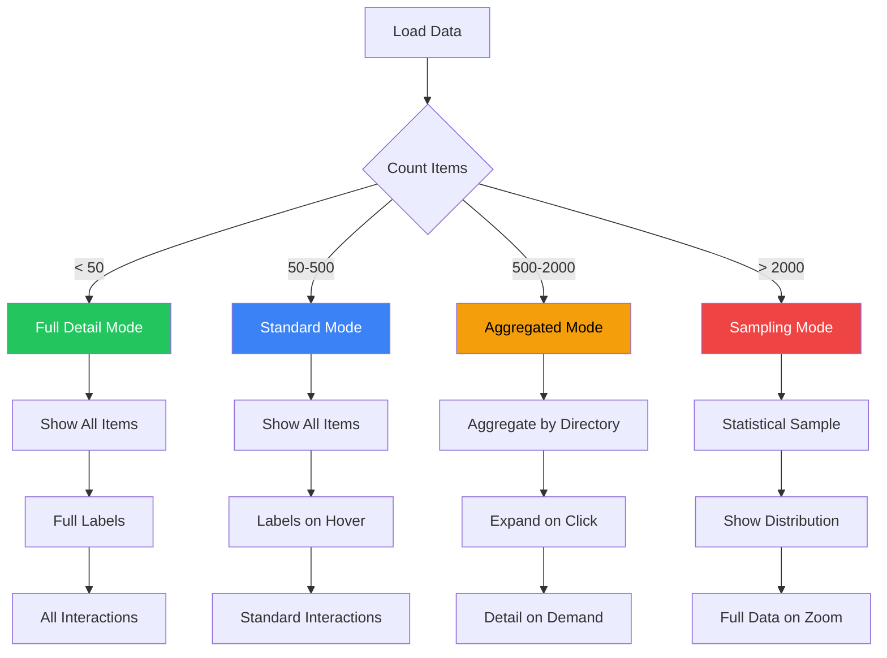

# Adaptive Visualizations for Scale

## User Story

**As a user analyzing codebases of varying sizes**, I want visualizations that automatically adapt from small projects (50 files) to large monorepos (10,000+ files), so that I always get a useful view regardless of scale.

## User Need

A treemap that works beautifully for 100 files becomes an unusable pixel soup at 5,000 files. A scatter plot with 50 points is informative; the same plot with 2,000 points is visual noise.

Users shouldn't need to:

- Manually switch visualization modes
- Adjust settings to handle scale
- Wonder why the view is slow or unreadable

The system should automatically:

- Choose appropriate visualization techniques
- Aggregate data when detail would overwhelm
- Maintain interactivity at any scale
- Degrade gracefully when limits are reached

---

## UX Flow

### Entry Points

This is a system capability, not a user-facing feature. It affects all visualizations.

### Adaptive Behavior



### Exit Points

N/A - This is underlying system behavior.

---

## Information Architecture

### Scale Thresholds

| Item Count | Mode        | Visual Treatment                                 |
| ---------- | ----------- | ------------------------------------------------ |
| 1-50       | Full Detail | Every item visible with labels                   |
| 51-500     | Standard    | Items visible, labels on interaction             |
| 501-2000   | Aggregated  | Group by directory, expand on demand             |
| 2001-10000 | Sampling    | Statistical representation, drill-down available |
| 10000+     | Progressive | Load visible + nearby, virtualize rest           |

### Visualization Strategies by Type

**Treemap:**
| Scale | Strategy |
|-------|----------|
| Small | All cells with labels |
| Medium | Labels for cells > 2% of total |
| Large | Directory-level cells, expand on click |
| Huge | Top-level directory only, progressive load |

**Scatter Plot:**
| Scale | Strategy |
|-------|----------|
| Small | Individual points with labels |
| Medium | Points, labels on hover |
| Large | Hexbin aggregation with count |
| Huge | Density heatmap with sampling |

**Tables:**
| Scale | Strategy |
|-------|----------|
| Small | Full table, no pagination |
| Medium | Virtualized rows |
| Large | Server-side pagination |
| Huge | Search/filter required, no browse |

**Line Charts:**
| Scale | Strategy |
|-------|----------|
| Small | All data points |
| Medium | Downsample to 1 point per pixel |
| Large | LTTB algorithm downsampling |
| Huge | Multiple resolution levels |

---

## Interaction Patterns

### Automatic Adaptation

| Trigger        | System Response           | User Notice          |
| -------------- | ------------------------- | -------------------- |
| Initial load   | Assess count, choose mode | None (seamless)      |
| Filter applied | Reassess, may change mode | Transition animation |
| Zoom in        | Load more detail          | Progressive reveal   |
| Zoom out       | Re-aggregate              | Smooth collapse      |

### User Overrides

| Action           | Trigger                 | Result                           |
| ---------------- | ----------------------- | -------------------------------- |
| Force detail     | "Show all items" button | Load full dataset (with warning) |
| Force aggregate  | "Simplify view" button  | Group regardless of count        |
| Export full data | Export button           | Download complete dataset        |

### Progressive Loading

| State           | Visual Indicator             | User Action                    |
| --------------- | ---------------------------- | ------------------------------ |
| Loading initial | Skeleton + "Loading X items" | Wait                           |
| Loading detail  | Spinner on cell/region       | Can interact with loaded areas |
| Loading more    | Subtle progress bar          | Can continue working           |
| Complete        | Remove indicators            | Full interaction               |

---

## Component Map

### Architecture Clarification

**CRITICAL**: This phase is primarily about **backend data aggregation**, not new UI components.

**Data Layer Responsibility (Main Process):**

- Detect dataset size and choose aggregation strategy
- Pre-aggregate data before sending to renderer
- Stream large datasets in chunks
- Handle pagination and virtual scrolling logic

**Component Responsibility (Renderer):**

- Render pre-aggregated data using **existing** components
- Display loading states during data fetching
- Handle user interactions (zoom, filter, expand)

**DO NOT** build new visualization components for this phase. Use existing @vipr/ui components with smart data handling.

---

### Primary Components (All Existing)

| Component        | Import Path                  | Scale Threshold      | Max Capacity                          |
| ---------------- | ---------------------------- | -------------------- | ------------------------------------- |
| Treemap          | `@vipr/ui/treemap`           | Best for <500 nodes  | ~500 nodes practical limit            |
| MetricsHeatmap   | `@vipr/ui/metrics-heatmap`   | Best for <1000 files | 2500 files max (60×60 grid)           |
| VirtualizedTable | `@vipr/ui/virtualized-table` | Use when >100 rows   | 10,000+ rows with virtualization      |
| CardTable        | `@vipr/ui/card-table`        | Best for <100 rows   | ~200 rows before performance degrades |
| Accordion        | `@vipr/ui/accordion`         | Grouped data         | Unlimited with lazy loading           |
| Skeleton         | `@vipr/ui/skeleton`          | Loading states       | N/A                                   |
| ProgressBar      | `@vipr/ui/progress-bar`      | Chunked loading      | N/A                                   |

### Scale Thresholds (Data Layer)

**Treemap:**

```tsx
// Main process: Aggregate if needed
async function getTreemapData(files: FileData[]): Promise<TreemapNode[]> {
  if (files.length <= 500) {
    // Direct rendering - all files visible
    return files.map(f => ({ ...f, size: f.loc, color: f.complexity }));
  } else if (files.length <= 2000) {
    // Group by directory - directories as nodes
    return aggregateByDirectory(files);
  } else {
    // Group by top-level directories only
    return aggregateByTopLevelDirectory(files);
  }
}
```

**MetricsHeatmap:**

```tsx
// Main process: Grid size limit
async function getHeatmapData(files: FileData[]): Promise<HeatmapCell[]> {
  const MAX_CELLS = 2500; // 50×50 grid max for performance

  if (files.length <= 1000) {
    // Direct rendering - one cell per file
    return files.map(f => ({ path: f.path, value: f.metric }));
  } else if (files.length <= MAX_CELLS) {
    // Aggregate by directory
    return aggregateByDirectory(files);
  } else {
    // Top-level aggregation only
    return aggregateTopLevel(files, MAX_CELLS);
  }
}
```

**Table Selection:**

```tsx
// Main process: Choose table component based on size
async function getFileListComponent(count: number) {
  if (count <= 100) {
    // CardTable - rich UI, good for browsing
    return { component: 'CardTable', data: await getFullData() };
  } else if (count <= 1000) {
    // VirtualizedTable - efficient rendering
    return { component: 'VirtualizedTable', data: await getFullData() };
  } else {
    // Paginated VirtualizedTable
    return {
      component: 'VirtualizedTable',
      data: await getPaginatedData(0, 100),
      totalCount: count,
      pagination: true,
    };
  }
}
```

### Loading State Components

**Skeleton Loading:**

```tsx
// Use while data aggregates in main process
{
  loading ? (
    <div className="space-y-4">
      {Array.from({ length: 10 }).map((_, i) => (
        <Skeleton key={i} className="h-16 rounded-lg" />
      ))}
    </div>
  ) : (
    <CardTable data={data} {...props} />
  );
}
```

**Progress Bar for Chunked Loading:**

```tsx
<ProgressBar
  value={loadedChunks}
  max={totalChunks}
  label={`Loading ${loadedChunks}/${totalChunks} chunks...`}
  className="mb-4"
/>
```

### Progressive Disclosure Pattern

**Accordion with Lazy Loading:**

```tsx
<Accordion
  items={topLevelDirectories.map(dir => ({
    id: dir.path,
    title: `${dir.name} (${dir.fileCount} files)`,
    content: (
      <Suspense fallback={<Skeleton className="h-32" />}>
        <LazyDirectoryContents path={dir.path} />
      </Suspense>
    ),
  }))}
  allowMultiple
  className="border border-gray-200 dark:border-gray-700 rounded-lg"
/>
```

### Color Tokens

**Loading States:**

```tsx
// Skeleton shimmer
'bg-gray-200 dark:bg-gray-700 animate-pulse';

// Progress bar
'bg-violet-500 dark:bg-violet-400';

// Progress background
'bg-gray-200 dark:bg-gray-700';
```

**Data Density Indicators:**

```tsx
// Low density (detailed view)
'text-green-600 dark:text-green-400';

// Medium density (grouped)
'text-yellow-600 dark:text-yellow-400';

// High density (aggregated)
'text-orange-600 dark:text-orange-400';
```

### Typography Tokens

**Loading Messages:**

- Status text: `text-sm text-gray-600 dark:text-gray-400`
- Count display: `text-xs font-mono tabular-nums`

**Aggregation Labels:**

- Directory name: `text-sm font-medium`
- File count: `text-xs text-gray-600 dark:text-gray-400`

### Layout Pattern: Adaptive Rendering

```tsx
const AdaptiveFileView: React.FC<AdaptiveFileViewProps> = ({ files }) => {
  const [viewMode, setViewMode] = useState<'treemap' | 'heatmap' | 'table'>('table');
  const [loading, setLoading] = useState(true);
  const [aggregatedData, setAggregatedData] = useState(null);

  useEffect(() => {
    // Request data from main process (already aggregated)
    const fetchData = async () => {
      setLoading(true);

      const result = await window.electron.ipcRenderer.invoke('files:get-aggregated', {
        viewMode,
        count: files.length,
      });

      setAggregatedData(result.data);
      setViewMode(result.recommendedMode); // Main process decides best mode
      setLoading(false);
    };

    fetchData();
  }, [files.length, viewMode]);

  if (loading) {
    return (
      <div className="space-y-4">
        <Skeleton className="h-8 w-48" />
        <Skeleton className="h-64 w-full" />
      </div>
    );
  }

  // Render appropriate component based on scale
  switch (viewMode) {
    case 'treemap':
      return <Treemap data={aggregatedData} />;

    case 'heatmap':
      return <MetricsHeatmap metrics={aggregatedData.metrics} files={aggregatedData.files} />;

    case 'table':
      return files.length > 100 ? (
        <VirtualizedTable data={aggregatedData} {...tableProps} />
      ) : (
        <CardTable data={aggregatedData} {...tableProps} />
      );
  }
};
```

### IPC Pattern: Backend Aggregation

**Renderer → Main: Request Aggregated Data**

```tsx
const result = await window.electron.ipcRenderer.invoke('files:get-aggregated', {
  viewMode: 'treemap',
  count: 5000, // Let main process know scale
});
// Main process returns pre-aggregated data ready for rendering
```

**Main Process: Smart Aggregation**

```typescript
ipcMain.handle('files:get-aggregated', async (event, { viewMode, count }) => {
  const files = await db.all('SELECT * FROM files');

  // Choose aggregation strategy based on scale
  if (viewMode === 'treemap') {
    if (count <= 500) {
      return { data: files, recommendedMode: 'treemap' };
    } else if (count <= 2000) {
      return { data: aggregateByDirectory(files), recommendedMode: 'treemap' };
    } else {
      // Too large for treemap, suggest table
      return { data: aggregateTopLevel(files), recommendedMode: 'table' };
    }
  }

  // Similar logic for heatmap, table...
});
```

### Design System Notes

**No New Components Needed:**

- All visualizations use existing @vipr/ui components
- Scale handling is **data layer concern** (main process)
- UI components receive pre-aggregated data and render normally

**Future Enhancement (Deferred):**

- WebGL-accelerated rendering for 10,000+ files
- Custom canvas-based heatmap for massive datasets
- Advanced clustering algorithms

**Current Approach:**

- Use existing component capabilities up to documented limits
- Aggregate data intelligently in main process
- Provide clear loading states and progressive disclosure
- Defer WebGL/canvas until proven necessary by user demand

### Composition Guidelines

**DO:**

- ✅ Use existing components (Treemap, MetricsHeatmap, VirtualizedTable)
- ✅ Aggregate data in main process before sending to renderer
- ✅ Show Skeleton during loading
- ✅ Use Accordion for progressive disclosure of nested data
- ✅ Respect documented scale thresholds per component
- ✅ Let main process choose best visualization mode

**DON'T:**

- ❌ Build new WebGL or canvas visualization components
- ❌ Send raw datasets >1000 items to renderer
- ❌ Attempt to render 5000-item treemap without aggregation
- ❌ Over-engineer with custom virtualization when existing works
- ❌ Create new loading state components (use Skeleton/ProgressBar)

**Keep it simple** - This is about smart data handling, not new UI.

---

## Visual Concepts

### Treemap Adaptation

```
SMALL (50 files) - Full Detail
+------------------------------------------------------------------+
| auth/       | components/                                         |
| +------+    | +--------+ +--------+ +--------+ +--------+         |
| |login |    | |Button  | |Table   | |Modal   | |Form    |         |
| |.tsx  |    | |.tsx    | |.tsx    | |.tsx    | |.tsx    |         |
| +------+    | +--------+ +--------+ +--------+ +--------+         |
| +------+    | +--------+ +--------+ +--------+                    |
| |logout|    | |Input   | |Select  | |Card    |                    |
| |.tsx  |    | |.tsx    | |.tsx    | |.tsx    |                    |
| +------+    | +--------+ +--------+ +--------+                    |
+------------------------------------------------------------------+
All files visible with labels.


MEDIUM (300 files) - Labels on Hover
+------------------------------------------------------------------+
| auth/       | components/              | services/                 |
| +--+ +--+   | +--+ +--+ +--+ +--+ +--+ | +--+ +--+ +--+ +--+ +--+ |
| |  | |  |   | |  | |  | |  | |  | |  | | |  | |  | |  | |  | |  | |
| +--+ +--+   | +--+ +--+ +--+ +--+ +--+ | +--+ +--+ +--+ +--+ +--+ |
| +--+ +--+   | +--+ +--+ +--+ +--+ +--+ | +--+ +--+ +--+ +--+ +--+ |
| |  | |  |   | |  | |  | |  | |  | |  | | |  | |  | |  | |  | |  | |
| +--+ +--+   | +--+ +--+ +--+ +--+ +--+ | +--+ +--+ +--+ +--+ +--+ |
+------------------------------------------------------------------+
Files visible, labels appear on hover.


LARGE (2000 files) - Aggregated
+------------------------------------------------------------------+
| src/                                                              |
| +-----------+ +-----------+ +-----------+ +-----------+          |
| | auth/     | |components/| | services/ | | utils/    |          |
| | 45 files  | | 234 files | | 128 files | | 89 files  |          |
| | avg: 28   | | avg: 32   | | avg: 45   | | avg: 18   |          |
| |  [click   | |  [click   | |  [click   | |  [click   |          |
| |  expand]  | |  expand]  | |  expand]  | |  expand]  |          |
| +-----------+ +-----------+ +-----------+ +-----------+          |
+------------------------------------------------------------------+
Directories shown with aggregate metrics. Click to expand.


HUGE (10000+ files) - Progressive
+------------------------------------------------------------------+
| Loading: 10,247 files                                             |
| [=============================-----------] 75%                   |
|                                                                   |
| Showing top-level directories. Click to load details.            |
|                                                                   |
| +--------+ +--------+ +--------+ +--------+ +--------+ +--------+|
| |packages| |  apps  | | libs  | | tools | | tests | | docs  | |
| | 4,123  | | 3,456  | | 1,234 | |  789  | |  456  | |  189  | |
| +--------+ +--------+ +--------+ +--------+ +--------+ +--------+|
+------------------------------------------------------------------+
Top-level only initially. Progressive load on interaction.
```

### Scatter Plot Adaptation

```
SMALL (50 points) - Individual Points
+------------------------------------------------------------------+
|                                                                   |
|  100 |       o                    O                               |
|      |    o     o              o    o                             |
|   50 |  o   o      o        o         o                           |
|      |    o   o       o   o                                       |
|    0 +-----|-----|-----|-----|-----|-----|----->                  |
|            20    40    60    80   100                             |
|                                                                   |
+------------------------------------------------------------------+
Each point labeled on hover.


LARGE (2000 points) - Hexbin
+------------------------------------------------------------------+
|                                                                   |
|  100 |  [2] [5]      [12]    [8]                                  |
|      |    [7] [15]    [23] [18] [3]                               |
|   50 |  [4] [28] [34] [21] [9]                                    |
|      |    [11] [19] [8] [2]                                       |
|    0 +-----|-----|-----|-----|-----|-----|----->                  |
|            20    40    60    80   100                             |
|                                                                   |
| Legend: Hexagon shows count of points in region                   |
+------------------------------------------------------------------+
Hexbins with count. Click to see individual points.


HUGE (10000+ points) - Density Heatmap
+------------------------------------------------------------------+
|                                                                   |
|  100 |  ░░░░░▒▒▒▒░░░░░████░░░░░░                                  |
|      |  ░░░░▒▒▒▒▒▒▒░░████████░░░                                  |
|   50 |  ░░░░▒▒██████▒▒██████░░░░                                  |
|      |  ░░░░░▒▒▒▒▒▒░░▒▒▒▒░░░░░░                                   |
|    0 +-----|-----|-----|-----|-----|-----|----->                  |
|            20    40    60    80   100                             |
|                                                                   |
| Legend: ░ = Low density  ▒ = Medium  █ = High                     |
+------------------------------------------------------------------+
Density gradient. Zoom to see individual points.
```

---

## Psychological Principles

### Seamless Experience

Users shouldn't consciously notice adaptation. The visualization should just "work" at any scale.

### Progressive Disclosure

Large datasets are revealed progressively. Overview first, detail on demand.

### Performance Perception

Showing something immediately (even partial data) feels faster than waiting for complete load.

### Graceful Limits

When truly huge datasets can't be fully rendered, the system explains why and offers alternatives rather than just being slow.

---

## Success Metrics

| Metric              | Target     | Measurement                           |
| ------------------- | ---------- | ------------------------------------- |
| Time to interactive | < 1 second | For any dataset size                  |
| Frame rate          | > 30 fps   | During interaction at any scale       |
| User confusion      | < 5%       | Users who manually switch modes       |
| Information density | Consistent | Useful info per screen stays constant |

---

## Integration with Broader Application

### Feature Dependencies

**Requires:**

- None (foundational capability)

**Enables:**

- Blast Radius (US-NEW-01) - Treemap at scale
- Churn-Complexity Quadrant (US-NEW-03) - Scatter at scale
- Multi-Repository Workspace (US-NEW-10) - Cross-repo at scale

### Implementation Technologies

| Technique        | Library                 | Use Case            |
| ---------------- | ----------------------- | ------------------- |
| Canvas rendering | HTML Canvas             | Large scatter plots |
| WebGL            | Three.js or PixiJS      | Very large datasets |
| Virtualization   | @tanstack/react-virtual | Large tables        |
| Downsampling     | LTTB algorithm          | Time series         |
| Aggregation      | D3 hexbin/quadtree      | Spatial data        |

### Performance Strategies

**Virtualization:**

```typescript
// Only render visible items
const virtualizer = useVirtualizer({
  count: 10000,
  getScrollElement: () => containerRef.current,
  estimateSize: () => 40,
  overscan: 5,
});
```

**Canvas for Large Datasets:**

```typescript
// Use canvas for 1000+ scatter points
if (dataPoints.length > 1000) {
  renderToCanvas(dataPoints);
} else {
  renderSVG(dataPoints);
}
```

**Progressive Loading:**

```typescript
// Load in chunks
async function loadData() {
  const initial = await fetchChunk(0, 500);
  setData(initial); // Show immediately

  // Load rest in background
  const remaining = await fetchAll();
  setData(remaining);
}
```

---

## Complexity Analysis Methodology

### Scale-Adaptive Metrics

Adaptive visualizations must maintain meaningful information density across vastly different dataset sizes. The same complexity metrics apply, but aggregation strategies change.

**Information Density Formula:**

```
OptimalDensity = (VisibleDataPoints × MetricComplexity) / ScreenArea

Where:
  VisibleDataPoints = Items displayed simultaneously
  MetricComplexity = Dimensions per item (1-5)
  ScreenArea = Available pixels

Target: 0.001 to 0.01 (information per pixel)
```

**Aggregation Strategies by Scale:**

1. **Full Detail (1-50 items)** - No aggregation
   - Show: Every item, all metrics
   - Complexity: Linear time O(n)

2. **Selective Detail (51-500 items)** - Progressive disclosure
   - Show: All items, primary metrics only
   - Detail: On interaction
   - Complexity: Linear time O(n), constant detail

3. **Aggregated (501-2000 items)** - Group by category
   - Show: Directory/category summaries
   - Expand: On demand
   - Complexity: O(n log n) for grouping

4. **Sampled (2001-10000 items)** - Statistical representation
   - Show: Representative sample + distribution
   - Full data: Available on zoom
   - Complexity: O(k) where k = sample size

5. **Progressive (10000+ items)** - Virtual rendering
   - Show: Visible window + buffer
   - Load: On scroll/zoom
   - Complexity: O(v) where v = viewport items

### Meaningful Thresholds

**Rendering Mode Selection:**

| Item Count | Mode              | Rendering                 | Frame Time Target |
| ---------- | ----------------- | ------------------------- | ----------------- |
| 1-50       | SVG Full Detail   | All items as SVG elements | < 16ms (60fps)    |
| 51-500     | SVG Optimized     | SVG with reduced detail   | < 16ms (60fps)    |
| 501-2000   | Canvas/Aggregated | Grouped rendering         | < 33ms (30fps)    |
| 2001-10000 | Canvas/Sampled    | Statistical visualization | < 33ms (30fps)    |
| 10000+     | WebGL/Virtual     | GPU-accelerated           | < 16ms (60fps)    |

**Aggregation Thresholds (Comprehensive Metric Set):**

| Metric Category      | Metrics                 | Aggregation Method | Example                                |
| -------------------- | ----------------------- | ------------------ | -------------------------------------- |
| **Structural**       | Cyclomatic Complexity   | Mean or Max        | Directory avg CC: 35, max: 78          |
|                      | Halstead Volume         | Mean               | Directory avg volume: 2,340            |
|                      | Maintainability Index   | Distribution       | 20% A, 40% B, 30% C, 10% D/F           |
|                      | Lines of Code           | Sum                | Directory total LOC: 12,430            |
| **React Complexity** | Hook Count              | Mean               | Avg hooks per component: 6.3           |
|                      | Temporal Complexity     | Mean + Max         | Avg temporal: 12, max: 45              |
|                      | Coupling Score          | Mean               | Avg coupling: 28                       |
|                      | Identity Issues         | Sum                | Total unstable refs: 34                |
| **Security**         | Vulnerabilities         | Sum by severity    | Critical: 2, High: 8, Medium: 15       |
|                      | Security Score          | Mean               | Directory avg: 72                      |
| **Reliability**      | Crash Risk              | Mean               | Avg crash risk: 23                     |
|                      | Null Safety             | Mean               | Avg null safety: 68                    |
|                      | Error Boundary Coverage | Percentage         | 45% components covered                 |
| **Performance**      | Render Risk             | Mean               | Avg unnecessary render risk: 31        |
|                      | Missing Memoization     | Sum                | 23 opportunities                       |
|                      | Bundle Impact           | Mean               | Avg bundle impact: 42                  |
| **Technical Debt**   | Debt Score              | Sum                | Total debt: 245                        |
|                      | Health Grade            | Distribution       | A: 15%, B: 35%, C: 30%, D/F: 20%       |
| **Anti-patterns**    | Count by Category       | Sum per category   | Hooks: 12, Performance: 8, Security: 5 |
| **Accessibility**    | WCAG Violations         | Sum by level       | A: 5, AA: 12, AAA: 8                   |
| **General**          | File Count              | Count              | Directory files: 234                   |
|                      | Overall Distribution    | Histogram          | 20% low, 60% medium, 20% high          |

**Detail Level by Zoom:**

| Zoom Level      | Detail Shown      | Example                  |
| --------------- | ----------------- | ------------------------ |
| Repository View | Directories only  | "src/" avg: 42           |
| Directory View  | Files + aggregate | "auth/" files visible    |
| File View       | Functions + code  | Individual methods shown |
| Function View   | Lines + AST       | Line-by-line complexity  |

### Pattern Recognition

**Performance Degradation Patterns:**

1. **Frame Rate Drop** - Visualization becoming sluggish
   - Detection: Frame time >33ms for >500ms
   - Cause: Too many DOM elements or complex calculations
   - Auto-Response: Switch to Canvas rendering or aggregate

2. **Memory Pressure** - Browser memory increasing
   - Detection: Memory usage >80% of available
   - Cause: Too much data held in memory
   - Auto-Response: Unload off-screen data, increase virtualization

3. **Layout Thrashing** - Jittery animations
   - Detection: Repeated layout recalculations
   - Cause: Frequent DOM changes
   - Auto-Response: Batch updates, use transform instead of position

4. **Load Time Plateau** - Initial load taking too long
   - Detection: Time to interactive >2 seconds
   - Cause: Processing too much data upfront
   - Auto-Response: Progressive loading, show skeleton immediately

## Detection Algorithms

### Scale Detection and Mode Selection

**Step 1: Count Items**

```
function detectScale(data):
  count = data.length

  // Also consider complexity of data
  dimensions = count_data_dimensions(data[0])
  complexity_factor = dimensions / 5  // Normalize to 1 for 5 dimensions

  adjusted_count = count × complexity_factor

  RETURN {
    actual_count: count,
    adjusted_count: adjusted_count,
    dimensions: dimensions
  }
```

**Step 2: Select Rendering Mode**

```
function selectRenderingMode(scale):
  // Check browser capabilities
  has_webgl = check_webgl_support()
  has_canvas = check_canvas_support()
  screen_size = get_screen_dimensions()

  // Adjust thresholds for small screens
  IF screen_size.width < 768:
    mobile_factor = 0.5  // Lower thresholds on mobile
  ELSE:
    mobile_factor = 1.0

  adjusted_count = scale.adjusted_count × mobile_factor

  IF adjusted_count < 50:
    RETURN "svg_full_detail"
  ELSE IF adjusted_count < 500:
    RETURN "svg_optimized"
  ELSE IF adjusted_count < 2000:
    IF has_canvas:
      RETURN "canvas_aggregated"
    ELSE:
      RETURN "svg_aggregated"  // Fallback
  ELSE IF adjusted_count < 10000:
    IF has_canvas:
      RETURN "canvas_sampled"
    ELSE:
      RETURN "svg_sampled"  // Fallback
  ELSE:
    IF has_webgl:
      RETURN "webgl_virtual"
    ELSE IF has_canvas:
      RETURN "canvas_virtual"  // Fallback
    ELSE:
      RETURN "error_too_large"  // Require filtering
```

**Step 3: Configure Visualization**

```
function configureVisualization(mode, data):
  MATCH mode:
    CASE "svg_full_detail":
      RETURN {
        renderer: SVGRenderer,
        labels: "all",
        interactions: "all",
        detail_level: "full"
      }

    CASE "svg_optimized":
      RETURN {
        renderer: SVGRenderer,
        labels: "on_hover",
        interactions: "click_and_hover",
        detail_level: "primary_metrics"
      }

    CASE "canvas_aggregated":
      groups = aggregate_by_directory(data)
      RETURN {
        renderer: CanvasRenderer,
        data: groups,
        labels: "group_labels",
        interactions: "click_to_expand",
        detail_level: "aggregated"
      }

    CASE "canvas_sampled":
      sample = statistical_sample(data, sample_size: 1000)
      RETURN {
        renderer: CanvasRenderer,
        data: sample,
        distribution: calculate_distribution(data),
        labels: "density_indicators",
        interactions: "zoom_for_detail",
        detail_level: "statistical"
      }

    CASE "webgl_virtual":
      RETURN {
        renderer: WebGLRenderer,
        data: data,  // Full data, but virtualized
        viewport_buffer: 500,
        labels: "viewport_only",
        interactions: "pan_zoom",
        detail_level: "load_on_demand"
      }
```

### Aggregation Algorithms

**Directory-Based Aggregation:**

```
function aggregate_by_directory(files):
  directories = {}

  FOR each file in files:
    dir = extract_directory_path(file.path)

    IF dir not in directories:
      directories[dir] = {
        files: [],
        metrics: {
          complexity_sum: 0,
          complexity_max: 0,
          complexity_avg: 0,
          loc_sum: 0,
          file_count: 0
        }
      }

    directories[dir].files.add(file)
    directories[dir].metrics.complexity_sum += file.complexity
    directories[dir].metrics.complexity_max = max(
      directories[dir].metrics.complexity_max,
      file.complexity
    )
    directories[dir].metrics.loc_sum += file.loc
    directories[dir].metrics.file_count++

  // Calculate averages
  FOR each dir in directories:
    dir.metrics.complexity_avg = (
      dir.metrics.complexity_sum / dir.metrics.file_count
    )

  RETURN directories
```

**Statistical Sampling:**

```
function statistical_sample(data, sample_size):
  // Stratified sampling to preserve distribution
  complexity_bins = [
    { min: 0, max: 20, label: "low" },
    { min: 20, max: 40, label: "medium" },
    { min: 40, max: 60, label: "high" },
    { min: 60, max: 100, label: "critical" }
  ]

  binned_data = {}
  FOR each bin in complexity_bins:
    binned_data[bin.label] = FILTER data WHERE (
      file.complexity >= bin.min AND file.complexity < bin.max
    )

  // Sample proportionally from each bin
  sample = []
  FOR each bin_label, bin_files in binned_data:
    proportion = bin_files.length / data.length
    bin_sample_size = round(sample_size × proportion)

    // Random sample from this bin
    bin_sample = random_sample(bin_files, bin_sample_size)
    sample.add_all(bin_sample)

  RETURN sample
```

**Hexbin Aggregation (for scatter plots):**

```
function hexbin_aggregate(points, hexagon_radius):
  hexbins = {}

  FOR each point in points:
    hex_coords = point_to_hex(point.x, point.y, hexagon_radius)
    hex_key = "{hex_coords.q},{hex_coords.r}"

    IF hex_key not in hexbins:
      hexbins[hex_key] = {
        count: 0,
        points: [],
        avg_complexity: 0,
        max_complexity: 0
      }

    hexbins[hex_key].count++
    hexbins[hex_key].points.add(point)
    hexbins[hex_key].max_complexity = max(
      hexbins[hex_key].max_complexity,
      point.complexity
    )

  // Calculate averages
  FOR each hex in hexbins:
    hex.avg_complexity = (
      SUM(point.complexity FOR point in hex.points) / hex.count
    )

  RETURN hexbins

function point_to_hex(x, y, radius):
  // Axial hex coordinate conversion
  q = (x × sqrt(3) / 3 - y / 3) / radius
  r = (y × 2 / 3) / radius
  RETURN cube_round(axial_to_cube(q, r))
```

### Performance Monitoring

**Frame Rate Tracking:**

```
performance_monitor = {
  frame_times: [],
  max_samples: 60  // Last 60 frames
}

function track_frame_performance():
  start_time = performance.now()

  // Render frame...
  render_visualization()

  end_time = performance.now()
  frame_time = end_time - start_time

  performance_monitor.frame_times.add(frame_time)
  IF performance_monitor.frame_times.length > performance_monitor.max_samples:
    performance_monitor.frame_times.shift()  // Remove oldest

  avg_frame_time = average(performance_monitor.frame_times)

  IF avg_frame_time > 33:  // Below 30fps
    WARN("Performance degradation detected")
    consider_mode_change()
```

**Automatic Mode Switching:**

```
function consider_mode_change():
  current_mode = get_current_rendering_mode()
  avg_frame_time = average(performance_monitor.frame_times)

  degradation_factor = avg_frame_time / 16  // 16ms = 60fps target

  IF degradation_factor > 2:  // Significantly slow
    MATCH current_mode:
      CASE "svg_full_detail":
        switch_to("svg_optimized")

      CASE "svg_optimized":
        switch_to("canvas_aggregated")

      CASE "canvas_aggregated":
        increase_aggregation_level()

      CASE "canvas_sampled":
        reduce_sample_size()

    show_notification("Simplified view for better performance")
```

## Interpretation Guidance

### Understanding Adaptive Modes

**Full Detail Mode (1-50 items):**

- What you see: Every file with complete metrics
- Why: Small dataset, can show everything
- Interaction: Hover for details, click for drill-down
- Limitation: None at this scale
- Best for: Small projects, focused directories

**Standard Mode (51-500 items):**

- What you see: All items, primary metric only
- Why: Can render all, but too crowded for all details
- Interaction: Labels appear on hover, click for details
- Limitation: Visual noise if all labels shown
- Best for: Medium projects, single directories

**Aggregated Mode (501-2000 items):**

- What you see: Directory summaries, expandable to files
- Why: Too many items for individual display
- Interaction: Click directory to expand, zoom to focus
- Limitation: Can't see all files at once
- Best for: Large projects, repository overview

**Sampled Mode (2001-10000 items):**

- What you see: Statistical sample (1000 items) + distribution
- Why: Individual rendering would be too slow
- Interaction: Zoom/filter to load specific regions
- Limitation: Not all files visible, must zoom to see
- Best for: Very large projects, identifying patterns

**Progressive Mode (10000+ items):**

- What you see: Viewport-area data only
- Why: Full dataset too large for any standard rendering
- Interaction: Pan/zoom loads new data dynamically
- Limitation: Only see portion at a time
- Best for: Monorepos, enterprise codebases

### Good vs. Bad Performance Metrics

**Frame Rate:**

- Ideal: 60fps (16ms/frame) - buttery smooth
- Acceptable: 30fps (33ms/frame) - smooth enough
- Concerning: 20fps (50ms/frame) - noticeable jank
- Unacceptable: < 15fps (>66ms/frame) - unusable

**Time to Interactive:**

- Ideal: < 500ms - instant feel
- Acceptable: < 1s - fast enough
- Concerning: 1-2s - feels slow
- Unacceptable: >2s - user perceives as broken

**Memory Usage:**

- Ideal: < 100MB - minimal footprint
- Acceptable: 100-300MB - reasonable for visualization
- Concerning: 300-500MB - may cause issues on low-end devices
- Unacceptable: >500MB - likely to crash on mobile

## Example Scenarios

### Scenario 1: Small Project Visualization

**Dataset:** 45 files
**Mode Selected:** SVG Full Detail
**Performance:**

- Frame Rate: 60fps (14ms/frame)
- Memory: 45MB
- Time to Interactive: 280ms

**User Experience:**
All files visible as individual treemap cells. Labels shown by default. Hover shows detailed tooltip. Click opens file detail panel. Smooth animations.

**Why Optimal:** Small enough for complete rendering without performance cost.

---

### Scenario 2: Medium Project with Auto-Optimization

**Dataset:** 380 files
**Initial Mode:** SVG Full Detail
**Performance Issues Detected:**

- Frame Rate: 22fps (45ms/frame) - slow
- Memory: 220MB - acceptable
- Time to Interactive: 1.8s - concerning

**Auto-Switch:** SVG Optimized
**Performance After Switch:**

- Frame Rate: 55fps (18ms/frame) - smooth
- Memory: 180MB - improved
- Time to Interactive: 720ms - acceptable

**What Changed:**

- Labels hidden until hover (reduced DOM nodes)
- Simplified cell rendering (fewer SVG attributes)
- Reduced detail level (primary metric only)

**User Experience:** Slightly less information immediately visible, but much smoother interaction. User can still get details on hover.

---

### Scenario 3: Large Project Aggregation

**Dataset:** 1,240 files
**Mode Selected:** Canvas Aggregated
**Aggregation:** 23 directories

**Performance:**

- Frame Rate: 60fps (12ms/frame)
- Memory: 140MB
- Time to Interactive: 450ms

**Visualization:**
23 directory cells shown, each with:

- Average complexity
- File count
- Color by max complexity in directory

**User Workflow:**

1. User sees `src/` has high complexity (red)
2. Click `src/` to expand
3. See `src/components/` and `src/services/` subdirectories
4. Click `src/components/` to see individual files
5. Now seeing 47 files in detail view

**Why Effective:** Progressive disclosure. User navigates from overview to detail without overwhelming display.

---

### Scenario 4: Massive Monorepo Sampling

**Dataset:** 8,400 files
**Mode Selected:** Canvas Sampled
**Sample Size:** 1,000 files (stratified)

**Performance:**

- Frame Rate: 58fps (17ms/frame)
- Memory: 280MB
- Time to Interactive: 640ms

**Visualization:**

- Scatter plot with 1,000 points (sampled)
- Density heatmap overlay showing full distribution
- Statistical summary: "8.4k files analyzed, 1k shown"

**Distribution Preserved:**

- 18% low complexity (matches full dataset: 17.8%)
- 62% medium complexity (matches full dataset: 63.1%)
- 20% high complexity (matches full dataset: 19.1%)

**User Workflow:**

1. User sees overall distribution (heatmap)
2. Zooms into "high complexity" region
3. System loads actual files in zoomed region (250 files)
4. User now sees real files, not sample, in zoom area

**Why Effective:** Can't show 8.4k points (would be pixel soup), but sample preserves patterns and allows zooming to actual data.

---

### Scenario 5: Performance Degradation Recovery

**Dataset:** 650 files
**Initial Mode:** SVG Optimized
**User Action:** Opens complexity heatmap in side panel (additional visualization)

**Performance Impact:**

- Two visualizations now rendering
- Frame Rate drops: 60fps → 28fps
- User experience: Jittery interactions

**Auto-Recovery:**

1. System detects sustained frame rate < 30fps
2. Notification: "Simplifying view for better performance"
3. Switch to Canvas Aggregated mode
4. Frame rate recovers: 28fps → 52fps

**User Experience:**

- Brief notification explains the change
- Visualization slightly less detailed but smooth again
- User can manually force SVG mode if preferred (advanced settings)

**Why Effective:** Automatic adaptation maintains usability. User doesn't need to understand rendering modes—system just works.

---

## Open Questions

1. **User preference:** Should power users be able to force specific modes? What's the UI for this?

2. **Transition smoothness:** How do we animate smoothly between modes when data changes?

3. **Mobile considerations:** Should mobile devices have lower thresholds for aggregation?

4. **Memory limits:** At what point do we refuse to load data and require filtering?

5. **Accessibility:** How do screen readers handle aggregated data? Alternative presentations?
