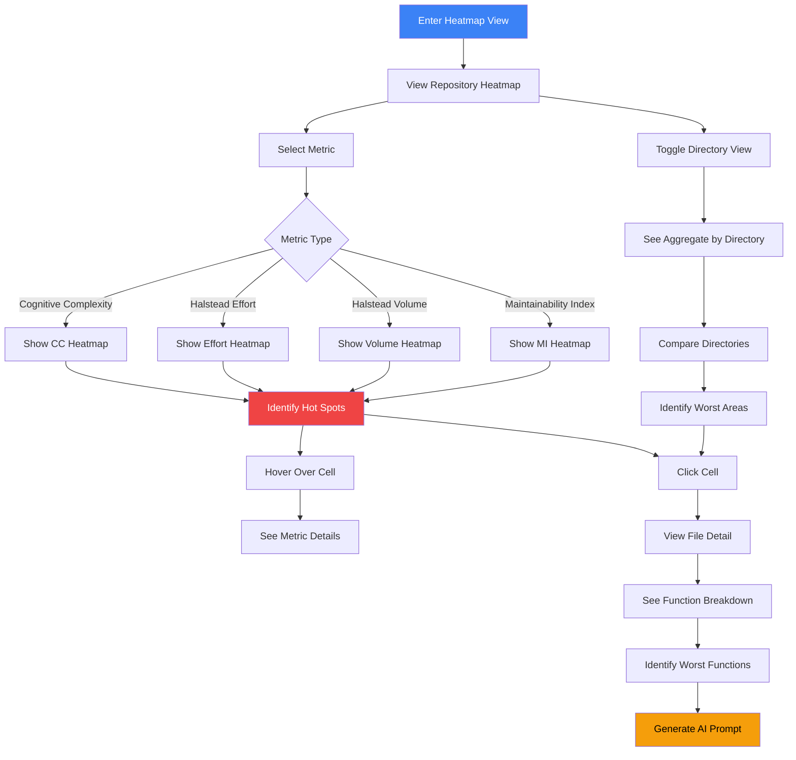

# Cognitive Load and Halstead Effort Heatmaps

## User Story

**As a code reviewer or maintainer**, I want to see heatmaps of cognitive complexity and Halstead effort metrics, so that I can identify the most mentally demanding code without reading every file.

## User Need

Not all complexity is equal. Some complex code is "good complexity" - it solves a genuinely hard problem cleanly. Other complexity is "bad complexity" - it makes simple problems hard to understand.

Traditional metrics miss this distinction:

- Cyclomatic complexity counts paths, not mental effort
- LOC counts size, not comprehension difficulty
- Both treat all operators and expressions equally

Cognitive metrics capture mental effort:

- Halstead effort measures how hard code is to write/understand
- Cognitive complexity penalizes nested structures
- Both better predict "how long will it take to understand this?"

Heatmaps visualize these metrics across the entire codebase, revealing patterns invisible in file-by-file analysis.

---

## UX Flow

### Entry Points

1. **Primary:** Navigation sidebar "Cognitive Heatmap" under Analysis
2. **Secondary:** Dashboard card "Mental Load Distribution"
3. **Contextual:** File detail shows cognitive metrics with link to heatmap
4. **Search:** Global search "high cognitive load files"

### User Journey



### Exit Points

1. **To File Detail:** Click any cell to see file-level metrics
2. **To Function Detail:** Drill into function-level breakdown
3. **To AI Prompt:** Generate refactoring prompt for high-effort code
4. **To Comparison:** Compare cognitive load between snapshots
5. **To Report:** Export cognitive complexity report

---

## Information Architecture

### Metric Definitions (Comprehensive Cognitive Metrics)

#### Core Cognitive Metrics

| Metric                    | What It Measures                         | Interpretation                                        |
| ------------------------- | ---------------------------------------- | ----------------------------------------------------- |
| **Cognitive Complexity**  | Mental effort to understand control flow | Higher = harder to understand nesting/branching       |
| **Halstead Effort**       | Effort to write or understand code       | E = V _ D (Volume _ Difficulty)                       |
| **Halstead Volume**       | Size of implementation                   | V = N \* log2(n) (N = operators+operands, n = unique) |
| **Halstead Difficulty**   | Error-proneness                          | D = (n1/2) \* (N2/n2)                                 |
| **Maintainability Index** | Overall maintainability                  | MI = 171 - 5.2*ln(V) - 0.23*G - 16.2\*ln(LOC)         |

#### React-Specific Cognitive Metrics

| Metric                          | What It Measures                         | Interpretation                                                                                                         |
| ------------------------------- | ---------------------------------------- | ---------------------------------------------------------------------------------------------------------------------- |
| **Hook Complexity**             | Mental load from hooks                   | Weighted by type (useEffect heavier than useState)                                                                     |
| **Temporal Complexity**         | Mental effort to understand effects      | Dependency tracking, cleanup logic, execution timing                                                                   |
| **Coupling Complexity**         | Mental load from component relationships | Props, context, callbacks, forwarding                                                                                  |
| **Identity Complexity**         | Mental effort tracking references        | Unstable references, inline functions, memo needs                                                                      |
| **Dataflow Complexity**         | Mental effort tracking state changes     | Update paths, transforms, shared state                                                                                 |
| **React Maintainability Index** | React-specific maintainability           | Incorporates Halstead + cyclomatic + LOC + hook complexity + temporal + coupling + type coverage + identity complexity |

#### Risk-Based Cognitive Metrics

| Metric                           | What It Measures                    | Interpretation                                          |
| -------------------------------- | ----------------------------------- | ------------------------------------------------------- |
| **Security Cognitive Load**      | Mental effort to verify security    | Vulnerability count and severity weighting              |
| **Reliability Cognitive Load**   | Mental effort to ensure reliability | Crash risk, null safety, error handling complexity      |
| **Performance Cognitive Load**   | Mental effort to optimize           | Render analysis, memoization tracking, bundle concerns  |
| **Accessibility Cognitive Load** | Mental effort to ensure a11y        | WCAG compliance tracking, keyboard nav, ARIA management |

### Data Displayed

**Primary View: Repository Heatmap**

- Treemap layout (files as cells)
- Cell color = metric value (green to red gradient)
- Cell size = lines of code
- Nested by directory structure

**Secondary View: Directory Aggregate**

- Directories as cells (aggregated)
- Shows worst-case, average, or total
- Click to expand into files

**Tertiary View: Metric Comparison**

- Side-by-side heatmaps
- Different metrics for same codebase
- Highlight files that differ between metrics

### Progressive Disclosure Strategy

| Visible By Default | Revealed on Hover   | Revealed on Click      |
| ------------------ | ------------------- | ---------------------- |
| Relative color     | Exact metric value  | Full metric breakdown  |
| File name          | Path and size       | Function-level heatmap |
| Directory grouping | Directory aggregate | Expanded view          |

---

## Interaction Patterns

### Metric Selection

| Action          | Trigger                | Result                         |
| --------------- | ---------------------- | ------------------------------ |
| Change metric   | Dropdown selection     | Recolor heatmap                |
| Compare metrics | Toggle comparison mode | Show two heatmaps side-by-side |
| Show formula    | Info button            | Display metric calculation     |

### Navigation

| Action            | Trigger                | Result                      |
| ----------------- | ---------------------- | --------------------------- |
| Zoom to directory | Click directory border | Expand to show files        |
| Zoom to file      | Double-click file      | Show function-level heatmap |
| Zoom out          | Breadcrumb or Escape   | Return to parent view       |
| Pan               | Drag                   | Move view                   |

### Filtering

| Action              | Trigger    | Result                       |
| ------------------- | ---------- | ---------------------------- |
| Filter by threshold | Slider     | Hide cells below threshold   |
| Filter by type      | Checkboxes | Show only certain file types |
| Search              | Search box | Highlight matching files     |

### Color Scale

| Action                   | Trigger        | Result                                  |
| ------------------------ | -------------- | --------------------------------------- |
| Adjust scale             | Scale slider   | Change color mapping                    |
| Toggle absolute/relative | Toggle button  | Compare to ideal or to codebase average |
| Show legend              | Always visible | Explain color meanings                  |

---

## Component Map

### Primary Components

| Component      | Import Path                 | Configuration                                            | Purpose                                      |
| -------------- | --------------------------- | -------------------------------------------------------- | -------------------------------------------- | -------------------------------------- | ------------------- |
| MetricsHeatmap | `@vipr/ui/metrics-heatmap`  | `metrics={singleMetric}`, `thresholds={concerningLevel}` | Repository-wide cognitive load visualization |
| Dropdown       | `@vipr/ui/dropdown`         | `variant="select"`, `label="Select Metric"`              | Metric type selection                        |
| Tabs           | `@vipr/ui/tabs`             | `tabs={[{id, label, content}]}`                          | Switch between Heatmap/Table/Function views  |
| CardTable      | `@vipr/ui/card-table`       | `columns={[...]}`, `data={files}`, `sortable`            | File ranking by metric                       |
| MetricBarChart | `@vipr/ui/metric-bar-chart` | `data={functionMetrics}`, `direction="lower-is-better"`  | Function-level breakdown                     |
| MetricGroup    | `@vipr/ui/metric-group`     | `metrics={[...]}`, grouped bars                          | File-level grouped metrics                   |
| Badge          | `@vipr/ui/badge`            | `variant="success                                        | warning                                      | error"`                                | Severity indicators |
| Breadcrumb     | `@vipr/ui/breadcrumb`       | `items={navigationPath}`                                 | Zoom navigation context                      |
| Button         | `@vipr/ui/button`           | `appearance="primary                                     | secondary"`                                  | Actions (Open in IDE, Generate Prompt) |
| Tooltip        | `@vipr/ui/tooltip`          | Hover details for metrics                                |
| StatCard       | `@vipr/ui/stat-card`        | `variant="compact"`                                      | Summary statistics                           |

### Color Tokens

**Metric Severity Gradient:**

```tsx
// Healthy (below threshold)
'bg-green-500/20 text-green-700 dark:bg-green-500/10 dark:text-green-400';

// Moderate (at threshold)
'bg-yellow-500/20 text-yellow-700 dark:bg-yellow-500/10 dark:text-yellow-400';

// Concerning (above threshold)
'bg-orange-500/20 text-orange-700 dark:bg-orange-500/10 dark:text-orange-400';

// Critical (well above threshold)
'bg-red-500/20 text-red-700 dark:bg-red-500/10 dark:text-red-400';
```

**Status Indicators:**

- Success/Low: `text-green-600 dark:text-green-400`
- Warning/Moderate: `text-yellow-600 dark:text-yellow-400`
- Error/High: `text-red-600 dark:text-red-400`

### Typography Tokens

**Headers:**

- Page title: `text-2xl font-bold text-gray-900 dark:text-gray-50`
- Section headers: `text-lg font-semibold text-gray-900 dark:text-gray-50`
- Metric labels: `text-sm font-medium text-gray-700 dark:text-gray-300`

**Data Display:**

- Metric values: `text-lg font-semibold tabular-nums`
- File paths: `text-xs font-mono text-gray-600 dark:text-gray-400`
- Function names: `text-sm font-mono`

**Descriptions:**

- Body text: `text-sm text-gray-600 dark:text-gray-400`
- Tooltips: `text-xs text-gray-700 dark:text-gray-300`

### Layout Patterns

**Main Layout:**

```tsx
<div className="flex flex-col h-screen">
  {/* Header with metric selector and stats */}
  <div className="p-6 border-b border-gray-200 dark:border-gray-700">
    <h1 className="text-2xl font-bold mb-4">Cognitive Load Heatmap</h1>

    {/* Controls row */}
    <div className="flex items-center gap-4 mb-4">
      <Dropdown
        variant="select"
        label="Metric"
        options={metricOptions}
        value={selectedMetric}
        onChange={setSelectedMetric}
      />
      <Breadcrumb items={navigationPath} />
    </div>

    {/* Stats row */}
    <div className="grid grid-cols-1 sm:grid-cols-2 lg:grid-cols-4 gap-4">
      <StatCard variant="compact" title="Files Analyzed" value={fileCount} />
      <StatCard variant="compact" title="Avg Cognitive Load" value={avgMetric} />
      <StatCard variant="compact" title="Critical Files" value={criticalCount} />
      <StatCard variant="compact" title="Total Functions" value={functionCount} />
    </div>
  </div>

  {/* Main content area with tabs */}
  <div className="flex-1 overflow-hidden">
    <Tabs
      tabs={[
        { id: 'heatmap', label: 'Heatmap View', content: <HeatmapContent /> },
        { id: 'table', label: 'Table View', content: <TableContent /> },
        { id: 'functions', label: 'Function Breakdown', content: <FunctionContent /> },
      ]}
    />
  </div>
</div>
```

**Responsive Grid:**

- Mobile (<640px): Single column, heatmap full width
- Tablet (640-1024px): Stats 2 columns, heatmap full width
- Desktop (1024px+): Stats 4 columns, heatmap with sidebar option

### Composition Patterns

**Heatmap Tab Content:**

```tsx
const HeatmapContent: React.FC = () => {
  return (
    <div className="p-6">
      <MetricsHeatmap
        metrics={[selectedMetric]} // Single metric only
        files={files}
        thresholds={{
          [selectedMetric]: metricThresholds[selectedMetric].concerning,
        }}
        onCellClick={handleFileClick}
        colorScheme={{
          healthy: 'green',
          moderate: 'yellow',
          concerning: 'orange',
          critical: 'red',
        }}
        className="w-full h-[600px]"
      />

      {/* Color scale legend */}
      <div className="mt-4 flex items-center justify-center gap-4">
        <div className="flex items-center gap-2">
          <div className="w-4 h-4 rounded bg-green-500/20" />
          <span className="text-xs">Healthy (0-{thresholds.low})</span>
        </div>
        <div className="flex items-center gap-2">
          <div className="w-4 h-4 rounded bg-yellow-500/20" />
          <span className="text-xs">
            Moderate ({thresholds.low}-{thresholds.moderate})
          </span>
        </div>
        <div className="flex items-center gap-2">
          <div className="w-4 h-4 rounded bg-orange-500/20" />
          <span className="text-xs">
            Concerning ({thresholds.moderate}-{thresholds.high})
          </span>
        </div>
        <div className="flex items-center gap-2">
          <div className="w-4 h-4 rounded bg-red-500/20" />
          <span className="text-xs">Critical ({thresholds.high}+)</span>
        </div>
      </div>
    </div>
  );
};
```

**Table Tab Content:**

```tsx
const TableContent: React.FC = () => {
  return (
    <div className="p-6">
      <CardTable
        columns={[
          { key: 'path', label: 'File', sortable: true },
          { key: 'cognitive', label: 'Cognitive', sortable: true },
          { key: 'halstead', label: 'Halstead Effort', sortable: true },
          { key: 'maintainability', label: 'MI Score', sortable: true },
          { key: 'severity', label: 'Severity', sortable: true },
        ]}
        data={files.map(file => ({
          path: (
            <div className="flex items-center gap-2">
              <span className="text-sm font-mono">{file.path}</span>
              <Badge variant={getSeverityVariant(file.cognitive)} size="sm">
                {getSeverityLabel(file.cognitive)}
              </Badge>
            </div>
          ),
          cognitive: <span className="font-semibold tabular-nums">{file.cognitive}</span>,
          halstead: (
            <span className="font-semibold tabular-nums">{formatNumber(file.halstead)}</span>
          ),
          maintainability: (
            <span className={cn('font-semibold tabular-nums', getMIColor(file.mi))}>{file.mi}</span>
          ),
          severity: (
            <Badge variant={getSeverityVariant(file.cognitive)}>
              {getSeverityLabel(file.cognitive)}
            </Badge>
          ),
        }))}
        defaultSort={{ key: 'cognitive', direction: 'desc' }}
      />
    </div>
  );
};
```

**Function Breakdown Content:**

```tsx
const FunctionContent: React.FC = () => {
  return (
    <div className="p-6 space-y-6">
      {/* File selector */}
      <Dropdown
        variant="select"
        label="File"
        options={files.map(f => ({ value: f.path, label: f.path }))}
        value={selectedFile}
        onChange={setSelectedFile}
      />

      {/* Function metrics */}
      <div className="space-y-4">
        <h3 className="text-lg font-semibold">Function Breakdown</h3>

        <MetricBarChart
          data={functions.map(fn => ({
            label: fn.name,
            value: fn.cognitive,
            threshold: metricThresholds.cognitive.concerning,
          }))}
          direction="lower-is-better"
          showThresholdLine
          className="h-64"
        />

        {/* Function list with details */}
        <div className="space-y-2">
          {functions.map(fn => (
            <div
              key={fn.name}
              className="p-4 rounded-lg border border-gray-200 dark:border-gray-700"
            >
              <div className="flex items-center justify-between">
                <div className="flex items-center gap-3">
                  <code className="text-sm font-mono">{fn.name}</code>
                  <Badge variant={getSeverityVariant(fn.cognitive)} size="sm">
                    Cognitive: {fn.cognitive}
                  </Badge>
                </div>
                <div className="flex items-center gap-2">
                  <Button appearance="secondary" size="sm" onClick={() => openInIDE(fn)}>
                    Open in IDE
                  </Button>
                  <Button appearance="secondary" size="sm" onClick={() => generatePrompt(fn)}>
                    Generate AI Prompt
                  </Button>
                </div>
              </div>

              {/* Metric group for this function */}
              <MetricGroup
                className="mt-3"
                metrics={[
                  { label: 'Cognitive', value: fn.cognitive, unit: '' },
                  { label: 'Halstead Effort', value: fn.halsteadEffort, unit: '' },
                  { label: 'Nesting Depth', value: fn.maxNesting, unit: 'levels' },
                  { label: 'LOC', value: fn.loc, unit: 'lines' },
                ]}
              />

              {fn.cognitive > 30 && (
                <p className="mt-2 text-xs text-gray-600 dark:text-gray-400">
                  {getRefactoringRecommendation(fn)}
                </p>
              )}
            </div>
          ))}
        </div>
      </div>
    </div>
  );
};
```

### Metric Threshold Configuration

```tsx
// Threshold configuration per metric type
const metricThresholds = {
  cognitive: {
    low: 10,
    moderate: 20,
    concerning: 30,
    critical: 50,
  },
  halsteadEffort: {
    low: 5000,
    moderate: 20000,
    concerning: 50000,
    critical: 100000,
  },
  halsteadVolume: {
    low: 500,
    moderate: 1000,
    concerning: 3000,
    critical: 10000,
  },
  maintainability: {
    // Inverted: lower is worse
    critical: 20,
    concerning: 40,
    moderate: 65,
    healthy: 85,
  },
};

// Helper to determine severity variant for Badge
function getSeverityVariant(value: number, metric: string): 'success' | 'warning' | 'error' {
  const thresholds = metricThresholds[metric];
  if (value < thresholds.low) return 'success';
  if (value < thresholds.moderate) return 'warning';
  return 'error';
}
```

### Integration Notes

**MetricsHeatmap Configuration:**

- Configure with **single metric only** (not multiple metrics)
- Pass threshold for "concerning" level - MetricsHeatmap will color files above threshold
- Files below threshold render in gray/green (healthy)
- Files above threshold render in yellow/orange/red based on how far above
- This approximates continuous coloring without needing a gradient legend component

**Chart.js Integration:**
MetricBarChart uses Chart.js internally. For threshold lines:

```tsx
<MetricBarChart
  data={functionData}
  options={{
    plugins: {
      annotation: {
        annotations: {
          threshold: {
            type: 'line',
            yMin: thresholds.concerning,
            yMax: thresholds.concerning,
            borderColor: '#f0bb33',
            borderWidth: 2,
            borderDash: [5, 5],
            label: {
              content: 'Concerning Level',
              enabled: true,
              position: 'end',
            },
          },
        },
      },
    },
  }}
/>
```

**Metric Comparison Pattern:**
For side-by-side comparison of two metrics:

```tsx
<div className="grid grid-cols-2 gap-6">
  <div>
    <h3 className="text-sm font-medium mb-2">Cognitive Complexity</h3>
    <MetricsHeatmap metrics={['cognitive']} files={files} thresholds={{ cognitive: 30 }} />
  </div>
  <div>
    <h3 className="text-sm font-medium mb-2">Halstead Effort</h3>
    <MetricsHeatmap
      metrics={['halsteadEffort']}
      files={files}
      thresholds={{ halsteadEffort: 50000 }}
    />
  </div>
</div>
```

---

## Visual Concepts

### Repository Heatmap

**Component Assembly:**

```tsx
<div className="flex flex-col h-screen">
  {/* Header */}
  <div className="p-6 border-b border-gray-200 dark:border-gray-700">
    <h1 className="text-2xl font-bold mb-4">Cognitive Load Heatmap</h1>

    {/* Controls */}
    <div className="flex items-center gap-4 mb-4">
      <Dropdown
        variant="select"
        label="Metric"
        options={[
          { value: 'cognitive', label: 'Cognitive Complexity' },
          { value: 'halsteadEffort', label: 'Halstead Effort' },
          { value: 'halsteadVolume', label: 'Halstead Volume' },
          { value: 'maintainability', label: 'Maintainability Index' },
        ]}
        value={selectedMetric}
        onChange={setSelectedMetric}
        className="w-64"
      />

      {currentFile && (
        <Breadcrumb
          items={[
            { label: 'Repository', onClick: () => zoomOut() },
            { label: currentDirectory },
            { label: currentFile },
          ]}
        />
      )}
    </div>

    {/* Summary stats */}
    <div className="grid grid-cols-4 gap-4">
      <StatCard variant="compact" title="Files Analyzed" value={fileCount} icon="DocumentIcon" />
      <StatCard
        variant="compact"
        title="Avg Cognitive Load"
        value={avgCognitive.toFixed(1)}
        subtitle="Repository average"
      />
      <StatCard
        variant="compact"
        title="Critical Files"
        value={criticalCount}
        badge={<Badge variant="error">Alert</Badge>}
      />
      <StatCard variant="compact" title="Total Functions" value={functionCount} />
    </div>
  </div>

  {/* Heatmap visualization */}
  <div className="flex-1 p-6 overflow-auto">
    <MetricsHeatmap
      metrics={[selectedMetric]}
      files={files}
      thresholds={{
        [selectedMetric]: metricThresholds[selectedMetric].concerning,
      }}
      onCellClick={file => navigateToFile(file)}
      onCellHover={file => showTooltip(file)}
      colorScheme={{
        healthy: 'green',
        moderate: 'yellow',
        concerning: 'orange',
        critical: 'red',
      }}
      className="w-full h-[600px]"
    />

    {/* Discrete color scale legend */}
    <div className="mt-6 flex items-center justify-center gap-6">
      <div className="flex items-center gap-2">
        <div className="w-4 h-4 rounded bg-green-500/20" />
        <span className="text-xs text-gray-600 dark:text-gray-400">
          Healthy (0-{thresholds.low})
        </span>
      </div>
      <div className="flex items-center gap-2">
        <div className="w-4 h-4 rounded bg-yellow-500/20" />
        <span className="text-xs text-gray-600 dark:text-gray-400">
          Moderate ({thresholds.low}-{thresholds.moderate})
        </span>
      </div>
      <div className="flex items-center gap-2">
        <div className="w-4 h-4 rounded bg-orange-500/20" />
        <span className="text-xs text-gray-600 dark:text-gray-400">
          Concerning ({thresholds.moderate}-{thresholds.high})
        </span>
      </div>
      <div className="flex items-center gap-2">
        <div className="w-4 h-4 rounded bg-red-500/20" />
        <span className="text-xs text-gray-600 dark:text-gray-400">
          Critical ({thresholds.high}+)
        </span>
      </div>
    </div>
  </div>
</div>
```

**Interaction:**

- **Metric Selection:** Dropdown changes heatmap coloring based on selected metric
- **Cell Hover:** Tooltip shows exact value, file path, LOC
- **Cell Click:** Navigate to function-level breakdown for that file
- **Color Mapping:** Threshold-based (not gradient) - files colored by threshold band

### Function-Level Heatmap (File Zoomed)

**Component Assembly:**

```tsx
<div className="flex flex-col h-screen">
  {/* Header with breadcrumb navigation */}
  <div className="p-6 border-b border-gray-200 dark:border-gray-700">
    <Breadcrumb
      items={[
        { label: 'Repository', onClick: () => navigateToRepository() },
        { label: 'src/services/auth', onClick: () => navigateToDirectory() },
        { label: 'index.ts', active: true },
      ]}
      className="mb-4"
    />

    <div className="flex items-center justify-between">
      <div className="flex items-center gap-3">
        <h2 className="text-xl font-semibold font-mono">src/services/auth/index.ts</h2>
        <Badge variant="error" size="lg">
          Critical
        </Badge>
      </div>

      <div className="flex items-center gap-2">
        <StatCard variant="compact" title="File Cognitive Load" value={78} className="w-auto" />
      </div>
    </div>
  </div>

  {/* Function breakdown chart */}
  <div className="p-6 border-b border-gray-200 dark:border-gray-700">
    <h3 className="text-lg font-semibold mb-4">Function Breakdown</h3>

    <MetricBarChart
      data={[
        { label: 'validateCredentials()', value: 34, threshold: 30 },
        { label: 'refreshToken()', value: 28, threshold: 30 },
        { label: 'login()', value: 8, threshold: 30 },
        { label: 'logout()', value: 4, threshold: 30 },
        { label: 'getUser()', value: 4, threshold: 30 },
      ]}
      direction="lower-is-better"
      showThresholdLine
      options={{
        plugins: {
          annotation: {
            annotations: {
              threshold: {
                type: 'line',
                yMin: 30,
                yMax: 30,
                borderColor: '#f0bb33',
                borderWidth: 2,
                borderDash: [5, 5],
                label: { content: 'Concerning Level (30)', enabled: true },
              },
            },
          },
        },
      }}
      className="h-64"
    />
  </div>

  {/* Function list with details and actions */}
  <div className="flex-1 p-6 overflow-auto">
    <h3 className="text-lg font-semibold mb-4">Top Cognitive Load Functions</h3>

    <div className="space-y-3">
      {/* Function 1: validateCredentials - Critical */}
      <div className="p-4 rounded-lg border border-gray-200 dark:border-gray-700 bg-red-500/5">
        <div className="flex items-center justify-between mb-3">
          <div className="flex items-center gap-3">
            <code className="text-sm font-mono font-semibold">validateCredentials()</code>
            <Badge variant="error">Cognitive: 34</Badge>
            <Badge variant="default" size="sm">
              Lines 45-89
            </Badge>
          </div>
          <div className="flex items-center gap-2">
            <Button
              appearance="secondary"
              size="sm"
              onClick={() => openInIDE('validateCredentials')}
            >
              Open in IDE
            </Button>
            <Button
              appearance="secondary"
              size="sm"
              onClick={() => generatePrompt('validateCredentials')}
            >
              Generate AI Prompt
            </Button>
          </div>
        </div>

        <MetricGroup
          metrics={[
            { label: 'Cognitive', value: 34, unit: '' },
            { label: 'Halstead Effort', value: 12500, unit: '' },
            { label: 'Max Nesting', value: 5, unit: 'levels' },
            { label: 'LOC', value: 44, unit: 'lines' },
          ]}
          className="mb-2"
        />

        <p className="text-xs text-gray-600 dark:text-gray-400">
          Issue: Multiple nested conditions (5 levels deep)
          <br />
          Recommendation: Extract validation logic to separate functions, reduce nesting to ≤3
          levels
        </p>
      </div>

      {/* Function 2: refreshToken - Concerning */}
      <div className="p-4 rounded-lg border border-gray-200 dark:border-gray-700 bg-orange-500/5">
        <div className="flex items-center justify-between mb-3">
          <div className="flex items-center gap-3">
            <code className="text-sm font-mono font-semibold">refreshToken()</code>
            <Badge variant="warning">Cognitive: 28</Badge>
            <Badge variant="default" size="sm">
              Lines 91-125
            </Badge>
          </div>
          <div className="flex items-center gap-2">
            <Button appearance="secondary" size="sm" onClick={() => openInIDE('refreshToken')}>
              Open in IDE
            </Button>
          </div>
        </div>

        <MetricGroup
          metrics={[
            { label: 'Cognitive', value: 28, unit: '' },
            { label: 'Halstead Effort', value: 8900, unit: '' },
            { label: 'Max Nesting', value: 4, unit: 'levels' },
            { label: 'LOC', value: 34, unit: 'lines' },
          ]}
          className="mb-2"
        />

        <p className="text-xs text-gray-600 dark:text-gray-400">
          Issue: Complex async flow with error handling
          <br />
          Recommendation: Consider using async/await instead of promise chains
        </p>
      </div>

      {/* Function 3: login - Healthy */}
      <div className="p-4 rounded-lg border border-gray-200 dark:border-gray-700">
        <div className="flex items-center justify-between mb-3">
          <div className="flex items-center gap-3">
            <code className="text-sm font-mono font-semibold">login()</code>
            <Badge variant="success">Cognitive: 8</Badge>
            <Badge variant="default" size="sm">
              Lines 127-145
            </Badge>
          </div>
          <Button appearance="secondary" size="sm" onClick={() => openInIDE('login')}>
            Open in IDE
          </Button>
        </div>

        <MetricGroup
          metrics={[
            { label: 'Cognitive', value: 8, unit: '' },
            { label: 'Halstead Effort', value: 2300, unit: '' },
            { label: 'Max Nesting', value: 2, unit: 'levels' },
            { label: 'LOC', value: 18, unit: 'lines' },
          ]}
        />
      </div>
    </div>
  </div>
</div>
```

**Interaction:**

- **Breadcrumb Navigation:** Click breadcrumb items to zoom back out
- **Chart Visualization:** MetricBarChart shows relative cognitive load with threshold line
- **Function Cards:** Color-coded borders (red/orange/gray) based on severity
- **Actions:** Open in IDE or generate AI refactoring prompt per function
- **MetricGroup:** Shows all relevant metrics for each function

### Metric Comparison View

**Component Assembly:**

```tsx
<div className="flex flex-col h-screen">
  {/* Header */}
  <div className="p-6 border-b border-gray-200 dark:border-gray-700">
    <h1 className="text-2xl font-bold mb-4">Metric Comparison</h1>

    {/* Metric selectors */}
    <div className="flex items-center gap-4">
      <Dropdown
        variant="select"
        label="Left Metric"
        options={metricOptions}
        value={leftMetric}
        onChange={setLeftMetric}
        className="w-64"
      />
      <span className="text-sm text-gray-500">vs</span>
      <Dropdown
        variant="select"
        label="Right Metric"
        options={metricOptions}
        value={rightMetric}
        onChange={setRightMetric}
        className="w-64"
      />
    </div>
  </div>

  {/* Side-by-side heatmaps */}
  <div className="flex-1 p-6">
    <div className="grid grid-cols-2 gap-6 mb-8">
      {/* Left heatmap */}
      <div>
        <div className="flex items-center justify-between mb-3">
          <h3 className="text-lg font-semibold">Cognitive Complexity</h3>
          <Badge variant="default" size="sm">
            Threshold: {thresholds.cognitive.concerning}
          </Badge>
        </div>
        <MetricsHeatmap
          metrics={['cognitive']}
          files={files}
          thresholds={{ cognitive: 30 }}
          onCellClick={handleCellClick}
          colorScheme={{
            healthy: 'green',
            moderate: 'yellow',
            concerning: 'orange',
            critical: 'red',
          }}
          className="h-[400px]"
        />
      </div>

      {/* Right heatmap */}
      <div>
        <div className="flex items-center justify-between mb-3">
          <h3 className="text-lg font-semibold">Halstead Effort</h3>
          <Badge variant="default" size="sm">
            Threshold: {thresholds.halsteadEffort.concerning}
          </Badge>
        </div>
        <MetricsHeatmap
          metrics={['halsteadEffort']}
          files={files}
          thresholds={{ halsteadEffort: 50000 }}
          onCellClick={handleCellClick}
          colorScheme={{
            healthy: 'green',
            moderate: 'yellow',
            concerning: 'orange',
            critical: 'red',
          }}
          className="h-[400px]"
        />
      </div>
    </div>

    {/* Files with significant difference */}
    <div className="mt-8">
      <h3 className="text-lg font-semibold mb-4">Files with Significant Difference</h3>
      <p className="text-sm text-gray-600 dark:text-gray-400 mb-4">
        Files where metrics disagree reveal different types of complexity
      </p>

      <CardTable
        columns={[
          { key: 'file', label: 'File', sortable: true },
          { key: 'cognitive', label: 'Cognitive', sortable: true },
          { key: 'cognitiveStatus', label: 'CC Status', sortable: true },
          { key: 'halstead', label: 'Halstead Effort', sortable: true },
          { key: 'halsteadStatus', label: 'HE Status', sortable: true },
          { key: 'analysis', label: 'Analysis' },
        ]}
        data={[
          {
            file: <code className="text-xs font-mono">components/DataTable.tsx</code>,
            cognitive: <span className="font-semibold tabular-nums">45</span>,
            cognitiveStatus: <Badge variant="warning">Concerning</Badge>,
            halstead: <span className="font-semibold tabular-nums">8,000</span>,
            halsteadStatus: <Badge variant="success">Moderate</Badge>,
            analysis: (
              <div className="text-xs">
                <p className="font-medium">High CC, moderate effort</p>
                <p className="text-gray-600 dark:text-gray-400">
                  Complex control flow but straightforward operations
                </p>
              </div>
            ),
          },
          {
            file: <code className="text-xs font-mono">utils/formatter.ts</code>,
            cognitive: <span className="font-semibold tabular-nums">12</span>,
            cognitiveStatus: <Badge variant="success">Healthy</Badge>,
            halstead: <span className="font-semibold tabular-nums">52,000</span>,
            halsteadStatus: <Badge variant="warning">Concerning</Badge>,
            analysis: (
              <div className="text-xs">
                <p className="font-medium">Low CC, high effort (math)</p>
                <p className="text-gray-600 dark:text-gray-400">
                  Simple flow but many operators/operands (calculations)
                </p>
              </div>
            ),
          },
          {
            file: <code className="text-xs font-mono">services/auth/index.ts</code>,
            cognitive: <span className="font-semibold tabular-nums">78</span>,
            cognitiveStatus: <Badge variant="error">Critical</Badge>,
            halstead: <span className="font-semibold tabular-nums">125,000</span>,
            halsteadStatus: <Badge variant="error">Critical</Badge>,
            analysis: (
              <div className="text-xs">
                <p className="font-medium text-red-600 dark:text-red-400">
                  Both high - priority refactor
                </p>
                <p className="text-gray-600 dark:text-gray-400">
                  Complex nesting AND high operator count - needs immediate attention
                </p>
              </div>
            ),
          },
        ]}
        className="border border-gray-200 dark:border-gray-700 rounded-lg"
      />

      {/* Interpretation guidance */}
      <div className="mt-6 p-4 rounded-lg bg-blue-50 dark:bg-blue-900/20 border border-blue-200 dark:border-blue-800">
        <h4 className="text-sm font-semibold mb-2 text-blue-900 dark:text-blue-100">
          Understanding Metric Disagreement
        </h4>
        <ul className="text-xs text-blue-800 dark:text-blue-200 space-y-1">
          <li>
            <strong>High CC, Low HE:</strong> Complex control flow (branching/nesting) but simple
            operations. Often acceptable (e.g., state machines).
          </li>
          <li>
            <strong>Low CC, High HE:</strong> Simple flow but many operations. Common in
            math/algorithms - may be justified.
          </li>
          <li>
            <strong>Both High:</strong> Critical - complex flow AND complex operations. Priority
            refactor target.
          </li>
          <li>
            <strong>Both Low:</strong> Ideal - simple flow and simple operations. Maintainable code.
          </li>
        </ul>
      </div>
    </div>
  </div>
</div>
```

**Interaction:**

- **Metric Selection:** Dropdowns change both heatmaps independently
- **Visual Comparison:** Side-by-side layout reveals files that differ across metrics
- **Table Analysis:** CardTable shows files where metrics disagree significantly
- **Color Coding:** Badge variants (success/warning/error) for quick status assessment
- **Interpretation:** Blue info box explains what metric disagreement means

---

## Psychological Principles

### Visual Pattern Recognition

Heatmaps leverage human ability to spot patterns and outliers in color fields. A red cell immediately draws attention without reading any numbers.

### Relative Assessment

Color scales let users quickly assess relative severity. "This file is worse than others" is often more actionable than absolute numbers.

### Metric Complementarity

Showing multiple metrics reveals that different metrics capture different problems. A file can be high on one metric and low on another, suggesting different remediation strategies.

---

## Success Metrics

| Metric                 | Target       | Measurement                              |
| ---------------------- | ------------ | ---------------------------------------- |
| Hotspot identification | < 10 seconds | Time to find highest cognitive load file |
| Metric understanding   | > 70%        | Users correctly interpret color meaning  |
| Action taken           | > 40%        | Users who click through to file detail   |
| Comparison usage       | > 30%        | Users who compare multiple metrics       |

---

## Integration with Broader Application

### Feature Dependencies

**Requires:**

- Five-Level Zoom (US-NEW-05) - Navigation patterns
- Adaptive Visualizations (US-NEW-17) - Scale handling

**Enables:**

- AI Prompt Generation (US-NEW-19) - Cognitive-aware prompts
- Complexity Budget (US-NEW-16) - Cognitive metric budgets

### Data Sources

- Halstead metrics from `@vipr/core` plugin
- Cognitive complexity from `@vipr/core` plugin
- Function-level metrics from analysis
- Directory aggregation computed on demand

### Halstead Calculation

```typescript
interface HalsteadMetrics {
  // Primitives
  n1: number; // Distinct operators
  n2: number; // Distinct operands
  N1: number; // Total operators
  N2: number; // Total operands

  // Derived
  vocabulary: number; // n = n1 + n2
  length: number; // N = N1 + N2
  volume: number; // V = N * log2(n)
  difficulty: number; // D = (n1/2) * (N2/n2)
  effort: number; // E = D * V
  time: number; // T = E / 18 (seconds to understand)
  bugs: number; // B = V / 3000 (estimated bugs)
}
```

---

## Complexity Analysis Methodology

### Cognitive Complexity vs. Halstead Metrics

Traditional cyclomatic complexity counts paths but doesn't measure mental effort. Cognitive metrics capture what makes code genuinely hard to understand.

**Cognitive Complexity Methodology:**

```
CognitiveComplexity = BaseComplexity + NestingPenalty + BreakInFlowPenalty

Where:
  BaseComplexity = Count of decision structures (if, loop, etc.)
  NestingPenalty = Nested structures penalized exponentially
  BreakInFlowPenalty = Breaks, continues, gotos add penalty
```

**Nesting Penalty Formula:**

```
FOR each control structure:
  IF nesting_level == 0:
    penalty = 1
  ELSE:
    penalty = 1 + nesting_level  // Linear increase per level

Example:
  if (a) {           // +1 (level 0)
    if (b) {         // +2 (level 1)
      if (c) {       // +3 (level 2)
        while (d) {  // +4 (level 3)
          ...
        }
      }
    }
  }
  Total: 1 + 2 + 3 + 4 = 10 cognitive complexity
```

**Halstead Metrics Methodology:**

Halstead treats code as a collection of operators and operands, measuring mental effort required to write or understand.

```
Primitives:
  n1 = Number of distinct operators
  n2 = Number of distinct operands
  N1 = Total operator occurrences
  N2 = Total operand occurrences

Derived Metrics:
  Vocabulary (n) = n1 + n2
  Length (N) = N1 + N2
  Volume (V) = N × log₂(n)
  Difficulty (D) = (n1 / 2) × (N2 / n2)
  Effort (E) = V × D
  Time (T) = E / 18 (seconds to understand)
  Bugs (B) = V / 3000 (estimated defects)
```

### Meaningful Thresholds

**Cognitive Complexity:**

| Score | Interpretation | Characteristics                   |
| ----- | -------------- | --------------------------------- |
| 0-5   | Very Simple    | Linear flow, minimal branching    |
| 6-10  | Simple         | Easy to understand, few decisions |
| 11-20 | Moderate       | Manageable complexity             |
| 21-30 | Complex        | Requires careful reading          |
| 31-50 | Very Complex   | Difficult to comprehend fully     |
| 51+   | Critical       | Nearly incomprehensible           |

**Halstead Volume:**

| Volume     | Interpretation | Size                         |
| ---------- | -------------- | ---------------------------- |
| 0-100      | Very Small     | Trivial function             |
| 101-500    | Small          | Typical function             |
| 501-1000   | Medium         | Large function or small file |
| 1001-3000  | Large          | Complex file                 |
| 3001-10000 | Very Large     | God file                     |
| 10000+     | Excessive      | Needs decomposition          |

**Halstead Effort:**

| Effort       | Interpretation | Time to Understand |
| ------------ | -------------- | ------------------ |
| 0-1000       | Trivial        | < 1 minute         |
| 1001-5000    | Easy           | 1-5 minutes        |
| 5001-20000   | Moderate       | 5-20 minutes       |
| 20001-100000 | Difficult      | 20-90 minutes      |
| 100000+      | Very Difficult | >90 minutes        |

**Halstead Difficulty:**

| Difficulty | Interpretation | Risk            |
| ---------- | -------------- | --------------- |
| 0-10       | Simple         | Low error rate  |
| 11-20      | Moderate       | Some risk       |
| 21-40      | Difficult      | Elevated risk   |
| 41-60      | Very Difficult | High error risk |
| 61+        | Error-Prone    | Very high risk  |

**Maintainability Index:**

```
MI = 171 - 5.2 × ln(V) - 0.23 × G - 16.2 × ln(LOC)

Where:
  V = Halstead Volume
  G = Cyclomatic Complexity
  LOC = Lines of Code
```

| MI Score | Maintainability         | Action            |
| -------- | ----------------------- | ----------------- |
| 85-100   | Highly Maintainable     | Excellent         |
| 65-84    | Moderately Maintainable | Good              |
| 40-64    | Difficult to Maintain   | Needs improvement |
| 20-39    | Nearly Unmaintainable   | Refactor soon     |
| 0-19     | Unmaintainable          | Immediate action  |

### Pattern Recognition

**High Cognitive Load Patterns:**

1. **Deep Nesting Hell**
   - Pattern: 4+ levels of nested conditions/loops
   - Cognitive Penalty: Exponential (4 levels = +10, 5 levels = +15)
   - Example: Nested try-catch inside loops inside conditions
   - Solution: Extract nested logic to named functions

2. **Boolean Spaghetti**
   - Pattern: Multiple && and || in single condition
   - Cognitive Penalty: Each boolean operator adds mental tracking
   - Example: `if (a && (b || c) && !(d || e))`
   - Solution: Extract to named boolean variables

3. **Scattered Concerns**
   - Pattern: Function handles multiple unrelated responsibilities
   - Detection: High Halstead n1 (many distinct operators)
   - Example: Function that validates, transforms, and persists
   - Solution: Split by concern (SRP)

**High Halstead Effort Patterns:**

1. **Operator Overload**
   - Pattern: Many distinct operators (high n1)
   - Causes High Difficulty: D = (n1/2) × (N2/n2)
   - Example: Mathematical functions with +, -, ×, /, %, ^, bitwise
   - Assessment: May be justified for algorithms

2. **Operand Repetition**
   - Pattern: Same operands used many times (high N2, low n2)
   - Causes High Difficulty: D = (n1/2) × (N2/n2)
   - Example: Accessing `user.profile.settings.theme` 20 times
   - Solution: Extract to local variable

3. **Vocabulary Explosion**
   - Pattern: High vocabulary (n = n1 + n2 >100)
   - Causes High Volume: V = N × log₂(n)
   - Example: Function using many different variables/functions
   - Solution: Extract to smaller functions

**Metric Disagreement Patterns:**

1. **High Cyclomatic, Low Cognitive**
   - Pattern: CC >30, Cognitive < 15
   - Interpretation: Many simple branches (switch statements)
   - Example: State machine with flat switch-case
   - Assessment: Acceptable - not mentally taxing

2. **Low Cyclomatic, High Cognitive**
   - Pattern: CC < 15, Cognitive >30
   - Interpretation: Deep nesting without many branches
   - Example: Nested loops/tries processing data
   - Assessment: Concerning - mental overhead high

3. **Low Cyclomatic, High Halstead**
   - Pattern: CC < 20, Effort >50000
   - Interpretation: Simple flow, complex operations
   - Example: Mathematical calculations, data transformations
   - Assessment: May be justified - algorithmic complexity

## Detection Algorithms

### Cognitive Complexity Calculation

**Step 1: Parse AST**

```
function calculateCognitiveComplexity(ast):
  complexity = 0
  nesting_level = 0

  traverse(ast, {
    enter(node):
      MATCH node.type:
        CASE "IfStatement", "ConditionalExpression":
          complexity += 1 + nesting_level
          nesting_level++

        CASE "SwitchStatement":
          complexity += 1 + nesting_level
          nesting_level++

        CASE "ForStatement", "ForInStatement", "ForOfStatement",
             "WhileStatement", "DoWhileStatement":
          complexity += 1 + nesting_level
          nesting_level++

        CASE "CatchClause":
          complexity += 1 + nesting_level
          nesting_level++

        CASE "BinaryExpression":
          IF node.operator IN ["&&", "||"]:
            // Logical operators in conditions increase complexity
            complexity += 1

        CASE "BreakStatement", "ContinueStatement":
          // Break in control flow
          complexity += 1

    exit(node):
      IF node.type IN [
        "IfStatement", "SwitchStatement", "ForStatement",
        "WhileStatement", "DoWhileStatement", "CatchClause"
      ]:
        nesting_level--
  })

  RETURN complexity
```

**Step 2: Identify Problem Areas**

```
function identifyHighCognitiveAreas(functions):
  hotspots = []

  FOR each function in functions:
    complexity = calculateCognitiveComplexity(function.ast)

    IF complexity > 30:
      severity = "Critical"
    ELSE IF complexity > 20:
      severity = "High"
    ELSE IF complexity > 10:
      severity = "Moderate"
    ELSE:
      severity = "Low"

    // Find deepest nesting
    max_nesting = findMaxNesting(function.ast)

    hotspots.add({
      function: function.name,
      complexity: complexity,
      severity: severity,
      max_nesting: max_nesting,
      recommendation: generateRecommendation(complexity, max_nesting)
    })

  RETURN hotspots
```

### Halstead Metrics Calculation

**Step 1: Count Operators and Operands**

```
function calculateHalsteadMetrics(ast):
  operators = Set()
  operands = Set()
  operator_count = 0
  operand_count = 0

  // Define what counts as operator vs operand
  operator_types = [
    "BinaryExpression", "UnaryExpression", "AssignmentExpression",
    "UpdateExpression", "LogicalExpression", "ConditionalExpression",
    "CallExpression", "NewExpression", "MemberExpression",
    "IfStatement", "ForStatement", "WhileStatement", "SwitchStatement"
  ]

  operand_types = [
    "Identifier", "Literal", "ThisExpression"
  ]

  traverse(ast, {
    enter(node):
      IF node.type IN operator_types:
        operator = getOperatorSymbol(node)
        operators.add(operator)
        operator_count++

      ELSE IF node.type IN operand_types:
        operand = getOperandValue(node)
        operands.add(operand)
        operand_count++
  })

  RETURN {
    n1: operators.size,      // Distinct operators
    n2: operands.size,       // Distinct operands
    N1: operator_count,      // Total operators
    N2: operand_count        // Total operands
  }
```

**Step 2: Calculate Derived Metrics**

```
function deriveHalsteadMetrics(primitives):
  n = primitives.n1 + primitives.n2  // Vocabulary
  N = primitives.N1 + primitives.N2  // Length

  volume = N × Math.log2(n)
  difficulty = (primitives.n1 / 2) × (primitives.N2 / primitives.n2)
  effort = volume × difficulty
  time = effort / 18  // Stroud number (decisions per second)
  bugs = volume / 3000  // Empirical constant

  RETURN {
    vocabulary: n,
    length: N,
    volume: volume,
    difficulty: difficulty,
    effort: effort,
    time: time,  // In seconds
    bugs: bugs
  }
```

**Step 3: Calculate Maintainability Index**

```
function calculateMaintainabilityIndex(halstead_volume, cyclomatic, loc):
  // Microsoft's formula
  mi = 171
    - 5.2 × Math.log(halstead_volume)
    - 0.23 × cyclomatic
    - 16.2 × Math.log(loc)

  // Normalize to 0-100 scale
  mi_normalized = max(0, min(100, (mi / 171) × 100))

  RETURN {
    raw: mi,
    normalized: mi_normalized,
    interpretation: interpretMI(mi_normalized)
  }

function interpretMI(score):
  IF score >= 85: RETURN "Highly Maintainable"
  IF score >= 65: RETURN "Moderately Maintainable"
  IF score >= 40: RETURN "Difficult to Maintain"
  IF score >= 20: RETURN "Nearly Unmaintainable"
  RETURN "Unmaintainable"
```

### Heatmap Generation

**Step 1: Normalize Metrics to Color Scale**

```
function normalizeToColorScale(value, min_value, max_value):
  // Normalize to 0-1 range
  normalized = (value - min_value) / (max_value - min_value)
  normalized = max(0, min(1, normalized))

  // Map to color gradient (green -> yellow -> orange -> red)
  IF normalized < 0.25:
    RETURN color_interpolate(GREEN, YELLOW, normalized / 0.25)
  ELSE IF normalized < 0.50:
    RETURN color_interpolate(YELLOW, ORANGE, (normalized - 0.25) / 0.25)
  ELSE IF normalized < 0.75:
    RETURN color_interpolate(ORANGE, RED_LIGHT, (normalized - 0.50) / 0.25)
  ELSE:
    RETURN color_interpolate(RED_LIGHT, RED_DARK, (normalized - 0.75) / 0.25)
```

**Step 2: Create Treemap with Color**

```
function createCognitiveHeatmap(files, metric_type):
  // Calculate repository-wide min/max for normalization
  values = EXTRACT files[*][metric_type]
  min_value = min(values)
  max_value = max(values)

  treemap_data = []

  FOR each file in files:
    metric_value = file[metric_type]
    color = normalizeToColorScale(metric_value, min_value, max_value)

    treemap_data.add({
      name: file.name,
      path: file.path,
      size: file.loc,  // Cell size by LOC
      color: color,    // Cell color by metric
      metric_value: metric_value,
      metric_type: metric_type
    })

  RETURN treemap(treemap_data, {
    size_by: "size",
    color_by: "color",
    layout: "squarified"
  })
```

**Step 3: Function-Level Breakdown**

```
function createFunctionHeatmap(file):
  functions = extractFunctions(file.ast)
  heatmap_data = []

  FOR each function in functions:
    cognitive = calculateCognitiveComplexity(function.ast)
    halstead = calculateHalsteadMetrics(function.ast)

    heatmap_data.add({
      name: function.name,
      start_line: function.loc.start,
      end_line: function.loc.end,
      cognitive_complexity: cognitive,
      halstead_effort: halstead.effort,
      loc: function.loc.end - function.loc.start
    })

  RETURN heatmap_data
```

### Alert Triggers

| Condition                       | Alert Type           | Notification                      |
| ------------------------------- | -------------------- | --------------------------------- |
| Cognitive Complexity >50        | Critical             | Immediate notification            |
| Halstead Effort >100000         | High Effort Warning  | Daily digest                      |
| Maintainability Index < 20      | Unmaintainable       | Weekly summary + tech debt report |
| Function with >4 nesting levels | Deep Nesting Warning | Code review flag                  |
| File with avg MI < 40           | File-Level Warning   | Include in refactoring candidates |

## Interpretation Guidance

### Understanding Cognitive Complexity Scores

**Score 5 (Very Simple):**

```javascript
function formatName(firstName, lastName) {
  if (!firstName || !lastName) {
    return '';
  }
  return `${firstName} ${lastName}`;
}
// Cognitive: 1 (one if statement, no nesting)
```

- What it means: Trivial mental effort
- Assessment: Ideal complexity level
- Action: None needed

**Score 15 (Moderate):**

```javascript
function validateUser(user) {
  if (!user) return false; // +1
  if (!user.email) return false; // +1
  if (!user.password) return false; // +1

  if (user.email.includes('@')) {
    // +1
    if (user.password.length >= 8) {
      // +2 (nested)
      return true;
    }
  }
  return false;
}
// Cognitive: 6
```

- What it means: Moderate mental effort, manageable
- Assessment: Acceptable
- Action: Could extract validation logic

**Score 35 (Very Complex):**

```javascript
function processOrder(order) {
  if (order.status === 'pending') {
    // +1
    if (order.items.length > 0) {
      // +2
      for (let item of order.items) {
        // +3
        if (item.inStock) {
          // +4
          if (item.quantity > 0) {
            // +5
            try {
              // +6
              processPayment(order.payment);
            } catch (error) {
              // +7
              if (error.code === 'INSUFFICIENT_FUNDS') {
                // +8
                // Refund logic...
              } else if (error.code === 'EXPIRED_CARD') {
                // +8
                // Different handling...
              }
            }
          }
        } else {
          // +4
          // Out of stock handling...
        }
      }
    } else {
      // +2
      // Empty order handling...
    }
  }
}
// Cognitive: 35+
```

- What it means: Very high mental effort, difficult to understand
- Assessment: Needs refactoring
- Action: Extract nested logic, reduce nesting

### Understanding Halstead Metrics

**Example: Simple Function**

```javascript
function add(a, b) {
  return a + b;
}

Operators: return, +, () [3 distinct]
Operands: add, a, b [3 distinct]

n1 = 3, n2 = 3
N1 = 3, N2 = 3

Vocabulary (n) = 6
Length (N) = 6
Volume (V) = 6 × log₂(6) = 15.5
Difficulty (D) = (3/2) × (3/3) = 1.5
Effort (E) = 15.5 × 1.5 = 23.3
Time (T) = 23.3 / 18 = 1.3 seconds
```

- Interpretation: Trivial function, < 2 seconds to understand
- Assessment: Ideal

**Example: Complex Function**

```javascript
function complexCalc(data) {
  let result = 0;
  for (let i = 0; i < data.length; i++) {
    if (data[i] % 2 === 0) {
      result += data[i] * Math.sqrt(data[i]);
    } else {
      result -= data[i] / Math.pow(data[i], 2);
    }
  }
  return result;
}

Operators: =, for, <, ++, %, ===, +=, *, Math.sqrt, -=, /, Math.pow, return [13 distinct]
Operands: complexCalc, data, result, 0, i, length, 2 [7 distinct]

n1 = 13, n2 = 7
N1 = ~25, N2 = ~30

Vocabulary (n) = 20
Length (N) = 55
Volume (V) = 55 × log₂(20) = 237
Difficulty (D) = (13/2) × (30/7) = 27.9
Effort (E) = 237 × 27.9 = 6,612
Time (T) = 6,612 / 18 = 367 seconds (~6 minutes)
```

- Interpretation: Moderately complex, ~6 minutes to understand
- Assessment: Acceptable for algorithmic code
- Note: High difficulty due to many operators

### Good vs. Bad Values in Context

**UI Components:**

- Expected Cognitive: 5-15
- Expected Halstead Effort: 1,000-10,000
- Why: Presentation logic should be simple
- Concerning: Cognitive >20 suggests business logic in UI

**Business Logic:**

- Expected Cognitive: 10-25
- Expected Halstead Effort: 5,000-30,000
- Why: Domain complexity is real
- Concerning: Cognitive >35 suggests tangled logic

**Algorithms:**

- Expected Cognitive: 15-35
- Expected Halstead Effort: 10,000-100,000
- Why: Algorithmic complexity is inherent
- Concerning: Effort >100,000 may indicate poor implementation

**Utilities:**

- Expected Cognitive: 2-10
- Expected Halstead Effort: 500-5,000
- Why: Should be simple, focused functions
- Concerning: Any higher suggests doing too much

## Example Scenarios

### Scenario 1: Cognitive vs. Cyclomatic Disagreement

**File:** `src/services/state-machine.ts`
**Metrics:**

- Cyclomatic Complexity: 42
- Cognitive Complexity: 12
- Halstead Effort: 15,000

**Code Pattern:**

```javascript
switch (state) {
  case 'IDLE':
    return handleIdle();
  case 'LOADING':
    return handleLoading();
  case 'SUCCESS':
    return handleSuccess();
  // ... 38 more cases
}
```

**Analysis:**
High cyclomatic (many paths) but low cognitive (flat structure, no nesting). Each case is simple. This is acceptable complexity.

**Heatmap Display:** Yellow (moderate CC) but users see cognitive is low. Explanation tooltip: "High path count but simple logic."

---

### Scenario 2: The Nested Horror

**File:** `src/utils/data-processor.ts`
**Metrics:**

- Cyclomatic Complexity: 18
- Cognitive Complexity: 67
- Halstead Effort: 45,000

**Code Pattern:**

```javascript
if (data) {
  if (data.users) {
    for (let user of data.users) {
      if (user.active) {
        try {
          if (user.settings) {
            if (user.settings.notifications) {
              // Deep nested logic...
            }
          }
        } catch (e) {
          if (e.type === 'validation') {
            // ...
          }
        }
      }
    }
  }
}
```

**Analysis:**
Moderate cyclomatic but extreme cognitive load due to 6 levels of nesting. Very high mental effort.

**Heatmap Display:** Deep red (critical). Function-level breakdown shows this specific function is the problem.

**Recommendation:** Extract nested logic to separate functions. Target: Reduce nesting to ≤3 levels, cognitive to ≤20.

---

### Scenario 3: Mathematical Complexity

**File:** `src/algorithms/statistics.ts`
**Metrics:**

- Cyclomatic Complexity: 8
- Cognitive Complexity: 10
- Halstead Effort: 82,000

**Code Pattern:**

```javascript
function calculateStdDev(values) {
  const mean = values.reduce((a, b) => a + b) / values.length;
  const variance = values.map(x => Math.pow(x - mean, 2)).reduce((a, b) => a + b) / values.length;
  return Math.sqrt(variance);
}
```

**Analysis:**
Low cyclomatic and cognitive (simple control flow) but high Halstead effort due to many mathematical operators and method calls.

**Heatmap Display:** Orange for Halstead, Green for Cognitive. Comparison view shows the difference.

**Assessment:** Acceptable. High effort is due to mathematical operations, which are inherent to the algorithm. Well-documented with clear variable names.

---

### Scenario 4: The Maintainability Crisis

**File:** `src/legacy/report-generator.ts`
**Metrics:**

- Cyclomatic Complexity: 65
- Cognitive Complexity: 92
- Halstead Volume: 12,500
- Halstead Effort: 385,000
- Maintainability Index: 14

**Analysis:**
Every metric is in critical range. File is nearly unmaintainable.

**Heatmap Display:** Deep red across all metrics. MI score prominently displayed: "Unmaintainable (14/100)."

**Breakdown:**
8 functions, all with cognitive >15, largest has cognitive 48.

**Refactoring Plan:**

1. Extract report formatting to separate module (-30 cognitive)
2. Extract data fetching to service (-25 cognitive)
3. Simplify validation logic (-20 cognitive)
4. Expected Result: 3 files, each MI >60

---

### Scenario 5: Metric Comparison Insights

**Comparing Two Files:**

**File A:** `src/components/UserCard.tsx`

- Cognitive: 8
- Halstead Effort: 3,200
- Assessment: Simple component, low mental load

**File B:** `src/utils/encryption.ts`

- Cognitive: 12
- Halstead Effort: 45,000
- Assessment: Simple control flow, high effort (crypto operations)

**Heatmap Comparison View:**
Side-by-side shows:

- UserCard: Green for both metrics
- Encryption: Green for cognitive, Orange for Halstead

**User Insight:** "Encryption has high Halstead but low cognitive. This is expected for crypto - many operations but straightforward flow. No action needed."

---

## Design System Gaps

### Identified Gaps

**1. Continuous Color Scale Legend (LOW PRIORITY)**

**Description:** True gradient legend showing min-to-max continuous value mapping for cognitive metrics. Current MetricsHeatmap has discrete violation count legend designed for threshold-based coloring.

**Impact:** Medium - gradient legend would provide more precise visual mapping of metric values, but threshold-based approach effectively identifies hotspots for actionable insights.

**Options:**

1. **Build custom gradient legend component** (~50-100 LOC) - SVG gradient with value labels
2. **Extend MetricsHeatmap** to support continuous mode - significant refactor
3. **Use existing discrete legend** with threshold-based coloring - current approach

**Recommendation:** Use existing threshold-based approach (Option 3) initially. Defer gradient legend to future enhancement only if user feedback indicates confusion with discrete thresholds.

**Interim Solution:**

```tsx
// Configure MetricsHeatmap with single metric and threshold
<MetricsHeatmap
  metrics={['cognitive']} // Single metric only
  files={files}
  thresholds={{
    cognitive: metricThresholds.cognitive.concerning // "Concerning" level
  }}
  colorScheme={{
    healthy: 'green',   // Below threshold
    moderate: 'yellow', // Near threshold
    concerning: 'orange', // Above threshold
    critical: 'red'     // Well above threshold
  }}
/>

// Manual discrete legend (shown in Component Map section)
<div className="flex items-center gap-4">
  {thresholdRanges.map(range => (
    <div className="flex items-center gap-2">
      <div className={`w-4 h-4 rounded ${range.color}`} />
      <span className="text-xs">{range.label}</span>
    </div>
  ))}
</div>
```

**Benefits of Threshold Approach:**

- Works with existing MetricsHeatmap component (no new code)
- Clear action thresholds (healthy, concerning, critical)
- Aligns with industry-standard thresholds for cognitive metrics
- Simpler mental model: "above threshold = needs attention"

**When to Revisit:**

- User feedback indicates threshold-based coloring is insufficient
- Need to visualize subtle differences between files in same threshold band
- Implementing detailed "before/after" refactoring comparisons

---

## Open Questions

1. **Aggregation method:** For directory view, should we show max, average, sum, or weighted average?

2. **Color scale normalization:** Should colors be relative to codebase or absolute (industry standards)?

3. **Combined metric:** Should we offer a combined "mental effort" score that weighs multiple metrics?

4. **Function extraction:** Can we reliably identify function boundaries in all supported languages?

5. **Historical comparison:** Should we show how cognitive load has changed over time (heatmap diff)?
