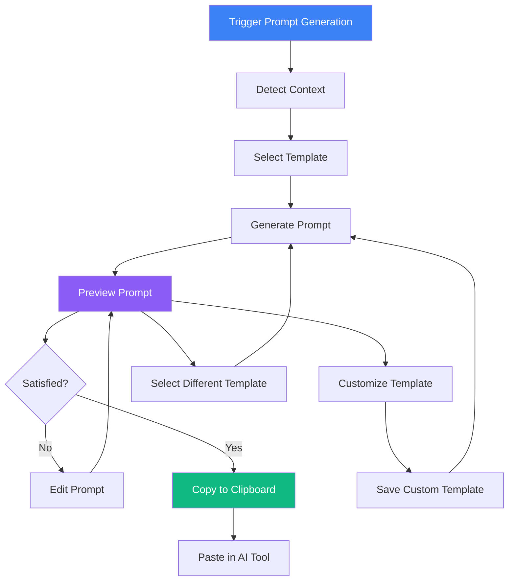

# One-Click AI Prompt Generation

## User Story

**As a developer who uses AI coding assistants**, I want to generate context-rich prompts with one click that include relevant metrics, dependencies, and code snippets, so that I can get better AI-assisted refactoring suggestions.

## User Need

When using AI tools (Claude, GPT, Copilot), prompt quality determines result quality. Developers manually construct prompts by:

- Copying file contents
- Describing the problem
- Adding context about dependencies
- Explaining what they want to achieve

This is tedious and inconsistent. Important context is often forgotten or poorly described.

One-click prompt generation:

- Includes all relevant context automatically
- Follows prompt engineering best practices
- Provides consistent, high-quality prompts
- Saves significant time per interaction

---

## UX Flow

### Entry Points

1. **File Detail:** "Generate AI Prompt" button
2. **Issue Card:** "Generate Refactoring Prompt" action
3. **Blast Radius:** "Generate Prompt" for hotspot
4. **Architectural Anti-Pattern:** "Generate Fix Prompt" action
5. **Keyboard:** Cmd+Shift+P from any file context

### User Journey



### Exit Points

1. **To Clipboard:** Copy prompt and use in external AI tool
2. **To Template Editor:** Customize prompt templates
3. **Back:** Cancel and return to previous view

---

## Information Architecture

### Prompt Templates

| Template                           | Use Case                     | Key Context                             |
| ---------------------------------- | ---------------------------- | --------------------------------------- |
| **Refactor for Complexity**        | Reduce cyclomatic complexity | Metrics, code, suggestions              |
| **Fix Architectural Anti-Pattern** | Address god component, etc.  | Anti-Pattern description, affected code |
| **Reduce Dependencies**            | Lower coupling               | Dependency graph, imports               |
| **Add Error Handling**             | Improve robustness           | Current code, error patterns            |
| **Improve Performance**            | Optimize hot code            | Metrics, usage patterns                 |
| **Add Documentation**              | Document complex code        | Code, complexity indicators             |
| **Split Component**                | Break up large components    | Component structure, dependencies       |
| **Extract Function**               | Reduce function size         | Function code, responsibilities         |

### Context Elements

| Element                  | Description                      | When Included             |
| ------------------------ | -------------------------------- | ------------------------- |
| **File Content**         | Full or relevant portion of code | Always                    |
| **Metrics**              | Complexity, LOC, etc.            | Always                    |
| **Dependencies**         | What this file imports           | When relevant             |
| **Dependents**           | What imports this file           | When relevant             |
| **Recent Changes**       | Git history                      | Optional                  |
| **Issues**               | Current issues in file           | When addressing issues    |
| **Architecture Context** | Related files and structure      | For architectural changes |

### Prompt Structure

```
[System Context]
- Role description for AI
- Output format expectations

[Problem Statement]
- What needs to be improved
- Metrics supporting the need

[Code Context]
- Relevant code snippets
- Dependency information
- File structure

[Constraints]
- Maintain existing functionality
- Preserve specific patterns
- Avoid certain changes

[Desired Outcome]
- Specific improvement goals
- Success criteria
```

---

## Interaction Patterns

### Generation Actions

| Action                | Trigger           | Result                 |
| --------------------- | ----------------- | ---------------------- |
| Quick generate        | One-click button  | Generate with defaults |
| Generate with options | Dropdown menu     | Choose template first  |
| Regenerate            | Button in preview | Create new prompt      |
| Edit before copy      | Edit button       | Modify in place        |

### Template Management

| Action             | Trigger                 | Result                        |
| ------------------ | ----------------------- | ----------------------------- |
| View templates     | Settings > AI Prompts   | List all templates            |
| Create template    | "New Template" button   | Template editor               |
| Edit template      | Click existing template | Edit mode                     |
| Duplicate template | Context menu            | Create copy for customization |
| Delete template    | Context menu            | Remove (with confirmation)    |

### Clipboard Actions

| Action            | Trigger        | Result                        |
| ----------------- | -------------- | ----------------------------- |
| Copy prompt       | "Copy" button  | Copy full prompt              |
| Copy code only    | "Copy Code"    | Copy just the code section    |
| Copy context only | "Copy Context" | Copy just the metrics/context |

---

## Component Map

### Primary Components

| Component | Import Path         | Configuration                               | Purpose                       |
| --------- | ------------------- | ------------------------------------------- | ----------------------------- |
| Modal     | `@vipr/ui/modal`    | `size="xl"`, `title="Generate AI Prompt"`   | Prompt generation dialog      |
| Dropdown  | `@vipr/ui/dropdown` | `variant="select"`, `options={templates}`   | Template selection            |
| Checkbox  | `@vipr/ui/checkbox` | `checked`, `onChange`, `label`              | Context inclusion toggles     |
| Textarea  | `@vipr/ui/textarea` | `readOnly`, `className="font-mono text-xs"` | Prompt display/editing        |
| Badge     | `@vipr/ui/badge`    | `variant="default"`, `size="sm"`            | Token count indicator         |
| Button    | `@vipr/ui/button`   | `appearance="primary\|secondary"`           | Copy to clipboard, regenerate |
| Alert     | `@vipr/ui/alert`    | `variant="toast"`, `type="success"`         | Copy success notification     |

### Color Tokens

**Prompt Display:**

```tsx
// Textarea background (code-like)
'bg-gray-50 dark:bg-gray-900 border border-gray-200 dark:border-gray-700';

// Token count badge
'bg-violet-100 dark:bg-violet-900/20 text-violet-700 dark:text-violet-300';
```

**Token Count Warnings:**

```tsx
// Safe (< 6000 tokens)
'bg-gray-100 dark:bg-gray-800 text-gray-700 dark:text-gray-300';

// Warning (6000-8000 tokens)
'bg-yellow-100 dark:bg-yellow-900/20 text-yellow-700 dark:text-yellow-300';

// Error (> 8000 tokens)
'bg-red-100 dark:bg-red-900/20 text-red-700 dark:text-red-300';
```

### Typography Tokens

**Prompt Text:**

- Font: `font-mono text-xs leading-relaxed`
- Color: `text-gray-800 dark:text-gray-100`

**Token Counter:**

- Count: `text-xs font-mono tabular-nums font-semibold`

### Layout Pattern: AI Prompt Modal

```tsx
const AIPromptModal: React.FC<AIPromptModalProps> = ({ open, onClose, context }) => {
  const [selectedTemplate, setSelectedTemplate] = useState('refactor');
  const [includeContext, setIncludeContext] = useState({
    codeSnippet: true,
    metrics: true,
    history: false,
  });
  const [generatedPrompt, setGeneratedPrompt] = useState('');
  const [tokenCount, setTokenCount] = useState(0);
  const [showCopyToast, setShowCopyToast] = useState(false);

  useEffect(() => {
    const prompt = generatePrompt(selectedTemplate, context, includeContext);
    setGeneratedPrompt(prompt);
    setTokenCount(estimateTokens(prompt));
  }, [selectedTemplate, context, includeContext]);

  const handleCopyToClipboard = async () => {
    await navigator.clipboard.writeText(generatedPrompt);
    setShowCopyToast(true);
  };

  const getTokenBadgeVariant = () => {
    if (tokenCount > 8000) return 'error';
    if (tokenCount > 6000) return 'warning';
    return 'default';
  };

  return (
    <>
      <Modal
        open={open}
        onClose={onClose}
        title="Generate AI Prompt"
        size="xl"
        footer={
          <>
            <Button appearance="tertiary" onClick={onClose}>
              Close
            </Button>
            <Button appearance="secondary" onClick={handleRegenerate}>
              Regenerate
            </Button>
            <Button appearance="primary" onClick={handleCopyToClipboard}>
              Copy to Clipboard
            </Button>
          </>
        }
      >
        <div className="space-y-4">
          {/* Template Selector */}
          <Dropdown
            variant="select"
            label="Template"
            options={[
              { value: 'refactor', label: 'Refactor Complex Code' },
              { value: 'explain', label: 'Explain Code Logic' },
              { value: 'fix-issue', label: 'Fix Detected Issue' },
            ]}
            value={selectedTemplate}
            onChange={setSelectedTemplate}
            className="w-full"
          />

          {/* Context Inclusion */}
          <div>
            <label className="text-sm font-medium mb-2 block">Include Context</label>
            <div className="space-y-2">
              <Checkbox
                checked={includeContext.codeSnippet}
                onChange={checked => setIncludeContext(prev => ({ ...prev, codeSnippet: checked }))}
                label="Code snippet"
              />
              <Checkbox
                checked={includeContext.metrics}
                onChange={checked => setIncludeContext(prev => ({ ...prev, metrics: checked }))}
                label="Complexity metrics"
              />
              <Checkbox
                checked={includeContext.history}
                onChange={checked => setIncludeContext(prev => ({ ...prev, history: checked }))}
                label="Git history"
              />
            </div>
          </div>

          {/* Generated Prompt */}
          <div className="relative">
            <div className="flex items-center justify-between mb-2">
              <label className="text-sm font-medium">Generated Prompt</label>

              {/* Token Counter Badge - top-right */}
              <Badge variant={getTokenBadgeVariant()} size="sm" className="font-mono">
                {tokenCount.toLocaleString()} tokens
              </Badge>
            </div>

            <Textarea
              value={generatedPrompt}
              onChange={e => setGeneratedPrompt(e.target.value)}
              className="font-mono text-xs leading-relaxed min-h-[400px]"
            />
          </div>
        </div>
      </Modal>

      {/* Copy Success Toast */}
      <Alert
        variant="toast"
        type="success"
        open={showCopyToast}
        onClose={() => setShowCopyToast(false)}
        duration={3000}
      >
        Prompt copied to clipboard
      </Alert>
    </>
  );
};
```

### Token Counter Pattern

**Badge Placement:**

- Position at top-right of Textarea label row
- Use tabular-nums font variant for consistent width
- Color-code based on token count thresholds

```tsx
<div className="flex items-center justify-between mb-2">
  <label className="text-sm font-medium">Generated Prompt</label>

  {/* Token counter badge */}
  <Badge
    variant={tokenCount > 8000 ? 'error' : tokenCount > 6000 ? 'warning' : 'default'}
    size="sm"
    className="font-mono tabular-nums"
  >
    {tokenCount.toLocaleString()} tokens
  </Badge>
</div>
```

**Token Estimation:**

```typescript
function estimateTokens(text: string): number {
  // Rough approximation: ~4 characters per token
  return Math.ceil(text.length / 4);
}
```

### Integration with InsightCard

**InsightCard already has "Generate AI Prompt" action** - use same Modal:

```tsx
// InsightCard action button
<Button appearance="secondary" size="sm" onClick={() => setShowAIPromptModal(true)}>
  Generate AI Prompt
</Button>;

{
  /* Shared AI Prompt Modal */
}
<AIPromptModal
  open={showAIPromptModal}
  onClose={() => setShowAIPromptModal(false)}
  context={issue}
/>;
```

### Composition Guidelines

**DO:**

- ✅ Use Modal (size="xl") for spacious prompt editing
- ✅ Style Textarea with `font-mono text-xs`
- ✅ Show token count Badge at top-right
- ✅ Use Alert (toast variant) for copy confirmation
- ✅ Allow prompt editing before copying
- ✅ Color-code token count (default/warning/error)

**DON'T:**

- ❌ Build custom token visualization
- ❌ Create elaborate template editor
- ❌ Add real-time AI generation
- ❌ Over-engineer clipboard integration

**Keep it simple** - Template-based with token awareness.

---

## Visual Concepts

### Prompt Generation Modal

````
================================================================================
Generate AI Prompt
================================================================================

SOURCE: src/services/auth/index.ts

TEMPLATE: [Refactor for Complexity         v]

DETECTED CONTEXT:
  [x] File content (234 lines)
  [x] Complexity metrics (Cyclomatic: 45)
  [x] Dependencies (8 imports)
  [x] Dependents (12 files depend on this)
  [ ] Recent git history (last 10 commits)
  [ ] Related files (auth module)

PREVIEW:
+------------------------------------------------------------------+
| You are an expert TypeScript developer specializing in clean     |
| code and refactoring. I need help reducing the complexity of     |
| this authentication module.                                      |
|                                                                  |
| ## Current Metrics                                               |
| - Cyclomatic Complexity: 45 (target: &lt;20)                        |
| - Lines of Code: 234                                             |
| - Functions: 12                                                  |
| - Halstead Effort: 8,450                                         |
|                                                                  |
| ## Dependencies                                                  |
| This file imports: react, axios, @types/auth, ./token-storage,   |
| ./oauth-provider, ./session-manager, ./error-handler, ./config   |
|                                                                  |
| ## Dependents                                                    |
| 12 files depend on this module, including:                       |
| - Dashboard.tsx (imports: login, logout, getUser)                |
| - ProtectedRoute.tsx (imports: isAuthenticated)                  |
| - UserProfile.tsx (imports: getUser, updateUser)                 |
|                                                                  |
| ## Code                                                          |
| ```typescript                                                    |
| // src/services/auth/index.ts                                    |
| import { useState, useEffect } from 'react';                     |
| import axios from 'axios';                                       |
| // ... [truncated for preview, full code in actual prompt]       |
| ```                                                              |
|                                                                  |
| ## Request                                                       |
| Please refactor this code to:                                    |
| 1. Reduce cyclomatic complexity below 20                         |
| 2. Maintain all existing exports (don't break dependents)        |
| 3. Improve readability and maintainability                       |
| 4. Add brief comments explaining complex sections                |
|                                                                  |
| Provide the refactored code with explanations of changes.        |
+------------------------------------------------------------------+
                                                    [Scroll for more]

+---------------------+  +---------------------+  +---------------------+
|     [Edit]          |  |  [Regenerate]       |  |  [Copy to Clipboard]|
+---------------------+  +---------------------+  +---------------------+

================================================================================
````

### Template Editor

````
================================================================================
Edit Template: Refactor for Complexity
================================================================================

NAME: [Refactor for Complexity_____________________________]

SYSTEM PROMPT:
+------------------------------------------------------------------+
| You are an expert {{language}} developer specializing in clean   |
| code and refactoring.                                            |
+------------------------------------------------------------------+

VARIABLES:
  {{language}} - Detected file language (TypeScript, JavaScript, etc.)
  {{filename}} - Current file name
  {{filepath}} - Full file path
  {{complexity}} - Cyclomatic complexity score
  {{loc}} - Lines of code
  {{code}} - File content
  {{dependencies}} - Import list
  {{dependents}} - Files that import this

BODY TEMPLATE:
+------------------------------------------------------------------+
| I need help reducing the complexity of this module.              |
|                                                                  |
| ## Current Metrics                                               |
| - Cyclomatic Complexity: {{complexity}} (target: &lt;20)            |
| - Lines of Code: {{loc}}                                         |
| {{#if halstead}}                                                 |
| - Halstead Effort: {{halstead.effort}}                           |
| {{/if}}                                                          |
|                                                                  |
| ## Code                                                          |
| ```{{language}}                                                  |
| // {{filepath}}                                                  |
| {{code}}                                                         |
| ```                                                              |
|                                                                  |
| ## Request                                                       |
| Please refactor to reduce complexity while maintaining all       |
| existing exports.                                                |
+------------------------------------------------------------------+

INCLUDE BY DEFAULT:
  [x] File content
  [x] Metrics
  [x] Dependencies
  [ ] Dependents
  [ ] Git history

+---------------------+  +---------------------+
|     [Cancel]        |  |   [Save Template]   |
+---------------------+  +---------------------+

================================================================================
````

### Quick Action Button (Inline)

```
+------------------------------------------------------------------+
| Issue: High Cyclomatic Complexity (45)                            |
|                                                                   |
| This function has 45 independent paths...                         |
|                                                                   |
| [Generate AI Prompt] [Open in IDE] [Mark Accepted]                |
+------------------------------------------------------------------+
      ^
      |
      One-click generates prompt specific to this issue
```

---

## Psychological Principles

### Reduced Friction

One-click generation removes the barrier between identifying a problem and getting AI help. This encourages actually addressing issues rather than noting them for "later."

### Context Completeness

Humans often forget relevant context when manually constructing prompts. Automatic inclusion ensures nothing important is missed.

### Template Consistency

Templates encode best practices. Users benefit from prompt engineering expertise without needing to learn it themselves.

### Preview Before Commit

Showing the prompt before copying lets users verify context is appropriate and make adjustments if needed.

---

## Success Metrics

| Metric                 | Target | Measurement                           |
| ---------------------- | ------ | ------------------------------------- |
| Generation usage       | > 30%  | Files viewed that generate prompts    |
| Prompt quality         | > 80%  | AI responses rated helpful            |
| Edit rate              | < 20%  | Prompts that need editing before copy |
| Template customization | > 10%  | Users who create custom templates     |

---

## Integration with Broader Application

### Feature Dependencies

**Requires:**

- File analysis data (metrics, code)
- Dependency graph (for context)
- Issue detection (for issue-specific prompts)

**Enabled By:**

- Blast Radius (US-NEW-01) - Hotspot prompts
- Architectural AntiPatterns (US-NEW-04) - Anti-Pattern fix prompts
- Dependency Cascade (US-NEW-07) - Dependency context

### Data Sources

- File content from filesystem
- Metrics from analysis results
- Dependencies from import analysis
- Git history from git log
- Issues from insight detection

### Prompt Template Engine

```typescript
interface PromptTemplate {
  id: string;
  name: string;
  description: string;
  systemPrompt: string;
  bodyTemplate: string; // Handlebars-style templating
  defaultInclusions: ContextInclusion[];
  variables: TemplateVariable[];
}

interface ContextInclusion {
  type: 'code' | 'metrics' | 'dependencies' | 'dependents' | 'git' | 'issues';
  enabled: boolean;
  options?: Record<string, unknown>;
}

interface GeneratedPrompt {
  systemPrompt: string;
  body: string;
  fullPrompt: string;
  tokenEstimate: number;
  contextSources: string[];
}
```

### Security Considerations

- Sanitize code before including (no secrets)
- Warn if code contains potential API keys
- Limit prompt size to prevent token overflow
- Don't include .env files or credentials

---

## Open Questions

1. **Direct integration:** Should we integrate directly with AI APIs (Claude, GPT) instead of just clipboard?

2. **Token limits:** How do we handle files that exceed token limits? Truncation strategy?

3. **Multi-file prompts:** Should we support prompts spanning multiple files?

4. **Response parsing:** Should we help users apply AI suggestions back to code?

5. **Prompt history:** Should we save generated prompts for reuse or reference?
